# 面试突击班-02

<!-- readability-enhancement:start -->
> [!abstract] 速读地图
> 围绕「对象是否存活 -> 回收算法 -> STW -> 收集器」来背，面试容易追问优缺点。
>
> **本篇关键词：** <span style="color:#7c3aed;font-weight:700">GC</span> ・ <span style="color:#7c3aed;font-weight:700">可达性分析</span> ・ <span style="color:#dc2626;font-weight:700">STW</span> ・ <span style="color:#7c3aed;font-weight:700">三色标记</span> ・ <span style="color:#7c3aed;font-weight:700">垃圾收集器</span> ・ <span style="color:#7c3aed;font-weight:700">记忆集/卡表</span>
>
> **优先扫这些问题：**
> - 垃圾收集算法
> - 什么是STW（stop the world）？
> - 其他算法
> - 垃圾收集器
> - 什么是记忆集？

> [!success] 面试背诵小结
> - 回答时用「定义 -> 原理 -> 场景 -> 坑点」四段式，能显得更稳。
> - 二刷时先看上面的关键词，再回到正文找例子和代码。
> - 真被追问时，优先把相似概念做对比，而不是继续堆定义。

> [!warning] 易混提醒
> 易混：引用计数解决不了循环引用；三色标记关注并发标记时的漏标风险。
<!-- readability-enhancement:end -->

---


### 如何确定一个对象是垃圾？

> **要想进行垃圾回收，得先知道什么样的对象是垃圾。**

- 引用计数法 循环引用 引用 -- 对象--数据

**对于某个对象而言，只要应用程序中持有该对象的引用，就说明该对象不是垃圾，如果一个对象没有任何指针对其引用，它就是垃圾。**

`弊端`:如果AB相互持有引用，导致永远不能被回收。 循环引用 内存泄露 -->内存溢出

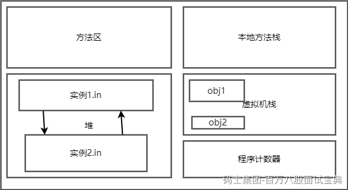

- 可达性分析/根搜索算法

- 从根上引用出一条单向的引用链，而在这个单向的引用链之上的对象，我们称之为GC的可达对象，不在引用链上的对象 我们称之为垃圾

**通过GC Root的引用，开始向下寻找，看某个对象是否可达**

*(⚠️ 图片缺失:源知识库原图已失效)*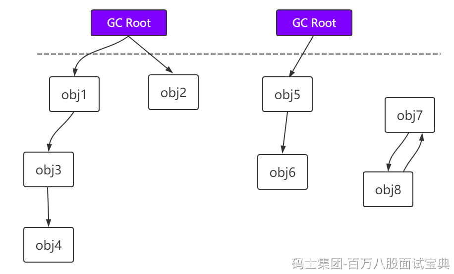

> **能作为GC Root:类加载器、Thread、虚拟机栈的本地变量表、static成员、常量引用、本地方法栈的变量等。 GC ROOT是根对象？？？ 错误 GC root 的本质是一组你可以直接或者间接使用的活跃引用**

```plain
虚拟机栈（栈帧中的本地变量表）中引用的对象。
方法区中类静态属性引用的对象。
方法区中常量引用的对象。
本地方法栈中JNI（即一般说的Native方法）引用的对象。  java   native  interface
```

## 垃圾收集算法

> **已经能够确定一个对象为垃圾之后，接下来要考虑的就是回收，怎么回收呢？得要有对应的算法，下面介绍常见的垃圾回收算法。高效 健壮 数据结构 + 算法**

#### 标记-清除(Mark-Sweep)

- **标记**

**找出内存中所有的存活对象，并且把它们标记出来**

*(⚠️ 图片缺失:源知识库原图已失效)*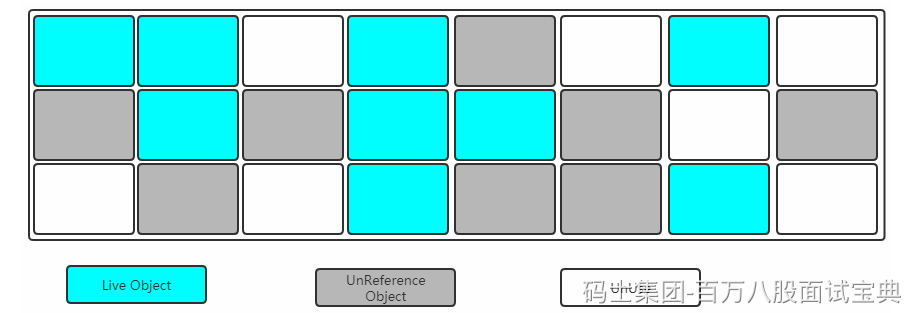

- **清除**

**清除掉被没有被标记需要回收的对象，释放出对应的内存空间**

*(⚠️ 图片缺失:源知识库原图已失效)*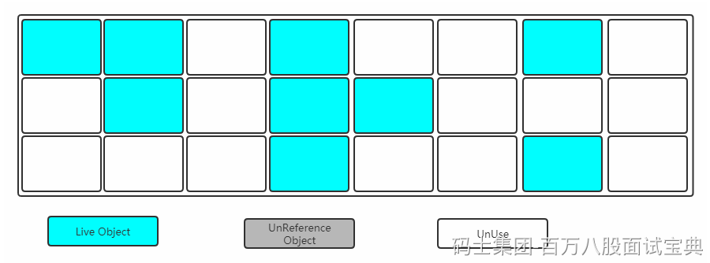

`缺点`

```plain
标记清除之后会产生大量不连续的内存碎片，空间碎片太多可能会导致以后在程
序运行过程中需要分配较大对象时，无法找到足够的连续内存而不得不提前触发另一次垃圾收集动作。
(1)标记和清除两个过程都比较耗时，效率不高
(2)会产生大量不连续的内存碎片，空间碎片太多可能会导致以后在程序运行过程中需要分配较大对象时，无法找到足够的连续内存而不得不提前触发另一次垃圾收集动作。
```

#### **标记清除算法的衍生规则之分配（动态分区分配策略）**

**首次适应算法（Fisrt-fit）**

首次适应算法（Fisrt-fit）就是在遍历空闲链表的时候，一旦发现有大小大于等于需要的大小之后，就立即把该块分配给对象，并立即返回。

**最佳适应算法（Best-fit）**

最佳适应算法（Best-fit）就是在遍历空闲链表的时候，返回刚好等于需要大小的块。

**最差适应算法（Worst-fit）**

最差适应算法（Worst-fit）就是在遍历空闲链表的时候，找出空闲链表中最大的分块，将其分割给申请的对象，其目的就是使得分割后分块的最大化，以便下次好分配，不过这种分配算法很容易产生很多很小的分块，这些分块也不能被使用

## 什么是STW（stop the world）？

Stop-The-World 简称 STW

是在垃圾回收算法执行过程中,将jvm内存冻结,停顿的一种状态，在Stw情况下，容易出现两种现象：

**该回收的对象没有被回收**

**不该回收的对象被回收了**

在STW状态下,所有的线程都是停止运行的 - >垃圾回收线程除外

当STW发生时,出了GC所需要的线程,其他的线程都将停止工作,中断了的线程知道GC线程结束才会继续任务

STW是不可避免的,垃圾回收算法的执行一定会出现STW,而我们最好的解决办法就是减少停顿的时间

GC各种算法的优化重点就是为了减少STW,这也是JVM调优的重点。

#### 标记-复制(Mark-Copying) 效率很高

**将内存划分为两块相等的区域，每次只使用其中一块，如下图所示：**

*(⚠️ 图片缺失:源知识库原图已失效)*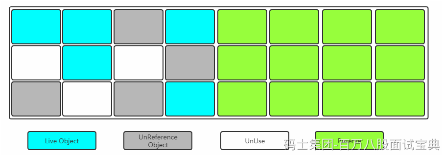

**当其中一块内存使用完了，就将还存活的对象复制到另外一块上面，然后把已经使用过的内存空间一次清除掉。**

*(⚠️ 图片缺失:源知识库原图已失效)*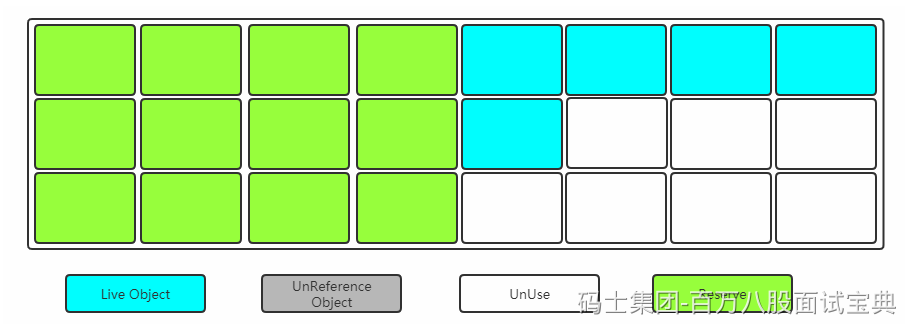

`缺点:`空间利用率降低。

#### 标记-整理(Mark-Compact) 标记压缩算法

#### 随机整理 线性整理 滑动整理

> **复制收集算法在对象存活率较高时就要进行较多的复制操作，效率将会变低。更关键的是，如果不想浪费50%的空间，就需要有额外的空间进行分配担保，以应对被使用的内存中所有对象都有100%存活的极端情况，所以老年代一般不能直接选用这种算法。**

**标记过程仍然与"标记-清除"算法一样，但是后续步骤不是直接对可回收对象进行清理，而是让所有存活的对象都向一端移动，然后直接清理掉端边界以外的内存。**

> **其实上述过程相对"复制算法"来讲，少了一个"保留区"**

*(⚠️ 图片缺失:源知识库原图已失效)*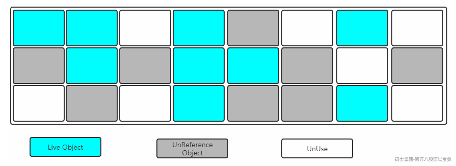

**让所有存活的对象都向一端移动，清理掉边界意外的内存。**

*(⚠️ 图片缺失:源知识库原图已失效)*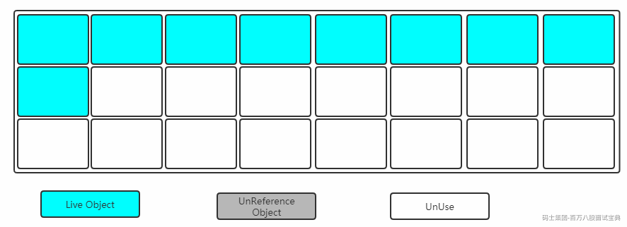

### 分代收集算法

> **既然上面介绍了3中垃圾收集算法，那么在堆内存中到底用哪一个呢？**

**Young区：复制算法(对象在被分配之后，可能生命周期比较短，Young区复制效率比较高)**

**Old区：标记清除或标记整理(Old区对象存活时间比较长，复制来复制去没必要，不如做个标记再清理)**

## 其他算法

增量回收算法：

垃圾回收其实就是对不需要的内存对象进行清理，前面提到的GC算法，无论哪种，基本都是过一段时间对所有的内存空间对象进行一次大扫除。 这种的GC缺点是一旦开始启动，管理程序可能就停止了，表现就是可能好多程序都没响应。可在服务端，这是大忌。增量式（incremental）出现就是解决这个问题的，这种垃圾回收采用和应用程序交替进行的方式来工作，表现就像是GC在不断的定时迭加操作。从而尽量减轻应用程序的停止时间，这就是增量式回收的特点。  
在增量式回收里，比较容易接触到的就是三色标记算法。

### 三色标记

在并发标记的过程中，因为标记期间应用线程还在继续跑，对象间的引用可能发生变化，多标和漏标的情况就有可能发生。这里引入“三色标记”来给大家解释下，把Gc roots可达性分析遍历对象过程中遇到的对象， 按照“是否访问过”这个条件标记成以下三种颜色：

**灰色：**

```plain
表示对象已经被垃圾收集器访问过， 但这个对象上至少存在一个引用还没有被扫描过。
```

**白色:**

```plain
表示对象尚未被垃圾收集器访问过。 显然在可达性分析刚刚开始的阶段， 所有的对象都是白色的， 若在分析结束的阶段， 仍然是白色的对象， 即代表不可达。
```

**黑色：**

```plain
表示对象已经被垃圾收集器访问过， 且这个对象的所有引用都已经扫描过。 黑色的对象代表已经扫描过， 它是安全存活的， 如果有其他对象引用指向了黑色对象， 无须重新扫描一遍。 黑色对象不可能直接（不经过灰色对象） 指向某个白色对象。
```

标记过程：

1.初始时，所有对象都在 【白色集合】中；

2.将GC Roots 直接引用到的对象 挪到 【灰色集合】中；

3.从灰色集合中获取对象：

4. 将本对象 引用到的 其他对象 全部挪到 【灰色集合】中；

5. 将本对象 挪到 【黑色集合】里面。

重复步骤3.4，直至【灰色集合】为空时结束。

结束后，仍在【白色集合】的对象即为GC Roots 不可达，可以进行回收

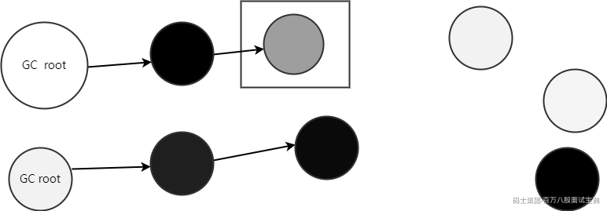

**多标-浮动垃圾**

```plain
在并发标记过程中，如果由于方法运行结束导致部分局部变量(gcroot)被销毁，这个gc  root引用的对象之前又被扫描过 (被标记为非垃圾对象)，那么本轮GC不会回收这部分内存。这部分本应该回收但是没有回收到的内存，被称之为“浮动 垃圾”。浮动垃圾并不会影响垃圾回收的正确性，只是需要等到下一轮垃圾回收中才被清除。

另外，针对并发标记(还有并发清理)开始后产生的新对象，通常的做法是直接全部当成黑色，本轮不会进行清除。这部分 对象期间可能也会变为垃圾，这也算是浮动垃圾的一部分。
```

**漏标-读写屏障**

漏标只有**同时满足**以下两个条件时才会发生：

```plain
条件一：灰色对象 断开了 白色对象的引用；即灰色对象 原来成员变量的引用 发生了变化。

条件二：黑色对象 重新引用了 该白色对象；即黑色对象 成员变量增加了 新的引用。
```

漏标会导致被引用的对象被当成垃圾误删除，这是严重bug，必须解决，有两种解决方案： **增量更新（Incremental Update） 和原始快照（Snapshot At The Beginning，SATB）** 。

**增量更新**就是当黑色对象**插入新的指向**白色对象的引用关系时， 就将这个新插入的引用记录下来， 等并发扫描结束之后， 再将这些记录过的引用关系中的黑色对象为根， 重新扫描一次。 这可以简化理解为， 黑色对象一旦新插入了指向白色对象的引用之后， 它就变回灰色对象了。

**原始快照**就是当灰色对象要**删除指向**白色对象的引用关系时， 就将这个要删除的引用记录下来， 在并发扫描结束之后， 再将这些记录过的引用关系中的灰色对象为根， 重新扫描一次，这样就能扫描到白色的对象，将白色对象直接标记为黑色(目的就是让这种对象在本轮gc清理中能存活下来，待下一轮gc的时候重新扫描，这个对象也有可能是浮动垃圾)

以上**无论是对引用关系记录的插入还是删除， 虚拟机的记录操作都是通过写屏障实现的。**

**写屏障实现原始快照（SATB）：** 当对象B的成员变量的引用发生变化时，比如引用消失（a.b.d = null），我们可以利用写屏障，将B原来成员变量的引用对象D记录下来：

**写屏障实现增量更新：** 当对象A的成员变量的引用发生变化时，比如新增引用（a.d = d），我们可以利用写屏障，将A新的成员变量引用对象D 记录下来：

## 垃圾收集器

> **如果说收集算法是内存回收的方法论，那么垃圾收集器就是内存回收的具体实现。**

*(⚠️ 图片缺失:源知识库原图已失效)*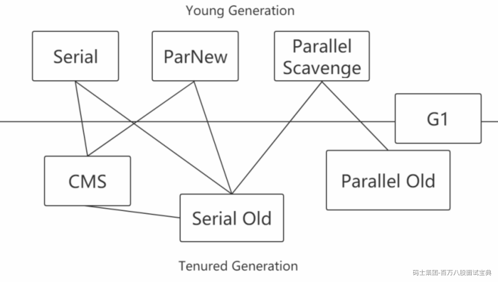

- Serial

**Serial收集器是最基本、发展历史最悠久的收集器，曾经（在JDK1.3.1之前）是虚拟机新生代收集的唯一选择。**

**它是一种单线程收集器，不仅仅意味着它只会使用一个CPU或者一条收集线程去完成垃圾收集工作，更重要的是其在进行垃圾收集的时候需要暂停其他线程。**

```plain
优点：简单高效，拥有很高的单线程收集效率
缺点：收集过程需要暂停所有线程
算法：复制算法
适用范围：新生代
应用：Client模式下的默认新生代收集器
```

*(⚠️ 图片缺失:源知识库原图已失效)*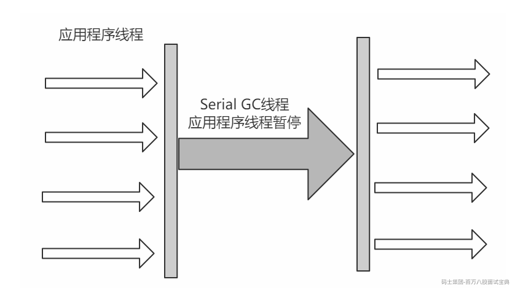

- Serial Old

Serial Old收集器是Serial收集器的老年代版本，也是一个单线程收集器，不同的是采用"**标记-整理算法**"，运行过程和Serial收集器一样。

*(⚠️ 图片缺失:源知识库原图已失效)*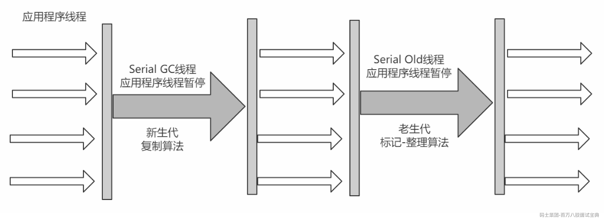

- ParNew

**可以把这个收集器理解为Serial收集器的多线程版本。**

```plain
优点：在多CPU时，比Serial效率高。
缺点：收集过程暂停所有应用程序线程，单CPU时比Serial效率差。
算法：复制算法
适用范围：新生代
应用：运行在Server模式下的虚拟机中首选的新生代收集器
```

*(⚠️ 图片缺失:源知识库原图已失效)*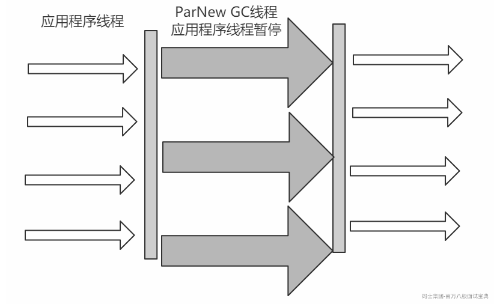

- Parallel Scavenge

**Parallel Scavenge收集器是一个新生代收集器，它也是使用复制算法的收集器，又是并行的多线程收集器，看上去和ParNew一样，但是Parallel Scanvenge更关注系统的吞吐量**。

> **吞吐量=运行用户代码的时间/(运行用户代码的时间+垃圾收集时间)**
>
> **比如虚拟机总共运行了100分钟，垃圾收集时间用了1分钟，吞吐量=(100-1)/100=99%。**
>
> **若吞吐量越大，意味着垃圾收集的时间越短，则用户代码可以充分利用CPU资源，尽快完成程序的运算任务。**

```plain
-XX:MaxGCPauseMillis控制最大的垃圾收集停顿时间，
-XX:GCRatio直接设置吞吐量的大小。
```

- Parallel Old 停顿时间 吞吐量 百分比的数字

**Parallel Old收集器是Parallel Scavenge收集器的老年代版本，使用多线程和标记-整理算法**进行垃圾回收，也是更加关注系统的**吞吐量**。

- CMS

> `官网`： <https://docs.oracle.com/javase/8/docs/technotes/guides/vm/gctuning/cms.html#concurrent_mark_sweep_cms_collector>
>
> **CMS(Concurrent Mark Sweep)收集器是一种以获取** `最短回收停顿时间`为目标的收集器。
>
> **采用的是"标记-清除算法",整个过程分为4步**

```plain
(1)初始标记 CMS initial mark     标记GC Roots直接关联对象，不用Tracing，速度很快
(2)并发标记 CMS concurrent mark  进行GC Roots Tracing
(3)重新标记 CMS remark           修改并发标记因用户程序变动的内容
(4)并发清除 CMS concurrent sweep 清除不可达对象回收空间，同时有新垃圾产生，留着下次清理称为浮动垃圾
```

> **由于整个过程中，并发标记和并发清除，收集器线程可以与用户线程一起工作，所以总体上来说，CMS收集器的内存回收过程是与用户线程一起并发地执行的。**

*(⚠️ 图片缺失:源知识库原图已失效)*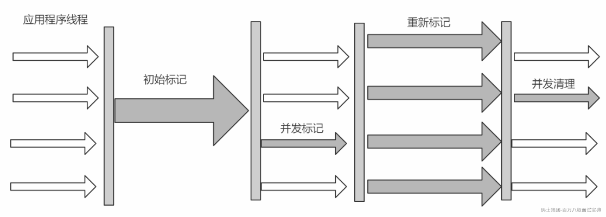

```plain
优点：并发收集、低停顿
缺点：产生大量空间碎片、并发阶段会降低吞吐量

```

## 什么是记忆集？

当我们进行young gc时，我们的**gc roots除了常见的栈引用、静态变量、常量、锁对象、class对象**这些常见的之外，如果 **老年代有对象引用了我们的新生代对象** ，那么老年代的对象也应该加入gc roots的范围中，但是如果每次进行young gc我们都需要扫描一次老年代的话，那我们进行垃圾回收的代价实在是太大了，因此我们引入了一种叫做记忆集的抽象数据结构来记录这种引用关系。

记忆集是一种用于记录从非收集区域指向收集区域的指针集合的数据结构。

```plain
如果我们不考虑效率和成本问题，我们可以用一个数组存储所有有指针指向新生代的老年代对象。但是如果这样的话我们维护成本就很好，打个比方，假如所有的老年代对象都有指针指向了新生代，那么我们需要维护整个老年代大小的记忆集，毫无疑问这种方法是不可取的。因此我们引入了卡表的数据结构
```

### 卡表

记忆集是我们针对于跨代引用问题提出的思想，而卡表则是针对于该种思想的具体实现。（可以理解为记忆集是结构，卡表是实现类）

[1字节，00000000，1字节，1字节]

```plain
在hotspot虚拟机中，卡表是一个字节数组，数组的每一项对应着内存中的某一块连续地址的区域，如果该区域中有引用指向了待回收区域的对象，卡表数组对应的元素将被置为1，没有则置为0；
```

(1) 卡表是使用一个字节数组实现:CARD\_TABLE[],每个元素对应着其标识的内存区域一块特定大小的内存块,称为"卡页"。hotSpot使用的卡页是2^9大小,即512字节

(2) 一个卡页中可包含多个对象,只要有一个对象的字段存在跨代指针,其对应的卡表的元素标识就变成1,表示该元素变脏,否则为0。GC时,只要筛选本收集区的卡表中变脏的元素加入GC Roots里。

卡表的使用图例

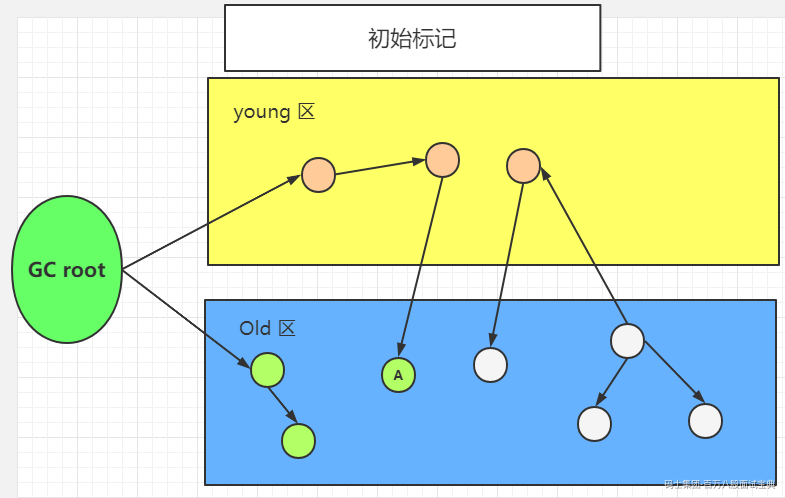

并发标记的时候，A对象发生了所在的引用发生了变化，所以A对象所在的块被标记为脏卡

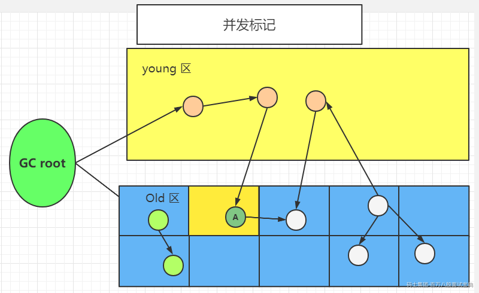

继续往下到了重新标记阶段，修改对象的引用，同时清除脏卡标记。

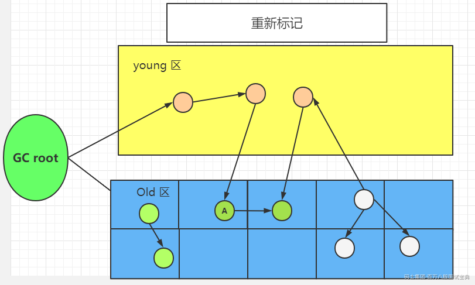

**卡表其他作用：**

老年代识别新生代的时候

对应的card table被标识为相应的值（card table中是一个byte，有八位，约定好每一位的含义就可区分哪个是引用新生代，哪个是并发标记阶段修改过的）


