# 面试突击班-03

<!-- readability-enhancement:start -->
> [!abstract] 速读地图
> 这篇偏 JVM 调优实战：先认参数和命令，再讲 G1、日志分析和业务场景下的取舍。
>
> **本篇关键词：** <span style="color:#7c3aed;font-weight:700">JVM调优</span> ・ <span style="color:#7c3aed;font-weight:700">G1</span> ・ <span style="color:#7c3aed;font-weight:700">JVM参数</span> ・ <span style="color:#7c3aed;font-weight:700">GC日志</span> ・ <span style="color:#7c3aed;font-weight:700">Region</span> ・ <span style="color:#d97706;font-weight:700">亿级流量</span>
>
> **优先扫这些问题：**
> - JVM常用参数有哪些？
> - JVM参数
> - JVM常用命令有哪些
> - JVM常用参数以及垃圾收集器常见参数（一般会问你怎么调整的垃圾收集器的具体参数，上节课是泛参数）：
> - JVM调优 调整某些参数 为了让程序达到硬件性能瓶颈
> - 亿级流量电商系统JVM调优

> [!success] 面试背诵小结
> - 回答时用「定义 -> 原理 -> 场景 -> 坑点」四段式，能显得更稳。
> - 二刷时先看上面的关键词，再回到正文找例子和代码。
> - 真被追问时，优先把相似概念做对比，而不是继续堆定义。

> [!warning] 易混提醒
> 易混：调优不是盲目调大内存，目标是降低停顿、稳定吞吐，并用 GC 日志验证。
<!-- readability-enhancement:end -->

---


#### G1(Garbage-First)

> `官网`： <https://docs.oracle.com/javase/8/docs/technotes/guides/vm/gctuning/g1_gc.html#garbage_first_garbage_collection>
>
> 使用G1收集器时，Java堆的内存布局与就与其他收集器有很大差别，它将整个Java堆划分为多个大小相等的独立区域（Region），虽然还保留有新生代和老年代的概念，但新生代和老年代不再是物理隔离的了，它们都是一部分Region（不需要连续）的集合。
>
> 每个Region大小都是一样的，可以是1M到32M之间的数值，但是必须保证是2的n次幂
>
> 如果对象太大，一个Region放不下[超过Region大小的50%]，那么就会直接放到H中
>
> 设置Region大小：-XX:G1HeapRegionSize=M
>
> 所谓Garbage-Frist，其实就是优先回收垃圾最多的Region区域

```plain
（1）分代收集（仍然保留了分代的概念）
（2）空间整合（整体上属于“标记-整理”算法，不会导致空间碎片）
（3）可预测的停顿（比CMS更先进的地方在于能让使用者明确指定一个长度为M毫秒的时间片段内，消耗在垃圾收集上的时间不得超过N毫秒）
```

*(⚠️ 图片缺失:源知识库原图已失效)*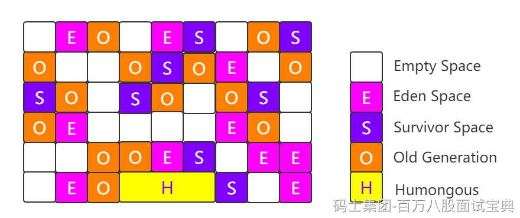

工作过程可以分为如下几步

```plain
初始标记（Initial Marking）      标记以下GC Roots能够关联的对象，并且修改TAMS的值，需要暂停用户线程
并发标记（Concurrent Marking）   从GC Roots进行可达性分析，找出存活的对象，与用户线程并发执行
最终标记（Final Marking）        修正在并发标记阶段因为用户程序的并发执行导致变动的数据，需暂停用户线程
筛选回收（Live Data Counting and Evacuation） 对各个Region的回收价值和成本进行排序，根据用户所期望的GC停顿时间制定回收计划
```

*(⚠️ 图片缺失:源知识库原图已失效)*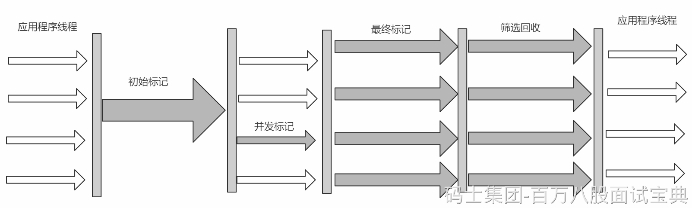

## JVM常用参数有哪些？

## JVM参数

### 3.1.1 标准参数

```plain
-version
-help
-server
-cp
```

*(⚠️ 图片缺失:源知识库原图已失效)*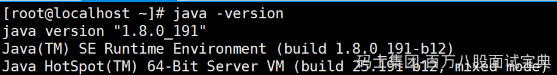

### 3.1.2 -X参数

> 非标准参数，也就是在JDK各个版本中可能会变动

```plain
-Xint     解释执行
-Xcomp    第一次使用就编译成本地代码
-Xmixed   混合模式，JVM自己来决定
```

*(⚠️ 图片缺失:源知识库原图已失效)*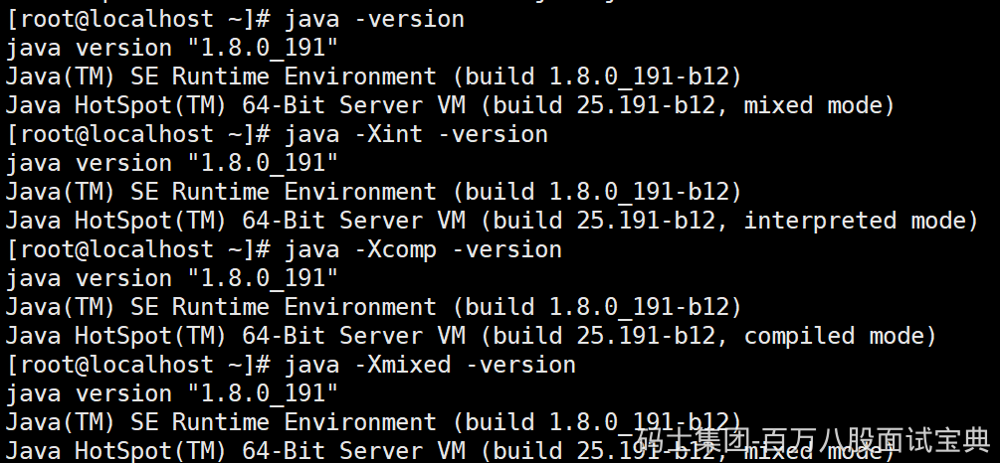

### 3.1.3 -XX参数

> 使用得最多的参数类型
>
> 非标准化参数，相对不稳定，主要用于JVM调优和Debug

```plain
a.Boolean类型
格式：-XX:[+-]<name>            +或-表示启用或者禁用name属性
比如：-XX:+UseConcMarkSweepGC   表示启用CMS类型的垃圾回收器
     -XX:+UseG1GC              表示启用G1类型的垃圾回收器
b.非Boolean类型
格式：-XX<name>=<value>表示name属性的值是value
比如：-XX:MaxGCPauseMillis=500   
```

### 3.1.4 其他参数

```plain
-Xms1000M等价于-XX:InitialHeapSize=1000M
-Xmx1000M等价于-XX:MaxHeapSize=1000M
-Xss100等价于-XX:ThreadStackSize=100
```

> 所以这块也相当于是-XX类型的参数

### 3.1.5 查看参数

> java -XX:+PrintFlagsFinal -version > flags.txt

*(⚠️ 图片缺失:源知识库原图已失效)*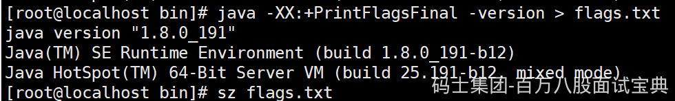

*(⚠️ 图片缺失:源知识库原图已失效)*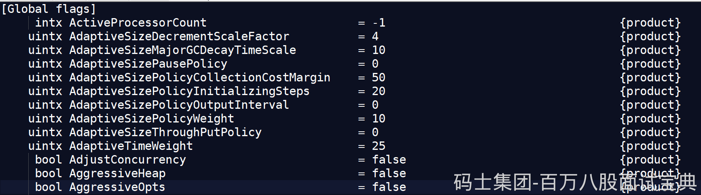

> 值得注意的是"="表示默认值，":="表示被用户或JVM修改后的值  
> 要想查看某个进程具体参数的值，可以使用jinfo，这块后面聊  
> 一般要设置参数，可以先查看一下当前参数是什么，然后进行修改

### 3.1.6 设置参数的常见方式

- 开发工具中设置比如IDEA，eclipse

- 运行jar包的时候:java -XX:+UseG1GC xxx.jar

- web容器比如tomcat，可以在脚本中的进行设置

- 通过jinfo实时调整某个java进程的参数(参数只有被标记为manageable的flags可以被实时修改)

### 3.1.7 实践和单位换算

```plain
1Byte(字节)=8bit(位)
1KB=1024Byte(字节)
1MB=1024KB
1GB=1024MB
1TB=1024GB
```

```plain
(1)设置堆内存大小和参数打印
-Xmx100M -Xms100M -XX:+PrintFlagsFinal
(2)查询+PrintFlagsFinal的值
:=true
(3)查询堆内存大小MaxHeapSize
:= 104857600
(4)换算
104857600(Byte)/1024=102400(KB)
102400(KB)/1024=100(MB)
(5)结论
104857600是字节单位
```

### 3.1.8 常用参数含义

|  |  |  |
| --- | --- | --- |
| 参数 | 含义 | 说明 |
| -XX:CICompilerCount=3 | 最大并行编译数 | 如果设置大于1，虽然编译速度会提高，但是同样影响系统稳定性，会增加JVM崩溃的可能 |
| -XX:InitialHeapSize=100M | 初始化堆大小 | 简写-Xms100M |
| -XX:MaxHeapSize=100M | 最大堆大小 | 简写-Xms100M |
| -XX:NewSize=20M | 设置年轻代的大小 |  |
| -XX:MaxNewSize=50M | 年轻代最大大小 |  |
| -XX:OldSize=50M | 设置老年代大小 |  |
| -XX:MetaspaceSize=50M | 设置方法区大小 |  |
| -XX:MaxMetaspaceSize=50M | 方法区最大大小 |  |
| -XX:+UseParallelGC | 使用UseParallelGC | 新生代，吞吐量优先 |
| -XX:+UseParallelOldGC | 使用UseParallelOldGC | 老年代，吞吐量优先 |
| -XX:+UseConcMarkSweepGC | 使用CMS | 老年代，停顿时间优先 |
| -XX:+UseG1GC | 使用G1GC | 新生代，老年代，停顿时间优先 |
| -XX:NewRatio | 新老生代的比值 | 比如-XX:Ratio=4，则表示新生代:老年代=1:4，也就是新生代占整个堆内存的1/5 |
| -XX:SurvivorRatio | 两个S区和Eden区的比值 | 比如-XX:SurvivorRatio=8，也就是(S0+S1):Eden=2:8，也就是一个S占整个新生代的1/10 |
| -XX:+HeapDumpOnOutOfMemoryError | 启动堆内存溢出打印 | 当JVM堆内存发生溢出时，也就是OOM，自动生成dump文件 |
| -XX:HeapDumpPath=heap.hprof | 指定堆内存溢出打印目录 | 表示在当前目录生成一个heap.hprof文件 |
| -XX:+PrintGCDetails -XX:+PrintGCTimeStamps -XX:+PrintGCDateStamps -Xloggc:g1-gc.log | 打印出GC日志 | 可以使用不同的垃圾收集器，对比查看GC情况 |
| -Xss128k | 设置每个线程的堆栈大小 | 经验值是3000-5000最佳 |
| -XX:MaxTenuringThreshold=6 | 提升年老代的最大临界值 | 默认值为 15 |
| -XX:InitiatingHeapOccupancyPercent | 启动并发GC周期时堆内存使用占比 | G1之类的垃圾收集器用它来触发并发GC周期,基于整个堆的使用率,而不只是某一代内存的使用比. 值为 0 则表示”一直执行GC循环”. 默认值为 45. |
| -XX:G1HeapWastePercent | 允许的浪费堆空间的占比 | 默认是10%，如果并发标记可回收的空间小于10%,则不会触发MixedGC。 |
| -XX:MaxGCPauseMillis=200ms | G1最大停顿时间 | 暂停时间不能太小，太小的话就会导致出现G1跟不上垃圾产生的速度。最终退化成Full GC。所以对这个参数的调优是一个持续的过程，逐步调整到最佳状态。 |
| -XX:ConcGCThreads=n | 并发垃圾收集器使用的线程数量 | 默认值随JVM运行的平台不同而不同 |
| -XX:G1MixedGCLiveThresholdPercent=65 | 混合垃圾回收周期中要包括的旧区域设置占用率阈值 | 默认占用率为 65% |
| -XX:G1MixedGCCountTarget=8 | 设置标记周期完成后，对存活数据上限为 G1MixedGCLIveThresholdPercent 的旧区域执行混合垃圾回收的目标次数 | 默认8次混合垃圾回收，混合回收的目标是要控制在此目标次数以内 |
| -XX:G1OldCSetRegionThresholdPercent=1 | 描述Mixed GC时，Old Region被加入到CSet中 | 默认情况下，G1只把10%的Old Region加入到CSet中 |
|  |  |  |

## JVM常用命令有哪些

### jps

> 查看java进程

```plain
The jps command lists the instrumented Java HotSpot VMs on the target system. The command is limited to reporting information on JVMs for which it has the access permissions.
```

*(⚠️ 图片缺失:源知识库原图已失效)*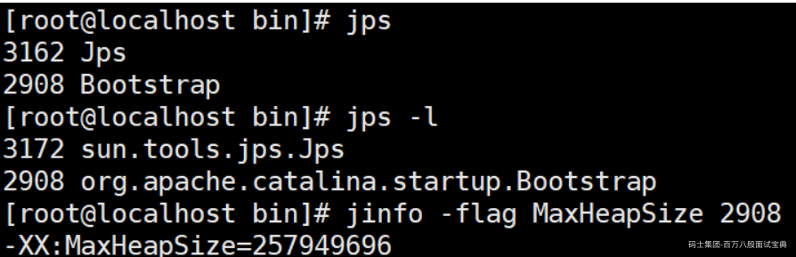

### jinfo

> （1）实时查看和调整JVM配置参数

```plain
The jinfo command prints Java configuration information for a specified Java process or core file or a remote debug server. The configuration information includes Java system properties and Java Virtual Machine (JVM) command-line flags.
```

> （2）查看用法
>
> jinfo -flag name PID 查看某个java进程的name属性的值

```plain
jinfo -flag MaxHeapSize PID 
jinfo -flag UseG1GC PID
```

*(⚠️ 图片缺失:源知识库原图已失效)*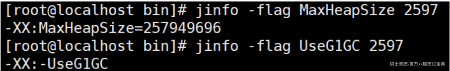

> （3）修改
>
> **参数只有被标记为manageable的flags可以被实时修改**

```plain
jinfo -flag [+|-] PID
jinfo -flag <name>=<value> PID
```

> （4）查看曾经赋过值的一些参数

```plain
jinfo -flags PID
```

*(⚠️ 图片缺失:源知识库原图已失效)*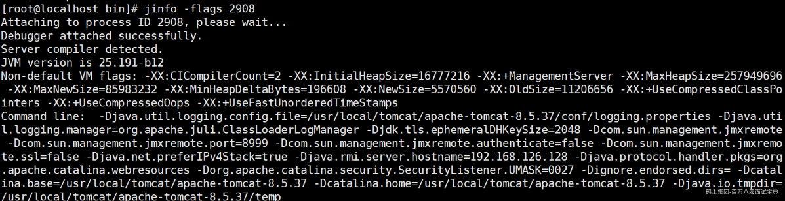

### jstat

> （1）查看虚拟机性能统计信息

```plain
The jstat command displays performance statistics for an instrumented Java HotSpot VM. The target JVM is identified by its virtual machine identifier, or vmid option.
```

> （2）查看类装载信息

```plain
jstat -class PID 1000 10   查看某个java进程的类装载信息，每1000毫秒输出一次，共输出10次
```

*(⚠️ 图片缺失:源知识库原图已失效)*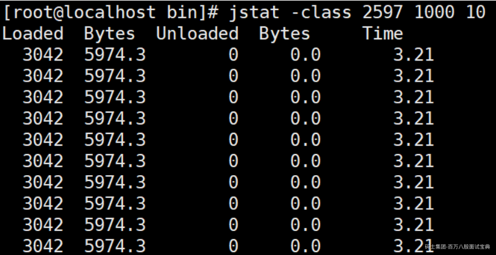

> （3）查看垃圾收集信息

```plain
jstat -gc PID 1000 10
```

*(⚠️ 图片缺失:源知识库原图已失效)*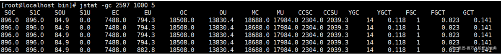

### jstack

> （1）查看线程堆栈信息

```plain
The jstack command prints Java stack traces of Java threads for a specified Java process, core file, or remote debug server.
```

> （2）用法

```plain
jstack PID
```

*(⚠️ 图片缺失:源知识库原图已失效)*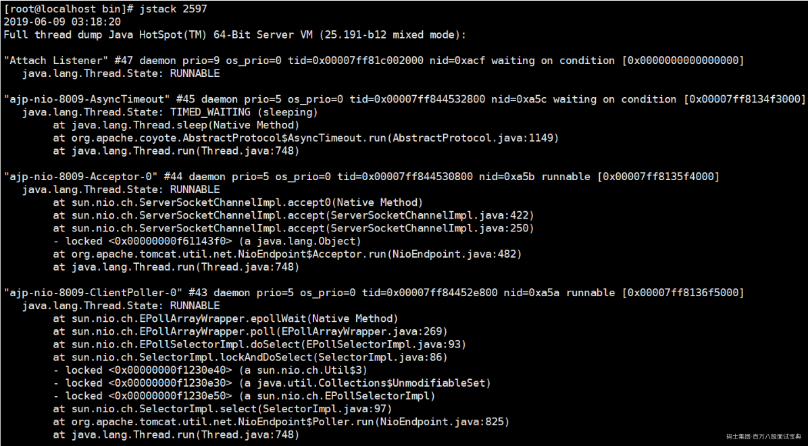

> (4)排查死锁案例

- DeadLockDemo

```java
//运行主类
public class DeadLockDemo
{
    public static void main(String[] args)
    {
        DeadLock d1=new DeadLock(true);
        DeadLock d2=new DeadLock(false);
        Thread t1=new Thread(d1);
        Thread t2=new Thread(d2);
        t1.start();
        t2.start();
    }
}
//定义锁对象
class MyLock{
    public static Object obj1=new Object();
    public static Object obj2=new Object();
}
//死锁代码
class DeadLock implements Runnable{
    private boolean flag;
    DeadLock(boolean flag){
        this.flag=flag;
    }
    public void run() {
        if(flag) {
            while(true) {
                synchronized(MyLock.obj1) {
                    System.out.println(Thread.currentThread().getName()+"----if获得obj1锁");
                    synchronized(MyLock.obj2) {
                        System.out.println(Thread.currentThread().getName()+"----if获得obj2锁");
                    }
                }
            }
        }
        else {
            while(true){
                synchronized(MyLock.obj2) {
                    System.out.println(Thread.currentThread().getName()+"----否则获得obj2锁");
                    synchronized(MyLock.obj1) {
                        System.out.println(Thread.currentThread().getName()+"----否则获得obj1锁");

                    }
                }
            }
        }
    }
}
```

- 运行结果

*(⚠️ 图片缺失:源知识库原图已失效)*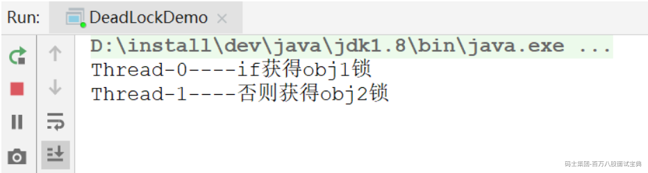

- jstack分析

*(⚠️ 图片缺失:源知识库原图已失效)*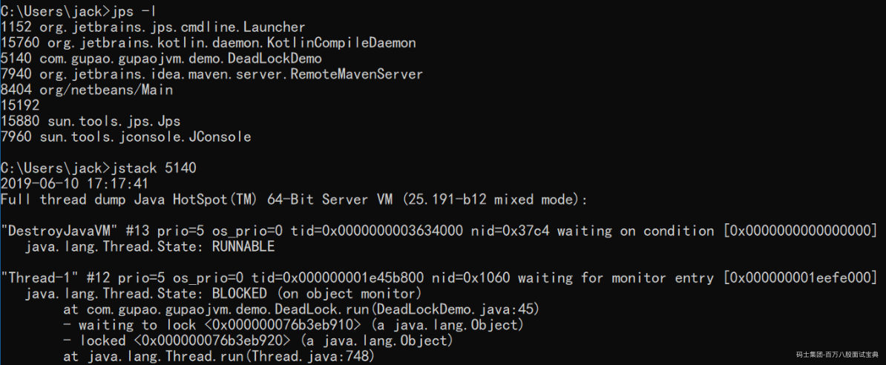

> 把打印信息拉到最后可以发现

*(⚠️ 图片缺失:源知识库原图已失效)*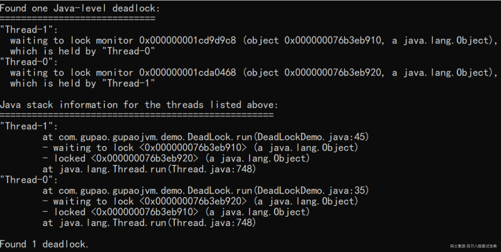

### jmap

> （1）生成堆转储快照

```plain
The jmap command prints shared object memory maps or heap memory details of a specified process, core file, or remote debug server.
```

> （2）打印出堆内存相关信息

```plain
jmap -heap PID
```

```plain
jinfo -flag UsePSAdaptiveSurvivorSizePolicy 35352
-XX:SurvivorRatio=8
```

*(⚠️ 图片缺失:源知识库原图已失效)*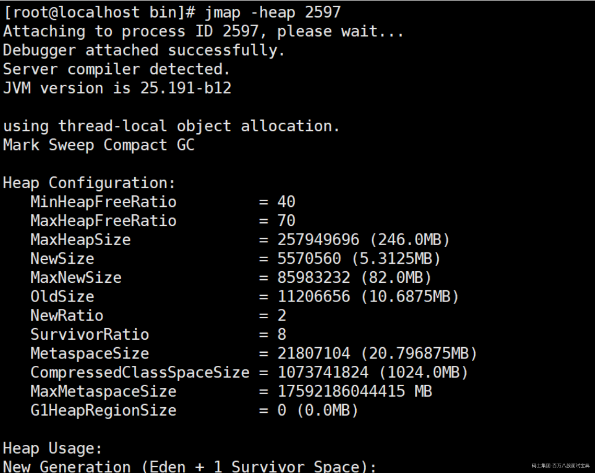

> （3）dump出堆内存相关信息

```plain
jmap -dump:format=b,file=heap.hprof PID
```

*(⚠️ 图片缺失:源知识库原图已失效)*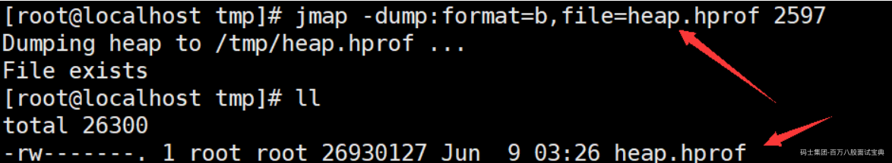

> （4）要是在发生堆内存溢出的时候，能自动dump出该文件就好了

一般在开发中，JVM参数可以加上下面两句，这样内存溢出时，会自动dump出该文件

-XX:+HeapDumpOnOutOfMemoryError -XX:HeapDumpPath=heap.hprof

```plain
设置堆内存大小: -Xms20M -Xmx20M
启动，然后访问localhost:9090/heap，使得堆内存溢出
```

## JVM常用参数以及垃圾收集器常见参数（一般会问你怎么调整的垃圾收集器的具体参数，上节课是泛参数）：

## JVM调优 调整某些参数 为了让程序达到硬件性能瓶颈

### GC常用参数（一般各个垃圾收集器都可以使用的一些打印类参数以及大（类似于堆内存大小这种）参数）

-Xmx：设置堆的最大值，一般为操作系统的 2/3 大小 MaxHeapSize

-Xms：设置堆的初始值，一般设置成和 Xmx 一样的大小来避免动态扩容。 InitialHeapSize

项目启动直接Full GC

-Xmn：表示年轻代的大小，默认新生代占堆大小的 1/3。高并发、对象快消亡场景可适当加大这个区域，对半，或者更多，都是可以的。但是在 G1 下，就不用再设置这个值了，它会自动调整。

-Xss：用于设置栈的大小，默认为 1M，如果代码中局部变量不多，可设置成256K节约空间。

-XX:+UseTLAB 使用TLAB，默认打开

-XX:+PrintTLAB 打印TLAB的使用情况

-XX:TLABSize 设置TLAB大小

-XX:+DisableExplicitGC 启用用于禁用对的调用处理的选项System.gc()

-XX:+PrintGC 查看GC基本信息

-XX:+PrintGCDetails 查看GC详细信息

-XX:+PrintHeapAtGC 每次一次GC后，都打印堆信息

-XX:+PrintGCTimeStamps 启用在每个GC上打印时间戳的功能

-XX:+PrintGCApplicationConcurrentTime 打印应用程序时间(低)

-XX:+PrintGCApplicationStoppedTime 打印暂停时长（低）

-XX:+PrintReferenceGC 记录回收了多少种不同引用类型的引用（重要性低）

-verbose:class 类加载详细过程

-XX:+PrintVMOptions 可在程序运行时，打印虚拟机接受到的命令行显示参数

-XX:+PrintFlagsFinal -XX:+PrintFlagsInitial 打印所有的JVM参数、查看所有JVM参数启动的初始值（必须会用）

-XX:MaxTenuringThreshold

升代（分代）年龄，这个值在CMS 下默认为 6，G1 下默认为 15，这个值和我们前面提到的对象提升有关，改动效果会比较明显。对象的年龄分布可以使用 -XX:+PrintTenuringDistribution 打印，如果后面几代的大小总是差不多，证明过了某个年龄后的对象总能晋升到老生代，就可以把晋升阈值设小。

### Parallel常用参数

**-XX:SurvivorRatio 你要讲的出道理**

设置伊甸园空间大小与幸存者空间大小之间的比率。默认情况下，此选项设置为**8**

**-XX:PreTenureSizeThreshold 对象到达一定的限定值的时候 会直接进入老年代**

大对象到底多大，大于这个值的参数直接在老年代分配

**-XX:MaxTenuringThreshold**

升代年龄，最大值15 **并行（吞吐量）收集器的默认值为**15，而CMS收集器的默认值为6。

**-XX:+ParallelGCThreads**

并行收集器的线程数，同样适用于**CMS**，一般设为和CPU核数相同 N+1

**-XX:+UseAdaptiveSizePolicy**

自动选择各区大小比例

### **CMS常用参数**

**-XX:+UseConcMarkSweepGC**

**启用**CMS垃圾回收器

**-XX:+ParallelGCThreads**

并行收集器的线程数，同样适用于**CMS**，一般设为和CPU核数相同

**-XX:CMSInitiatingOccupancyFraction 并发失败的模式**

**使用多少比例的老年代后开始**CMS收集，默认是68%(近似值)，如果频繁发生SerialOld卡顿，应该调小，（频繁CMS回收）

**-XX:+UseCMSCompactAtFullCollection**

**在**FGC时进行压缩

**-XX:CMSFullGCsBeforeCompaction**

**多少次**FGC之后进行压缩

**-XX:+CMSClassUnloadingEnabled**

使用并发标记扫描（**CMS**）垃圾收集器时，启用类卸载。默认情况下启用此选项。

**-XX:CMSInitiatingPermOccupancyFraction**

**达到什么比例时进行**Perm Space回收，**JDK 8**中不推荐使用此选项，不能替代。

-XX:GCTimeRatio

设置**GC**时间占用程序运行时间的百分比（不推荐使用）

**-XX:MaxGCPauseMillis**

停顿时间，是一个建议时间，**GC**会尝试用各种手段达到这个时间，比如减小年轻代

### **G1常用参数**

**-XX:+UseG1GC**

启用G1垃圾收集器

**-XX:MaxGCPauseMillis**

**设置最大**GC暂停时间的目标（以毫秒为单位）。这是一个软目标，并且JVM将尽最大的努力（G1会尝试调整Young区的块数来）来实现它。默认情况下，没有最大暂停时间值。

**-XX:GCPauseIntervalMillis**

GC的间隔时间

**-XX:+G1HeapRegionSize 你的堆内存小于2G的时候 4C8G起步**

**单个Region大小，取值是1M-32M，建议逐渐增大该值，****1 2 4 8 16 32****。随着size增加，垃圾的存活时间更长，GC间隔更长，但每次GC的时间也会更长-XX:G1NewSizePercent** **新生代最小比例，默认为**1/2000

**-XX:G1MaxNewSizePercent**

**新生代最大比例，默认为**60%

**-XX:GCTimeRatioGC**

时间建议比例，**G1**会根据这个值调整堆空间

**-XX:ConcGCThreads**

初始标记线程数量

**-XX:InitiatingHeapOccupancyPercent**

**启动**G1**的堆空间占用比例，根据整个堆的占用而触发并发**GC周期

## **亿级流量电商系统JVM调优**

### **亿级流量系统**

*(⚠️ 图片缺失:源知识库原图已失效)*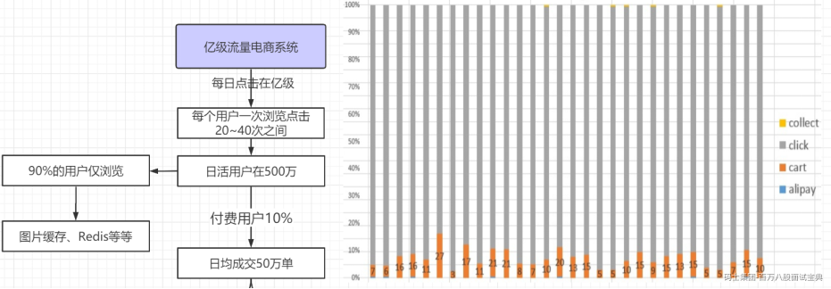

亿级流量系统，其实就是每天点击量在亿级的系统，根据淘宝的一个官方的数据分析。

每个用户一次浏览点击20~40次之间，推测出每日活跃用户（日活用户）在500万左右。

同时结合淘宝的一个点击数据，可以发现，能够付费的也就是橙色的部分（cart）的用户，比例只有10%左右。

90%的用户仅仅是浏览，那么我们可以通过图片缓存、Redis缓存等技术，我们可以把90%的用户解决掉。

10%的付费用户，大概算出来是每日成交50万单左右。


*(⚠️ 图片缺失:源知识库原图已失效)*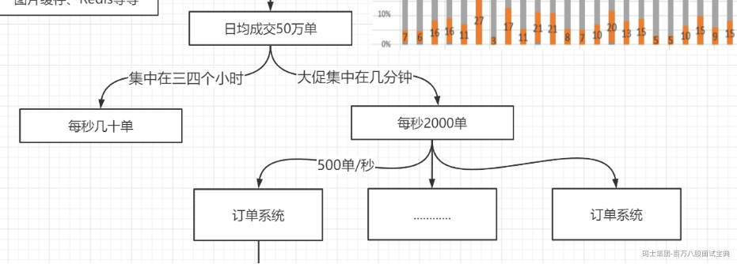

#### **GC**预估

如果是普通业务，一般处理时间比较平缓，大概在3,4个小时处理，算出来每秒只有几十单，这个一般的应用可以处理过来（不需要JVM预估调优）

另外电商系统中有大促场景（秒杀、限时抢购等），一般这种业务是几种在几分钟。我们算出来大约每秒2000单左右的数据，

承受大促场景的使用4台服务器（使用负载均衡）。每台订单服务器也就是大概500单/秒

我们测试发现，每个订单处理过程中会占据0.2MB大小的空间（什么订单信息、优惠券、支付信息等等），那么一台服务器每秒产生100M的内存空间，这些对象基本上都是朝生夕死，也就是1秒后都会变成垃圾对象。

*(⚠️ 图片缺失:源知识库原图已失效)*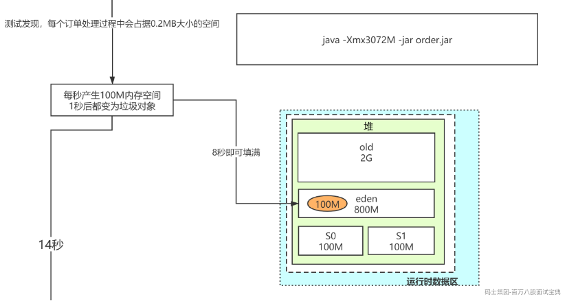

加入我们设置堆的空间最大值为3个G，我们按照默认情况下的设置，新生代1/3的堆空间，老年代2/3的堆空间。Eden:S0:S1=8:1:1

我们推测出，old区=2G,Eden区=800M,S0=S1=100M

根据对象的分配原则（对象优先在Eden区进行分配），由此可得，8秒左右Eden区空间满了。

每8秒触发一个MinorGC（新生代垃圾回收），这次MinorGC时，JVM要STW，但是这个时候有100M的对象是不能回收的（线程暂停，对象需要1秒后都会变成垃圾对象），那么就会有100M的对象在本次不能被回收（只有下次才能被回收掉）

所以经过本次垃圾回收后。本次存活的100M对象会进入S0区，但是由于另外一个JVM对象分配原则（如果在Survivor空间中相同年龄所有对象大小的总和大于Survivor空间的一半，年龄大于或等于该年龄的对象就可以直接进入老年代，无须等到MaxTenuringThreshold中要求的年龄）

所以这样的对象本质上不会进去Survivor区，而是进入老年代

*(⚠️ 图片缺失:源知识库原图已失效)*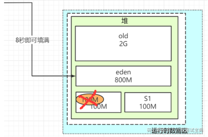

*(⚠️ 图片缺失:源知识库原图已失效)*

所以我们推算，大概每个8秒会有100M的对象进入老年代。大概20\*8=160秒，也就是2分40秒左右old区就会满掉，就会触发一次FullGC,一般来说，这次FullGC是可以避免的，同时由于FullGC不单单回收老年代+新生代，还要回收元空间，这些FullGC的时间可能会比较长（老年代回收的朝生夕死的对象，使用标记清除/标记整理算法决定了效率并不高,同时元空间也要回收一次，进一步加大GC时间）。

所以问题的根本就是做到如何避免没有必要的FullGC

#### **GC****预估****调优**

我们在项目中加入VM参数：

-Xms3072M -Xmx3072M -Xmn2048M -XX:SurvivorRatio=7

-Xss256K -XX:MetaspaceSize= 128M -XX:MaxMetaspaceSize= 128M

-XX:MaxTenuringThreshold=2

-XX:ParallelGCThreads=8

-XX:+UseConcMarkSweepGC

1、首先看一下堆空间：old区=1G，Eden区=1.4G,S0=S1=300M

*(⚠️ 图片缺失:源知识库原图已失效)*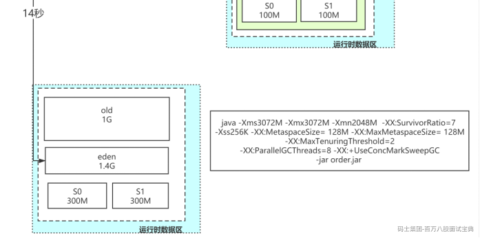

1、那么第一点，Eden区大概需要14秒才能填满，填满之后，100M的存活对象会进入S0区（由于这个区域变大，不会触发动态年龄判断）

*(⚠️ 图片缺失:源知识库原图已失效)*

2、再过14秒，Eden区，填满之后，还是剩余100M的对象要进入S1区。但是由于原来的100M已经是垃圾了（过了14秒了），所以，S1也只会有Eden区过来的100M对象，S0的100M已经别回收，也不会触发动态年龄判断。

*(⚠️ 图片缺失:源知识库原图已失效)*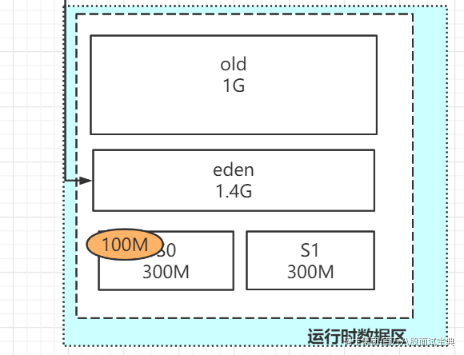

*(⚠️ 图片缺失:源知识库原图已失效)*

3、反反复复，这样就没有对象会进入old区，就不会触发FullGC,同时我们的MinorGC的频次也由之前的8秒变为14秒，虽然空间加大，但是换来的还是GC的总时间会减少。

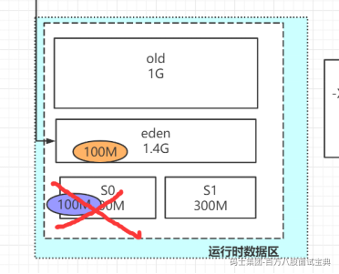

4、-Xss256K -XX:MetaspaceSize= 128M -XX:MaxMetaspaceSize= 128M 栈一般情况下很少用到1M。所以为了线程占用内存更少，我们可以减少到256K

元空间一般启动后就不会有太多的变化，我们可以设定为128M，节约内存空间。

5、-XX:MaxTenuringThreshold=2 这个是分代年龄（年龄为2就可以进入老年代），因为我们基本上都使用的是Spring架构，Spring中很多的bean是长期要存活的，没有必要在Survivor区过渡太久，所以可以设定为2，让大部分的Spring的内部的一些对象进入老年代。

6、-XX:ParallelGCThreads=8 线程数可以根据你的服务器资源情况来设定（要速度快的话可以设置大点，根据CPU的情况来定，一般设置成CPU的整数倍）

*(⚠️ 图片缺失:源知识库原图已失效)*

7、-XX:+UseConcMarkSweepGC 因为这个业务响应时间优先的，所以还是可以使用CMS垃圾回收器或者G1垃圾回收器。

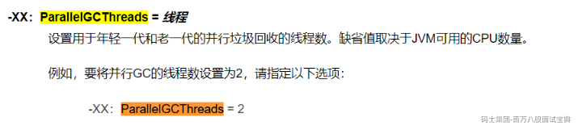

8、-XX:+UseConcMarkSweepGC 因为这个业务响应时间优先的，所以还是可以使用CMS垃圾回收器或者G1垃圾回收器。

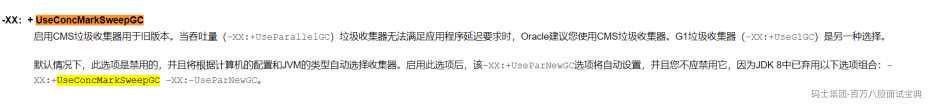


