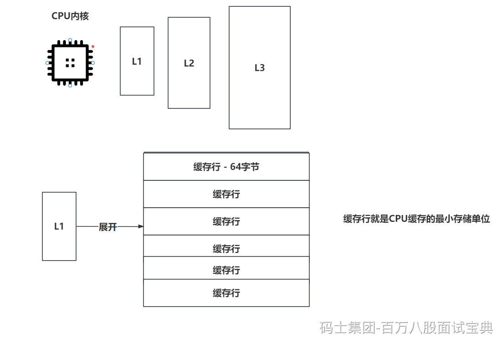

## 一、进程，线程，协程的区别

**1、进程：** 操作系统进行资源分配和调度的基本单位。每个进程有独立的内存空间。进程通讯就采用共享内存，MQ，管道。

**2、线程：** 一个进程可以包含多个线程，线程就是CPU调度的基本单位。一个线程只属于某一个进程。线程之间通讯，队列，await，signal，wait，notity，Exchanger，共享变量等等都可以实现线程之间的通讯。

**3、协程：**

- 协程是一种用户态的轻量级线程。它是由程序员自行控制调度的。可以显示式的进行切换。

- 一个线程可以调度多个协程。

- 协程只存在于用户态，不存在线程中的用户态和内核态切换的问题。协程的挂起就好像线程的yield。

- 可以基于协程避免使用锁这种机制来保证线程安全。

单独的拿协程和线程做一个对比：

- **更轻量：** 线程一般占用的内存大小是MB级别。协程占用的内存大小是KB级别。

- **简化并发问题：** 协程咱们可以自己控制异步编程的执行顺序，协程就类似是串行的效果。

- **减少上下文切换带来的性能损耗：** 协程是用户态的，不存在线程挂起时用户态和内核态的切换，也不需要去让CPU记录切换点。

- **协程优化的点：** 协程在针对大量的IO密集操作时，协程可以更好有去优化这种业务。

## 二、Java中创建线程方式

Java中创建线程方式，只有一种，本质都是Runnable的形式。

1、继承Thread


2、Runnable，本质都是他！

3、Callable：Callable一般需要配合FutureTask来执行，执行的是FutureTask中的run方法，而FutureTask实现了RunnableFuture的接口，RunnableFuture的接口又继承的Runnable。

4、线程池：线程池中的工作线程是Worker，Worker实现了Runnable，在构建工作线程时，会new Worker对象，将Worker传递给线程工厂构建的Thread对象。本质还是Runnable。

## 三、如何结束线程

1、stop这种就不用说了。

2、现在结束线程比较优雅的方式只有一个， **run方法结束** （正常结束，异常结束）

- 每个线程都有一个中断标记位，这个标记位默认是false。

- 当你执行这个线程的interrupt方法后，这个标记位会变为true

```plain
while(!Thread.currentThread.isInterrupted())
```

- 当你线程处于阻塞的状态下，比如await，wait，在阻塞队列，sleep等等，此时如果被中断，会抛出InterruptedException

- 也可以直接指定共享变量。

```plain
volatile boolean flag = false;
run(){
    while(!flag){
        // 处理任务！！
    }
}
```

## 四、ThreadLocal的作用，和内存泄漏问题

在开发中会用到的方式就是 **传递参数** 。

ThreadLocal有两个内存泄漏问题：

- **key：** key会在玩花活使用ThreadLocal时 ，在局部声明ThreadLocal，局部方法已经执行完毕，但是线程会指向ThreadLocalMap，ThreadLocalMap的key会指向ThreadLocal对象，这会导致ThreadLoc会被al对象不回收。所以ThreadLocal在设计时，将key的引用更改为了弱引用，如果再发生上述情况，此时ThreadLocal只有一个弱引用指向，可以被正常回收。

- **value：** 如果是普通线程使用ThreadLocal，那其实不remove也不存在问题，因为线程会结束，销毁，线程一销毁，就没有引用指向ThreadLocalMap了，自然可以回收。但是如果是线程池中的核心线程使用了ThreadLocal，那使用完毕，必须要remove，因为核心线程不会被销毁（默认），导致核心线程结束任务后，上一次的业务数据还遗留在内存中，导致内存泄漏问题。

## 五、伪共享问题以及处理方案

伪共享问题需要先掌握一下CPU缓存的事。



所谓的伪共享就是多个数据公用一个缓存行发生的问题。

当一个缓存行的64个字节，缓存了多个数据（ABCD），此时因为JVM的操作，A数据被修改了，但是对于CPU来说，我只能知道当前缓存行的数据被修改了，现在的数据不安全，需要重新的去JVM中将数据同步一次。

因为CPU执行的效率特别快，如果去主内存中同步一次数据，相对CPU的速度来说，就好像咱们执行代码时查询了一次数据库，很影响效率。

想解决这个问题，避免其他线程写缓存行导致当前线程需要去主内存查询，可以让某个线程直接占满当前缓存行的64k大小即可。

占满缓存行，独自使用，其实就是利用空间换时间的套路。

long l1,l2,l3,l4,l5,l6,l7;

long value;

long l9,l10,l11,l12,l13,l14,l15;

## 六、CPU缓存可见性问题发生的原因

CPU缓存可见性的问题，就是在缓存行数据发生变化时，会发出通知，告知其他内核缓存行数据设置为无效。

但是因为CPU厂商为了提升CPU的执行效率，经常会追加一些优化的操作，StoreBuffer，Invalidate Queue。这些就会导致MESI协议通知受到影响，同步数据没那么及时。

所以CPU内部提供了一个指令， **lock前缀指令** ，如果使用了lock前缀指定去操作一些变量，此时会将数据立即写回到主内存（JVM），必然会触发MESI协议，类似StoreBuffer，Invalidate Queue的缓存机制也会立即处理。
