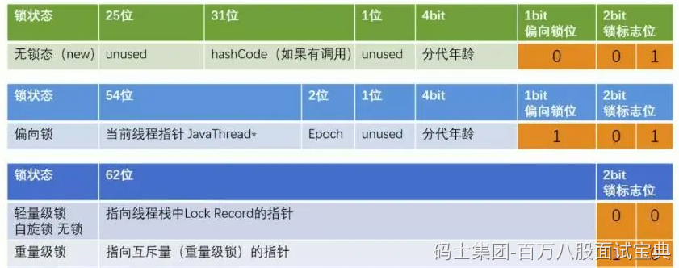
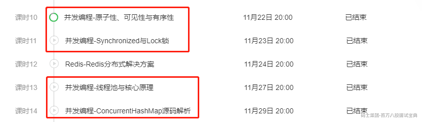

## 1、单例模式的DCL为啥要加volatile？

**避免指令重排，获取到未初始化完成的对象。**

单例模式的懒汉模式确保线程安全的机制DCL

```java
public class MyTest {

    private static MyTest myTest;

    public static MyTest getInstance(){
        if(myTest == null) {            // check
            synchronized (MyTest.class) {   // lock
                if(myTest == null) {    // check
                    myTest = new MyTest();
                }
            }
        }
        return myTest;
    }
}
```

DCL正常可以解决单例模式的安全问题，但是由于CPU可能会对程序的一些指令做出重新的排序，导致出现拿到一些未初始化完成的对象去操作，最常见的就是出现了诡异的NullPointException。

**（扩展一下）volatile修饰myTest对象后，可以禁止CPU做指令重排。volatile的生成字节码指令后有内存屏障（指令），内存屏障会被不同的CPU翻译成不同的函数，比如X86的CPU，会对StoreLoad内存屏障翻译成mfence的函数，最终的指令就是lock前缀指令。**

Java中new对象，可以简单的看成三个指令的操作。

- 1、开辟内存空间

- 2、初始化对象内部属性

- 3、将内存空间的地址赋值给引用

## 2、CAS实现原理

```java
public class MyTest {

    private int value = 1;

    public static void main(String[] args) throws Exception {
        MyTest test = new MyTest();
        Unsafe unsafe = null;
        Field field = Unsafe.class.getDeclaredField("theUnsafe");
        field.setAccessible(true);
        unsafe = (Unsafe) field.get(null);
        // 获取内存偏移量
        long offset = unsafe.objectFieldOffset(MyTest.class.getDeclaredField("value"));
        // 执行CAS，这里的四个参数分别代表什么，你也要清楚~
        System.out.println(unsafe.compareAndSwapInt(test, offset, 0, 11));
        System.out.println(test.value);
    }

}

```

CAS就是将内存中的某一个属性，从oldValue，替换为newValue。保证原子性。

**1、Java层面如何实现的CAS以及使用。**

在Java中，是基于Unsafe类提供的native方法实现的。native是走的C++的依赖库

```java
public final native boolean cas(Object 哪个对象, long 内存偏移量, Object 旧值, Object 新值);

public final native boolean compareAndSwapInt(Object var1, long var2, int var4, int var5);

public final native boolean compareAndSwapLong(Object var1, long var2, long var4, long var6);
```

Unsafe类，不能直接new，只能通过反射的形式获取到Unsafe的实例去操作，不过一般业务开发中，基本不会直接使用到Unsafe类。

**2、Java的CAS在底层是如何实现的。**

Java层面的CAS，只到native方法就没了。底层是C++实现的，但是其实比较和交换（CAS），是**CPU支持的原语**。**cmpxchg指令**就是CPU支持的原语。

如果在CPU层面，多核CPU并行执行CAS修改同一个属性，可能会导致出现问题。C++内部就可以看到针对**cmpxchg指令**前追加了**lock前缀指令**（多核CPU）

**3、CAS存在的一些问题**

- **ABA问题：** 要修改的数据，最开始是A，但是你没修改成功，期间经过一些列的操作，后来又变回了A，此时你CAS会成功。 但是这个数据在最开始的A ---- 最后的A，这期间发生了什么事情，咱不清楚。如果业务有要求这个期间发生的问题也要纠结一下，那么你就需要换一种CAS的实现实现。利用版本号来确认。Java中提供了解决这种ABA问题的原子类。

```plain
public class AtomicStampedReference<V> {

    private static class Pair<T> {
        final T reference;   // 你要修改的值
        final int stamp;     // 版本号，你可以自行制定  戳~
    }
}
```

- **性能问题：** CAS的性能嘎嘎快，一个层面是他属于CPU原语层面上的指令。还有一个优点，CAS会返回成功还是失败，不会挂起线程。但是如果基于while这种循环操作去调度CAS直到成功，那可能会优点消耗CPU的资源了，一直执行CAS指令，但是一段是时间无法成功。 如果你感觉短期内就能ok，那就上CAS，如果不成，使用悲观锁（synchronized，lock锁）

**自旋锁，CAS，乐观锁，自适应自旋锁。**

- 乐观锁：是一种泛指，Java有Java的乐观锁实现，MySQL也有自己的乐观锁实现。（不会挂起线程）

- 悲观锁：也是一种泛指，认为拿不到资源，拿不到就挂起线程。

- CAS：Java中的乐观锁实现，是CAS。CAS对于Java来说，就是一个方法，做一次比较和交换。（不会挂起线程，线程的状态从运行到阻塞）

- 自旋锁：你可以自己实现，就是循环去执行CAS，知道成功为止。

```plain
while(!cas()){}
for(;;;){ if(cas)  return }
```

- 自适应自旋锁： 这个东西就是synchronized的轻量级锁用到了，相对智能的自旋锁，如果上次CAS成功了，这次CAS循环次数，加几次。如果上次失败了，这次CAS就减几次。

## 4、synchronized的实现原理。

synchronized应该不陌生，这东西就是JVM层面最原始的互斥锁。

使用方式，就同步代码块，同步方法。

**这个是重量级锁的原理。**

synchronized因为是互斥锁，只能有一个线程持有当前锁资源。所以synchronized底层有一个owner属性，这个属性是当前持有锁的线程。如果owner是NULL，其他线程就可以基于CAS将owner从NULL修改为当前线程，只要这个CAS动作成功了，就可以获取这个synchronized锁资源。如果失败了，会再尝试几次CAS，没拿到就park挂起当前线程。

## 5、synchronized的锁升级过程。

这个问题属于常识性问题，不深究特别底层的东西。



无锁：当前对象没有被作为锁资源存在 && 在JDK1.8中，会有一个4s的偏向锁延迟，这段时间的对象就处于无锁状态。

偏向锁：如果撇去4s的偏向锁延迟，那么刚new出来的对象，基本都是偏向锁。

```plain
Ps：如果某一个线程，反复的去获取同一把锁，此时偏向锁的优势就出现了，无需做CAS操作，比较一下指向的是否是当前线程，如果是，直接执行逻辑。
```

- 如果没有被所谓锁资源，那么这个偏向锁，没有偏向某一个线程。哪个线程都没偏向（匿名偏向）

- 作为锁资源存在了，同时指向着某一个线程，这个就是偏向锁（普通偏向）

轻量级锁：如果偏向锁状态下，出现了竞争，那么升级为轻量级锁。轻量级锁状态下，会执行多次CAS，默认初始次数是10次，这种CAS是采用的自适应自旋锁。

重量级锁：如果轻量级锁状态下，CAS完毕获取锁失败，直接升级到重量级锁。到了重量级锁的状态下，就是再次基于几次CAS尝试修改owner属性，成功，拿锁走人。 失败，挂起线程。等到其他线程释放锁后，再被唤醒。

**一般来说，锁只有升级，没有降级。**

**但是有点特殊情况，比如偏向锁可以退到无锁。因为偏向锁无法保存对象的hashcode，如果在偏向锁状态，并且没有作为锁的情况，执行了hashcode方法，会从偏向锁到无锁。、**

**下面是JIT优化导致的轻量级锁降级到无锁的状态**

```java
public class LockTest {

    public static void main(String[] args) throws Exception  {
        synchronizedTest();

    }

    public static void synchronizedTest() throws InterruptedException {
        Thread.sleep(5000);
        Object o = new Object();
        // 00000101 无锁/匿名偏向
        System.out.println(ClassLayout.parseInstance(o).toPrintable());

        Thread thread = new Thread(() -> {
            synchronized (o) {
                // 10000010 重量级锁
                System.out.println(Thread.currentThread().getName() + "-1:" + ClassLayout.parseInstance(o).toPrintable());
            }

            // 00000010 重量级锁
            System.out.println(Thread.currentThread().getName() + "-2:" + ClassLayout.parseInstance(o).toPrintable());
            try {
                // 等待锁降级
                Thread.sleep(5000);
            } catch (InterruptedException e) {
                e.printStackTrace();
            }

            // 00000001 无锁
            System.out.println(Thread.currentThread().getName() + "-3:" + ClassLayout.parseInstance(o).toPrintable());
            synchronized (o) {
                // 00010000 轻量级锁
                System.out.println(Thread.currentThread().getName() + "-4:" + ClassLayout.parseInstance(o).toPrintable());
            }

        });
        thread.start();

        synchronized (o) {
            // 00000101 无锁/匿名偏向
            System.out.println(Thread.currentThread().getName() + ":" + ClassLayout.parseInstance(o).toPrintable());
        }

        while (thread.isAlive()) {

        }
    }

}
```

## 6、AQS是什么？

AQS本质就是个抽象类，AbstractQueuedSynchronizer。AQS是JUC包下的一个基础类，没有具体的并发功能的实现，不过大多数JUC包下的工具都或多或少继承了AQS去做具体的实现。

比如ReentrantReadWriteLock，ReentrantLock，CountDownLatch，线程池之类的，都用继承了AQS做自己的实现。

AQS有三个核心点：

- volatile修饰int属性state。（如果作为锁，state == 0，代表没有线程持有锁资源，如果大于0，代表有线程持有锁资源）

- 基于Node对象组成的一个同步队列（如果线程想获取lock锁，结果失败了，会被挂起线程，线程会被封装为Node对象，扔到这个同步队列中）

- 基于Node对象组成的单向链表（当线程持有锁资源时，如果执行了await，线程会释放锁资源，并且将线程封装为Node对象，扔到这个单向链表中。如果其他线程执行了signal，那就会将单向链表的Node节点扔到同步队列）

## 7、ReentrantLock释放锁时为什么要从后往前找有效节点？

在释放锁唤醒排队的Node时，会先找head.next唤醒，如果head.next是取消状态，那么AQS的逻辑是从tail往前找，一直找到里head最近的有效节点。

为什么不从前往后找，更快。

因为节点在取消时，为了更方便GC回收，会做一个操作，将Node的next指针指向自己，形成一个循环引用，这样更容易被GC发现。另外AQS全局是以prev指针为基准的，所有操作都是prev准，next不一定准。

## 8、公平锁和⾮公平锁的区别

语言层面上，区分很简单，就是一个公平，一个不公平。

这个问题最好从源码的维度来聊。

可以扩展说一下，synchronized支持持非公平锁，ReentrantLock既有公平，也有非公平。

在ReentrantLock中，有两个方法的实现有公平和非公平之分。

- lock方法

- 非公平锁：直接执行CAS，尝试将state从0改为1，如果CAS成功了，拿锁走人，失败了走后续逻辑。

- 公平锁：直接走后续逻辑（后续逻辑包含tryAcquire方法）。

- tryAcquire方法：

- 非公平锁：如果state为0，会直接执行CAS，尝试将state从0改为1，如果CAS成功了，拿锁走人，失败就准备排队。

- 公平锁：如果state为0，先查看一下，是否有排队的节点，如果有排队的，那就不抢，直接去排队。

1、<https://www.mashibing.com/live/2525>



2、<https://www.mashibing.com/course/205> （完整版）

3、<https://www.mashibing.com/course/2377>
