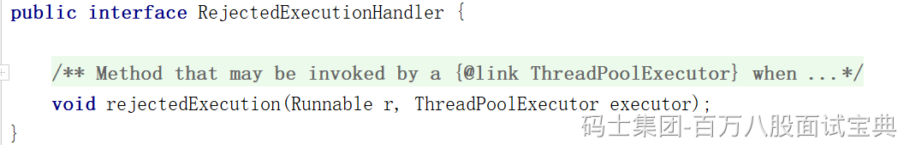
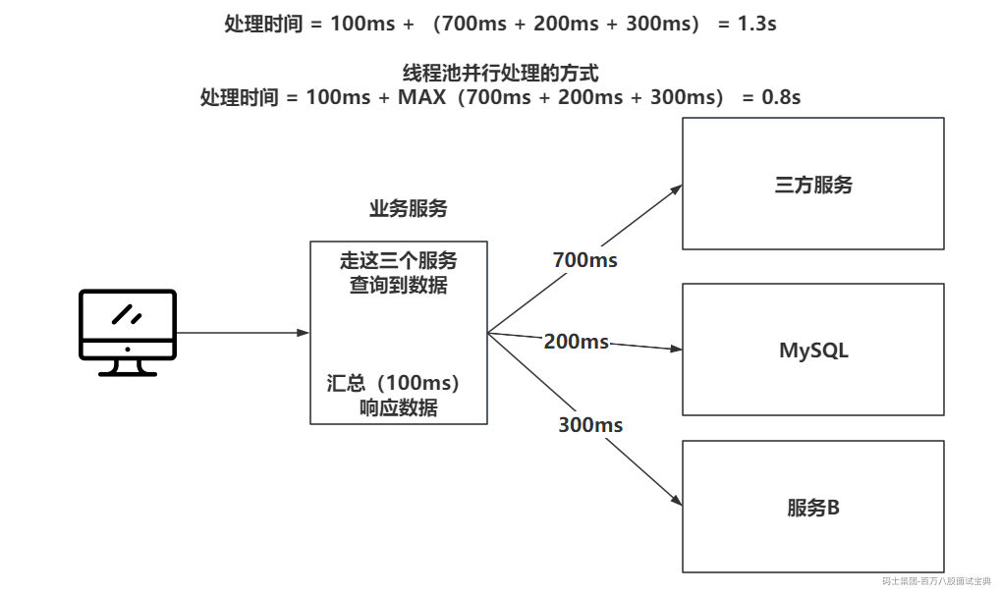

## 1、线程池的核心参数？（常识，必须会）

```java
    public ThreadPoolExecutor(int corePoolSize,
                              int maximumPoolSize,
                              long keepAliveTime,
                              TimeUnit unit,
                              BlockingQueue<Runnable> workQueue,
                              ThreadFactory threadFactory,
                              RejectedExecutionHandler handler) {
```

七个核心参数，都得会：

- corePoolSize：核心线程数 （线程池内部运行起来之后，最少有多少个线程等活。 **核心线程是懒加载** ）

- maximumPoolSize：最大线程数 （当工作队列堆满了，再来任务就创建创建非核心线程处理。）

- keepAliveTime：最大空闲时间 （默认非核心线程，没活之后，只能空闲这么久，时间到了，干掉）

- unit：空闲时间单位（上面时间的单位）

- workQueue：工作队列 （当核心线程数足够后，投递的任务会扔到这个工作队列存储。LinkedBlockingQueue）

- threadFactory：线程工厂（构建线程的，根据阿里的规范，线程一定要给予一个有意义的名字，方便后期排查错误）

- handler：拒绝策略 （核心数到了，队列满了，非核心数到了，再来任务，走拒绝策略……）

**线程处理完任务之后，会在工作队列的位置执行take（无线等） / poll （指定等待的时间），等任务！**

**非核心线程创建完，是处理传递过来的任务，不会优先处理工作队列的任务！**

**线程池在创建工作线程时，会区分核心线程和非核心线程，但是线程开始干活后，他就不区分了，只保证数值足够即可。**

## 2、到底如何设置线程池配置？

上面内7个参数，到底写啥，根据什么写？

最重要的，就是 **核心线程数** 到底写多少？

咱们用线程池的目的，是为了更好的发挥CPU的性能，提升业务执行的效率。

为了配置核心线程数，需要观察两个内容：

- 硬件的CPU内核数。

- 业务类型

- CPU密集。

- IO密集。

- 混合型（一半CPU，一半IO）

考虑CPU密集型，其实所谓CPU密集就是需要CPU一直调度当前线程，当前线程做的业务大多数是计算啊，数据转换等等，不会出现阻塞的情况。 这种情况，以经验之谈来说，核心线程就设置CPU内核数 ± 1即可。但是由于CPU厂商不同，性能不同，加上服务器的操作系统区别，CPU内核数 ± 1不一定是最佳的，需要一定的压测得出一个合理的数值。 jmeter压测即可。

考虑IO密集型，什么叫IO密集呢，比如你的业务涉及到了大量的查询数据库，查询三方服务获取一些数据，而查询数据的时候，线程基本都处理阻塞状态。 这种查询三方服务或者是数据库的操作，可能会因为三方服务的网络抖动，或者查询数据库走没有索引之类的，对阻塞时间有一些影响，此时你会发现，IO密集型的方式，好像没有什么特别好的公式可以直接用。

想获取合理的数值，你可以优先根据IO密集和CPU密集大致得出一个核心线程数，基于这个数值去做压测，根据测试的结果，你可以调大核心线程数，再测，调小核心线程数再测，直到得出一个效率最高的数值。

压测的过程中，需要动态修改线程池中的参数，而线程池恰恰可以做到动态的修改，只需要执行set方法即可，可以自行实现。也可以用一些三方的开源框架，基于美团的动态线程池策略开源的一个线程池监控工具Hippo4j。

---

**最大线程数：** 其实核心线程数已经可以做到尽可能的发挥CPU的性能了，所以最大线程数最好设置为跟核心线程数一致。如果在核心线程的基础上，又多追加了几个线程，反而会导致性能下降~~ **最大线程数 = 核心线程**

---

**工作队列：** 是任务排队的地方，很多任务会扔到这个队列中排队，等待线程执行。

每个任务都是Runnable的实现，是一个对象，对象要占用堆内存空间。不能让排队的任务压爆JVM内存。

任务扔到工作队列，需要等待排队处理，你可以考虑排在最后面的任务需要多久才能处理到。再根据你业务允许的延迟时间考虑，你的工作队列要多长。

---

**拒绝策略：** 当工作队列满了，如果最大线程数 = 核心线程，那就要走拒绝策略了。

如果你的任务是个记录日志啊这种丢弃也无所谓的任务，那就扔了呗~~~

如果你的任务是核心业务线必备的一环，那就不能扔，你可以让业务线程处理，你也可以把任务留存好，做最终一致性。

一般到这了，性能到瓶颈，喊领导，上服务器，加钱。

## 3、线程池的执行原理/流程？

1、任务扔到线程池之后，先查看核心线程数到了没，没到就构建核心线程去处理任务。

2、如果核心线程数到了，那就将任务扔到工作队列排队。

3、任务扔到工作队列时，工作队列满了，满了就尝试创建非核心线程去处理任务。

4、如果非核心线程创建失败（到最大线程数了）了，那就执行拒绝策略。

## 4、常见的拒绝策略有哪些？

线程池自己提供了4种拒绝策略，供咱们使用，如果这4个不够，也可以自己去实现

拒绝策略提供了一个接口规范，让咱们去实现。



下面是线程池自带的4个：

```plain
AbortPolicy：扔异常。
DiscardPolicy：任务直接丢弃。
CallerRunsPolicy：谁投递的任务，谁自己处理。
DiscardOldestPolicy：将队列中排在最前面的任务干掉，尝试将自己再次投递到线程池。
```

## 5、线程池里的工作线程和普通线程有什么区别？

本质上没任务区别，因为你想在Java创建一个线程，你能用到的方式只有一个，thread.start();

但是，线程池中的工作线程，是因为他封装了一个Worker对象。这个Worker对象为了适配线程池的逻辑，他实现了Runnable存储第一次要执行任务。其次还继承了AQS，为了满足线程池的shutdown和shutdownNow的逻辑。

**shutdown和shutdownNow** 都是关系线程池的方法。最终会把工作线程全部干掉。

**shutdown方法：** 等工作队列的任务全部处理完，等待任务的线程直接中断，再干掉工作线程。

**shutdownNow方法：** 立即中断正在处理的任务，等待任务的线程直接中断，同时把工作队列中的任务全部返回，再干掉工作线程。

工作线程在执行任务前，会先基于AQS将state设置为1，代表当前工作线程正在干活，干完活之后，会将state设置为0。shutdown方法不会中断正在处理任务的线程，所以shutdown中断线程前，先查看state是几。

**如果主线程结束了，没shutdown线程池，线程池会一直存在吗？**

会，因为线程不会回收，run方法没结束，线程是Worker类，Worker是线程池的内部类，线程池在，线程在，导致内存泄漏。

```java
public void xxx(){
    ThreadPoolExecutor executor = new ThreadPoolExecutor();
    // 基于线程池做业务处理
    executor.shutdown();
}
```

## 6、如何在线程池执行任务前后追加一些操作？

线程池底层在执行任务前后，提供了两个勾子函数/扩展口，你可以继承线程池对这两个方法重写，那么以后只要线程池执行任务前后，都会执行这两个勾子函数。

```java
public class MyTP extends ThreadPoolExecutor {

    public MyTP(int corePoolSize,
                              int maximumPoolSize,
                              long keepAliveTime,
                              TimeUnit unit,
                              BlockingQueue<Runnable> workQueue,
                              ThreadFactory threadFactory,
                              RejectedExecutionHandler handler) {
        super(corePoolSize,maximumPoolSize,keepAliveTime,unit,workQueue,threadFactory,handler);
    }

    @Override
    protected void beforeExecute(Thread t, Runnable r) {
        // 任务执行前干点啥。
    }

    @Override
    protected void afterExecute(Runnable r, Throwable t) {
        // 任务执行后干点啥。
    }
}
```

## 7、任务饥饿问题

线程池会确保一个事情，只要没走shutdownNow，就必须保证在工作队列有任务时，至少要有一个工作线程存在，去处理工作队列中的任务。  
核心线程可以设置为0个。

## 8、工作线程结束的方式

正常结束就是run方法结束，可以是非核心线程的时间到了，run方法正常结束。也可以是执行任务期间，出现了异常。如果是Runnable的方式提交任务，那工作线程就异常结束，工作线程就没了。

但是如果提交任务的方式是基于Callable走的FutureTask，那执行过程中的异常不会抛出来，工作线程不会结束。

## 9、什么场景线程池

1、异步要处理的，比如你发送个邮件，发送个短信，这种异步处理的，就上线程池。

2、定时任务，时间到了，触发一个线程去执行某个任务，也能上线程池，而且JUC还提供了ScheduleThreadPoolExecutor，就是定时任务的线程池。

3、访问多个服务做并行处理，提升效率



4、处理的数据体量比较大，做导入导出这种，可以上多线程做并行处理提升处理效率。

5、框架底层都有线程池，只是你没配置，RabbitMQ的消费者，你不配置线程的信息，他就是单线程处理，速度嘎嘎慢，你配置了，那就是多个消费者并行处理。
