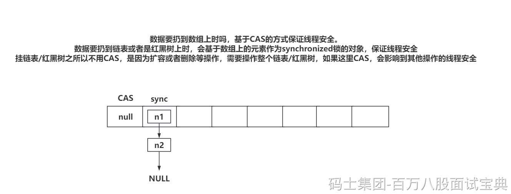
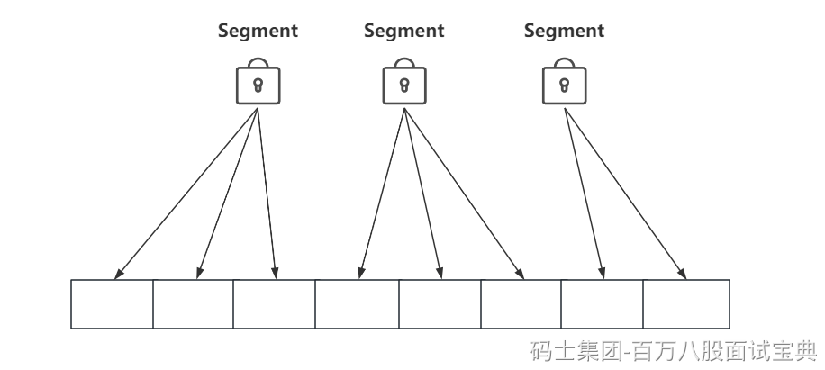

## 1、ConcurrenHashMap存储结构？

HashMap和ConcurrenHashMap在存储结构上是一模一样的。

数组 + 链表 + 红黑树。


点了几个东西：

- 存储结构

- 红黑树出现的原因

- 链表何时转换为红黑树

- 为什么链表长度为8才转红黑树

- 红黑树结构情况下，如果删除元素，导致红黑树元素个数小于等于6，会退化为链表。

- 数组扩容触发的两种情况

## 2、ConcurrentHashMap保证写操作线程安全的方式？



数组上扔数据，CAS保证安全。

链表/红黑树扔数据，synchronized锁数组元素保证线程安全。

JDK1.7中的ConcurrentHashMap是基于分段锁来保证的线程安全。



## 3、ConcurrentHashMap的计数器实现？

ConcurrentHashMap用的LongAdder来保证线程安全的。

LongAdder底层就是基于CAS的方式，在做+1和-1操作，自然能保证线程安全。

但是AtmoicLong也能保证线程安全，为啥不用AtmoicLong呢？

比如ConcurrentHashMap中记录元素个数的是baseCount，如果有大量线程都想修改baseCount，基于CAS的方式，每次并发只会有一个线程成功，其他失败的线程需要再次获取baseCount的值，再执行CAS…………AtmoicLong就是这种方式，会导致性能变慢，而且空转的CAS操作，会浪费CPU的性能资源。

LongAdder解决上述问题的方式很简单，不让每个线程都对baseCount做CAS操作，LongAdder中提供了很多的CounterCell对象，每个CounterCell内部都有一个long类型的value，线程在做计数时，可以随机选择一个CounterCell对象对内部的value做+1操作。

CounterCell数组的长度最长和你的CPU内核数一致。 CAS是CPU密集操作，和CPU内核数 ± 1 正好~

baseCount + 所有CounterCell对象的value，最终结果是ConcurrentHashMap中的元素个数。

## 4、ConcurrentHashMap的扩容大致流程？

**ConcurrentHashMap的扩容，允许多个线程来并发扩容~~**

4.1、扩容触发时机

- 链表到8。数组长度小于64，扩容数组。

- 0.75的负载因子，元素个数到了，就得扩。

- 执行putAll时，如果putAll中的map元素个数当前map无法放下，那就优先扩容。（跟0.75有关系）将map.size做好运算，与当前的扩容阈值做比较，如果小于扩容阈值，直接添加，大于扩容阈值，那就优先扩容。

4.2、计算扩容标识戳

- 标识戳后面会作为标记，代表当前ConcurrentHashMap内部正在扩容数组。

- 标识戳会记录当前是从多少长度的数组开始做扩容的，避免协助扩容时，出现错误。

4.3、计算每次迁移数据的步长，基于数组长度和CPU内核数计算，最小是16

- 每个线程会先领取一定长度的迁移数据的任务，领取完，一个位置一个位置的迁移。每次领取任务的长度是多少，就基于步长来做的。

4.4、创建新数组，长度是老数组的二倍。

4.5、领取迁移数据的索引位置的任务，基于步长得出从哪个索引迁移到哪个索引。

4.6、开始将老数组数据迁移到新数组，等老数组的某个索引位置迁移完之后，会留下一个标记，标记代表当前位置数据全部迁移到了新数组。

4.7、等老数组的所有数据，都迁移到新数组上之后，最后一个完成迁移数据的线程，会整体再检查一遍老数组中有没有遗留的数据在。（基本没有）

4.8、最后检查完毕之后，迁移结束。

## 5、ConcurrentHashMap获取数据？

ConcurrentHashMap在维护红黑树的同时，还会保留一个双向链表的数据结构。

ConcurrentHashMap的读操作，永不阻塞！

1、如果数据在数组上，查询到直接返回。

2、如果数据在链表上，找到数组的索引位置后，next，next一个一个往下找，找到返回。

3、如果数据在红黑树上

- 如果有写线程在红黑树上写数据，那么读线程去读取一个双向链表查询数据。

- 如果没有写线程在操作红黑树，那就在红黑树上正常的left，right去找对应数据。

4、如果定位的索引位置是一个标记（扩容的那个标记）

- 直接基于标记定位到新数组的位置，去新数组找数据。

## 6、CountDownLatch的运用。

CountDownLatch就是一个计数器。这个计数器是你指定好数值，比如你指定3，每次执行countDown就-1，见到0之后，任务处理完毕。

```java
@SneakyThrows
public static void findBy三方(){Thread.sleep(700);}
@SneakyThrows
public static void findByMySQL(){Thread.sleep(200);}
@SneakyThrows
public static void findByB服务(){Thread.sleep(300);}

public static void main(String[] args) {
    ExecutorService executor = Executors.newFixedThreadPool(3);
    CountDownLatch count = new CountDownLatch(3);
    executor.execute(() -> {
        findBy三方();
        count.countDown();
    });
    executor.execute(() -> {
        findByMySQL();
        count.countDown();
    });
    executor.execute(() -> {
        findByB服务();
        count.countDown();
    });
    try {
        count.await(1, TimeUnit.SECONDS);
    } catch (InterruptedException e) {
        // 超时了~~~
    }
    // 执行到这，代表三个操作全部反正，做汇总响应
}
```

其次，有一个JUC工具，叫CyclicBarrier，这个东西和CountDownLatch挺像，但是有一点不一样。

CountDownLatch减到0就没啥用了，不能复用。

而CyclicBarrier也是业务线程等待其他线程处理完，再继续执行，但是CyclicBarrier可以重置。

```java
@SneakyThrows
public static void findBy三方(){Thread.sleep(700);
System.out.println("查询完三方");}
@SneakyThrows
public static void findByMySQL(){Thread.sleep(200);System.out.println("查询完MySQL");}
@SneakyThrows
public static void findByB服务(){Thread.sleep(300);System.out.println("查询完B服务");}

public static void main(String[] args) {
    ExecutorService executor = Executors.newFixedThreadPool(3);
    CyclicBarrier cyclicBarrier = new CyclicBarrier(3,() -> {
        // 执行到这，代表三个操作全部反正，做汇总响应
        System.out.println("全完了。");
    });
    executor.execute(() -> {
        findBy三方();
        try {
            cyclicBarrier.await();
        } catch (Exception e) {
            e.printStackTrace();
        }
        // 再做其他操作
    });
    executor.execute(() -> {
        findByMySQL();
        try {
            cyclicBarrier.await();
        } catch (Exception e) {
            e.printStackTrace();
        }
        // 再做其他操作
    });
    executor.execute(() -> {
        findByB服务();
        try {
            cyclicBarrier.await();
        } catch (Exception e) {
            e.printStackTrace();
        }
        // 再做其他操作
    });
    // 可以重置再使用
    cyclicBarrier.reset();
}
```

## 7、Semaphore的运用。

一般用于限流比较多一些。

如果当前某个操作要做限流，比如最多有10个线程并行执行这个操作。

那就可以用Semaphore。

```java
// 这个就是信号量，有10个资源，每个线程拿一个资源，才能去做某个操作。
static Semaphore semaphore = new Semaphore(10);

/**
 * 最多10个线程并行玩。
 */
public static void 某个操作(){}

public static void main(String[] args) throws Exception {
    boolean b = semaphore.tryAcquire(1000, TimeUnit.MILLISECONDS);
    if(b){
        try {
            某个操作();
        } finally {
            semaphore.release();
        }
    }else{
        // …………
    }
}
```
