# mysql基本原理 主讲人：严镇涛

<!-- readability-enhancement:start -->
> [!abstract] 速读地图
> 这篇是 MySQL 底层入门：日志、Buffer Pool、执行流程和 B+ 树索引是主线。
>
> **本篇关键词：** <span style="color:#059669;font-weight:700">MySQL</span> ・ <span style="color:#059669;font-weight:700">binlog</span> ・ <span style="color:#059669;font-weight:700">Buffer Pool</span> ・ <span style="color:#059669;font-weight:700">redo log</span> ・ <span style="color:#059669;font-weight:700">B+树</span> ・ <span style="color:#059669;font-weight:700">SQL执行流程</span>
>
> **优先扫这些问题：**
> - Bin log是什么，有什么用？/如何做数据库的数据恢复?
> - 什么是预读？什么是预读取？
> - 什么是Buffer Pool？ 聊到性能优化的一个点
> - Buffer Pool的内存淘汰策略
> - Redo Log跟Buffer Pool的关系 重做日志 持久性
> - Mysql的体系结构是什么样子的（一条查询语句它到底是怎么执行的？）
> - 一条更新语句要经历那些流程
> - 为什么Mysql要使用B+树做为索引 B树

> [!success] 面试背诵小结
> - 回答时用「定义 -> 原理 -> 场景 -> 坑点」四段式，能显得更稳。
> - 二刷时先看上面的关键词，再回到正文找例子和代码。
> - 真被追问时，优先把相似概念做对比，而不是继续堆定义。

> [!warning] 易混提醒
> 易混：binlog 偏归档/复制，redo log 偏崩溃恢复；Buffer Pool 是内存缓存，不是持久化日志。
<!-- readability-enhancement:end -->

---


## Bin log是什么，有什么用？/如何做数据库的数据恢复?

1.bin Log: 数据恢复 主从复制

MySQL Server 层也有一个日志文件，叫做 binlog，它可以被所有的存储引擎使用。

```plain
 bin log 以事件的形式记录了所有的 DDL 和 DML 语句（因为它记录的是操作而不是数据值，属于逻辑日志），可以用来做主从复制和数据恢复。

凌晨1点钟全量备份   程序员  1点---9点钟   9-10点   10点钟    数据文件全部删掉了   恢复1点钟   恢复到9点钟    报告你的领导    全量备份1点钟 1-9点钟的数据   
```

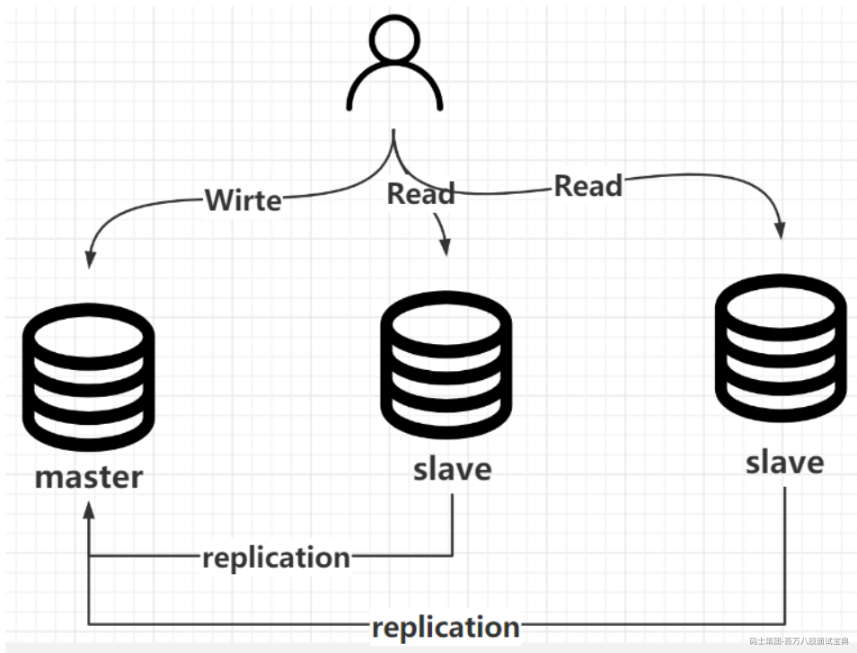

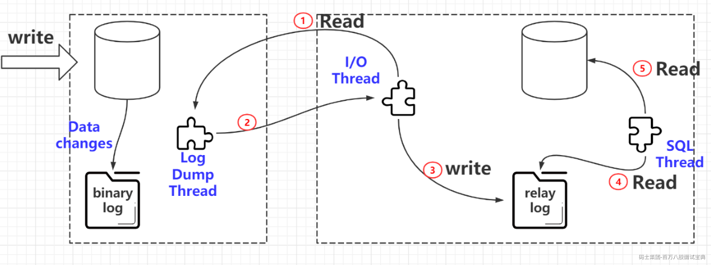

数据恢复：区别于Redo Log的崩溃恢复，数据恢复是基于业务数据的，比如删库跑路，而崩溃恢复是断电重启的

## **什么是预读？什么是预读取？**

磁盘读写，并不是按需读取，而是按页读取，一次至少读一页数据（一般是4K）但是Mysql的数据页是16K，如果未来要读取的数据就在页中，就能够省去后续的磁盘IO，提高效率。

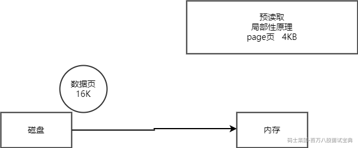

## 什么是Buffer Pool？ 聊到性能优化的一个点

缓存表数据与索引数据，把磁盘上的数据加载到缓冲池，避免每次访问都进行磁盘IO，起到加速访问的作用。

严老师 XXXXXXX 188888888 166666666 内存 ---缓存 -- 磁盘 交互 内存缓冲区

写满了 怎么办 内存淘汰 LRU 我尾部的数据 有可能是热数据

## Buffer Pool的内存淘汰策略

冷热分区的LRU策略

LRU链表会被拆分成为两部分，一部分为热数据，一部分为冷数据。冷数据占比 3/8，热数据5/8。

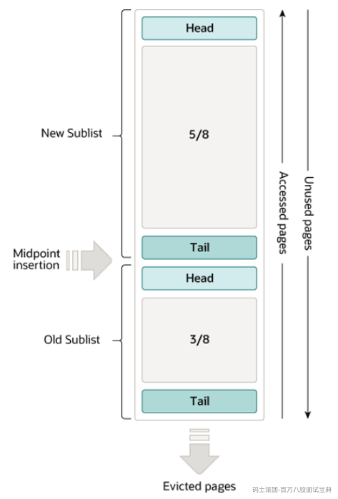

**数据页第一次加载进来，放在LRU链表的什么地方？**

放在冷数据区域的头部

**冷数据区域的缓存页什么时候放入热数据区域？**

MySQL设定了一个规则，在 innodb\_old\_blocks\_time 参数中，默认值为1000，也就是1000毫秒。

意味着，只有把数据页加载进缓存里，在经过1s之后再次对此缓存页进行访问才会将缓存页放到LRU链表热数据区域的头部。

**为什么是1秒？**

因为通过预读机制和全表扫描加载进来的数据页通常是1秒内就加载了很多，然后对他们访问一下，这些都是1秒内完成，他们会存放在冷数据区域等待刷盘清空，基本上不太会有机会放入到热数据区域，除非在1秒后还有人访问，说明后续可能还会有人访问，才会放入热数据区域的头部。

## Redo Log跟Buffer Pool的关系 重做日志 持久性

崩溃恢复 基本保障 系统自动做的

> InnoDB 引入了一个日志文件，叫做 redo log（重做日志），我们把所有对内存数据的修改操作写入日志文件，如果服务器出问题了，我们就从这个日志文件里面读取数据，恢复数据——用它来实现事务的持久性。
>
> redo log 有什么特点？
>
> 1.记录修改后的值，属于物理日志
>
> 2.redo log 的大小是固定的，前面的内容会被覆盖，所以不能用于数据回滚/数据恢复。
>
> 3.redo log 是 InnoDB 存储引擎实现的，并不是所有存储引擎都有。

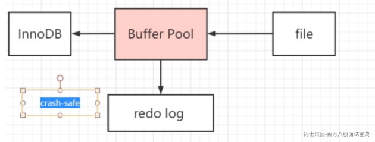

更新操作的流程：

1.从存储引擎层，拿到数据，记录到Buffer Pool，进一步的返回给Server层

2.server层会把这个数据页里面的数据进行修改

3.调用存储引擎，记录到Buffer Pool

4.Redo Log Undo Log 记录

5.事务提交

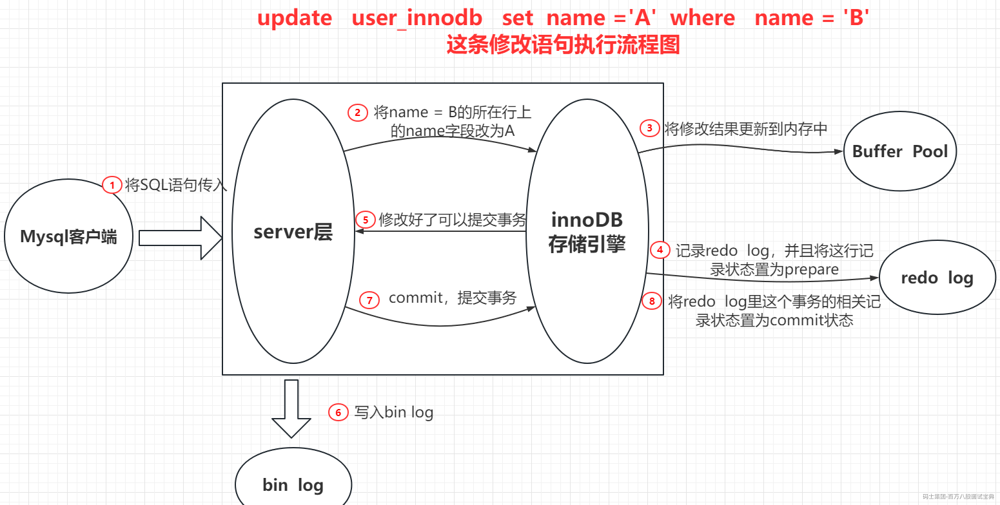

## 3.Mysql的体系结构是什么样子的（一条查询语句它到底是怎么执行的？）

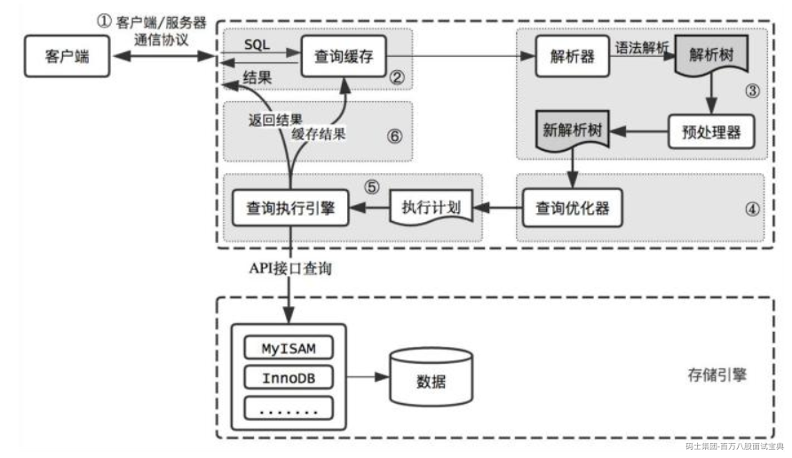

多表的SQL优化 A 200W B 500W C 300W sql优化 交集 A C = D B =目标表

小表驱动大表 150W 50条 10W

### 查询缓存(Query Cache)

MySQL 内部自带了一个缓存模块。默认是关闭的。主要是因为 MySQL 自带的缓存的应用场景有限，第一个是它要求 SQL 语句必须一模一样。第二个是表里面任何一条数据发生变化的时候，这张表所有缓存都会失效。

在 MySQL 5.8 中，查询缓存已经被移除了。

### 语法解析和预处理(Parser & Preprocessor)

下一步我们要做什么呢？

假如随便执行一个字符串 fkdljasklf ，服务器报了一个 1064 的错：

[Err] 1064 - You have an error in your SQL syntax; check the manual that corresponds to your MySQL server version for the right syntax to use near 'fkdljasklf' at line 1

服务器是怎么知道我输入的内容是错误的？

或者，当我输入了一个语法完全正确的 SQL，但是表名不存在，它是怎么发现的？

这个就是 MySQL 的 Parser 解析器和 Preprocessor 预处理模块。

这一步主要做的事情是对 SQL 语句进行词法和语法分析和语义的解析。

#### **词法解析**

词法分析就是把一个完整的 SQL 语句打碎成一个个的单词。

比如一个简单的 SQL 语句：

select name from user where id = 1;

它会打碎成 8 个符号，记录每个符号是什么类型，从哪里开始到哪里结束。

#### **语法解析**

第二步就是语法分析，语法分析会对 SQL 做一些语法检查，比如单引号有没有闭合，然后根据 MySQL

定义的语法规则，根据 SQL 语句生成一个数据结构。这个数据结构我们把它叫做解析树。

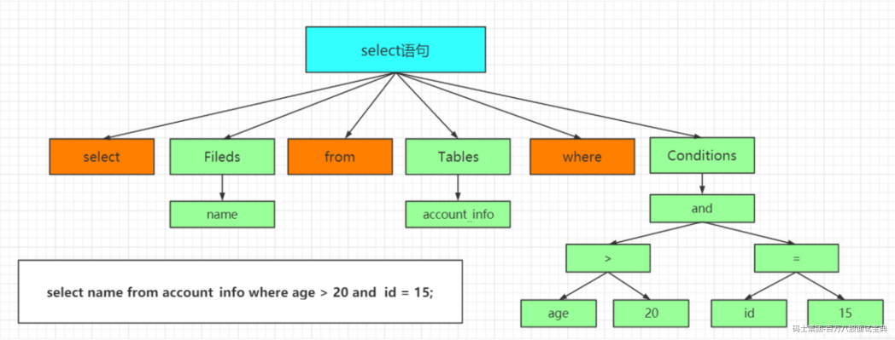

#### **预处理器（Preprocessor）**

如果表名错误，会在预处理器处理时报错。

它会检查生成的解析树，解决解析器无法解析的语义。比如，它会检查表和列名是否存在，检查名字和别名，保证没有歧义。

### 查询优化（Query Optimizer）与查询执行计划

#### **什么优化器？**

问题：一条 SQL 语句是不是只有一种执行方式？或者说数据库最终执行的 SQL 是不是就是我们发送 的 SQL？

这个答案是否定的。一条 SQL 语句是可以有很多种执行方式的。但是如果有这么多种执行方式，这些执行方式怎么得到的？最终选择哪一种去执行？根据什么判断标准去选择？

这个就是 MySQL 的查询优化器的模块（Optimizer）。

查询优化器的目的就是根据解析树生成不同的**执行计划**，然后选择一种最优的执行计划，MySQL 里面使用的是基于开销（cost）的优化器，那种执行计划开销最小，就用哪种。

```plain
使用如下命令查看查询的开销：
    show status like 'Last_query_cost'; 
    --代表需要随机读取几个 4K 的数据页才能完成查找。 
```

如果我们想知道优化器是怎么工作的，它生成了几种执行计划，每种执行计划的 cost 是多少，应该怎么做？

#### **优化器是怎么得到执行计划的？**

<https://dev.mysql.com/doc/internals/en/optimizer-tracing.html>

首先我们要启用优化器的追踪（默认是关闭的）：

```plain
SHOW VARIABLES LIKE 'optimizer_trace'; 

set optimizer_trace="enabled=on"; 
```

注意开启这开关是会消耗性能的，因为它要把优化分析的结果写到表里面，所以不要轻易开启，或者查看完之后关闭它（改成 off）。

接着我们执行一个 SQL 语句，优化器会生成执行计划：

```plain
select t.tcid from teacher t,teacher_contact tc where t.tcid = tc.tcid; 
```

这个时候优化器分析的过程已经记录到系统表里面了，我们可以查询：

```plain
select * from information_schema.optimizer_trace\G 
```

expanded\_query 是优化后的 SQL 语句。

```plain
considered_execution_plans 里面列出了所有的执行计划。 
```

记得关掉它：

```plain
        set optimizer_trace="enabled=off"; 

•       SHOW VARIABLES LIKE 'optimizer_trace'; 
```

#### **优化器可以做什么？**

MySQL 的优化器能处理哪些优化类型呢？

比如：

```plain
1、当我们对多张表进行关联查询的时候，以哪个表的数据作为基准表。 

2、select * from user where a=1 and b=2 and c=3，如果 c=3 的结果有 100 条，b=2 的结果有 200 条，		a=1 的结果有 300 条，你觉得会先执行哪个过滤？ 

3、如果条件里面存在一些恒等或者恒不等的等式，是不是可以移除。 

4、查询数据，是不是能直接从索引里面取到值。 

5、count()、min()、max()，比如是不是能从索引里面直接取到值。 

6、其他。
```

#### **优化器得到的结果**

优化器最终会把解析树变成一个查询执行计划，查询执行计划是一个数据结构。

当然，这个执行计划是不是一定是最优的执行计划呢？不一定，因为 MySQL 也有可能覆盖不到所有的执行计划。

MySQL 提供了一个执行计划的工具。我们在 SQL 语句前面加上 EXPLAIN，就可以看到执行计划的信息。

```plain
EXPLAIN select name from user where id=1; 
```

## 4.一条更新语句要经历那些流程

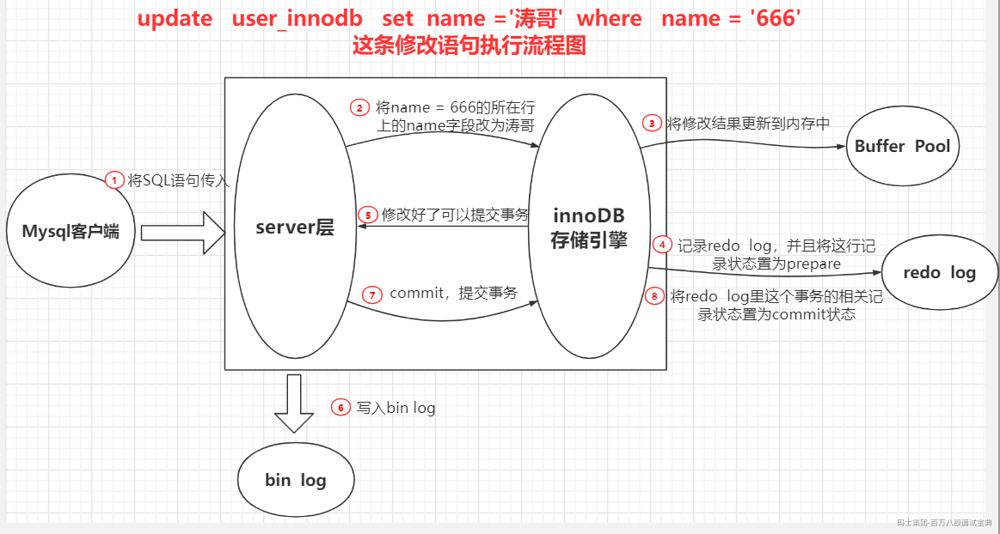

## 5.为什么Mysql要使用B+树做为索引 B树

1. B+树能显著减少IO次数，提高效率

2. B+树的查询效率更加稳定，因为数据放在叶子节点

3. B+树能提高范围查询的效率，因为叶子节点指向下一个叶子节点

4. B+树采取顺序读

## 6.磁盘的顺序读以及随机读有什么区别？

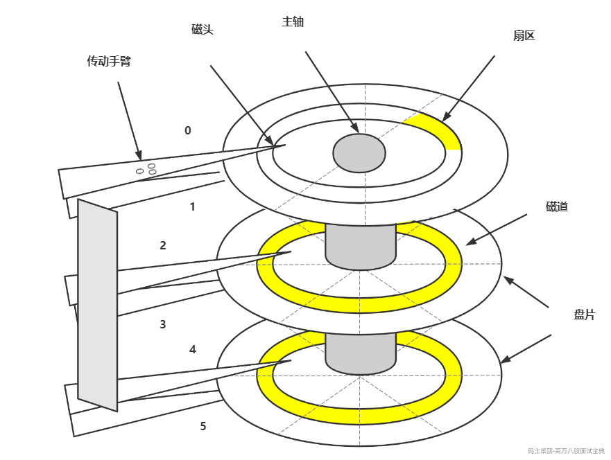

1.盘片

2.磁头

3.主轴

4.集成电路板

磁盘是如何完成单次IO的

单次的IO时间 = 寻道时间 + 旋转延迟 + 传送时间

顺序读指的是相邻或者相近的数据

## 什么是Hash索引

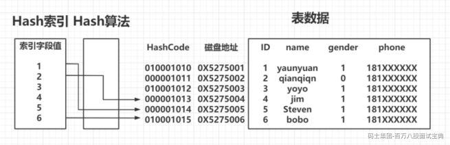

## 7.**索引使用原则（索引怎么使用才合理）**

```plain
我们容易有一个误区，就是在经常使用的查询条件上都建立索引，索引越多越好，那到底是不是这样呢？ 
```

#### **列的离散（sàn）度**

第一个叫做列的离散度，我们先来看一下列的离散度的公式：

不同值得数量：总行数 越接近1 那么离散度越高，越接近0，离散度越低

```plain
count(distinct(column_name)) : count(*)，列的全部不同值和所有数据行的比例。数据行数相同的情况下，分子越大，列的离散度就越高。
```

#### **联合索引最左匹配**

前面我们说的都是针对单列创建的索引，但有的时候我们的多条件查询的时候，也会建立联合索引，举例：查询成绩的时候必须同时输入身份证和考号。

联合索引在 B+Tree 中是复合的数据结构，它是按照从左到右的顺序来建立搜索树的（name 在左边，phone 在右边）。

从这张图可以看出来，name 是有序的，phone 是无序的。当 name 相等的时候，phone 才是有序的。  
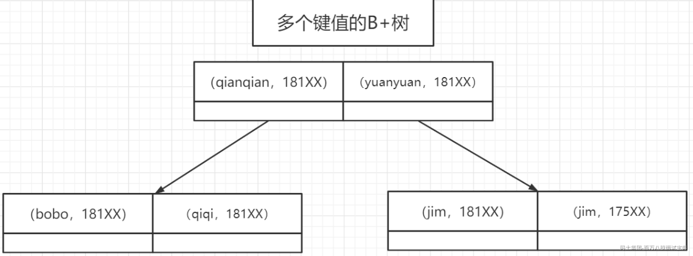  
这个时候我们使用 where name= 'jim' and phone = '136xx '去查询数据的时候，B+Tree 会优先比较 name 来确定下一步应该搜索的方向，往左还是往右。如果 name相同的时候再比较 phone。但是如果查询条件没有 name，就不知道第一步应该查哪个节点，因为建立搜索树的时候 name 是第一个比较因子，所以用不到索引。

#### **如何创建联合索引**

有一天我们的 DBA 找到我，说我们的项目里面有两个查询很慢，按照我们的想法，一个查询创建一个索引，所以我们针对这两条 SQL 创建了两个索引，这种做法觉得正确吗？

```plain
CREATE INDEX idx_name on user_innodb(name); 
CREATE INDEX idx_name_phone on user_innodb(name,phone);
```

当我们创建一个联合索引的时候，按照最左匹配原则，用左边的字段 name 去查询的时候，也能用到索引，所以第一个索引完全没必要。

相当于建立了两个联合索引(name),(name,phone)。

```plain
如果我们创建三个字段的索引 index(a,b,c)，相当于创建三个索引：

index(a) 

index(a,b) 

index(a,b,c) 

用 where b=? 和 where b=? and c=? 是不能使用到索引的。

这里就是 MySQL 里面联合索引的最左匹配原则。 
```

#### **覆盖索引与回表**

什么叫回表： 不需要回表 叫覆盖索引

聚集索引 ：id

二级索引 ：name

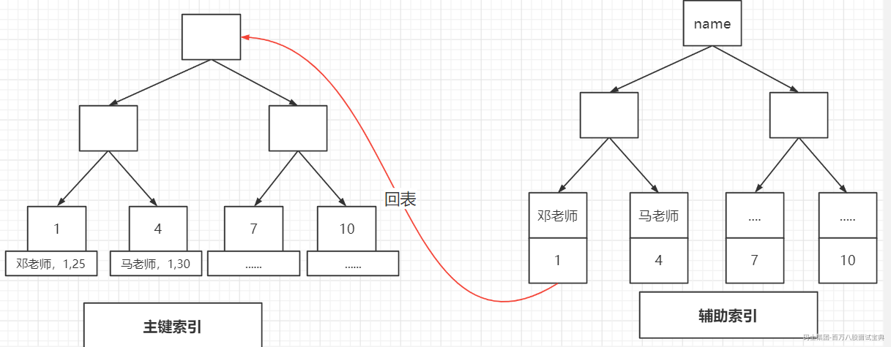

非主键索引，我们先通过索引找到主键索引的键值，再通过主键值查出索引里面没

有的数据，它比基于主键索引的查询多扫描了一棵索引树，这个过程就叫回表。

在辅助索引里面，不管是单列索引还是联合索引，如果 select 的数据列只用从索引中就能够取得，不必从数据区中读取，这时候使用的索引就叫做覆盖索引，这样就避免了回表。

Extra 里面值为“Using index”代表使用了覆盖索引。

## **8.** **索引的创建与使用**

因为索引对于改善查询性能的作用是巨大的，所以我们的目标是尽量合理的使用索引。

#### **在什么字段上索引？**

1、在用于 where 判断 order 排序和 join 的（on）字段上创建索引

2、索引的个数不要过多。

——浪费空间，更新变慢。

3、区分度低的字段，例如性别，不要建索引。

——离散度太低，导致扫描行数过多。

4、频繁更新的值，不要作为主键或者索引。

——页分裂

5、随机无序的值，不建议作为主键索引，例如身份证、UUID。

——无序，分裂

6、创建复合索引，而不是修改单列索引

#### **什么时候索引失效？**

1、索引列上使用函数（replace\SUBSTR\CONCAT\sum count avg）、表达式

2、字符串不加引号，出现隐式转换

3、like 条件中前面带%

4、负向查询 NOT LIKE 不能

**## MyiSAM与Innodb**

myi index

myd data

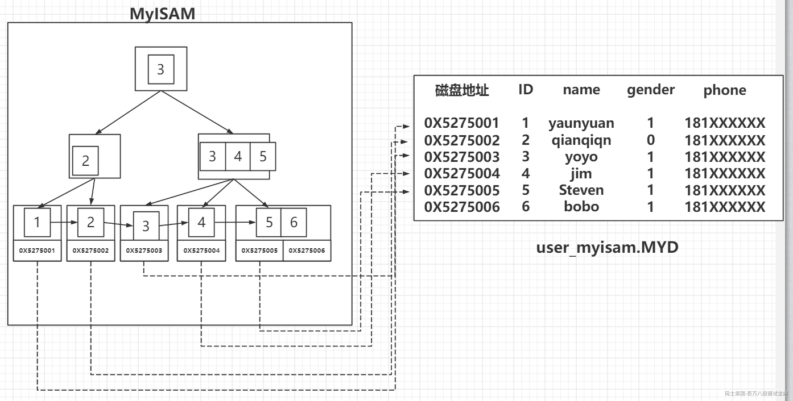

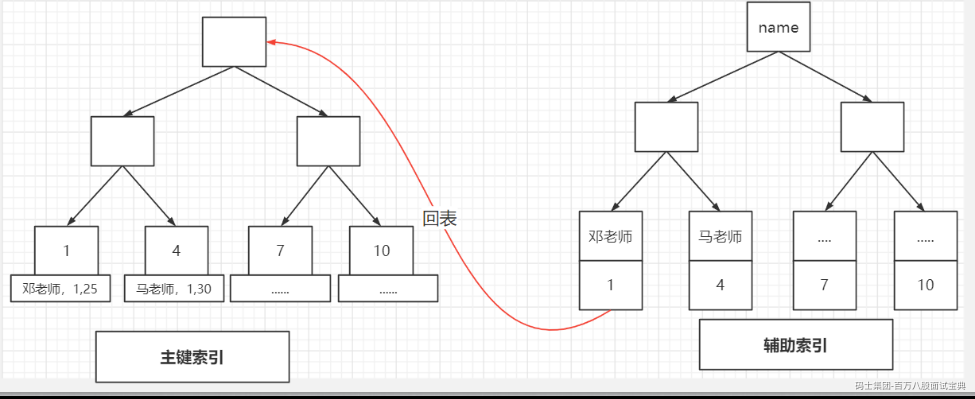

我们表内的数据是按照聚集索引的顺序排列的

聚集索引 二级索引

新华字典 目录 拼音 偏旁 五笔 XXXX


