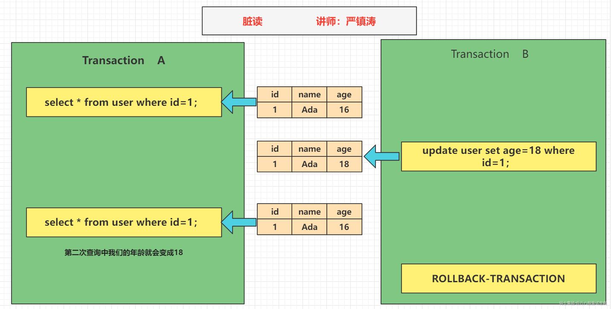
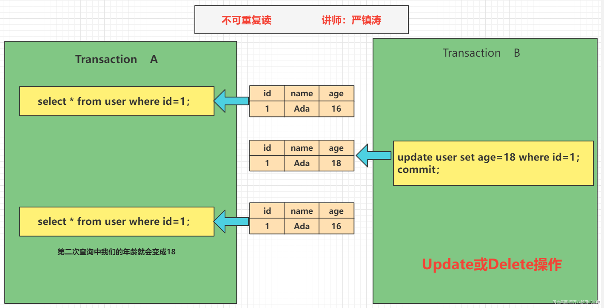
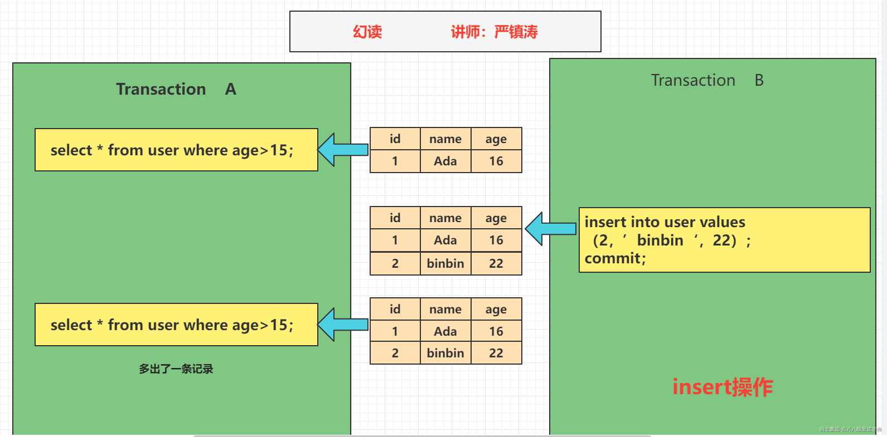
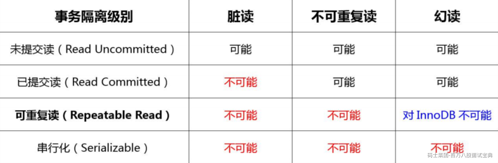
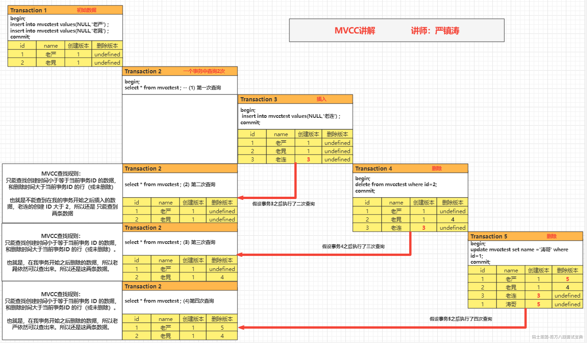
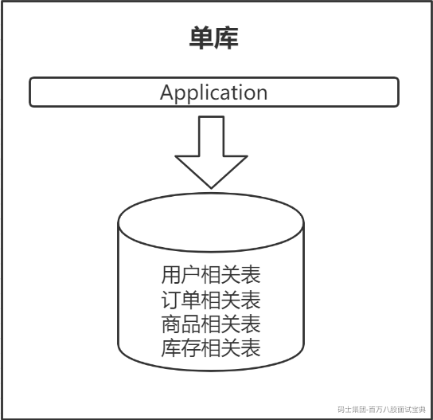
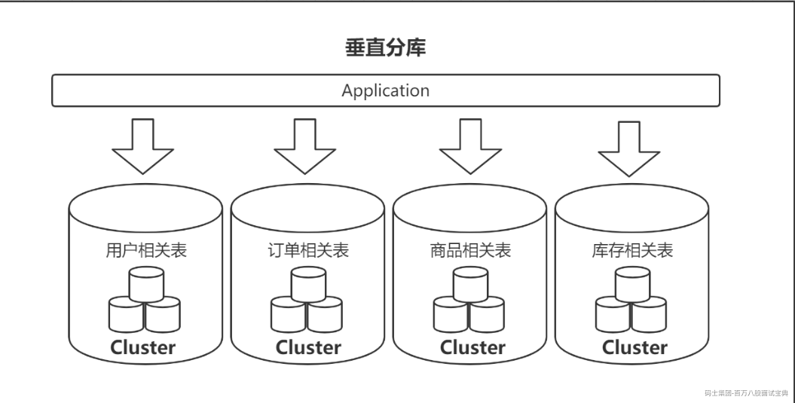
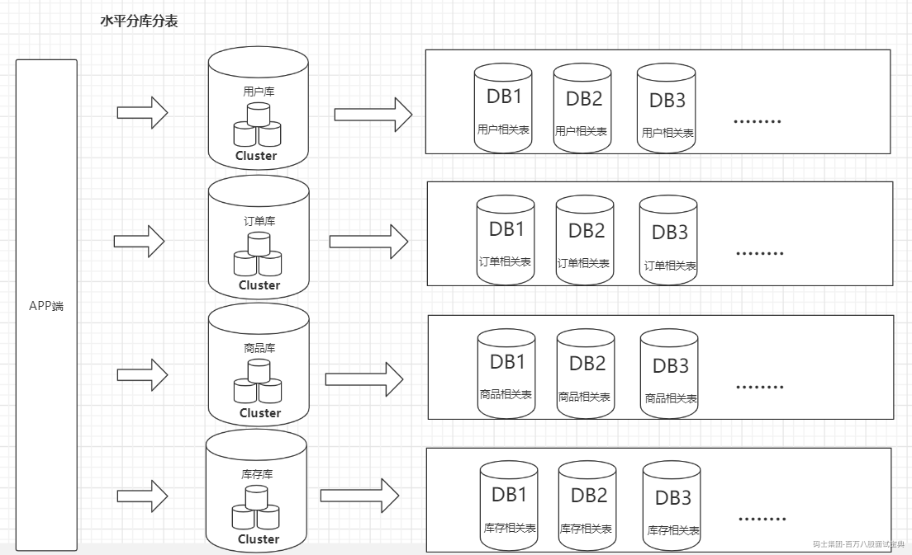

# mysql事务与锁 主讲人：严镇涛

<!-- readability-enhancement:start -->
> [!abstract] 速读地图
> 围绕「事务定义 -> ACID -> 并发问题 -> 隔离级别 -> MVCC/锁」组织答案。
>
> **本篇关键词：** <span style="color:#059669;font-weight:700">MySQL</span> ・ <span style="color:#059669;font-weight:700">ACID</span> ・ <span style="color:#059669;font-weight:700">隔离级别</span> ・ <span style="color:#059669;font-weight:700">MVCC</span> ・ <span style="color:#059669;font-weight:700">undo/redo log</span> ・ <span style="color:#dc2626;font-weight:700">锁</span>
>
> **优先扫这些问题：**
> - 什么是数据库的事务？
> - 哪些存储引擎支持事务
> - 事务的四大特性
> - 那么数据库什么时候会出现事务呢？
> - 事务并发会带来什么问题？
> - 拓展题：SQL92标准（时间不够就不讲，大家自己看）
> - Mysql的innoDB存储引擎对于隔离级别的支持
> - 如何解决数据的读一致性问题

> [!success] 面试背诵小结
> - 回答时用「定义 -> 原理 -> 场景 -> 坑点」四段式，能显得更稳。
> - 二刷时先看上面的关键词，再回到正文找例子和代码。
> - 真被追问时，优先把相似概念做对比，而不是继续堆定义。

> [!warning] 易混提醒
> 易混：脏读、不可重复读、幻读分别对应未提交读、已提交修改、范围新增；MVCC 主要解决读一致性。
<!-- readability-enhancement:end -->

---


## 1.什么是数据库的事务？

下单 订单表 物流表 资金表

转账 A 1000 +500

B 1000 -500

买火车票 长沙 上海 长沙 - 株洲 株洲 -- 上海 分布式事务 分布式场景 事务的问题

A - B A --成功 B 没有成功 多阶段提交 + 补偿机制 临时表 --- 主表

**事务的定义**

维基百科的定义：事务是数据库管理系统（DBMS）执行过程中的一个逻辑单位，由一个有限的数据库操作序列构成。

这里面有两个关键点，第一个，它是数据库最小的工作单元，是不可以再分的。第二个，它可能包含了一个或者一系列的 DML 语句，包括 insert delete update

## 2.哪些存储引擎支持事务

InnoDB 支持事务，这个也是它成为默认的存储引擎的一个重要原因：

`https://dev.mysql.com/doc/refman/5.7/en/storage-engines.html`

另一个是 NDB

## 3.事务的四大特性

**原子性（Atomicity）**

也就是我们刚才说的不可再分，也就意味着我们对数据库的一系列的操作，要么都是成功，要么都是失败，不可能出现部分成功或者部分失败的情况，以刚才提到的转账的场景为例，一个账户的余额减少，对应一个账户的增加，这两个一定是同时成功或者同时失败的。全部成功比较简单，问题是如果前面一个操作已经成功了，后面的操作失败了，怎么让它全部失败呢？这个时候我们必须要回滚。

原子性，在 InnoDB 里面是通过 undo log （回滚日志，撤销日志）来实现的，它记录了数据修改之前的值（逻辑日志），一旦发生异常，就可以用 undo log 来实现回滚操作。

**一致性（consistent）**

指的是数据库的完整性约束没有被破坏，事务执行的前后都是合法的数据状态。比如主键必须是唯一的，字段长度符合要求。

除了数据库自身的完整性约束，还有一个是用户自定义的完整性。

**举例：**

1.比如说转账的这个场景，A 账户余额减少 1000，B 账户余额只增加了 500，这个时候因为两个操作都成功了，按照我们对原子性的定义，它是满足原子性的， 但是它没有满足一致性，因为它导致了会计科目的不平衡。

2.还有一种情况，A 账户余额为 0，如果这个时候转账成功了，A 账户的余额会变成-1000，虽然它满足了原子性的，但是我们知道，借记卡的余额是不能够小于 0 的，所以也违反了一致性。用户自定义的完整性通常要在代码中控制。

**隔离性（isolation）**

有了事务的定义以后，在数据库里面会有很多的事务同时去操作我们的同一张表或者同一行数据，必然会产生一些并发或者干扰的操作，对隔离性就是这些很多个的事务，对表或者 行的并发操作，应该是透明的，互相不干扰的。通过这种方式，我们最终也是保证业务数据的一致性。

**持久性（Durable）**

我们对数据库的任意的操作，增删改，只要事务提交成功，那么结果就是永久性的，不可能因为我们重启了数据库的服务器，它又恢复到原来的状态了。 Redo Log 二阶段提交的

持久性怎么实现呢？数据库崩溃恢复（crash-safe）是通过什么实现的？持久性是通过 redo log 来实现的，我们操作数据的时候，会先写到内存的 buffer pool 里面，同时记录 redo log，如果在刷盘之前出现异常，在重启后就可以读取 redo log的内容，写入到磁盘，保证数据的持久性。

总结：原子性，隔离性，持久性，最后都是为了实现一致性

## 4.那么数据库什么时候会出现事务呢？

**举例：**

当我执行这样一条更新语句的时候，它有事务吗？

`update user_innodb set name = '涛哥' where id=1;`

实际上，它自动开启了一个事务，并且提交了，所以最终写入了磁盘。这个是开启事务的第一种方式，自动开启和自动提交。

InnoDB 里面有一个 autocommit 的参数（分成两个级别， session 级别和 global级别）。它的默认值是 ON

```sql
show variables like 'autocommit';
```

autocommit 这个参数是什么意思呢？是否自动提交。如果它的值是 true/on 的话，我们在操作数据的时候，会自动开启一个事务，和自动提交事务。

否则的话，如果我们把 autocommit 设置成 false/off，那么数据库的事务就需要我们手动地去开启和手动地去结束。

手动开启事务也有几种方式，一种是用 begin；一种是用 start transaction。

那么怎么结束一个事务呢？我们结束也有两种方式，第一种就是提交一个事务，commit；还有一种就是 rollback，回滚的时候，事务也会结束。

**还有一种情况，客户端的连接断开的时候，事务也会结束**

## 5.事务并发会带来什么问题？

当很多事务并发地去操作数据库的表或者行的时候，如果没有我们刚才讲的事务的Isolation 隔离性的时候，会带来哪些问题呢？

**脏读**



大家看一下，我们有两个事务，一个是 Transaction A，一个是 Transaction B，在第一个事务里面，它首先通过一个 where id=1 的条件查询一条数据，返回 name=Ada，age=16 的这条数据。然后第二个事务呢，它同样地是去操作 id=1 的这行数据，它通过一个 update 的语句，把这行 id=1 的数据的 age 改成了 18，但是大家注意，它没有提交。

这个时候，在第一个事务里面，它再次去执行相同的查询操作，发现数据发生了变化，获取到的数据 age 变成了 18。那么，这种在一个事务里面，由于其他的时候修改了数据并且没有提交，而导致了前后两次读取数据不一致的情况，这种事务并发的问题，我们把它定义成脏读。

**不可重复读**



```plain
同样是两个事务，第一个事务通过 id=1 查询到了一条数据。然后在第二个事务里面执行了一个 update 操作，这里大家注意一下，执行了 update 以后它通过一个 commit提交了修改。然后第一个事务读取到了其他事务已提交的数据导致前后两次读取数据不一致的情况，就像这里，age 到底是等于 16 还是 18，那么这种事务并发带来的问题，我们把它叫做不可重复读。
```

**幻读**

```plain
在第一个事务里面我们执行了一个范围查询，这个时候满足条件的数据只有一条。在第二个事务里面，它插入了一行数据，并且提交了。重点：插入了一行数据。在第一个事务里面再去查询的时候，它发现多了一行数据。
```



```plain
一个事务前后两次读取数据数据不一致，是由于其他事务插入数据造成的，这种情况我们把它叫做幻读。
```

**总结：**

不可重复读是修改或者删除，幻读是插入。

无论是脏读，还是不可重复读，还是幻读，它们都是数据库的读一致性的问题，都是在一个事务里面前后两次读取出现了不一致的情况。

## 6.拓展题：SQL92标准（时间不够就不讲，大家自己看）

```plain
读一致性的问题，必须要由数据库提供一定的事务隔离机制来解决。就像我们去饭店吃饭，基本的设施和卫生保证都是饭店提供的。那么我们使用数据库，隔离性的问题也必须由数据库帮助我们来解决。
```

```plain
我们来看一下 SQL92 标准的官网。(个人吐槽一下，这个官网是真的丑)
```

`http://www.contrib.andrew.cmu.edu/~shadow/sql/sql1992.txt`

```plain
这里面有一张表格（搜索_iso），里面定义了四个隔离级别，右边的 P1 P2 P3 就是代表事务并发的 3 个问题，脏读，不可重复读，幻读。Possible 代表在这个隔离级别下，这个问题有可能发生，换句话说，没有解决这个问题。Not Possible 就是解决了这个问题。
```

**Read Uncommitted（未提交读）**

一个事务可以读取到其他事务未提交的数据，会出现脏读，所以叫做 RU，它没有解决任何的问题。

**Read Committed（已提交读）**

一个事务只能读取到其他事务已提交的数据，不能读取到其他事务未提交的数据，它解决了脏读的问题，但是会出现不可重复读的问题。

**Repeatable Read（可重复读）**

它解决了不可重复读的问题，也就是在同一个事务里面多次读取同样的数据结果是一样的，但是在这个级别下，没有定义解决幻读的问题。

**Serializable（串行化）**

在这个隔离级别里面，所有的事务都是串行执行的，也就是对数据的操作需要排队，已经不存在事务的并发操作了，所以它解决了所有的问题。

总结：这个是 SQL92 的标准，但是不同的数据库厂商或者存储引擎的实现有一定的差异。

## 7.Mysql的innoDB存储引擎对于隔离级别的支持

在 MySQL InnoDB 里面，不需要使用串行化的隔离级别去解决所有问题。那我们来看一下 MySQL InnoDB 里面对数据库事务隔离级别的支持程度是什么样的。



InnoDB 支持的四个隔离级别和 SQL92 定义的基本一致，隔离级别越高，事务的并发度就越低。唯一的区别就在于，InnoDB 在 RR 的级别就解决了幻读的问题。这个也是InnoDB 默认使用 RR 作为事务隔离级别的原因，既保证了数据的一致性，又支持较高的并发度。

## 7.如何解决数据的读一致性问题

两大方案:

**LBCC**

第一种，既然要保证前后两次读取数据一致，那么读取数据的时候，锁定我要操作的数据，不允许其他的事务修改就行了。这种方案叫做基于锁的并发控制 Lock Based Concurrency Control（LBCC）。

如果仅仅是基于锁来实现事务隔离，一个事务读取的时候不允许其他时候修改，那就意味着不支持并发的读写操作，而我们的大多数应用都是读多写少的，这样会极大地影响操作数据的效率。

**MVCC**

<https://dev.mysql.com/doc/refman/5.7/en/innodb-multi-versioning.html>

另一种解决方案，如果要让一个事务前后两次读取的数据保持一致，那么我们可以在修改数据的时候给它建立一个备份或者叫快照，后面再来读取这个快照就行了。这种方案我们叫做多版本的并发控制 Multi Version Concurrency Control（MVCC）

MVCC 的核心思想是： 我可以查到在我这个事务开始之前已经存在的数据，即使它在后面被修改或者删除了。在我这个事务之后新增的数据，我是查不到的。



通过以上演示我们能看到，通过版本号的控制，无论其他事务是插入、修改、删除，第一个事务查询到的数据都没有变化。

在 InnoDB 中，MVCC 是通过 Undo log 实现的。

Oracle、Postgres 等等其他数据库都有 MVCC 的实现。

需要注意，在 InnoDB 中，MVCC 和锁是协同使用的来实现隔离性的，这两种方案并不是互斥的。

第一大类解决方案是锁，锁又是怎么实现读一致性的呢？

## MySQL InnoDB 锁的基本类型

`https://dev.mysql.com/doc/refman/5.7/en/innodb-locking.html`

**锁的基本模式——共享锁 S锁**

第一个行级别的锁就是我们在官网看到的 Shared Locks （共享锁），我们获取了一行数据的读锁以后，可以用来读取数据，所以它也叫做读锁。而且多个事务可以共享一把读锁。那怎么给一行数据加上读锁呢？

我们可以用 select lock in share mode;的方式手工加上一把读锁。

释放锁有两种方式，只要事务结束，锁就会自动事务，包括提交事务和结束事务。

**锁的基本模式——排它锁 X锁**

第二个行级别的锁叫做 Exclusive Locks（排它锁），它是用来操作数据的，所以又叫做写锁。只要一个事务获取了一行数据的排它锁，其他的事务就不能再获取这一行数据的共享锁和排它锁。

排它锁的加锁方式有两种，第一种是自动加排他锁，可能是同学们没有注意到的：

我们在操作数据的时候，包括增删改，都会默认加上一个排它锁。

还有一种是手工加锁，我们用一个 FOR UPDATE 给一行数据加上一个排它锁，这个无论是在我们的代码里面还是操作数据的工具里面，都比较常用。

释放锁的方式跟前面是一样的。

**锁的基本模式——意向锁**

意向锁是由数据库自己维护的。

也就是说，当我们给一行数据加上共享锁之前，会自动在这张表上面加一个意向共享锁。

当我们给一行数据加上排他锁之前，会自动在这张表上面加一个意向排他锁。

反过来说：

如果一张表上面至少有一个意向共享锁，说明有其他的事务给其中的某些数据行加上了共享锁。

**锁的算法**

t2 这张表 id 有一个主键索引。我们插入了 4 行数据，主键 id 分别是 1、4、7、10。

我们这里的划分标准是主键 id。

这些数据库里面存在的主键值，我们把它叫做 Record，记录，那么这里我们就有 4 个 Record。

根据主键，这些存在的 Record 隔开的数据不存在的区间，我们把它叫做 Gap，间隙，它是一个左开右开的区间。

假设我们有 N 个 Record，那么所有的数据会被划分成多少个 Gap 区间？答案是 N+1，就像我们把一条绳子砍 N 刀，它最后肯定是变成 N+1 段。

最后一个，间隙（Gap）连同它左边的记录（Record），我们把它叫做临键的区间，它是一个左开右闭的区间。

如果主键索引不是整型，是字符怎么办呢？字符可以排序吗？ 基于 ASCII 码

**记录锁**

第一种情况，当我们对于唯一性的索引（包括唯一索引和主键索引）使用等值查询，精准匹配到一

条记录的时候，这个时候使用的就是记录锁。

比如 where id = 1 4 7 10 。

**间隙锁**

第二种情况，当我们查询的记录不存在，无论是用等值查询还是范围查询的时候，它使用的都是间隙锁。

**临键锁**

第三种情况，当我们使用了范围查询，不仅仅命中了 Record 记录，还包含了 Gap 间隙，在这种情况下我们使用的就是临键锁，它是 MySQL 里面默认的行锁算法，相当于记录锁加上间隙锁。

比如我们使用>5 &#x3c;9 ， 它包含了不存在的区间，也包含了一个 Record 7。

锁住最后一个 key 的下一个左开右闭的区间。

select \* from t2 where id >5 and id &#x3c;=7 for update; 锁住(4,7]和(7,10]

select \* from t2 where id >8 and id &#x3c;=10 for update; 锁住 (7,10]，(10,+∞)\*\*

总结：为什么要锁住下一个左开右闭的区间？——就是为了解决幻读的问题。

#### 分库分表

垂直分库，减少并发压力。水平分表，解决存储瓶颈。

垂直分库的做法，把一个数据库按照业务拆分成不同的数据库：



水平分库分表的做法，把单张表的数据按照一定的规则分布到多个数据库。



以上是架构层面的优化，可以用缓存，主从，分库分表

阿里规约 500W以上的表 都需要分表处理 为了让你的树层级 不超过3层

10个字段 1K 16384字节 左子树的地址 右子树的地址 键值

## 如何进行慢SQL查询

`https://dev.mysql.com/doc/refman/5.7/en/slow-query-log.html`

##### 打开慢日志开关\*\*

因为开启慢查询日志是有代价的（跟 bin log、optimizer-trace 一样），所以它默认是关闭的：

```sql
show variables like 'slow_query%';
```


除了这个开关，还有一个参数，控制执行超过多长时间的 SQL 才记录到慢日志，默认是 10 秒。

除了这个开关，还有一个参数，控制执行超过多长时间的 SQL 才记录到慢日志，默认是 10 秒。

```sql
show variables like '%long_query%';
```

```plain
可以直接动态修改参数（重启后失效）。
```

```sql
set @@global.slow_query_log=1; -- 1 开启，0 关闭，重启后失效 
set @@global.long_query_time=3; -- mysql 默认的慢查询时间是 10 秒，另开一个窗口后才会查到最新值 

show variables like '%long_query%'; 
show variables like '%slow_query%';
```

```plain
或者修改配置文件 my.cnf。
```

```plain
以下配置定义了慢查询日志的开关、慢查询的时间、日志文件的存放路径。
```

```sql
slow_query_log = ON 
long_query_time=2 
slow_query_log_file =/var/lib/mysql/localhost-slow.log
```

```plain
模拟慢查询：
```

```sql
select sleep(10);
```

```plain
查询 user_innodb 表的 500 万数据（检查是不是没有索引）。
```

```sql
SELECT * FROM `user_innodb` where phone = '136';
```

##### **4.1.2 慢日志分析**

**1、日志内容**

```sql
show global status like 'slow_queries'; -- 查看有多少慢查询 
show variables like '%slow_query%'; -- 获取慢日志目录
```

```sql
cat /var/lib/mysql/ localhost-slow.log
```


```plain
有了慢查询日志，怎么去分析统计呢？比如 SQL 语句的出现的慢查询次数最多，平均每次执行了多久？人工肉眼分析显然不可能。
```

**2、mysqldumpslow**

`https://dev.mysql.com/doc/refman/5.7/en/mysqldumpslow.html`

MySQL 提供了 mysqldumpslow 的工具，在 MySQL 的 bin 目录下。

```sql
mysqldumpslow --help
```

例如：查询用时最多的 10 条慢 SQL：

```sql
mysqldumpslow -s t -t 10 -g 'select' /var/lib/mysql/localhost-slow.log
```


Count 代表这个 SQL 执行了多少次；

Time 代表执行的时间，括号里面是累计时间；

Lock 表示锁定的时间，括号是累计；

Rows 表示返回的记录数，括号是累计。

除了慢查询日志之外，还有一个 SHOW PROFILE 工具可以使用

## 如何查看执行计划

<https://dev.mysql.com/doc/refman/5.7/en/explain-output.html>

我们先创建三张表。一张课程表，一张老师表，一张老师联系方式表（没有任何索引）。

我们先创建三张表。一张课程表，一张老师表，一张老师联系方式表（没有任何索引）。

```sql
DROP TABLE
IF
    EXISTS course;

CREATE TABLE `course` ( `cid` INT ( 3 ) DEFAULT NULL, `cname` VARCHAR ( 20 ) DEFAULT NULL, `tid` INT ( 3 ) DEFAULT NULL ) ENGINE = INNODB DEFAULT CHARSET = utf8mb4;

DROP TABLE
IF
    EXISTS teacher;

CREATE TABLE `teacher` ( `tid` INT ( 3 ) DEFAULT NULL, `tname` VARCHAR ( 20 ) DEFAULT NULL, `tcid` INT ( 3 ) DEFAULT NULL ) ENGINE = INNODB DEFAULT CHARSET = utf8mb4;

DROP TABLE
IF
    EXISTS teacher_contact;

CREATE TABLE `teacher_contact` ( `tcid` INT ( 3 ) DEFAULT NULL, `phone` VARCHAR ( 200 ) DEFAULT NULL ) ENGINE = INNODB DEFAULT CHARSET = utf8mb4;

INSERT INTO `course`
VALUES
    ( '1', 'mysql', '1' );

INSERT INTO `course`
VALUES
    ( '2', 'jvm', '1' );

INSERT INTO `course`
VALUES
    ( '3', 'juc', '2' );

INSERT INTO `course`
VALUES
    ( '4', 'spring', '3' );

INSERT INTO `teacher`
VALUES
    ( '1', 'bobo', '1' );

INSERT INTO `teacher`
VALUES
    ( '2', '老严', '2' );

INSERT INTO `teacher`
VALUES
    ( '3', 'dahai', '3' );

INSERT INTO `teacher_contact`
VALUES
    ( '1', '13688888888' );

INSERT INTO `teacher_contact`
VALUES
    ( '2', '18166669999' );

INSERT INTO `teacher_contact`
VALUES
    ( '3', '17722225555' );
```

```plain
explain 的结果有很多的字段，我们详细地分析一下。
```

```plain
先确认一下环境：
```

```sql
select version(); 
show variables like '%engine%';
```

##### **4.3.1** **id**

```plain
id 是查询序列编号。
```

**id 值不同**

```plain
id 值不同的时候，先查询 id 值大的（先大后小）。
```

```sql
-- 查询 mysql 课程的老师手机号
EXPLAIN SELECT
    tc.phone 
FROM
    teacher_contact tc 
WHERE
    tcid = ( SELECT tcid FROM teacher t WHERE t.tid = ( SELECT c.tid FROM course c WHERE c.cname = 'mysql' ) );
```

```plain
查询顺序：course c——teacher t——teacher_contact tc。
```


```plain
先查课程表，再查老师表，最后查老师联系方式表。子查询只能以这种方式进行，只有拿到内层的结果之后才能进行外层的查询。
```

**id 值相同（从上往下）**

```sql
-- 查询课程 ID 为 2，或者联系表 ID 为 3 的老师 
EXPLAIN SELECT
    t.tname,
    c.cname,
    tc.phone 
FROM
    teacher t,
    course c,
    teacher_contact tc 
WHERE
    t.tid = c.tid 
    AND t.tcid = tc.tcid 
    AND ( c.cid = 2 OR tc.tcid = 3 );
```


```plain
id 值相同时，表的查询顺序是
```

**从上往下**顺序执行。例如这次查询的 id 都是 1，查询的顺序是 teacher t（3 条）——course c（4 条）——teacher\_contact tc（3 条）。

**既有相同也有不同**

```plain
如果 ID 有相同也有不同，就是 ID 不同的先大后小，ID 相同的从上往下。
```

##### **4.3.2** **select type** **查询类型**

```plain
这里并没有列举全部（其它：DEPENDENT UNION、DEPENDENT SUBQUERY、MATERIALIZED、UNCACHEABLE SUBQUERY、UNCACHEABLE UNION）。
```

```plain
下面列举了一些常见的查询类型：
```

**SIMPLE**

```plain
简单查询，不包含子查询，不包含关联查询 union。
```

```sql
EXPLAIN SELECT * FROM teacher;
```


再看一个包含子查询的案例：

```sql
-- 查询 mysql 课程的老师手机号 
EXPLAIN SELECT
    tc.phone 
FROM
    teacher_contact tc 
WHERE
    tcid = ( SELECT tcid FROM teacher t WHERE t.tid = ( SELECT c.tid FROM course c WHERE c.cname = 'mysql' ) );
```


**PRIMARY**

```plain
子查询 SQL 语句中的主查询，也就是最外面的那层查询。
```

**SUBQUERY**

```plain
子查询中所有的内层查询都是 SUBQUERY 类型的。
```

**DERIVED**

```plain
衍生查询，表示在得到最终查询结果之前会用到临时表。例如：
```

```sql
-- 查询 ID 为 1 或 2 的老师教授的课程
EXPLAIN SELECT
    cr.cname 
FROM
    ( SELECT * FROM course WHERE tid = 1 UNION SELECT * FROM course WHERE tid = 2 ) cr;
```


```plain
对于关联查询，先执行右边的 table（UNION），再执行左边的 table，类型是DERIVED
```

**UNION**

```plain
用到了 UNION 查询。同上例。
```

**UNION RESULT**

```plain
主要是显示哪些表之间存在 UNION 查询。<union2,3>代表 id=2 和 id=3 的查询存在 UNION。同上例。
```

##### **4.3.3** **type** **连接类型**

<https://dev.mysql.com/doc/refman/5.7/en/explain-output.html#explain-join-types>

```plain
所有的连接类型中，上面的最好，越往下越差。
```

```plain
在常用的链接类型中：system > const > eq_ref > ref > range > index > all
```

```plain
这 里 并 没 有 列 举 全 部 （ 其 他 ： fulltext 、 ref_or_null 、 index_merger 、unique_subquery、index_subquery）。
```

以上访问类型除了 all，都能用到索引。

**const**

```plain
主键索引或者唯一索引，只能查到一条数据的 SQL。
```

```sql
DROP TABLE
IF
    EXISTS single_data;
CREATE TABLE single_data ( id INT ( 3 ) PRIMARY KEY, content VARCHAR ( 20 ) );
INSERT INTO single_data
VALUES
    ( 1, 'a' );
EXPLAIN SELECT
    * 
FROM
    single_data a 
WHERE
    id = 1;
```

**system**

```plain
system 是 const 的一种特例，只有一行满足条件。例如：只有一条数据的系统表。
```

```sql
EXPLAIN SELECT * FROM mysql.proxies_priv;
```


**eq\_ref**

```plain
通常出现在多表的 join 查询，表示对于前表的每一个结果,，都只能匹配到后表的一行结果。一般是唯一性索引的查询（UNIQUE 或 PRIMARY KEY）。
```

```plain
eq_ref 是除 const 之外最好的访问类型。
```

```plain
先删除 teacher 表中多余的数据，teacher_contact 有 3 条数据，teacher 表有 3条数据。
```

```sql
DELETE 
FROM
    teacher 
WHERE
    tid IN ( 4, 5, 6 );
COMMIT;
-- 备份
INSERT INTO `teacher`
VALUES
    ( 4, '老严', 4 );
INSERT INTO `teacher`
VALUES
    ( 5, 'bobo', 5 );
INSERT INTO `teacher`
VALUES
    ( 6, 'seven', 6 );
COMMIT;
```

```plain
为 teacher_contact 表的 tcid（第一个字段）创建主键索引。
```

```sql
-- ALTER TABLE teacher_contact DROP PRIMARY KEY; 
ALTER TABLE teacher_contact ADD PRIMARY KEY(tcid);
```

```plain
为 teacher 表的 tcid（第三个字段）创建普通索引。
```

```sql
-- ALTER TABLE teacher DROP INDEX idx_tcid;
ALTER TABLE teacher ADD INDEX idx_tcid (tcid);
```

```plain
执行以下 SQL 语句：
```

```sql
select t.tcid from teacher t,teacher_contact tc where t.tcid = tc.tcid;
```


```plain
此时的执行计划（teacher_contact 表是 eq_ref）：
```


**小结：**

以上三种 system，const，eq\_ref，都是可遇而不可求的，基本上很难优化到这个状态。

**ref**

```plain
查询用到了非唯一性索引，或者关联操作只使用了索引的最左前缀。
```

```plain
例如：使用 tcid 上的普通索引查询：
```

```sql
explain SELECT * FROM teacher where tcid = 3;
```


**range**

```plain
索引范围扫描。
```

```plain
如果 where 后面是 between and 或 <或 > 或 >= 或 <=或 in 这些，type 类型就为 range。
```

```plain
不走索引一定是全表扫描（ALL），所以先加上普通索引。
```

```sql
-- ALTER TABLE teacher DROP INDEX idx_tid; 
ALTER TABLE teacher ADD INDEX idx_tid (tid);
```

```plain
执行范围查询（字段上有普通索引）：
```

```sql
EXPLAIN SELECT * FROM teacher t WHERE t.tid <3; 
-- 或
EXPLAIN SELECT * FROM teacher t WHERE tid BETWEEN 1 AND 2;
```


```plain
IN 查询也是 range（字段有主键索引）
```

```sql
EXPLAIN SELECT * FROM teacher_contact t WHERE tcid in (1,2,3);
```


**index**

```plain
Full Index Scan，查询全部索引中的数据（比不走索引要快）。
```

```sql
EXPLAIN SELECT tid FROM teacher;
```


**all**

```plain
Full Table Scan，如果没有索引或者没有用到索引，type 就是 ALL。代表全表扫描。
```

**小结：**

```plain
一般来说，需要保证查询至少达到 range 级别，最好能达到 ref。
```

```plain
ALL（全表扫描）和 index（查询全部索引）都是需要优化的。
```

##### **4.3.4** **possible\_key、key**

```plain
可能用到的索引和实际用到的索引。如果是 NULL 就代表没有用到索引。
```

```plain
possible_key 可以有一个或者多个，可能用到索引不代表一定用到索引。
```

```plain
反过来，possible_key 为空，key 可能有值吗？
```

```plain
表上创建联合索引：
```

```sql
ALTER TABLE user_innodb DROP INDEX comidx_name_phone; 
ALTER TABLE user_innodb add INDEX comidx_name_phone (name,phone);
```

```plain
执行计划（改成 select name 也能用到索引）：
```

```sql
explain select phone from user_innodb where phone='126';
```


```plain
结论：是有可能的（这里是覆盖索引的情况）。
```

```plain
如果通过分析发现没有用到索引，就要检查 SQL 或者创建索引。
```

##### **4.3.5** **key\_len**

```plain
索引的长度（使用的字节数）。跟索引字段的类型、长度有关。
```

```plain
表上有联合索引：KEY
```

`comidx_name_phone` (`name`,`phone`)

```sql
explain select * from user_innodb where name ='jim';
```

##### **4.3.6** **rows**

```plain
MySQL 认为扫描多少行才能返回请求的数据，是一个预估值。一般来说行数越少越好。
```

##### **4.3.7** **filtered**

```plain
这个字段表示存储引擎返回的数据在 server 层过滤后，剩下多少满足查询的记录数量的比例，它是一个百分比。
```

##### **4.3.8** **ref**

```plain
使用哪个列或者常数和索引一起从表中筛选数据。
```

##### **4.3.9** **Extra**

```plain
执行计划给出的额外的信息说明。
```

**using index**

```plain
用到了覆盖索引，不需要回表。
```

```sql
EXPLAIN SELECT tid FROM teacher ;
```

**using where**

```plain
使用了 where 过滤，表示存储引擎返回的记录并不是所有的都满足查询条件，需要在 server 层进行过滤（跟是否使用索引没有关系）。
```

```sql
EXPLAIN select * from user_innodb where phone ='13866667777';
```


**using filesort**

```plain
不能使用索引来排序，用到了额外的排序（跟磁盘或文件没有关系）。需要优化。（复合索引的前提）
```

```sql
ALTER TABLE user_innodb DROP INDEX comidx_name_phone; 
ALTER TABLE user_innodb add INDEX comidx_name_phone (name,phone);
```

```sql
EXPLAIN select * from user_innodb where name ='jim' order by id;
```

```plain
（order by id 引起）
```


**using temporary**

```plain
用到了临时表。例如（以下不是全部的情况）：
```

```plain
1、distinct 非索引列
```

```sql
EXPLAIN select DISTINCT(tid) from teacher t;
```

```plain
2、group by 非索引列
```

```sql
EXPLAIN select tname from teacher group by tname;
```

```plain
3、使用 join 的时候，group 任意列
```

```sql
EXPLAIN select t.tid from teacher t join course c on t.tid = c.tid group by t.tid;
```

```plain
需要优化，例如创建复合索引。
```

总结一下：

模拟优化器执行 SQL 查询语句的过程，来知道 MySQL 是怎么处理一条 SQL 语句的。通过这种方式我们可以分析语句或者表的性能瓶颈。

分析出问题之后，就是对 SQL 语句的具体优化。


