# mysql性能优化 主讲人：严镇涛

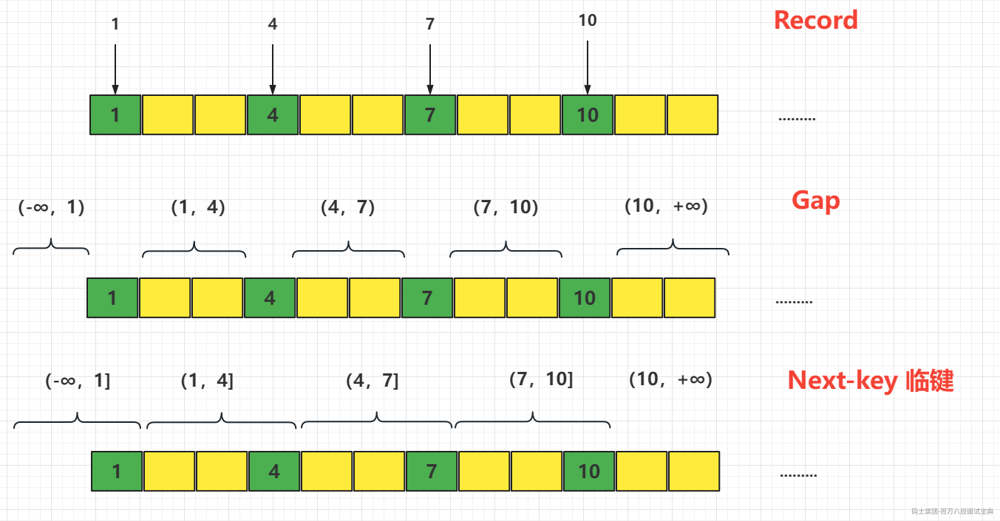

**记录锁**

第一种情况，当我们对于唯一性的索引（包括唯一索引和主键索引）使用等值查询，精准匹配到一

条记录的时候，这个时候使用的就是记录锁。

比如 where id = 1 4 7 10 。

**间隙锁**

第二种情况，当我们查询的记录不存在，无论是用等值查询还是范围查询的时候，它使用的都是间隙锁。

**临键锁**

第三种情况，当我们使用了范围查询，不仅仅命中了 Record 记录，还包含了 Gap 间隙，在这种情况下我们使用的就是临键锁，它是 MySQL 里面默认的行锁算法，相当于记录锁加上间隙锁。

比如我们使用>5 &#x3c;9 ， 它包含了不存在的区间，也包含了一个 Record 7。

锁住最后一个 key 的下一个左开右闭的区间。

select \* from t2 where id >5 and id &#x3c;=7 for update; 锁住(4,7]和(7,10]

select \* from t2 where id >8 and id &#x3c;=10 for update; 锁住 (7,10]，(10,+∞)\*\*

总结：为什么要锁住下一个左开右闭的区间？——就是为了解决幻读的问题。

MVCC出现幻读问题的本质:

为什么出现幻读问题 ：

假设我们查询表格

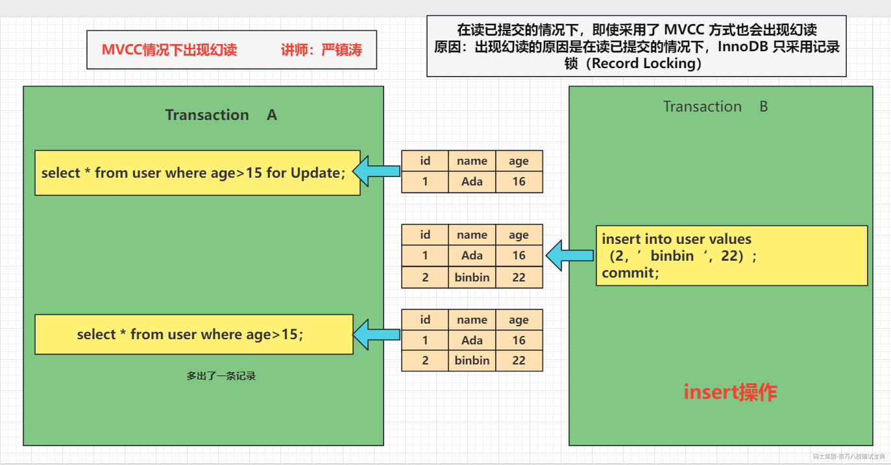

> 事务A对 `user`表执行了 `SELECT * FROM user WHERE age > 15 FOR UPDATE;`语句，这将会对满足条件的行加行级锁，以阻止其他事务对这些行进行修改。事务B则尝试插入新数据，但是它不会受到事务A的锁定影响，因为插入操作不会涉及到已存在的行。

```sql
//第一个事务
set session transaction isolation level read committed;
begin;
select * from t2 where  name >6  for  update
//第二个事务
set session transaction isolation level read committed;
insert into t2  values(8,'2');
commit;
//查询锁状态
select * from sys.innodb_lock_waits
```

在这种情况下，事务A加的锁是行级锁（记录锁），而不是间隙锁（Gap Lock）。行级锁仅锁定满足条件的每一行，而不包括间隙或未满足条件的行。因此，事务B可以在不影响事务A的情况下插入新数据。

第二种情况：

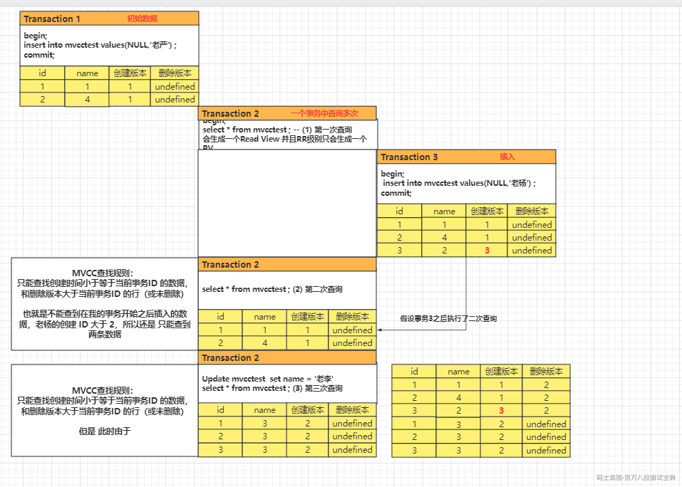

Read View:

MVCC 机制中，多个事务对同一个行记录进行更新会产生多个历史快照，这些历史快照保存在 Undo Log 里。如果一个事务想要查询这个行记录，需要读取哪个版本的行记录呢？这时就需要用到 Read View 了，它帮我们解决了行的可见性问题。Read View 保存了当前事务开启时所有活跃（还没有提交）的事务列表，换个角度，可以理解为 Read View 保存了不应该让这个事务看到的其他的事务 ID 列表

快照读：  
读取的是快照数据，不加锁的简单的SELECT都属于快照读（只是普通的读操作）。

当前读：  
当前读就是读取最新数据，而不是历史版本的数据。  
加锁的SELECT，或者对数据进行增删改都会进行当前读（包括加锁的读取和DML操作）。

如何解决幻读  
在快照读情况下，mysql通过mvcc来避免幻读。  
在当前读情况下，mysql通过X锁或next-key来避免其他事务修改:

1.使用串行化读的隔离级别  
2.(update、delete)当where条件为主键时，通过对主键索引加record locks(索引加锁/行锁)处理幻读。  
3.(update、delete)当where条件为非主键索引时，通过next-key锁处理。next-key是record locks(索引加锁/行锁) 和 gap locks(间隙锁，每次锁住的不光是需要使用的数据，还会锁住这些数据附近的数据)的结合。

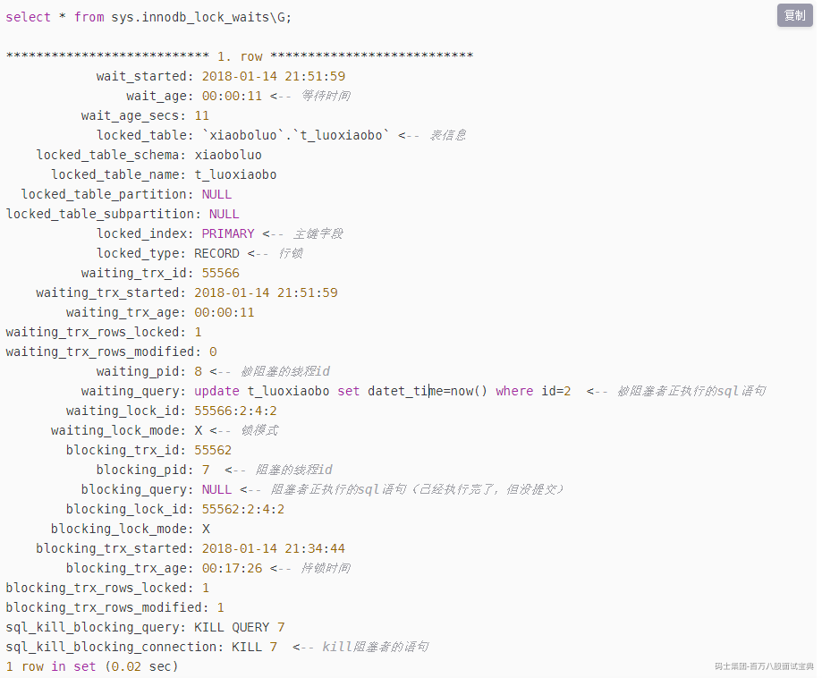

## 如何进行慢SQL查询

`https://dev.mysql.com/doc/refman/5.7/en/slow-query-log.html`

##### 打开慢日志开关

因为开启慢查询日志是有代价的（跟 bin log、optimizer-trace 一样），所以它默认是关闭的：

```sql
show variables like 'slow_query%';
```

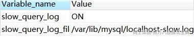

除了这个开关，还有一个参数，控制执行超过多长时间的 SQL 才记录到慢日志，默认是 10 秒。

除了这个开关，还有一个参数，控制执行超过多长时间的 SQL 才记录到慢日志，默认是 10 秒。

```sql
show variables like '%long_query%';
```

```plain
可以直接动态修改参数（重启后失效）。
```

```sql
set @@global.slow_query_log=1; -- 1 开启，0 关闭，重启后失效 
set @@global.long_query_time=3; -- mysql 默认的慢查询时间是 10 秒，另开一个窗口后才会查到最新值 

show variables like '%long_query%'; 
show variables like '%slow_query%';
```

```plain
或者修改配置文件 my.cnf。
```

```plain
以下配置定义了慢查询日志的开关、慢查询的时间、日志文件的存放路径。
```

```sql
slow_query_log = ON 
long_query_time=2 
slow_query_log_file =/var/lib/mysql/localhost-slow.log
```

```plain
模拟慢查询：
```

```sql
select sleep(10);
```

```plain
查询 user_innodb 表的 500 万数据（检查是不是没有索引）。
```

```sql
SELECT * FROM `user_innodb` where phone = '136';
```

##### **4.1.2 慢日志分析**

**1、日志内容**

```sql
show global status like 'slow_queries'; -- 查看有多少慢查询 
show variables like '%slow_query%'; -- 获取慢日志目录
```

```sql
cat /var/lib/mysql/ localhost-slow.log
```

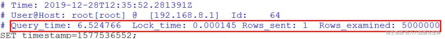

```plain
有了慢查询日志，怎么去分析统计呢？比如 SQL 语句的出现的慢查询次数最多，平均每次执行了多久？人工肉眼分析显然不可能。
```

**2、mysqldumpslow**

`https://dev.mysql.com/doc/refman/5.7/en/mysqldumpslow.html`

MySQL 提供了 mysqldumpslow 的工具，在 MySQL 的 bin 目录下。

```sql
mysqldumpslow --help
```

例如：查询用时最多的 10 条慢 SQL：

```sql
mysqldumpslow -s t -t 10 -g 'select' /var/lib/mysql/localhost-slow.log
```

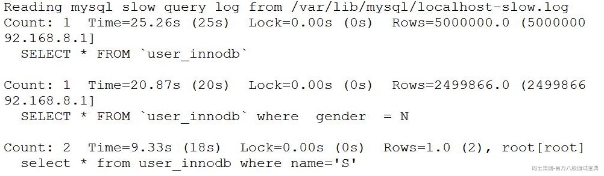

Count 代表这个 SQL 执行了多少次；

Time 代表执行的时间，括号里面是累计时间；

Lock 表示锁定的时间，括号是累计；

Rows 表示返回的记录数，括号是累计。

除了慢查询日志之外，还有一个 SHOW PROFILE 工具可以使用

## 如何查看执行计划

<https://dev.mysql.com/doc/refman/5.7/en/explain-output.html>

我们先创建三张表。一张课程表，一张老师表，一张老师联系方式表（没有任何索引）。

我们先创建三张表。一张课程表，一张老师表，一张老师联系方式表（没有任何索引）。

```sql
DROP TABLE
IF
    EXISTS course;

CREATE TABLE `course` ( `cid` INT ( 3 ) DEFAULT NULL, `cname` VARCHAR ( 20 ) DEFAULT NULL, `tid` INT ( 3 ) DEFAULT NULL ) ENGINE = INNODB DEFAULT CHARSET = utf8mb4;

DROP TABLE
IF
    EXISTS teacher;

CREATE TABLE `teacher` ( `tid` INT ( 3 ) DEFAULT NULL, `tname` VARCHAR ( 20 ) DEFAULT NULL, `tcid` INT ( 3 ) DEFAULT NULL ) ENGINE = INNODB DEFAULT CHARSET = utf8mb4;

DROP TABLE
IF
    EXISTS teacher_contact;

CREATE TABLE `teacher_contact` ( `tcid` INT ( 3 ) DEFAULT NULL, `phone` VARCHAR ( 200 ) DEFAULT NULL ) ENGINE = INNODB DEFAULT CHARSET = utf8mb4;

INSERT INTO `course`
VALUES
    ( '1', 'mysql', '1' );

INSERT INTO `course`
VALUES
    ( '2', 'jvm', '1' );

INSERT INTO `course`
VALUES
    ( '3', 'juc', '2' );

INSERT INTO `course`
VALUES
    ( '4', 'spring', '3' );

INSERT INTO `teacher`
VALUES
    ( '1', 'bobo', '1' );

INSERT INTO `teacher`
VALUES
    ( '2', '老严', '2' );

INSERT INTO `teacher`
VALUES
    ( '3', 'dahai', '3' );

INSERT INTO `teacher_contact`
VALUES
    ( '1', '13688888888' );

INSERT INTO `teacher_contact`
VALUES
    ( '2', '18166669999' );

INSERT INTO `teacher_contact`
VALUES
    ( '3', '17722225555' );
```

```plain
explain 的结果有很多的字段，我们详细地分析一下。
```

```plain
先确认一下环境：
```

```sql
select version(); 
show variables like '%engine%';
```

##### **4.3.1** **id**

```plain
id 是查询序列编号。
```

**id 值不同**

```plain
id 值不同的时候，先查询 id 值大的（先大后小）。
```

```sql
-- 查询 mysql 课程的老师手机号
EXPLAIN SELECT
    tc.phone 
FROM
    teacher_contact tc 
WHERE
    tcid = ( SELECT tcid FROM teacher t WHERE t.tid = ( SELECT c.tid FROM course c WHERE c.cname = 'mysql' ) );
```

```plain
查询顺序：course c——teacher t——teacher_contact tc。
```

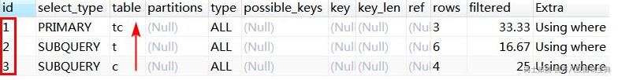

```plain
先查课程表，再查老师表，最后查老师联系方式表。子查询只能以这种方式进行，只有拿到内层的结果之后才能进行外层的查询。
```

**id 值相同（从上往下）**

```sql
-- 查询课程 ID 为 2，或者联系表 ID 为 3 的老师 
EXPLAIN SELECT
    t.tname,
    c.cname,
    tc.phone 
FROM
    teacher t,
    course c,
    teacher_contact tc 
WHERE
    t.tid = c.tid 
    AND t.tcid = tc.tcid 
    AND ( c.cid = 2 OR tc.tcid = 3 );
```

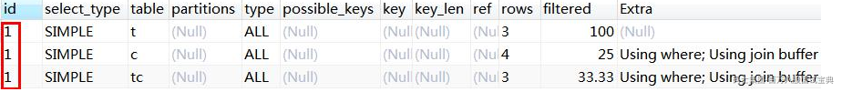

```plain
id 值相同时，表的查询顺序是
```

**从上往下**顺序执行。例如这次查询的 id 都是 1，查询的顺序是 teacher t（3 条）——course c（4 条）——teacher\_contact tc（3 条）。

**既有相同也有不同**

```plain
如果 ID 有相同也有不同，就是 ID 不同的先大后小，ID 相同的从上往下。
```

##### **4.3.2** **select type** **查询类型**

```plain
这里并没有列举全部（其它：DEPENDENT UNION、DEPENDENT SUBQUERY、MATERIALIZED、UNCACHEABLE SUBQUERY、UNCACHEABLE UNION）。
```

```plain
下面列举了一些常见的查询类型：
```

**SIMPLE**

```plain
简单查询，不包含子查询，不包含关联查询 union。
```

```sql
EXPLAIN SELECT * FROM teacher;
```

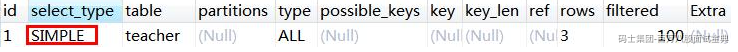

再看一个包含子查询的案例：

```sql
-- 查询 mysql 课程的老师手机号 
EXPLAIN SELECT
    tc.phone 
FROM
    teacher_contact tc 
WHERE
    tcid = ( SELECT tcid FROM teacher t WHERE t.tid = ( SELECT c.tid FROM course c WHERE c.cname = 'mysql' ) );
```

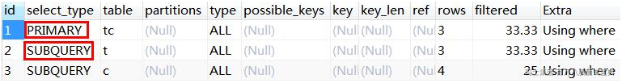

**PRIMARY**

```plain
子查询 SQL 语句中的主查询，也就是最外面的那层查询。
```

**SUBQUERY**

```plain
子查询中所有的内层查询都是 SUBQUERY 类型的。
```

**DERIVED**

```plain
衍生查询，表示在得到最终查询结果之前会用到临时表。例如：
```

```sql
-- 查询 ID 为 1 或 2 的老师教授的课程
EXPLAIN SELECT
    cr.cname 
FROM
    ( SELECT * FROM course WHERE tid = 1 UNION SELECT * FROM course WHERE tid = 2 ) cr;
```

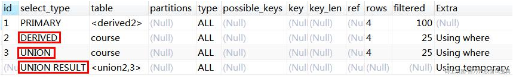

```plain
对于关联查询，先执行右边的 table（UNION），再执行左边的 table，类型是DERIVED
```

**UNION**

```plain
用到了 UNION 查询。同上例。
```

**UNION RESULT**

```plain
主要是显示哪些表之间存在 UNION 查询。<union2,3>代表 id=2 和 id=3 的查询存在 UNION。同上例。
```

##### **4.3.3** **type** **连接类型**

<https://dev.mysql.com/doc/refman/5.7/en/explain-output.html#explain-join-types>

```plain
所有的连接类型中，上面的最好，越往下越差。
```

```plain
在常用的链接类型中：system > const > eq_ref > ref > range > index > all
```

```plain
这 里 并 没 有 列 举 全 部 （ 其 他 ： fulltext 、 ref_or_null 、 index_merger 、unique_subquery、index_subquery）。
```

以上访问类型除了 all，都能用到索引。

**const**

```plain
主键索引或者唯一索引，只能查到一条数据的 SQL。
```

```sql
DROP TABLE
IF
    EXISTS single_data;
CREATE TABLE single_data ( id INT ( 3 ) PRIMARY KEY, content VARCHAR ( 20 ) );
INSERT INTO single_data
VALUES
    ( 1, 'a' );
EXPLAIN SELECT
    * 
FROM
    single_data a 
WHERE
    id = 1;
```

**system**

```plain
system 是 const 的一种特例，只有一行满足条件。例如：只有一条数据的系统表。
```

```sql
EXPLAIN SELECT * FROM mysql.proxies_priv;
```

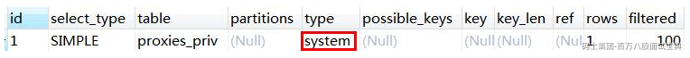

**eq\_ref**

```plain
通常出现在多表的 join 查询，表示对于前表的每一个结果,，都只能匹配到后表的一行结果。一般是唯一性索引的查询（UNIQUE 或 PRIMARY KEY）。
```

```plain
eq_ref 是除 const 之外最好的访问类型。
```

```plain
先删除 teacher 表中多余的数据，teacher_contact 有 3 条数据，teacher 表有 3条数据。
```

```sql
DELETE 
FROM
    teacher 
WHERE
    tid IN ( 4, 5, 6 );
COMMIT;
-- 备份
INSERT INTO `teacher`
VALUES
    ( 4, '老严', 4 );
INSERT INTO `teacher`
VALUES
    ( 5, 'bobo', 5 );
INSERT INTO `teacher`
VALUES
    ( 6, 'seven', 6 );
COMMIT;
```

```plain
为 teacher_contact 表的 tcid（第一个字段）创建主键索引。
```

```sql
-- ALTER TABLE teacher_contact DROP PRIMARY KEY; 
ALTER TABLE teacher_contact ADD PRIMARY KEY(tcid);
```

```plain
为 teacher 表的 tcid（第三个字段）创建普通索引。
```

```sql
-- ALTER TABLE teacher DROP INDEX idx_tcid;
ALTER TABLE teacher ADD INDEX idx_tcid (tcid);
```

```plain
执行以下 SQL 语句：
```

```sql
select t.tcid from teacher t,teacher_contact tc where t.tcid = tc.tcid;
```

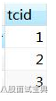

```plain
此时的执行计划（teacher_contact 表是 eq_ref）：
```

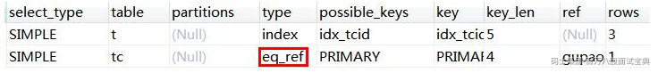

**小结：**

以上三种 system，const，eq\_ref，都是可遇而不可求的，基本上很难优化到这个状态。

**ref**

```plain
查询用到了非唯一性索引，或者关联操作只使用了索引的最左前缀。
```

```plain
例如：使用 tcid 上的普通索引查询：
```

```sql
explain SELECT * FROM teacher where tcid = 3;
```

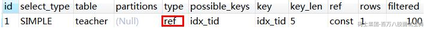

**range**

```plain
索引范围扫描。
```

```plain
如果 where 后面是 between and 或 <或 > 或 >= 或 <=或 in 这些，type 类型就为 range。
```

```plain
不走索引一定是全表扫描（ALL），所以先加上普通索引。
```

```sql
-- ALTER TABLE teacher DROP INDEX idx_tid; 
ALTER TABLE teacher ADD INDEX idx_tid (tid);
```

```plain
执行范围查询（字段上有普通索引）：
```

```sql
EXPLAIN SELECT * FROM teacher t WHERE t.tid <3; 
-- 或
EXPLAIN SELECT * FROM teacher t WHERE tid BETWEEN 1 AND 2;
```

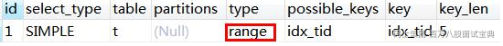

```plain
IN 查询也是 range（字段有主键索引）
```

```sql
EXPLAIN SELECT * FROM teacher_contact t WHERE tcid in (1,2,3);
```

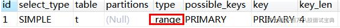

**index**

```plain
Full Index Scan，查询全部索引中的数据（比不走索引要快）。
```

```sql
EXPLAIN SELECT tid FROM teacher;
```

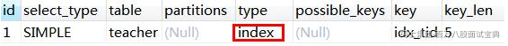

**all**

```plain
Full Table Scan，如果没有索引或者没有用到索引，type 就是 ALL。代表全表扫描。
```

**小结：**

```plain
一般来说，需要保证查询至少达到 range 级别，最好能达到 ref。
```

```plain
ALL（全表扫描）和 index（查询全部索引）都是需要优化的。
```

##### **4.3.4** **possible\_key、key**

```plain
可能用到的索引和实际用到的索引。如果是 NULL 就代表没有用到索引。
```

```plain
possible_key 可以有一个或者多个，可能用到索引不代表一定用到索引。
```

```plain
反过来，possible_key 为空，key 可能有值吗？
```

```plain
表上创建联合索引：
```

```sql
ALTER TABLE user_innodb DROP INDEX comidx_name_phone; 
ALTER TABLE user_innodb add INDEX comidx_name_phone (name,phone);
```

```plain
执行计划（改成 select name 也能用到索引）：
```

```sql
explain select phone from user_innodb where phone='126';
```


```plain
结论：是有可能的（这里是覆盖索引的情况）。
```

```plain
如果通过分析发现没有用到索引，就要检查 SQL 或者创建索引。
```

##### **4.3.5** **key\_len**

```plain
索引的长度（使用的字节数）。跟索引字段的类型、长度有关。
```

```plain
表上有联合索引：KEY
```

`comidx_name_phone` (`name`,`phone`)

```sql
explain select * from user_innodb where name ='jim';
```

##### **4.3.6** **rows**

```plain
MySQL 认为扫描多少行才能返回请求的数据，是一个预估值。一般来说行数越少越好。
```

##### **4.3.7** **filtered**

```plain
这个字段表示存储引擎返回的数据在 server 层过滤后，剩下多少满足查询的记录数量的比例，它是一个百分比。
```

##### **4.3.8** **ref**

```plain
使用哪个列或者常数和索引一起从表中筛选数据。
```

##### **4.3.9** **Extra**

```plain
执行计划给出的额外的信息说明。
```

**using index**

```plain
用到了覆盖索引，不需要回表。
```

```sql
EXPLAIN SELECT tid FROM teacher ;
```

**using where**

```plain
使用了 where 过滤，表示存储引擎返回的记录并不是所有的都满足查询条件，需要在 server 层进行过滤（跟是否使用索引没有关系）。
```

```sql
EXPLAIN select * from user_innodb where phone ='13866667777';
```

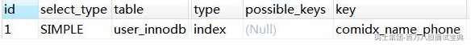

**using filesort**

```plain
不能使用索引来排序，用到了额外的排序（跟磁盘或文件没有关系）。需要优化。（复合索引的前提）
```

```sql
ALTER TABLE user_innodb DROP INDEX comidx_name_phone; 
ALTER TABLE user_innodb add INDEX comidx_name_phone (name,phone);
```

```sql
EXPLAIN select * from user_innodb where name ='jim' order by id;
```

```plain
（order by id 引起）
```

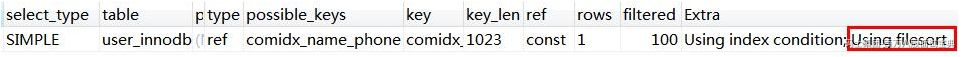

**using temporary**

```plain
用到了临时表。例如（以下不是全部的情况）：
```

```plain
1、distinct 非索引列
```

```sql
EXPLAIN select DISTINCT(tid) from teacher t;
```

```plain
2、group by 非索引列
```

```sql
EXPLAIN select tname from teacher group by tname;
```

```plain
3、使用 join 的时候，group 任意列
```

```sql
EXPLAIN select t.tid from teacher t join course c on t.tid = c.tid group by t.tid;
```

```plain
需要优化，例如创建复合索引。
```

总结一下：

模拟优化器执行 SQL 查询语句的过程，来知道 MySQL 是怎么处理一条 SQL 语句的。通过这种方式我们可以分析语句或者表的性能瓶颈。

分析出问题之后，就是对 SQL 语句的具体优化。

## 我们为什么需要分库分表

在分库分表之前，就需要考虑为什么需要拆分。我们做一件事，肯定是有充分理由的。所以得想好分库分表的理由是什么。我们现在就从两个维度去思考它，**为什么要分库？为什么要分表？**

1.1 为什么要分库  
如果业务量剧增，数据库可能会出现性能瓶颈，这时候我们就需要考虑拆分数据库。从这两方面来看：

磁盘存储  
业务量剧增，MySQL单机磁盘容量会撑爆，拆成多个数据库，磁盘使用率大大降低。

并发连接支撑  
我们知道数据库连接数是有限的。在高并发的场景下，大量请求访问数据库，MySQL单机是扛不住的！高并发场景下，会出现too many connections报错。

当前非常火的微服务架构出现，就是为了应对高并发。它把订单、用户、商品等不同模块，拆分成多个应用，并且把单个数据库也拆分成多个不同功能模块的数据库（订单库、用户库、商品库），以分担读写压力。

1.2 为什么要分表  
假如你的单表数据量非常大，存储和查询的性能就会遇到瓶颈了，如果你做了很多优化之后还是无法提升效率的时候，就需要考虑做分表了。一般千万级别数据量，就需要分表。

这是因为即使SQL命中了索引，如果表的数据量超过一千万的话，查询也是会明显变慢的。这是因为索引一般是B+树结构，数据千万级别的话，B+树的高度会增高，查询就变慢啦。MySQL的B+树的高度怎么计算的呢？跟大家复习一下：

InnoDB存储引擎最小储存单元是页，一页大小就是16k。B+树叶子存的是数据，内部节点存的是键值+指针。索引组织表通过非叶子节点的二分查找法以及指针确定数据在哪个页中，进而再去数据页中找到需要的数据，B+树结构图如下：

假设B+树的高度为2的话，即有一个根结点和若干个叶子结点。这棵B+树的存放总记录数为=根结点指针数\*单个叶子节点记录行数。

> 如果一行记录的数据大小为1k，那么单个叶子节点可以存的记录数 =16k/1k =16. 非叶子节点内存放多少指针呢？我们假设主键ID为bigint类型，长度为8字节(面试官问你int类型，一个int就是32位，4字节)，而指针大小在InnoDB源码中设置为6字节，所以就是 8+6=14 字节，16k/14B =16\*1024B/14B = 1170
>
> 因此，一棵高度为2的B+树，能存放1170 \* 16=18720条这样的数据记录。同理一棵高度为3的B+树，能存放1170 \*1170 \*16 =21902400，大概可以存放两千万左右的记录。B+树高度一般为1-3层，如果B+到了4层，查询的时候会多查磁盘的次数，SQL就会变慢。

因此单表数据量太大，SQL查询会变慢，所以就需要考虑分表啦。

## 什么时候考虑分库分表？

对于MySQL，InnoDB存储引擎的话，单表最多可以存储10亿级数据。但是的话，如果真的存储这么多，性能就会非常差。一般数据量千万级别，B+树索引高度就会到3层以上了，查询的时候会多查磁盘的次数，SQL就会变慢。

阿里巴巴的《Java开发手册》提出：

> 单表行数超过500万行或者单表容量超过2GB，才推荐进行分库分表。

那我们是不是等到数据量到达五百万，才开始分库分表呢？

> 不是这样的，我们应该提前规划分库分表，如果估算3年后，你的表都不会到达这个五百万，则不需要分库分表。

MySQL服务器如果配置更好，是不是可以超过这个500万这个量级，才考虑分库分表？

> 虽然配置更好，可能数据量大之后，性能还是不错，但是如果持续发展的话，还是要考虑分库分表

一般什么类型业务表需要才分库分表？

> 通用是一些流水表、用户表等才考虑分库分表，如果是一些配置类的表，则完全不用考虑，因为不太可能到达这个量级。

## 如何选择分表键

分表键，即用来分库/分表的字段，换种说法就是，你以哪个维度来分库分表的。比如你按用户ID分表、按时间分表、按地区分表，这些用户ID、时间、地区就是分表键。

一般数据库表拆分的原则，需要先找到业务的主题。比如你的数据库表是一张企业客户信息表，就可以考虑用了客户号做为分表键。

为什么考虑用客户号做分表键呢？ Saas

这是因为表是基于客户信息的，所以，需要将同一个客户信息的数据，落到一个表中，避免触发全表路由。

## 非分表键如何查询

分库分表后，有时候无法避免一些业务场景，需要通过非分表键来查询。

假设一张用户表，根据userId做分表键，来分库分表。但是用户登录时，需要根据用户手机号来登陆。这时候，就需要通过手机号查询用户信息。而手机号是非分表键。

非分表键查询，一般有这几种方案：

遍历：最粗暴的方法，就是遍历所有的表，找出符合条件的手机号记录（不建议）  
将用户信息冗余同步到ES，同步发送到ES，然后通过ES来查询（推荐）  
其实还有基因法：比如非分表键可以解析出分表键出来，比如常见的，订单号生成时，可以包含客户号进去，通过订单号查询，就可以解析出客户号。但是这个场景除外，手机号似乎不适合冗余userId。

## 分库后，事务问题如何解决

分库分表后，假设两个表在不同的数据库，那么**本地事务已经无效**啦，需要使用**分布式事务**了。

常用的分布式事务解决方案有：

- 两阶段提交

- 三阶段提交

- TCC

- 本地消息表

- 最大努力通知

- saga

## 跨节点Join关联问题

在单库未拆分表之前，我们如果要使用join关联多张表操作的话，简直so easy啦。但是分库分表之后，两张表可能都不在同一个数据库中了，那么如何跨库join操作呢？

**跨库Join的几种解决思路：**

\*\*字段冗余：\*\*把需要关联的字段放入主表中，避免关联操作；比如订单表保存了卖家ID（sellerId），你把卖家名sellerName也保存到订单表，这就不用去关联卖家表了。这是一种空间换时间的思想。  
\*\*全局表：\*\*比如系统中所有模块都可能会依赖到的一些基础表（即全局表），在每个数据库中均保存一份。  
\*\*数据抽象同步：\*\*比如A库中的a表和B库中的b表有关联，可以定时将指定的表做同步，将数据汇合聚集，生成新的表。一般可以借助ETL工具。  
\*\*应用层代码组装：\*\*分开多次查询，调用不同模块服务，获取到数据后，代码层进行字段计算拼装。

## order by,group by等聚合函数问题

跨节点的 `count,order by,group by`以及聚合函数等问题，都是一类的问题，它们一般都需要基于全部数据集合进行计算。可以分别在各个节点上得到结果后，再在应用程序端进行合并。

## 分库分表后的分页问题

**方案1（全局视野法）：**

在各个数据库节点查到对应结果后，在代码端汇聚再分页。这样优点是业务无损，精准返回所需数据；缺点则是会返回过多数据，增大网络传输，也会造成空查，

> 比如分库分表前，你是根据创建时间排序，然后获取第2页数据。如果你是分了两个库，那你就可以每个库都根据时间排序，然后都返回2页数据，然后把两个数据库查询回来的数据汇总，再根据创建时间进行内存排序，最后再取第2页的数据。

**方案2（业务折衷法-禁止跳页查询）：**

这种方案需要业务妥协一下，只有上一页和下一页，不允许跳页查询了。

> 这种方案，查询第一页时，是跟全局视野法一样的。但是下一页时，需要把当前最大的创建时间传过来，然后每个节点，都查询大于创建时间的一页数据，接着汇总，内存排序返回。

## 分库分表选择哪种中间件

目前流行的分库分表中间件比较多：

- Sharding-JDBC 当当开源，好用，建议

- cobar 阿里巴巴产品，不支持读写分离

- Mycat 建议 比较重，但是好用

- Atlas 360开源产品，不支持分布式分表，所有表同库

- TDDL（淘宝） 阿里巴巴产品，非代理式，不支持读写分离

- vitess 谷歌产品，还可以，但是用的少，支持高并发 ZK管理 PRC方式进行处理数据，重

## 如何评估分库数量

对于MySQL来说的话，一般单库超过5千万记录，DB的压力就非常大了。所以分库数量多少，需要看单库处理记录能力有关。  
如果分库数量少，达不到分散存储和减轻DB性能压力的目的；如果分库的数量多，对于跨多个库的访问，应用程序需要访问多个库。  
一般是建议分4~10个库，一般建议10个库以下，不然不好管理

## 垂直分库、水平分库、垂直分表、水平分表的区别

水平分库：以字段为依据，按照一定策略（hash、range等），将一个库中的数据拆分到多个库中。  
水平分表：以字段为依据，按照一定策略（hash、range等），将一个表中的数据拆分到多个表中。  
垂直分库：以表为依据，按照业务归属不同，将不同的表拆分到不同的库中。  
垂直分表：以字段为依据，按照字段的活跃性，将表中字段拆到不同的表（主表和扩展表）中

## 分表要停服嘛？不停服怎么做？

不用停服。不停服的时候，应该怎么做呢，主要分五个步骤：

编写代理层，加个开关（控制访问新的DAO还是老的DAO，或者是都访问），灰度发布期间，还是访问老的DAO。  
发版全量后，开启双写，既在旧表新增和修改，也在新表新增和修改。日志或者临时表记下新表ID起始值，旧表中小于这个值的数据就是存量数据，这批数据就是要迁移的。  
通过脚本把旧表的存量数据写入新表。  
停读旧表改读新表，此时新表已经承载了所有读写业务，但是这时候不要立刻停写旧表，需要保持双写一段时间。  
当读写新表一段时间之后，如果没有业务问题，就可以停写旧表啦
