# 各种设计模式在实际工作中的应用

## 问题1: 工厂模式与建造者模式的区别 ? 在工作中用到过建造者模式吗 ?

### 1.什么是建造者模式

**建造者模式** (builder pattern), 也被称为**生成器模式** , 是一种创建型设计模式.

- **定义: 将一个复杂对象的构建与表示分离，使得同样的构建过程可以创建不同的表示。**

建造者模式要解决的问题

- **建造者模式可以将部件和其组装过程分开，一步一步创建一个复杂的对象。用户只需要指定复杂对象的类型就可以得到该对象，而无须知道其内部的具体构造细节。**

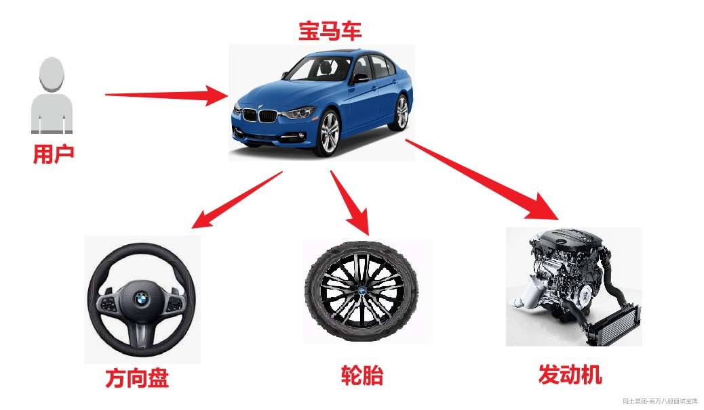

### 2.建造者模式的结构

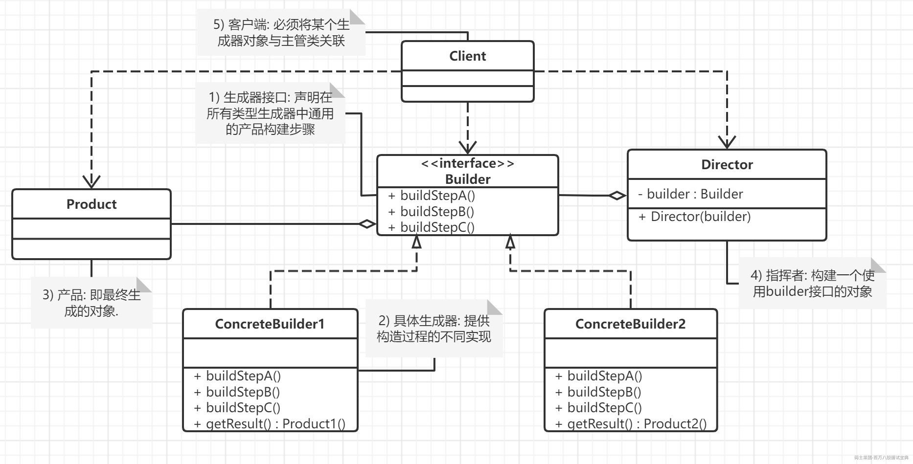

**建造者（Builder）模式包含以下4个角色 :**

- 抽象建造者类（Builder）：这个接口规定要实现复杂对象的哪些部分的创建，并不涉及具体的部件对象的创建。

- 具体建造者类（ConcreteBuilder）：实现 Builder 接口，完成复杂产品的各个部件的具体创建方法。在构造过程完成后，提供一个方法,返回创建好的负责产品对象。

- 产品类（Product）：要创建的复杂对象 (包含多个组成部件).

- 指挥者类（Director）：调用具体建造者来创建复杂对象的各个部分，在指挥者中不涉及具体产品的信息，只负责保证对象各部分完整创建或按某种顺序创建(客户端一般只需要与指挥者进行交互)。

### 3.代码示例

```plain
 
```

### 4.建造者模式在实际开发中的应用

**需求分析:**

- 前端用户操作,选择查询条件,分组,排序,分页等参数 SQL ---> Oracle, MySQL

- 系统要操作不同产品的数据库: Oracle ,MySQL,DB2...

- 每种数据库写一个具体的Builder类,让指挥者去根据参数按照顺序拼接select, where,order,group,分页

- 生成String类型的SQL语句和参数列表

1. **产品类**

```plain

 // 产品类
 public class SqlQuery {
     private String select;
     private String from;
     private String where;
     private String groupBy;
     private String orderBy;
     private String limit;
 
     public SqlQuery(String select, String from) {
         this.select = select;
         this.from = from;
     }
 
     public String getSelect() {
         return select;
     }
 
     public void setSelect(String select) {
         this.select = select;
     }
 
     public String getFrom() {
         return from;
     }
 
     public void setFrom(String from) {
         this.from = from;
     }
 
     public String getWhere() {
         return where;
     }
 
     public String getGroupBy() {
         return groupBy;
     }
 
     public String getOrderBy() {
         return orderBy;
     }
 
     public String getLimit() {
         return limit;
     }
 
     public void setWhere(String where) {
         this.where = where;
     }
 
     public void setGroupBy(String groupBy) {
         this.groupBy = groupBy;
     }
 
     public void setOrderBy(String orderBy) {
         this.orderBy = orderBy;
     }
 
     public void setLimit(String limit) {
         this.limit = limit;
     }
 
     @Override
     public String toString() {
         StringBuilder sb = new StringBuilder();
 
         sb.append("SELECT ").append(select).append(" FROM ").append(from);
 
         if (where != null && !where.isEmpty()) {
             sb.append(" WHERE ").append(where);
         }
 
         if (groupBy != null && !groupBy.isEmpty()) {
             sb.append(" GROUP BY ").append(groupBy);
         }
 
         if (orderBy != null && !orderBy.isEmpty()) {
             sb.append(" ORDER BY ").append(orderBy);
         }
 
         if (limit != null && !limit.isEmpty()) {
             sb.append(" LIMIT ").append(limit);
         }
 
         return sb.toString();
     }
 }
```

2. **抽象建造者**

```plain

 /**
  * 抽象建造者类
  * @author spikeCong
  * @date 2023/4/20
  **/
 public abstract class SqlQueryBuilder {
 
     protected SqlQuery sqlQuery;
 
     public void createSqlQuery(String select, String from) {
         sqlQuery = new SqlQuery(select, from);
     }
 
     public SqlQuery getSqlQuery() {
         return sqlQuery;
     }
 
     //抽取共性步骤
     public abstract void buildWhere();
     public abstract void buildGroupBy();
     public abstract void buildOrderBy();
     public abstract void buildLimit();
 
 }
```

3. **具体建造者**

```plain

 /**
  * 具体建造者类：用于创建MySQL数据库的SQL查询语句
  * @author spikeCong
  * @date 2023/4/20
  **/
 public class MySqlQueryBuilder extends SqlQueryBuilder {
     
     @Override
     public void buildWhere() {
         sqlQuery.setWhere("1 = 1"); // MySQL不需要限制行数
     }
 
     @Override
     public void buildGroupBy() {
         sqlQuery.setGroupBy("deptno, ename, hiredate");
     }
 
     @Override
     public void buildOrderBy() {
         sqlQuery.setOrderBy("hiredate DESC");
     }
 
     @Override
     public void buildLimit() {
         sqlQuery.setLimit("0, 10"); // MySQL分页从0开始
     }
 }
 
 /**
  * 用于创建Oracle数据库的SQL查询语句
  * @author spikeCong
  * @date 2023/4/20
  **/
 public class OracleQueryBuilder extends SqlQueryBuilder {
 
     @Override
     public void buildWhere() {
         sqlQuery.setWhere("rownum <= 1000"); // Oracle查询最多返回1000行数据
     }
 
     @Override
     public void buildGroupBy() {
         // Oracle需要将GROUP BY字段放到SELECT字段中
         sqlQuery.setGroupBy("deptno, ename, hiredate");
         sqlQuery.setSelect(sqlQuery.getSelect() + ", deptno, ename, hiredate");
     }
 
     @Override
     public void buildOrderBy() {
         sqlQuery.setOrderBy("hiredate");
     }
 
     @Override
     public void buildLimit() {
         sqlQuery.setLimit("10");
     }
 
 }
```

4. **客户端**

```plain

 public class Client {
 
     public static void main(String[] args) {
         // 创建MySQL建造者
         SqlQueryBuilder mySqlQueryBuilder = new MySqlQueryBuilder();
 
         // 创建Oracle建造者
         SqlQueryBuilder oracleQueryBuilder = new OracleQueryBuilder();
 
         // 指导者
         SqlQueryDirector sqlQueryDirector = new SqlQueryDirector();
 
         // 构建MySQL查询语句
         sqlQueryDirector.setSqlQueryBuilder(mySqlQueryBuilder);
         sqlQueryDirector.buildSqlQuery("*", "table1");
 
         SqlQuery mySqlQuery = mySqlQueryBuilder.getSqlQuery();
         System.out.println("MySQL Query: " + mySqlQuery);
 
         // 构建Oracle查询语句
         sqlQueryDirector.setSqlQueryBuilder(oracleQueryBuilder);
         sqlQueryDirector.buildSqlQuery("*", "table2");
         SqlQuery oracleQuery = oracleQueryBuilder.getSqlQuery();
         System.out.println("Oracle Query: " + oracleQuery);
     }
 }
```

### 5.建造者模式与工厂模式区别

- 工厂模式是用来创建不同但是相关类型的对象（继承同一父类或者接口的一组子类），由给定的参数来决定创建哪种类型的对象。 要把产品**抽象** --> 具体产品

- 建造者模式是用来创建一种类型的**复杂对象**，通过设置不同的可选参数，“定制化”地创建不同的对象, 具建造者可以扩展和变更。

软件设计基础

- 最重要的就是分析共性和可变性

设计模式的意义

- 使用抽象来固定共性 (闭原则)

- 使用具体类对可变性进行封装(开原则)

## 问题2: 说一说责任链模式 ,工作中有用到责任链模式吗 ?

### 1.什么是责任链模式

职责链模式(chain of responsibility pattern) 定义

- 避免将一个请求的发送者与接收者耦合在一起,让多个对象都有机会处理请求.

- 将接收请求的对象连接成一条链,并且沿着这条链传递请求,直到有一个对象能够处理它为止.

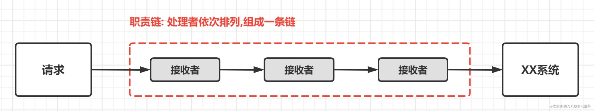

### 2.责任链模式的作用

- 将请求和请求的处理进行解耦,提高代码的可扩展性.

### 3.责任链模式的结构

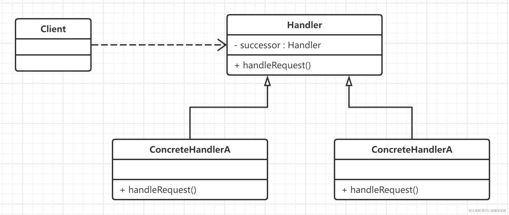

职责链模式主要包含以下角色:

- 抽象处理者（Handler）角色：定义一个处理请求的接口，包含抽象处理方法和一个后继连接(链上的每个处理者都有一个成员变量来保存对于下一处理者的引用,比如上图中的successor) 。

- 具体处理者（Concrete Handler）角色：实现抽象处理者的处理方法，判断能否处理本次请求，如果可以处理请求则处理，否则将该请求转给它的后继者。

- 客户类（Client）角色：创建处理链，并向链头的具体处理者对象提交请求，它不关心处理细节和请求的传递过程。

> 注意实际的开发中,并不会采用这种标准的责任链结构,而是会进行一些改变,比如增加一个责任链管理者,来管理这些具体的处理者

### 4.责任链模式在实际开发中的应用

在 SpringBoot 中，责任链模式的实践方式有好几种，今天我们主要给大家介绍三种实践方式。

我们以某下单流程为例，将其切成多个独立检查逻辑，可能会经过的数据验证处理流程如下：

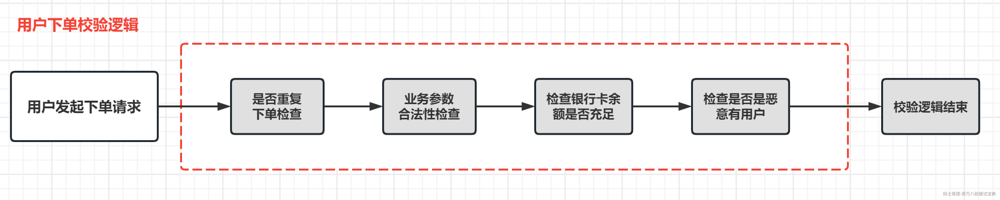

#### 4.1 实现方式1

1. 创建 Pojo, 下单对象

```plain
public class OrderContext {

    /**
     * 请求唯一序列ID
     */
    private String seqId;

    /**
     * 用户ID
     */
    private String userId;

    /**
     * 产品skuId
     */
    private Long skuId;

    /**
     * 下单数量
     */
    private Integer amount;

    /**
     * 用户收货地址ID
     */
    private String userAddressId;

}
```

2. 创建处理者接口,我们定义一个数据处理接口OrderHandleIntercept，用于标准化执行！

```plain

public interface OrderHandleIntercept {

    /**
     * 指定执行顺序
     * @return
     */
    int sort();

    /**
     * 对参数进行处理
     * @param context
     * @return
     */
    OrderContext handle(OrderContext context);
}
```

3. 创建具体处理者类,我们分别创建三个不同的接口实现类，并指定执行顺序

```plain

/**
 * 处理器1 重复下单逻辑验证
 * @author spikeCong
 * @date 2023/4/18
 **/
@Component
public class RepeatOrderHandleInterceptService implements OrderHandleIntercept {
    @Override
    public int sort() {
        //执行顺序为 1
        return 1;
    }

    @Override
    public OrderContext handle(OrderContext context) {
        System.out.println("通过seqId,检查客户是否重复下单");
        return context;
    }
}

/**
 * 处理器2: 用于验证请求参数是否合法
 * @author spikeCong
 * @date 2023/4/18
 **/
@Component
public class ValidOrderHandleInterceptService implements OrderHandleIntercept {
    @Override
    public int sort() {
        //执行顺序为 2
        return 2;
    }

    @Override
    public OrderContext handle(OrderContext context) {
        System.out.println("检查请求参数是否合法,并且获取客户的银行账户");
        return context;
    }
}

/**
 * 处理器3: /用于检查客户账户余额是否充足
 * @author spikeCong
 * @date 2023/4/18
 **/
@Component
public class BankOrderHandleInterceptService implements OrderHandleIntercept {
    @Override
    public int sort() {
        //执行顺序为 3
        return 3;
    }

    @Override
    public OrderContext handle(OrderContext context) {
        System.out.println("检查银行账户是否合法，调用银行系统检查银行账户余额是否满足下单金额");
        return context;
    }
}
```

4. 处理器链类,我们还要创建一个订单数据验证管理器 OrderHandleChainService，用于管理上面的这几个实现类.  
   整个针对请求的处理过程,都通过HandleChain进行管理,对于发送请求的客户端来说,只需要调用HandleChain,并将请求交给HandleChain处理就可以了  
   对于客户端来说,它并不知道请求是如何被处理的,换句话说请求处理中的逻辑是否改变了,客户端是无感知的.

```plain

/**
 * 实现ApplicationContextAware,方便获取Spring容器ApplicationContext，从而可以获取容器内的Bean
 * @author spikeCong
 * @date 2023/4/18
 **/
@Component
public class OrderHandleChainService implements ApplicationContextAware {

    //保存责任链中的处理者
    private List<OrderHandleIntercept> handleList = new ArrayList<>();

    @Override
    public void setApplicationContext(ApplicationContext applicationContext) throws BeansException {

        //获取指定接口实现类,并按照sort进行排序,放入List
        //getBeansOfType这个方法能返回一个接口的全部实现类（前提是所有实现类都必须由Spring IoC容器管理）
        Map<String, OrderHandleIntercept> serviceMap = applicationContext.getBeansOfType(OrderHandleIntercept.class);

        handleList = serviceMap.values().stream()
                .sorted(Comparator.comparing(OrderHandleIntercept::sort))
                .collect(Collectors.toList());
    }
  
  
    /**
     * 执行处理
     */
    public OrderContext execute(OrderContext context){
        for (OrderHandleIntercept handleIntercept : handleList) {
             context = handleIntercept.handle(context);
        }
  
        return context;
    }
  
}
```

5. 进行单元测试

```plain

@Autowired
private OrderHandleChainService orderHandleChainService;

@Test
public void test02(){

    orderHandleChainService.execute(new OrderContext());
}
```

6. 执行结果如下

```plain

通过seqId,检查客户是否重复下单
检查请求参数是否合法,并且获取客户的银行账户
检查银行账户是否合法，调用银行系统检查银行账户余额是否满足下单金额
```

如果需要继续加验证流程或者处理流程，只需要重新实现OrderHandleIntercept接口就行，其他的代码无需改动！

#### 4.2 实现方式2

如果我们不想用sort() 来指定处理器类的执行顺序的话, 也可以使用注解方式来指定排序.

通过注解@Order来指定排序

```plain

/**
 * 指定注入顺序为1
 *
 */
@Order(1)
@Component
public class RepeatOrderHandleInterceptService implements OrderHandleIntercept {
    //...省略
}

/**
 * 指定注入顺序为2
 *
 */
@Order(2)
@Component
public class ValidOrderHandleInterceptService implements OrderHandleIntercept {
    //...省略
}

/**
 * 指定注入顺序为3
 *
 */
@Order(3)
@Component
public class BankOrderHandleInterceptService implements OrderHandleIntercept {
    //...省略
}
```

修改OrderHandleChainService, 添加@Autowired 自动注入各个责任链的对象

```plain

/**
 * 责任链管理类
 *  实现ApplicationContextAware,获取IOC容器
 * @author spikeCong
 * @date 2023/4/18
 **/
@Component
public class OrderHandleChainService {

    //保存责任链中的处理者
    @Autowired
    private List<OrderHandleIntercept> handleList;

    /**
     * 执行处理
     */
    public OrderContext execute(OrderContext context){
        for (OrderHandleIntercept handleIntercept : handleList) {
             context = handleIntercept.handle(context);
        }

        return context;
    }
}
```

打印结果如下

```plain

检查银行账户是否合法，调用银行系统检查银行账户余额是否满足下单金额
通过seqId,检查客户是否重复下单
检查请求参数是否合法,并且获取客户的银行账户
```

#### 4.3 实现方式3

通过定义抽象类来实现责任链设计模式，还是以上面的案例为例，我们需要先定义一个抽象类，比如AbstractOrderHandle。

```plain

/**
 * @author spikeCong
 * @date 2023/4/18
 **/
public abstract class AbstractOrderHandle {

    /**
     * 责任链中的下一个节点
     */
    private AbstractOrderHandle next;

    public AbstractOrderHandle getNext() {
        return next;
    }

    public void setNext(AbstractOrderHandle next) {
        this.next = next;
    }

    /**
     * 对参数进行处理, 具体参数拦截逻辑,给子类去实现
     * @param orderContext
     * @return: com.mashibing.designboot.responsibility.pojo.OrderContext
     */
    public abstract OrderContext handle(OrderContext orderContext);

    /**
     * 执行入口
     * @param context
     * @return: com.mashibing.designboot.responsibility.pojo.OrderContext
     */
    public OrderContext execute(OrderContext context){

        //每个处理器 要执行的处理逻辑
        context= handle(context);

        //判断是否还有下一个责任链节点,没有的话,说明是最后一个节点
        if(getNext() != null){
            getNext().execute(context);
        }

        return context;
    }
}
```

然后，分别创建三个处理类，并排好序号。

```plain

@Component
@Order(1)
public class RepeatOrderHandle extends AbstractOrderHandle {

    @Override
    public OrderContext handle(OrderContext context) {
        System.out.println("通过seqId，检查客户是否重复下单");
        return context;
    }
}

@Component
@Order(2)
public class ValidOrderHandle extends AbstractOrderHandle {

    @Override
    public OrderContext handle(OrderContext context) {
        System.out.println("检查请求参数，是否合法，并且获取客户的银行账户");
        return context;
    }
}

@Component
@Order(3)
public class BankOrderHandle extends AbstractOrderHandle {

    @Override
    public OrderContext handle(OrderContext context) {
        System.out.println("检查银行账户是否合法，调用银行系统检查银行账户余额是否满足下单金额");
        return context;
    }
}
```

创建一个责任链管理器，比如OrderHandleManager

```plain

@Component
public class OrderHandleManager {

    @Autowired
    private List<AbstractOrderHandle> orderHandleList;

    /**
     * 实现Bean初始化之前的自定义操作
     *     Constructor(构造方法) -> @Autowired(依赖注入) -> @PostConstruct(注释的初始化方法)
     *     @PostConstruct注解的功能：当依赖注入完成后用于执行初始化的方法，并且只会被执行一次
     * @return: null
     */
    @PostConstruct
    public void initChain(){

        int size = orderHandleList.size();

        for (int i = 0; i < size; i++) {
            if(i == size -1){
                //责任链上,最后一个处理者
                orderHandleList.get(i).setNext(null);
            } else {
                //进行链式连接
                orderHandleList.get(i).setNext(orderHandleList.get(i + 1));
            }
        }
  
    }

    /**
     * 执行处理
     * @param context
     * @return: com.mashibing.designboot.responsibility.pojo.OrderContext
     */
    public OrderContext execute(OrderContext context){
        OrderContext execute = orderHandleList.get(0).execute(context);

        return context;
    }
}
```

测试

```plain

    @Autowired
    private OrderHandleManager orderHandleManager;

    @Test
    public void test02(){

//        orderHandleChainService.execute(new OrderContext());
        orderHandleManager.execute(new OrderContext());
    }
```

运行结果与预期一致！

```plain

通过seqId，检查客户是否重复下单
检查请求参数，是否合法，并且获取客户的银行账户
检查银行账户是否合法，调用银行系统检查银行账户余额是否满足下单金额
```

上面为大家讲解了SpringBoot如何引入责任链模式,介绍了三种实现方式.

第二种用的最多,然后是第二种,第三种用的比较少,第三种本质是一种链式写法，但是理解起来上不如第一种直观，可读性查, 但是效果是一样的。

### 5. 职责链模式总结

**1) 职责链模式的优点：**

- 降低了对象之间的耦合

- 增强了给对象委派职责灵活性

- 简化了对象之间的连接,责任分担更加明确

**2) 职责链模式的缺点:**

- 不能够保证没有个请求一定被处理

- 系统性能可能会有影响

- 增加了客户端的复杂性

**3) 使用场景分析**

- 在运行时要使用多个对象对一个请求进行处理

- 不想让使用者知道具体的处理逻辑.

## 问题3: 观察者模式与发布订阅模式有什么不同 ? 工作中用到过观察者模式吗 ?

### 1.观察者模式

#### 1.1 什么是观察者模式

**观察者模式它是用于建立一种对象与对象之间的依赖关系,一个对象发生改变时将自动通知其他对象,其他对象将相应的作出反应.**

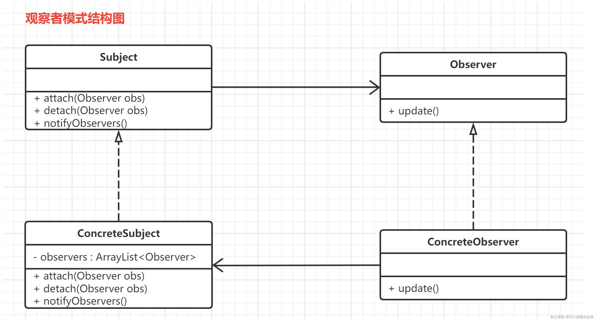

在观察者模式中有如下角色：

- Subject：抽象主题（抽象被观察者），抽象主题角色把所有观察者对象保存在一个集合里，每个主题都可以有任意数量的观察者，抽象主题提供一个接口，可以增加和删除观察者对象。

- ConcreteSubject：具体主题（具体被观察者），该角色将有关状态存入具体观察者对象，在具体主题的内部状态发生改变时，给所有注册过的观察者发送通知。

- Observer：抽象观察者，是观察者的抽象类，它定义了一个更新接口，使得在得到主题更改通知时更新自己。

- ConcrereObserver：具体观察者，实现抽象观察者定义的更新接口，以便在得到主题更改通知时更新自身的状态。在具体观察者中维护一个指向具体目标对象的引用,它存储具体观察者的有关状态,这些状态需要与具体目标保持一致.

#### 1.2 观察者模式实现

- **观察者**

```plain

/**
 * 抽象观察者
 * @author spikeCong
 * @date 2022/10/11
 **/
public interface Observer {

    //update方法: 为不同观察者的更新(响应)行为定义相同的接口,不同的观察者对该方法有不同的实现
    public void update();
}

/**
 * 具体观察者
 * @author spikeCong
 * @date 2022/10/11
 **/
public class ConcreteObserverOne implements Observer {

    @Override
    public void update() {
        //获取消息通知,执行业务代码
        System.out.println("ConcreteObserverOne 得到通知!");
    }
}

/**
 * 具体观察者
 * @author spikeCong
 * @date 2022/10/11
 **/
public class ConcreteObserverTwo implements Observer {

    @Override
    public void update() {
        //获取消息通知,执行业务代码
        System.out.println("ConcreteObserverTwo 得到通知!");
    }
}
```

- **被观察者**

```plain

/**
 * 抽象目标类
 * @author spikeCong
 * @date 2022/10/11
 **/
public interface Subject {

     void attach(Observer observer);
     void detach(Observer observer);
     void notifyObservers();
}

/**
 * 具体目标类
 * @author spikeCong
 * @date 2022/10/11
 **/
public class ConcreteSubject implements Subject {

    //定义集合,存储所有观察者对象
    private ArrayList<Observer> observers = new ArrayList<>();

    //注册方法,向观察者集合中增加一个观察者
    @Override
    public void attach(Observer observer) {
        observers.add(observer);
    }

    //注销方法,用于从观察者集合中删除一个观察者
    @Override
    public void detach(Observer observer) {
        observers.remove(observer);
    }

    //通知方法
    @Override
    public void notifyObservers() {
        //遍历观察者集合,调用每一个观察者的响应方法
        for (Observer obs : observers) {
            obs.update();
        }
    }
}
```

- **测试类**

```plain

public class Client {

    public static void main(String[] args) {
        //创建目标类(被观察者)
        ConcreteSubject subject = new ConcreteSubject();

        //注册观察者类,可以注册多个
        subject.attach(new ConcreteObserverOne());
        subject.attach(new ConcreteObserverTwo());

        //具体主题的内部状态发生改变时，给所有注册过的观察者发送通知。
        subject.notifyObservers();
    }
}
```

### 2.发布订阅模式与观察者模式的区别

#### 2.1 定义上的不同

**发布订阅模式属于广义上的观察者模式**

- 发布订阅模式是最常用的一种观察者模式的实现，并且从解耦和重用角度来看，更优于典型的观察者模式

#### 2.2 两者的区别

我们来看一下观察者模式与发布订阅模式**结构上的区别**

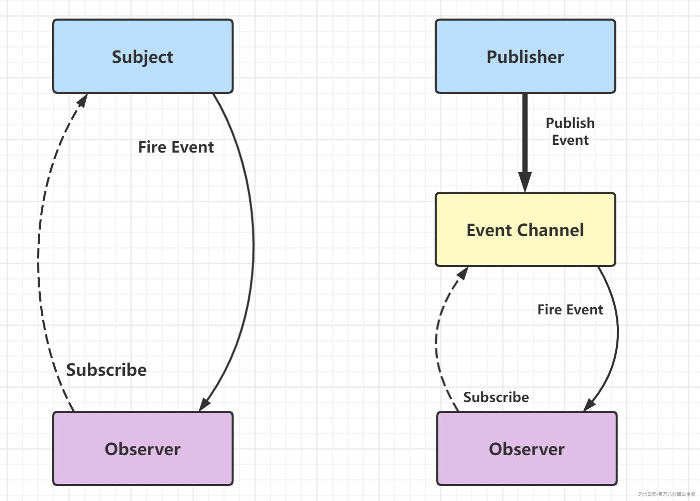

操作流程上的区别

- 观察者模式：**数据源直接通知订阅者发生改变。**

- 发布订阅模式: **数据源告诉第三方（事件通道）发生了改变，第三方再通知订阅者发生了改变。**

### 3.观察者模式在实际开发中的应用

#### 3.1 实际开发中的需求场景

在我们日常业务开发中，观察者模式对我们很大的一个作用，在于实现业务的**解耦**。以用户注册的场景来举例子，假设在用户注册完成时，需要给该用户发送邮件、发送优惠劵等等操作，如下图所示：

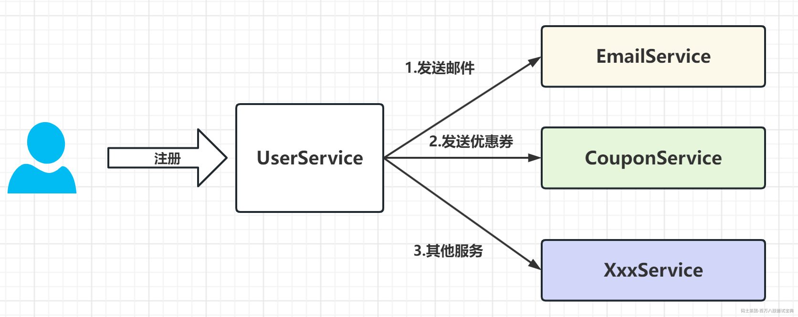

使用观察者模式之后

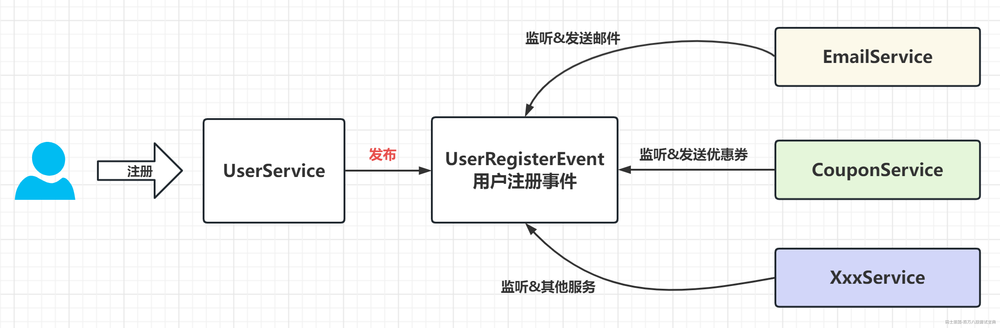

- UserService 在完成自身的用户注册逻辑之后，仅仅只需要发布一个 UserRegisterEvent 事件，而无需关注其它拓展逻辑。

- 其它 Service 可以**自己**订阅 UserRegisterEvent 事件，实现自定义的拓展逻辑。

#### 3.2 Spring事件机制

Spring 基于观察者模式，实现了自身的事件机制，由三部分组成：

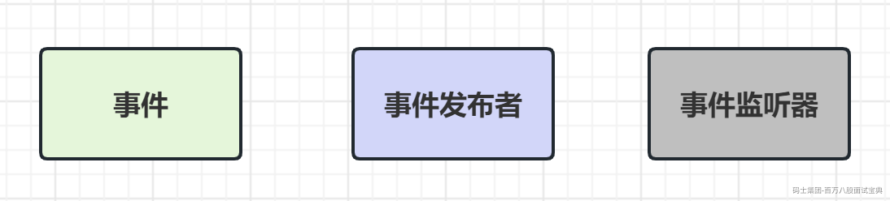

- 事件 `ApplicationEvent`：通过**继承**它，实现自定义事件。另外，通过它的 `source` 属性可以获取事件**源**，`timestamp` 属性可以获得发生时间。

- 事件**发布者** `ApplicationEventPublisher`：通过它，可以进行事件的发布。

- 事件**监听器** `ApplicationListener`：通过**实现**它，进行指定类型的事件的监听。

#### 3.3 代码实现

**(1) UserRegisterEvent**

- 创建 UserRegisterEvent事件类，继承 ApplicationEvent 类，用户注册事件。代码如下：

```plain

/**
 * 用户注册事件
 * @author spikeCong
 * @date 2023/4/19
 **/
public class UserRegisterEvent extends ApplicationEvent {
  
    /**
     * 用户名
     */
    private String username;

    public UserRegisterEvent(Object source) {
        super(source);
    }

    public UserRegisterEvent(Object source,String  username) {
        super(source);
        this.username = username;
    }

    public String getUsername() {
        return username;
    }

    public void setUsername(String username) {
        this.username = username;
    }
}
```

**(2) UserService (事件源+事件发布)**

- 创建 UserService类，代码如下：

```plain

/**
 * 事件源角色+事件发布
 * @author spikeCong
 * @date 2023/4/19
 **/
@Service
public class UserService implements ApplicationEventPublisherAware {

    private Logger logger = LoggerFactory.getLogger(getClass());

    private ApplicationEventPublisher applicationEventPublisher;

    @Override
    public void setApplicationEventPublisher(ApplicationEventPublisher applicationEventPublisher) {
        this.applicationEventPublisher = applicationEventPublisher;
    }

    public void register(String username){
        //... 执行注册逻辑
        logger.info("[register][执行用户{}的注册逻辑]",username);

        /**
         * publishEvent方法, 参数是: ApplicationEvent的实现类对象
         * 每当事件发布时,所有的ApplicationListener就会被自动的触发.
         */
        //... 发布用户注册事件
        applicationEventPublisher.publishEvent(new UserRegisterEvent(this,username));
    }
}
```

- 实现 `ApplicationEventPublisherAware`接口，从而将 `ApplicationEventPublisher` 注入到其中。

- 在执行完注册逻辑后，调用 `ApplicationEventPublisher` 的 `publishEvent(ApplicationEvent event)`方法，发布 `UserRegisterEvent` 事件。

- 事件机制的实现需要三个部分,事件源,事件,事件监听器,在上面介绍的ApplicationEvent就相当于事件,ApplicationListener相当于事件监听器,这里的事件源说的就是ApplicationEventPublisher.

**(3) 创建EmailService**

```plain

/**
 * 事件监听角色
 * @author spikeCong
 * @date 2023/4/19
 **/
@Service  //实现 ApplicationListener 接口，通过 E 泛型设置感兴趣的事件。
public class EmailService implements ApplicationListener<UserRegisterEvent> {

    private Logger logger = LoggerFactory.getLogger(getClass());

  
    //实现 #onApplicationEvent(E event) 方法，针对监听的 UserRegisterEvent 事件，进行自定义处理。
    @Override
    public void onApplicationEvent(UserRegisterEvent event) {

        logger.info("[onApplicationEvent][给用户({}) 发送邮件]", event.getUsername());
    }
}
```

- 实现 ApplicationListener 接口，通过 `E` 泛型设置感兴趣的事件。

- 实现了ApplicationListener接口之后，需要实现方法onApplicationEvent()，针对监听的 UserRegisterEvent 事件，进行自定义处理, 在容器将所有的Bean都初始化完成之后，就会执行该方法。

**(4) CouponService**

```plain

@Service
public class CouponService {

    private Logger logger = LoggerFactory.getLogger(getClass());

    //添加 @EventListener 注解，并设置监听的事件为 UserRegisterEvent。
    @EventListener 
    public void addCoupon(UserRegisterEvent event) {
  
        logger.info("[addCoupon][给用户({}) 发放优惠劵]", event.getUsername());
    }
}
```

**(5) DemoController**

- 提供 `/demo/register` 注册接口

```plain

@RestController
@RequestMapping("/demo")
public class DemoController {

    @Autowired
    private UserService userService;

    @GetMapping("/register")
    public String register(String username) {
        userService.register(username);
        return "success";
    }

}
```

#### 3.4 代码测试

① 执行 DemoApplication 类，启动项目。

② 调用 <http://127.0.0.1:8080/demo/register?username=mashibing> 接口，进行注册。IDEA 控制台打印日志如下：

```plain

// UserService 发布 UserRegisterEvent 事件
2023-04-19 16:49:40.628  INFO 9800 --- [nio-8080-exec-1] c.m.d.o.demo02.service.UserService       : [register][执行用户mashibing的注册逻辑]

//EmailService 监听处理该事件
2023-04-19 16:49:40.629  INFO 9800 --- [nio-8080-exec-1] c.m.d.o.demo02.listener.EmailService     : [onApplicationEvent][给用户(mashibing) 发送邮件]

//CouponService 监听处理该事件
2023-04-19 16:49:40.629  INFO 9800 --- [nio-8080-exec-1] c.m.d.o.demo02.listener.CouponService    : [addCoupon][给用户(mashibing) 发放优惠劵]
```

### 4. 观察者模式总结

**1) 观察者模式的优点**

- 降低目标类和观察者之间的耦合

- 可以实现广播机制

**2) 观察者模式的缺点**

- 通知的发送会消耗一定的时间

- 被观察者有循环依赖,会导致系统的崩溃

\*3 ) 观察者模式常见的使用场景

- 一个对象的改变,需要改变其他对象的时候

- 一个对象的改变,需要进行通知的时候

## 问题4: 在实际工作中如何应用适配器模式 ?

### 1.适配器模式介绍

#### 1.1 适配器模式介绍

适配器模式(adapter pattern )的原始定义是：**将一个类的接口转换为客户期望的另一个接口，适配器可以让不兼容的两个类一起协同工作。**

> 适配器模式的主要作用就是把原本不兼容的接口,通过适配修改做到统一,使得用户方便使用,就想我们提到的万能充 多接口数据线等待, 他们都是为了适配各种不同的接口做的兼容.

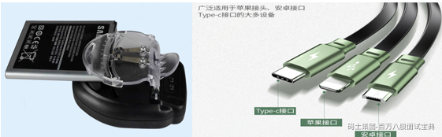

为什么要转换接口?

- 原接口和目标接口都已经存在了, 不易修改接口代码

- 抽象接口希望复用已有组件的逻辑

#### 1.2 适配器模式结构

适配器模式（Adapter）包含以下主要角色：

- 目标（Target）接口：当前系统业务所期待的接口，它可以是抽象类或接口。

- 适配者（Adaptee）类：适配者即被适配的角色,它是被访问和适配的现存组件库中的组件接口。

- 适配器（Adapter）类：它是一个转换器，通过继承或引用适配者的对象，把适配者接口转换成目标接口，让客户按目标接口的格式访问适配者。

适配器模式分为:

- 类适配器  
  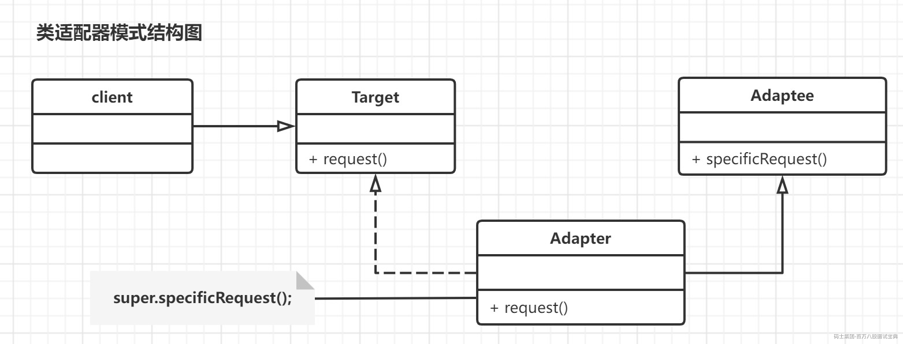

- 对象适配器  
  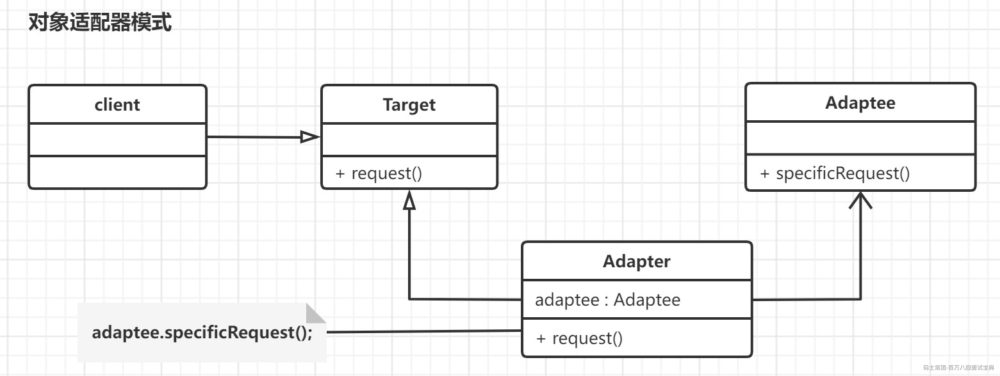

两者的区别在于: 适配器与适配者的关系, 类适配器是继承关系, 对象适配器是聚合关系,根据设计原则,聚合优先于继承,**应该多选用对象适配器.**

#### 1.3 代码示例

```plain

```

### 2. 适配器模式在实际开发中的应用

#### 2.1 需求描述

为了提升系统的速度,将一些数据以K-V 形式缓存在内存中,平台提供get,put,remove等API以及相关的管理机制.

功能实现的迭代过程,从HashMap到Memcached再到Redis,要确保后面再增加新的缓存组件时,能够实现自由的切换,并且还要符合开闭原则 .

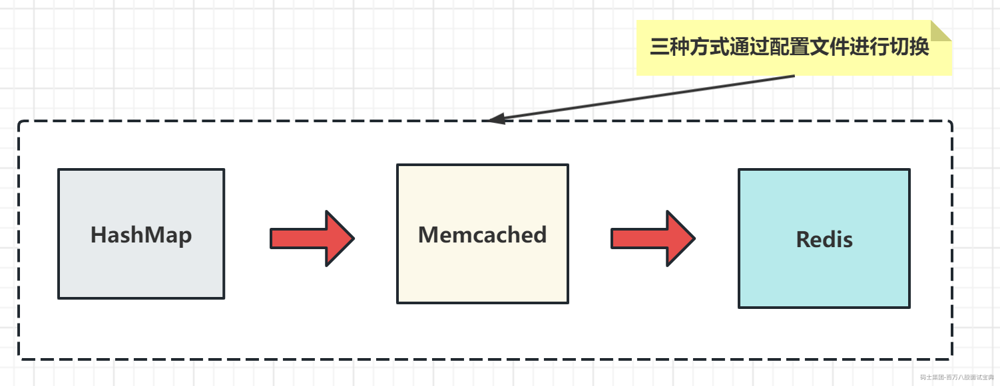

设计问题:

1. 如何在符合开闭原则前提下, 实现功能的扩展

2. 两种客户端API是不相同,如何保证自由切换

使用适配器模式

#### 2.2 功能实现

使用适配器模式将功能相似的多种第三方组件(实现方案), 统一成自己需要的API ,业务代码只依赖已经统一的API,而不依赖第三方API.

(1) 首先定义一个缓存接口，包含get、put、remove等操作方法。例如：

```plain

public interface Cache {
    void put(String key, Object value);
    Object get(String key);
    void remove(String key);
}
```

(2) 然后实现该接口的三个适配器，分别对应HashMap、Memcached、Redis三种缓存方案。例如：

```plain

public class HashMapCacheAdapter implements Cache {
    private Map<String, Object> cache = new HashMap<>();

    @Override
    public void put(String key, Object value) {
        cache.put(key, value);
    }

    @Override
    public Object get(String key) {
        return cache.get(key);
    }

    @Override
    public void remove(String key) {
        cache.remove(key);
    }
}

public class MemcachedCacheAdapter implements Cache {
    private MemcachedClient memcachedClient;

    public MemcachedCacheAdapter(MemcachedClient memcachedClient) {
        this.memcachedClient = memcachedClient;
    }

    @Override
    public void put(String key, Object value) {
        memcachedClient.set(key, 0, value);
    }

    @Override
    public Object get(String key) {
        return memcachedClient.get(key);
    }

    @Override
    public void remove(String key) {
        memcachedClient.delete(key);
    }
}

public class RedisCacheAdapter implements Cache {
    private Jedis jedis;

    public RedisCacheAdapter(Jedis jedis) {
        this.jedis = jedis;
    }

    @Override
    public void put(String key, Object value) {
        jedis.set(key, value.toString());
    }

    @Override
    public Object get(String key) {
        return jedis.get(key);
    }

    @Override
    public void remove(String key) {
        jedis.del(key);
    }
}

```

最后，我们需要一个工厂类，根据配置文件中的配置来创建相应的缓存适配器。例如：

```plain

public class CacheAdapterFactory {
  
    public static Cache createCacheAdapter(String type) {

        if ("HashMap".equals(type)) {
  
            return new HashMapCacheAdapter();
        } else if ("Memcached".equals(type)) {
  
            MemCachedClient memCachedClient = new MemCachedClient();
            return new MemcachedCacheAdapter(memCachedClient);
        } else if ("Redis".equals(type)) {

            Jedis jedis = new Jedis("localhost", 6379);
            return new RedisCacheAdapter(jedis);
        } else {
  
            throw new IllegalArgumentException("Invalid cache type: " + type);
        }
    }
}
```

使用时，只需要调用工厂类的createCacheAdapter方法，传入缓存类型即可获取相应的缓存适配器。例如：

```plain

Cache cache = CacheAdapterFactory.createCacheAdapter("Redis");
cache.put("key", "value");
Object result = cache.get("key");
cache.remove("key");
```

### 3. 适配器模式总结

**1) 适配器模式的优点**

- 可以让两个没有关联的类一起运行

- 提高类的复用性,可以一致化多个不同的接口

- 将现有接口的实现类隐藏

- 灵活度高,可以自由适配

**2) 适配器模式的缺点**

- 使用类适配器,一次最多只能适配一个适配者类

- 过多的使用适配器,会让系统的复杂度增加

**3) 适配器模式适用的场景**

- 统一多个类的接口

- 原有接口无法修改时候,但是有需要兼容的时候

## 问题5: 说一下装饰器模式与代理模式的区别 ? 如何在工作中使用装饰器模式?

### 1.各自的定义

装饰器模式：装饰器模式在不改变原始类接口的情况下，对原始类功能**进行增强**，并且支持**多个装饰器的嵌套**使用。

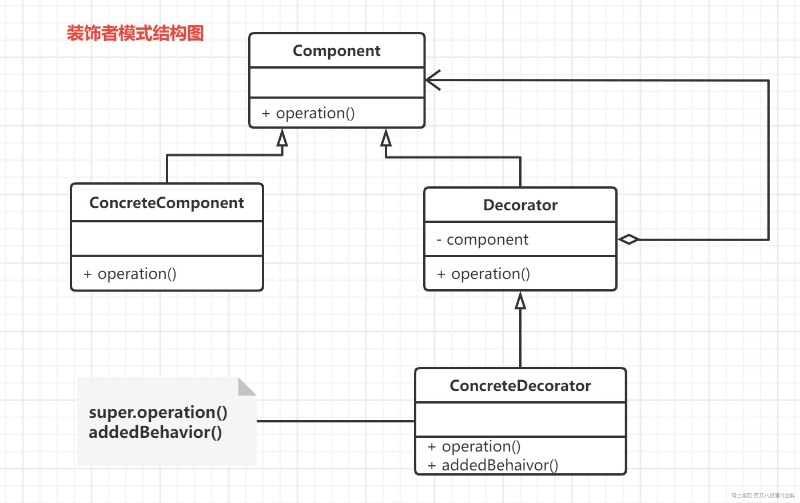

- Component 抽象构件角色: 是具体构件和抽象装饰类的父类,声明了具体构件中实现的业务方法,使得客户端能以一致的方式处理未装饰和已装饰对象。

- Concrete Component 具体构件角色: 是抽象构件类的子类,定义了具体的构建对象并实现了抽象构建中声明的方法。装饰类可以给它增加额外的职责(方法)。

- Decorator 抽象装饰角色: 是抽象构件类的子类,用于给具体构件增加职责,维护一个指向抽象构件对象的引用,以达到装饰的目的。

- Concrete Decorator 具体装饰角色: 是抽象装饰类的子类,负责向构件添加新的职责。每个具体装饰类都定义了一些新的行为,可以调用已定义的方法并增加新的方法。

代码示例

```plain

/**
 * 抽象构件类
 * @author spikeCong
 * @date 2022/9/27
 **/
public abstract class Component {

    //抽象方法
    public abstract void operation();
}

/**
 * 具体构建类
 * @author spikeCong
 * @date 2022/9/27
 **/
public class ConcreteComponent extends Component {

    @Override
    public void operation() {
        //基础功能实现(复杂功能通过装饰类进行扩展)
    }
}
```

```plain

/**
 * 抽象装饰类-装饰者模式的核心
 * @author spikeCong
 * @date 2022/9/27
 **/
public abstract class Decorator extends Component{

    //维持一个对抽象构件对象的引用
    private Component component;

    //注入一个抽象构件类型的对象
    public Decorator(Component component) {
        this.component = component;
    }

    @Override
    public void operation() {
        //调用原有业务方法(这里并没有真正实施装饰,而是提供了一个统一的接口,将装饰过程交给子类完成)
        component.operation();
    }
}

/**
 * 具体装饰类
 * @author spikeCong
 * @date 2022/9/27
 **/
public class ConcreteDecorator extends Decorator {

    public ConcreteDecorator(Component component) {
        super(component);
    }

    @Override
    public void operation() {
        super.operation(); //调用原有业务方法
        addedBehavior(); //调用新增业务方法
    }

    //新增业务方法
    public void addedBehavior(){
        //......
    }
}
```

代理模式：代理模式在不改变原始类接口的条件下，为原始类定义一个代理类，**主要目的是控制访问，而非加强功能**，这是它跟装饰器模式最大的不同。

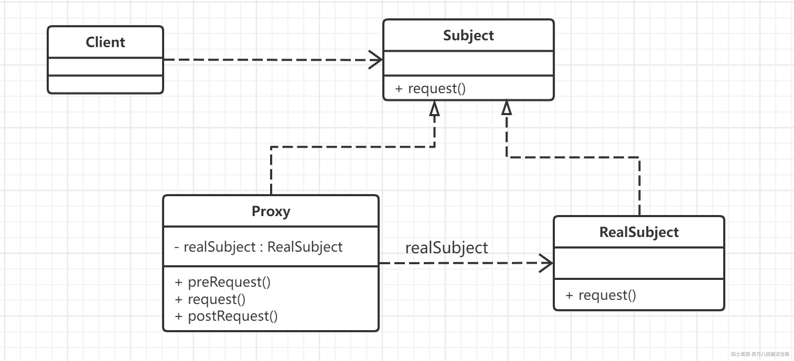

### 2.主要区别

目的意图不同

- 代理模式: 控制 ---> 为了自己

- 装饰器模式: 增强 ---> 为了目标类

使用差别

- 代理模式: 对于被代理对象 有绝对的控制权,可以执行 不执行

- 装饰器模式: 没有控制权, 肯定会执,增加了一层装饰的功能

对于客户端

- 代理模式: 更关心的是被代理对象的功能

- 装饰器模式: 更关心对于装饰器进行增强的功能

### 3.装饰器模式在实际开发中的应用

需求: 有多个装饰时是怎么保证后面的装饰，在前面装饰的基础上装饰的。比如字符，需要加密+压缩。怎么能让压缩，在加密的基础上压缩 ?

1. 创建一个字符组件接口

```plain

public interface StringComponent {
    String transform(String str);
}
```

2. 实现字符组件

```plain

//字符组件
public class StringEncryptor implements StringComponent {
    @Override
    public String transform(String str) {

        //base64编码
        String encoderStr = Base64.getEncoder().encodeToString(str.getBytes());
        return encoderStr;
    }
}
```

3. 字符加密装饰器

```plain

public class StringEncryptorDecorator implements StringComponent {
  
    private StringComponent component;

    public StringEncryptorDecorator(StringComponent component) {
        this.component = component;
    }

    @Override
    public String transform(String str) {
        String encrypted = component.transform(str); // 先调用前面一个装饰器或组件的方法
        // 这里演示一个简单的压缩方法，将字符串压缩成一行
        return encrypted.replaceAll("\\s+", "");
    }
}
```

4. 字符压缩的装饰器

```plain

public class StringCompressorDecorator implements StringComponent {
    private StringComponent component;

    public StringCompressorDecorator(StringComponent component) {
        this.component = component;
    }

    @Override
    public String transform(String str) {
        String compressed = component.transform(str); // 先调用前面一个装饰器或组件的方法
        // 这里演示一个简单的压缩方法，将字符串压缩成一行
        return compressed.replaceAll("\\s+", "");
    }
}
```

5. 客户端

```plain

public class Client {
    public static void main(String[] args) {
        StringComponent component = new StringEncryptor(); // 创建字符加密组件
        component = new StringEncryptorDecorator(component); // 用字符加密装饰器装饰它
        component = new StringCompressorDecorator(component); // 用字符压缩装饰器再次装饰它

        String original = "Hello, world!"; // 原始字符串
        String transformed = component.transform(original); // 转换后的字符串
        System.out.println(transformed);
    }
}
```

输出结果为：`Ifmmp-!xpsme"`，这是对原始字符串进行加密和压缩后的结果。可以看到，压缩操作在加密操作的基础上进行了。

### 4. 装饰器模式总结

**1) 装饰器模式的优点:**

- 装饰器模式比**继承**更加灵活.

- 可以多次装饰,不同的装饰顺序 实现不同的行为

**2) 装饰器模式的缺点:**

- 会产生过多的小对象

- 装饰器模式,更容易出错

**3) 装饰器模式的适用场景**

- 动态扩展功能

- 不支持继承扩展类的场景
