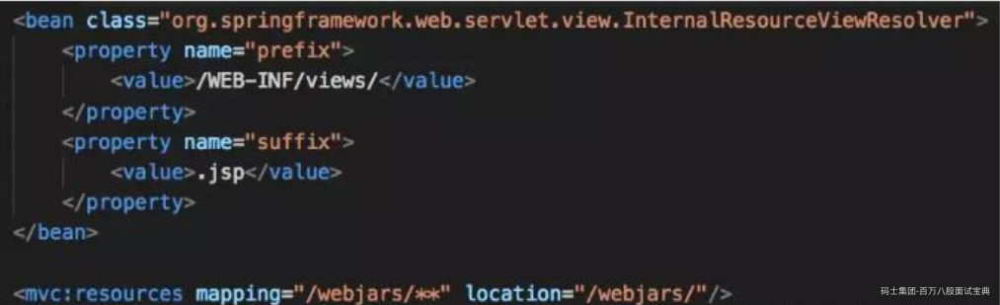
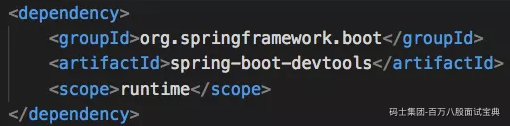
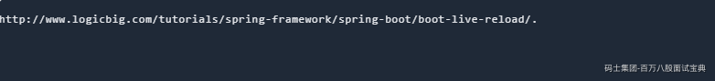
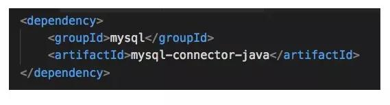
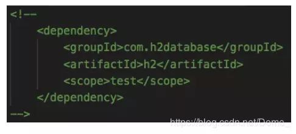

## SpringBoot面试突击班

## 什么是SpringBoot？

Spring Boot 是由 Pivotal 团队提供的基于 Spring 的全新框架，旨在简化 Spring 应用的初始搭建和开发过程。该框架使用了特定的方式来进行配置，从而使开发人员不再需要定义样板化的配置。 约定大于（优于）配置

## SpringBoot的run方法做了什么事？

run方法其实就是做了一个IOC初始化的操作

## @ComponentScan注解是干什么的？

被@ComponentScan修饰的java类，如果没有指定具体的扫描路径。实际上他默认的扫描路径是当前JAVA类所在的路径及其子路径，都是被扫描的范围。

## @EnableAutoConfiguration注解是干什么的？

```plain
@EnableAutoConfiguration        开启自动配置        开启自动装配
```

## Import注解的三种使用用法

1.静态注入的方式

2.实现了我们的ImportSelector接口，并且实现了selectImports方法，那么我们的返回值就是selectImports的方法的返回类型。

3.实现了ImportBeanDefinitionRegistrar接口，并且实现了registerBeanDefinitions方法。那么这个时候我们可以自行封装BeanDefinition

## SpringBoot自动装配的核心配置文件有哪些？

```plain
META-INF/spring.factories        候选

META-INF/spring-autoconfigure-metadata.properties         过滤
```

## SpringBoot自动装配的流程是怎样的？

首先，咱们的SpringBoot肯定是执行了Main方法中的run方法，而我们的run方法中会做IOC的初始化，那么我们的SpringBoot显然不会进行配置文件的初始化，而是注解初始化。那么显然我们会将java配置类的类对象传递进去，我们会走到@SpringBootApplication注解，接下来，很显然，起作用的是@EnableAutoConfiguration注解，接下来，这个注解会去加载我们的spring.factories跟spring-autoconfigure-metadata.properties这两个配置文件，进行候选以及筛选的工作，加载进去内存之后，实际上我们会在AutoConfigationImportSelect中加载spring.factories跟spring-autoconfigure-metadata.properties，我们会在返回的时候加载进入容器，这就是自动装配的流程。

## bootstrap.yml的意义

SpringBoot中默认支持的属性文件有下面4种

application.properties application.xml

application.yml aplication.yaml

那么为什么还有一类bootstrap.yml bootstrap.properties文件

bootstrap.yml在SpringBoot中默认是不支持的，需要在SpringCloud环境下才支持，作用是在SpringBoot项目启动之前启动的一个父容器，该父容器可以在SpringBoot容器启动之前完成一些加载初始化的操作。比如加载配置中心中的信息。

## 运行SpringBoot项目的方式

**1、** 打包用命令或者者放到容器中运行

**2、** 用 Maven/ Gradle 插件运行

**3、** 直接执行 main 方法运行

# SpringBoot如何解决跨域问题

跨域可以在前端通过 JSONP 来解决，但是 JSONP 只可以发送 GET 请求，无法发送其他类型的请求，在 RESTful 风格的应用中，就显得非常鸡肋，因此我们推荐在后端通过 （CORS，Cross-origin resource sharing） 来解决跨域问题。这种解决方案并非 SpringBoot 特有的，在传统的 SSM 框架中，就可以通过 CORS 来解决跨域问题，只不过之前我们是在 XML 文件中配置 CORS ，现在可以通过实现WebMvcConfigurer接口然后重写addCorsMappings方法解决跨域问题。

```java
@Override
public void addCorsMappings(CorsRegistry registry) {
    registry.addMapping("/**")
            .allowedOrigins("*")
            .allowCredentials(true)
            .allowedMethods("GET", "POST", "PUT", "DELETE", "OPTIONS")
            .maxAge(3600);
}
```

# SpringBoot中如何配置log4j

在引用log4j之前，需要先排除项目创建时候带的日志，因为那个是Logback，然后再引入log4j的依赖，引入依赖之后，去src/main/resources目录下的log4j-spring.properties配置文件，就可以开始对应用的日志进行配置使用。

# 介绍几个常用的starter

1、 spring-boot-starter-web ：提供web开发需要servlet与jsp支持 + 内嵌的 Tomcat 。

2、 spring-boot-starter-data-jpa ：提供 Spring JPA + Hibernate 。

3、 spring-boot-starter-data-Redis ：提供 Redis 。

4、 mybatis-spring-boot-starter ：第三方的mybatis集成starter。

5、spring-boot-starter-data-solr solr支持

# SpringBoot的优点

Spring Boot 优点非常多，如：

一、独立运行

Spring Boot而且内嵌了各种servlet容器，Tomcat、Jetty等，现在不再需要打成war包部署到容器

中，Spring Boot只要打成一个可执行的jar包就能独立运行，所有的依赖包都在一个jar包内。

二、简化配置

spring-boot-starter-web启动器自动依赖其他组件，简少了maven的配置。

三、自动配置

Spring Boot能根据当前类路径下的类、jar包来自动配置bean，如添加一个spring-boot-starter

web启动器就能拥有web的功能，无需其他配置。

四、无代码生成和XML配置

Spring Boot配置过程中无代码生成，也无需XML配置文件就能完成所有配置工作，这一切都是借助

于条件注解完成的，这也是Spring4.x的核心功能之一。

五、应用监控

Spring Boot提供一系列端点可以监控服务及应用，做健康检测

# **Spring Boot、** **Spring MVC 和 Spring 有什么区别？**

1、Spring

Spring最重要的特征是依赖注入。所有 SpringModules 不是依赖注入就是 IOC 控制反转。

当我们恰当的使用 DI 或者是 IOC 的时候，我们可以开发松耦合应用。松耦合应用的单元测试可以很容易的进行。

2、Spring MVC

Spring MVC 提供了一种分离式的方法来开发 Web 应用。通过运用像 DispatcherServelet，MoudlAndView 和 ViewResolver 等一些简单的概念，开发 Web 应用将会变的非常简单。

3、SpringBoot

Spring 和 SpringMVC 的问题在于需要配置大量的参数。



Spring Boot 通过一个自动配置和启动的项来目解决这个问题。为了更快的构建产品就绪应用程序，Spring Boot 提供了一些非功能性特征。

# **什么是 Spring Boot Starter ？**

启动器是一套方便的依赖描述符，它可以放在自己的程序中。你可以一站式的获取你所需要的 Spring 和相关技术，而不需要依赖描述符的通过示例代码搜索和复制黏贴的负载。

例如，如果你想使用 Sping 和 JPA 访问数据库，只需要你的项目包含 spring-boot-starter-data-jpa 依赖项，你就可以完美进行。

# **如何重新加载Spring Boot上的更改，而无需重新启动服务器？**

这可以使用DEV工具来实现。通过这种依赖关系，您可以节省任何更改，嵌入式tomcat将重新启动。

Spring Boot有一个开发工具（DevTools）模块，它有助于提高开发人员的生产力。Java开发人员面临的一个主要挑战是将文件更改自动部署到服务器并自动重启服务器。

开发人员可以重新加载Spring Boot上的更改，而无需重新启动服务器。这将消除每次手动部署更改的需要。Spring Boot在发布它的第一个版本时没有这个功能。

这是开发人员最需要的功能。DevTools模块完全满足开发人员的需求。该模块将在生产环境中被禁用。它还提供H2数据库控制台以更好地测试应用程序。



页面自动装载：

同样的，如果你想自动装载页面，有可以看看 FiveReload



# **RequestMapping 和 GetMapping 的不同之处在哪里？**

RequestMapping 具有类属性的，可以进行 GET,POST,PUT 或者其它的注释中具有的请求方法。GetMapping 是 GET 请求方法中的一个特例。它只是 ResquestMapping 的一个延伸，目的是为了提高清晰度。

# **我们如何连接一个像 MySQL 或者Orcale 一样的外部数据库？**

让我们以 MySQL 为例来思考这个问题：

第一步 - 把 mysql 连接器的依赖项添加至 pom.xml



第二步 - 从 pom.xml 中移除 H2 的依赖项

或者至少把它作为测试的范围。



第三步 - 安装你的 MySQL 数据库

第四步 - 配置你的 MySQL 数据库连接

配置 application.properties

```yaml
rootspring.jpa.hibernate.ddl-auto=none 
spring.datasource.url=jdbc:mysql://localhost:3306/test
spring.datasource.username=root
spring.datasource.password=root
```

第五步 - 重新启动，你就准备好了！

# **Spring Boot 需要独立的容器运行吗？**

可以不需要，内置了 Tomcat/ Jetty 等容器。

# **你如何理解 Spring Boot 中的 Starters？**

Starters可以理解为启动器，它包含了一系列可以集成到应用里面的依赖包，你可以一站式集成 Spring 及其他技术，而不需要到处找示例代码和依赖包。如你想使用 Spring JPA 访问数据库，只要加入 spring-boot-starter-data-jpa 启动器依赖就能使用了。

# **Spring Boot 支持哪些日志框架？推荐和默认的日志框架是哪个？**

Spring Boot 支持 Java Util Logging, Log4j2, Lockback 作为日志框架，如果你使用 Starters 启动器，Spring Boot 将使用 Logback 作为默认日志框架.

# **SpringBoot 实现热部署有哪几种方式？**

主要有两种方式：

1、Spring Loaded

这可以使用DEV工具来实现。通过这种依赖关系，您可以节省任何更改，嵌入式tomcat将重新启动。

Spring Boot有一个开发工具（DevTools）模块，它有助于提高开发人员的生产力。Java开发人员面临的一个主要挑战是将文件更改自动部署到服务器并自动重启服务器。

开发人员可以重新加载Spring Boot上的更改，而无需重新启动服务器。这将消除每次手动部署更改的需要。Spring Boot在发布它的第一个版本时没有这个功能。

这是开发人员最需要的功能。DevTools模块完全满足开发人员的需求。该模块将在生产环境中被禁用。它还提供H2数据库控制台以更好地测试应用程序。


2、Spring-boot-devtools：

同样的，如果你想自动装载页面，有可以看看 FiveReload


# **Spring Boot 的核心注解是哪个？它主要由哪几个注解组成的？**

启动类上面的注解是@SpringBootApplication，它也是 Spring Boot 的核心注解，主要组合包含了以下 3 个注解：

● @SpringBootConfiguration：组合了 @Configuration 注解，实现配置文件的功能。

● @EnableAutoConfiguration：打开自动配置的功能，也可以关闭某个自动配置的选项，

如关闭数据源自动配置功能： @SpringBootApplication(exclude = { DataSourceAutoConfiguration.class })。

● @ComponentScan：Spring组件扫描

# **Spring Boot 有哪几种读取配置的方式**

Spring Boot默认的配置文件有两种格式: application.properties 和 application.yml。 查找顺序是首先从application.properties 查找，

**@PropertySource**

@PropertySource注解用于指定资源文件读取的位置，它不仅能读取[properties](https://so.csdn.net/so/search?q=properties&spm=1001.2101.3001.7020)文件，也能读取xml文件，并且通过YAML解析器，配合自定义PropertySourceFactory实现解析YAML文件。

**@Value**

使用 @Value 读取配置文件

这种方法适用于对象的参数比较少的情况

我们可以直接在对象的属性上使用 `@Value` 注解，同时以 `${}` 的形式传入配置文件中对应的属性。同时需要在该类的上方使用 `@Configuration` 注解，将该类作为配置

**@Environment**

Environment 是 SpringCore 中的一个用于读取配置文件的类，将此类使用 @Autowired 注入到类中就可以使用它的getProperty方法来获取某个配置项的值。

**@ConfigurationProperties**

使用 @ConfigurationProperties 读取配置文件  
如果对象的参数比较多情况下,推荐使用 @ConfigurationProperties 会更简单一些，不需要在每一个字段的上面的使用@Value注解。

@ConfigurationProperties注解声明当前类为配置读取类

prefix="rabbitmq" 表示读取前缀为rabbitmq的属性

# Spring Boot 如何定义多套不同环境配置？

基于properties配置文件  
第一步  
创建各环境对应的properties配置文件  
applcation.properties

application-dev.properties

application-test.properties

application-prod.properties  
第二步  
然后在applcation.properties文件中指定当前的环境spring.profiles.active=test,这时候读取的就是  
application-test.properties文件。  
基于yml配置文件  
只需要一个applcation.yml文件就能搞定，推荐此方式。

# **Spring Boot 可以兼容老 Spring 项目吗，如何做？**

可以兼容，使用 @ImportResource 注解导入老 Spring 项目配置文件。

# **如何在 Spring Boot 启动的时候运行一些特定的代码？**

可以实现接口 ApplicationRunner 或者 CommandLineRunner，这两个接口实现方式一样，它们都只提供了一个 run 方法，实现上述接口的类加入IOC容器即可生效。

# **你如何理解 Spring Boot 配置加载顺序？**

1、开发者工具 `Devtools` 全局配置参数；  
2、单元测试上的 `@TestPropertySource` 注解指定的参数；  
3、单元测试上的 `@SpringBootTest` 注解指定的参数；  
4、命令行指定的参数，如 `java -jar springboot.jar --name="Java技术栈"`；  
5、命令行中的 `SPRING_APPLICATION_JSON` 指定参数, 如 `java -Dspring.application.json='{"name":"Java技术栈"}' -jar springboot.jar`  
6、`ServletConfig` 初始化参数；  
7、`ServletContext` 初始化参数；  
8、JNDI参数（如 `java:comp/env/spring.application.json`）；  
9、Java系统参数（来源：`System.getProperties()`）；  
10、操作系统环境变量参数；  
11、`RandomValuePropertySource` 随机数，仅匹配：`ramdom.*`；  
12、JAR包外面的配置文件参数（`application-{profile}.properties（YAML）`）  
13、JAR包里面的配置文件参数（`application-{profile}.properties（YAML）`）  
14、JAR包外面的配置文件参数（`application.properties（YAML）`）  
15、JAR包里面的配置文件参数（`application.properties（YAML）`）  
16、`@Configuration`配置文件上 `@PropertySource` 注解加载的参数；  
17、默认参数（通过 `SpringApplication.setDefaultProperties` 指定）；

数字越小优先级越高，即数字小的会覆盖数字大的参数值。

# **如何实现SpringBoot 应用程序的安全性?**

为了实现Spring Boot的安全性，我们使用 spring-boot-starter-security依赖项，并且必须添加安全配置。它只需要很少的代码。配置类将必须扩展WebSecurityConfigurerAdapter并覆盖其方法。

# **SpringBoot中如何实现定时任务?**

定时任务也是一个常见的需求，Spring Boot 中对于定时任务的支持主要还是来自 Spring 框架。

在 Spring Boot 中使用定时任务主要有两种不同的方式，

- 一个就是使用 Spring 中的 @Scheduled 注解，

- 另一个则是使用第三方框架 Quartz。

使用 Spring 中的 @Scheduled 的方式主要通过 @Scheduled 注解来实现。

使用 Quartz ，则按照 Quartz 的方式，定义 Job 和 Trigger 即可。

# **SpringBoot 中的监视器是什么呢?**

- Spring boot actuator是spring启动框架中的重要功能之一。

- Spring boot监视器可帮助您访问生产环境中正在运行的应用程序的当前状态。

- 有几个指标必须在生产环境中进行检查和监控。

- 即使一些外部应用程序可能正在使用这些服务来向相关人员触发警报消息。

- 监视器模块公开了一组可直接作为HTTP URL访问的REST端点来检查状态。

# **SpringBoot打成的jar和普通jar有什么区别?**

Spring Boot 项目最终打包成的 jar 是可执行 jar ，这种 jar 可以直接通过 java -jar xxx.jar 命令来运行，这种 jar 不可以作为普通的 jar 被其他项目依赖，即使依赖了也无法使用其中的类。

Spring Boot 的 jar 无法被其他项目依赖，主要还是他和普通 jar 的结构不同。

普通的 jar 包，解压后直接就是包名，包里就是我们的代码，而 Spring Boot 打包成的可执行 jar 解压后，在 \BOOT-INF\classes 目录下才是我们的代码，因此无法被直接引用。

如果非要引用，可以在 pom.xml 文件中增加配置，将 Spring Boot 项目打包成两个 jar ，一个可执行，一个可引用。
