# 框架源码中的设计模式

## 1.Spring源码中的设计模式

### 1.1 工厂模式的应用

#### 1.1.1 Spring中的BeanFactory

BeanFactory，以Factory结尾，表示它是一个工厂(接口)， 它负责生产和管理bean的一个工厂。

Spring中的**BeanFactory就是简单工厂模式的体现**，根据传入一个唯一的标识来获得Bean对象

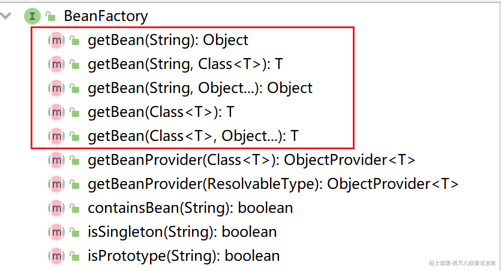

在Spring中，BeanFactory是工厂的顶层接口，也是**IOC容器的核心接口**，因此BeanFactory中定义了**管理Bean的通用方法**，如 **getBean** 和 **containsBean** 等.

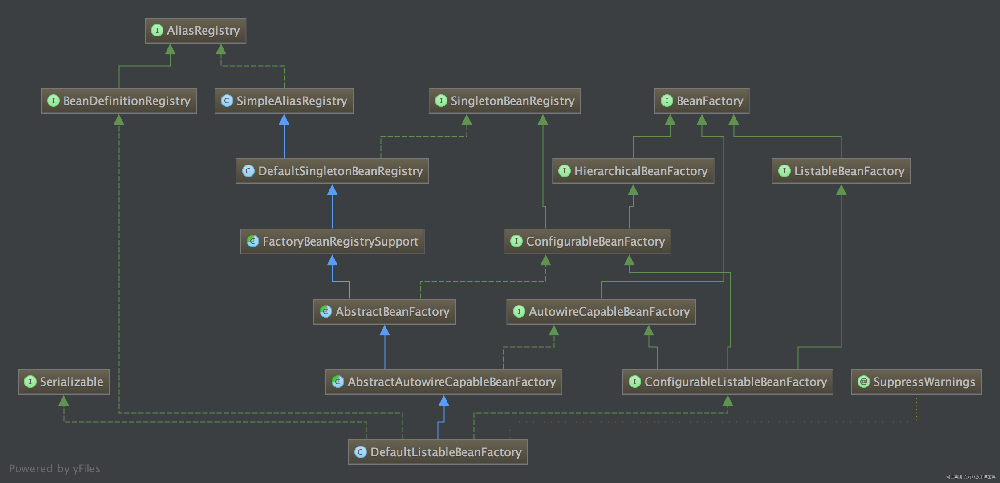

BeanFactory只是个接口，并不是IOC容器的具体实现，所以Spring容器给出了很多种实现，如 **DefaultListableBeanFactory**、**XmlBeanFactory**、**ApplicationContext**等

**ApplicationContext**是Spring框架中最常用的IoC容器，它是BeanFactory的子接口，提供了更丰富的功能和更强的扩展性。

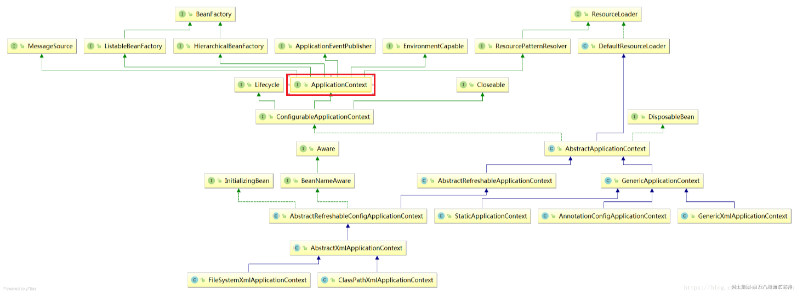

ApplicationContext的子类

1. ClassPathXmlApplicationContext：基于XML配置文件的ApplicationContext实现类，可以加载类路径下的XML配置文件。

2. FileSystemXmlApplicationContext：基于XML配置文件的ApplicationContext实现类，可以加载文件系统中的XML配置文件。

3. AnnotationConfigApplicationContext：基于Java注解的ApplicationContext实现类，可以通过Java配置类来管理Bean实例。

4. WebApplicationContext：适用于Web应用场景的ApplicationContext子接口，提供了更丰富的Web应用支持，例如可以加载Web应用中的配置文件、管理Web应用中的Bean实例等。

这些ApplicationContext子类都实现了ApplicationContext接口，提供了不同的功能和扩展性，可以根据具体的应用场景选择合适的ApplicationContext子类来管理Bean实例。

**使用示例**

**2) BeanFactory的使用**

```plain
public class User {

    private int id;

    private String name;

    private Friends friends;

    public User() {
    }

    public User(Friends friends) {
        this.friends = friends;
    }

 //get set......
}

public class Friends {

    private List<String> names;

    public Friends() {
    }

    public List<String> getNames() {
        return names;
    }

    public void setNames(List<String> names) {
        this.names = names;
    }
}
```

配置文件

```plain

<beans xmlns="http://www.springframework.org/schema/beans"
       xmlns:xsi="http://www.w3.org/2001/XMLSchema-instance"
       xmlns:p="http://www.springframework.org/schema/p"
       xmlns:context="http://www.springframework.org/schema/context"
       xmlns:mvc="http://www.springframework.org/schema/mvc"
       xmlns:task="http://www.springframework.org/schema/task"
       xsi:schemaLocation="
        http://www.springframework.org/schema/beans
        http://www.springframework.org/schema/beans/spring-beans-4.2.xsd
        http://www.springframework.org/schema/context
        http://www.springframework.org/schema/context/spring-context-4.2.xsd
        http://www.springframework.org/schema/mvc
        http://www.springframework.org/schema/mvc/spring-mvc-4.2.xsd
        http://www.springframework.org/schema/task
        http://www.springframework.org/schema/task/spring-task-4.2.xsd">
  
    <bean id="User" class="com.example.factory.User">
        <property name="friends" ref="UserFriends" />
    </bean>

    <bean id="UserFriends" class="com.example.factory.Friends">
        <property name="names">
            <list>
                <value>"LiLi"</value>

                <value>"LuLu"</value>

            </list>

        </property>

    </bean>

</beans>

```

测试

```plain

public class SpringFactoryTest {

    public static void main(String[] args) {
        ClassPathXmlApplicationContext ctx = new ClassPathXmlApplicationContext("bean.xml");
        User user = ctx.getBean("User", User.class);

        List<String> names = user.getFriends().getNames();
        for (String name : names) {
            System.out.println("FriendName: " + name);
        }

        ctx.close();
    }
}
```

#### 1.1.2 Spring中的FactoryBean

FactoryBean 就是一个工厂Bean，相当于将工厂类放到了Spring中管理、当获取此Bean的时候返回的是此工厂生成的Bean.

> FactoryBean 通常是用来创建比较复杂的bean，一般的bean 直接用xml配置即可，但如果一个bean的创建过程中涉及到很多其他的bean 和复杂的逻辑，用xml配置比较困难，这时可以考虑用FactoryBean。

FactoryBean 源码

```plain

public interface FactoryBean<T> {
    String OBJECT_TYPE_ATTRIBUTE = "factoryBeanObjectType";

    /**
    getObject()方法: 会返回该FactoryBean生产的对象实例,我们需要实现该方法,以给出自己的对象实例化逻辑
    这个方法也是FactoryBean的核心.
    */
    @Nullable
    T getObject() throws Exception;

    /**
    getObjectType()方法: 仅返回getObject() 方法所返回的对象类型,如果预先无法确定,返回NULL,
    这个方法返回类型是在IOC容器中getBean所匹配的类型
    */
    @Nullable
    Class<?> getObjectType();

    //该方法的结果用于表明 工厂方法getObject() 所生产的 对象是否要以单例形式存储在容器中如果以单例存在就返回true,否则返回false
    default boolean isSingleton() {
        return true;
    }
}
```

**代码示例**

当配置文件中\*\*\*\*的class属性配置的实现类是FactoryBean时，通过 getBean()方法返回的不是FactoryBean本身，而是FactoryBean#getObject()方法所返回的对象，相当于FactoryBean#getObject()代理了getBean()方法。

- Car 实体

```plain

public class Car {

    private  String color;

    private  String brand;

    private  double price;
   
    //get..set...
}
```

- FactoryBean 将Car对象的创建交给FactoryBean

```plain

@Component("carFactoryBean")
public class CarFactoryBean implements FactoryBean<Car> {

    /**
     * 返回创建的对象
     */
    @Override
    public Car getObject() throws Exception {
        System.out.println("FactoryBean的getObject 替换掉getBean.....");
        return new Car();
    }

    /**
     * 创建对象的class
     */
    @Override
    public Class<?> getObjectType() {
        return Car.class;
    }

    /**
     * 是否是单例
     *      true: 每次获取对象都是同一个对象
     *      false: 每次获取对象都是新的对象
     */
    @Override
    public boolean isSingleton() {
        return true;
    }
}
```

- 测试

```plain

public class Test01 {

    public static void main(String[] args) {

        AnnotationConfigApplicationContext context = new AnnotationConfigApplicationContext(AppConfig.class);

        Car bean = context.getBean(Car.class);
        System.out.println(bean);
    }
}

//打印结果
FactoryBean的getObject 替换掉getBean.....
com.mashibing.spring01.demo02.Car@4d14b6c2
```

在实例化Bean过程比较复杂的情况下，如果按照传统的方式，则需要在中提供大量的配置信息。配置方式的灵活性是受限的，这时采用编码的方式可能会得到一个简单的方案。

Spring为此提供了一个 `FactoryBean`的工厂类接口，用户可以通过实现该接口定制实例化Bean的逻辑。

> FactoryBean 是很古早的一个类了，和 xml 初始化配套的东西，在 xml 时代配置文件能做的工作有限，只能通过工厂类初始化复杂的 bean。但是现在 java configuration 时代 java 本身就已经逻辑完备了，只使用 @Bean 就可以满足复杂 bean 的初始化需求。所以现在看来 FactoryBean 可以算作一个历史遗留的备选方案吧

#### 1.1.3 BeanFactory与FactoryBean的区别

- BeanFactory是一个大工厂, 是IOC容器的根基, 有繁琐的bean声明周期处理过程,可以生成各种各样的Bean.  
  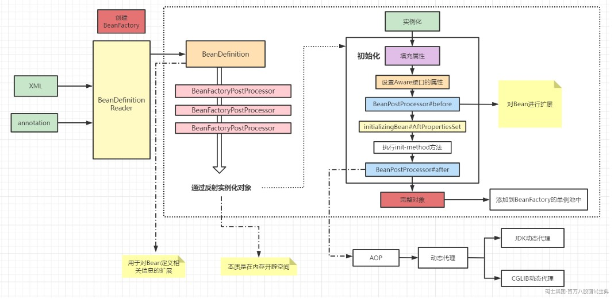

- FactoryBean是一个小工厂, 它自己本身也是一个Bean,但是可以生成其他Bean.用户可以通过实现该接口定制实例化Bean的逻辑。  
  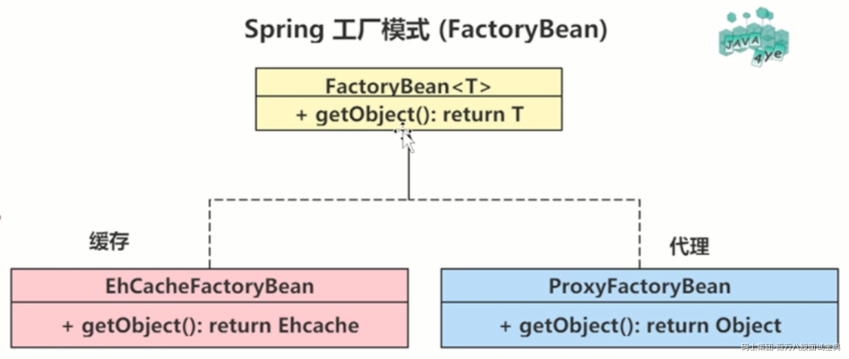

> 这其实就是一个工厂方法模式,公共的工厂接口,然后是不同的具体工厂,通过具体工厂去获取对象.

### 1.2 单例模式的应用

#### 1.2.1 DefaultListableBeanFactory

在Spring中，所有由Spring容器管理的Bean都默认是单例的。

Spring框架中最经典的单例模式实现是在BeanFactory中。BeanFactory是Spring IoC容器的核心接口，其实现类**DefaultListableBeanFactory**在加载Bean定义时，会将单例的Bean实例化并缓存在ConcurrentHashMap中，以保证该Bean的唯一性。

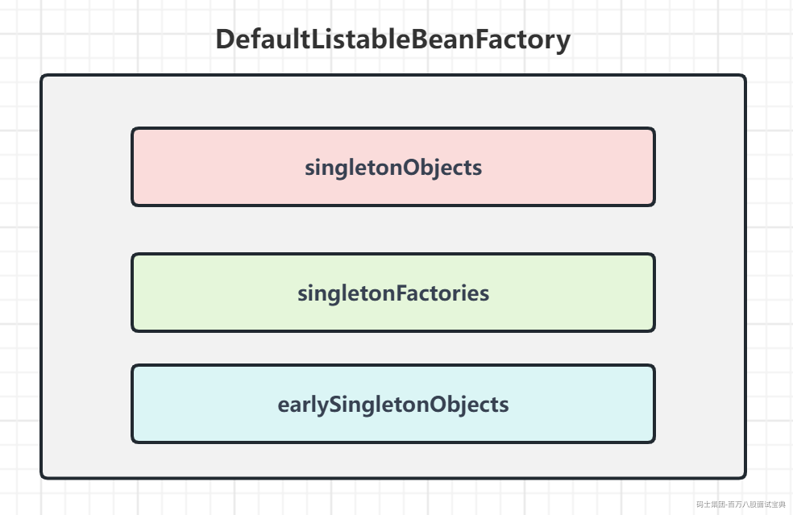

DefaultListableBeanFactory定义了三个Map对象：singletonObjects、singletonFactories和earlySingletonObjects，它们都被设计为线程安全的ConcurrentHashMap。

- singletonObjects用于存储已经实例化的单例Bean对象

- singletonFactories用于存储BeanFactory对象

- earlySingletonObjects用于存储未完全初始化的Bean对象。

当一个单例Bean实例被获取时，DefaultListableBeanFactory会首先检查singletonObjects是否存在该Bean实例，如果存在则直接返回，否则就从earlySingletonObjects或singletonFactories中获取或创建该Bean实例

#### 1.2.2 SingletonBeanRegistry

但是单例相关的操作其实是被定义在了SingletonBeanRegistry接口中 , SingletonBeanRegistry是Spring框架中的一个接口，定义了向Spring IoC容器中添加和获取单例Bean的方法。

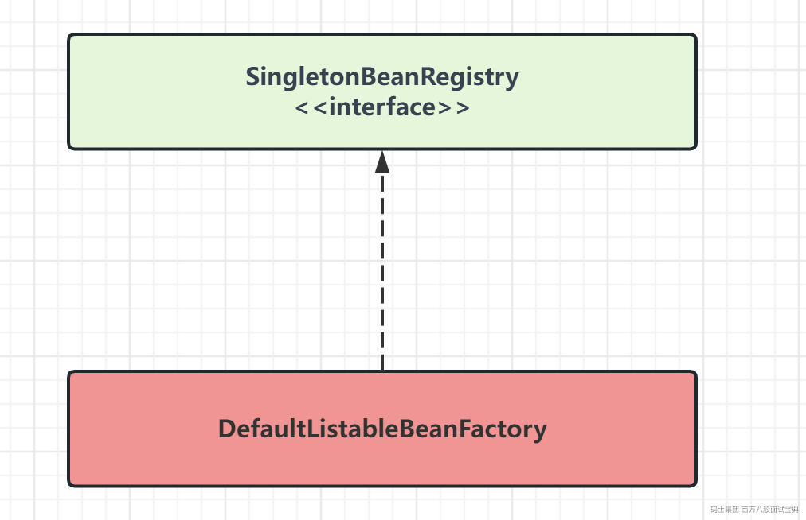

```plain

public interface SingletonBeanRegistry {

//将指定名称的Bean实例注册为单例Bean。如果该名称已经存在于单例Bean注册表中，则会抛出IllegalStateException异常。
    void registerSingleton(String var1, Object var2);

  
    //获取指定名称的单例Bean实例。如果指定名称的Bean实例不存在，则返回null。
    @Nullable
    Object getSingleton(String var1);

    //检查指定名称的单例Bean实例是否已经存在于单例Bean注册表中。
    boolean containsSingleton(String var1);

    //获取所有已注册的单例Bean名称。
    String[] getSingletonNames();

  
    //获取当前容器中已经注册的单例Bean的数量
    int getSingletonCount();

    //获取一个用于同步单例Bean注册表的对象
    Object getSingletonMutex();
}
```

#### 1.2.3 Spring单例Bean与单例模式的区别

Spring单例Bean与单例模式的区别在于它们**关联的环境不一样**，单例模式是指在一个JVM进程中仅有一个实例，而Spring单例是指一个Spring Bean容器(ApplicationContext)中仅有一个实例。

首先看单例模式，在一个JVM进程中（理论上，一个运行的JAVA程序就必定有自己一个独立的JVM）仅有一个实例，于是无论在程序中的何处获取实例，始终都返回同一个对象，以Java内置的Runtime为例（现在枚举是单例模式的最佳实践），无论何时何处获取，下面的判断始终为真：

```plain

//  在一个JVM实例中始终只有一个实例
Runtime.getRuntime() == Runtime.getRuntime()
```

与此相比，Spring的单例Bean是与其容器 `ApplicationContext`密切相关的，所以在一个JVM进程中，如果有多个Spring容器，即使是单例bean，也一定会创建多个实例，代码示例如下：

```plain

public static void main(String[] args) {

    System.out.println(Runtime.getRuntime() == Runtime.getRuntime());

    //  第一个Spring Bean容器
    ClassPathXmlApplicationContext context_1 = new ClassPathXmlApplicationContext("bean.xml");
    Person msb1 = context_1.getBean("person", Person.class);

    //  第二个Spring Bean容器
    ClassPathXmlApplicationContext context_2 = new ClassPathXmlApplicationContext("bean.xml");
    Person msb2 = context_2.getBean("person", Person.class);

    //  这里绝对不会相等，因为创建了多个实例
    System.out.println(msb1 == msb2);
}
```

以下是Spring的配置文件：

```plain

<!-- 即使声明了为单例，只要有多个容器，也一定会创建多个实例 -->
<bean id="person" class="com.mashibing.spring01.demo03.Person" scope="singleton">
    <constructor-arg name="username">
        <value>mashibing</value>

    </constructor-arg>

</bean>

```

**如果不指定bean的类型，Spring框架生成的Bean默认就是单例的(在当前容器里)。**

Spring的单例bean与Spring bean管理容器密切相关，每个容器都会创建自己独有的实例，所以与GOF设计模式中的单例模式相差极大，但在实际应用中，如果将对象的生命周期完全交给Spring管理(不在其他地方通过new、反射等方式创建)，其实也能达到单例模式的效果。

### 1.3 适配器模式的应用

适配器模式(adapter pattern )的原始定义是：将一个类的接口转换为客户期望的另一个接口，适配器可以让不兼容的两个类一起协同工作。

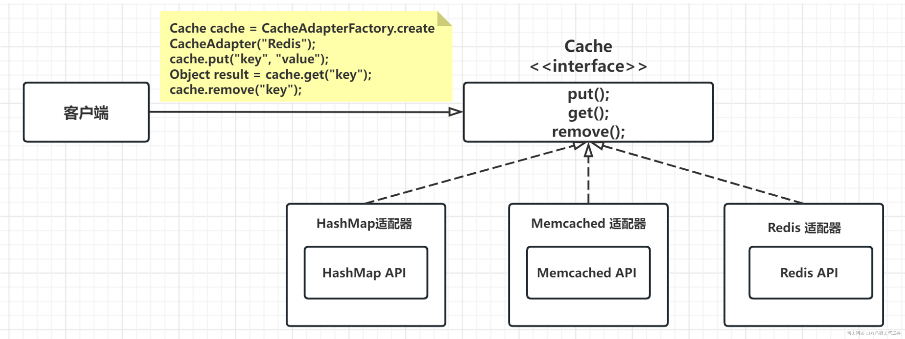

#### 1.3.1 AOP中的适配器模式

在Spring的Aop中，使用Advice（通知）来增强被代理类的功能，Advice的类型有：BeforeAdvice、AfterReturningAdvice、ThreowSadvice。

每种Advice都有对应的拦截器，MethodBeforeAdviceInterceptor、AfterReturningAdviceInterceptor、ThrowsAdviceInterceptor。

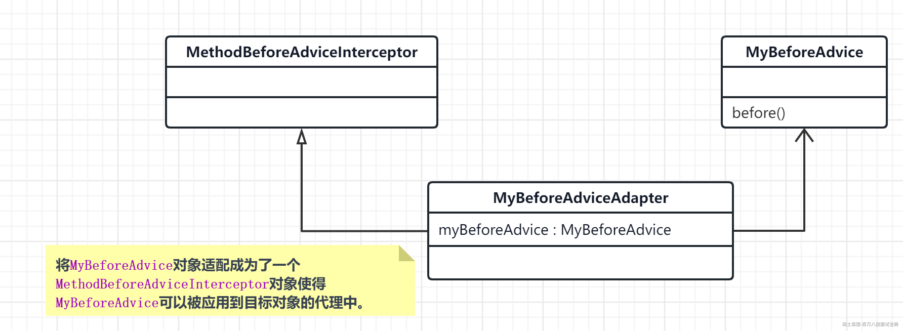

#### 1.3.2 代码示例

```plain

public interface MyService {

    void doSomething();
}

public class MyServiceImpl implements MyService {

    @Override
    public void doSomething() {
        System.out.println("Doing something ...");
    }
}

/**
 * 使用Advice（通知）来增强被代理类的功能
 * @author spikeCong
 * @date 2023/4/22
 **/
public class MyBeforeAdvice implements MethodBeforeAdvice {

    //用于在目标方法执行前进行拦截
    @Override
    public void before(Method method, Object[] objects, Object o) throws Throwable {
        System.out.println("我变强,也变秃了......");
    }
}

/**
 * 自定义适配器对象，将BeforeAdvice对象适配成为一个MethodBeforeAdviceInterceptor对象
 * @author spikeCong
 * @date 2023/4/22
 **/
public class MyBeforeAdviceAdapter extends MethodBeforeAdviceInterceptor {

    public MyBeforeAdviceAdapter(MethodBeforeAdvice advice) {
        super(advice);
    }
}

public class Test01 {

    public static void main(String[] args) {

        //创建 前置通知对象
        MyBeforeAdvice advice = new MyBeforeAdvice();

        //创建适配器对象,传入通知对象
        MyBeforeAdviceAdapter adapter = new MyBeforeAdviceAdapter(advice);

        //获取目标对象的代理工厂
        ProxyFactory factory = new ProxyFactory(new MyServiceImpl());

        //向代理对象中添加适配器对象
        factory.addAdvice(adapter);

        //获取代理对象
        MyService proxy = (MyService)factory.getProxy();

        //调用代理方法
        proxy.doSomething();
    }
}
```

每个类对应适配器模式中的如下角色：

1. Target：`MyServiceImpl`类是目标对象，也就是需要被代理的对象。

2. Adapter：`MyBeforeAdviceAdapter`类是适配器对象，它将 `MyBeforeAdvice`对象适配成为了一个 `MethodBeforeAdviceInterceptor`对象，使得 `MyBeforeAdvice`可以被应用到目标对象的代理中。

3. Adaptee：`MyBeforeAdvice`类是被适配的对象，它定义了一个前置通知方法，在目标方法执行前进行拦截。

4. Client：`Main`类是客户端，它通过创建适配器对象并将其添加到目标对象的代理中，实现了在目标方法执行前应用 `MyBeforeAdvice`的前置通知。

### 1.4 模板方法模式的应用

#### 1.4.1 什么是模板方法模式

**模板方法模式(template method pattern)原始定义是：在操作中定义算法的框架，将一些步骤推迟到子类中。模板方法让子类在不改变算法结构的情况下重新定义算法的某些步骤。**

模板方法中的算法可以理解为广义上的业务逻辑,并不是特指某一个实际的算法.定义中所说的算法的框架就是模板, 包含算法框架的方法就是模板方法.


模板方法模式的定位很清楚，就是为了解决算法框架这类特定的问题，同时明确表示需要使用继承的结构。

> 准备一个抽象类，将部分逻辑以具体方法以及具体构造函数的形式实现，然后声明一些抽象方法来迫使子类实现剩余的逻辑。不同的子类可以以不同的方式实现这些抽象方法，从而对剩余的逻辑有不同的实现。这就是模板方法模式的用意。

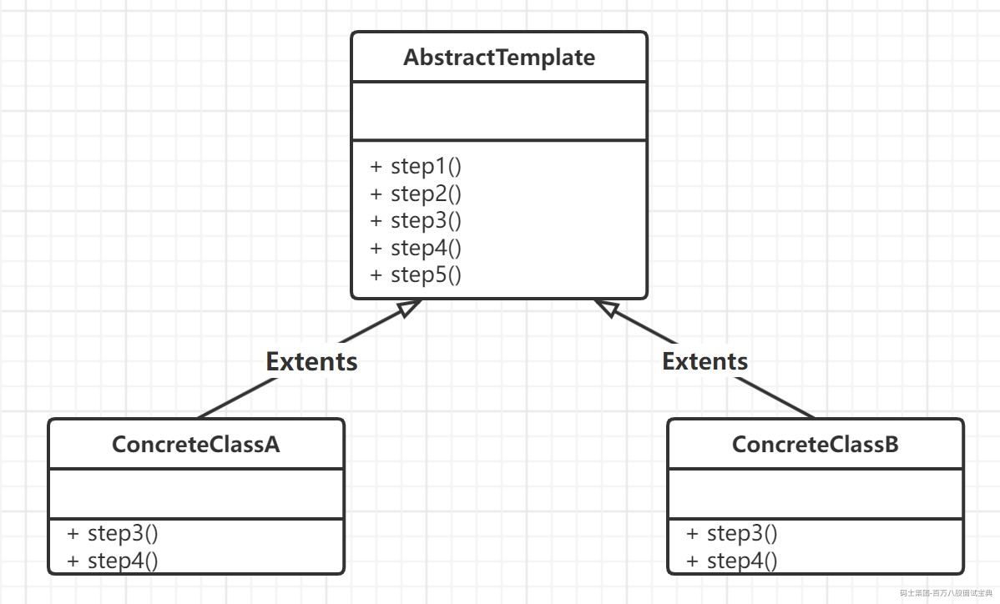

模板方法（Template Method）模式包含以下主要角色：

- 抽象父类：定义一个算法所包含的所有步骤，并提供一些通用的方法逻辑。

- 具体子类：继承自抽象父类，根据需要重写父类提供的算法步骤中的某些步骤。

抽象类（Abstract Class）：负责给出一个算法的轮廓和骨架。它由一个模板方法和若干个基本方法构成。

- 模板方法：定义了算法的骨架，按某种顺序调用其包含的基本方法。

- 基本方法：是实现算法各个步骤的方法，是模板方法的组成部分。基本方法又可以分为三种：

- 抽象方法(Abstract Method) ：一个抽象方法由抽象类声明、由其具体子类实现。

- 具体方法(Concrete Method) ：一个具体方法由一个抽象类或具体类声明并实现，其子类可以进行覆盖也可以直接继承。

- 钩子方法(Hook Method) ：在抽象类中已经实现，包括用于判断的逻辑方法和需要子类重写的空方法两种。  
  一般钩子方法是用于判断的逻辑方法，这类方法名一般为isXxx，返回值类型为boolean类型。

> 钩子：在模板方法的父类中，我们可以定义一个方法，它默认不做任何事，子类可以视情况要不要覆盖它，该方法称为“钩子”。
>
> 钩子方法一般是空的或者有默认实现。钩子的存在，可以让子类有能力对算法的不同点进行挂钩。而要不要挂钩，又由子类去决定。

重复的步骤在父类实现, 变化部分 子类实现, 逻辑变化交给钩子方法

#### 1.4.2 代码示例

```plain

/**
 * 抽象父类
 * @author spikeCong
 * @date 2022/10/12
 **/
public abstract class AbstractClassTemplate {

    void step1(String key){
        System.out.println("在模板类中 -> 执行步骤1");
        if(step2(key)){
            step3();
        }else{
            step4();
        }

        step5();
    }

    boolean step2(String key){
        System.out.println("在模板类中 -> 执行步骤2");
        if("x".equals(key)){
            return true;
        }
        return false;
    }

    abstract void step3();
    abstract void step4();

    void step5(){
        System.out.println("在模板类中 -> 执行步骤5");
    }

    void run(String key){
        step1(key);
    }

}

public class ConcreteClassA extends AbstractClassTemplate{

    @Override
    void step3() {
        System.out.println("在子类A中 -> 执行步骤 3");
    }

    @Override
    void step4() {
        System.out.println("在子类A中 -> 执行步骤 4");
    }
}

public class ConcreteClassB extends AbstractClassTemplate {

    @Override
    void step3() {
        System.out.println("在子类B中 -> 执行步骤 3");
    }

    @Override
    void step4() {
        System.out.println("在子类B中 -> 执行步骤 4");
    }
}

public class Test01 {

    public static void main(String[] args) {
        AbstractClassTemplate concreteClassA = new ConcreteClassA();
        concreteClassA.run("");

        System.out.println("===========");

        AbstractClassTemplate concreteClassB = new ConcreteClassB();
        concreteClassB.run("x");
    }
}

// 输出结果
在模板类中 -> 执行步骤1
在模板类中 -> 执行步骤2
在子类A中 -> 执行步骤 4
在模板类中 -> 执行步骤5
===========
在模板类中 -> 执行步骤1
在模板类中 -> 执行步骤2
在子类B中 -> 执行步骤 3
在模板类中 -> 执行步骤5
```

#### 1.4.3 JdbcTemplate应用模板方法模式

原生JDBC操作

```plain

1、获取connection 
2、获取statement 
3、获取resultset 
4、遍历resultset并封装成集合 
5、依次关闭connection,statement,resultset，而且还要考虑各种异常 
```

上面步骤中**大多数都是重复的，可复用的，只有在遍历ResultSet并封装成集合的这一步骤是可定制的，因为每张表都映射不同的java bean**。这部分代码是没有办法复用的，只能定制。

```plain

  
    // 模板方法，用来执行 JDBC 操作，返回结果集或受影响的行数
    protected <T> T execute(ConnectionCallback<T> action, boolean enforceReadOnly) throws DataAccessException {
        Assert.notNull(action, "Callback object must not be null");

        Connection con = DataSourceUtils.getConnection(obtainDataSource());
        try {
            boolean readOnly = enforceReadOnly || isReadOnly();
            // 设置是否为只读连接
            prepareConnection(con, readOnly);
            // 执行具体的 JDBC 操作，该方法为子类实现
            T result = action.doInConnection(con);
            // 提交事务
            DataSourceUtils.commitIfNecessary(con, getDataSource());
            // 返回结果集或受影响的行数
            return result;
        }
        catch (SQLException ex) {
            // 回滚事务
            DataSourceUtils.rollbackIfNecessary(con, getDataSource());
            throw translateException("Callback", getSql(action), ex);
        }
        finally {
            DataSourceUtils.releaseConnection(con, getDataSource());
        }
    }

    // 执行给定的 SQL 语句和参数，返回查询结果
    public <T> T query(final String sql, final ResultSetExtractor<T> rse, Object... args) throws DataAccessException {
        Assert.notNull(sql, "SQL must not be null");
        Assert.notNull(rse, "ResultSetExtractor must not be null");

        // 匿名内部类，实现 ConnectionCallback 接口
        return execute(new ConnectionCallback<T>() {
            @Override
            public T doInConnection(Connection con) throws SQLException {
                PreparedStatement ps = null;
                ResultSet rs = null;
                try {
                    // 创建 PreparedStatement 对象
                    ps = createPreparedStatement(con, sql);
                    // 设置 PreparedStatement 的参数
                    setValues(ps, args);
                    // 执行查询，返回结果集
                    rs = ps.executeQuery();
                    // 对结果集进行处理，返回查询结果
                    return rse.extractData(rs);
                }
                finally {
                    JdbcUtils.closeResultSet(rs);
                    JdbcUtils.closeStatement(ps);
                }
            }
        }, true);
    }
  
    // 省略其他方法
  
}
```

JdbcTemplate使用模板方法模式，将JDBC的公共操作抽象成execute、query等模板方法，并由用户传入回调函数实现具体操作。

#### 1.4.4 运用模板方法手写简单版JdbcTemplate

- DefineJcbcTemplate自定义jdbcTemplate接口

```plain

public interface DefineJcbcTemplate {

    <T> T queryForObject(String sql, DefineRowMapper<T> defineRowMapper);
}
```

- DefineRowMapper函数式接口，回调作用，处理jdbc查询结果ResultSet，返回泛型T对象  
  **所谓回调，就是方法参数中传递一个接口，在调用此方法时，必须调用方法中传递的接口的实现类。**

```plain

@FunctionalInterface
public interface DefineRowMapper<T> {

    T mapRow(ResultSet rs) throws SQLException;
}
```

- DefineJcbcTemplateImpl实现类，该实现类的连接数据库、释放资源等操作都是从步骤一负责粘贴进来的，唯一不同的是把处理结果解耦出来了，定义好处理结果的接口DefineRowMapper，交由调用者去实现对结果的处理，最后回调该接口的方法mapRow并返回结果，其他的把连接数据库、释放资源封装起来，这样一来不用每次进行数据库查询都需要连接数据库、释放资源。

```plain

@Service
public class DefineJcbcTemplateImpl implements DefineJcbcTemplate{

    @Autowired
    private DataSource dataSource;

    @Override
    public <T> T queryForObject(String sql, DefineRowMapper<T> defineRowMapper) {

        //一部分是准备和释放资源以及执行 SQL 语句，另一部分则是处理 SQL 执行结果
        Connection connection = null;
        PreparedStatement preparedStatement = null;
        ResultSet resultSet = null;

        try{
            //创建dataSource,获取连接
            connection = dataSource.getConnection();
            //执行查询
            preparedStatement = connection.prepareStatement(sql);
            //获取执行结果
            resultSet = preparedStatement.executeQuery();

            //交由调用者去实现对结果的处理
            return defineRowMapper.mapRow(resultSet);
        }catch(Exception e){
            e.printStackTrace();
        }finally {
            //关闭资源
            if (preparedStatement != null) {
                try {
                    preparedStatement.close();
                } catch (SQLException e) {
                    e.printStackTrace();
                }
            }
            if (resultSet != null) {
                try {
                    resultSet.close();
                } catch (SQLException e) {
                    e.printStackTrace();
                }
            }
            if (connection != null) {
                try {
                    connection.close();
                } catch (SQLException e) {
                    e.printStackTrace();
                }
            }
        }
        return null;
    }
}
```

- 创建UserService, 调用自定义的jdbcTemplate的queryForObject查询数据库。

```plain

@Service
public class UserService {

    @Autowired
    private DefineJcbcTemplate template;

    public User findUserById(Integer id){

        User user = template.queryForObject("select * from user where id = " + id, this::defineRowMapper);
        return user;
    }

    private User defineRowMapper(ResultSet resultSet) {
        try {
            //ResultSet是一个结果集，想读出来，必须要next方法才行
            if (resultSet.next()) {
                User user = new User();
                user.setId(resultSet.getLong("id"));
                user.setName(resultSet.getString("name"));
                user.setAge(resultSet.getInt("age"));
                return user;
            }
        } catch (SQLException e) {
            e.printStackTrace();
        }
        return null;
    }
}
```

- 测试

```plain

@SpringBootTest
class SpringDesignPatternApplicationTests {

    @Autowired
    private UserService userService;

    @Test
    public void test01(){
        User user = userService.findUserById(1);
        System.out.println(user);
    }
}
```

### 1.5 策略模式的应用

#### 1.5.1 Resource 接口

Spring框架的资源访问Resource接口。该接口提供了更强的资源访问能力，Spring 框架本身大量使用了 Resource 接口来访问底层资源。

Resource 接口本身没有提供访问任何底层资源的实现逻辑，**针对不同的底层资源，Spring 将会提供不同的 Resource 实现类，不同的实现类负责不同的资源访问逻辑。**

Spring 为 Resource 接口提供了如下实现类：

- UrlResource：访问网络资源的实现类。

- ClassPathResource：访问类加载路径里资源的实现类。

- FileSystemResource：访问文件系统里资源的实现类。

- ServletContextResource：访问相对于 ServletContext 路径里的资源的实现类.

- InputStreamResource：访问输入流资源的实现类。

- ByteArrayResource：访问字节数组资源的实现类。

这些 Resource 实现类，针对不同的的底层资源，提供了相应的资源访问逻辑，并提供便捷的包装，以利于客户端程序的资源访问。

```plain

public class ResourceTest {

    public static void main(String[] args) throws IOException {
        // 创建ClassPathResource对象
        Resource resource = new ClassPathResource("application.properties");

        // 调用getInputStream()方法读取资源
        InputStream is = resource.getInputStream();

        byte[] bytes = new byte[1024];
        int n;
        while ((n = is.read(bytes)) != -1) {
            System.out.println(new String(bytes, 0, n));
        }
        is.close();
    }
}
```

#### 1.5.2 DefaultResourceLoader

ResourceLoader接口用于返回Resource对象；其实现可以看作是一个生产Resource的工厂类。

> 当创建Resource对象时，Spring会根据传入的资源路径来选择相应的Resource实现类。具体的选择过程是由Spring中的ResourceLoader接口和其实现类DefaultResourceLoader来完成的。

DefaultResourceLoader中的getResource方法，它会根据传入的资源路径来选择相应的Resource实现类，从而实现了策略模式的效果。

```plain

public Resource getResource(String location) {
    Assert.notNull(location, "Location must not be null");

    // 遍历ProtocolResolver集合，通过ProtocolResolver来解析资源路径
    for (ProtocolResolver protocolResolver : this.getProtocolResolvers()) {
        Resource resource = protocolResolver.resolve(location, this);
        if (resource != null) {
            return resource;
        }
    }

    // 没有找到对应的ProtocolResolver，使用默认的处理方式
    if (location.startsWith("/")) {
        // 以斜杠开头的路径，表示基于ServletContext的相对路径
        return this.getResourceByPath(location);
    }
    else if (location.startsWith("classpath:")) {
        // 以classpath:开头的路径，表示在classpath下查找资源
        return new ClassPathResource(location.substring("classpath:".length()), this.getClassLoader());
    }
    else {
        try {
            // 尝试将路径解析为URL，如果是文件URL则创建FileUrlResource，否则创建UrlResource
            URL url = new URL(location);
            return (Resource)(ResourceUtils.isFileURL(url) ? new FileUrlResource(url) : new UrlResource(url));
        } catch (MalformedURLException var5) {
            // 如果路径无法解析为URL，则当做相对路径来处理
            return this.getResourceByPath(location);
        }
    }
}
```

## 2.MyBatis源码中的设计模式

### 2.1 建造者模式的应用

Builder模式它属于创建类模式，建造者模式可以将部件和其组装过程分开，**一步一步创建一个复杂的对象**。用户只需要指定复杂对象的类型就可以得到该对象，而无须知道其内部的具体构造细节。

《effective-java》中第2条也提到：**遇到多个构造器参数时，考虑用构建者(Builder)模式**。

在Mybatis环境的初始化过程中，`SqlSessionFactoryBuilder`会调用 `XMLConfigBuilder`读取所有的 `MybatisMapConfig.xml`和所有的 `*Mapper.xml`文件，构建Mybatis运行的核心对象 `Configuration`对象，然后将该 `Configuration`对象作为参数构建一个 `SqlSessionFactory`对象。

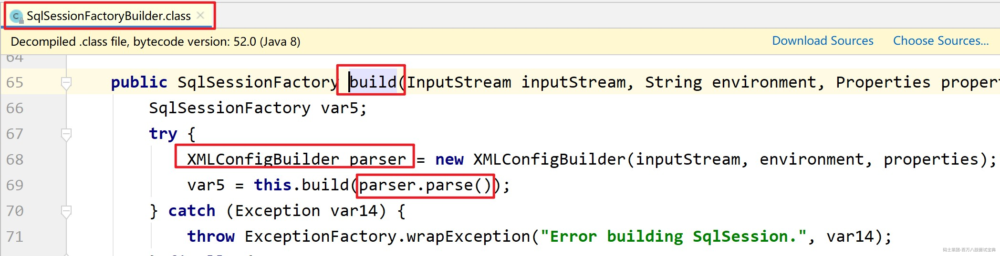

其中 `XMLConfigBuilder`在构建 `Configuration`对象时，也会调用 `XMLMapperBuilder`用于读取 `*.Mapper`文件，而 `XMLMapperBuilder`会使用 `XMLStatementBuilder`来读取和build所有的SQL语句。

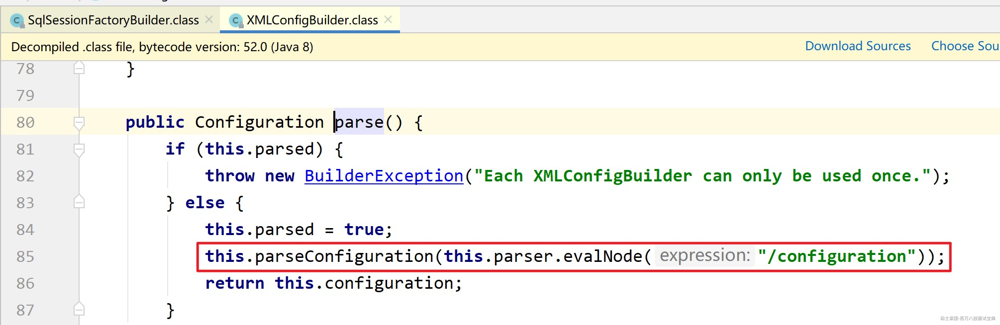

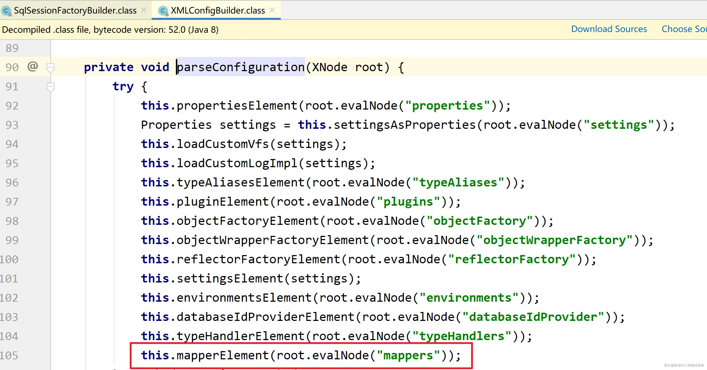

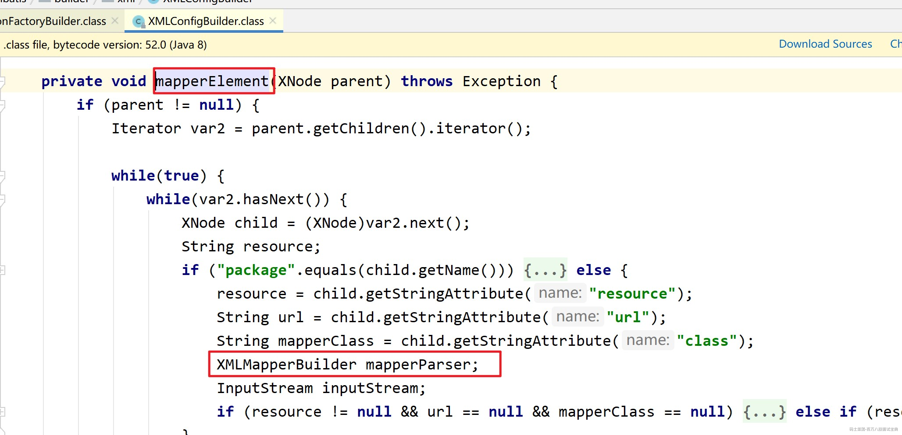

在这个过程中，有一个相似的特点，就是这些Builder会读取文件或者配置，然后做大量的XpathParser解析、配置或语法的解析、反射生成对象、存入结果缓存等步骤，这么多的工作都不是一个构造函数所能包括的，因此大量采用了Builder模式来解决。

对于builder的具体类，方法都大都用 `build*`开头，比如 `SqlSessionFactoryBuilder`为例，它包含以下方法：

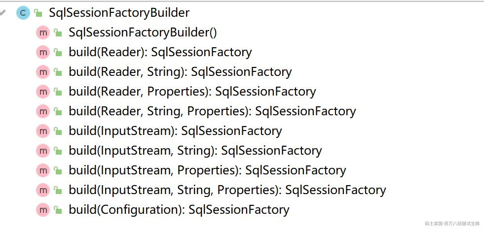

从建造者模式的设计初衷上来看，SqlSessionFactoryBuilder 虽然带有 Builder 后缀，但 不要被它的名字所迷惑，它并不是标准的建造者模式。一方面，原始类 SqlSessionFactory 的构建只需要一个参数，并不复杂。

另一方面，Builder 类SqlSessionFactoryBuilder 仍然定义了多包含不同参数列表的构造函数。 实际上，SqlSessionFactoryBuilder 设计的初衷只不过是为了简化开发。因为构建 SqlSessionFactory 需要先构建 Configuration，而构建 Configuration 是非常复杂的，需 要做很多工作，比如配置的读取、解析、创建 n 多对象等。为了将构建 SqlSessionFactory 的过程隐藏起来，对程序员透明，MyBatis 就设计了 SqlSessionFactoryBuilder 类封装这些构建细节。

### 2.2 工厂模式的应用

在Mybatis中比如 `SqlSessionFactory`使用的是工厂模式，该工厂没有那么复杂的逻辑，是一个简单工厂模式。

简单工厂模式(Simple Factory Pattern)：又称为静态工厂方法(Static Factory Method)模式，它属于类创建型模式。在简单工厂模式中，可以根据参数的不同返回不同类的实例。简单工厂模式专门定义一个类来负责创建其他类的实例，被创建的实例通常都具有共同的父类。

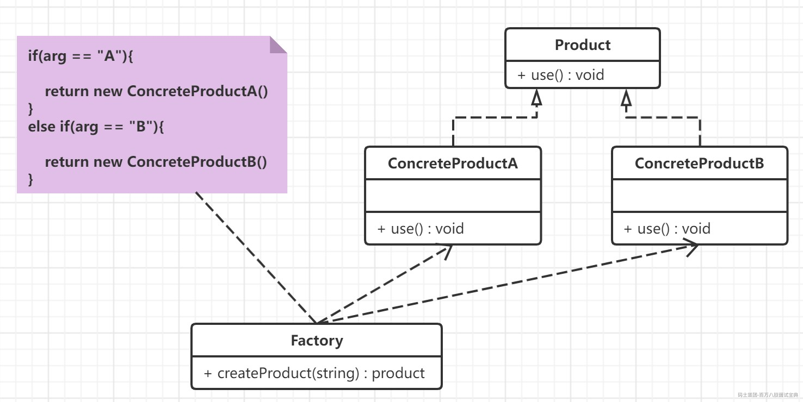

`SqlSession`可以认为是一个Mybatis工作的核心的接口，通过这个接口可以执行执行SQL语句、获取Mappers、管理事务。类似于连接MySQL的 `Connection`对象。

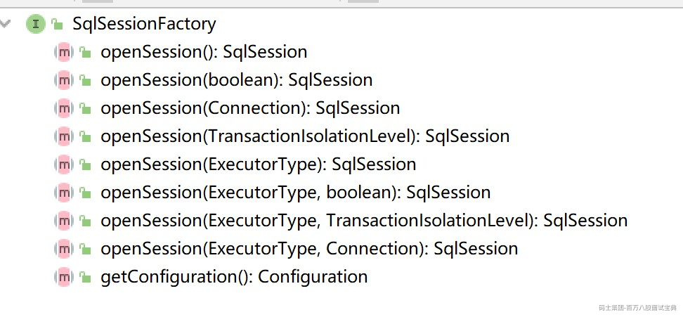

可以看到，该Factory的 `openSession（）`方法重载了很多个，分别支持 `autoCommit`、`Executor`、`Transaction` 等参数的输入，来构建核心的 `SqlSession`对象。

在 `DefaultSqlSessionFactory`的默认工厂实现里，有一个方法可以看出工厂怎么产出一个产品：

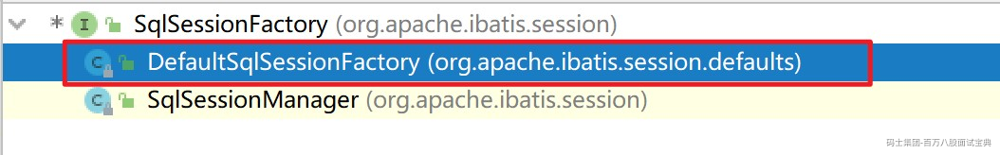

openSessionFromDataSource方法,

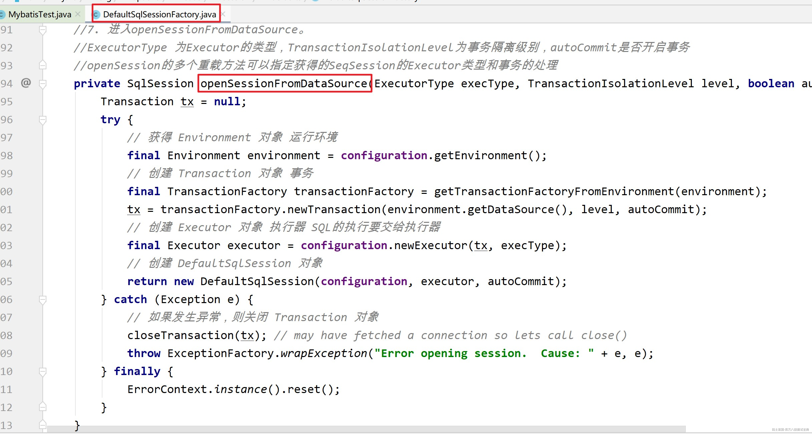

这是一个openSession调用的底层方法，该方法先从configuration读取对应的环境配置，然后初始化 `TransactionFactory`获得一个 `Transaction`对象，然后通过 `Transaction`获取一个 `Executor`对象，最后通过configuration、Executor、是否autoCommit三个参数构建了 `SqlSession`。

### 2.3 代理模式的应用

代理模式可以认为是Mybatis的核心使用的模式，正是由于这个模式，我们只需要编写 `Mapper.java`接口，不需要实现，由Mybatis后台帮我们完成具体SQL的执行。

代理模式(Proxy Pattern) ：给某一个对象提供一个代 理，并由代理对象控制对原对象的引用。代理模式的英 文叫做Proxy，它是一种对象结构型模式。


这里有两个步骤，第一个是提前创建一个Proxy，第二个是使用的时候会自动请求Proxy，然后由Proxy来执行具体事务；

每次当我们调用sqlSession的getMapper方法时，都会创建一个新的动态代理类实例

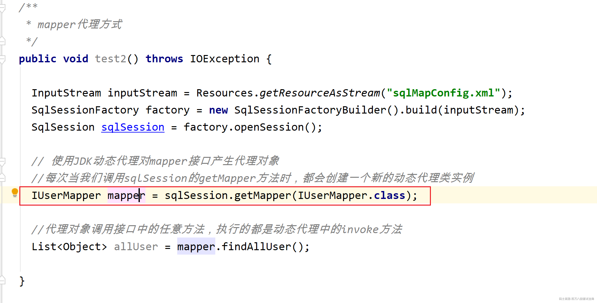

当我们使用 `Configuration`的 `getMapper`方法时，会调用 `mapperRegistry.getMapper`方法，

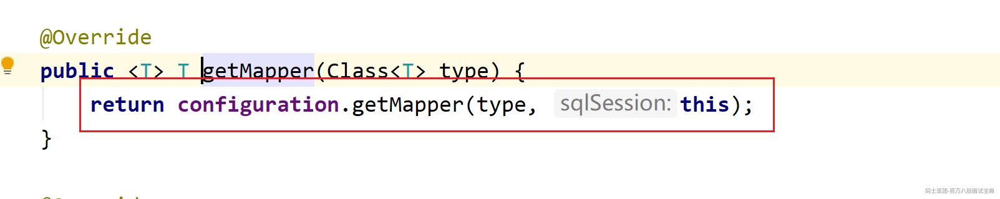

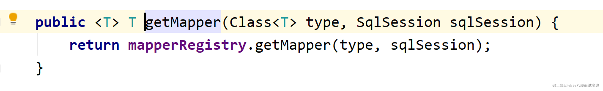

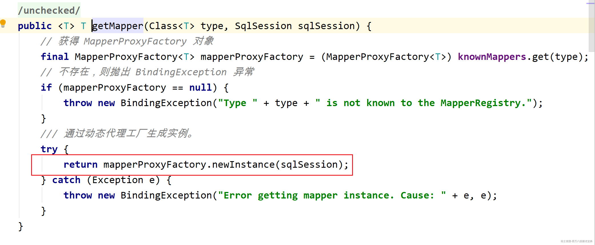

在这里，先通过 `T newInstance(SqlSession sqlSession)`方法会得到一个 `MapperProxy`对象，然后调用 `T newInstance(MapperProxy<T> mapperProxy)`生成代理对象然后返回。

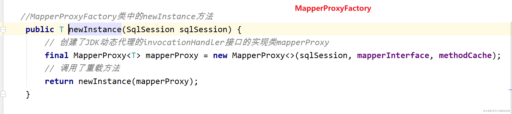

而查看 `MapperProxy`的代码，可以看到如下内容：

非常典型的，该 `MapperProxy`类实现了 `InvocationHandler`接口，并且实现了该接口的 `invoke`方法。

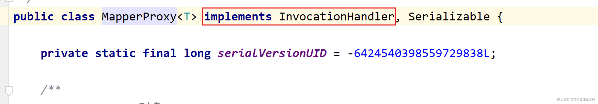

通过这种方式，我们只需要编写 `Mapper.java`接口类，当真正执行一个 `Mapper`接口的时候，就会转发给 `MapperProxy.invoke`方法，而该方法则会调用后续的 `sqlSession.cud>executor.execute>prepareStatement`等一系列方法，完成SQL的执行和返回。

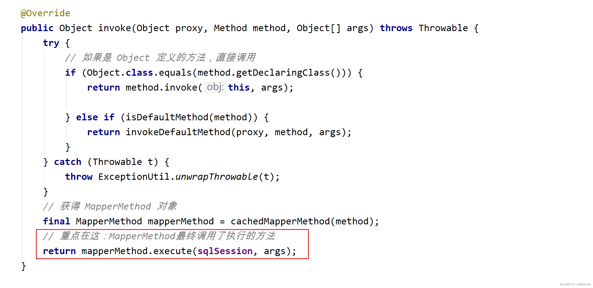

### 2.4 模板方法模式的应用

在Mybatis中，sqlSession的SQL执行，都是委托给Executor实现的，Executor包含以下结构：

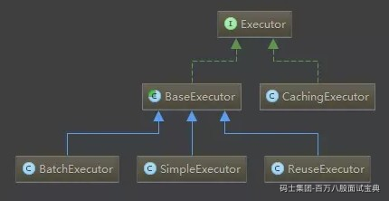

其中的BaseExecutor就采用了模板方法模式，它实现了大部分的SQL执行逻辑，然后把以下几个方法交给子类定制化完成：

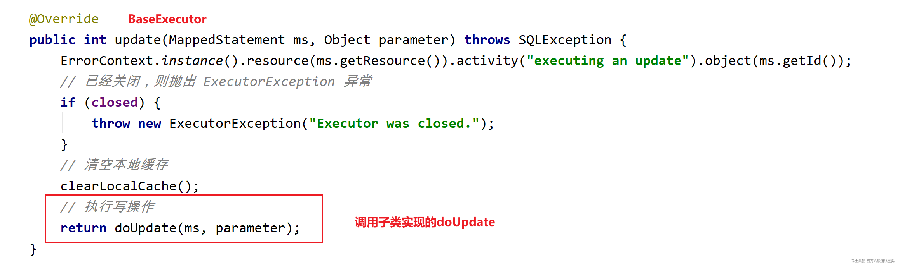

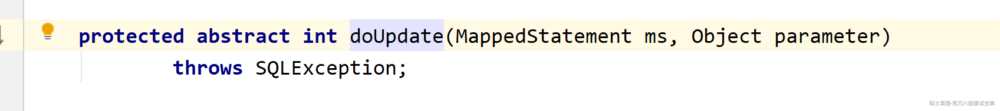

该模板方法类有几个子类的具体实现，使用了不同的策略：

- 简单 `SimpleExecutor`：每执行一次 `update`或 `select`，就开启一个 `Statement`对象，用完立刻关闭 `Statement`对象。（可以是 `Statement`或 `PrepareStatement`对象）

- 重用 `ReuseExecutor`：执行 `update`或 `select`，以sql作为key查找 `Statement`对象，存在就使用，不存在就创建，用完后，不关闭 `Statement`对象，而是放置于 `Map`内，供下一次使用。（可以是 `Statement`或 `PrepareStatement`对象）

- 批量 `BatchExecutor`：执行update（没有select，JDBC批处理不支持select），将所有sql都添加到批处理中（`addBatch()`），等待统一执行（`executeBatch()`），它缓存了多个Statement对象，每个Statement对象都是 `addBatch()`完毕后，等待逐一执行 `executeBatch()`批处理的；`BatchExecutor`相当于维护了多个桶，每个桶里都装了很多属于自己的SQL，就像苹果蓝里装了很多苹果，番茄蓝里装了很多番茄，最后，再统一倒进仓库。（可以是Statement或PrepareStatement对象）

比如在SimpleExecutor中这样实现doUpdate方法：

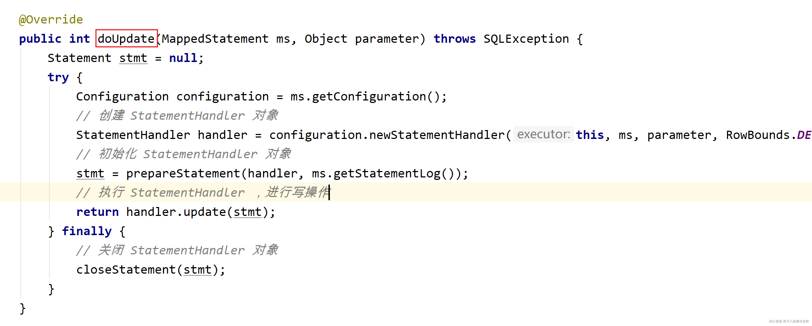

模板模式基于继承来实现代码复用。如果抽象类中包含模板方法，模板方法调用有待子类实 现的抽象方法，那这一般就是模板模式的代码实现。而且，在命名上，模板方法与抽象方法 一般是一一对应的，抽象方法在模板方法前面多一个“do”，比如，在 BaseExecutor 类 中，其中一个模板方法叫 update()，那对应的抽象方法就叫 doUpdate()。

### 2.5 装饰者模式的应用

装饰模式(Decorator Pattern) ：动态地给一个对象增加一些额外的职责(Responsibility)，就增加对象功能来说，装饰模式比生成子类实现更为灵活。

在mybatis中，缓存的功能由根接口 `Cache（org.apache.ibatis.cache.Cache）`定义。整个体系采用装饰器设计模式，数据存储和缓存的基本功能由 `PerpetualCache（org.apache.ibatis.cache.impl.PerpetualCache）`永久缓存实现，然后通过一系列的装饰器来对 `PerpetualCache`永久缓存进行缓存策略等方面的控制。如下图：

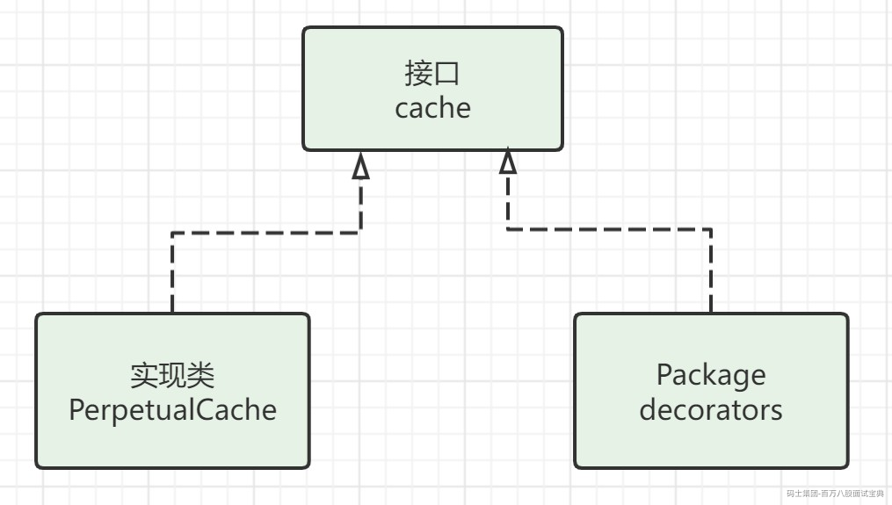

用于装饰PerpetualCache的标准装饰器共有8个（全部在org.apache.ibatis.cache.decorators包中）：

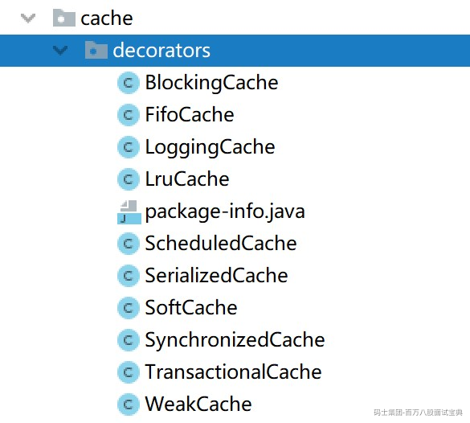

1. `FifoCache`：先进先出算法，缓存回收策略

2. `LoggingCache`：输出缓存命中的日志信息

3. `LruCache`：最近最少使用算法，缓存回收策略

4. `ScheduledCache`：调度缓存，负责定时清空缓存

5. `SerializedCache`：缓存序列化和反序列化存储

6. `SoftCache`：基于软引用实现的缓存管理策略

7. `SynchronizedCache`：同步的缓存装饰器，用于防止多线程并发访问

8. `WeakCache`：基于弱引用实现的缓存管理策略

之所以 MyBatis 采用装饰器模式来实现缓存功能，是因为装饰器模式采用了组合，而非继 承，更加灵活，能够有效地避免继承关系的组合爆炸。

### 2.6 迭代器模式的应用

**迭代器模式介绍**

- 迭代器模式是我们学习一个设计时很少用到的、但编码实现时却经常使用到的行为型设计模式。在绝大多数编程语言中，迭代器已经成为一个基础的类库，直接用来遍历集合对象。在平时开发中，我们更多的是直接使用它，很少会从零去实现一个迭代器。

- 在软件系统中,容器对象拥有两个职责: **一是存储数据,二是遍历数据**.从依赖性上看,前者是聚合对象的基本职责.而后者是可变化的,又是可分离的.因此可以将遍历数据的行为从容器中抽取出来,封装到迭代器对象中,由迭代器来提供遍历数据的行为,这将简化聚合对象的设计,更加符合单一职责原则.

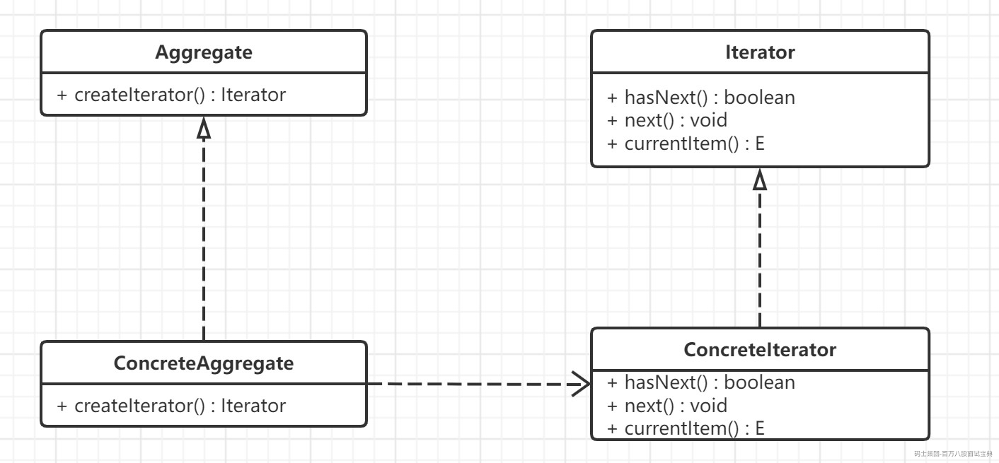

迭代器模式主要包含以下角色：

- 抽象集合（Aggregate）角色：用于存储和管理元素对象, 定义存储、添加、删除集合元素的功能,并且声明了一个createIterator()方法用于创建迭代器对象。

- 具体集合（ConcreteAggregate）角色：实现抽象集合类，返回一个具体迭代器的实例。

- 抽象迭代器（Iterator）角色：定义访问和遍历聚合元素的接口，通常包含 hasNext()、next() 等方法。

- hasNext()函数用于判断集合中是否还有下一个元素

- next() 函数用于将游标后移一位元素

- currentItem() 函数,用来返回当前游标指向的元素

- 具体迭代器（Concretelterator）角色：实现抽象迭代器接口中所定义的方法，完成对集合对象的遍历，同时记录遍历的当前位置。

Java的 `Iterator`就是迭代器模式的接口，只要实现了该接口，就相当于应用了迭代器模式：

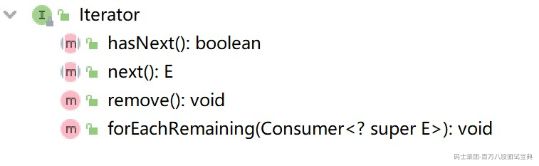

**迭代器模式总结**

**使用场景**

1. 访问一个聚合对象的内容，不需要暴露它的内部表示。

2. 支持对聚合对象的多种遍历。

3. 迭代器模式与集合同时存在。

**优点**

1. 支持以不同的方式遍历一个聚合对象，在同一个聚合对象上可以定义多种遍历方式。

2. 迭代器简化了聚合类。引入迭代器模式，原有的聚合对象中不需要再自行提供数据遍历访问的方法。

3. 可以为不同的聚合结构提供一个统一的接口。

**缺点**

1. 迭代器模式将存储数据和遍历数据的职责分离开，增加新的聚合类型需要增加对应的新的迭代器类，增加了系统复杂性。

Mybatis的 `PropertyTokenizer`是property包中的重量级类，该类会被reflection包中其他的类频繁的引用到。这个类实现了 `Iterator`接口，在使用时经常被用到的是 `Iterator`接口中的 `hasNext`这个函数。

```plain

/**
 * 属性分词器
 *
 * @author Clinton Begin
 */
public class PropertyTokenizer implements Iterator<PropertyTokenizer> {

    /**
     * 当前字符串
     */
    private String name;
    /**
     * 索引的 {@link #name} ，因为 {@link #name} 如果存在 {@link #index} 会被更改
     */
    private final String indexedName;
    /**
     * 编号。
     *
     * 对于数组 name[0] ，则 index = 0
     * 对于 Map map[key] ，则 index = key
     */
    private String index;
    /**
     * 剩余字符串
     */
    private final String children;

    public PropertyTokenizer(String fullname) {
        // 初始化 name、children 字符串，使用 . 作为分隔
        int delim = fullname.indexOf('.');
        if (delim > -1) {
            name = fullname.substring(0, delim);
            children = fullname.substring(delim + 1);
        } else {
            name = fullname;
            children = null;
        }
        // 记录当前 name
        indexedName = name;
        // 若存在 [ ，则获得 index ，并修改 name 。
        delim = name.indexOf('[');
        if (delim > -1) {
            index = name.substring(delim + 1, name.length() - 1);
            name = name.substring(0, delim);
        }
    }

    public String getName() {
        return name;
    }

    public String getIndex() {
        return index;
    }

    public String getIndexedName() {
        return indexedName;
    }

    public String getChildren() {
        return children;
    }

    @Override
    public boolean hasNext() {
        return children != null;
    }

    @Override
    public PropertyTokenizer next() {
        return new PropertyTokenizer(children);
    }

    @Override
    public void remove() {
        throw new UnsupportedOperationException("Remove is not supported, as it has no meaning in the context of properties.");
    }

}
```

可以看到，这个类传入一个字符串到构造函数，然后提供了iterator方法对解析后的子串进行遍历，是一个很常用的方法类。

实际上，PropertyTokenizer 类也并非标准的迭代器类。它将配置的解析、解析之后的元 素、迭代器，这三部分本该放到三个类中的代码，都耦合在一个类中，所以看起来稍微有点 难懂。不过，这样做的好处是能够做到惰性解析。我们不需要事先将整个配置，解析成多个 PropertyTokenizer 对象。只有当我们在调用 next() 函数的时候，才会解析其中部分配 置。

### 2.7 组合模式的应用

组合模式(Composite Pattern) 的定义是：将对象组合成树形结构以表示整个部分的层次结构.组合模式可以让用户统一对待单个对象和对象的组合.

比如: windows操作系统中的目录结构,其实就是树形目录结构,通过tree命令实现树形结构展示.

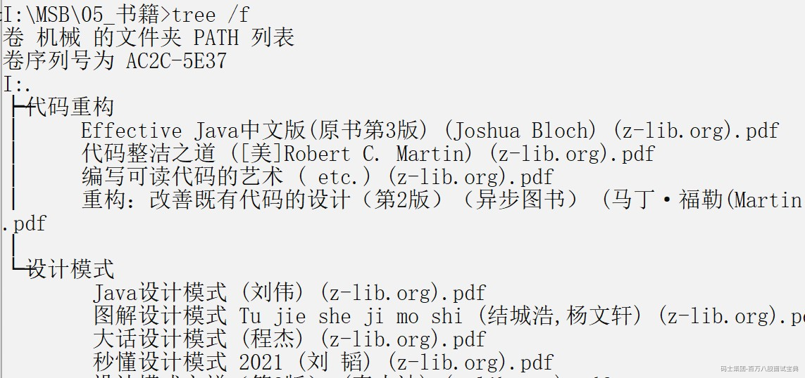

在上图中包含了**文件夹和文件**两类不同元素,其中在文件夹中可以包含文件,还可以继续包含子文件夹.子文件夹中可以放入文件,也可以放入子文件夹. 文件夹形成了一种容器结构(树形结构),递归结构.

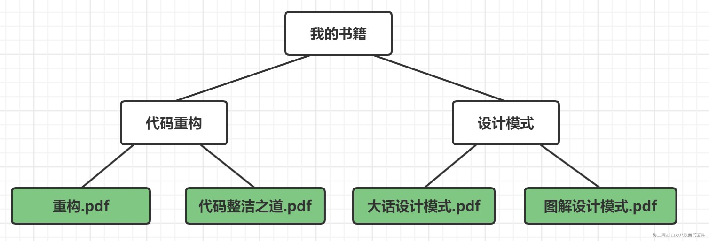

接着我们再来思考虽然文件夹和文件是不同类型的对象,但是他们有一个共性,就是 **都可以被放入文件夹中**. 其实文件和文件夹可以被当做是同一种对象看待.

**组合模式其实就是将一组对象(文件夹和文件)组织成树形结构,以表示一种'部分-整体' 的层次结构,(目录与子目录的嵌套结构). 组合模式让客户端可以统一单个对象(文件)和组合对象(文件夹)的处理逻辑(递归遍历).**

组合模式更像是一种数据结构和算法的抽象,其中数据可以表示成树这种数据结构,业务需求可以通过在树上的递归遍历算法来实现.

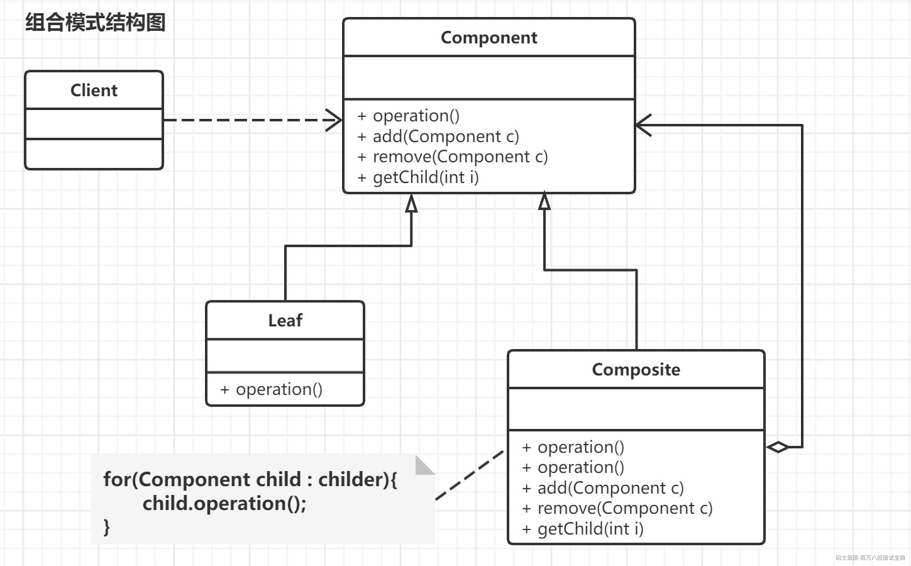

组合模式主要包含三种角色：

- 抽象根节点（Component）：定义系统各层次对象的共有方法和属性，可以预先定义一些默认行为和属性。

> 在该角色中可以包含所有子类共有行为的声明和实现.在抽象根节点中定义了访问及管理它的子构件的方法,如增加子节点、删除子节点、获取子节点等.

- 树枝节点（Composite）：定义树枝节点的行为，存储子节点，组合树枝节点和叶子节点形成一个树形结构。

> 树枝节点可以包含树枝节点,也可以包含叶子节点,它其中有一个集合可以用于存储子节点,实现了在抽象根节点中定义的行为.包括那些访问及管理子构件的方法,在其业务方法中可以递归调用其子节点的业务方法.

- 叶子节点（Leaf）：叶子节点对象，其下再无分支，是系统层次遍历的最小单位。

> 在组合结构中叶子节点没有子节点,它实现了在抽象根节点中定义的行为.

下面我们通过一段程序来演示一下组合模式的使用. 程序的功能是列出某一目录下所有的文件和文件夹.类图如下:

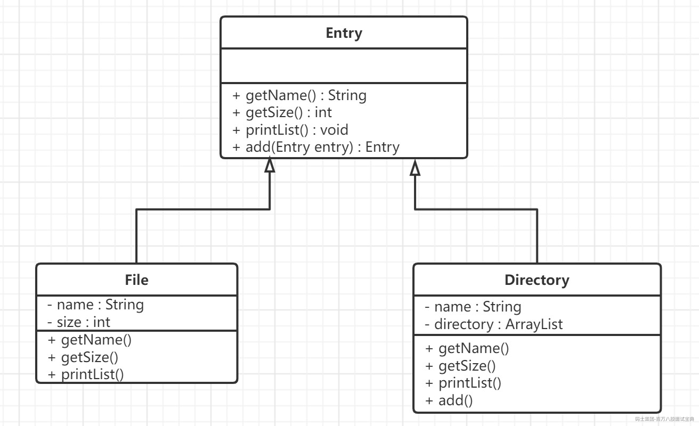

我们按照下图的表示,进行文件和文件夹的构建.

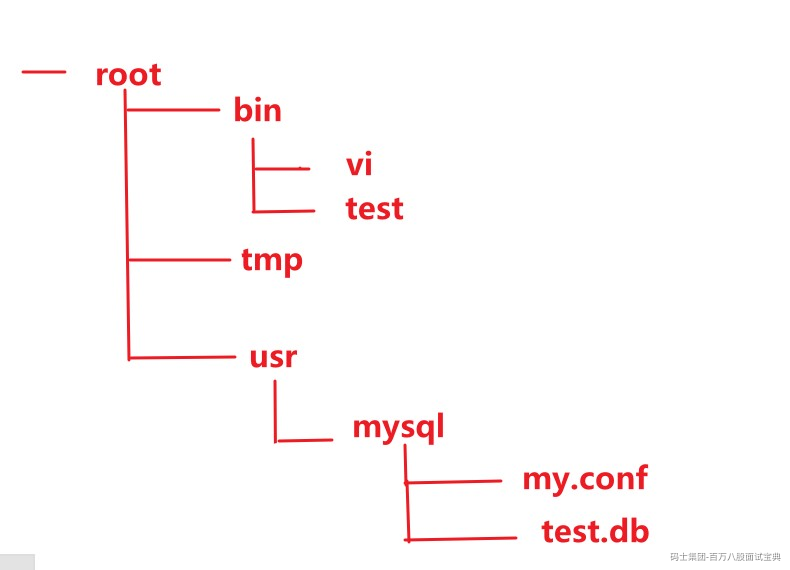

Entry类: 抽象类,用来定义File类和Directory类的共性内容

```plain

/**
 * Entry抽象类,表示目录条目(文件+文件夹)的抽象类
 * @author spikeCong
 * @date 2022/10/6
 **/
public abstract class Entry {

    public abstract String getName(); //获取文件名

    public abstract int getSize(); //获取文件大小

    //添加文件夹或文件
    public abstract Entry add(Entry entry);

    //显示指定目录下的所有信息
    public abstract void printList(String prefix);

    @Override
    public String toString() {
        return getName() + "(" +getSize() + ")";
    }
}
```

File类,叶子节点,表示文件.

```plain

/**
 * File类 表示文件
 * @author spikeCong
 * @date 2022/10/6
 **/
public class File extends Entry {

    private String name; //文件名
    private int size; //文件大小

    public File(String name, int size) {
        this.name = name;
        this.size = size;
    }

    @Override
    public String getName() {
        return name;
    }

    @Override
    public int getSize() {
        return size;
    }

    @Override
    public Entry add(Entry entry) {
        return null;
    }

    @Override
    public void printList(String prefix) {

        System.out.println(prefix + "/" + this);
    }

}
```

Directory类,树枝节点,表示文件

```plain

/**
 * Directory表示文件夹
 * @author spikeCong
 * @date 2022/10/6
 **/
public class Directory extends Entry{

    //文件的名字
    private String name;

    //文件夹与文件的集合
    private ArrayList<Entry> directory = new ArrayList();

    //构造函数
    public Directory(String name) {
        this.name = name;
    }

    //获取文件名称
    @Override
    public String getName() {
        return this.name;
    }

    /**
     * 获取文件大小
     *      1.如果entry对象是File类型,则调用getSize方法获取文件大小
     *      2.如果entry对象是Directory类型,会继续调用子文件夹的getSize方法,形成递归调用.
     */
    @Override
    public int getSize() {
        int size = 0;

        //遍历或者去文件大小
        for (Entry entry : directory) {
            size += entry.getSize();
        }
        return size;
    }

    @Override
    public Entry add(Entry entry) {
        directory.add(entry);
        return this;
    }

    //显示目录
    @Override
    public void printList(String prefix) {
        System.out.println("/" + this);
        for (Entry entry : directory) {
            entry.printList("/" + name);
        }
    }
}
```

测试

```plain

public class Client {

    public static void main(String[] args) {

        //根节点
        Directory rootDir = new Directory("root");

        //树枝节点
        Directory binDir = new Directory("bin");
        //向bin目录中添加叶子节点
        binDir.add(new File("vi",10000));
        binDir.add(new File("test",20000));

        Directory tmpDir = new Directory("tmp");

        Directory usrDir = new Directory("usr");
        Directory mysqlDir = new Directory("mysql");
        mysqlDir.add(new File("my.cnf",30));
        mysqlDir.add(new File("test.db",25000));
        usrDir.add(mysqlDir);

        rootDir.add(binDir);
        rootDir.add(tmpDir);
        rootDir.add(mysqlDir);

        rootDir.printList("");
    }
}
```

**1 ) 组合模式优点**

- 组合模式可以清楚地定义分层次的复杂对象，表示对象的全部或部分层次，它让客户端忽略了层次的差异，方便对整个层次结构进行控制。

- **在组合模式中增加新的树枝节点和叶子节点都很方便**，无须对现有类库进行任何修改，符合“开闭原则”。

- **组合模式为树形结构的面向对象实现提供了一种灵活的解决方案**，通过叶子节点和树枝节点的递归组合，可以形成复杂的树形结构，但对树形结构的控制却非常简单。

**2) 组合模式的缺点**

- 使用组合模式的前提在于，你的**业务场景必须能够表示成树形结构**。所以，组合模式的应用场景也 比较局限，它并不是一种很常用的设计模式。

**3 ) 组合模式使用场景分析**

- 处理一个树形结构，比如，公司人员组织架构、订单信息等；

- 跨越多个层次结构聚合数据，比如，统计文件夹下文件总数；

- 统一处理一个结构中的多个对象，比如，遍历文件夹下所有 XML 类型文件内容。

**MyBatis中的应用**

Mybatis支持动态SQL的强大功能，比如下面的这个SQL：

```plain

<update id="update" parameterType="org.format.dynamicproxy.mybatis.bean.User">
    UPDATE users
    <trim prefix="SET" prefixOverrides=",">
        <if test="name != null and name != ''">
            name = #{name}
        </if>

        <if test="age != null and age != ''">
            , age = #{age}
        </if>

        <if test="birthday != null and birthday != ''">
            , birthday = #{birthday}
        </if>

    </trim>

    where id = ${id}
</update>

```

在这里面使用到了trim、if等动态元素，可以根据条件来生成不同情况下的SQL；

在 `DynamicSqlSource.getBoundSql`方法里，调用了 `rootSqlNode.apply(context)`方法，`apply`方法是所有的动态节点都实现的接口：

```plain

/**
 * SQL Node 接口，每个 XML Node 会解析成对应的 SQL Node 对象
 * @author Clinton Begin
 */
public interface SqlNode {

    /**
     * 应用当前 SQL Node 节点
     *
     * @param context 上下文
     * @return 当前 SQL Node 节点是否应用成功。
     */
    boolean apply(DynamicContext context);
}
```

对于实现该 `SqlSource`接口的所有节点，就是整个组合模式树的各个节点：

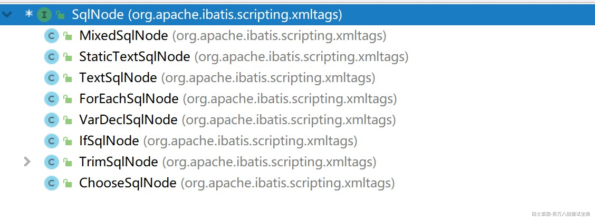

组合模式的简单之处在于，所有的子节点都是同一类节点，可以递归的向下执行，比如对于TextSqlNode，因为它是最底层的叶子节点，所以直接将对应的内容append到SQL语句中：

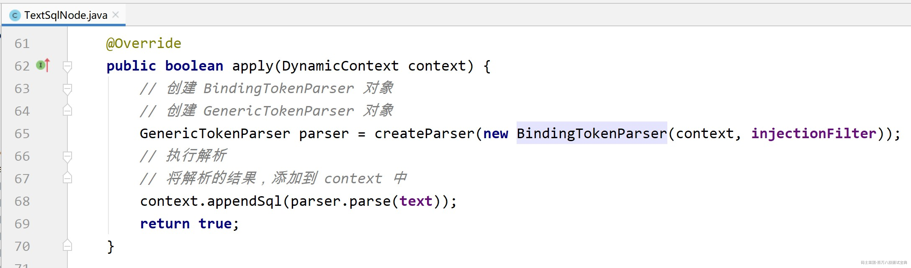

但是对于IfSqlNode，就需要先做判断，如果判断通过，仍然会调用子元素的SqlNode，即 `contents.apply`方法，实现递归的解析。

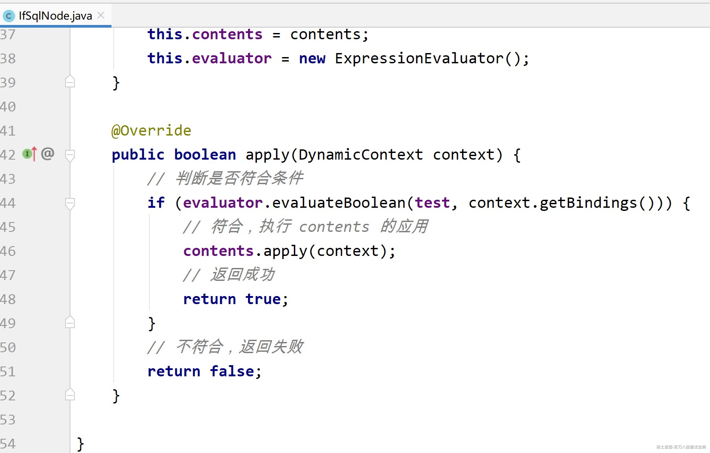

## 3. 总结

上面给大家讲解的就是Spring和MyBatis框架中所使用到的设计模式. 要再次强调的是, 对于同学们来说不需要去记忆哪个类用到了哪个模式, 死记硬背是没有意义的,同学们最好是下载一些优秀框架的源码,比如Spring或者MyBatis,然后抽出时间好好的阅读一下源码,锻炼自己阅读理解源码的能力.

除此之外同学们应该也有发现,其实框架对很多设计模式的实 现，都并非标准的代码实现，都做了比较多的自我改进。实际上，这就是所谓的灵活应用, 只借鉴不照搬, 根据具体问题针对性地去解决。
