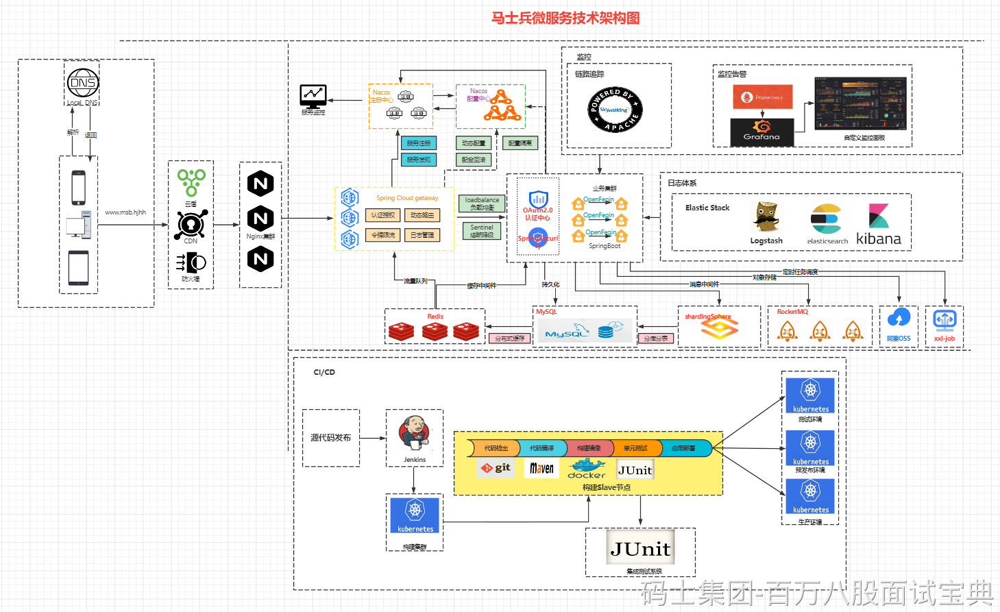
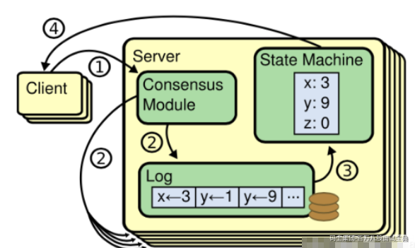
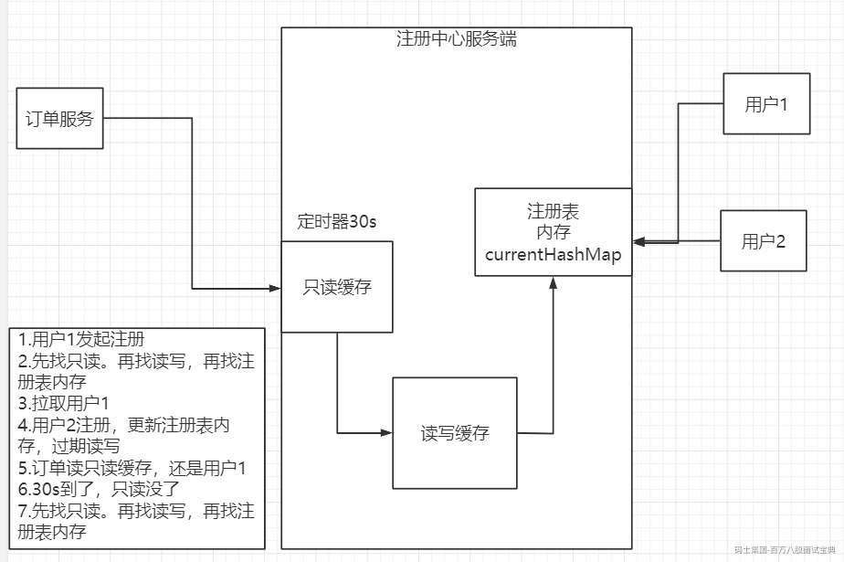
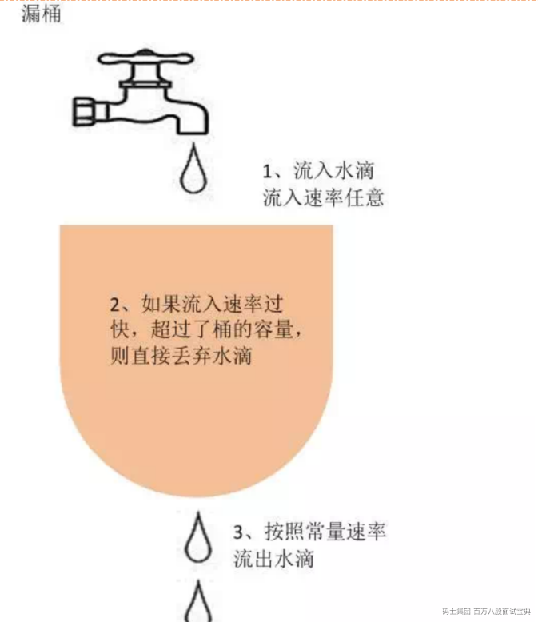
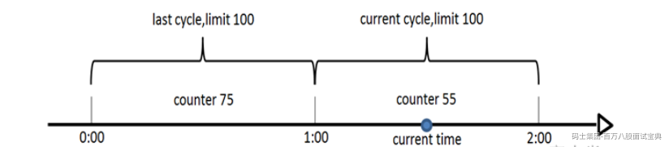
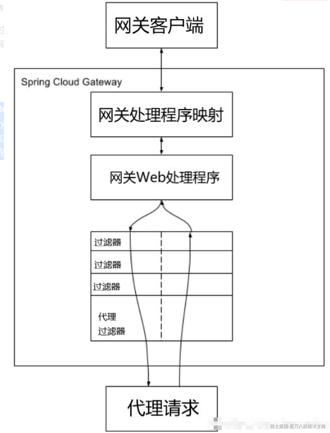
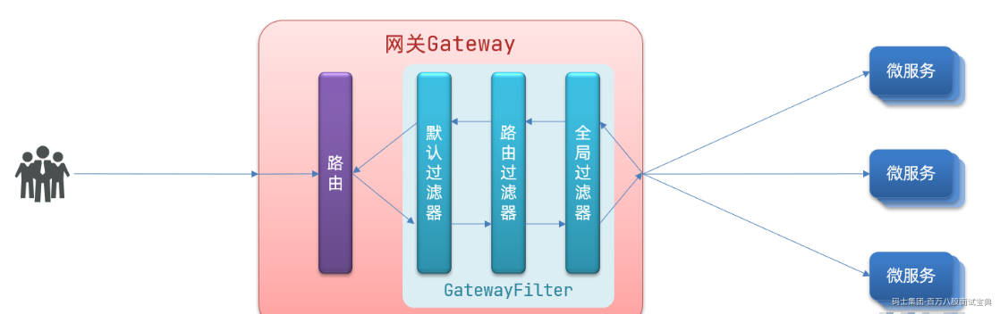
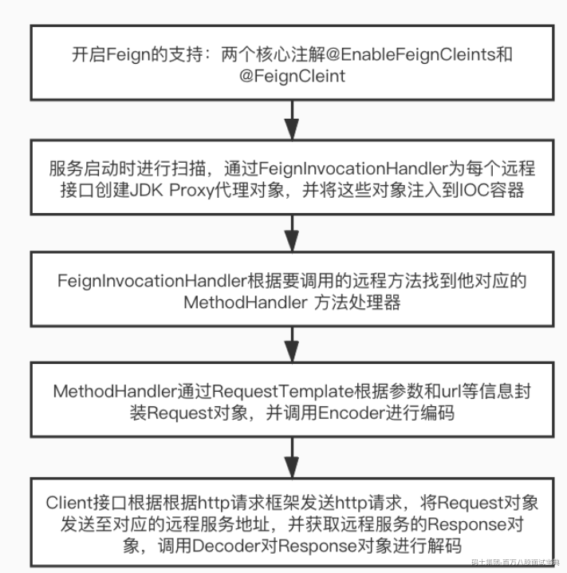

# 微服务架构组件

<!-- readability-enhancement:start -->
> [!abstract] 速读地图
> 这篇按微服务组件职责来背：注册发现、配置治理、限流熔断、网关和链路追踪。
>
> **本篇关键词：** 微服务 ・ Spring Cloud ・ Nacos ・ Eureka ・ 限流 ・ 熔断/降级 ・ API网关
>
> **优先扫这些问题：**
> - Spring Cloud 中有哪些组件，整个项目架构中我们的重点又有哪些？
> - 注册中心技术选型的要素有哪些
> - Nacos的Raft一致性算法
> - Log Replication 日志复制问题
> - 4.Eureka注册表多级缓存架构有了解过吗？
> - 在微服务中有几种限流方式
> - 熔断与降级的区别
> - 断路器的隔离方式（线程池隔离以及信号量隔离）有什么区别

> [!success] 面试背诵小结
> - 回答时用「定义 -> 原理 -> 场景 -> 坑点」四段式，能显得更稳。
> - 二刷时先看上面的关键词，再回到正文找例子和代码。
> - 真被追问时，优先把相似概念做对比，而不是继续堆定义。

> [!warning] 易混提醒
> 易混：限流是挡流量，熔断是保护下游，降级是提供备用结果，三者目标不同。
<!-- readability-enhancement:end -->

---

## 1.Spring Cloud 中有哪些组件，整个项目架构中我们的重点又有哪些？

Spring Cloud 是一套基于Spring Boot的微服务解决方案。

Spring Cloud生态在国内主流的分为两套，一套是以奈飞开源的Spring Cloud Netfilx 20%，一套是阿里巴巴开源的Spring Cloud Alibaba 40%，在国外其实Azure以及Amzong同时也有一些单独的组件特别火，比如Spring Cloud Getaway以及Spring Cloud Consul等等

**5大核心组件**

注册中心 zk eureka nacos consul 服务治理 架构特性

配置中心 nacos config disconf

网关 Spring Cloud getaway zuul2 zuul

负载均衡 Ribbon loadbalance

声明式远程调用 OpenFegin

**3大核心配件**

断路器 sentinel 信号量隔离（滑动时间窗口的方式） hystrix 线程池隔离

日志监控 Elastic Stack（Beats） Promethus+ grafan

链路追踪 skywalking CAT pingpoint zipkin

**3大常见分布式解决方案**

分布式事务 tx-lcn seate 分布式锁 redis zk

**2大中间件**

Redis MQ

**2大性能优化方案**

JVM性能优化 MySQL性能优化

## 2.注册中心技术选型的要素有哪些

### **组件的服务治理特性**

8大服务治理功能

服务注册

服务续约

服务获取

服务调用

服务下线

失效剔除

自我保护

服务同步

### **架构特性**

**CAP定理**

定义：CAP原则又称CAP定理，指的是在一个分布式系统中， 一致性（Consistency）、可用性（Availability）、 分区容错性（Partition tolerance）。CAP 原则指的是，这三个要素最多只能同时实现两点，不可能三者兼顾

**分区容错性**  
分区指的是由于网络或者一些不可控因素导致集群中某些节点不连通的情况，而分区容错性指的是当我们的分布式系统出现了分区的情况时，还能够对外提供正常的服务，叫做分区容错性

在目前看来，分区容错性在一个分布式系统中基本上是必备

在一个分布式系统中，由于分区容错性是一定要存在的，那么我们就需要在可用性和一致性上做相关的取舍，下面我们来分析为什么C与A两种状态不能同时存在

**CP模式**  
现在我们的Nacos集群中存在三个节点，一个主节点，两个从节点，当主节点与一个从节点出现了分区后，如果我们的前提是需要保证整个系统的一致性，也就是需要保证Consistency这个状态存在

整个集群会发起主节点的重新选举，选举完成后同步所有的数据来保持数据的一致性，那么在选主的过程中，一定会导致一段时间的不可用，当然这个时间会极短，从而不能保证完全可用性

**AP模式**  
在AP模式下我们的集群没有主从的概念，所有的节点都是平等的，并且每个节点间的数据都互通

如果两个节点中间发生了分区情况，两个节点不再连通，但是我们的系统又必须保证整体的可用性，所以节点间会出现一段时间的数据不一致，直到分区恢复

## 3.Nacos的Raft一致性算法

### Raft算法

在学术界中分布式一致性算法的基石还是Paxos为代表，Paxos算法是Lamport宗师提出的一种基于消息传递的分布式一致性算法，使其获得2013年图灵奖。

由于Paxos难以理解，而且很难落地到工程实践，所以Paxos在工程中运用的并不多

取而代之的是易理解易实现的Raft算法，号称几乎等同于Paxos，但是性能肯定不及Paxos

分布式一致性算法也称为共识算法，是指在大型分布式系统中，在遇到请求时，各个节点的数据能够保持一致，并且在遇到部分机器宕机时，也能保证整体服务的数据一致性

学习Raft算法最好的方式则是阅读论文：<https://raft.github.io/raft.pdf>  
关于Raft协议步骤动画：<http://thesecretlivesofdata.com/raft/>

这里我们了解Raft算法中核心逻辑，Raft算法中其实大致分为三个子问题  
Leader Election 、Log Replication、Safety，对应的也就是选主，日志复制，安全性（通过安全性原则来处理一些特殊 case，保证 Raft 算法的完备性）

**Raft的核心流程归纳：**

首先选出 leader，leader 节点负责接收外部的数据更新/删除请求  
然后日志复制到其他 follower节点，同时通过安全性的准则来保证整个日志复制的一致性  
如果遇到 leader 故障，followers 会重新发起选举出新的 leader  
Raft节点有三种状态：

Leader（领导者）  
Follower（跟随者）  
Candidate（候选人）  
Leader Election 领导选举  
所有节点一开始都是follower状态，一定时间未收到leader的心跳，则进入candidate（候选人）状态，参与选举.选出leader后，leader通过向follower发送心跳来表明存活状态，若leader故障，则整体退回到重新选举状态  
每次选举完成后，会产生一个term，term本身是递增的，充当了逻辑时钟的作用  
具体的选举过程：领导者与跟随者建立心跳（心跳时间随机，为了避免大多数跟随者在同一时间进行选举）并等待，若超时未等到，准备选举 ----> current term ++，转变为candidate（候选人）状态 ----> 给自己投票，然后给其他节点发送投票请求 ----> 等待选举结果

**具体投票过程有三个约束：**

在同一任期内，单个节点最多只能投一票  
候选人知道的信息不能比自己的少(Log与term)  
first-come-first-served 先来先得

**选举结果有三种情况：**

收到大部分（超过半数）的投票（含自己的一票），则赢得选举，成为leader  
被告知别人已当选，那么自行切换到follower  
一段时间内没有收到超过半数以上的投票，则保持candidate状态，重新发出选举。（ps:如果是遇到平票现象，则会增加系统不可用时间，因此，raft中引入了randomized election timeouts，尽量避免出现平票现象的产生）一旦选举完毕，leader节点会给所有其他节点发消息，避免其他节点触发新的选举

## Log Replication 日志复制问题

### Replicated state machine 复制状态机

分布式服务中，为了保证流量不会压垮服务器，会将一个server复制成很多副本同时提供相同的服务。多副本服务就会出现副本的一致性问题，比如client1将replica1的X值设置为1，而client2将replica2的X值设置为2，这样如果另一个客户client3从不同的副本获取到的X值可能是1也可能是2，这就导致了副本的一致性问题。

复制状态机就是用来解决副本的一致性问题的，每个副本都是状态机的实现，而且是确定状态机(Deterministic finite-state machine)。使用状态机来实现每个服务器的副本就保证了对相同的输入，每个副本都会产生一致的输出。并且，将每个客户端的请求汇总成一个序列，每个副本都按照这个序列来执行，这就解决了副本的不一致问题。

复制状态机（Replicated State Machine）是指多台机器具有完全相同的状态，运行完全相同的确定性状态机。它让多台机器协同工作犹如一个强化的组合，其中少数机器宕机不影响整体的可用性。复制状态机是实现容错的基本方法，被广泛应用于数据复制和高可用等场景，一直是工业界和学术界的关注热点。越来越多的系统采用复制状态机来实现高可用，如ZooKeeper、ETCD、MySQL Group Replication、TiDB等，各种复制协议和系统架构的研究也层出不穷。如何抽象一个复制状态机系统的架构，使之更加通用和易用呢？本文从复制状态机模型出发，结合一些业界的前沿研究，总结复制状态机系统的架构抽象，在系统架构设计时具有一定参考意义。

复制状态机一般通过复制日志来实现，简单地描述一下：leader将写请求封装成一个个的 `log entry`，然后将这些 `entries`复制到 `follower`（从节点），所有 `follower`都按照这个这个顺序执行其中的 `command`（指令），那么所有 `server`的状态一定是一致的。这就是 `raft`的做法

**复制过程**  
1.客户端的请求包含了被复制状态机执行的指令，并转发给leader，

2.leader把指令作为新的日志，并发送给其他server，让他们复制。

3.假如日志被安全的复制（收到超过majority的ack），leader会将日志添加到状态机中，并返回给客户端，

4.如果follower丢失，leader会不断重试，直到全部follower都最终存储了所有日志条目

当然，以上都是理想情况，如果出现崩溃、网络中断等情况，则可能出现日志不正常的现象，则需要考虑数据一致性和安全性问题

## **4.Eureka注册表多级缓存架构有了解过吗？**

## 5.在微服务中有几种限流方式

### 令牌桶

令牌桶算法是网络流量整形（Traffic Shaping）和速率限制（Rate Limiting）中最常使用的一种算法。典型情况下，令牌桶算法用来控制发送到网络上的数据的数目，并允许突发数据的发送。

令牌桶是一个存放固定容量令牌（token）的桶，按照固定速率往桶里添加令牌; 令牌桶算法实际上由三部分组成：两个流和一个桶，分别是令牌流、数据流和令牌桶

**令牌流与令牌桶**

系统会以一定的速度生成令牌，并将其放置到令牌桶中，可以将令牌桶想象成一个缓冲区（可以用队列这种数据结构来实现），当缓冲区填满的时候，新生成的令牌会被扔掉。这里有两个变量很重要：

第一个是生成令牌的速度，一般称为 rate 。比如，我们设定 rate = 2 ，即每秒钟生成 2 个令牌，也就是每 1/2 秒生成一个令牌；

第二个是令牌桶的大小，一般称为 burst 。比如，我们设定 burst = 10 ，即令牌桶最大只能容纳 10 个令牌。

**数据流**

数据流是真正的进入系统的流量，对于http接口来说，如果平均每秒钟会调用2次，则认为速率为 2次/s。

### **漏桶**

漏桶算法思路是，不断的往桶里面注水，无论注水的速度是大还是小，水都是按固定的速率往外漏水；如果桶满了，水会溢出；

桶本身具有一个恒定的速率往下漏水，而上方时快时慢的会有水进入桶内。当桶还未满时，上方的水可以加入。一旦水满，上方的水就无法加入。桶满正是算法中的一个关键的触发条件（即流量异常判断成立的条件）。而此条件下如何处理上方流下来的水，有两种方式

在桶满水之后，常见的两种处理方式为：

1）暂时拦截住上方水的向下流动，等待桶中的一部分水漏走后，再放行上方水。

2）溢出的上方水直接抛弃。

**特点**

漏水的速率是固定的

即使存在注水burst（突然注水量变大）的情况，漏水的速率也是固定的

### 计数器

这个最简单，比如用Redis做计数器

计数器算法是使用计数器在周期内累加访问次数，当达到设定的限流值时，触发限流策略。下一个周期开始时，进行清零，重新计数。此算法在单机还是分布式环境下实现都非常简单，使用redis的incr原子自增性和线程安全即可轻松实现。

### 滑动窗口

滑动窗口协议是传输层进行流控的一种措施，接收方通过通告发送方自己的窗口大小，从而控制发送方的发送速度，从而达到防止发送方发送速度过快而导致自己被淹没的目的。

简单解释下，发送和接受方都会维护一个数据帧的序列，这个序列被称作窗口。发送方的窗口大小由接受方确定，目的在于控制发送速度，以免接受方的缓存不够大，而导致溢出，同时控制流量也可以避免网络拥塞。下面图中的4,5,6号数据帧已经被发送出去，但是未收到关联的ACK，7,8,9帧则是等待发送。可以看出发送端的窗口大小为6，这是由接受端告知的。此时如果发送端收到4号ACK，则窗口的左边缘向右收缩，窗口的右边缘则向右扩展，此时窗口就向前“滑动了”，即数据帧10也可以被发送。

**参考如下网址提供的动态效果**

<https://media.pearsoncmg.com/aw/ecs_kurose_compnetwork_7/cw/content/interactiveanimations/selective-repeat-protocol/index.html>

## 6.熔断与降级的区别

在分布式系统中，限流和熔断是处理并发的两大利器。关于限流和熔断，需要记住一句话，客户端熔断，服务端限流。

发现为什么是限流和熔断？而不是限流和降级？所以下面我特地讲一讲他们的区别。

**相似处：**  
**1.目的一致**

都是为了系统的稳定性，防止因为个别微服务的不可用而拖死整个系统服务；

**2.表现类似**

在表现上都是让用户感知，该服务暂时不可用请稍后再试；

**3.粒度一致**

粒度上，都是服务级别的粒度，某些情况下，也有更细的粒度，如数据的持久层，只允许查询，不允许增删改。

**主要区别：**  
**1.触发条件不同**

服务熔断一般是某个服务挂掉了引起的，一般是下游服务，而服务降级一般是从整体的负荷考虑，主动降级；

**2.管理目标的层次不同**

熔断其实是一个框架级的处理，每个微服务都需要，没有层次之分，而降级一般需要对业务有层级之分，一般是从最外围服务开始。

## 7.断路器的隔离方式（线程池隔离以及信号量隔离）有什么区别

在断路器中，介绍两种处理高并发的解决方案。

首先需要理解高并发的情况下系统会出现什么样的问题。

当部署完一个服务后，这个服务会向外界开放多个接口， 比如 一个烂大街的商城系统可能有 订单查询接口， 个人中心接口 ， 付款接口 ，商品查询接口。 当服务部署好之后，没有其他配置时， tomcat默认开启一个线程池， 这个线程池中有200个线程供使用。 这时候， 这四个接口都有对这个线程池的使用权，也就是说这四个接口共享一个线程池。 当访问量小的时候系统没有问题， 但是遇到突发情况，比如一类爆款商品降价， 导致了商品查询接口访问量激增。 商品查询接口占用了线程池中大量的线程， 导致其他三个接口抢不到线程从而没有线程可用， 这时候， 由于四个接口共享一个线程池， 当一个接口访问量激增而占用大量资源时， 导致其他三个接口抢不到资源进而导致自身功能不可用。

### 线程池隔离

这时候，提出一种解决方案--线程池隔离。

线程池隔离的思想是: 把tomcat中先一个线程池分成两个线程池. 比如tomcat线程池中初始有200个线程, 分成两个线程池A , B后, A线程池有50个线程可以用, B线程池有150个线程可以用. 将访问量较大的接口单独配置给一个线程池, 其他接口使用另一个线程池 , 使其访问量激增时不要影响其他接口的调用.

然后, 将访问量暴增的接口访问交给A线程池, 其他接口的访问交给B线程池. A , B两个线程池是相互隔离的, 互不影响. 这时候, 如果商品查询接口访问量激增 , 被挤爆的线程池也只是A线程池, A,B线程池互不影响, 所以其他接口如: 个人中心接口, 付款接口, 订单查询接口依然可用.

线程池隔离主要针对C端用户对服务的访问. 线程池隔离起到分流的作用.

### 信号量隔离

还有一种是新思路是采用信号量隔离方式.

可以把信号量理解成一个计数器 , 对这个计数器规定一个计数上限, 代表一个接口被访问的最大量.

假定设置 付款接口的信号量最大值为10,(这个接口最多占用线程池中10个线程) 初始值为0. 每调用一次接口信号量加一 , 接口处理完后信号量减一. 当信号量值达到最大时 , (10时) , 对后续的调用请求拒接处理.

信号量隔离主要是针对各个服务内部的调用处理, 起到限流的作用.

## 8.API网关的工作流程

客户端向Spring Cloud Gateway发出请求。如果网关处理程序映射（Gateway Handler Mapping）确定请求与路由匹配，则将其发送到网关Web处理程序（Gateway Web Handler）。该处理程序通过特定于请求的过滤器链来运行请求。过滤器器由虚线分隔的原因是，过滤器可以在发送代理请求之前和之后运行逻辑。所有“前置”过滤器逻辑均被执行。然后发出代理请求。发出代理请求后，将运行“后置”过滤器逻辑。图中虚线左边的对应于前置过滤器，虚线右边的对应于后置过滤器。

- 前置过滤器可以做参数校验、权限校验、流量监控、日志输出、协议转换等；

- 后置过滤器可以做响应内容、响应头的修改、日志的输出、流量监控等。

SpringCloud Gateway的核心逻辑其实就是路由转发和执行过滤器链

### 过滤器执行顺序

请求进入网关会碰到三类过滤器：当前路由的过滤器、DefaultFilter、GlobalFilter

请求路由后，会将当前路由过滤器和DefaultFilter、GlobalFilter，合并到一个过滤器链（集合）中，排序后依次执行每个过滤器：

排序的规则是什么呢？

每一个过滤器都必须指定一个int类型的order值，order值越小，优先级越高，执行顺序越靠前。

GlobalFilter通过实现Ordered接口，或者添加@Order注解来指定order值，由我们自己指定

路由过滤器和defaultFilter的order由Spring指定，默认是按照声明顺序从1递增。

当过滤器的order值一样时，会按照 defaultFilter > 路由过滤器 > GlobalFilter的顺序执行。

## Fegin的核心原理

## 链路追踪的本质是什么？（你们项目有没有用到链路追踪？）

链路追踪的组件：Skywalking CAT pingpoint

