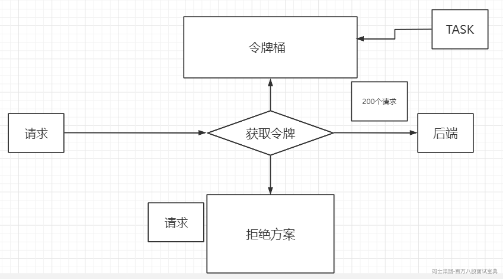
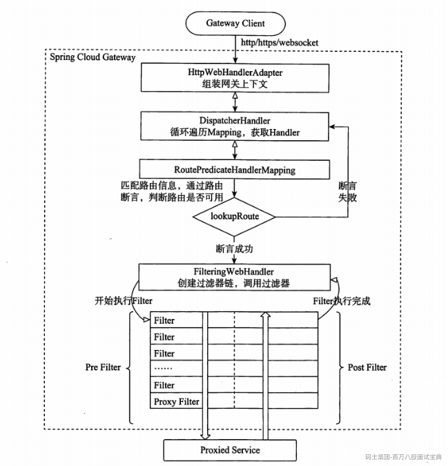
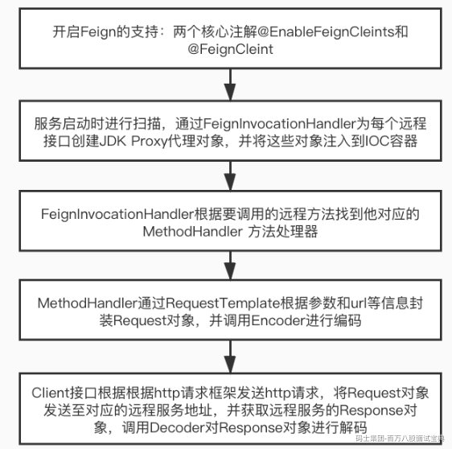

# 微服务常见面试原理

<!-- readability-enhancement:start -->
> [!abstract] 速读地图
> 这篇偏微服务面试原理速记，重点讲算法、流程和组件之间的职责边界。
>
> **本篇关键词：** <span style="color:#0891b2;font-weight:700">微服务</span> ・ <span style="color:#0891b2;font-weight:700">限流算法</span> ・ <span style="color:#0891b2;font-weight:700">熔断</span> ・ <span style="color:#0891b2;font-weight:700">线程池隔离</span> ・ <span style="color:#0891b2;font-weight:700">网关过滤器</span> ・ <span style="color:#0891b2;font-weight:700">Feign/Ribbon</span>
>
> **优先扫这些问题：**
> - 在微服务中有几种限流方式
> - 熔断与限流的区别
> - 断路器的隔离方式（线程池隔离以及信号量隔离）有什么区别
> - API网关的工作流程
> - Fegin的核心原理是什么？
> - 链路追踪
> - Ribbon

> [!success] 面试背诵小结
> - 回答时用「定义 -> 原理 -> 场景 -> 坑点」四段式，能显得更稳。
> - 二刷时先看上面的关键词，再回到正文找例子和代码。
> - 真被追问时，优先把相似概念做对比，而不是继续堆定义。

> [!warning] 易混提醒
> 易混：令牌桶允许突发流量，漏桶更平滑；线程池隔离和信号量隔离成本不同。
<!-- readability-enhancement:end -->

---


高并发：是一种系统运行过程中遇到的短时间大量的请求操作

响应时间：

吞吐量：

QPS：数据库为维度

TPS

并发用户数

并发的维度：很多的

并发是不是达到的当前系统的瓶颈

缓存 （第一手段） 降级 限流 限制流量

## 5.在微服务中有几种限流方式

sentinel hystrix 线程池 300线程

资源：被流量控制的对象

策略：限流算法以及可调节参数

基于请求限流：

基于资源限流：

限制总并发数 限制瞬间的并发数

### 令牌桶

令牌桶算法是网络流量整形（Traffic Shaping）和速率限制（Rate Limiting）中最常使用的一种算法。典型情况下，令牌桶算法用来控制发送到网络上的数据的数目，并允许突发数据的发送。

令牌桶是一个存放固定容量令牌（token）的桶，按照固定速率往桶里添加令牌; 令牌桶算法实际上由三部分组成：两个流和一个桶，分别是令牌流、数据流和令牌桶

**令牌流与令牌桶**

系统会以一定的速度生成令牌，并将其放置到令牌桶中，可以将令牌桶想象成一个缓冲区（可以用队列这种数据结构来实现），当缓冲区填满的时候，新生成的令牌会被扔掉。这里有两个变量很重要：

第一个是生成令牌的速度，一般称为 rate 。比如，我们设定 rate = 2 ，即每秒钟生成 2 个令牌，也就是每 1/2 秒生成一个令牌；

第二个是令牌桶的大小，一般称为 burst 。比如，我们设定 burst = 10 ，即令牌桶最大只能容纳 10 个令牌。

**数据流**

数据流是真正的进入系统的流量，对于http接口来说，如果平均每秒钟会调用2次，则认为速率为 2次/s。



特点：1.令牌是可以累计的，意味着我们能够去处理小于令牌桶+令牌生成速率的瞬时流量

```plain
2.允许突发的流量
```

### **漏桶**

漏桶算法思路是，不断的往桶里面注水，无论注水的速度是大还是小，水都是按固定的速率往外漏水；如果桶满了，水会溢出；

桶本身具有一个恒定的速率往下漏水，而上方时快时慢的会有水进入桶内。当桶还未满时，上方的水可以加入。一旦水满，上方的水就无法加入。桶满正是算法中的一个关键的触发条件（即流量异常判断成立的条件）。而此条件下如何处理上方流下来的水，有两种方式

在桶满水之后，常见的两种处理方式为：

1）暂时拦截住上方水的向下流动，等待桶中的一部分水漏走后，再放行上方水。

2）溢出的上方水直接抛弃。

**特点**

漏水的速率是固定的

即使存在注水burst（突然注水量变大）的情况，漏水的速率也是固定的


### 计数器

这个最简单，比如用Redis做计数器

计数器算法是使用计数器在周期内累加访问次数，当达到设定的限流值时，触发限流策略。下一个周期开始时，进行清零，重新计数。此算法在单机还是分布式环境下实现都非常简单，使用redis的incr原子自增性和线程安全即可轻松实现。


### 滑动窗口

滑动窗口协议是传输层进行流控的一种措施，接收方通过通告发送方自己的窗口大小，从而控制发送方的发送速度，从而达到防止发送方发送速度过快而导致自己被淹没的目的。

简单解释下，发送和接受方都会维护一个数据帧的序列，这个序列被称作窗口。发送方的窗口大小由接受方确定，目的在于控制发送速度，以免接受方的缓存不够大，而导致溢出，同时控制流量也可以避免网络拥塞。下面图中的4,5,6号数据帧已经被发送出去，但是未收到关联的ACK，7,8,9帧则是等待发送。可以看出发送端的窗口大小为6，这是由接受端告知的。此时如果发送端收到4号ACK，则窗口的左边缘向右收缩，窗口的右边缘则向右扩展，此时窗口就向前“滑动了”，即数据帧10也可以被发送。

**参考如下网址提供的动态效果**

<https://media.pearsoncmg.com/aw/ecs_kurose_compnetwork_7/cw/content/interactiveanimations/selective-repeat-protocol/index.html>

## 6.熔断与限流的区别

在分布式系统中，限流和熔断是处理并发的两大利器。关于限流和熔断，需要记住一句话，客户端熔断，服务端限流。

发现为什么是限流和熔断？而不是限流和降级？所以下面我特地讲一讲他们的区别。

**相似处：**  
**1.目的一致**

都是为了系统的稳定性，防止因为个别微服务的不可用而拖死整个系统服务；

**2.表现类似**

在表现上都是让用户感知，该服务暂时不可用请稍后再试；

**3.粒度一致**

粒度上，都是服务级别的粒度，某些情况下，也有更细的粒度，如数据的持久层，只允许查询，不允许增删改。

**主要区别：**  
**1.触发条件不同**

服务熔断一般是某个服务挂掉了引起的，一般是下游服务，而服务降级一般是从整体的负荷考虑，主动降级；

**2.管理目标的层次不同**

熔断其实是一个框架级的处理，每个微服务都需要，没有层次之分，而降级一般需要对业务有层级之分，一般是从最外围服务开始。

## 7.断路器的隔离方式（线程池隔离以及信号量隔离）有什么区别

在断路器中，介绍两种处理高并发的解决方案。

首先需要理解高并发的情况下系统会出现什么样的问题。

当部署完一个服务后，这个服务会向外界开放多个接口， 比如 一个烂大街的商城系统可能有 订单查询接口， 个人中心接口 ， 付款接口 ，商品查询接口。 当服务部署好之后，没有其他配置时， tomcat默认开启一个线程池， 这个线程池中有200个线程供使用。 这时候， 这四个接口都有对这个线程池的使用权，也就是说这四个接口共享一个线程池。 当访问量小的时候系统没有问题， 但是遇到突发情况，比如一类爆款商品降价， 导致了商品查询接口访问量激增。 商品查询接口占用了线程池中大量的线程， 导致其他三个接口抢不到线程从而没有线程可用， 这时候， 由于四个接口共享一个线程池， 当一个接口访问量激增而占用大量资源时， 导致其他三个接口抢不到资源进而导致自身功能不可用。

### 线程池隔离

这时候，提出一种解决方案--线程池隔离。

线程池隔离的思想是: 把tomcat中先一个线程池分成两个线程池. 比如tomcat线程池中初始有200个线程, 分成两个线程池A , B后, A线程池有50个线程可以用, B线程池有150个线程可以用. 将访问量较大的接口单独配置给一个线程池, 其他接口使用另一个线程池 , 使其访问量激增时不要影响其他接口的调用.

然后, 将访问量暴增的接口访问交给A线程池, 其他接口的访问交给B线程池. A , B两个线程池是相互隔离的, 互不影响. 这时候, 如果商品查询接口访问量激增 , 被挤爆的线程池也只是A线程池, A,B线程池互不影响, 所以其他接口如: 个人中心接口, 付款接口, 订单查询接口依然可用.

线程池隔离主要针对C端用户对服务的访问. 线程池隔离起到分流的作用.

### 信号量隔离

还有一种是新思路是采用信号量隔离方式.

可以把信号量理解成一个计数器 , 对这个计数器规定一个计数上限, 代表一个接口被访问的最大量.

假定设置 付款接口的信号量最大值为10,(这个接口最多占用线程池中10个线程) 初始值为0. 每调用一次接口信号量加一 , 接口处理完后信号量减一. 当信号量值达到最大时 , (10时) , 对后续的调用请求拒接处理.

信号量隔离主要是针对各个服务内部的调用处理, 起到限流的作用.

## 8.API网关的工作流程

客户端向Spring Cloud Gateway发出请求。如果网关处理程序映射（Gateway Handler Mapping）确定请求与路由匹配，则将其发送到网关Web处理程序（Gateway Web Handler）。该处理程序通过特定于请求的过滤器链来运行请求。过滤器器由虚线分隔的原因是，过滤器可以在发送代理请求之前和之后运行逻辑。所有“前置”过滤器逻辑均被执行。然后发出代理请求。发出代理请求后，将运行“后置”过滤器逻辑。图中虚线左边的对应于前置过滤器，虚线右边的对应于后置过滤器。

- 前置过滤器可以做参数校验、权限校验、流量监控、日志输出、协议转换等；

- 后置过滤器可以做响应内容、响应头的修改、日志的输出、流量监控等。

SpringCloud Gateway的核心逻辑其实就是路由转发和执行过滤器链

### 过滤器执行顺序

请求进入网关会碰到三类过滤器：当前路由的过滤器、DefaultFilter、GlobalFilter

请求路由后，会将当前路由过滤器和DefaultFilter、GlobalFilter，合并到一个过滤器链（集合）中，排序后依次执行每个过滤器：


排序的规则是什么呢？

每一个过滤器都必须指定一个int类型的order值，order值越小，优先级越高，执行顺序越靠前。

GlobalFilter通过实现Ordered接口，或者添加@Order注解来指定order值，由我们自己指定

路由过滤器和defaultFilter的order由Spring指定，默认是按照声明顺序从1递增。

当过滤器的order值一样时，会按照 defaultFilter > 路由过滤器 > GlobalFilter的顺序执行。

路由规则：

1.localhost:8080/order/all oder/\*\*

2.`http://localhost:80/list?token=abc123`



## Fegin的核心原理是什么？

'

@FeginClient通过动态代理调用RequsetMapping注解上的URL

## 链路追踪

skywalking CAT pingpoint zipkin

Client Sent简称cs，客户端发起调用请求到服务端。  
Server Received简称sr，指服务端接收到了客户端的调用请求。  
Server Sent简称ss，指服务端完成了处理，准备将信息返给客户端。  
Client Received简称cr，指客户端接收到了服务端的返回信息。

## Ribbon

负载均衡策略：

1.轮询

2.随机

3.最小并发

4.加权轮询

5.先过滤，再线性轮询

6.最优最佳

7.失败重试


