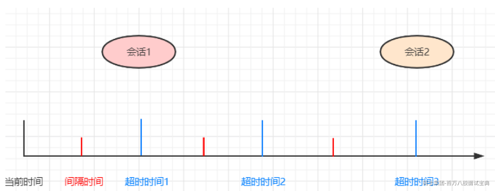
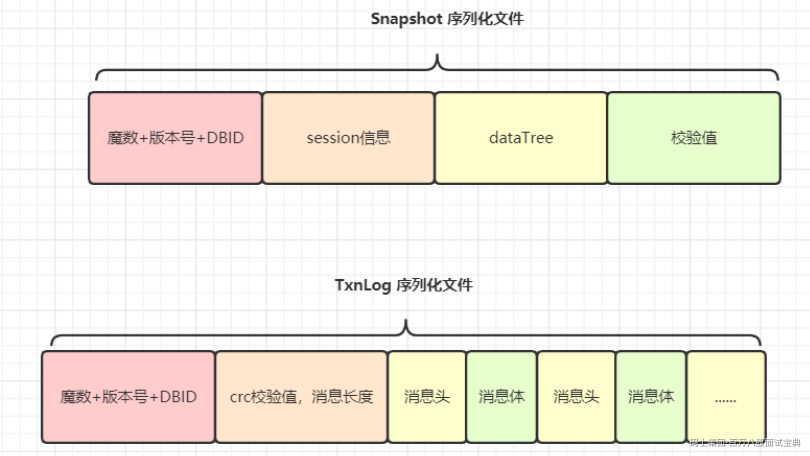

# Dubbo

## Dubbo服务注册流程?

1. 服务容器负责启动，加载，运行服务提供者。  
   2.服务提供者在启动时，向注册中心注册自己提供的服务。  
   3.服务消费者在启动时，向注册中心订阅自己所需的服务。  
   4.注册中心返回服务提供者地址列表给消费者，如果有变更，注册中心将基于长连接推送变更数据给消  
   费者。  
   5.服务消费者，从提供者地址列表中，基于软负载均衡算法，选一台提供者进行调用，如果调用失败  
   再选另一台调用。  
   6.服务消费者和提供者，在内存中累计调用次数和调用时间，定时每分钟发送一次统计数据到监控中  
   心。Dubbo

## Dubbo配置优先级别

优先级从高到低:  
JVM -D参数，当你部署或者启动应用时，它可以轻易地重写配置，比如，改变dubbo协议端口;  
XML,XML中的当前配置会重写dubbo.properties中的;  
▪Properties，默认配置，仅仅作用于以上两者没有配置时。

## Dubbo 负载均衡策略?默认是?

随机负载平衡(默认)  
RoundRobin负载平衡  
最小活动负载平衡  
一致的哈希负载平衡

## Dubbo框架设计是怎样的?

各层说明:  
config 配置层:对外配置接口，以 ServiceConfig,ReferenceConfig 为中心，可以直接初始化配  
置类，也可以通过 spring 解析配置生成配置类

proxy 服务代理层:服务接口透明代理，生成服务的客户端 Stub 和服务器端 Skeleton, 以ServiceProxy为中心，扩展接口为ProxyFactory

registry 注册中心层:封装服务地址的注册与发现，以服务 URL为中心，扩展接口为RegistryFactory,Registry,Registryservice

cluster 路由层:封装多个提供者的路由及负载均衡，并桥接注册中心，以 Invoker 为中心，扩展接  
日为Cluster, Directory,Router, LoadBalance

monitor 监控层:RPC 调用次数和调用时间监控，以 Statistics 为中心，扩展接口为MonitorFactory,Monitor,MonitorService

protocol 远程调用层:封装 RPC调用，以Invocation,Result 为中心，扩展接口为Protocol  
Invoker,Exporter

exchange 信息交换层:封装请求响应模式，同步转异步，以Request,Response 为中心，扩展接口  
为Exchanger,ExchangeChannel,Exchangeclient,ExchangeServer

transport 网络传输层:抽象mimna和netty 为统一接口，以 Message 为中心，扩展接口为 Channel  
Transporter,Client,Server,Codec

serialize 数据序列化层:可复用的一些工具，扩展接口为 Serialization,0bjectInput  
0bjectOutput,ThreadPool

# Zookeeper

## Zookeeper的工作原理？

Zookeeper的核心是原子广播，这个机制保证了各个Server之间的同步。实现这个机制的协议叫做

Zab协议。Zab协议有两种模式，它们 分别是恢复模式（选主）和广播模式（同步）。

Zab协议 的全称是 Zookeeper Atomic Broadcast\*\* （Zookeeper原子广播）。Zookeeper 是通过

Zab 协议来保证分布式事务的最终一致性。Zab协议要求每个 Leader 都要经历三个阶段：发现，同

步，广播。

当服务启动或者在领导者崩溃后，Zab就进入了恢复模式，当领导者被选举出来，且大多数Server

完成了和 leader的状态同步以后，恢复模式就结束了。状态同步保证了leader和Server具有相同的

系统状态。

为了保证事务的顺序一致性，zookeeper采用了递增的事务id号（zxid）来标识事务。所有的提议

（proposal）都在被提出的时候加 上了zxid。实现中zxid是一个64位的数字，它高32位是epoch用

来标识leader关系是否改变，每次一个leader被选出来，它都会有一 个新的epoch，标识当前属于

那个leader的统治时期。低32位用于递增计数。

epoch：可以理解为皇帝的年号，当新的皇帝leader产生后，将有一个新的epoch年号。

每个Server在工作过程中有三种状态：

LOOKING：当前Server不知道leader是谁，正在搜寻。

LEADING：当前Server即为选举出来的leader。

FOLLOWING：leader已经选举出来，当前Server与之同步。

## Zookeeper 的通知机制是什么？

Zookeeper 允许客户端向服务端的某个 znode 注册一个 Watcher 监听，当服务端的一些指定事件

触发了这个 Watcher ，服务端会向指定客户端发送一个事件通知来实现分布式的通知功能，然后客

户端根据 Watcher 通知状态和事件类型做出业务上的改变。

大致分为三个步骤：

客户端注册 Watcher

1、调用 getData、getChildren、exist 三个 API ，传入Watcher 对象。 2、标记请求

request ，封装 Watcher 到 WatchRegistration 。 3、封装成 Packet 对象，发服务端发送

request 。 4、收到服务端响应后，将 Watcher 注册到 ZKWatcherManager 中进行管理。 5、

请求返回，完成注册。

服务端处理 Watcher

1、服务端接收 Watcher 并存储。 2、Watcher 触发 3、调用 process 方法来触发 Watcher 。

客户端回调 Watcher

1，客户端 SendThread 线程接收事件通知，交由 EventThread 线程回调Watcher 。 2，客户端

的 Watcher 机制同样是一次性的，一旦被触发后，该 Watcher 就失效了。client 端会对某个 znode 建立一个 watcher 事件，当该 znode 发生变化时，这些 client 会收

到 zk 的通知，然后 client 可以根据 znode 变化来做出业务上的改变等。

## Zookeeper 集群中是怎样选举leader的？

当Leader崩溃了，或者失去了大多数的Follower，这时候 Zookeeper 就进入恢复模式，恢复模式需

要重新选举出一个新的Leader，让所有的Server都恢复到一个状态LOOKING 。

Zookeeper 有两种选举算法：基于 basic paxos 实现和基于 fast paxos 实现。默认为 fast paxos

推荐看这个：[【分布式】Zookeeper的Leader选举 - leesf - 博客园 (cnblogs.com)](https://www.cnblogs.com/leesf456/p/6107600.html)

## Zookeeper 是如何保证事务的顺序一致性的呢？

Zookeeper 采用了递增的事务 id 来识别，所有的 proposal （提议）都在被提出的时候加上了

zxid 。 zxid 实际上是一个 64 位数字。

高 32 位是 epoch 用来标识 Leader 是否发生了改变，如果有新的 Leader 产生出来， epoch 会自

增。 低 32 位用来递增计数。 当新产生的 proposal 的时候，会依据数据库的两阶段过程，首先会

向其他的 Server 发出事务执行请求，如果超过半数的机器都能执行并且能够成功，那么就会开始

执行。

## 为什么Zookeeper集群的数目，一般为奇数个？

首先需要明确zookeeper选举的规则：leader选举，要求 可用节点数量 > 总节点数量/2 。

比如：标记一个写是否成功是要在超过一半节点发送写请求成功时才认为有效。同样，Zookeeper

选择领导者节点也是在超过一半节点同意时才有效。最后，Zookeeper是否正常是要根据是否超过

一半的节点正常才算正常。这是基于CAP的一致性原理。

zookeeper有这样一个特性：集群中只要有过半的机器是正常工作的，那么整个集群对外就是可用

的。

也就是说如果有2个zookeeper，那么只要有1个死了zookeeper就不能用了，因为1没有过半，所以

2个zookeeper的死亡容忍度为0；

同理，要是有3个zookeeper，一个死了，还剩下2个正常的，过半了，所以3个zookeeper的容忍度

为1；

同理：

2->0；两个zookeeper，最多0个zookeeper可以不可用。

3->1；三个zookeeper，最多1个zookeeper可以不可用。

4->1；四个zookeeper，最多1个zookeeper可以不可用。

5->2；五个zookeeper，最多2个zookeeper可以不可用。

6->2；两个zookeeper，最多0个zookeeper可以不可用。

....

会发现一个规律，2n和2n-1的容忍度是一样的，都是n-1，所以为了更加高效，何必增加那一个不

必要的zookeeper呢。

zookeeper的选举策略也是需要半数以上的节点同意才能当选leader，如果是偶数节点可能导致票

数相同的情况

## Zookeeper集群支持动态添加机器吗？

其实就是水平扩容了，Zookeeper 在这方面不太好。两种方式：

全部重启：关闭所有 Zookeeper 服务，修改配置之后启动。不影响之前客户端的会话。

逐个重启：在过半存活即可用的原则下，一台机器重启不影响整个集群对外提供服务。这是比较常

用的方式。

3.5 版本开始支持动态扩容。

22、描述一下 ZAB 协议

ZAB 协议是 ZooKeeper 自己定义的协议，全名 ZooKeeper 原子广播协议。

ZAB 协议有两种模式：Leader 节点崩溃了如何恢复和消息如何广播到所有节点。

整个 ZooKeeper 集群没有 Leader 节点的时候，属于崩溃的情况。比如集群启动刚刚启动，这时节

点们互相不认识。比如运作 Leader 节点宕机了，又或者网络问题，其他节点 Ping 不通 Leader 节

点了。这时就需要 ZAB 中的节点崩溃协议，所有节点进入选举模式，选举出新的 Leader。整个选

举过程就是通过广播来实现的。选举成功后，一切都需要以 Leader 的数据为准，那么就需要进行

数据同步了。

## ZAB 和 Paxos 算法的联系与区别？

相同点：

（1）两者都存在一个类似于 Leader 进程的角色，由其负责协调多个 Follower 进程的运行

（2）Leader 进程都会等待超过半数的 Follower 做出正确的反馈后，才会将一个提案进行提交

（3）ZAB 协议中，每个 Proposal 中都包含一个 epoch 值来代表当前的 Leader周期，Paxos 中名

字为 Ballot

不同点：

ZAB 用来构建高可用的分布式数据主备系统（Zookeeper），Paxos 是用来构建分布式一致性状态

机系统。

## ZooKeeper 宕机如何处理？

ZooKeeper 本身也是集群，推荐配置奇数个服务器。因为宕机就需要选举，选举需要半数 +1 票才

能通过，为了避免打成平手。进来不用偶数个服务器。如果是 Follower 宕机了，没关系不影响任何使用。用户无感知。如果 Leader 宕机，集群就得停止

对外服务，开始选举，选举出一个 Leader 节点后，进行数据同步，保证所有节点数据和 Leader 统

一，然后开始对外提供服务。

为啥投票需要半数 +1，如果半数就可以的话，网络的问题可能导致集群选举出来两个 Leader，各

有一半的小弟支持，这样数据也就乱套了。

## 描述一下 ZooKeeper 的 session 管理的思想？

分桶策略：

简单地说，就是不同的会话过期可能都有时间间隔，比如 15 秒过期、15.1 秒过期、15.8 秒过期，

ZooKeeper 统一让这些 session 16 秒过期。这样非常方便管理，看下面的公式，过期时间总是

ExpirationInterval 的整数倍。

计算公式：

ExpirationTime = currentTime + sessionTimeout

ExpirationTime = (ExpirationTime / ExpirationInrerval + 1) \* ExpirationInterval ,

见图片：

默认配置的 session 超时时间是在 2tickTime~20tickTime。

## ZooKeeper 负载均衡和 Nginx 负载均衡有什么区别？

ZooKeeper：

不存在单点问题，zab 机制保证单点故障可重新选举一个 Leader

只负责服务的注册与发现，不负责转发，减少一次数据交换（消费方与服务方直接通信）

需要自己实现相应的负载均衡算法Nginx：

存在单点问题，单点负载高数据量大，需要通过 KeepAlived 辅助实现高可用

每次负载，都充当一次中间人转发角色，本身是个反向代理服务器

自带负载均衡算法

## 说说ZooKeeper 的序列化

序列化：

内存数据，保存到硬盘需要序列化。

内存数据，通过网络传输到其他节点，需要序列化。

ZK 使用的序列化协议是 Jute，Jute 提供了 Record 接口。接口提供了两个方法：

serialize 序列化方法

deserialize 反序列化方法

要系列化的方法，在这两个方法中存入到流对象中即可。

## 在Zookeeper中Zxid 是什么，有什么作用？

Zxid，也就是事务 id，为了保证事务的顺序一致性，ZooKeeper 采用了递增的事务 Zxid 来标识事

务。proposal 都会加上了 Zxid。Zxid 是一个 64 位的数字，它高 32 位是 Epoch 用来标识朝代变

化，比如每次选举 Epoch 都会加改变。低 32 位用于递增计数。

Epoch：可以理解为当前集群所处的年代或者周期，每个 Leader 就像皇帝，都有自己的年号，所

以每次改朝换代，Leader 变更之后，都会在前一个年代的基础上加 1。这样就算旧的 Leader 崩溃

恢复之后，也没有人听它的了，因为 Follower 只听从当前年代的 Leader 的命令

## 讲解一下 ZooKeeper 的持久化机制

什么是持久化？

数据，存到磁盘或者文件当中。

机器重启后，数据不会丢失。内存 -> 磁盘的映射，和序列化有些像。

ZooKeeper 的持久化：

SnapShot 快照，记录内存中的全量数据

TxnLog 增量事务日志，记录每一条增删改记录（查不是事务日志，不会引起数据变化）

为什么持久化这么麻烦，一个不可用吗？

快照的缺点，文件太大，而且快照文件不会是最新的数据。 增量事务日志的缺点，运行时间长了，

日志太多了，加载太慢。二者结合最好。快照模式：

将 ZooKeeper 内存中以 DataTree 数据结构存储的数据定期存储到磁盘中。

由于快照文件是定期对数据的全量备份，所以快照文件中数据通常不是最新的。

见图片：

## Zookeeper选举中投票信息的五元组是什么？

Leader：被选举的 Leader 的 SID

Zxid：被选举的 Leader 的事务 ID

Sid：当前服务器的 SID

electionEpoch：当前投票的轮次

peerEpoch：当前服务器的 Epoch

Epoch > Zxid > Sid

Epoch，Zxid 都可能一致，但是 Sid 一定不一样，这样两张选票一定会 PK 出结果。

## 说说Zookeeper中的脑裂？

简单点来说，脑裂(Split-Brain) 就是比如当你的 cluster 里面有两个节点，它们都知道在这个

cluster 里需要选举出一个 master。那么当它们两个之间的通信完全没有问题的时候，就会达成共

识，选出其中一个作为 master。但是如果它们之间的通信出了问题，那么两个结点都会觉得现在没

有 master，所以每个都把自己选举成 master，于是 cluster 里面就会有两个 master。对于Zookeeper来说有一个很重要的问题，就是到底是根据一个什么样的情况来判断一个节点死亡

down掉了？在分布式系统中这些都是有监控者来判断的，但是监控者也很难判定其他的节点的状

态，唯一一个可靠的途径就是心跳，Zookeeper也是使用心跳来判断客户端是否仍然活着。

使用ZooKeeper来做Leader HA基本都是同样的方式：每个节点都尝试注册一个象征leader的临时

节点，其他没有注册成功的则成为follower，并且通过watch机制监控着leader所创建的临时节点，

Zookeeper通过内部心跳机制来确定leader的状态，一旦leader出现意外Zookeeper能很快获悉并

且通知其他的follower，其他flower在之后作出相关反应，这样就完成了一个切换，这种模式也是

比较通用的模式，基本大部分都是这样实现的。但是这里面有个很严重的问题，如果注意不到会导

致短暂的时间内系统出现脑裂，因为心跳出现超时可能是leader挂了，但是也可能是zookeeper节

点之间网络出现了问题，导致leader假死的情况，leader其实并未死掉，但是与ZooKeeper之间的

网络出现问题导致Zookeeper认为其挂掉了然后通知其他节点进行切换，这样follower中就有一个

成为了leader，但是原本的leader并未死掉，这时候client也获得leader切换的消息，但是仍然会有

一些延时，zookeeper需要通讯需要一个一个通知，这时候整个系统就很混乱可能有一部分client已

经通知到了连接到新的leader上去了，有的client仍然连接在老的leader上，如果同时有两个client

需要对leader的同一个数据更新，并且刚好这两个client此刻分别连接在新老的leader上，就会出现

很严重问题。

这里做下小总结： 假死：由于心跳超时（网络原因导致的）认为leader死了，但其实leader还存活

着。 脑裂：由于假死会发起新的leader选举，选举出一个新的leader，但旧的leader网络又通了，

导致出现了两个leader ，有的客户端连接到老的leader，而有的客户端则连接到新的leader。

## Zookeeper脑裂是什么原因导致的？

主要原因是Zookeeper集群和Zookeeper client判断超时并不能做到完全同步，也就是说可能一前

一后，如果是集群先于client发现，那就会出现上面的情况。同时，在发现并切换后通知各个客户端

也有先后快慢。一般出现这种情况的几率很小，需要leader节点与Zookeeper集群网络断开，但是

与其他集群角色之间的网络没有问题，还要满足上面那些情况，但是一旦出现就会引起很严重的后

果，数据不一致。

## Zookeeper 是如何解决脑裂问题的？

要解决Split-Brain脑裂的问题，一般有下面几种种方法： Quorums (法定人数) 方式: 比如3个节点

的集群，Quorums = 2, 也就是说集群可以容忍1个节点失效，这时候还能选举出1个lead，集群还

可用。比如4个节点的集群，它的Quorums = 3，Quorums要超过3，相当于集群的容忍度还是1，

如果2个节点失效，那么整个集群还是无效的。这是zookeeper防止"脑裂"默认采用的方法。

采用Redundant communications (冗余通信)方式：集群中采用多种通信方式，防止一种通信方式

失效导致集群中的节点无法通信。

Fencing (共享资源) 方式：比如能看到共享资源就表示在集群中，能够获得共享资源的锁的就是

Leader，看不到共享资源的，就不在集群中。要想避免zookeeper"脑裂"情况其实也很简单，在follower节点切换的时候不在检查到老的leader节

点出现问题后马上切换，而是在休眠一段足够的时间，确保老的leader已经获知变更并且做了相关

的shutdown清理工作了然后再注册成为master就能避免这类问题了，这个休眠时间一般定义为与

zookeeper定义的超时时间就够了，但是这段时间内系统可能是不可用的，但是相对于数据不一致

的后果来说还是值得的。

1、zooKeeper默认采用了Quorums这种方式来防止"脑裂"现象。即只有集群中超过半数节点投票

才能选举出Leader。这样的方式可以确保leader的唯一性,要么选出唯一的一个leader,要么选举失

败。在zookeeper中Quorums作用如下：

集群中最少的节点数用来选举leader保证集群可用。

通知客户端数据已经安全保存前集群中最少数量的节点数已经保存了该数据。一旦这些节点保

存了该数据，客户端将被通知已经安全保存了，可以继续其他任务。而集群中剩余的节点将会

最终也保存了该数据。

假设某个leader假死，其余的followers选举出了一个新的leader。这时，旧的leader复活并且仍然

认为自己是leader，这个时候它向其他followers发出写请求也是会被拒绝的。因为每当新leader产

生时，会生成一个epoch标号(标识当前属于那个leader的统治时期)，这个epoch是递增的，

followers如果确认了新的leader存在，知道其epoch，就会拒绝epoch小于现任leader epoch的所

有请求。那有没有follower不知道新的leader存在呢，有可能，但肯定不是大多数，否则新leader

无法产生。Zookeeper的写也遵循quorum机制，因此，得不到大多数支持的写是无效的，旧

leader即使各种认为自己是leader，依然没有什么作用。

zookeeper除了可以采用上面默认的Quorums方式来避免出现"脑裂"，还可以可采用下面的预防措

施： 2、添加冗余的心跳线，例如双线条线，尽量减少“裂脑”发生机会。 3、启用磁盘锁。正在服务

一方锁住共享磁盘，"裂脑"发生时，让对方完全"抢不走"共享磁盘资源。但使用锁磁盘也会有一个

不小的问题，如果占用共享盘的一方不主动"解锁"，另一方就永远得不到共享磁盘。现实中假如服

务节点突然死机或崩溃，就不可能执行解锁命令。后备节点也就接管不了共享资源和应用服务。于

是有人在HA中设计了"智能"锁。即正在服务的一方只在发现心跳线全部断开（察觉不到对端）时才

启用磁盘锁。平时就不上锁了。 4、设置仲裁机制。例如设置参考IP（如网关IP），当心跳线完全

断开时，2个节点都各自ping一下 参考IP，不通则表明断点就出在本端，不仅"心跳"、还兼对外"服

务"的本端网络链路断了，即使启动（或继续）应用服务也没有用了，那就主动放弃竞争，让能够

ping通参考IP的一端去起服务。更保险一些，ping不通参考IP的一方干脆就自我重启，以彻底释放

有可能还占用着的那些共享资源。

## 说说 Zookeeper 的 CAP 问题上做的取舍？

一致性 C：Zookeeper 是强一致性系统，为了保证较强的可用性，“一半以上成功即成功”的数据同

步方式可能会导致部分节点的数据不一致。所以 Zookeeper 还提供了 sync() 操作来做所有节点的

数据同步，这就关于 C 和 A 的选择问题交给了用户，因为使用 sync()势必会延长同步时间，可用性

会有一些损失。可用性 A：Zookeeper 数据存储在内存中，且各个节点都可以相应读请求，具有好的响应性能。

Zookeeper 保证了数据总是可用的，没有锁。并且有一大半的节点所拥有的数据是最新的。

分区容忍性 P：Follower 节点过多会导致增大数据同步的延时（需要半数以上 follower 写完提

交）。同时选举过程的收敛速度会变慢，可用性降低。Zookeeper 通过引入 observer 节点缓解了

这个问题，增加 observer 节点后集群可接受 client 请求的节点多了，而且 observer 不参与投票，

可以提高可用性和扩展性，但是节点多数据同步总归是个问题，所以一致性会有所降低。

# ES

## 简要介绍一下Elasticsearch？

Elasticsearch 是一个分布式、RESTful 风格的搜索和数据分析引擎，能够解决不断涌现出的各种用例。

作为 Elastic Stack 的核心，它集中存储您的数据，帮助您发现意料之中以及意料之外的情况。

ElasticSearch 是基于Lucene的搜索服务器。它提供了一个分布式多用户能力的全文搜索引擎，基于

RESTful web接口。Elasticsearch是用Java开发的，并作为Apache许可条款下的开放源码发布，是当前

流行的企业级搜索引擎。

核心特点如下：

分布式的实时文件存储，每个字段都被索引且可用于搜索。

分布式的实时分析搜索引擎，海量数据下近实时秒级响应。

简单的restful api，天生的兼容多语言开发。

易扩展，处理PB级结构化或非结构化数据。

## ElasticSearch中的集群、节点、索引、文档、类型是什么？

群集是一个或多个节点（服务器）的集合，它们共同保存您的整个数据，并提供跨所有节点的联合索引

和搜索功能。群集由唯一名称标识，默认情况下为“elasticsearch”。此名称很重要，因为如果节点设置

为按名称加入群集，则该节点只能是群集的一部分。

节点是属于集群一部分的单个服务器。它存储数据并参与群集索引和搜索功能。

索引就像关系数据库中的“数据库”。它有一个定义多种类型的映射。索引是逻辑名称空间，映射到一个

或多个主分片，并且可以有零个或多个副本分片。 MySQL =>数据库 ElasticSearch =>索引

文档类似于关系数据库中的一行。不同之处在于索引中的每个文档可以具有不同的结构（字段），但是

对于通用字段应该具有相同的数据类型。 MySQL => Databases => Tables => Columns / Rows

ElasticSearch => Indices => Types =>具有属性的文档

类型是索引的逻辑类别/分区，其语义完全取决于用户。

## 请解释一下 Elasticsearch 中聚合？

聚合有助于从搜索中使用的查询中收集数据，聚合为各种统计指标，便于统计信息或做其他分析。聚合

可帮助回答以下问题：

我的网站平均加载时间是多少？

根据交易量，谁是我最有价值的客户？

什么会被视为我网络上的大文件？

每个产品类别中有多少个产品？

聚合的分三类：

主要查看7.10 的官方文档，早期是4个分类，别大意啊！

分桶 Bucket 聚合

根据字段值，范围或其他条件将文档分组为桶（也称为箱）。

指标 Metric 聚合

从字段值计算指标（例如总和或平均值）的指标聚合。

管道 Pipeline 聚合

子聚合，从其他聚合（而不是文档或字段）获取输入。

## 你能否列出与 Elasticsearch 有关的主要可用字段数据类型？

字符串数据类型，包括支持全文检索的 text 类型 和 精准匹配的 keyword 类型。

数值数据类型，例如字节，短整数，长整数，浮点数，双精度数，half\_float，scaled\_float。

日期类型，日期纳秒Date nanoseconds，布尔值，二进制（Base64编码的字符串）等。

范围（整数范围 integer\_range，长范围 long\_range，双精度范围 double\_range，浮动范围

float\_range，日期范围 date\_range）。

包含对象的复杂数据类型，nested 、Object。

GEO 地理位置相关类型。

特定类型如：数组（数组中的值应具有相同的数据类型）

## Elasticsearch了解多少，说说你们公司es的集群架构，索引数据大小，分片有多少，以及一些调优手段

如实结合自己的实践场景回答即可。

比如：ES集群架构13个节点，索引根据通道不同共20+索引，根据日期，每日递增20+，索引：10分

片，每日递增1亿+数据，

每个通道每天索引大小控制：150GB之内。

设计阶段调优

1、根据业务增量需求，采取基于日期模板创建索引，通过roll over API滚动索引；

2、使用别名进行索引管理；

3、每天凌晨定时对索引做force\_merge操作，以释放空间；

4、采取冷热分离机制，热数据存储到SSD，提高检索效率；冷数据定期进行shrink操作，以缩减存储；

5、采取curator进行索引的生命周期管理；

6、仅针对需要分词的字段，合理的设置分词器；

7、Mapping阶段充分结合各个字段的属性，是否需要检索、是否需要存储等。……..

写入调优

1、写入前副本数设置为0；

2、写入前关闭refresh\_interval设置为-1，禁用刷新机制；

3、写入过程中：采取bulk批量写入；

4、写入后恢复副本数和刷新间隔；

5、尽量使用自动生成的id。

查询调优

1、禁用wildcard；

2、禁用批量terms（成百上千的场景）；

3、充分利用倒排索引机制，能keyword类型尽量keyword；

4、数据量大时候，可以先基于时间敲定索引再检索；

5、设置合理的路由机制。

其他调优

部署调优，业务调优等。

上面的提及一部分，面试者就基本对你之前的实践或者运维经验有所评估了

## Elasticsearch 索引数据多了怎么办，如何调优，部署

索引数据的规划，应在前期做好规划，正所谓“设计先行，编码在后”，这样才能有效的避免突如其来的

数据激增导致集群处理能力不足引发的线上客户检索或者其他业务受到影响。

如何调优，正如问题1所说，这里细化一下：

动态索引层面

基于 模板+时间+rollover api滚动 创建索引，举例：设计阶段定义：blog索引的模板格式为：

blog\_index\_时间戳的形式，每天递增数据。

这样做的好处：不至于数据量激增导致单个索引数据量非常大，接近于上线2的32次幂-1，索引存储达到

了TB+甚至更大。

一旦单个索引很大，存储等各种风险也随之而来，所以要提前考虑+及早避免。

存储层面

冷热数据分离存储 ，热数据（比如最近3天或者一周的数据），其余为冷数据。

对于冷数据不会再写入新数据，可以考虑定期force\_merge加shrink压缩操作，节省存储空间和检索效

率。

部署层面

一旦之前没有规划，这里就属于应急策略。

结合ES自身的支持动态扩展的特点，动态新增机器的方式可以缓解集群压力，注意：如果之前主节点等

规划合理 ，不需要重启集群也能完成动态新增的。

## ES中的倒排索引是什么？

传统的检索方式是通过文章，逐个遍历找到对应关键词的位置。

倒排索引，是通过分词策略，形成了词和文章的映射关系表，也称倒排表，这种词典 + 映射表即为倒排

索引。

其中词典中存储词元，倒排表中存储该词元在哪些文中出现的位置。

有了倒排索引，就能实现 O(1) 时间复杂度的效率检索文章了，极大的提高了检索效率。

加分项：

倒排索引的底层实现是基于：FST（Finite State Transducer）数据结构。

Lucene 从 4+ 版本后开始大量使用的数据结构是 FST。FST 有两个优点：

1、空间占用小。通过对词典中单词前缀和后缀的重复利用，压缩了存储空间；

2、查询速度快。O(len(str)) 的查询时间复杂度。

## 描述一下Elasticsearch索引文档的过程。

协调节点默认使用文档ID参与计算（也支持通过routing），以便为路由提供合适的分片。

shard = hash(document\_id) % (num\_of\_primary\_shards)

当分片所在的节点接收到来自协调节点的请求后，会将请求写入到Memory Buffer，然后定时（默认是

每隔1秒）写入到Filesystem Cache，这个从Momery Buffer到Filesystem Cache的过程就叫做

refresh；

当然在某些情况下，存在Momery Buffer和Filesystem Cache的数据可能会丢失，ES是通过translog

的机制来保证数据的可靠性的。其实现机制是接收到请求后，同时也会写入到translog中，当

Filesystem cache中的数据写入到磁盘中时，才会清除掉，这个过程叫做flush；

在flush过程中，内存中的缓冲将被清除，内容被写入一个新段，段的fsync将创建一个新的提交点，并

将内容刷新到磁盘，旧的translog将被删除并开始一个新的translog。

flush触发的时机是定时触发（默认30分钟）或者translog变得太大（默认为512M）时；

## Elasticsearch对于大数据量（上亿量级）的聚合如何实现？

Elasticsearch 提供的首个近似聚合是cardinality 度量。它提供一个字段的基数，即该字段的distinct

或者unique值的数目。它是基于HLL算法的。HLL 会先对我们的输入作哈希运算，然后根据哈希运算的

结果中的 bits 做概率估算从而得到基数。其特点是：可配置的精度，用来控制内存的使用（更精确 ＝

更多内存）；小的数据集精度是非常高的；我们可以通过配置参数，来设置去重需要的固定内存使用

量。无论数千还是数十亿的唯一值，内存使用量只与你配置的精确度相关 .

## ES是如何实现master选举的？

前置条件：

1、只有是候选主节点（master：true）的节点才能成为主节点。

2、最小主节点数（min\_master\_nodes）的目的是防止脑裂。

Elasticsearch 的选主是 ZenDiscovery 模块负责的，主要包含 Ping（节点之间通过这个RPC来发现彼

此）和 Unicast（单播模块包含一个主机列表以控制哪些节点需要 ping 通）这两部分；

获取主节点的核心入口为 findMaster，选择主节点成功返回对应 Master，否则返回 null。

选举流程大致描述如下：

第一步：确认候选主节点数达标，elasticsearch.yml 设置的值

discovery.zen.minimum\_master\_nodes;

第二步：对所有候选主节点根据nodeId字典排序，每次选举每个节点都把自己所知道节点排一次序，然

后选出第一个（第0位）节点，暂且认为它是master节点。

第三步：如果对某个节点的投票数达到一定的值（候选主节点数n/2+1）并且该节点自己也选举自己，

那这个节点就是master。否则重新选举一直到满足上述条件。

补充：

这里的 id 为 string 类型。

master 节点的职责主要包括集群、节点和索引的管理，不负责文档级别的管理；data 节点

可以关闭 http 功能。

## 如何解决ES集群的脑裂问题

所谓集群脑裂，是指 Elasticsearch 集群中的节点（比如共 20 个），其中的 10 个选了一个 master，

另外 10 个选了另一个 master 的情况。

当集群 master 候选数量不小于 3 个时，可以通过设置最少投票通过数量

（discovery.zen.minimum\_master\_nodes）超过所有候选节点一半以上来解决脑裂问题；

当候选数量为两个时，只能修改为唯一的一个 master 候选，其他作为 data 节点，避免脑裂问题

## 在并发情况下，ES如果保证读写一致？

可以通过版本号使用乐观并发控制，以确保新版本不会被旧版本覆盖，由应用层来处理具体的冲突；

另外对于写操作，一致性级别支持quorum/one/all，默认为quorum，即只有当大多数分片可用时才

允许写操作。但即使大多数可用，也可能存在因为网络等原因导致写入副本失败，这样该副本被认为故

障，分片将会在一个不同的节点上重建。

对于读操作，可以设置replication为sync(默认)，这使得操作在主分片和副本分片都完成后才会返回；

如果设置replication为async时，也可以通过设置搜索请求参数\_preference为primary来查询主分

片，确保文档是最新版本。

## 说说你们公司ES的集群架构，索引数据大小，分片有多少，以及一些调优手段？

根据实际情况回答即可，如果是我的话会这么回答：

我司有多个ES集群，下面列举其中一个。该集群有20个节点，根据数据类型和日期分库，每个索引根据

数据量分片，比如日均1亿+数据的，控制单索引大小在200GB以内。

下面重点列举一些调优策略，仅是我做过的，不一定全面，如有其它建议或者补充欢迎留言。

部署层面：

1）最好是64GB内存的物理机器，但实际上32GB和16GB机器用的比较多，但绝对不能少于8G，除非数

据量特别少，这点需要和客户方面沟通并合理说服对方。

2）多个内核提供的额外并发远胜过稍微快一点点的时钟频率。

3）尽量使用SSD，因为查询和索引性能将会得到显著提升。

4）避免集群跨越大的地理距离，一般一个集群的所有节点位于一个数据中心中。

5）设置堆内存：节点内存/2，不要超过32GB。一般来说设置export ES\_HEAP\_SIZE=32g环境变量，比

直接写-Xmx32g -Xms32g更好一点。

6）关闭缓存swap。内存交换到磁盘对服务器性能来说是致命的。如果内存交换到磁盘上，一个100微

秒的操作可能变成10毫秒。 再想想那么多10微秒的操作时延累加起来。不难看出swapping对于性能是

多么可怕。

7）增加文件描述符，设置一个很大的值，如65535。Lucene使用了大量的文件，同时，Elasticsearch

在节点和HTTP客户端之间进行通信也使用了大量的套接字。所有这一切都需要足够的文件描述符。

8）不要随意修改垃圾回收器（CMS）和各个线程池的大小。

9）通过设置gateway.recover\_after\_nodes、gateway.expected\_nodes、

gateway.recover\_after\_time可以在集群重启的时候避免过多的分片交换，这可能会让数据恢复从数

个小时缩短为几秒钟。

索引层面：

1）使用批量请求并调整其大小：每次批量数据 5–15 MB 大是个不错的起始点。

2）段合并：Elasticsearch默认值是20MB/s，对机械磁盘应该是个不错的设置。如果你用的是SSD，可

以考虑提高到100-200MB/s。如果你在做批量导入，完全不在意搜索，你可以彻底关掉合并限流。另外

还可以增加 index.translog.flush\_threshold\_size 设置，从默认的512MB到更大一些的值，比如

1GB，这可以在一次清空触发的时候在事务日志里积累出更大的段。

3）如果你的搜索结果不需要近实时的准确度，考虑把每个索引的index.refresh\_interval 改到30s。

4）如果你在做大批量导入，考虑通过设置index.number\_of\_replicas: 0 关闭副本。

5）需要大量拉取数据的场景，可以采用scan & scroll api来实现，而不是from/size一个大范围。

存储层面：

1）基于数据+时间滚动创建索引，每天递增数据。控制单个索引的量，一旦单个索引很大，存储等各种

风险也随之而来，所以要提前考虑+及早避免。

2）冷热数据分离存储，热数据（比如最近3天或者一周的数据），其余为冷数据。对于冷数据不会再写

入新数据，可以考虑定期force\_merge加shrink压缩操作，节省存储空间和检索效率
