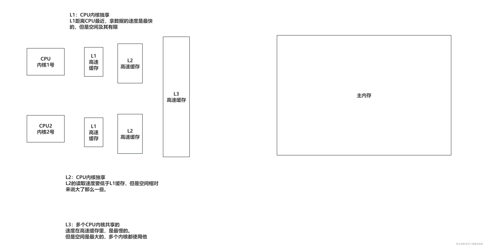
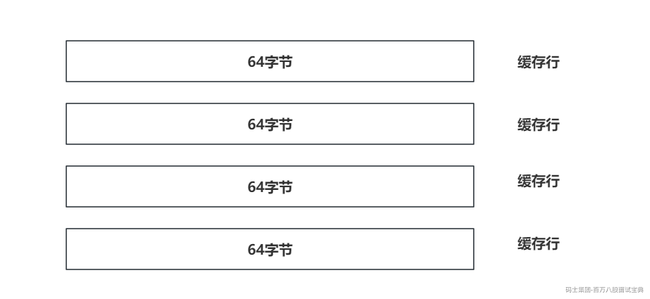
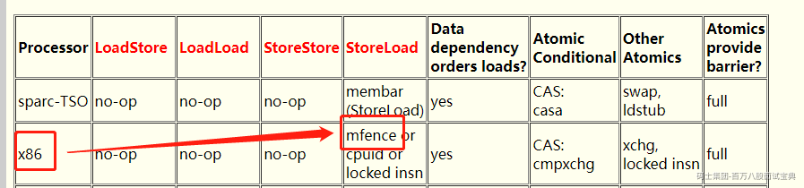
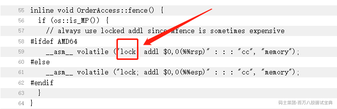

# 并发编程-原子性、可见性与有序性

## 一、CPU的可见性

### 1.1 缓存一致性问题的出现

CPU处理器在处理速度上，远胜于内存，主内存执行一次内存的读写操作，所需要的时间足够处理器去处理上百条指令。

为了弥补处理器与主内存处理能力之间的差距，CPU引入了高级缓存。CPU去主内存拉取数据后，会将数据存储到CPU的高级缓存中，下次如果还涉及到操作这个数据，直接从CPU高速缓存中获取即可，避免了长时间的和主内存操作，对CPU带来的性能损耗。

随着硬件能力不断的提升，现在的CPU都是多核的，而每个CPU内核都有自己的高速缓存。如果主内存中的同一个数据，被多个CPU内核缓存了，如果其中一个内核修改了数据，另一个内核不知道！造成了数据的不一致性。

### 1.2 CPU的高速缓存模型

### 1.3 CPU缓存行

数据在高速缓存中不是以独立项来存储的，他的数据都存储在缓存行中，CacheLine。缓存行是CPU高速缓存的最小存储单位。

目前主流的CPU缓存的缓存行通常是64字节。

比如剖析开高速缓存，里面就是多个缓存行组成滴。

比如Java中一个long类型是8字节，一个缓存行最多就可以缓存8个Long类型数据。

### 1.4 MESI协议

并不是所有的CPU都基于MESI协议去制作CPU，但是主流的CPU大多都是基于MESI协议来解决缓存一致性问题的。

M：modify修改了

> 表示缓存行数据被修改了，并且没有同步到主内存。而且这个数据是当前CPU独占的，其他CPU内核的缓存没有这个数据。
>
> 这个状态数据没有安全问题。

E：exclusive独占

> 表示缓存行数据是独占的，并且这个数据没有被修改，和主内存的数据是一致的。
>
> 这个状态数据没有安全问题。

S：shared共享

> 表示缓存行数据是共享的，这个数据被多个CPU缓存在缓存行中。并且都与内存中的值是一致的。
>
> 这个状态数据没有安全问题。

I：invalid无效

> 表示缓存行的数据是无效的，如果需要使用这个数据，需要重新去主内存拉取（那边同步完）。

### 1.5 MESI是如何保证缓存一致性

MESI协议对不同的状态增加了不同的 监听任务

- 一个处于M状态的缓存行，必须时刻监听所有试图读取当前缓存行对应的主内存数据地址的操作。如果坚挺到有其他内核要读取这个数据，必须在读取操作之前先将缓存行数据写回主内存。

- 一个处于S状态的缓存行，必须时刻监听该缓存行 无效 或者 独占 或者 修改 当前缓存行的请求，如果监听到，将当前缓存行状态设置为I。

- 一个处于E状态的缓存行，必须时刻监听视图 读取 当前缓存行对应的主内存地址的操作，如果监听到，将当前缓存行状态修改为S。

核心其实在于第一点和第二点。

第一点：可以避免其他线程读取到主内存的脏数据。

第二点：可以将缓存不一致的情况的缓存行设值为无效。

### 1.6 CPU写优化层面对MESI协议的影响

写缓冲器（StoreBuffer，WriteBuffer）是处理器内部一个容量比L1还笑的一个高速缓存组件，每个CPU内核都有自己的Store Buffer。一些写操作，不会直接执行落到L1缓存上，而是先落到StoreBuffer上，这样CPU可以省去等待响应的时间，减少写操作的延迟，提升CPU的效率。但是这种情况会影响到MESI协议的触发，导致其他缓存行应当变为I状态，但是因为StoreBuffer数据还没落到L1，导致无法触发。

无效化队列（Invalidate Queue），这个东西是处理Invalidate消息的。这个Queue是做优化滴，需要将invalid处理广播给其他的CPU，并且其他CPU需要返回一个response，大量的广播消息需要一定时间的等待response。CPU在做广播时，会将invalid消息扔到无效化队列中，不需要直接响应response消息了，减少了写操作消耗的时间。

上述两种对CPU写操作的优化，会导致MESI协议触发存在延迟甚至无法触发的问题。在CPU层面为了解决这个问题，就需要一个指令，那就是lock指令。

**lock前缀指令** 期间的写操作，会立即写回主内存，那CPU的高速缓存必然也要写回去，必然会触发MESI协议，让其他缓存行将状态同步。

## 二、CPU的原子性

CPU的一条指令必然是原子性的。

但是一些其他程序的操作，到了咱们CPU执行层面上，可能会有多个指令。就比如i++，在CPU层面是三条指令：

- 主内存读取数据

- 寄存器+1

- 数据写回主内存

但是对于修改数据而言，还是会因为多核CPU并行处理，导致一些数据安全问题，所以CPU也需要保证原子性的一些操作。就比如CAS指令，这个是CPU支持的原语。

but，CPU支持一个指令叫做cmpxchg，也就是CAS操作，在多核情况下，如果没有保证多核之间的原子性，会导致cmpxchg操作，存在数据安全问题。

So，在多核CPU下，执行cmpxchg指令时，会在前面甩一个lock指令，来保证多核CPU的原子性。

lock指令类似CPU中的锁操作，并且锁操作的粒度有两种。

- 总线锁：会锁总线，其他所有CPU内核对主内存做读写操作请求时，都会被阻塞住，直到释放总线锁。

- 缓存锁：因为总线锁效率嘎嘎低，现在的CPU都是采用锁缓存提来锁总线。在没有办法利用缓存所时，会被迫使用总线锁。

**Lock前缀指令** 在Intel官方的一些文档信息：<https://www.felixcloutier.com/x86/lock>

## 三、CPU的有序性

首先要请求，CPU本身会在一定规则下，对一些指令进行重新排序。

比如as-if-serial原则，保证单线程的程序结果不变的情况下，随便重排序。重新排序的目的是为了提升CPU的执行效率，合理的利用CPU的等待时间。

在多核CPU的情况下，因为多核CPU上的指令存在同时指定的情况，如果涉及到临界资源的修改，这种指令重排序会影响多线程运行结果的准确性。

内存屏障（Memory Barrier/Memory fence）是硬件层面提供的一些列的特殊指令，当CPU处理到这些指令时，会做一些特殊的处理，来规避重排序带来的问题。

在×86平台提供了几种比较主要的内存屏障：

- lfence - 加载屏障

- 放在读指令之前，阻塞屏障前后的指令重排

- sfence - 存储屏障

- 放在写指令之前，阻塞屏障前后的指令重排

- mfence - 全能屏障

- 具备了lfence和sfence的两个功能。

<https://gee.cs.oswego.edu/dl/jmm/cookbook.html>

mfence最终依然是 **lock前缀指令** 。

## 四、JMM-Java内存模型

JMM（Java Memory Model）Java内存模型是一个语言级别的内存模型抽象，他屏蔽了底层硬件实现内存一致性需求的差异，提供了对上层的统一的接口来保证内存一致性的编程能力。

Java作为一个跨平台的语言，Java内存模型就是一个中间层模式。他适配不同的底层硬件系统，设计中间层模型来做屏蔽。

任意语言编写出来而定程序，最终都会转换为机器指令，按照一定的顺序去执行，所以在语言层面来讲，都是基于硬件层面提供的一致性模型的基础上，来实现自身语言的功能和特性。

经过前面对CPU的分析：

- Java利用汇编的CAS + lock前缀指令来实现原子性。（synchronized，ReentrantLock）

- Java利用lock前缀指令 + MESI协议来实现的可见性。（volatile）

- Java基于内存屏障转换为lock前缀指令来实现有序性。（volatile）
