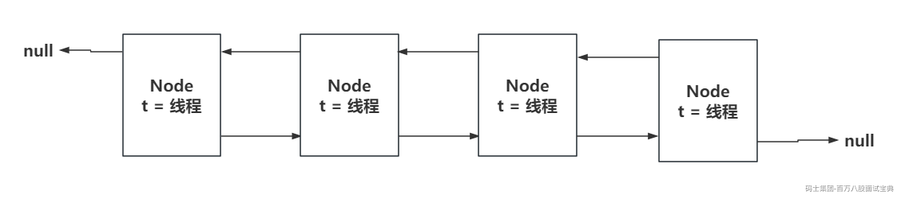
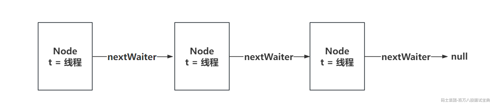
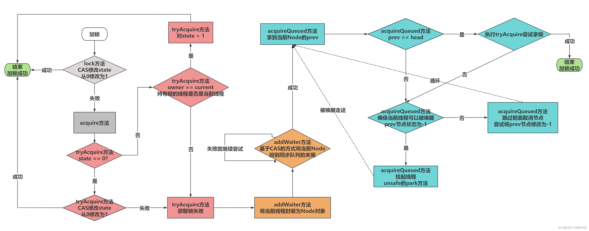
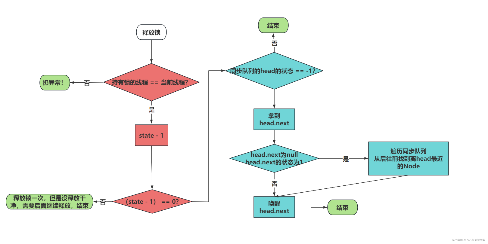

# **synchronized与Lock锁**

synchronized和ReentrantLock都是Java中提供的互斥锁。

从功能上来说，你使用无论哪个，功能向都是一样的。

today主要分析这两种锁他的实现逻辑。

没把锁都聊两个维度的内容：

- 加锁（排队等待）和释放锁

- wait&notify、await&signal

## 一、ReentrantLock锁特性

要聊ReentrantLock，首先大家必须要知道AQS是什么鬼。

AQS就是JUC包下的一个抽象类，很多JUC包下的工具都是基于AQS实现的，内部有三个核心内容：

- **state：** ReentrantLock需要获取锁资源，需要将state基于CAS的方式，从0改为1，就代表获取锁资源成功了。state为0，代表没有线程持有锁资源，大于0，代表有线程持有锁资源。

```plain
private volatile int state;
```

- **同步队列（双向链表）：** 获取ReentrantLock锁资源，但是当前锁资源被其他线程持有了，当前线程就需要排队等待，在同步队列中去排队。

- **单向链表：** 当持有ReentrantLock锁的线程，执行了await方法后，会将持有锁的线程封装为Node，释放锁资源，扔到这个单向链表里。等待被signal唤醒，唤醒后就扔会同步队列。

## 二、ReentrantLock锁底层

### 2.1 加锁流程

这里咱们以非公平锁的方式，去看lock方法加锁的过程。



### 2.2 释放锁流程



### // 2.3 await流程

### // 2.4 signal流程

## 三、synchronized特性

只聊synchronized的重量级锁的内容。

在synchronized的重量级锁中，也有类似于AQS的内容。

直接查看openjdk中的ObjectMonitor.hpp中提供的一些核心内容

<https://hg.openjdk.org/jdk8u/jdk8u/hotspot/file/69087d08d473/src/share/vm/runtime/objectMonitor.hpp>

```cpp
ObjectMonitor() {
    _header       = NULL;
    _count        = 0;
    _waiters      = 0,      // WaitSet里等待的线程个数。今儿不涉及
    _recursions   = 0;      // 跟AQS的state一样。
    _object       = NULL;
    _owner        = NULL;   // 跟AQS的exclusiveOwnerThread一样
    _WaitSet      = NULL;   // 类似于AQS里的单向链表（双向链表） 今儿不涉及
    _WaitSetLock  = 0 ;
    _Responsible  = NULL ;
    _succ         = NULL ;
    _cxq          = NULL ;  // 类似于AQS里的同步队列（单向链表）。拿锁失败先扔cxq
    FreeNext      = NULL ;
    _EntryList    = NULL ;  // 类似于AQS里的同步队列（双向链表）。释放锁，可能会将cxq排队的节点扔到EntryList
    _SpinFreq     = 0 ;
    _SpinClock    = 0 ;
    OwnerIsThread = 0 ;
    _previous_owner_tid = 0;
}
```

## 四、synchronized底层

### 4.1 加锁流程

同步代码块转换为指令后，可以看到，加锁的指令是monitorenter指令。对应到C++里面的函数，就是他

<https://hg.openjdk.org/jdk8u/jdk8u/hotspot/file/69087d08d473/src/share/vm/runtime/objectMonitor.cpp>

```cpp
void ATTR ObjectMonitor::enter(TRAPS) {…………}
```

#### 4.1.1 分析enter函数

```cpp
// monitorenter指令入口的函数
void ATTR ObjectMonitor::enter(TRAPS) {、
  // Self就是当前线程
  Thread * const Self = THREAD ;
  void * cur ;

  // 这里是基于CAS，将ObjectMontor中的_owner从NULL修改为Self，返回的原值
  cur = Atomic::cmpxchg_ptr (Self, &_owner, NULL) ;

  // 如果返回NULL，证明从NULL修改为当前线程成功了！
  if (cur == NULL) {
     // 代表拿锁成功。
     assert (_recursions == 0   , "invariant") ;
     assert (_owner      == Self, "invariant") ;
     // 告辞！
     return ;
  }

  // 如果返回的Self，CAS失败了。持有锁的线程就是当前线程
  if (cur == Self) {
     // 对_recursions + 1，代表锁重入！
     _recursions ++ ;
     // 告辞！
     return ;
  }

  // 当前第一次来，代表是从轻量级锁升级过来的，这里也是直接设置好，锁升级操作！
  if (Self->is_lock_owned ((address)cur)) {
    assert (_recursions == 0, "internal state error");
    _recursions = 1 ;
    _owner = Self ;
    OwnerIsThread = 1 ;
    return ;
  }

  assert (Self->_Stalled == 0, "invariant") ;
  Self->_Stalled = intptr_t(this) ;

  // TrySpin,自旋锁（循环执行CAS），尝试获取锁资源！
  if (Knob_SpinEarly && TrySpin (Self) > 0) {
     assert (_owner == Self      , "invariant") ;
     assert (_recursions == 0    , "invariant") ;
     assert (((oop)(object()))->mark() == markOopDesc::encode(this), "invariant") ;
     Self->_Stalled = 0 ;
     // 说明自旋锁拿锁成功，告辞！
     return ;
  }

  assert (_owner != Self          , "invariant") ;
  assert (_succ  != Self          , "invariant") ;
  assert (Self->is_Java_thread()  , "invariant") ;
  JavaThread * jt = (JavaThread *) Self ;
  assert (!SafepointSynchronize::is_at_safepoint(), "invariant") ;
  assert (jt->thread_state() != _thread_blocked   , "invariant") ;
  assert (this->object() != NULL  , "invariant") ;
  assert (_count >= 0, "invariant") ;

  Atomic::inc_ptr(&_count);

  JFR_ONLY(JfrConditionalFlushWithStacktrace<EventJavaMonitorEnter> flush(jt);)
  EventJavaMonitorEnter event;
  if (event.should_commit()) {
    event.set_monitorClass(((oop)this->object())->klass());
    event.set_address((uintptr_t)(this->object_addr()));
  }

  {
    JavaThreadBlockedOnMonitorEnterState jtbmes(jt, this);

    Self->set_current_pending_monitor(this);

    DTRACE_MONITOR_PROBE(contended__enter, this, object(), jt);
    if (JvmtiExport::should_post_monitor_contended_enter()) {
      JvmtiExport::post_monitor_contended_enter(jt, this);
    }

    OSThreadContendState osts(Self->osthread());
    ThreadBlockInVM tbivm(jt);

    for (;;) {
      jt->set_suspend_equivalent();
      // 如果前面的几次操作没拿到锁，执行EnterI函数。
      // 再次尝试或者排队操作！
      EnterI (THREAD);

      if (!ExitSuspendEquivalent(jt)) break ;

          _recursions = 0 ;
      _succ = NULL ;
      exit (false, Self) ;

      jt->java_suspend_self();
    }
    Self->set_current_pending_monitor(NULL);
  }

  Atomic::dec_ptr(&_count);
  assert (_count >= 0, "invariant") ;
  Self->_Stalled = 0 ;

  assert (_recursions == 0     , "invariant") ;
  assert (_owner == Self       , "invariant") ;
  assert (_succ  != Self       , "invariant") ;
  assert (((oop)(object()))->mark() == markOopDesc::encode(this), "invariant") ;

  DTRACE_MONITOR_PROBE(contended__entered, this, object(), jt);
  if (JvmtiExport::should_post_monitor_contended_entered()) {
    JvmtiExport::post_monitor_contended_entered(jt, this);
  }

  if (event.should_commit()) {
    event.set_previousOwner((uintptr_t)_previous_owner_tid);
    event.commit();
  }

  if (ObjectMonitor::_sync_ContendedLockAttempts != NULL) {
     ObjectMonitor::_sync_ContendedLockAttempts->inc() ;
  }
}
```

#### 4.1.2 分析EnterI函数

```cpp
// 前面enter操作拿锁失败，走这
void ATTR ObjectMonitor::EnterI (TRAPS) {
    // Self是当前抢锁线程
    Thread * Self = THREAD ;
    assert (Self->is_Java_thread(), "invariant") ;
    assert (((JavaThread *) Self)->thread_state() == _thread_blocked   , "invariant") ;

    // 执行一次CAS尝试拿锁
    if (TryLock (Self) > 0) {
        // 拿锁成功
        assert (_succ != Self              , "invariant") ;
        assert (_owner == Self             , "invariant") ;
        assert (_Responsible != Self       , "invariant") ;
        // 告辞！
        return ;
    }

    DeferredInitialize () ;

    // 再次基于自旋的形式拿锁
    if (TrySpin (Self) > 0) {
        // 拿锁成功
        assert (_owner == Self        , "invariant") ;
        assert (_succ != Self         , "invariant") ;
        assert (_Responsible != Self  , "invariant") ;
        // 告辞！
        return ;
    }

    assert (_succ  != Self            , "invariant") ;
    assert (_owner != Self            , "invariant") ;
    assert (_Responsible != Self      , "invariant") ;

    // 拿锁失败，将线程Self封装为ObjectWaiter对象，也就是node
    ObjectWaiter node(Self) ;
    Self->_ParkEvent->reset() ;
    node._prev   = (ObjectWaiter *) 0xBAD ;
    // 将node状态设置为cxq，代表一会要扔到_cxq单向链表里！
    node.TState  = ObjectWaiter::TS_CXQ ;

    ObjectWaiter * nxt ;
    for (;;) {
        node._next = nxt = _cxq ;
        // 基于CAS的方式，将封装好的Node，扔到cxq的后面
        if (Atomic::cmpxchg_ptr (&node, &_cxq, nxt) == nxt) break ;

        // 没扔进去，再挣扎一下，尝试拿个锁
        if (TryLock (Self) > 0) {
            // 拿锁成功
            assert (_succ != Self         , "invariant") ;
            assert (_owner == Self        , "invariant") ;
            assert (_Responsible != Self  , "invariant") ;
            // 告辞！
            return ;
        }
    }

    if ((SyncFlags & 16) == 0 && nxt == NULL && _EntryList == NULL) {
        Atomic::cmpxchg_ptr (Self, &_Responsible, NULL) ;
    }

    TEVENT (Inflated enter - Contention) ;
    int nWakeups = 0 ;
    int RecheckInterval = 1 ;

    for (;;) {
        // 再挣扎一下。
        if (TryLock (Self) > 0) break ;
        assert (_owner != Self, "invariant") ;

        if ((SyncFlags & 2) && _Responsible == NULL) {
           Atomic::cmpxchg_ptr (Self, &_Responsible, NULL) ;
        }

        // 如果前面挣扎失败，这里就会涉及到线程的挂起！
        if (_Responsible == Self || (SyncFlags & 1)) {
            TEVENT (Inflated enter - park TIMED) ;
            Self->_ParkEvent->park ((jlong) RecheckInterval) ;
            RecheckInterval *= 8 ;
            if (RecheckInterval > 1000) RecheckInterval = 1000 ;
        } else {
            TEVENT (Inflated enter - park UNTIMED) ;
            Self->_ParkEvent->park() ;
        }

        // 到这就是被唤醒了，抢锁！
        if (TryLock(Self) > 0) break ;

        TEVENT (Inflated enter - Futile wakeup) ;
        if (ObjectMonitor::_sync_FutileWakeups != NULL) {
           ObjectMonitor::_sync_FutileWakeups->inc() ;
        }
        ++ nWakeups ;

        if ((Knob_SpinAfterFutile & 1) && TrySpin (Self) > 0) break ;

        if ((Knob_ResetEvent & 1) && Self->_ParkEvent->fired()) {
           Self->_ParkEvent->reset() ;
           OrderAccess::fence() ;
        }
        if (_succ == Self) _succ = NULL ;

        OrderAccess::fence() ;
    }

    assert (_owner == Self      , "invariant") ;
    assert (object() != NULL    , "invariant") ;

    UnlinkAfterAcquire (Self, &node) ;
    if (_succ == Self) _succ = NULL ;

    assert (_succ != Self, "invariant") ;
    if (_Responsible == Self) {
        _Responsible = NULL ;
        OrderAccess::fence(); // Dekker pivot-point
    }
    if (SyncFlags & 8) {
       OrderAccess::fence() ;
    }
    return ;
}
```

#### 4.1.3 分析tryLock&trySpin函数

tryLock的逻辑

```cpp
// tryLock尝试拿锁的逻辑
int ObjectMonitor::TryLock (Thread * Self) {
   for (;;) {
      void * own = _owner ;
      // 有线程持有锁，直接告辞，没抢到锁。
      if (own != NULL) return 0 ;
      // 如果own是NULL，直接CAS尝试一波
      if (Atomic::cmpxchg_ptr (Self, &_owner, NULL) == NULL) {
         // 拿锁成功
         assert (_recursions == 0, "invariant") ;
         assert (_owner == Self, "invariant") ;
         // 告辞！
         return 1 ;
      }
      // TODO记得优化！！ 返回-1，拿锁失败！
      if (true) return -1 ;
   }
}
```

trySpin的逻辑

```cpp
int ObjectMonitor::TrySpin_VaryDuration (Thread * Self) {
    // 拿到自旋的次数
    int ctr = Knob_FixedSpin ;
    if (ctr != 0) {
        // 基于tryLock开始自旋尝试拿锁，成功返回1
        while (--ctr >= 0) {
            if (TryLock (Self) > 0) return 1 ;
            SpinPause () ;
        }
        // 循环结束没拿到，返回0
        return 0 ;
    }
    // 省略一堆代码
}
```

### 4.2 释放锁流程

再次查看一个函数，前面看到过指令，加锁是monitorenter，释放锁是monitorexit。

同理，这里要查看的函数是exit

```cpp
void ATTR ObjectMonitor::exit(bool not_suspended, TRAPS) {}
```

```cpp
// 释放锁的流程
void ATTR ObjectMonitor::exit(bool not_suspended, TRAPS) {
   // 拿线程
   Thread * Self = THREAD ;
   // 持有线程的不是当前这个线程。没持有锁，想释放锁？？？
   if (THREAD != _owner) {
     // 说明是锁升级过来的，让当前线程持有这个锁。
     if (THREAD->is_lock_owned((address) _owner)) {
       assert (_recursions == 0, "invariant") ;
       _owner = THREAD ;
       _recursions = 0 ;
       OwnerIsThread = 1 ;
     } else {
       // 持有锁的线程不是当前线程，甩你一脸异常
       TEVENT (Exit - Throw IMSX) ;
       assert(false, "Non-balanced monitor enter/exit!");
       if (false) {
          THROW(vmSymbols::java_lang_IllegalMonitorStateException());
       }
       return;
     }
   }
   
   // 一次释放不干净，先--一波。
   if (_recursions != 0) {
     _recursions--;   
     TEVENT (Inflated exit - recursive) ;
     return ;
   }

   if ((SyncFlags & 4) == 0) {
      _Responsible = NULL ;
   }

#if INCLUDE_JFR
   if (not_suspended && EventJavaMonitorEnter::is_enabled()) {
    _previous_owner_tid = JFR_THREAD_ID(Self);
   }
#endif

   for (;;) {
      assert (THREAD == _owner, "invariant") ;

      // 走这个策略。
      if (Knob_ExitPolicy == 0) {
         // 看样子就是释放锁！！
         OrderAccess::release_store_ptr (&_owner, NULL) ;   // drop the lock
         OrderAccess::storeload() ;                         // See if we need to wake a successor
         if ((intptr_t(_EntryList)|intptr_t(_cxq)) == 0 || _succ != NULL) {
            TEVENT (Inflated exit - simple egress) ;
            return ;
         }
         TEVENT (Inflated exit - complex egress) ;

         // 重新获取锁资源！
         // 为了可以操作_cxq和_EntryList
         if (Atomic::cmpxchg_ptr (THREAD, &_owner, NULL) != NULL) {
            // 如果重新获取失败了，当前其他线程拿到了！直接告辞！
            return ;
         }
         TEVENT (Exit - Reacquired) ;
      } else {
         if ((intptr_t(_EntryList)|intptr_t(_cxq)) == 0 || _succ != NULL) {
            OrderAccess::release_store_ptr (&_owner, NULL) ;   // drop the lock
            OrderAccess::storeload() ;
            // Ratify the previously observed values.
            if (_cxq == NULL || _succ != NULL) {
                TEVENT (Inflated exit - simple egress) ;
                return ;
            }
            if (Atomic::cmpxchg_ptr (THREAD, &_owner, NULL) != NULL) {
               TEVENT (Inflated exit - reacquired succeeded) ;
               return ;
            }
            TEVENT (Inflated exit - reacquired failed) ;
         } else {
            TEVENT (Inflated exit - complex egress) ;
         }
      }

      guarantee (_owner == THREAD, "invariant") ;

      // 声明ObjectWaiter变量
      ObjectWaiter * w = NULL ;
      int QMode = Knob_QMode ;

      // QMode == 2，并且cxq里面有排队的，直接唤醒cxq头部的节点
      if (QMode == 2 && _cxq != NULL) {
          // 从cxq头部拿到等待的线程，直接唤醒的干活
          w = _cxq ;
          assert (w != NULL, "invariant") ;
          assert (w->TState == ObjectWaiter::TS_CXQ, "Invariant") ;
          // 具体的唤醒
          ExitEpilog (Self, w) ;
          return ;
      }
      // QMode == 3，并且cxq不为null。  将cxq里的节点扔到EntryList尾部
      if (QMode == 3 && _cxq != NULL) {
          // 拿到cxq链表
          w = _cxq ;
          // 清空cxq链表里的东西
          for (;;) {
             assert (w != NULL, "Invariant") ;
             ObjectWaiter * u = (ObjectWaiter *) Atomic::cmpxchg_ptr (NULL, &_cxq, w) ;
             if (u == w) break ;
             w = u ;
          }
          assert (w != NULL              , "invariant") ;
          ObjectWaiter * q = NULL ;
          ObjectWaiter * p ;
          // 将ObjectWaiter设置为ENTER，要进入EntryList中
          for (p = w ; p != NULL ; p = p->_next) {
              guarantee (p->TState == ObjectWaiter::TS_CXQ, "Invariant") ;
              p->TState = ObjectWaiter::TS_ENTER ;
              p->_prev = q ;
              q = p ;
          }
          // 将cxq里的内容扔到EntryList的尾部
          ObjectWaiter * Tail ;
          for (Tail = _EntryList ; Tail != NULL && Tail->_next != NULL ; Tail = Tail->_next) ;
          if (Tail == NULL) {
              _EntryList = w ;
          } else {
              Tail->_next = w ;
              w->_prev = Tail ;
          }
      }
      // QMode == 4，并且cxq不为null。  将cxq里的节点扔到EntryList头部
      if (QMode == 4 && _cxq != NULL) {
          w = _cxq ;
          for (;;) {
             assert (w != NULL, "Invariant") ;
             ObjectWaiter * u = (ObjectWaiter *) Atomic::cmpxchg_ptr (NULL, &_cxq, w) ;
             if (u == w) break ;
             w = u ;
          }
          assert (w != NULL              , "invariant") ;

          ObjectWaiter * q = NULL ;
          ObjectWaiter * p ;
          for (p = w ; p != NULL ; p = p->_next) {
              guarantee (p->TState == ObjectWaiter::TS_CXQ, "Invariant") ;
              p->TState = ObjectWaiter::TS_ENTER ;
              p->_prev = q ;
              q = p ;
          }

          // Prepend the RATs to the EntryList
          if (_EntryList != NULL) {
              q->_next = _EntryList ;
              _EntryList->_prev = q ;
          }
          _EntryList = w ;
      }

      // 拿到EntryList
      w = _EntryList  ;
      // EntryList不为null
      if (w != NULL) {
          assert (w->TState == ObjectWaiter::TS_ENTER, "invariant") ;
          // 唤醒EntryList中的Node
          ExitEpilog (Self, w) ;
          return ;
      }

      // 如果EntryList没节点，看下cxq。
      w = _cxq ;
      // 如果cxq也为null，跳出这次循环，利用循环前面的操作结束当前唤醒操作
      if (w == NULL) continue ;

      // 如果cxq不为null，清空cxq。
      for (;;) {
          assert (w != NULL, "Invariant") ;
          ObjectWaiter * u = (ObjectWaiter *) Atomic::cmpxchg_ptr (NULL, &_cxq, w) ;
          if (u == w) break ;
          w = u ;
      }
      // 准备将cxq里的节点都扔到EntryList
      TEVENT (Inflated exit - drain cxq into EntryList) ;

      assert (w != NULL              , "invariant") ;
      assert (_EntryList  == NULL    , "invariant") ;

      // 如果QMode == 1，将cxq里的Node反转，扔到EntryList
      if (QMode == 1) {
         // QMode == 1 : drain cxq to EntryList, reversing order
         // We also reverse the order of the list.
         ObjectWaiter * s = NULL ;
         ObjectWaiter * t = w ;
         ObjectWaiter * u = NULL ;
         while (t != NULL) {
             guarantee (t->TState == ObjectWaiter::TS_CXQ, "invariant") ;
             t->TState = ObjectWaiter::TS_ENTER ;
             u = t->_next ;
             t->_prev = u ;
             t->_next = s ;
             s = t;
             t = u ;
         }
         _EntryList  = s ;
         assert (s != NULL, "invariant") ;
      } else {
         // QMode == 0 or QMode == 2，不等于1，直接将cxq帅到EntryList
         _EntryList = w ;
         ObjectWaiter * q = NULL ;
         ObjectWaiter * p ;
         for (p = w ; p != NULL ; p = p->_next) {
             guarantee (p->TState == ObjectWaiter::TS_CXQ, "Invariant") ;
             p->TState = ObjectWaiter::TS_ENTER ;
             p->_prev = q ;
             q = p ;
         }
      }

      if (_succ != NULL) continue;

      // 将cxq的节点扔到EntryList后，如果EntryList不为null
      w = _EntryList  ;
      if (w != NULL) {
          guarantee (w->TState == ObjectWaiter::TS_ENTER, "invariant") ;
          // 唤醒EntryList中的节点
          ExitEpilog (Self, w) ;
          return ;
      }
   }
}
```
