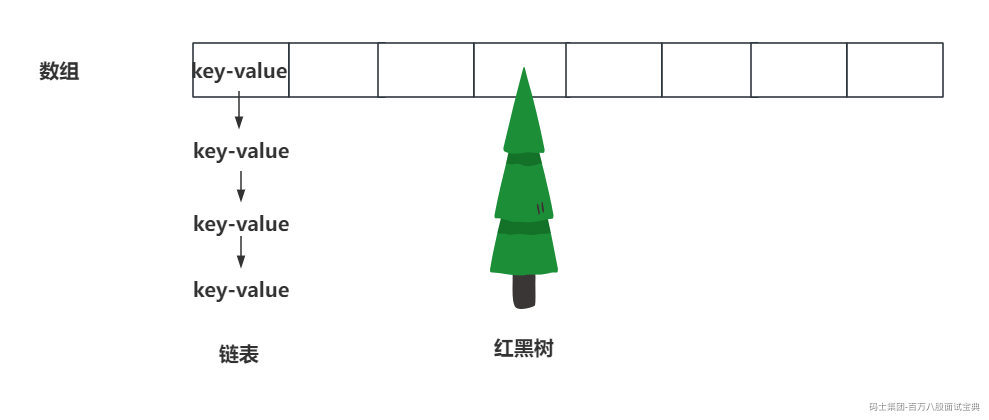

# **并发编程-CHM源码解析**

## 一、CHM写入数据流程

一般在项目中使用ConcurrentHashMap时，都是作为JVM缓存使用的。

ConcurrentHashMap是线程安全的。如果你项目涉及到了多个线程都会操作key-value结构时，别用HashMap，一定要上ConcurrentHashMap。

在方法局部内，只有当前线程使用时，才可以用HashMap。

ConcurrentHashMap的存储结构？

存储结构是数组 + 链表 + 红黑树。



**put操作流程：**

- 将key进行散列运算，计算出具体的hash值。后面要基于这个hash值确定数据存放的索引位置。

- 循环开始-------------------------------------------------------------------

- 查看ConcurrentHashMap的 **数组是否已经初始化** 。（数组全局唯一，懒加载）

- 初始化就继续尝试存放数据。

- 没初始化，那就先尝试将数组new出来。

- 基于hash值，**确认数据要存放的索引位置** 。

- 如果数组索引位置没数据，将当前数据扔进去。优先将key-value封装为一个Node对象。这里为了保证线程安全， **直接采用CAS的方式，将当前索引位置的null替换为指定的Node数据** 。

- 如果CAS成功，循环结束

- 如果CAS失败，重新走循环

- 如果数组索引有数据，往后走其他流程

- 如果有数据，查看当前数据的状态 **是否是扩容的情况** 。MOVED（hash = -1）

- 如果正在扩容，当前线程去 **协助扩容** ，加快扩容速度。协助扩容结束后，重新走循环。

- 如果有数据，没有扩容操作影响到当前线程。

- 加锁，基于数组索引位置的Node对象作为 **synchronized的锁** 。

- 将数据 **挂到链表的末端** 。

- 添加数据到链表后，会查看链表长度，**是否达到了8个，就需要尝试链表转红黑树** 。CHM要求必须数组长度 ≥ 64 && 链表长度达到8才会转换。

- 将数据 **添加到红黑树** 结构中。TREEBIN（hash = -2）

- 循环结束---------------------------------------------------------------------

- 需要记录元素个数，为了保证线程安全，这里采用了 **LongAdder做计数器** 。

- 添加数据结束。

## 二、CHM扩容流程&协助扩容

ConcurrentHashMap扩容操作只有两个事情：

- 构建新数组，长度是老数组长度的二倍。（new）

- 将老数组中的数据，迁移到新数组中。

**区分第一个来扩容和协助扩容的方式：**

为了区分谁是第一个来扩容的线程，谁是来协助扩容的线程，需要掌握一个属性，这个属性就是sizeCtl

```java
private transient volatile int sizeCtl;
```

第一个来扩容的线程会优先修改sizeCtl的值，将其修改为一个＜-1的值。

其他所有来协助扩容的线程，发现sizeCtl＜-1，直接对sizeCtl做 + 1操作，代表我来扩容了。

修改sizeCtl的操作，是基于CAS完成的。

**第一个来扩容的线程，由他去初始化新数组，并且做迁移数据的操作。协助扩容的线程，就是来帮忙将老数组的数据迁移到新数组的。**

---

**整体扩容的流程（以第一个来扩容的线程）**

- 计算每次迁移多长索引位置的数据到新数组（ **步长** ），会根据CPU内核数和数组长度来计算，最小是16。

- 会由 **第一个来扩容的线程** ， **初始化新数组** ，长度为原来的二倍。

- 迁移数据循环开始-------------------------------------------------------------------------

- 扩容的线程开始 **领取迁移数据的任务** 。

- 领取到任务的，准备干活。

- 没领取到任务，可以退出扩容

- 没领取到的查看一下， **扩容结束了么？**

- 结束了，说明当前线程是最后一个退出扩容的线程， **整体检查一遍** ，退出滴干活。

- 没结束呢，**sizeCtl - 1** ，退出的滴干活。

- 领取到迁移数据操作，在迁移任务中某一个索引位置时，会有不同的情况

- 当前 **索引位置没数据** ，直接仍一个MOVED（hash = -1）

- 当前 **索引位置是MOVED** ，啥事不做。（扩容操作最后会有一个大检查）

- 当前位置有数据，锁住当前位置：

- **链表迁移新数组**

- **红黑树迁移到新数组** （红黑树会保留一个双向链表，利用双向链表迁移的）

- 迁移数据循环结束-------------------------------------------------------------------------

## 三、CHM查询数据流程

ConcurrentHashMap本来就是作为JVM缓存使用的，对查询速度要求极高。所以在ConcurrentHashMap中 **查询操作永远不会阻塞** 。无论什么情况，都能去查数据。

查询数据的操作无非就是几种情况：

- 数据在数组上呢，查的嗷嗷快。

- 数据在链表上呢，next，next的找，找到返回。

- 如果数组上的Node是MOVED状态， **代表数据已经迁移到新数组上了，直接去新数组上查询数据** 。

- 如果数组上的Node是RESERVED状态， **代表当前位置被占了，但是value还在计算中，返回null** 。

- 数据在红黑树上呢：

- 如果此时 **有写线程正在平衡红黑树或者是等待平衡红黑树，那么读线程会去查询保留的双向链表** 。

- 如果此时 **没有写线程正在平衡或等待平衡操作，直接去红黑树中找数据** 。（如果此时有写线程想操作红黑树，那么需要等到读线程完毕后，才可以操作）

lockState == 1：有写线程正在平衡红黑树。

lockState == 2：代表写线程在等着平衡红黑树。

lockState >= 4：代表有读线程在读取红黑树中的数据。（读线程来读数据，就对lockState + 4）

**红黑树是一个平衡的二叉树，怎么保持平衡的？**

为了保证平衡，写操作可能会旋转某个节点，导致节点的指针发生变化。如果此时读线程在红黑树中遍历找数据，结果写线程改变了红黑树的指针，导致无法找到对应的数据。
