# RocketMQ入门与运用实战

## 为什么要用RocketMQ？

今天主要讲的是

<https://rocketmq.apache.org/zh/docs/4.x/>

MQ三大功能：异步、解耦、流量削峰

### **异步与解耦**

系统的耦合性越高，容错性就越低。以电商应用为例，用户创建订单后，如果耦合调用库存系统、物流系统、支付系统，任何一个子系统出了故障或者因为升级等原因暂时不可用，都会造成下单操作异常，影响用户使用体验

使用消息中间件，系统的耦合性就会提高了。比如物流系统发生故障，需要几分钟才能来修复，在这段时间内，物流系统要处理的数据被缓存到消息队列中，用户的下单操作正常完成。当物流系统恢复后，继续处理存放在消息队列中的订单消息即可，终端系统感知不到物流系统发生过几分钟故障。

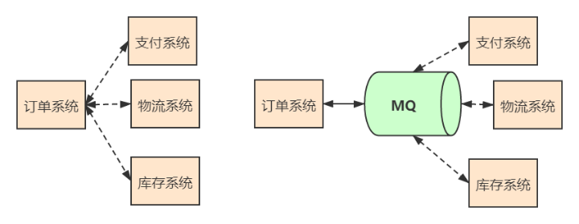

### **流量削峰**

应用系统如果遇到系统请求流量的瞬间猛增，有可能会将系统压垮。有了消息队列可以将大量请求缓存起来，分散到很长一段时间处理，这样可以大大提到系统的稳定性和用户体验。

**互联网公司的大促场景（双十一、店庆活动、秒杀活动）都会使用到** **MQ** **。**

*(⚠️ 图片缺失:源知识库原图已失效)*

### **数据分发**

通过消息队列可以让数据在多个系统更加之间进行流通。数据的产生方不需要关心谁来使用数据，只需要将数据发送到消息队列，数据使用方直接在消息队列中直接获取数据即可。

接口调用的弊端，无论是新增系统，还是移除系统，代码改造工作量都很大。

使用MQ做数据分发好处，无论是新增系统，还是移除系统，代码改造工作量较小。

**所以使用****MQ****做数据的分发，可以提高团队开发的效率。**

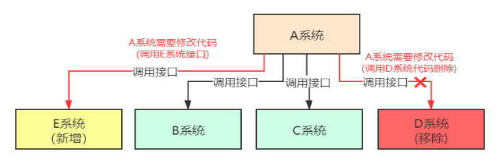

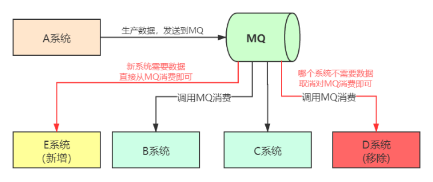

## 安装与启动

在讲课的时候，官网推荐的4.X是Apache RocketMQ 4.9.4，我们就用这个。

安装：<https://rocketmq.apache.org/zh/docs/4.x/introduction/02quickstart>

### Linux 的安装

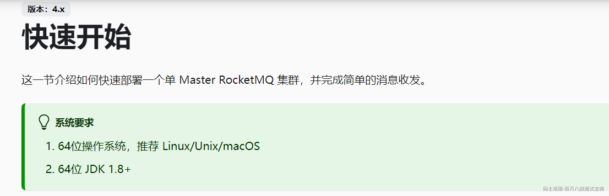

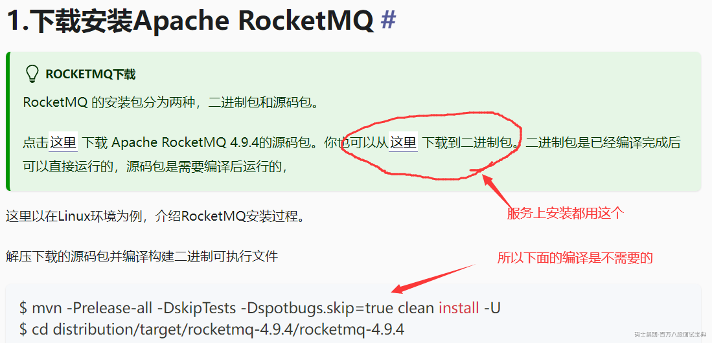

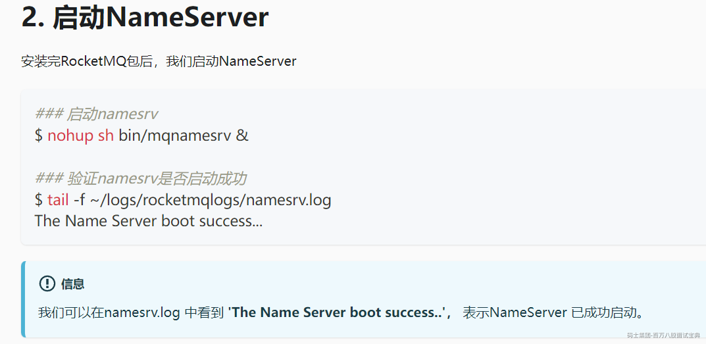

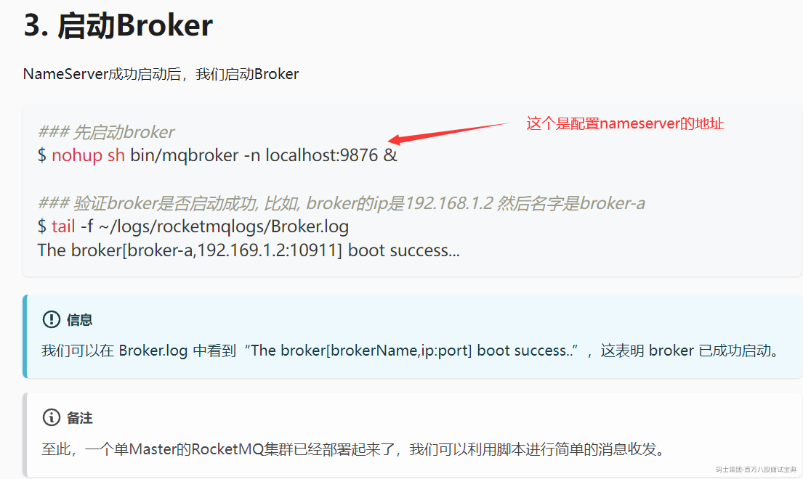

#### 注意事项

一般的Linux服务按照这种安装是可以，我总结一下一些可能会遇到的坑。

1、记得Linux上修改文件权限：命令如下：chmod -R 777 /home/linux

2、Linux要关闭防火墙，放开对应的访问端口：

NameServer的端口9876 。Broker端口 10911 (vip通道端口:10909)

3、RocketMQ默认的内存较大，启动Broker如果因为内存不足失败，需要编辑如下两个配置文件，修改JVM内存大小。

编辑runbroker.sh和runserver.sh修改默认JVM大小

*(⚠️ 图片缺失:源知识库原图已失效)*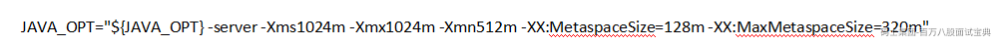

4、你的Linux有可能有多网卡，那么就一定要配置外网地址：

修改broker.conf 增加：brokerIP1=192.168.56.101 之类。

5、可以指定配置文件启动：

nohup sh mqbroker -c ../conf/broker.conf -n 192.168.56.101:9876 autoCreateTopicEnable=true &

（默认把自动创建主题 开启。我记得是大部分版本默认这个是关闭的，不利于我们测试）

6、还有RocketMQ启动默认的文件是在默认用户文件的store文件下，日志文件是在默认用户文件的logs文件下。

### Windows的安装

#### **配置环境变量**

变量名：ROCKETMQ\_HOME

变量值：MQ解压路径\MQ文件夹名

*(⚠️ 图片缺失:源知识库原图已失效)*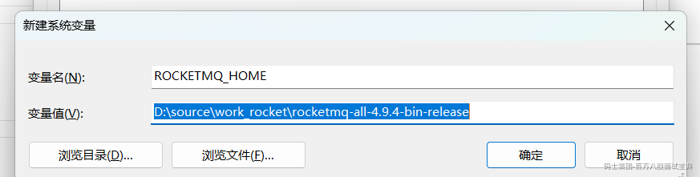

启动：

#### **1.** **启动NAMESERVER**

```plain
 Cmd命令框执行进入至‘MQ文件夹\bin’下，然后执行‘start mqnamesrv.cmd’，启动NAMESERVER。成功后会弹出提示框，此框勿关闭。
```

*(⚠️ 图片缺失:源知识库原图已失效)*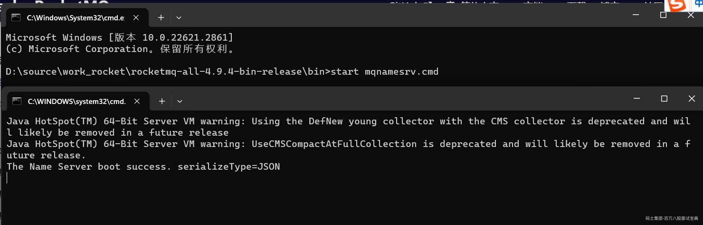

#### **2.** **启动BROKER**

```plain
 Cmd命令框执行进入至‘MQ文件夹\bin’下，然后执行‘start mqbroker.cmd -n 127.0.0.1:9876 autoCreateTopicEnable=true’，启动BROKER。成功后会弹出提示框，此框勿关闭。
```

*(⚠️ 图片缺失:源知识库原图已失效)*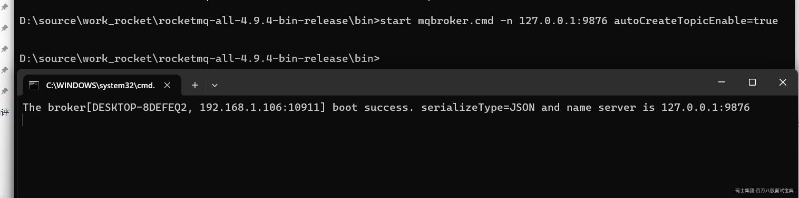

假如弹出提示框提示‘错误: 找不到或无法加载主类 xxxxxx’。打开runbroker.cmd，然后将‘%CLASSPATH%’加上英文双引号。保存并重新执行start语句。

*(⚠️ 图片缺失:源知识库原图已失效)*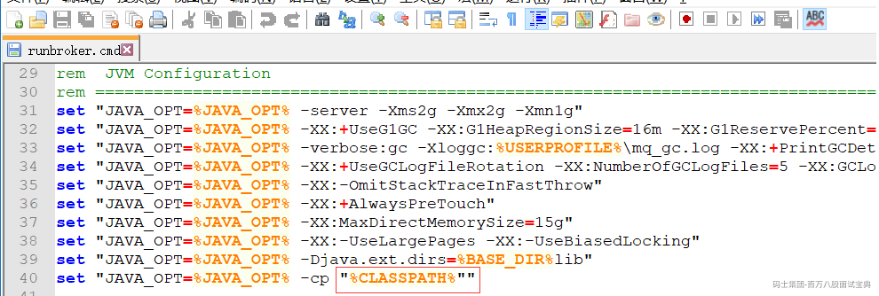

再次启动

*(⚠️ 图片缺失:源知识库原图已失效)*一般成功启动后，RocketMQ的存储文件放这里

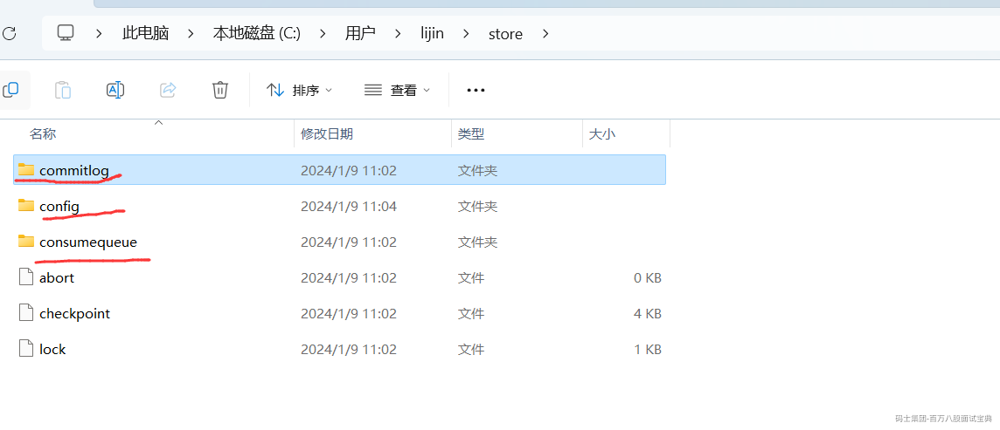

日志文件放这里：

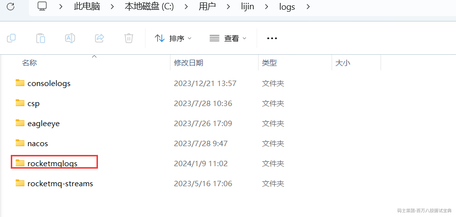

如果启动正常，观察以下两个文件即可：

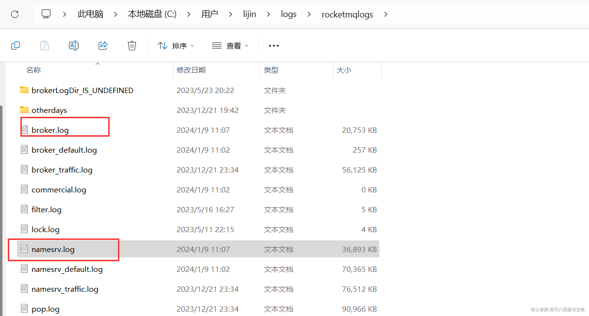

### 控制台安装

控制台分为新旧版本，RocketMQ >= 5.0使用新版本控制台，RocketMQ< 5.0时，使用旧版本

老的地址：<https://codeload.github.com/apache/rocketmq-externals/zip/master>

<https://rocketmq.apache.org/zh/docs/4.x/deployment/03Dashboard>

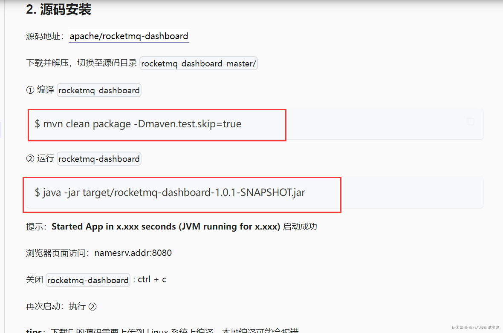

前面的mvn 要多试一次，因为有些拉包是外网拉的，稳定要差一些。

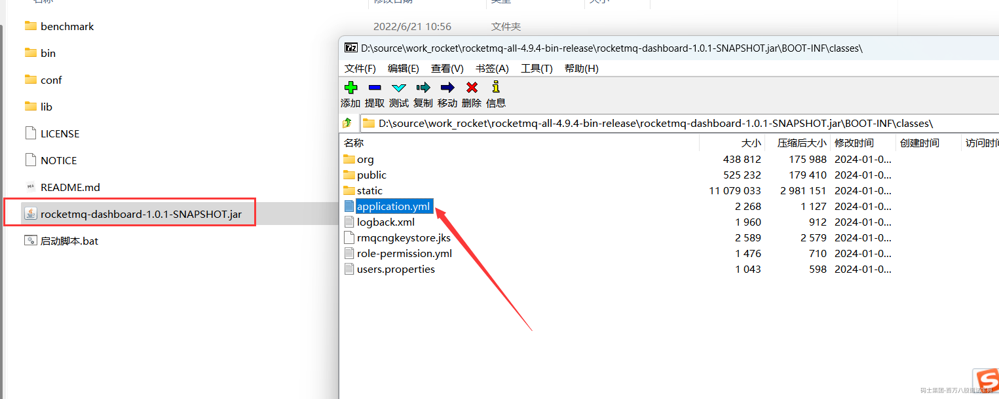

然后打包后，这个里面可以找到配置文件，利用7z之类的工具可以直接修改jar里面的配置文件。

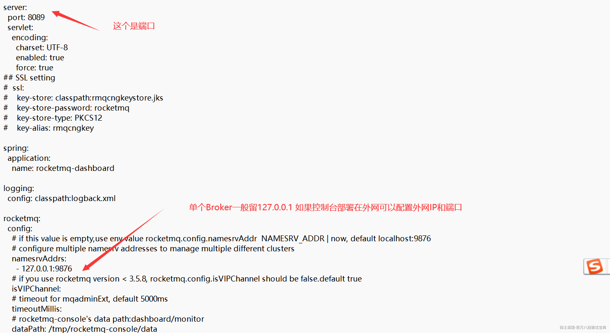

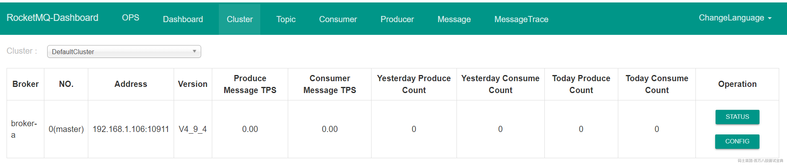

## RocketMQ核心概念与运用

<https://rocketmq.apache.org/zh/docs/4.x/introduction/03whatis>

### RocketMQ基础模型

一个最简单的RocketMQ的消息系统模型，包括 **生产者 (Producer)** ， **消费者 (Consumer)** ，中间进行基于 **消息主题（Topic）** 的消息传送。

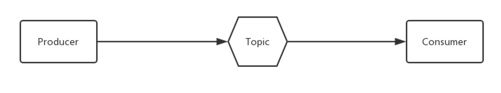

**生产者：**

负责生产消息，一般由业务系统负责生产消息。一个消息生产者会把业务应用系统里产生的消息发送到broker服务器。RocketMQ提供多种发送方式，同步发送、异步发送、顺序发送、单向发送。

**消费者：**

负责消费消息，一般是后台系统负责异步消费。一个消息消费者会从Broker服务器拉取消息、并将其提供给应用程序。从用户应用的角度而言提供了两种消费形式：拉取式消费、推动式消费。

**主题：**

表示一类消息的集合，每个主题包含若干条消息，每条消息只能属于一个主题，是RocketMQ进行消息订阅的基本单位。

### 扩展后的消息模型

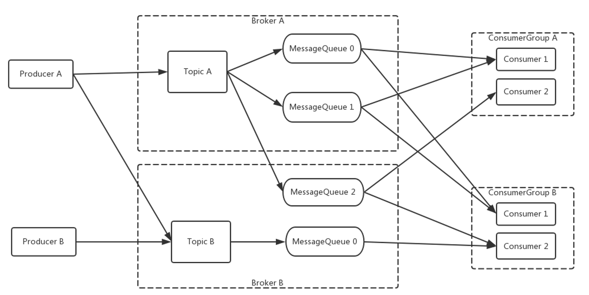

扩展后的消息模型，包括 **两个生产者** ， **两个消息Topic** ，以及**两组消费者 Comsumer**

- 为了消息写入能力的 **水平扩展** ，RocketMQ 对 Topic进行了分区，这种操作被称为 **队列** （MessageQueue）。

- 为了消费能力的 **水平扩展** ，ConsumerGroup的概念应运而生。

相同的ConsumerGroup下的消费者主要有两种负载均衡模式，即 **广播模式** ，和 **集群模式**

在集群模式下，同一个 ConsumerGroup 中的 Consumer 实例是负载均衡消费，如图中 ConsumerGroupA 订阅 TopicA，TopicA 对应 3个队列，则 GroupA 中的 Consumer1 消费的是 MessageQueue 0和 MessageQueue 1的消息，Consumer2是消费的是MessageQueue2的消息。

在广播模式下，同一个 ConsumerGroup 中的每个 Consumer 实例都处理全部的队列。需要注意的是，广播模式下因为每个 Consumer 实例都需要处理全部的消息，因此这种模式仅推荐在通知推送、配置同步类小流量场景使用

### RocketMQ的部署模型

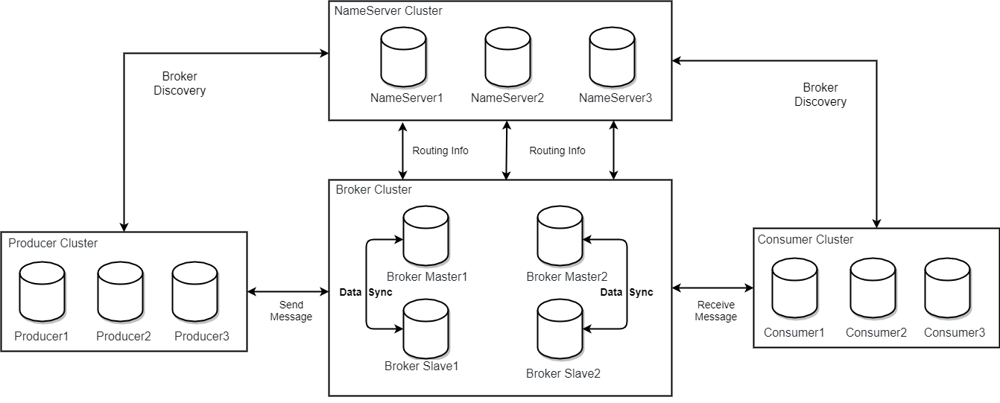

#### 生产者 Producer

发布消息的角色。Producer通过 MQ 的负载均衡模块选择相应的 Broker 集群队列进行消息投递，投递的过程支持快速失败和重试。

#### **消费者 Consumer**

消息消费的角色。

- 支持以推（push），拉（pull）两种模式对消息进行消费。

- 同时也支持**集群方式**和广播方式的消费。

- 提供实时消息订阅机制，可以满足大多数用户的需求。

#### 名字服务器 **NameServer**

NameServer是一个简单的 Topic 路由注册中心，支持 Topic、Broker 的动态注册与发现。

主要包括两个功能：

- **Broker管理** ，NameServer接受Broker集群的注册信息并且保存下来作为路由信息的基本数据。然后提供心跳检测机制，检查Broker是否还存活；

- **路由信息管理** ，每个NameServer将保存关于 Broker 集群的整个路由信息和用于客户端查询的队列信息。Producer和Consumer通过NameServer就可以知道整个Broker集群的路由信息，从而进行消息的投递和消费。

NameServer通常会有多个实例部署，各实例间相互不进行信息通讯。Broker是向每一台NameServer注册自己的路由信息，所以每一个NameServer实例上面都保存一份完整的路由信息。当某个NameServer因某种原因下线了，客户端仍然可以向其它NameServer获取路由信息。

#### 代理服务器 Broker

Broker主要负责消息的存储、投递和查询以及服务高可用保证。

NameServer几乎无状态节点，因此可集群部署，节点之间无任何信息同步。Broker部署相对复杂。

在 Master-Slave 架构中，Broker 分为 Master 与 Slave。一个Master可以对应多个Slave，但是一个Slave只能对应一个Master。Master 与 Slave 的对应关系通过指定相同的BrokerName，不同的BrokerId 来定义，BrokerId为0表示Master，非0表示Slave。Master也可以部署多个。

- 每个 **Broker** 与 **NameServer** 集群中的所有节点建立长连接，定时注册 Topic 信息到所有 NameServer。

- **Producer** 与 **NameServer** 集群中的其中一个节点建立长连接，定期从 NameServer 获取Topic路由信息，并向提供 Topic 服务的 Master 建立长连接，且定时向 Master 发送心跳。Producer 完全无状态。

- **Consumer** 与 **NameServer** 集群中的其中一个节点建立长连接，定期从 NameServer 获取 Topic 路由信息，并向提供 Topic 服务的 Master、Slave 建立长连接，且定时向 Master、Slave发送心跳。Consumer 既可以从 Master 订阅消息，也可以从Slave订阅消息。

### RocketMQ集群工作流程

#### 1. 启动NameServer

启动NameServer。NameServer启动后监听端口，等待Broker、Producer、Consumer连接，相当于一个路由控制中心。

#### 2. 启动 Broker

启动 Broker。与所有 NameServer 保持长连接，定时发送心跳包。心跳包中包含当前 Broker 信息以及存储所有 Topic 信息。注册成功后，NameServer 集群中就有 Topic跟Broker 的映射关系。

#### 3. 创建 Topic

创建 Topic 时需要指定该 Topic 要存储在哪些 Broker 上，也可以在发送消息时自动创建Topic。

#### 4. 生产者发送消息

生产者发送消息。启动时先跟 NameServer 集群中的其中一台建立长连接，并从 NameServer 中获取当前发送的 Topic存在于哪些 Broker 上，轮询从队列列表中选择一个队列，然后与队列所在的 Broker建立长连接从而向 Broker发消息。

#### 5. 消费者接受消息

消费者接受消息。跟其中一台NameServer建立长连接，获取当前订阅Topic存在哪些Broker上，然后直接跟Broker建立连接通道，然后开始消费消息。

## 生产者

### 基本概念

#### 消息

RocketMQ 消息构成非常简单

- **topic** ，表示要发送的消息的主题。

- **body** 表示消息的存储内容

- **properties** 表示消息属性

- **transactionId** 会在事务消息中使用。

|  |  |  |  |
| --- | --- | --- | --- |
| 字段名 | 默认值 | 必要性 | 说明 |
| Topic | null | 必填 | 消息所属 topic 的名称 |
| Body | null | 必填 | 消息体 |
| Tags | null | 选填 | 消息标签，方便服务器过滤使用。目前只支持每个消息设置一个 |
| Keys | null | 选填 | 代表这条消息的业务关键词 |
| Flag | 0 | 选填 | 完全由应用来设置，RocketMQ 不做干预 |
| DelayTimeLevel | 0 | 选填 | 消息延时级别，0 表示不延时，大于 0 会延时特定的时间才会被消费 |
| WaitStoreMsgOK | true | 选填 | 表示消息是否在服务器落盘后才返回应答。 |

#### Tag

Topic 与 Tag 都是业务上用来归类的标识，区别在于 Topic 是一级分类，而 Tag 可以理解为是二级分类。使用 Tag 可以实现对 Topic 中的消息进行过滤。

提示

- Topic：消息主题，通过 Topic 对不同的业务消息进行分类。

- Tag：消息标签，用来进一步区分某个 Topic 下的消息分类，消息从生产者发出即带上的属性。

Topic 和 Tag 的关系如下图所示。

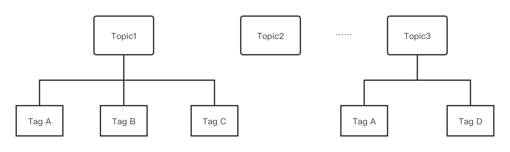

**什么时候该用 Topic，什么时候该用 Tag？**

可以从以下几个方面进行判断：

- 消息类型是否一致：如普通消息、事务消息、定时（延时）消息、顺序消息，不同的消息类型使用不同的 Topic，无法通过 Tag 进行区分。

- 业务是否相关联：没有直接关联的消息，如淘宝交易消息，京东物流消息使用不同的 Topic 进行区分；而同样是天猫交易消息，电器类订单、女装类订单、化妆品类订单的消息可以用 Tag 进行区分。

- 消息优先级是否一致：如同样是物流消息，盒马必须小时内送达，天猫超市 24 小时内送达，淘宝物流则相对会慢一些，不同优先级的消息用不同的 Topic 进行区分。

- 消息量级是否相当：有些业务消息虽然量小但是实时性要求高，如果跟某些万亿量级的消息使用同一个 Topic，则有可能会因为过长的等待时间而“饿死”，此时需要将不同量级的消息进行拆分，使用不同的 Topic。

总的来说，针对消息分类，您可以选择创建多个 Topic，或者在同一个 Topic 下创建多个 Tag。但通常情况下，不同的 Topic 之间的消息没有必然的联系，而 Tag 则用来区分同一个 Topic 下相互关联的消息，例如全集和子集的关系、流程先后的关系。

#### Keys

Apache RocketMQ 每个消息可以在业务层面的设置唯一标识码 keys 字段，方便将来定位消息丢失问题。 Broker 端会为每个消息创建索引（哈希索引），应用可以通过 topic、key 来查询这条消息内容，以及消息被谁消费。由于是哈希索引，请务必保证 key 尽可能唯一，这样可以避免潜在的哈希冲突。

```java
   // 订单Id
   String orderId = "20034568923546";
   message.setKeys(orderId);
```

#### 队列

为了支持高并发和水平扩展，需要对 Topic 进行分区，在 RocketMQ 中这被称为队列，一个 Topic 可能有多个队列，并且可能分布在不同的 Broker 上。

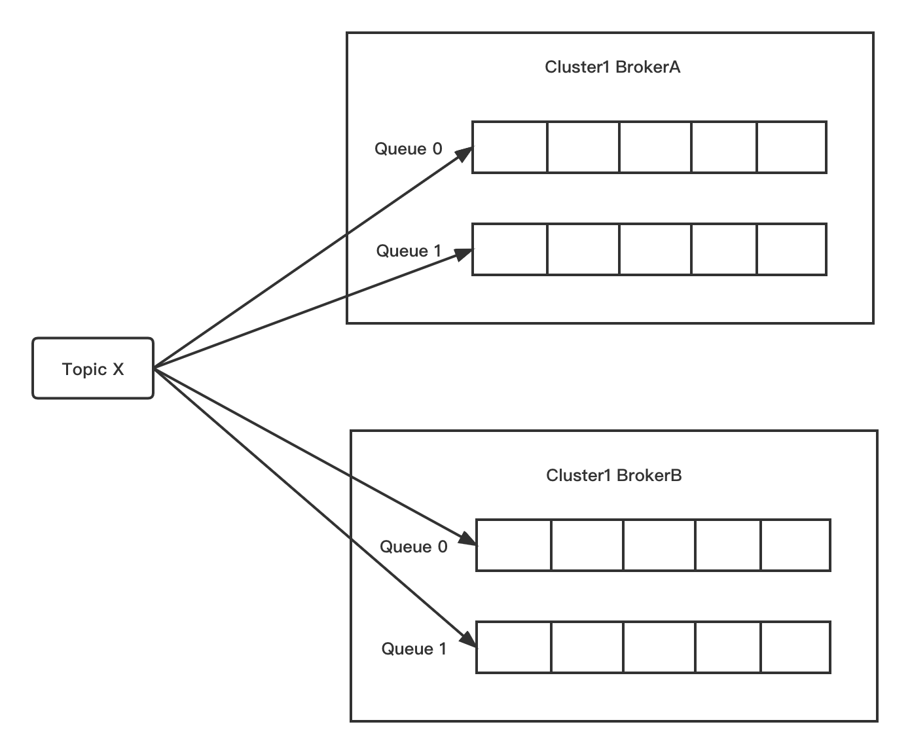

一般来说一条消息，如果没有重复发送（比如因为服务端没有响应而进行重试），则只会存在在 Topic 的其中一个队列中，消息在队列中按照先进先出的原则存储，每条消息会有自己的位点，每个队列会统计当前消息的总条数，这个称为最大位点 MaxOffset；队列的起始位置对应的位置叫做起始位点 MinOffset。队列可以提升消息发送和消费的并发度。

#### 生产者

生产者（Producer）就是消息的发送者，Apache RocketMQ 拥有丰富的消息类型，可以支持不同的应用场景，在不同的场景中，需要使用不同的消息进行发送。

比如在电商交易中超时未支付关闭订单的场景，在订单创建时会发送一条延时消息。这条消息将会在 30 分钟以后投递给消费者，消费者收到此消息后需要判断对应的订单是否已完成支付。如支付未完成，则关闭订单。如已完成支付则忽略，此时就需要用到延迟消息；

电商场景中，业务上要求同一订单的消息保持严格顺序，此时就要用到顺序消息。

在日志处理场景中，可以接受的比较大的发送延迟，但对吞吐量的要求很高，希望每秒能处理百万条日志，此时可以使用批量消息。在银行扣款的场景中，要保持上游的扣款操作和下游的短信通知保持一致，此时就要使用事务消息，下一节将会介绍各种类型消息的发送。

需要注意的是，生产环境中不同消息类型需要使用不同的主题，不要在同一个主题内使用多种消息类型，这样可以避免运维过程中的风险和错误。

### 普通消息发送
