# Redis-主从复制、哨兵、集群

Redis虽然有RDB和AOF的持久化，但是也依然存在服务不可用的问题。比如说，我们在实际使用时

只运行了一个 Redis 实例，那么，如果这个实例宕机了，它在恢复期间，是无法进行数据处理的。所以Redis提供了主从模式，用于提高整体服务的可用性。

## Redis主从复制

默认情况下，Redis都是主节点。每个从节点只能有一个主节点，而主节点可以同时具有多个从节点。复制的数据流是单向的，只能由主节点复制到从节点。

这样做的话，当主节点出现故障时，从节点可以“顶”上来实现故障转移。同时可以扩展主节点的读能力，尤其是在读多写少的场景非常适用。

### 复制的拓扑结构

Redis 的复制拓扑结构可以支持单层或多层复制关系。

“主从”模式

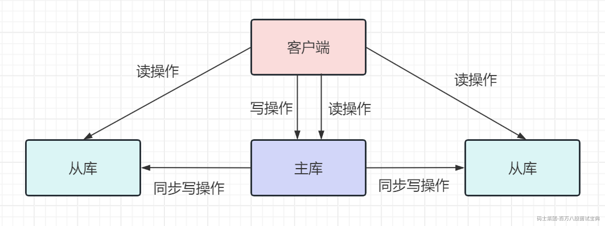

“主 -从 - 从“模式

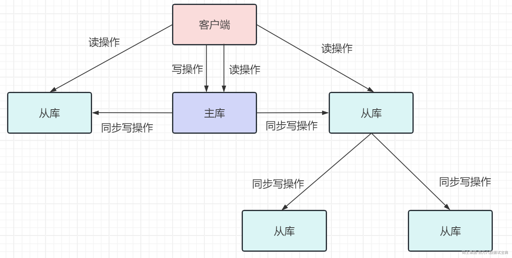

### 如何建立复制

参与复制的Redis实例划分为主节点(master)和从节点(slave)。默认情况下，Redis都是主节点。每个从节点只能有一个主节点，而主节点可以同时具有多个从节点。复制的数据流是单向的，只能由主节点复制到从节点。

### 主从库如何进行同步

Redis5.0之前的版本，一直使用 slaveof作为复制命令，从5.0.0版本开始Redis用 replicaof命令

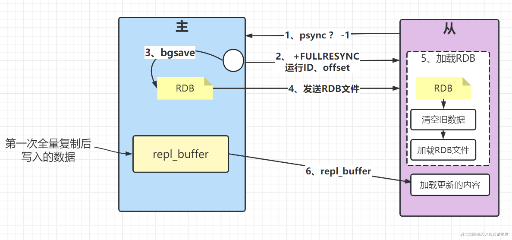

当从节点执行了replicaof命令之后。

1、从节点发送psync命令进行数据同步，由于是第一次进行复制，从节点没有复制偏移量和主节点的运行ID(runID),所以发送psync ? -1。

这个？代表runID(因为不知道主库的 runID，所以将 runID 设为?)

-1 代表第一次复制

2、主节点根据psync ? -1解析出当前为全量复制，回复 +FULLRESYNC响应（这个发送过去的包含主节点runID和偏移量offset），从节点接收主节点的响应数据保存运行ID和偏移量offset，并打印日志。

3、主节点执行bgsave保存RDB 文件到本地。

4、主节点发送RDB文件给从节点，从节点把接收的RDB文件保存在本地并直接作为从节点的数据文件,主节点清空所有的数据，加载RDB数据。

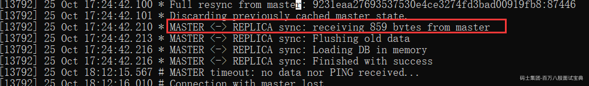

5、对于从节点开始接收RDB快照到接收完成期间，主节点仍然响应读写命令，因此主节点会把这期间写命令数据保存在主的缓冲区内，当从节点加载完RDB文件后，主节点再把缓冲区内的数据发送给从节点,保证主从之间数据一致性。

#### 注意事项

1、主从节点复制成功建立后,可以使用info replication命令查看复制相关状态。

2、replicaof（slaveof），命令不但可以建立复制，还可以在从节点执行replicaof（slaveof）no one来断开与主节点复制关系。断开与主节点复制关系后从节点晋升为主节点。

3、默认情况下，从节点使用slave-read-only=yes配置为只读模式。由于复制只能从主节点到从节点，对于从节点的任何修改主节点都无法感知，修改从节点会造成主从数据不一致。因此建议线上不要修改从节点的只读模式。

4、如果总时间超过repl-timeout所配置的值（默认60秒)，从节点将放弃接受RDB文件并清理已经下载的临时文件，导致全量复制失败。

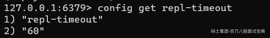

5、如果主节点创建和传输RDB的时间过长，对于高流量写入场景非常容易造成主节点复制客户端缓冲区溢出。默认配置为 client-output-buffer-limit

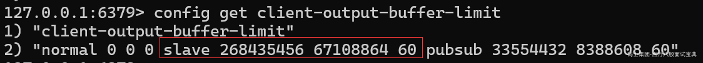

意思是如果60秒内客户端缓冲区消耗持续大于64MB或者直接超过256MB时，主节点将直接关闭复制客户端连接，造成全量同步失败。

5、在进行全量同步时，主节点写入命令的缓冲区大小repl-backlog-size 这个参数很重要。

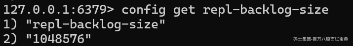

如果从库的读取速度比较慢，就有可能导致从库还未读取的操作被主库新写的操作覆盖了，这会导致主从库间的数据不一致。所以这里要调整这个repl\_backlog\_size参数很重要。不能完全按照默认值（默认值是1M）。

举个例子，如果主库每秒写入 2000 个操作，每个操作的大小为 2KB，网络每秒能传输1000 个操作，那么，有 1000 个操作需要缓冲起来，这就至少需要 2MB 的缓冲空间。否则，新写的命令就会覆盖掉旧操作了。为了应对可能的突发压力，我们最终把repl\_backlog\_size 设为 4MB。

6、异步复制机制，由于主从复制过程是异步的，就会造成从节点的数据相对主节点存在延迟。具体延迟多少字节,我们可以在主节点执行info replication命令查看相关指标获得。

## 哨兵Redis Sentinel

Redis 的主从复制模式下，一旦主节点由于故障不能提供服务，需要人工将从节点晋升为主节点，同时还要通知应用方更新主节点地址，对于很多应用场景这种故障处理的方式是无法接受的。

Redis 从 2.8开始正式提供了Redis Sentinel(哨兵）架构来解决这个问题。

### Redis Sentinel

Redis Sentinel是一个分布式架构，其中包含若干个Sentinel节点和Redis数据节点，每个Sentinel节点会对数据节点和其余Sentinel节点进行监控，当它发现节点不可达时，会对节点做下线标识。如果被标识的是主节点，它还会和其他Sentinel节点进行“协商”，当大多数Sentinel节点都认为主节点不可达时，它们会选举出一个Sentinel节点来完成自动故障转移的工作，同时会将这个变化实时通知给Redis应用方。整个过程完全是自动的，不需要人工来介入，所以这套方案很有效地解决了Redis的高可用问题。

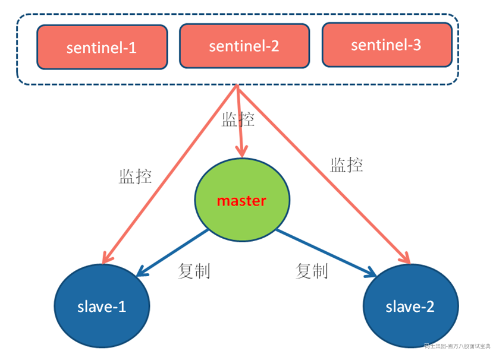

### Redis Sentinel的搭建

我们以以3个 Sentinel节点、1个主节点、2个从节点组成一个Redis Sentinel进行说明。

启动主从的方式和普通的主从没有不同。

#### 启动Sentinel节点

Sentinel节点的启动方法有两种:

方法一,使用redis-sentinel命令:

```plain
./redis-sentinel   ../conf/reids.conf
```

方法二，使用redis-server命令加--sentinel参数:

```plain
./redis-server ../conf/reids.conf  --sentinel
```

两种方法本质上是—样的。

##### 确认

Sentinel节点本质上是一个特殊的Redis节点，所以也可以通过info命令来查询它的相关信息

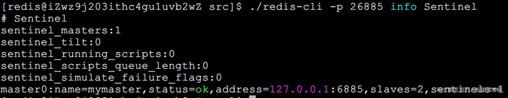

### 哨兵的实现原理

哨兵主要负责的就是三个任务：监控、选主（选择主库）和通知。

监控是指哨兵进程在运行时，周期性地给所有的主从库发送 PING 命令，检测它们是否仍然在线运行。如果从库没有在规定时间内响应哨兵的 PING 命令，哨兵就会把它标记为“下线状态”；同样，如果主库也没有在规定间内响应哨兵的 PING 命令，哨兵就会判定主库下线，然后开始自动切换主库的流程。

#### 监控-三个定时监控任务

Redis Sentinel通过三个定时监控任务完成对各个节点发现和监控：

##### 1、每隔10秒的定时监控

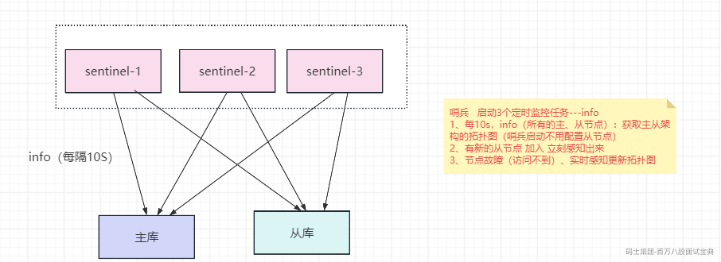

##### 2、每隔2秒的定时监控

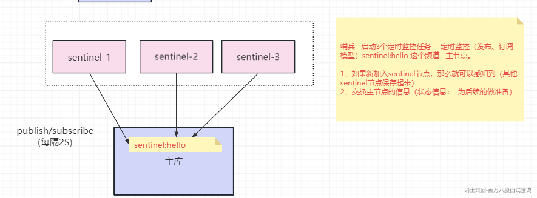

##### 3、每隔1秒的定时监控

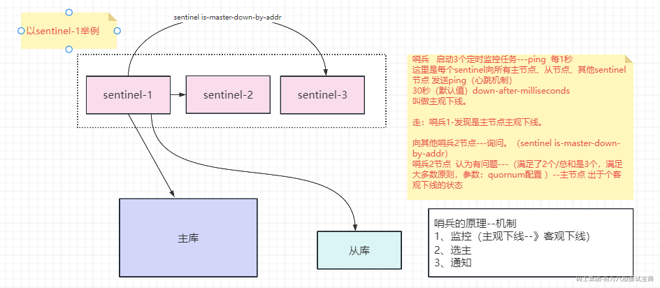

#### 主观下线和客观下线

##### 主观下线

每个Sentinel节点会每隔1秒对主节点、从节点、其他Sentinel节点发送ping命令做心跳检测,当这些节点超过down-after-milliseconds没有进行有效回复，Sentinel节点就会对该节点做失败判定，这个行为叫做主观下线。从字面意思也可以很容易看出主观下线是当前Sentinel节点的一家之言,存在误判的可能。

##### 客观下线

当Sentinel主观下线的节点是主节点时，该Sentinel节点会通过sentinel is-master-down-by-addr命令向其他Sentinel节点询问对主节点的判断，当超过&#x3c;quorum>个数,Sentinel节点认为主节点确实有问题，这时该Sentinel节点会做出客观下线的决定，这样客观下线的含义是比较明显了，也就是大部分Sentinel节点都对主节点的下线做了同意的判定，那么这个判定就是客观的。

##### 领导者Sentinel节点选举

假如Sentinel节点对于主节点已经做了客观下线，那么是不是就可以立即进行故障转移了？当然不是，实际上故障转移的工作只需要一个Sentinel节点来完成即可，所以 Sentinel节点之间会做一个领导者选举的工作，选出一个Sentinel节点作为领导者进行故障转移的工作。Redis使用了Raft算法实现领导者选举，Redis Sentinel进行领导者选举的大致思路如下:

1 )每个在线的Sentinel节点都有资格成为领导者，当它确认主节点主观下线时候，会向其他Sentinel节点发送sentinel is-master-down-by-addr命令，要求将自己设置为领导者。

2)收到命令的Sentinel节点，如果没有同意过其他Sentinel节点的sentinel is-master-down-by-addr命令,将同意该请求,否则拒绝。

3）如果该Sentinel节点发现自己的票数已经大于等于max (quorum，num(sentinels)/2+1）,那么它将成为领导者。

4）如果此过程没有选举出领导者,将进入下一次选举。

#### 故障转移

领导者选举出的Sentinel节点负责故障转移，具体步骤如下:

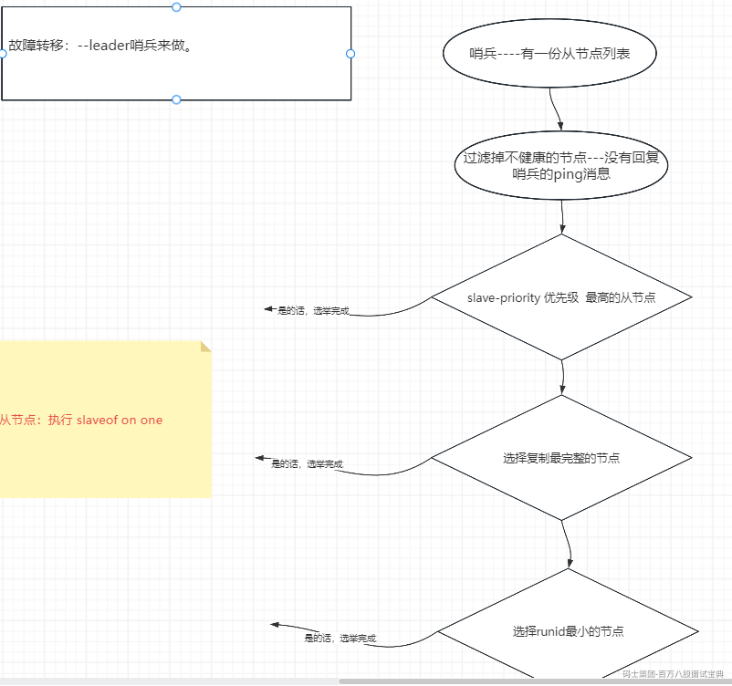

1)在从节点列表中选出一个节点作为新的主节点,选择方法如下:

```plain
a)过滤:“不健康”(主观下线、断线)、5秒内没有回复过Sentinel节点 ping响应、与主节点失联超过down-after-milliseconds*10秒。
```

```plain
b)选择slave-priority(从节点优先级)最高的从节点列表，如果存在则返回,不存在则继续。
```

```plain
c）选择复制偏移量最大的从节点(复制的最完整)，如果存在则返回,不存在则继续。
```

```plain
d）选择runid最小的从节点。
```

2 ) Sentinel领导者节点会对第一步选出来的从节点执行slaveof no one命令让其成为主节点。

3 ) Sentinel领导者节点会向剩余的从节点发送命令，让它们成为新主节点的从节点,复制规则和parallel-syncs参数有关。

4 ) Sentinel节点集合会将原来的主节点更新为从节点，并保持着对其关注，当其恢复后命令它去复制新的主节点。

## Redis集群

Redis Cluster是Redis的分布式解决方案，在3.0版本正式推出，有效地解决了Redis分布式方面的需求。当遇到单机内存、并发、流量等瓶颈时，可以采用Cluster架构方案达到负载均衡的目的。

### 集群前置知识

Redis则是利用了虚拟槽分区，可以算上面虚拟一致性哈希分区的变种，它使用分散度良好的哈希函数把所有数据映射到一个固定范围的整数集合中，整数定义为槽( slot)。这个范围一般远远大于节点数，比如RedisCluster槽范围是0 ～16383。槽是集群内数据管理和迁移的基本单位。采用大范围槽的主要目的是为了方便数据拆分和集群扩展。每个节点会负责一定数量的槽。

比如集群有3个节点，则每个节点平均大约负责5460个槽。由于采用高质量的哈希算法，每个槽所映射的数据通常比较均匀，将数据平均划分到5个节点进行数据分区。Redis Cluster就是采用虚拟槽分区,下面就介绍Redis 数据分区方法。

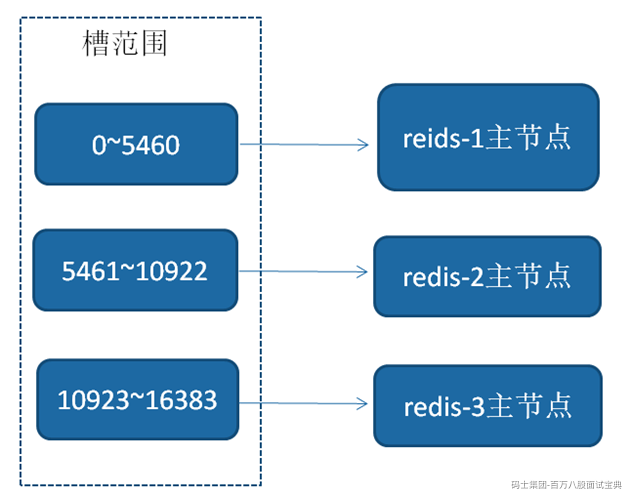

#### Redis数据分区

Redis Cluser采用虚拟槽分区，所有的键根据哈希函数映射到0 ~16383整数槽内，计算公式:slot=CRC16(key) &16383。每一个节点负责维护―部分槽以及槽所映射的键值数据。

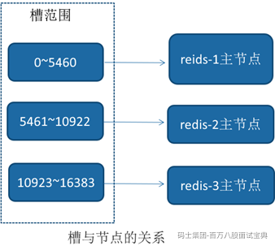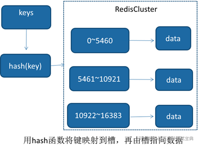

#### 集群功能限制

Redis集群相对单机在功能上存在一些限制，需要开发人员提前了解，在使用时做好规避。限制如下:

1、 key批量操作支持有限。如mset、mget，目前只支持具有相同slot值的key执行批量操作。对于映射为不同slot值的key由于执行mget、mget等操作可能存在于多个节点上因此不被支持。

2、key事务操作支持有限。同理只支持多key在同一节点上的事务操作，当多个key分布在不同的节点上时无法使用事务功能。

3、key作为数据分区的最小粒度，因此不能将一个大的键值对象如hash、list等映射到不同的节点。

4、不支持多数据库空间。单机下的Redis可以支持16个数据库，集群模式下只能使用一个数据库空间,即 db 0。

5、复制结构只支持一层，从节点只能复制主节点，不支持嵌套树状复制结构。

### 搭建集群

```plain
1、启动节点

./redis-server ../conf/cluster_m_6900.conf
./redis-server ../conf/cluster_m_6901.conf
./redis-server ../conf/cluster_m_6902.conf
./redis-server ../conf/cluster_s_6930.conf
./redis-server ../conf/cluster_s_6931.conf
./redis-server ../conf/cluster_s_6932.conf

2、随机创建集群主从节点

redis-cli --cluster create

./redis-cli --cluster create 127.0.0.1:6900 127.0.0.1:6901 127.0.0.1:6902 127.0.0.1:6930 127.0.0.1:6931 127.0.0.1:6932 --cluster-replicas 1

3、指定主从节点
--创建集群主节点
./redis-cli --cluster create  127.0.0.1:6900 127.0.0.1:6901 127.0.0.1:6902

    1、请记录下每个M后形如“7353cda9e84f6d85c0b6e41bb03d9c4bd2545c07”的字符串，在后面添加从节点时有用；
    2、如果服务器存在着防火墙，那么在进行安全设置的时候，除了redis服务器本身的端口，比如6900 要加入允许列表之外，Redis服务在集群中还有一个叫集群总线端口，其端口为客户端连接端口加上10000，即 6900 + 10000 = 16900 。所以开放每个集群节点的客户端端口和集群总线端口才能成功创建集群！

M: dcd818ab48166ccea9563544839187ffa5d79f62 127.0.0.1:6900
   slots:[0-5460] (5461 slots) master
M: 8a790d30957b28232035cf6960ec29ad29aee6ff 127.0.0.1:6901
   slots:[5461-10922] (5462 slots) master
M: a495039067d023289bcc444634d38e25aef880cc 127.0.0.1:6902

加入第4台
60fd25ce5395a83032bccf30a4a30bd4ff96d732

--添加集群从节点
命令类似：./redis-cli --cluster add-node 127.0.0.1:6930 127.0.0.1:6900 --cluster-slave --cluster-master-id dcd818ab48166ccea9563544839187ffa5d79f62

./redis-cli --cluster add-node 127.0.0.1:6931 127.0.0.1:6900 --cluster-slave --cluster-master-id 8a790d30957b28232035cf6960ec29ad29aee6ff

./redis-cli --cluster add-node 127.0.0.1:6932 127.0.0.1:6900 --cluster-slave --cluster-master-id a495039067d023289bcc444634d38e25aef880cc

说明：上述命令把6930节点加入到6900节点的集群中，并且当做node_id为 117457eab5071954faab5e81c3170600d5192270 的从节点。如果不指定 --cluster-master-id 会随机分配到任意一个主节点。

有三个从节点，自然就要执行三次类似的命令。
./redis-cli --cluster add-node 127.0.0.1:6930 127.0.0.1:6900 --cluster-slave --cluster-master-id 117457eab5071954faab5e81c3170600d5192270
./redis-cli --cluster add-node 127.0.0.1:6931 127.0.0.1:6900 --cluster-slave --cluster-master-id 8a790d30957b28232035cf6960ec29ad29aee6ff
./redis-cli --cluster add-node 127.0.0.1:6932 127.0.0.1:6900 --cluster-slave --cluster-master-id a495039067d023289bcc444634d38e25aef880cc

4、集群管理
    --集群信息查看
    ./redis-cli --cluster info 127.0.0.1:6900
    --检查集群
    ./redis-cli --cluster check 47.112.44.148:6900 --cluster-search-multiple-owners

5、动态扩容
./redis-server ../conf/cluster_m_6903.conf

./redis-server ../conf/cluster_s_6933.conf

启动后  从的runid

迁移槽（扩容）

./redis-cli --cluster reshard --cluster-from dcd818ab48166ccea9563544839187ffa5d79f62 --cluster-to 60fd25ce5395a83032bccf30a4a30bd4ff96d732 --cluster-slots 1365 127.0.0.1:6900

./redis-cli --cluster reshard --cluster-from 8a790d30957b28232035cf6960ec29ad29aee6ff --cluster-to 60fd25ce5395a83032bccf30a4a30bd4ff96d732 --cluster-slots 1366 127.0.0.1:6900

./redis-cli --cluster reshard --cluster-from a495039067d023289bcc444634d38e25aef880cc --cluster-to 60fd25ce5395a83032bccf30a4a30bd4ff96d732 --cluster-slots 1365 127.0.0.1:6900

迁移槽（缩容）

./redis-cli --cluster reshard --cluster-from 60fd25ce5395a83032bccf30a4a30bd4ff96d732 --cluster-to dcd818ab48166ccea9563544839187ffa5d79f62 --cluster-slots 1365 127.0.0.1:6900

./redis-cli --cluster reshard --cluster-from 60fd25ce5395a83032bccf30a4a30bd4ff96d732 --cluster-to 8a790d30957b28232035cf6960ec29ad29aee6ff --cluster-slots 1366 127.0.0.1:6900

./redis-cli --cluster reshard --cluster-from 60fd25ce5395a83032bccf30a4a30bd4ff96d732 --cluster-to a495039067d023289bcc444634d38e25aef880cc --cluster-slots 1365 127.0.0.1:6900

节点下线（先从、再主）

./redis-cli --cluster del-node 127.0.0.1:6900 5bd705de41b4ee2f76c24965194c976ee878e8da

./redis-cli --cluster del-node 127.0.0.1:6900 60fd25ce5395a83032bccf30a4a30bd4ff96d732

```

#### redis-cli –cluster 参数参考

```plain
redis-cli --cluster help
Cluster Manager Commands:
  create         host1:port1 ... hostN:portN   #创建集群
                 --cluster-replicas <arg>      #从节点个数
  check          host:port                     #检查集群
                 --cluster-search-multiple-owners #检查是否有槽同时被分配给了多个节点
  info           host:port                     #查看集群状态
  fix            host:port                     #修复集群
                 --cluster-search-multiple-owners #修复槽的重复分配问题
  reshard        host:port                     #指定集群的任意一节点进行迁移slot，重新分slots
                 --cluster-from <arg>          #需要从哪些源节点上迁移slot，可从多个源节点完成迁移，以逗号隔开，传递的是节点的node id，还可以直接传递--from all，这样源节点就是集群的所有节点，不传递该参数的话，则会在迁移过程中提示用户输入
                 --cluster-to <arg>            #slot需要迁移的目的节点的node id，目的节点只能填写一个，不传递该参数的话，则会在迁移过程中提示用户输入
                 --cluster-slots <arg>         #需要迁移的slot数量，不传递该参数的话，则会在迁移过程中提示用户输入。
                 --cluster-yes                 #指定迁移时的确认输入
                 --cluster-timeout <arg>       #设置migrate命令的超时时间
                 --cluster-pipeline <arg>      #定义cluster getkeysinslot命令一次取出的key数量，不传的话使	用默认值为10
                 --cluster-replace             #是否直接replace到目标节点
  rebalance      host:port                                      #指定集群的任意一节点进行平衡集群节点slot数量 
                 --cluster-weight <node1=w1...nodeN=wN>         #指定集群节点的权重
                 --cluster-use-empty-masters                    #设置可以让没有分配slot的主节点参与，默认不允许
                 --cluster-timeout <arg>                        #设置migrate命令的超时时间
                 --cluster-simulate                             #模拟rebalance操作，不会真正执行迁移操作
                 --cluster-pipeline <arg>                       #定义cluster getkeysinslot命令一次取出的key数量，默认值为10
                 --cluster-threshold <arg>                      #迁移的slot阈值超过threshold，执行rebalance操作
                 --cluster-replace                              #是否直接replace到目标节点
  add-node       new_host:new_port existing_host:existing_port  #添加节点，把新节点加入到指定的集群，默认添加主节点
                 --cluster-slave                                #新节点作为从节点，默认随机一个主节点
                 --cluster-master-id <arg>                      #给新节点指定主节点
  del-node       host:port node_id                              #删除给定的一个节点，成功后关闭该节点服务
  call           host:port command arg arg .. arg               #在集群的所有节点执行相关命令
  set-timeout    host:port milliseconds                         #设置cluster-node-timeout
  import         host:port                                      #将外部redis数据导入集群
                 --cluster-from <arg>                           #将指定实例的数据导入到集群
                 --cluster-copy                                 #migrate时指定copy
                 --cluster-replace                              #migrate时指定replace

```

### 集群原理

在分布式存储中需要提供维护节点元数据信息的机制,所谓元数据是指:节点负责哪些数据,是否出现故障等状态信息。常见的元数据维护方式分为:集中式和P2P方式。Redis集群采用P2P的Gossip（流言)协议，Gossip协议工作原理就是节点彼此不断通信交换信息,一段时间后所有的节点都会知道集群完整的信息,这种方式类似流言传播。

通信过程说明:

1)集群中的每个节点都会单独开辟一个TCP通道,用于节点之间彼此通信,通信端口号在基础端口上加10000。

2)每个节点在固定周期内通过特定规则选择几个节点发送ping消息。

3）接收到ping消息的节点用pong消息作为响应。

集群中每个节点通过一定规则挑选要通信的节点，每个节点可能知道全部节点,也可能仅知道部分节点，只要这些节点彼此可以正常通信，最终它们会达到一致的状态。当节点出故障、新节点加入、主从角色变化、槽信息变更等事件发生时，通过不断的ping/pong消息通信，经过一段时间后所有的节点都会知道整个集群全部节点的最新状态，从而达到集群状态同步的目的。

##### Gossip 消息

Gossip协议的主要职责就是信息交换。信息交换的载体就是节点彼此发送的Gossip消息，了解这些消息有助于我们理解集群如何完成信息交换。

常用的Gossip消息可分为:ping消息、pong消息、meet消息、fail消息等，

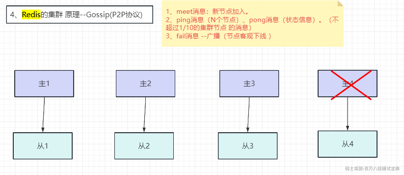

**ping消息:**

集群内交换最频繁的消息，集群内每个节点每秒向多个其他节点发送ping消息,用于检测节点是否在线和交换彼此状态信息。ping消息发送封装了自身节点和部分其他节点的状态数据。

**pong消息:**

当接收到ping、meet消息时，作为响应消息回复给发送方确认消息正常通信。pong消息内部封装了自身状态数据。节点也可以向集群内广播自身的pong消息来通知整个集群对自身状态进行更新。

**meet消息:**

用于通知新节点加入。消息发送者通知接收者加入到当前集群，meet消息通信正常完成后，接收节点会加入到集群中并进行周期性的ping、pong消息交换。

**fail消息:**

当节点判定集群内另一个节点下线时，会向集群内广播一个fail消息,其他节点接收到fail消息之后把对应节点更新为下线状态。

所有的消息格式划分为:消息头和消息体。消息头包含发送节点自身状态数据，接收节点根据消息头就可以获取到发送节点的相关数据。

集群内所有的消息都采用相同的消息头结构clusterMsg，它包含了发送节点关键信息，如节点id、槽映射、节点标识(主从角色，是否下线）等。消息体在Redis内部采用clusterMsg Data 结构声明。

消息体clusterMsgData定义发送消息的数据,其中ping,meet、pong都采用clusterMsgDataGossip数组作为消息体数据，实际消息类型使用消息头的type属性区分。每个消息体包含该节点的多个clusterMsgDataGossip结构数据，用于信息交换。

当接收到ping、meet消息时,接收节点会解析消息内容并根据自身的识别情况做出相应处理。

#### RedisCluster集群－故障转移主观下线

集群中每个节点都会定期向其他节点发送ping消息，接收节点回复pong消息作为响应。如果在cluster-node-timeout时间内通信一直失败,则发送节点会认为接收节点存在故障，把接收节点标记为主观下线(pfail)状态。

下图就是节点A对于节点B，发现B异常了，然后A做主观下线，标记A为pfail状态

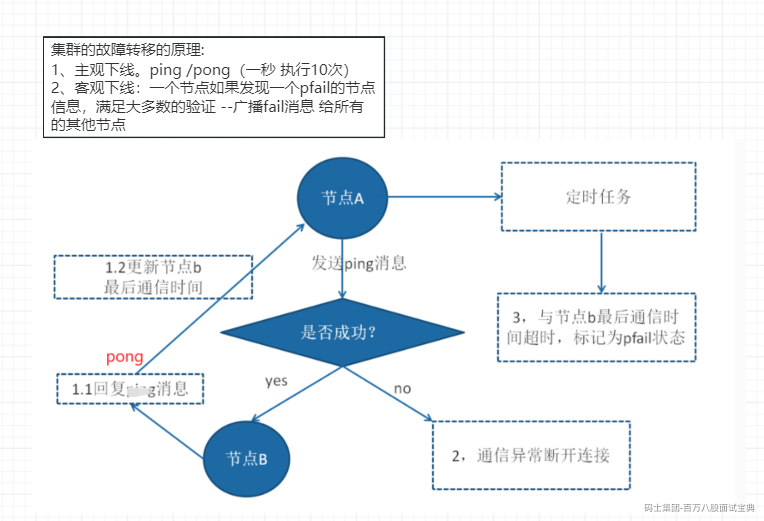

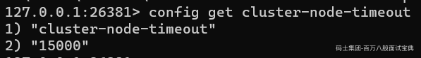

一般是15秒

#### RedisCluster集群－故障转移客观下线

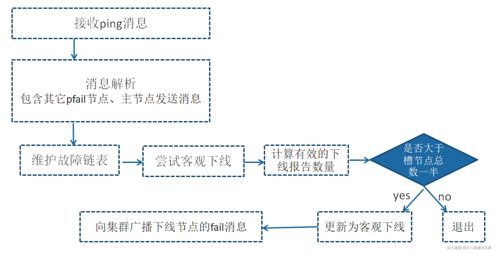

当某个节点判断另一个节点主观下线后，相应的节点状态会跟随消息在集群内传播。

ping/pong消息的消息体会携带集群1/10的其他节点状态数据，当接受节点发现消息体中含有主观下线的节点状态时，会在本地找到故障节点的ClusterNode结构，保存到下线报告链表中。

广播fail消息是客观下线的最后一步,它承担着非常重要的职责:

通知集群内所有的节点标记故障节点为客观下线状态并立刻生效。

通知故障节点的从节点触发故障转移流程。

当某个节点判断另一个节点主观下线后，相应的节点状态会跟随消息在集群内传播。

ping/pong消息的消息体会携带集群1/10的其他节点状态数据，当接受节点发现消息体中含有主观下线的节点状态时，会在本地找到故障节点的ClusterNode结构，保存到下线报告链表中。

#### 故障恢复

故障节点变为客观下线后,如果下线节点是持有槽的主节点则需要在它的从节点中选出一个替换它,从而保证集群的高可用。下线主节点的所有从节点承担故障恢复的义务，当从节点通过内部定时任务发现自身复制的主节点进入客观下线时,将会触发故障恢复流程。

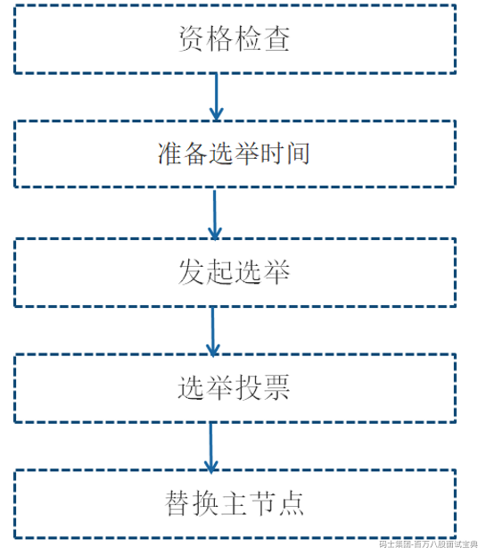

###### 资格检查

每个从节点都要检查最后与主节点断线时间，判断是否有资格替换故障的主节点。如果从节点与主节点断线时间超过cluster-node-timeout \* cluster-slave-validity-factor，则当前从节点不具备故障转移资格。参数cluster-slave-validity-factor用于从节点的有效因子，默认为10。

###### 准备选举时间

当从节点符合故障转移资格后，更新触发故障选举的时间，只有到达该时间后才能执行后续流程。

这里之所以采用延迟触发机制，主要是通过对多个从节点使用不同的延迟选举时间来支持优先级问题。复制偏移量越大说明从节点延迟越低，那么它应该具有更高的优先级来替换故障主节点。

所有的从节点中复制偏移量最大的将提前触发故障选举流程。

主节点b进入客观下线后，它的三个从节点根据自身复制偏移量设置延迟选举时间，如复制偏移量最大的节点slave b-1延迟1秒执行，保证复制延迟低的从节点优先发起选举。

###### 发起选举

当从节点定时任务检测到达故障选举时间(failover\_auth\_time）到达后，发起选举流程如下:

(1）更新配置纪元

配置纪元是一个只增不减的整数，每个主节点自身维护一个配置纪元(clusterNode .configEpoch)标示当前主节点的版本，所有主节点的配置纪元都不相等，从节点会复制主节点的配置纪元。整个集群又维护一个全局的配置纪元(clusterstate.currentEpoch)，用于记录集群内所有主节点配置纪元的最大版本。执行cluster info命令可以查看配置纪元信息:

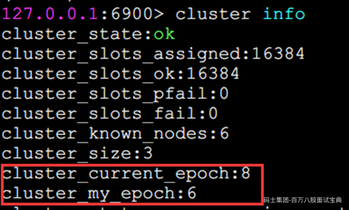

配置纪元的主要作用:

标示集群内每个主节点的不同版本和当前集群最大的版本。

每次集群发生重要事件时，这里的重要事件指出现新的主节点(新加入的或者由从节点转换而来)，从节点竞争选举。都会递增集群全局的配置纪元并赋值给相关主节点,用于记录这一关键事件。

主节点具有更大的配置纪元代表了更新的集群状态，因此当节点间进行ping/pong消息交换时，如出现slots等关键信息不一致时，以配置纪元更大的一方为准，防止过时的消息状态污染集群。

配置纪元的应用场景有:

新节点加入。槽节点映射冲突检测。从节点投票选举冲突检测。

###### 选举投票

只有持有槽的主节点才会处理故障选举消息(FAILOVER\_AUTH\_REQUEST)，因为每个持有槽的节点在一个配置纪元内都有唯一的一张选票，当接到第一个请求投票的从节点消息时回复FAILOVER\_AUTH\_ACK消息作为投票，之后相同配置纪元内其他从节点的选举消息将忽略。

投票过程其实是一个领导者选举的过程，如集群内有N个持有槽的主节点代表有N张选票。由于在每个配置纪元内持有槽的主节点只能投票给一个从节点，因此只能有一个从节点获得 N/2+1的选票,保证能够找出唯一的从节点。

Redis集群没有直接使用从节点进行领导者选举，主要因为从节点数必须大于等于3个才能保证凑够N/2+1个节点，将导致从节点资源浪费。使用集群内所有持有槽的主节点进行领导者选举,即使只有一个从节点也可以完成选举过程。

当从节点收集到N/2+1个持有槽的主节点投票时，从节点可以执行替换主节点操作，例如集群内有5个持有槽的主节点，主节点b故障后还有4个，当其中一个从节点收集到3张投票时代表获得了足够的选票可以进行替换主节点操作,。

投票作废:每个配置纪元代表了一次选举周期,如果在开始投票之后的cluster-node-timeout\*2时间内从节点没有获取足够数量的投票，则本次选举作废。从节点对配置纪元自增并发起下一轮投票,直到选举成功为止。

###### 替换主节点

当从节点收集到足够的选票之后,触发替换主节点操作:

1)当前从节点取消复制变为主节点。

2)执行clusterDelslot 操作撤销故障主节点负责的槽，并执行clusterAddSlot把这些槽委派给自己。

3)向集群广播自己的pong消息，通知集群内所有的节点当前从节点变为主节点并接管了故障主节点的槽信息。

##### 故障转移时间

在介绍完故障发现和恢复的流程后,这时我们可以估算出故障转移时间:

1）主观下线(pfail）识别时间=cluster-node-timeout。

2）主观下线状态消息传播时间<=cluster-node-timeout/2。消息通信机制对超过cluster-node-timeout/2未通信节点会发起ping消息，消息体在选择包含哪些节点时会优先选取下线状态节点，所以通常这段时间内能够收集到半数以上主节点的pfail 报告从而完成故障发现。

3)从节点转移时间<=1000毫秒。由于存在延迟发起选举机制,偏移量最大的从节点会最多延迟1秒发起选举。通常第一次选举就会成功，所以从节点执行转移时间在1秒以内。

根据以上分析可以预估出故障转移时间，如下:

failover-time(毫秒)≤cluster-node-timeout

- cluster-node-timeout/2 + 1000

因此，故障转移时间跟cluster-node-timeout参数息息相关，默认15秒。配置时可以根据业务容忍度做出适当调整，但不是越小越好。

#### 集群不可用判定

为了保证集群完整性，默认情况下当集群16384个槽任何一个没有指派到节点时整个集群不可用。执行任何键命令返回( error)CLUSTERDOWN Hash slot not served错误。这是对集群完整性的一种保护措施，保证所有的槽都指派给在线的节点。但是当持有槽的主节点下线时，从故障发现到自动完成转移期间整个集群是不可用状态，对于大多数业务无法容忍这种情况，因此可以将参数cluster-require-full-coverage配置为no，当主节点故障时只影响它负责槽的相关命令执行，不会影响其他主节点的可用性。

但是从集群的故障转移的原理来说，集群会出现不可用，当：

1、当访问一个 Master 和 Slave 节点都挂了的时候，cluster-require-full-coverage=yes，会报槽无法获取。

2、集群主库半数宕机(根据 failover 原理，fail 掉一个主需要一半以上主都投票通过才可以)。

另外，当集群 Master 节点个数小于 3 个的时候，或者集群可用节点个数为偶数的时候，基于 fail 的这种选举机制的自动主从切换过程可能会不能正常工作，一个是标记 fail 的过程，一个是选举新的 master 的过程，都有可能异常。

#### 集群读写分离

1.只读连接

集群模式下从节点不接受任何读写请求，发送过来的键命令会重定向到负责槽的主节点上(其中包括它的主节点)。当需要使用从节点分担主节点读压力时，可以使用readonly命令打开客户端连接只读状态。之前的复制配置slave-read-only在集群模式下无效。当开启只读状态时，从节点接收读命令处理流程变为:如果对应的槽属于自己正在复制的主节点则直接执行读命令，否则返回重定向信息。

readonly命令是连接级别生效，因此每次新建连接时都需要执行readonly开启只读状态。执行readwrite命令可以关闭连接只读状态。

2.读写分离

集群模式下的读写分离，同样会遇到:复制延迟，读取过期数据,从节点故障等问题。针对从节点故障问题,客户端需要维护可用节点列表，集群提供了cluster slaves {nodeld}命令，返回nodeId对应主节点下所有从节点信息，命令如下:

cluster slave  
41ca2d569068043a5f2544c598edd1e45a0c1f91

解析以上从节点列表信息,排除fail状态节点，这样客户端对从节点的故障判定可以委托给集群处理,简化维护可用从节点列表难度。

同时集群模式下读写分离涉及对客户端修改如下:

1）维护每个主节点可用从节点列表。

2）针对读命令维护请求节点路由。

3）从节点新建连接开启readonly状态。

集群模式下读写分离成本比较高，可以直接扩展主节点数量提高集群性能，一般不建议集群模式下做读写分离。
