## Redis的高级数据结构

### Bitmap

Redis中的bitmap数据类型是一种特殊的数据结构，用于处理位操作。它是一个由二进制位组成的数组，每个位可以表示一个布尔值（0或1）。

Bitmap数据类型在Redis中使用字符串来表示，每个字符都可以存储8个位。这意味着一个长度为n的bitmap数据类型将占用n/8个字节的存储空间。

#### 操作命令

```plain
SETBIT key offset value：将指定偏移量上的位设置为指定的值（0或1）。 
GETBIT key offset：获取指定偏移量上的位的值。 
BITCOUNT key [start end]：统计指定范围内的位中值为1的个数。 
BITOP operation destkey key [key ...]：对一个或多个bitmap进行位操作，并将结果存储在目标bitmap中。支持的位操作包括AND、OR、XOR、NOT等。 
```

#### 使用场景

统计一下100万用户连续 10 天的签到情况！

可以把每天的日期作为key，每个 key 对应一个 100万位的 Bitmap，每一个 bit 对应一个用户当天的签到情况（用户ID是整型且是连续递增）

我们对 10 个 Bitmap 做“与”操作，得到的结果也是一个 Bitmap（只有 10 天都签到的用户对应的 bit 位上的值才会是 1）

最后，我们可以用BITCOUNT 统计下 Bitmap 中的 1 的个数，这就是连续签到 10 天的用户总数了

下图我们用10个用户来模拟（用户id分别是 1，2，3，4，5，6，7，8，9，10）， 然后这个里面只有用户1做到了连续10天签到。

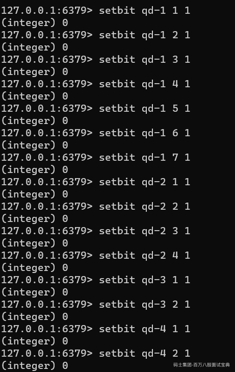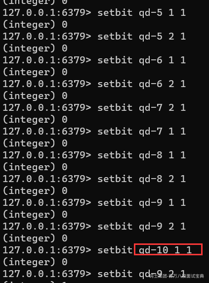

统计一下（这个里面只有用户1做到了连续10天签到）：

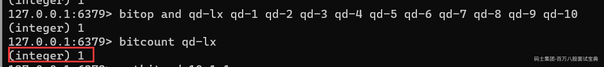

然后之前的用户2 只有在最后一天没有签到，补上，再做上述的处理，就可以看到连续签到的人数变成了2。

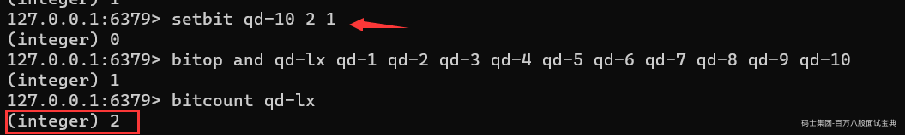

现在，我们可以计算一下记录了 10 天签到情况后的内存开销。每天使用 1个100万位的Bitmap，大约占 12MB 的内存（10的6次方 /8/1024）大约是120KB的大小，10 天的 Bitmap 的内存开销约为 1 .2MB。这个开销是相当小的。

所以，如果只需要统计数据的二值状态，例如商品有没有、用户在不在等，就可以使用Bitmap，因为它只用一个 bit 位就能表示 0 或 1。在记录海量数据时，Bitmap 能够有效地节省内存空间

#### 注意事项

##### 存储格式

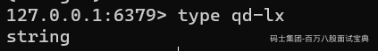

redis中存储bitmap使用的是字符串类型存储，也就是在redis内部都是通过SimpleDynamicString 简单动态字符串格式存储的bitmap。

这个结构和正常的字符串的存储结构一模一样，也就是意味着redis内部在执行setBit、getBit、bitCount这些操作的时候并不区分是真正的字符串还是bitmap，因为对于redis底层来说两者都是字符串存储格式，redis内部没有对两者做区分。

##### 内存问题

使用redis的bitmap一定要注意尽量从小整数的序号开始往上加，否则bitmap结构带来的不是redis内存的节省，而是redis内存的爆炸溢出。

**为什么呢？**

setbit key offset 1 设置某个offset的位为0或者1时，offset之前的所有byte[]的内存都要被占用，也就是说比如offset=100000，那么对于redis来说他至少需要申请100000/8=12500长度的byte[]数组才行，相当于只有byte[12500]这个字节真正使用到了，前面的byte[0-12499]都没有真正用到，这些内存就白白浪费掉了。

案例：对比使用bitmap，一个从小的开始设置，一个直接从很大的值开始设置，他们之间的内存占用对比

（执行debug object key查看serializedlength属性即可，它表示 key对应的value序列化之后的字节数）

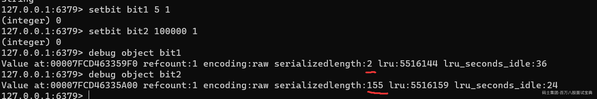

### 布隆过滤器

#### 布隆过滤器简介

**1970 年布隆提出了一种布隆过滤器的算法，用来判断一个元素是否在一个集合中。这种算法由一个二进制数组和一个 Hash 算法组成。**

实际上，布隆过滤器广泛应用于网页黑名单系统、垃圾邮件过滤系统、爬虫网址判重系统等，Google 著名的分布式数据库 Bigtable 使用了布隆过滤器来查找不存在的行或列，以减少磁盘查找的IO次数，Google Chrome浏览器使用了布隆过滤器加速安全浏览服务。

#### 布隆过滤器解决缓存穿透问题

**缓存穿透**

是指查询一个根本不存在的数据，缓存层和存储层都不会命中，于是这个请求就可以随意访问数据库，这个就是缓存穿透，缓存穿透将导致不存在的数据每次请求都要到存储层去查询，失去了缓存保护后端存储的意义。

缓存穿透问题可能会使后端存储负载加大，由于很多后端存储不具备高并发性，甚至可能造成后端存储宕掉。通常可以在程序中分别统计总调用数、缓存层命中数、存储层命中数，如果发现大量存储层空命中，可能就是出现了缓存穿透问题。

造成缓存穿透的基本原因有两个。

第一，自身业务代码或者数据出现问题，比如，我们数据库的 id 都是1开始自增上去的，如发起为id值为 -1 的数据或 id 为特别大不存在的数据。如果不对参数做校验，数据库id都是大于0的，我一直用小于0的参数去请求你，每次都能绕开Redis直接打到数据库，数据库也查不到，每次都这样，并发高点就容易崩掉了。

第二,一些恶意攻击、爬虫等造成大量空命中。下面我们来看一下如何解决缓存穿透问题。

**1.缓存空对象**

当存储层不命中，到数据库查发现也没有命中，那么仍然将空对象保留到缓存层中，之后再访问这个数据将会从缓存中获取,这样就保护了后端数据源。

缓存空对象会有两个问题:

第一，空值做了缓存，意味着缓存层中存了更多的键，需要更多的内存空间(如果是攻击，问题更严重),比较有效的方法是针对这类数据设置一个较短的过期时间，让其自动剔除。

第二，缓存层和存储层的数据会有一段时间窗口的不一致，可能会对业务有一定影响。例如过期时间设置为5分钟，如果此时存储层添加了这个数据，那此段时间就会出现缓存层和存储层数据的不一致，此时可以利用消前面所说的数据一致性方案处理。

**2.布隆过滤器拦截**

在访问缓存层和存储层之前,将存在的key用布隆过滤器提前保存起来,做第一层拦截。例如:一个推荐系统有4亿个用户id，每个小时算法工程师会根据每个用户之前历史行为计算出推荐数据放到存储层中,但是最新的用户由于没有历史行为,就会发生缓存穿透的行为,为此可以将所有推荐数据的用户做成布隆过滤器。如果布隆过滤器认为该用户id不存在,那么就不会访问存储层,在一定程度保护了存储层。

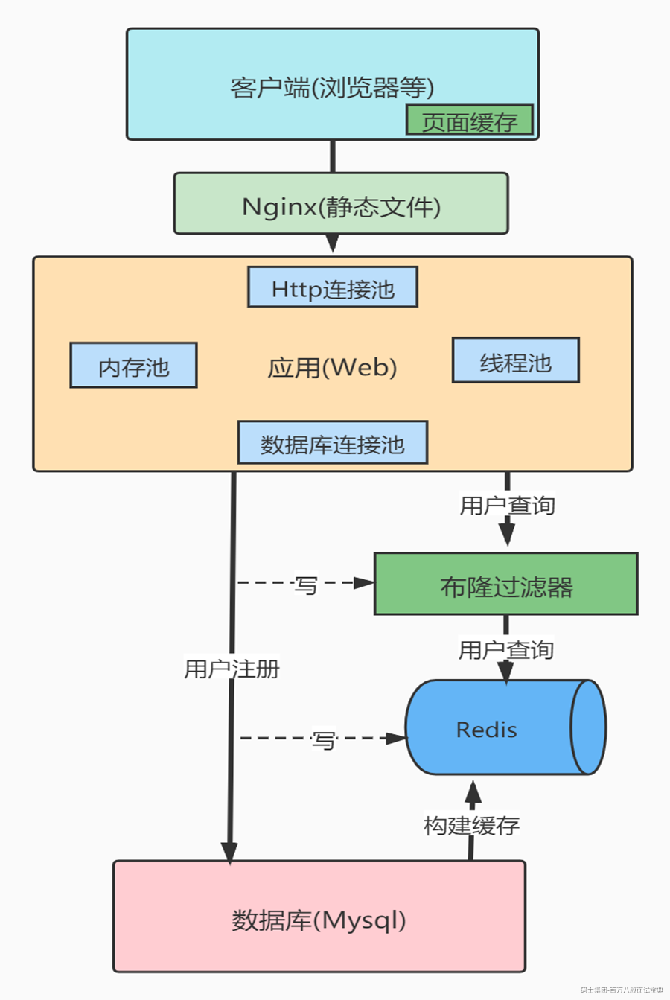

这种方法适用于数据命中不高、数据相对固定、实时性低(通常是数据集较大)的应用场景,代码维护较为复杂,但是缓存空间占用少。

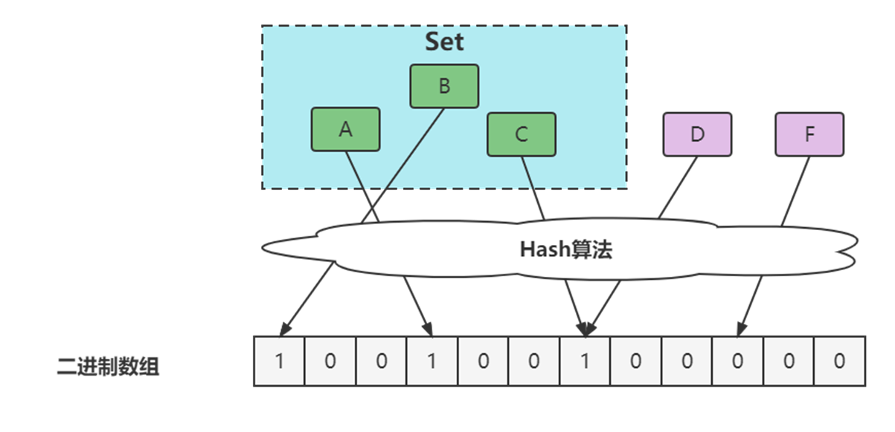

#### Redis中的布隆过滤器

##### Redisson

Maven引入Redisson

```plain
   <dependency>
            <groupId>org.redisson</groupId>

            <artifactId>redisson</artifactId>

            <version>3.12.3</version>

        </dependency>

```

```plain
package com.msb.redis.advtype;

import org.redisson.Redisson;
import org.redisson.api.RBloomFilter;
import org.redisson.api.RedissonClient;
import org.redisson.config.Config;

/*Redisson底层基于位图实现了一个布隆过滤器，使用非常方便*/
public class RedissonBF {
    public static void main(String[] args) {
        Config config = new Config();
        config.useSingleServer().setAddress("redis://127.0.0.1:6379");

        //构造Redisson
        RedissonClient redisson = Redisson.create(config);

        RBloomFilter<String> bloomFilter = redisson.getBloomFilter("phoneList");
        //初始化布隆过滤器：预计元素为20000L,误差率为3%
        bloomFilter.tryInit(20000L,0.03);
        //将号码1~10086插入到布隆过滤器中
        for(int i =1;i<=10086 ;i++){
            bloomFilter.add(String.valueOf(i));
        }

        //判断下面号码是否在布隆过滤器中
        System.out.println("996:BF--"+bloomFilter.contains("996"));//true
        System.out.println("10086:BF--"+bloomFilter.contains("10086"));//true
        System.out.println("10088:BF--"+bloomFilter.contains("10088"));//false
        System.out.println("10096:BF--"+bloomFilter.contains("10096"));//false
        System.out.println("10340:BF--"+bloomFilter.contains("10340"));//?
        //布隆过滤器（送入布隆过滤器的元素，判断是一定在的）
//        for(int i =1;i<=10086 ;i++){
//            if(!bloomFilter.contains(String.valueOf(i))){
//                System.out.println("送入BF的不一定在："+i);
//            }
//        }

    }
}

```

**实验结果**

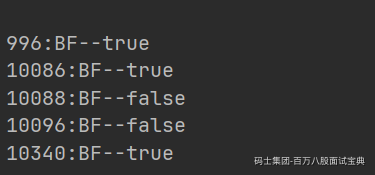

#### 布隆过滤器的误判问题

Ø通过hash计算在数组上不一定在集合

Ø本质是hash冲突

Ø通过hash计算不在数组的一定不在集合（误判）

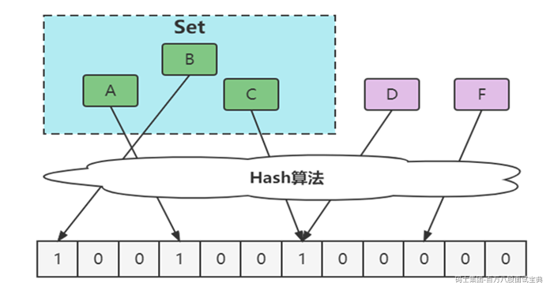

**优化方案**

增大数组(预估适合值)

也可以增加hash算法个数（不过这里不太推荐，要么是做多个数组，要么就是）

### HyperLogLog

#### 介绍

HyperLogLog并不是一种新的数据结构(实际类型为字符串类型)，而是一种基数算法,通过HyperLogLog可以利用极小的内存空间完成独立总数的统计（去重的），数据集可以是IP、Email、ID等。

本质就是UV统计：如果你负责开发维护一个大型的网站，有一天产品经理要网站每个网页每天的 UV 数据（每个页面有多少个不同的用户访问过），然后让你来开发这个统计模块，你会如何实现？

1、Redis的incr做计数器是不行的，因为这里有重复，重复的用户访问一次，这个count就加1是不行的。

2、使用set集合存储所有当天访问过此页面的用户 ID，当一个请求过来时，我们使用 sadd 将用户 ID 塞进去就可以了。通过 scard 可以取出这个集合的大小，这个数字就是这个页面的 UV 数据。

不过使用set集合，这就非常浪费空间。如果这样的页面很多，那所需要的存储空间是惊人的。

3、如果你需要的数据不需要太精确，那么可以使用HyperLogLog，Redis 提供了 HyperLogLog 数据结构就是用来解决这种统计问题的。

**HyperLogLog 提供不精确的去重计数方案，虽然不精确但是也不是非常不精确，Redis官方给出标准误差是0.81%，这样的精确度已经可以满足上面的UV 统计需求了。**

#### 操作命令

HyperLogLog提供了3个命令: pfadd、pfcount、pfmerge。

```plain
pfadd key element [element …] 向HyperLogLog 添加元素,如果添加成功返回1:
pfcount key [key …]   计算一个或多个HyperLogLog的独立总数
pfmerge destkey sourcekey [sourcekey ... ]  求出多个HyperLogLog的并集并赋值给destkey
```

#### 演示案例

```plain
pfadd uv-count u1 u2 u3 u4 u5 u6 u7 u8 u9
pfcount uv-count
pfadd uv-count2 u11 u12 u13 u14 u15 u16 u17 u18 u19
pfmerge uv-all uv-count uv-count2
pfcount uv-all
```

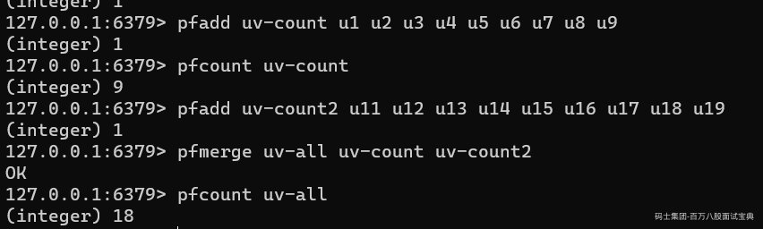

#### 代码演示

```plain
package com.msb.redis.advtype;
import redis.clients.jedis.Jedis;
import redis.clients.jedis.JedisPool;
import redis.clients.jedis.JedisPoolConfig;
/*HyperLogLog测试UV与set的对比*/
public class HyperLogLogTest {
    public static void main(String[] args) {
        JedisPoolConfig jedisPoolConfig = new JedisPoolConfig();
        JedisPool jedisPool = new JedisPool(jedisPoolConfig, "127.0.0.1", 6379, 30000);
        Jedis jedis1 = null;
        try {
            jedis1 = jedisPool.getResource();
            for(int i=0;i<10000;i++){ //1万个元素
                jedis1.pfadd("hyper-count","user"+i);
            }
            long total = jedis1.pfcount("hyper-count");
            System.out.println("实际次数:" + 10000 + "，HyperLogLog统计次数:"+total);
        } catch (Exception e) {
            e.printStackTrace();
        } finally {
            jedis1.close();
        }

        Jedis jedis2 = null;
        try {
            jedis2 = jedisPool.getResource();
            for(int i=0;i<10000;i++){ //1万个元素
                jedis2.sadd("set-count","user"+i);
            }
            long total = jedis2.scard("set-count");
            System.out.println("实际次数:" + 10000 + "，set统计次数:"+total);
        } catch (Exception e) {
            e.printStackTrace();
        } finally {
            jedis2.close();
        }

    }
}

```


同时使用debug命令测试一下他们的存储的比较，只有之前的1 /10

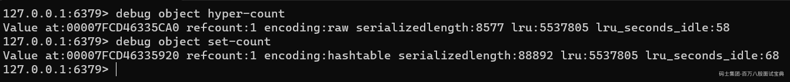

可以看到，HyperLogLog内存占用量小得惊人，但是用如此小空间来估算如此巨大的数据，必然不是100%的正确，其中一定存在误差率。前面说过，Redis官方给出的数字是0.81%的失误率。

#### 底层原理

原理挺难的，总结一句话就是：HyperLogLog基于概率论中伯努利试验并结合了极大似然估算方法，并做了分桶优化。

大白话就是：如果你开一家彩票店，针对一期双色球之类的开奖，如果一个人买很多个不同的号（下单注），如果它中了1等奖是可以估算他买了多少注的，中了2等奖是可以估算他买了多少注的。

因为这块内容的话，面试被问到的几率很小（因为有概率论和其他的东西组成）

感兴趣的小伙伴可以看我以前讲的课：[https://www.mashibing.com/study?courseNo=2185§ionNo=89800&systemId=1&courseVersionId=2977](https://www.mashibing.com/study?courseNo=2185&sectionNo=89800&systemId=1&courseVersionId=2977)

### GEO

Redis 3.2版本提供了GEO(地理信息定位)功能，支持存储地理位置信息用来实现诸如附近位置、摇一摇这类依赖于地理位置信息的功能。

在日常生活中，我们越来越依赖搜索“附近的餐馆”、在打车软件上叫车，这些都离不开基于位置信息服务（Location-Based Service，LBS）的应用。LBS 应用访问的数据是和人或物关联的一组经纬度信息，而且要能查询相邻的经纬度范围，GEO 就非常适合应用在LBS 服务的场景中。

#### 操作命令

```plain
geoadd key longitude latitude member [longitude latitude member ...  longitude、latitude、member分别是该地理位置的经度、纬度、成员
geopos key member [member ...] 获取地理位置信息
zrem key member 删除地理位置信息（GEO没有提供删除成员的命令）
geodist key member1 member2  [unit] 获取两个地理位置的距离 （unit代表返回结果的单位：m (meters)代表米。km (kilometers)代表公里。mi (miles)代表英里。ft(feet)代表尺。）

georadiusbymember key member radius m|km|ft|mi  [withcoord][withdist]  以一个地理位置为中心（成员）算出指定半径内（radius）的其他地理信息位置（其中radius  m | km |ft |mi是必需参数，指定了半径(带单位)）

georadius key longitude latitude radius m|km|ft|mi [withcoord][withdist]以一个地理位置为中心（latitude 经度、latitude 维度）算出指定半径内的其他地理信息位置（其中radius  m | km |ft |mi是必需参数，指定了半径(带单位)）

geohash key member [member ...]  获取geohash（将二维经纬度转换为一维字符串）

```

#### 演示案例

longitude、latitude、member分别是该地理位置的经度、纬度、成员，例如下面有5个城市的经纬度。

城市 经度 纬度 成员

北京 116.28 39.55 beijing

天津 117.12 39.08 tianjin

石家庄 114.29 38.02 shijiazhuang

唐山 118.01 39.38 tangshan

保定 115.29 38.51 baoding

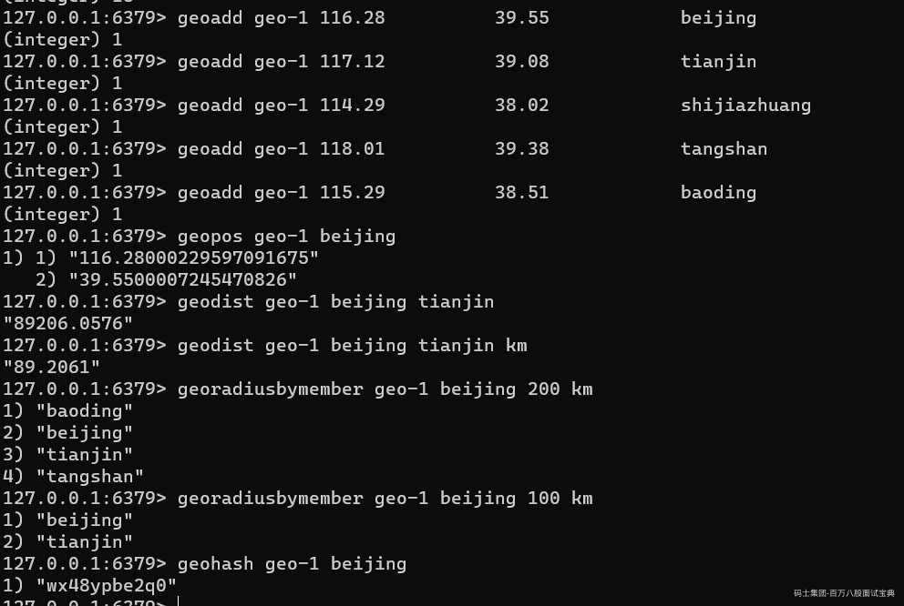

所以在我们的网约车项目中，如果要实现叫车的功能，那么就可以使用Redis的GEO的功能，把经纬度的精度弄精确一段，就可以实现1000M之类的叫车之类的服务。

#### 底层原理

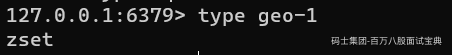

GEO 类型的底层数据结构就是用 Sorted Set 来实现的。但是你发现一个问题，就是ZSET只有一个score的分数，那么GEO是如何表示精度和纬度两个值的呢！！！

核心就是Geohash编码

##### Geohash编码

比如北京 的经度和维度，（116.28，39.55），转化成二进制是0010 1101 0110 1100、1111 0111 0011，然后进行二进制的组合：第 0 位是经度的第 0 位 1，第 1 位是纬度的第 0 位 1，第 2 位是经度的第 1 位 1，第 3位是纬度的第 1 位 0，以此类推。最后得到最终的编码（大概的思想和方式）：

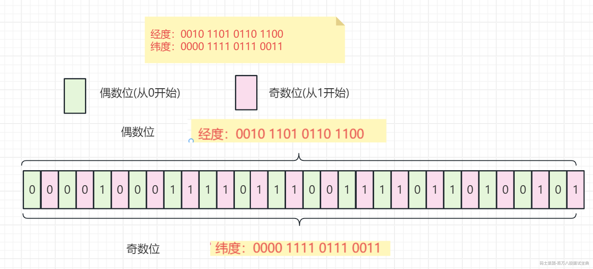

然后就使用最后得出的这个二进制数组，保存为 Sorted Set 的权重分数。
