# Redis-持久化与内存淘汰策略

## Redis的持久化机制

Redis虽然是个内存数据库，这里也有一个绝对不能忽略的问题：一旦服务器宕机，内存中的数据将全部丢失。

所以Redis支持RDB和AOF两种持久化机制，将数据写往磁盘，可以有效地避免因进程退出造成的数据丢失问题，当下次重启时利用之前持久化的文件即可实现数据恢复。即使Redis宕机了，Redis可以有效的避免数据丢失问题。

### RDB持久化

RDB持久化是把当前进程数据生成快照保存到硬盘的过程。所谓内存快照，就是指内存中的数据在某一个时刻的状态记录。这就类似于照片，当你给朋友拍照时，一张照片就能把朋友一瞬间的形象完全记下来。RDB 就是Redis DataBase 的缩写。

保存的RDB文件是，生成的RDB二进制文件名，默认为 `dump.db`，`dir ./`是生成的RDB二进制文件的存放路径

#### RDB-内存快照要考虑的问题

1、对哪些数据做快照？这关系到快照的执行效率问题？

Redis的数据都在内存，为了提供所有数据的可靠性保证，它执行的是全量快照。

2、做快照时，数据还能被增删改吗？这关系到 Redis 是否被阻塞，能否同时正常处理请求。

因为Redis的数据处理是单线程（新版本中加入了多线程，不过也是针对IO，数据处理依然是单线程），我们要尽量避免所有会阻塞主线程的操作

#### 手动持久化

Redis 提供了两个手动命令来生成 RDB 文件，分别是 save 和 bgsave。

save：在主线程中执行，会导致阻塞；对于内存比较大的实例会造成长时间阻塞，线上环境不建议使用。  
bgsave：创建一个子进程，专门用于写入 RDB 文件，避免了主线程的阻塞，这也是Redis RDB 文件生成的默认配置。

命令实战演示

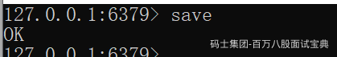

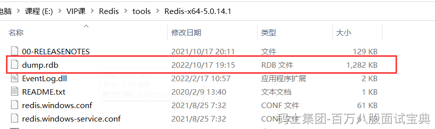

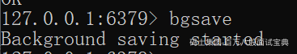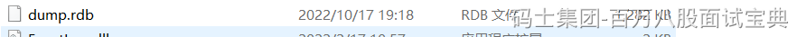

#### 自动持久化

除了执行命令手动触发之外，Redis内部还存在自动触发RDB 的持久化机制，例如以下场景:

1)使用save相关配置,如“save m n”。表示m秒内数据集存在n次修改时，自动触发bgsave。

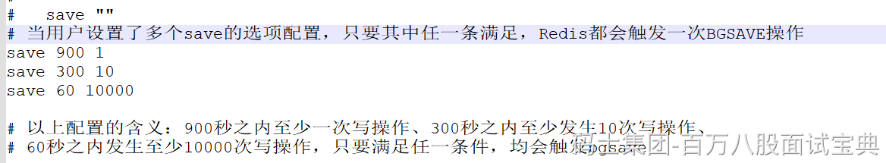

2）如果从节点执行全量复制操作，主节点自动执行bgsave生成RDB文件并发送给从节点。

3)执行debug reload命令重新加载Redis 时，也会自动触发save操作。

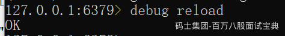

4）默认情况下执行shutdown命令时，如果没有开启AOF持久化功能则自动执行bgsave。

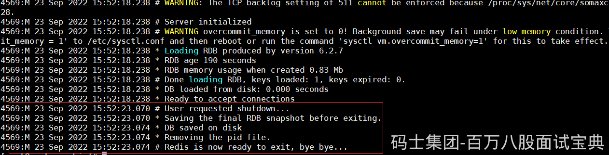

关闭RDB持久化，在课程讲述的Redis版本（6.2.4）上，是将配置文件中的save配置改为 save “”

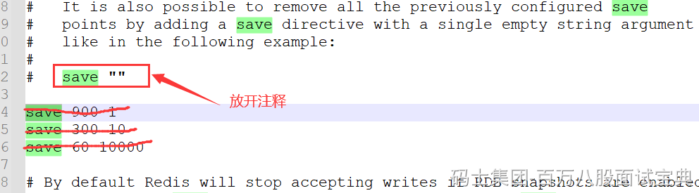

#### bgsave执的行流程

为了快照而暂停写操作，肯定是不能接受的。所以这个时候，Redis 就会借助操作系统提供的写时复制技术（Copy-On-Write, COW），在执行快照的同时，正常处理写操作。

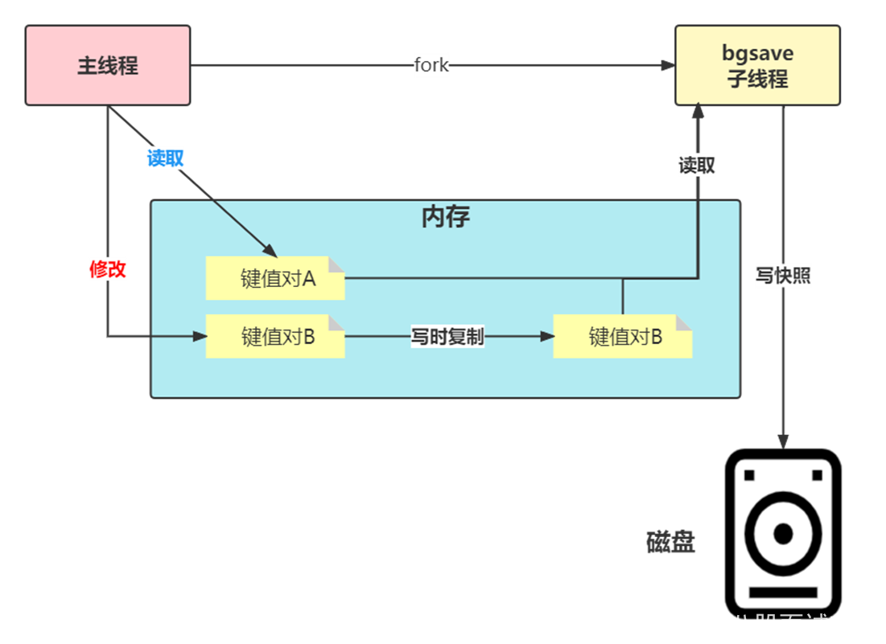

bgsave 子进程是由主线程 fork 生成的，可以共享主线程的所有内存数据。bgsave 子进程运行后，开始读取主线程的内存数据，并把它们写入 RDB 文件。

如果主线程对这些数据也都是读操作（例如图中的键值对 A），那么，主线程和bgsave 子进程相互不影响。但是，如果主线程要修改一块数据（例如图中的键值对 B），那么，这块数据就会被复制一份，生成该数据的副本。然后，bgsave 子进程会把这个副本数据写入 RDB 文件，而在这个过程中，主线程仍然可以直接修改原来的数据。

这既保证了快照的完整性，也允许主线程同时对数据进行修改，避免了对正常业务的影响。

#### RDB文件

RDB文件保存在dir配置指定的目录下，文件名通过dbfilename配置指定。

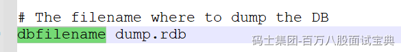

可以通过执行config set dir {newDir}和config set dbfilename (newFileName}运行期动态执行,当下次运行时RDB文件会保存到新目录。

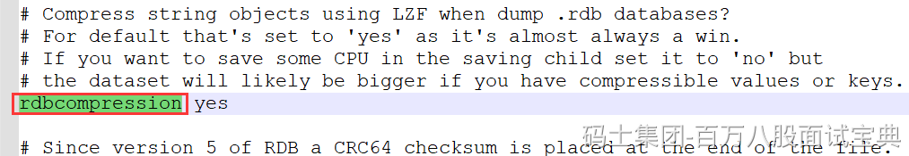

Redis默认采用LZF算法对生成的RDB文件做压缩处理，压缩后的文件远远小于内存大小，默认开启，可以通过参数config set rdbcompression { yes |no}动态修改。  
虽然压缩RDB会消耗CPU，但可大幅降低文件的体积，方便保存到硬盘或通过网维示络发送给从节点,因此线上建议开启。  
如果 Redis加载损坏的RDB文件时拒绝启动,并打印如下日志:

```plain
Short read or OOM loading DB. Unrecoverable error，aborting now.
```

这时可以使用Redis提供的redis-check-rdb工具(老版本是redis-check-dump)检测RDB文件并获取对应的错误报告。

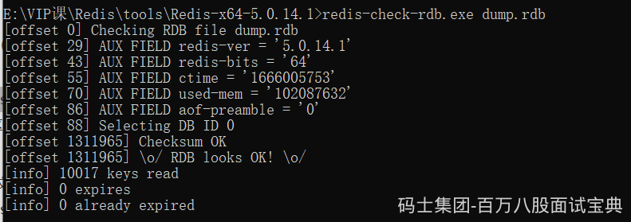

#### RDB的优点

RDB是一个紧凑压缩的二进制文件，代表Redis在某个时间点上的数据快照。非常适用于备份,全量复制等场景。

比如每隔几小时执行bgsave备份，并把 RDB文件拷贝到远程机器或者文件系统中(如hdfs),，用于灾难恢复。

Redis加载RDB恢复数据远远快于AOF的方式。

#### RDB的缺点

RDB方式数据没办法做到实时持久化/秒级持久化。因为bgsave每次运行都要执行fork操作创建子进程,属于重量级操作,频繁执行成本过高。

RDB文件使用特定二进制格式保存，Redis版本演进过程中有多个格式的RDB版本，存在老版本Redis服务无法兼容新版RDB格式的问题。

#### Redis中RDB导致的数据丢失问题

针对RDB不适合实时持久化的问题,Redis提供了AOF持久化方式来解决。

如下图所示，我们先在 T0 时刻做了一次快照（下一次快照是T4时刻），然后在T1时刻，数据块 5 和 8 被修改了。如果在T2时刻，机器宕机了，那么，只能按照 T0 时刻的快照进行恢复。此时，数据块 5 和 8 的修改值因为没有快照记录，就无法恢复了。

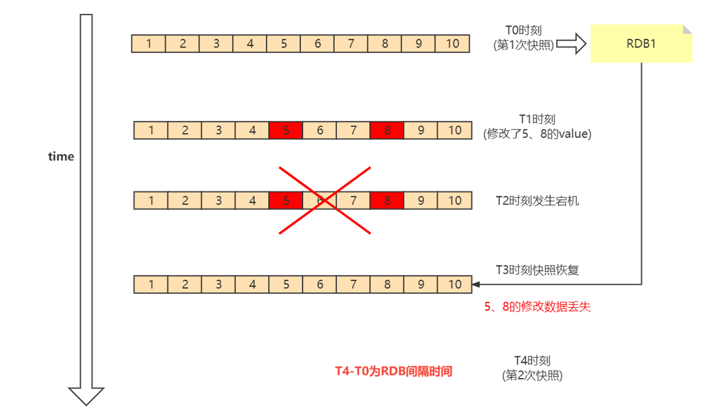

所以这里可以看出，如果想丢失较少的数据，那么T4-T0就要尽可能的小，但是如果频繁地执行全量  
快照，也会带来两方面的开销：

1、频繁将全量数据写入磁盘，会给磁盘带来很大压力，多个快照竞争有限的磁盘带宽，前一个快照还没有做完，后一个又开始做了，容易造成恶性循环。

2、另一方面，bgsave 子进程需要通过 fork 操作从主线程创建出来。虽然子进程在创建后不会再阻塞主线程，但是，fork 这个创建过程本身会阻塞主线程，而且主线程的内存越大，阻塞时间越长。如果频繁fork出bgsave 子进程，这就会频繁阻塞主线程了。

所以基于这种情况，我们就需要AOF的持久化机制。

### AOF持久化

AOF(append only file)持久化:以独立日志的方式记录每次写命令，重启时再重新执行AOF文件中的命令达到恢复数据的目的。AOF的主要作用是解决了数据持久化的实时性,目前已经是Redis持久化的主流方式。理解掌握好AOF持久化机制对我们兼顾数据安全性和性能非常有帮助。

#### 使用AOF

开启AOF功能需要设置配置:appendonly yes，默认不开启。

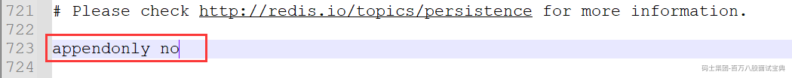

redis的配置文件

```plain
appendonly yes
appendfilename "appendonly.aof"
appenddirname "appendonlydir"
appendfsync everysec
```

appendfilename表示aof文件的名称，开启aof持久化，每个写操作的命令会被写入aof文件中（一个文件）

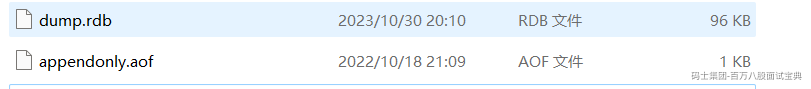

redis7以后，不单单生成了appendonly.aof文件，而是生成了三个文件

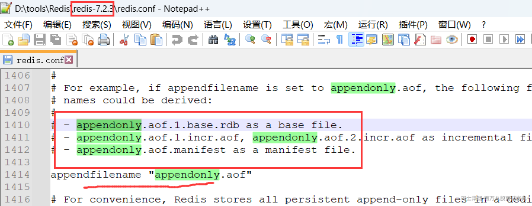

AOF文件名通过appendfilename配置设置，默认文件名是appendonly.aof。保存路径同RDB持久化方式一致，通过dir配置指定。

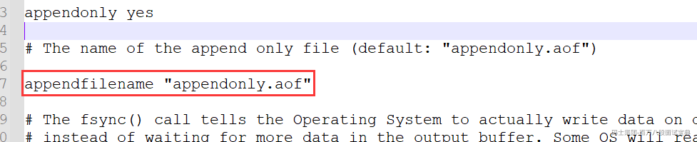

#### AOF三种策略

Redis提供了多种AOF缓冲区同步文件策略，由参数appendfsync控制。

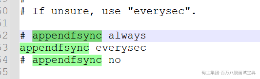

**always** 同步写回：每个写命令执行完，立马同步地将日志写回磁盘；

**everysec** 每秒写回：每个写命令执行完，只是先把日志写到 AOF 文件的内存缓冲区，每隔一秒把缓冲区中的内容写入磁盘；

**no** 操作系统控制的写回：每个写命令执行完，只是先把日志写到 AOF 文件的内存缓冲区，由操作系统决定何时将缓冲区内容写回磁盘，通常同步周期最长30秒。

|  |  |  |  |
| --- | --- | --- | --- |
| 配置项 | 写回时机 | 优点 | 缺点 |
| **always** | 同步写回 | 可靠性高、数据基本不丢失 | 性能影响加大，每个写命令都要落地磁盘 |
| **everysec** | 每秒写回 | 性能适中 | 宕机时有1秒内的数据丢失 |
| **no** | 操作系统控制写回 | 性能最好 | 宕机时丢失的数据较多 |

想要获得高性能，就选择 no 策略；如果想要得到高可靠性保证，就选择always 策略；如果允许数据有一点丢失，又希望性能别受太大影响的话，那么就选择everysec 策略。

#### AOF重写机制

随着命令不断写入AOF，文件会越来越大，为了解决这个问题，Redis引入AOF重写机制压缩文件体积。AOF文件重写是把Redis进程内的数据转化为写命令同步到新AOF文件的过程。

手动触发:直接调用bgrewriteaof命令。

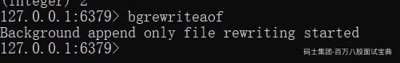

自动触发:根据auto-aof-rewrite-min-size和 auto-aof-rewrite-percentage参数确定自动触发时机。

```plain
auto-aof-rewrite-percentage 100
auto-aof-rewrite-min-size 64mb
```

auto-aof-rewrite-percentage 表示当 AOF 文件大小增长到上一次重写文件时的大小的百分之多少时，Redis 就会自动触发 AOF 重写。例如，当此配置项为 100 时，表示当 AOF 文件大小增长到上次重写时大小的两倍时，就会自动触发 AOF 重写。

auto-aof-rewrite-min-size 表示 Redis 在自动触发 AOF 重写时设置的 AOF 文件最小大小限制。例如，当此配置项为 64MB 时，如果 AOF 文件大小增长到达了触发自动重写的条件，但当前 AOF 文件大小还不到 64MB，则不会自动触发 AOF 重写。

**重写后的AOF 文件为什么可以变小?有如下原因:**

1)进程内已经超时的数据不再写入文件。

2)旧的AOF文件含有无效命令，如set a 111、set a 222、set a 333等。重写使用进程内数据直接生成，这样新的AOF文件只保留最终数据的一条写入命令。

3）多条写命令可以合并为一个，如:lpush list a、lpush list b、lpush list c可以转化为: lpush list a b c。为了防止单条命令过大造成客户端缓冲区溢出，对于list、set、hash、zset等类型操作，以64个元素为界拆分为多条。

虽然 AOF 重写后，日志文件会缩小，但是，要把整个数据库的最新数据的操作日志都写回磁盘，仍然是一个非常耗时的过程。那么如何解决重写阻塞主线程的问题呢？

具体处理方式是这样：

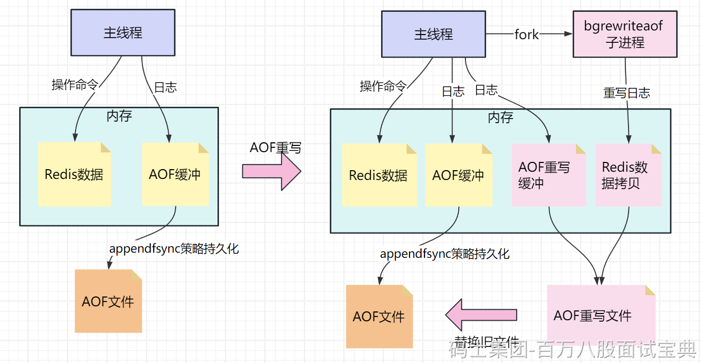

- 每次 AOF 重写时，Redis 会先执行一个内存拷贝，用于重写；

- 然后如果有写操作，会同时写入AOF缓冲以及AOF重写缓冲，使用两个日志保证在重写过程中，新写入的数据不会丢失。而且，因为 Redis 采用额外的线程进行数据重写，所以，这个过程并不会阻塞主线程

### Redis重启后AOF与RDB的顺序

AOF和 RDB 文件都可以用于服务器重启时的数据恢复。redis重启时加载AOF与RDB的顺序是怎么样的呢？

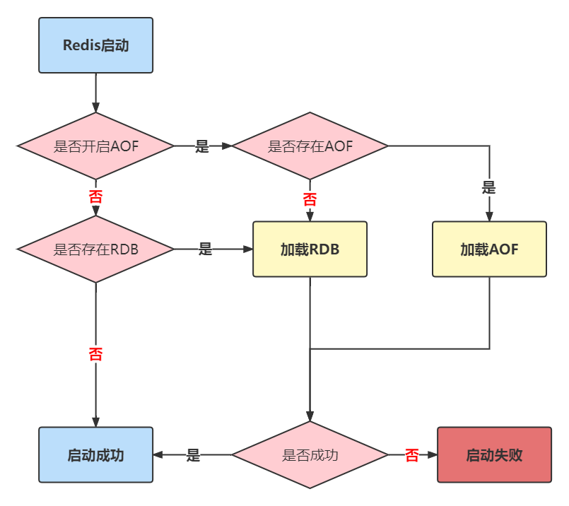

1，当AOF和RDB文件同时存在时，优先加载AOF

2，若关闭了AOF，加载RDB文件

3，加载AOF/RDB成功，redis重启成功

4，AOF/RDB存在错误，启动失败打印错误信息

#### 文件校验

加载损坏的AOF 文件时会拒绝启动，对于错误格式的AOF文件，先进行备份，然后采用redis-check-aof --fix命令进行修复，对比数据的差异，找出丢失的数据，有些可以人工修改补全。

AOF文件可能存在结尾不完整的情况，比如机器突然掉电导致AOF尾部文件命令写入不全。Redis为我们提供了aof-load-truncated 配置来兼容这种情况，默认开启。加载AOF时当遇到此问题时会忽略并继续启动,同时如下警告日志。

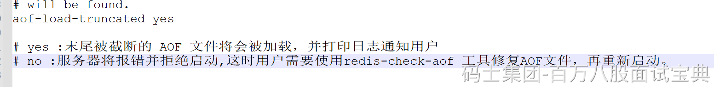

### RDB-AOF混合持久化

Redis 提供了混合持久化方式，即同时使用 RDB 和 AOF 进行数据持久化。在混合持久化中，Redis 会定期执行 RDB 快照持久化，将内存中的数据保存到磁盘上，同时也会将操作命令追加到 AOF 日志文件中。

通过 `aof-use-rdb-preamble` 配置项可以打开混合开关，yes则表示开启，no表示禁用，（7之前的版本默认是禁用的，Redis7默认的是开启），可通过config set修改

```plain
aof-use-rdb-preamble yes
```

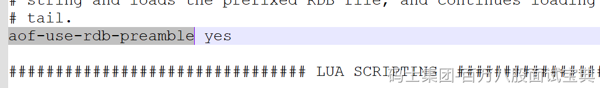

混合持久化借鉴了aof\_rewrite的思路，就是RDB文件写完，再把重写缓冲区的数据，追加到RDB文件的末尾，追加的这部分数据的格式是AOF的命令格式，这就是rdb\_aof的混用。

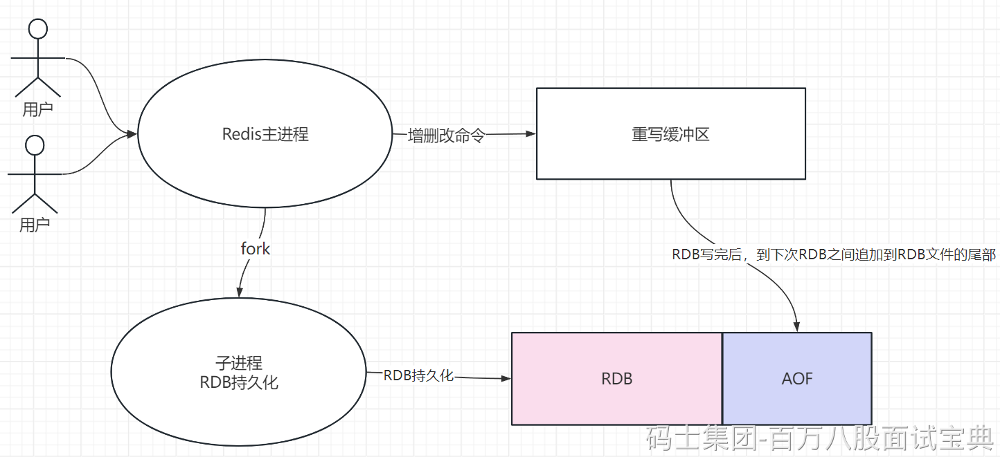

### 持久化相关的问题

#### 主线程、子进程和后台线程的联系与区别？

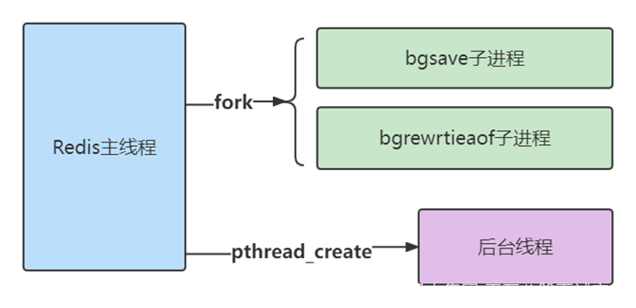

**进程和线程的区别**

从操作系统的角度来看，进程一般是指资源分配单元，例如一个进程拥有自己的堆、栈、虚存空间（页表）、文件描述符等；

而线程一般是指 CPU 进行调度和执行的实体。

一个进程或线程启动后，没有再创建额外的线程，那么，这样的进程一般称为主进程或主线程。

Redis 启动以后，本身就是一个进程，它会接收客户端发送的请求，并处理读写操作请求。而且，接收请求和处理请求操作是 Redis 的主要工作，Redis 没有再依赖于其他线程，所以，我一般把完成这个主要工作的 Redis 进程，称为主进程或主线程。

**主线程与子进程**

通过fork创建的子进程，一般和主线程会共用同一片内存区域，所以上面就需要使用到写时复制技术确保安全。

**后台线程**

从 4.0 版本开始，Redis 也开始使用pthread\_create 创建线程，这些线程在创建后，一般会自行执行一些任务，例如执行异步删除任务

#### Redis持久化过程中有没有其他潜在的阻塞风险？

当Redis做RDB或AOF重写时，一个必不可少的操作就是执行**fork操作创建子进程**,对于大多数操作系统来说fork是个重量级错误。虽然fork创建的子进程不需要拷贝父进程的物理内存空间，但是会复制父进程的空间内存页表。例如对于10GB的Redis进程，需要复制大约20MB的内存页表，因此fork操作耗时跟进程总内存量息息相关，如果使用虚拟化技术，特别是Xen虚拟机,fork操作会更耗时。

**fork耗时问题定位:**

对于高流量的Redis实例OPS可达5万以上，如果fork操作耗时在秒级别将拖慢Redis几万条命令执行，对线上应用延迟影响非常明显。正常情况下fork耗时应该是每GB消耗20毫秒左右。可以在info stats统计中查latest\_fork\_usec指标获取最近一次fork操作耗时,单位微秒。

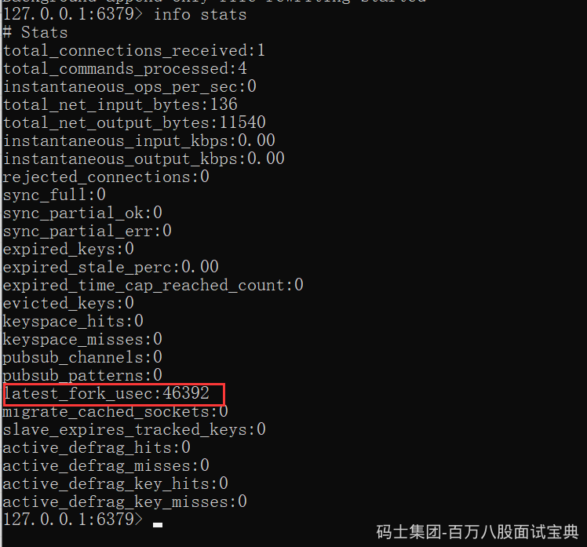

如何改善fork操作的耗时:

1）优先使用物理机或者高效支持fork操作的虚拟化技术

2）控制Redis实例最大可用内存，fork耗时跟内存量成正比,线上建议每个Redis实例内存控制在10GB 以内。

3）降低fork操作的频率，如适度放宽AOF自动触发时机，避免不必要的全量复制等。

#### 为什么主从库间的复制不使用 AOF？

1、RDB 文件是二进制文件，无论是要把 RDB 写入磁盘，还是要通过网络传输 RDB，IO效率都比记录和传输 AOF 的高。

2、在从库端进行恢复时，用 RDB 的恢复效率要高于用 AOF。

## 内存缓存淘汰策略

### 淘汰策略

当 Redis 内存超出物理内存限制时，内存的数据会开始和磁盘产生频繁的交换 (swap)。交换会让 Redis 的性能急剧下降，对于访问量比较频繁的 Redis 来说，这样龟速的存取效率基本上等于不可用。

Redis 提供了配置参数 maxmemory 来限制内存超出期望大小。

```plain
Noeviction 这是默认的淘汰策略 不会继续服务写请求
(DEL 请求可以继续服务)，读请求可以继续进行。这样可以保证不会丢失数据，但是会让线上的业务不能持续进行。。
volatile-lru 尝试淘汰设置了过期时间的key，最老使用的 key 优先被淘汰。没有设置过期时间的key不会被淘汰，这样可以保证需要持久化的数据不会突然丢失。
volatile-ttl  跟上面一样，除了淘汰的策略不是 LRU，而是 key 的剩余寿命 ttl 的值，ttl 越小越优先被淘汰。
volatile-random 跟上面一样，不过淘汰的 key 是过期 key 集合中随机的 key。
allkeys-lru 区别于volatile-lru，这个策略要淘汰的 key 对象是全体的 key 集合，而不只是过期的 key 集合。这意味着没有设置过期时间的 key 也会被淘汰。
allkeys-random  跟上面一样，不过淘汰的策略是随机的 key。
```

### 过期策略

Redis 所有的数据结构都可以设置过期时间，时间一到，就会自动删除。不过Redis的处理不是简单的删除，而是采用定期删除+惰性删除的策略

#### 定期删除

redis 会将每个设置了过期时间的key 放入到一个独立的字典中，以后会定时遍历这个字典来删除到期的 key。

##### 定时扫描策略

Redis 默认会每秒进行十次过期扫描，过期扫描不会遍历过期字典中所有的 key，而是采用了一种简单的贪心策略。

1、从过期字典中随机 20 个 key；

2、删除这 20 个 key 中已经过期的 key；

3、如果过期的 key 比率超过 1/4（过期字典中过期 key 的比例），那就重复步骤 1；

**从库的过期策略**

从库不会进行过期扫描，从库对过期的处理是被动的。主库在 key 到期时，会在 AOF 文件里增加一条 del 指令，同步到所有的从库，从库通过执行这条 del 指令来删除过期的 key。

因为指令同步是异步进行的，所以主库过期的key 的 del 指令没有及时同步到从库的话，会出现主从数据的不一致，主库没有的数据在从库里还存在，比如上一节的集群环境分布式锁的算法漏洞就是因为这个同步延迟产生的。

除了定时遍历之外，它还会使用惰性策略来删除过期的 key，所谓惰性策略就是在客户端访问这个 key 的时候，redis 对 key 的过期时间进行检查，如果过期了就立即删除。定时删除是集中处理，惰性删除是零散处理。

##### 惰性删除

所谓惰性策略就是在客户端访问这个key的时候，redis对key的过期时间进行检查，如果过期了就立即删除，不会给你返回任何东西。

定期删除可能会导致很多过期key到了时间并没有被删除掉。所以就有了惰性删除。假如你的过期 key，靠定期删除没有被删除掉，还停留在内存里，除非你的系统去查一下那个 key，才会被redis给删除掉。这就是所谓的惰性删除，即当你主动去查过期的key时,如果发现key过期了,就立即进行删除,不返回任何东西.

**总结：定期删除是集中处理，惰性删除是零散处理。**

### 底层原理

#### LRU 算法与近似LRU算法

实现 LRU 算法除了需要key/value 字典外，还需要附加一个链表，链表中的元素按照一定的顺序进行排列。当空间满的时候，会踢掉链表尾部的元素。当字典的某个元素被访问时，它在链表中的位置会被移动到表头。所以链表的元素排列顺序就是元素最近被访问的时间顺序。

位于链表尾部的元素就是不被重用的元素，所以会被踢掉。位于表头的元素就是最近刚刚被人用过的元素，所以暂时不会被踢。

Redis 使用的是一种近似 LRU 算法，它跟 LRU 算法还不太一样。之所以不使用 LRU 算法，是因为需要消耗大量的额外的内存，需要对现有的数据结构进行较大的改造。

1、Redis 为实现近似 LRU 算法，它给每个key增加了一个额外的小字段，这个字段的长度是 24 个 bit，也就是最后一次被访问的时间戳。

2、这个算法也很简单，redis为对key集合进随机抽样，就是随机采样出 5 个 key(可以配置maxmemory-samples)，然后淘汰掉最旧的 key，如果淘汰后内存还是超出 maxmemory，那就继续随机采样淘汰，直到内存低于 maxmemory 为止。

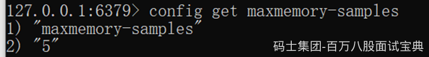

#### LFU算法

LFU它的全称是Least Frequently Used，它的核心思想是根据key的最近被访问的频率进行淘汰，很少被访问的优先被淘汰，被访问的多的则被留下来。

**LFU一共有两种策略：**

volatile-lfu：在设置了过期时间的key中使用LFU算法淘汰key

allkeys-lfu：在所有的key中使用LFU算法淘汰数据

LFU算法能更好的表示一个key被访问的热度。假如你使用的是LRU算法，一个key很久没有被访问到，只刚刚是偶尔被访问了一次，那么它就被认为是热点数据，不会被淘汰，而有些key将来是很有可能被访问到的则被淘汰了。如果使用LFU算法则不会出现这种情况，因为使用一次并不会使一个key成为热点数据。

LFU原理使用计数器来对key进行排序，每次key被访问的时候，计数器增大。计数器越大，可以约等于访问越频繁。具有相同引用计数的数据块则按照时间排序。

##### LFU底层实现

LFU把原来的key对象的内部时钟的24位分成两部分，前16位ldt还代表时钟，后8位logc代表一个计数器。

logc是8个 bit，用来存储访问频次，因为8个 bit能表示的最大整数值为255，存储频次肯定远远不够，所以这8个 bit存储的是频次的对数值，并且这个值还会随时间衰减，如果它的值比较小，那么就很容易被回收。为了确保新创建的对象不被回收，新对象的这8个bit会被初始化为一个大于零的值LFU INIT\_VAL（默认是=5）。

ldt是16个bit，用来存储上一次 logc的更新时间。因为只有16个 bit，所精度不可能很高。它取的是分钟时间戳对2的16次方进行取模。

ldt的值和LRU模式的lru字段不一样的地方是,  
ldt不是在对象被访问时更新的,而是在Redis 的淘汰逻辑进行时进行更新，淘汰逻辑只会在内存达到 maxmemory 的设置时才会触发，在每一个指令的执行之前都会触发。每次淘汰都是采用随机策略，随机挑选若干个 key，更新这个 key 的“热度”，淘汰掉“热度”最低的key。因为Redis采用的是随机算法，如果  
key比较多的话，那么ldt更新得可能会比较慢。不过既然它是分钟级别的精度，也没有必要更新得过于频繁。

ldt更新的同时也会一同衰减logc的值。

### 内存碎片问题

在使用 Redis 时，我们经常会遇到这样一个问题：明明做了数据删除，数据量已经不大了，为什么使用 top 命令查看时，还会发现 Redis 占用了很多内存呢？

这是因为，当数据删除后，Redis 释放的内存空间会由内存分配器管理，并不会立即返回给操作系统。所以，操作系统仍然会记录着给 Redis 分配了大量内存，这种情况有很大可能性是内存碎片导致！！！

内存分配器一般是按固定大小来分配内存，而不是完全按照应用程序申请的内存空间大小给程序分配。

例如，Redis 申请一个 20 字节的空间保存数据，jemalloc 就会分配 32 字节，此时，如果应用还要写入 10 字节的数据，Redis 就不用再向操作系统申请空间了，因为刚才分配的 32 字节已经够用了，这就避免了一次分配操作。

Redis 可以使用 libc、jemalloc、tcmalloc 多种内存分配器来分配内存，默认使用jemalloc。

jemalloc 的分配策略之一，是按照一系列固定的大小划分内存空间，例如 8 字节、16 字节、32 字节、48 字节，…, 2KB、4KB、8KB 等。当程序申请的内存最接近某个固定值时，jemalloc 会给它分配相应大小的空间。

如果 Redis 每次向分配器申请的内存空间大小不一样，这种分配方式就会有形成碎片的风险

#### 如何判断是否有内存碎片？

Redis 自身提供了 INFO 命令，可以用来查询内存使用的详细信息，

#### 如何清理内存碎片？

1、重启，当然，这并不是一个“优雅”的方法。

2、启用自动内存碎片清理

```plain
config set activedefrag yes
```

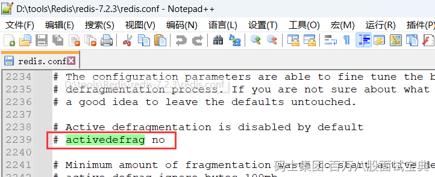

这个命令只是启用了自动清理功能，但是，具体什么时候清理，会受到下面这两个参数的控制。这两个参数分别设置了触发内存清理的一个条件，如果同时满足这两个条件，就开始清理。在清理的过程中，只要有一个条件不满足了，就停止自动清理。

```plain
active-defrag-ignore-bytes 100mb：表示内存碎片的字节数达到 100MB 时，开始清理；
active-defrag-threshold-lower 10：表示内存碎片空间占操作系统分配给 Redis 的总空间比例达到 10% 时，开始清理。
```

为了尽可能减少碎片清理对 Redis 正常请求处理的影响，自动内存碎片清理功能在执行时，还会监控清理操作占用的 CPU 时间，而且还设置了两个参数，分别用于控制清理操作占用的 CPU 时间比例的上、下限，既保证清理工作能正常进行，又避免了降低 Redis 性能。这两个参数具体如下

```plain
active-defrag-cycle-min 25： 表示自动清理过程所用 CPU 时间的比例不低于25%，保证清理能正常开展；
active-defrag-cycle-max 75：表示自动清理过程所用 CPU 时间的比例不高于75%，一旦超过，就停止清理，从而避免在清理时，大量的内存拷贝阻塞 Redis，导致
响应延迟升高
```

Redis 自身提供了 INFO 命令，可以用来查询内存使用的详细信息，

```plain
info memory
```

mem\_fragmentation\_ratio 的指标，它表示的就是 Redis 当前的内存碎片率

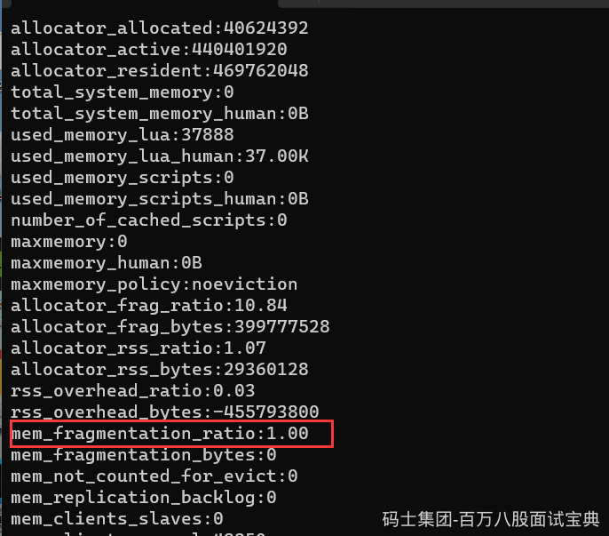

mem\_fragmentation\_ratio 的指标的值是上面的命令中的两个指标used\_memory\_rss 和 used\_memory 相除的结果

used\_memory\_rss 是操作系统实际分配给 Redis 的物理内存空间，里面就包含了碎片

used\_memory 是 Redis 为了保存数据实际申请使用的空间

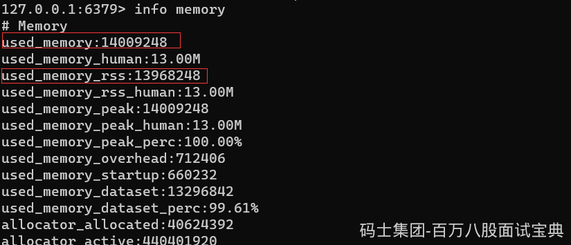

#### Redis内存碎片清理算法

操作系统在清理碎片时，会先把应用 KeyC 的数据拷贝到 2 字节的空闲空间中，并释放KeyC原先所占的空间。

这样一来，这段 字节空间的最后6个字节就是一块连续空间了

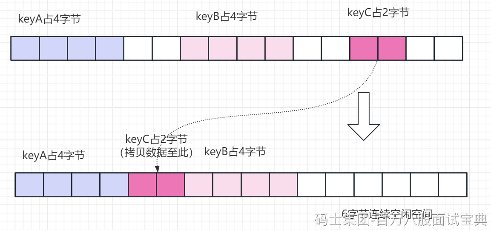

碎片清理是有代价的，操作系统需要把多份数据拷贝到新位置，把原有空间释放出来，这会带来时间开销。因为 Redis 是单线程，在数据拷贝时，Redis 只能等着，这就导致 Redis 无法及时处理请求，性能就会降低
