# 前言

Redis本身是一个高性能的缓存数据库，所以我们需要站在性能的角度去学习Redis，这样就会更加高效！！！

Redis 的快一个重要的表现：它接收到一个键值对操作后，能以微秒级别的速度找到数据，并快速完成操作。

# 1 Redis五大数据类型与底层实现

## 全局命令

```plain
 keys 查看所有键(支持通配符)：
dbsize  返回当前数据库中键的总数
exists 检查键是否存在，存在返回1，不存在返回0。
persist 将键的过期时间清除
type  返回键的数据结构类型
rename 键重命名
del   删除键，返回删除键个数，删除不存在键返回0。同时del命令可以支持删除多个键。
expire 添加过期时间,当超过过期时间后,会自动删除键，时间单位秒。
pexpire  添加过期时间,当超过过期时间后,会自动删除键，时间单位毫秒
pexpireat 添加过期时间,键在毫秒级时间戳timestamp后过期
ttl  查看键的过期时间  -1代表无过期
```

#### 注意事项

1、keys 命令会存在性能问题，因为keys命令要把所有的key-value对全部拉出去，如果生产环境的键值对特别多的话，会对Redis的性能有很大的影响，推荐使用dbsize。

2、对于字符串类型键，执行set命令会去掉过期时间，这个问题很容易在开发中被忽视。

3、Redis不支持二级数据结构(例如哈希、列表)内部元素的过期功能，不能对二级数据结构做过期时间设置。

4、rename命令，rename之前,新键已经存在，那么它的值也将被覆盖。为了防止被强行rename，Redis提供了renamenx命令，确保只有newKey不存在时候才被覆盖

### 性能分析-慢查询

Redis提供慢查询日志帮助开发和运维人员定位系统存在的慢操作。

Redis提供了两种方式进行慢查询的配置

**1、动态设置**

慢查询的阈值默认值是10毫秒

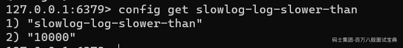

参数：slowlog-log-slower-than就是时间预设阀值，它的单位是微秒(1秒=1000毫秒=1 000 000微秒)，默认值是10 000，假如执行了一条“很慢”的命令（例如keys \*)，如果它的执行时间超过了10 000微秒，也就是10毫秒，那么它将被记录在慢查询日志中。

我们通过动态命令修改

```plain
config set slowlog-log-slower-than 20000  
```

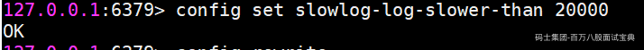

使用config set完后,若想将配置持久化保存到Redis.conf，要执行config rewrite

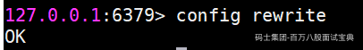

```plain
config rewrite
```

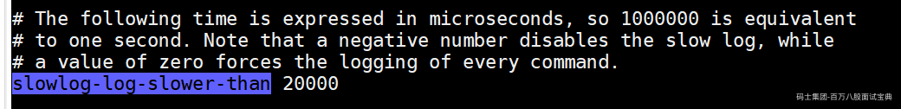

**注意：**

如果配置slowlog-log-slower-than=0表示会记录所有的命令，slowlog-log-slower-than&#x3c;0对于任何命令都不会进行记录。

**2、配置文件设置（修改后需重启服务才生效）**

打开Redis的配置文件redis.conf，就可以看到以下配置：

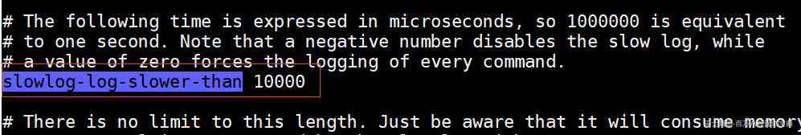

slowlog-max-len用来设置慢查询日志最多存储多少条

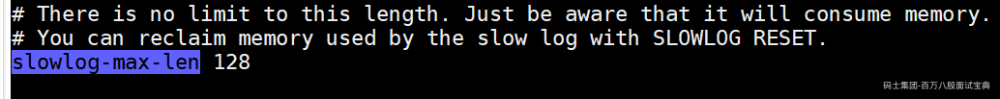

另外Redis还提供了slowlog-max-len配置来解决存储空间的问题。

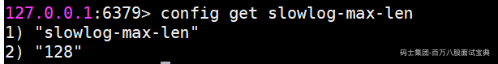

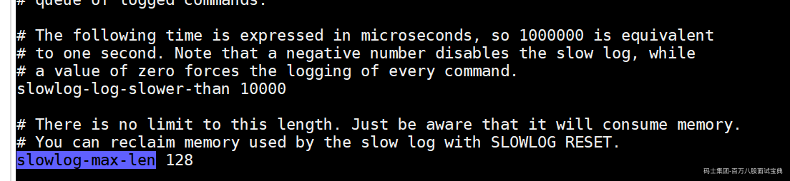

实际上Redis服务器将所有的慢查询日志保存在服务器状态的slowlog链表中（内存列表），slowlog-max-len就是列表的最大长度（默认128条）。当慢查询日志列表被填满后，新的慢查询命令则会继续入队，队列中的第一条数据机会出列。

**获取慢查询日志**

```plain
slowlog get [n] 
```

参数n可以指定查询条数。

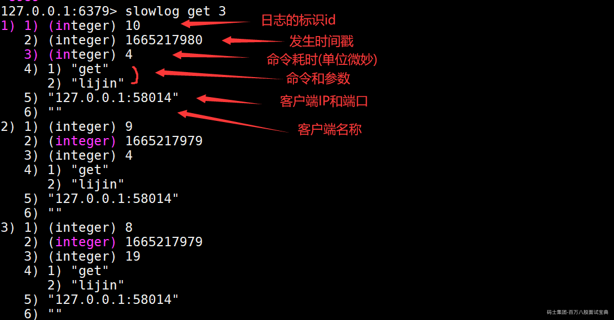

可以看到每个慢查询日志有6个属性组成，分别是慢查询日志的标识id、发生时间戳、命令耗时（单位微秒）、执行命令和参数，客户端IP+端口和客户端名称。

获取慢查询日志列表当前的长度

```plain
slowlog len
```

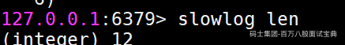

慢查询日志重置

```plain
slowlog reset
```

实际是对列表做清理操作

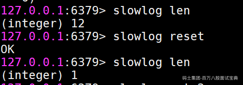

### 全局命令慢查询性能分析

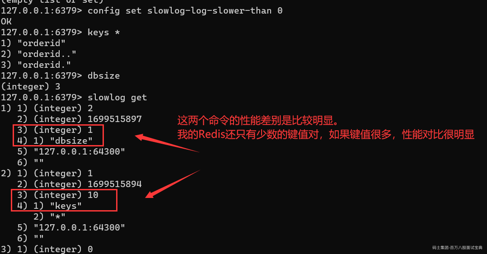

## 字符串（String）

### 常用命令

```plain
set 设置值（命令选项：ex 为键设置秒级过期时间，px 为键设置毫秒级过期时间 ，nx 键必须不存在,才可以设置成功 ，xx 与nx相反,键必须存在，才可以设置成功,用于更新）
setex  设置值,  作用和ex选项是一样的
setnx  设置值,  作用和nx选项是一样的
get 获取值 (如果要获取的键不存在,则返回nil 空 )
mset 批量设置值
mget 批量获取值
getset  和set一样会设置值,但是不同的是，它同时会返回键原来的值
incr 自增1 （值必须是整数，否则报错）
incrby 自增指定数字
decr  自减1
decrby  自减指定数字
incrbyfloat 自增浮点数
append  向字符串尾部追加值
strlen  返回字符串长度（每个中文占3个字节）
setrange 设置指定位置的字符（下标从0开始计算）
getrange 截取字符串（需要指明开始和结束的偏移量，截取的范围是个闭区间）
```

### 性能分析

字符串大部分命令都是O(1)的时间复杂度，速度挺快

批量操作（del 、mset、 mget支持多个键的批量操作）：时间复杂度和键的个数相关，为O(n)

getrange：和字符串长度相关，也是O(n)

### 性能分析依据：全局哈希表

Redis的键值对是如何组织存储的，Redis 使用了一个哈希表来保存所有键值对

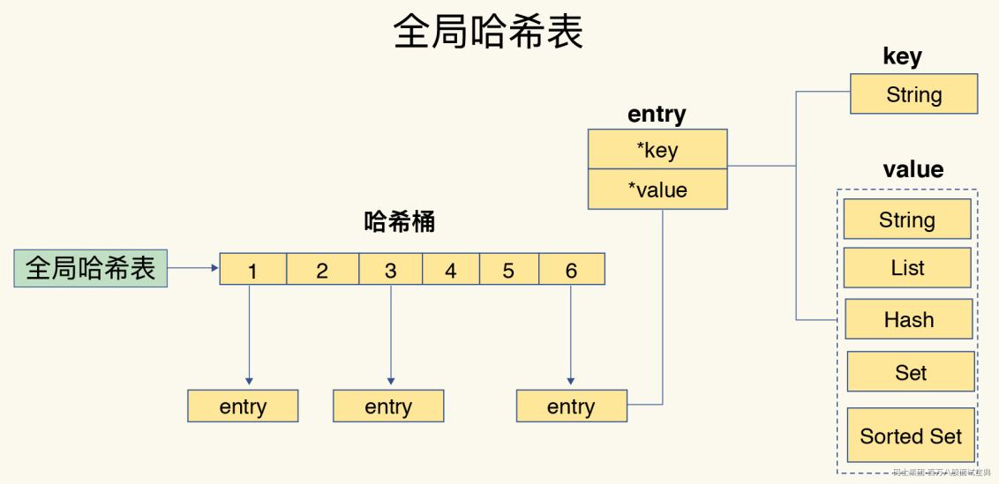

上述哈希桶的实现是数组，如果一个entry有多个元素（哈希冲突），就使用链表解决：同一个哈希桶中的多个元素用一个链表来保存，它们之间依次用指针连接。

所以这里可以看到，为什么字符串的大部分操作都是O（1），因为我们只需要计算键的哈希值，就可以知道它所对应的哈希桶位置，然后就可以访问相应的 entry 元素。（不管哈希表里有 10 万个键还是 100 万个键，我们只需要一次计算就能找到相应的键）

至于其他的结构，哈希桶中的 entry 元素中保存了*key和*value指针，分别指向了实际的键和值，这样一来，即使值是一个集合，也可以通过\*value指针被查找到。

## 哈希(Hash)

Redis中也有类似HashMap的数据结构，就是哈希类型。但是要注意，哈希类型中的映射关系叫作field-value，注意这里的value是指field对应的值，不是键对应的值。

### 常用命令

```plain
hset  设值，带field和value
hsetnx  设置（关系就像set和setnx命令一样）
hget  取值，带field
hdel 删除一个或多个field，返回结果为成功删除field的个数。
hlen  计算field个数
hmset 批量设值
hmget 批量取值
hexists 判断field是否存在
hkeys 获取所有field
hvals 获取所有value
hgetall 获取所有field与value
hincrby 增加（就像incrby和incrbyfloat命令一样，但是它们的作用域是filed）
hstrlen 计算field的value的字符串长度
```

### 性能分析

哈希类型的操作命令中，hdel,hmget,hmset的时间复杂度和命令所带的field的个数相关O(k)，hkeys,hgetall,hvals和存储的field的总数相关，O(N)。其余的命令时间复杂度都是O(1)

在使用hgetall时，如果哈希元素个数比较多，会存在阻塞Redis的可能。如果只需要获取部分field，可以使用hmget，如果一定要获取全部field-value，可以使用hscan命令

## 列表（list）

列表( list)类型是用来存储多个有序的字符串，a、b、c、c、b四个元素从左到右组成了一个有序的列表,列表中的每个字符串称为元素(element)，一个列表最多可以存储(2^32-1)个元素(*4294967295*)。


在Redis 中，可以对列表两端插入( push)和弹出(pop)，还可以获取指定范围的元素列表、获取指定索引下标的元素等。列表是一种比较灵活的数据结构，它可以充当栈和队列的角色，在实际开发上有很多应用场景。

**列表类型有两个特点:**

第一、列表中的元素是有序的，这就意味着可以通过索引下标获取某个元素或者某个范围内的元素列表。

第二、列表中的元素可以是重复的。

### 常用命令

```plain
lpush 向左插入（插入a,b,c,b 形成d->c->b->a的链表结构）
rpush 向右插入（插入a,b,c,d 形成a->b->c->b的链表结构）
linsert 在某个元素前或后插入新元素(具体见命令提示)
lpop 从列表左侧弹出（把列表最左侧的元素弹出且删除）
rpop 从列表右侧弹出（把列表最右侧的元素弹出且删除）
lrem 对指定元素进行删除（从列表中找到等于value的元素进行删除）
ltirm 按照索引范围修剪列表（比如保留列表中第0个到第1个元素 ltirm key 0 1）
lset 修改指定索引下标的元素
lindex 获取列表指定索引下标的元素
lrange 获取指定范围内的元素列表（不会删除元素     lrange key 0 -1命令可以从左到右获取列表的所有元素）
llen 获取列表长度
blpop  阻塞式从列表左侧弹出（把列表最左侧的元素弹出且删除），没有元素就会阻塞，也支持设定阻塞时间，单位秒
brpop  阻塞式从列表右侧弹出（把列表最右侧的元素弹出且删除），没有元素就会阻塞，也支持设定阻塞时间，单位秒
```

### 性能分析

## 集合（set）

集合( set）类型也是用来保存多个的字符串元素,但和列表类型不一样的是，集合中不允许有重复元素,并且集合中的元素是无序的,不能通过索引下标获取元素。

一个集合最多可以存储2的32次方-1个元素。Redis除了支持集合内的增删改查，同时还支持多个集合取交集、并集、差集，合理地使用好集合类型,能在实际开发中解决很多实际问题。

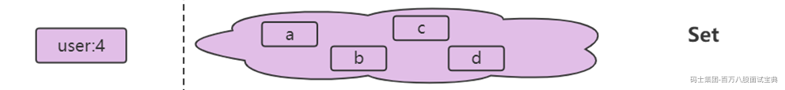

### 常用命令

```plain
sadd 添加元素（允许添加多个，返回结果为添加成功的元素个数）
srem 删除元素（允许删除多个，返回结果为成功删除元素个数）
scard 计算元素个数
sismember 判断元素是否在集合中（如果给定元素element在集合内返回1，反之返回0）
srandmember 随机从集合返回指定个数元素（指定个数如果不写默认为1）
spop 从集合随机弹出元素（如果不写默认为1，注意，既然是弹出，spop命令执行后,元素会从集合中删除）
smembers 获取所有元素(不会弹出元素)
--集合间操作命令
sinter 求多个集合的交集
suinon 求多个集合的并集
sdiff 求多个集合的差集
--将交集、并集、差集的结果保存（结果保存在destination key中）
sinterstore destination key [key ...]
suionstore destination key [key ...]
sdiffstore destination key [key ...]
```

### 性能分析

## 有序集合（ZSET）

有序集合（ZSET/Sorted Set）

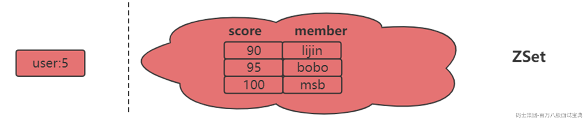

有序集合相对于哈希、列表、集合来说会有一点点陌生,但既然叫有序集合,那么它和集合必然有着联系,它保留了集合不能有重复成员的特性,但不同的是,有序集合中的元素可以排序。但是它和列表使用索引下标作为排序依据不同的是,它给每个元素设置一个分数( score)作为排序的依据。

有序集合中的元素不能重复，但是score可以重复，就和一个班里的同学学号不能重复,但是考试成绩可以相同。

有序集合提供了获取指定分数和元素范围查询、计算成员排名等功能，合理的利用有序集合，能帮助我们在实际开发中解决很多问题。

为什么要做ZSET呢？因为命令都是Z开头（Set命令已经使用S作为前缀了, 所以Sorted Set不再使用S）

### 常用命令

```plain
zadd 添加成员（返回结果代表成功添加成员的个数）
    zadd命令还有四个选项nx、xx、ch、incr 四个选项
    nx: member必须不存在，才可以设置成功，用于添加。
    xx: member必须存在，才可以设置成功,用于更新。
    ch: 返回此次操作后,有序集合元素和分数发生变化的个数
    incr: 对score做增加，相当于后面介绍的zincrby

zcard 计算成员个数
zscore 计算某个成员的分数
zrank	计算成员的排名（从分数从低到高返回排名）
zrevrank 计算成员的排名（从分数从高到低返回排名）
zrem 删除成员（允许一次删除多个成员，返回结果为成功删除的个数）
zrange  返回指定排名范围的成员（从低到高返回）、withscores选项，同时会返回成员的分数
zrevrange  返回指定排名范围的成员（从高到低返回）、withscores选项，同时会返回成员的分数
zrangebyscore 返回指定分数范围的成员（同时min和max还支持开区间(小括号）和闭区间(中括号)，-inf和+inf分别代表无限小和无限大、withscores选项，同时会返回成员的分数）
zcount 返回指定分数范围成员个数
zremrangebyrank 按升序删除指定排名内的元素
zremrangebyscore 删除指定分数范围的成员
--集合间操作命令
zinterstore 交集
zunionstore 并集
```

## 五大数据类型底层实现

底层数据结构一共有 7 种，分别是简单动态字符串、双向链表、压缩列表、哈希表、跳表和整数数组、快速列表。它们和数据类型的对应关系如下图所示

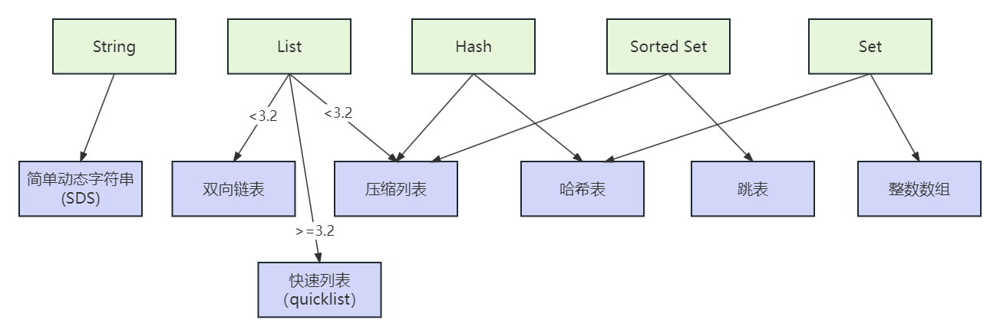

### 简单动态字符串（Simple Dynamic String）

Redis 的String类型使用 SDS（简单动态字符串）（Simple Dynamic String）作为底层的数据结构实现。

SDS 与 C 字符串有所不同，它不仅可以保存文本数据，还可以保存二进制数据。这是因为 SDS 使用 len 属性的值而不是空字符来判断字符串是否结束，并且 SDS 的所有 API 都会以处理二进制的方式来处理 SDS 存放在 buf[] 数组里的数据。因此，SDS 不仅能存放文本数据，还能保存图片、音频、视频、压缩文件等二进制数据。

另外，Redis 的 SDS API 是安全的，拼接字符串不会造成缓冲区溢出。这是因为 SDS 在拼接字符串之前会检查 SDS 空间是否满足要求，如果空间不够会自动扩容，从而避免了缓冲区溢出的问题。

此外，获取字符串长度的时间复杂度是 O(1)，因为 SDS 结构里用 len 属性记录了字符串长度，所以获取长度的复杂度为 O(1)。相比之下，C 语言的字符串并不记录自身长度，所以获取长度的复杂度为 O(n)。这些特性使得 SDS 成为 Redis 的一个重要组成部分。

**源码分析：**

不同的版本的实现是有一些区别的。

**老版本（3.2之前）**

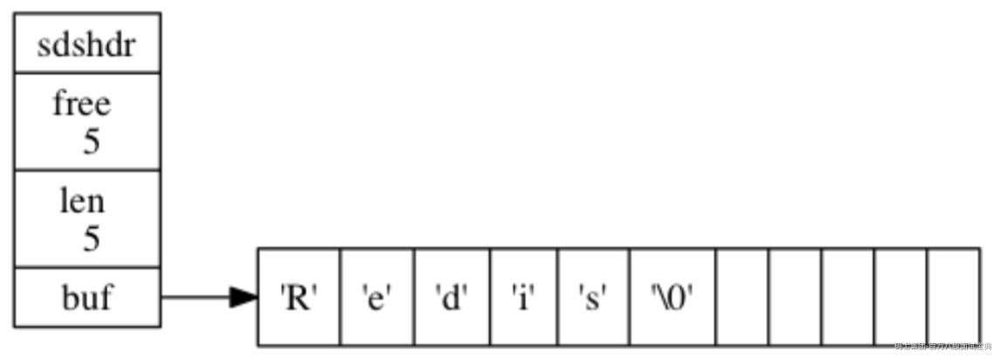

```plain
/*
 * 保存字符串对象的结构---这里不是真实的C的源码，我写的一个简化
 */
struct sdshdr {
    // buf 中已占用空间的长度
    int len;
    // buf 中剩余可用空间的长度
    int free;
    // 数据空间
    char buf[];
};

```

**新版本（3.2之后）**

在Redis的6及6以后，会根据字符串长度不同，定义了5种的SDS结构体sdshdr5、sdshdr8、sdshdr16、sdshdr32、sdshdr64，长度分别对应，2的n次幂（2的5次幂、2的8次幂.......），用于用于存储不同长度的字符串。

1. sdshdr5：适用于长度小于32\*\*<2的5次方>\*\*的字符串。

2. sdshdr8：适用于长度小于256\*\*<2的8次方>\*\*的字符串。

3. sdshdr16：适用于长度小于65535\*\*<2的16次方>\*\*的字符串。

4. sdshdr32：适用于长度小于4294967295\*\*<2的32次方>\*\*的字符串。

5. sdshdr64：适用于长度大于4294967295的字符串。

通过使用不同的sdshdr结构，Redis可以根据字符串的长度选择最合适的结构，从而提高内存利用率。例如，当我们存储一个长度为3字节的字符串时，Redis会选择使用sdshdr5结构，而不会浪费额外的内存空间。

sdshdr5结构如下：

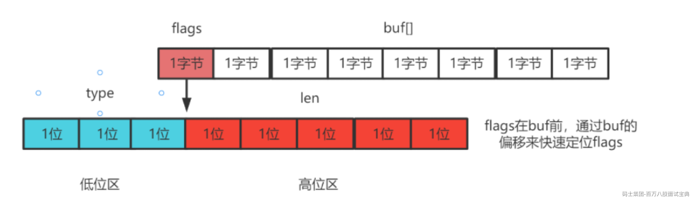

sdshdr5的结构中flags是一个char，其中低3位要标识type类型（就是存储的格式），所有就只有5位来存储len这个长度，所以就叫做sdshdr5

```plain
struct sdshdr5 {
    char flags; 
    // 数据空间
    char buf[];
};

```

而如果是更长的长度，Redis就需要采用sdshdr8或者sdshdr16或者更大的存储结构。

Redis的sdshdr5相对于sdshdr8少两个字段，是为了节省内存空间和提高处理短字符串的效率。根据字符串的长度范围选择适合的sdshdr结构，可以优化内存利用和性能。

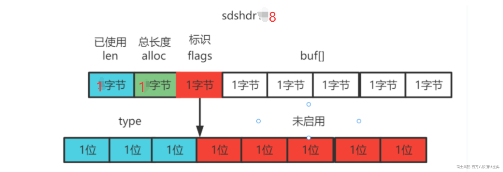

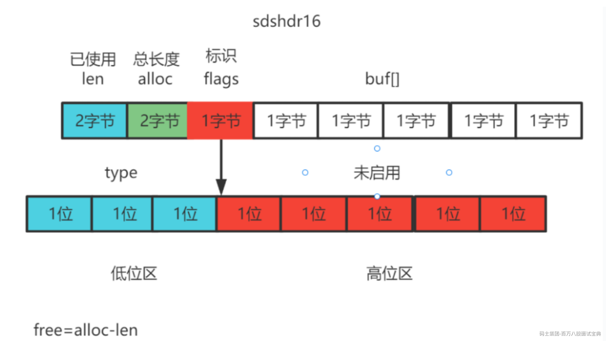

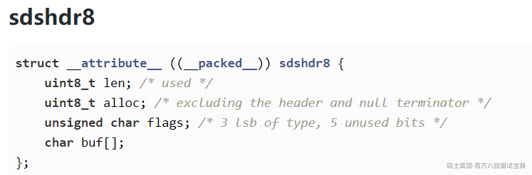

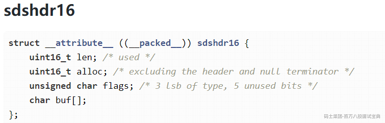

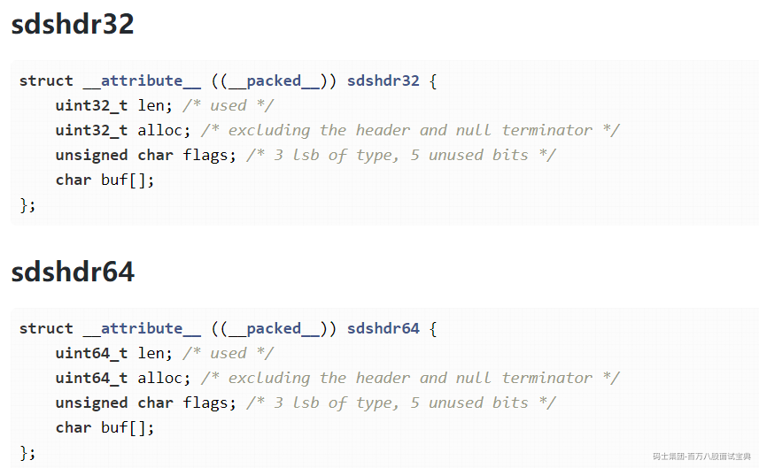

从String的设计上来看，Redis已经把空间利用做到了极致，同时的也可以从sdshdr5到sdshdr8...看出设计原则：开闭原则，对修改关闭，对拓展开放。

### List


### 压缩列表

压缩列表实际上类似于一个数组，数组中的每一个元素都对应保存一个数据。和数组不同的是，压缩列表在表头有三个字段 zlbytes、zltail 和 zllen，分别表示列表长度、列表尾的偏移量和列表中的 entry 个数；压缩列表在表尾还有一个 zlend，表示列表结束。

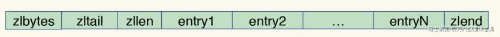

在压缩列表中，如果我们要查找定位第一个元素和最后一个元素，可以通过表头三个字段的长度直接定位，复杂度是 O(1)。而查找其他元素时，就没有这么高效了，只能逐个查找，此时的复杂度就是 O(N) 了。

- zlbytes，记录整个压缩列表占用对内存字节数

- zltail，记录压缩列表「尾部」节点距离起始地址由多少字节，也就是列表尾的偏移量

- zllen，记录压缩列表包含的节点数量；

- zlend，标记压缩列表的结束点，固定值 0xFF（十进制255）

压缩列表节点包含三部分内容：

- prevlen，记录了「前一个节点」的长度

- encoding，记录了当前节点实际数据的类型以及长度

- data，记录了当前节点的实际数据

在压缩列表中，如果我们要查找定位第一个元素和最后一个元素，可以通过表头三个字段的长度直接定位，复杂度是 O(1)。而查找其他元素时，就没有这么高效了，只能逐个查找，此时的复杂度就是 O(N) 了。因此压缩列表不适合保存过多的元素

### 跳表

跳表在链表的基础上，增加了多级索引，通过索引位置的几个跳转，实现数据的快速定位。

（链表只能逐一查找元素，导致操作起来非常缓慢，于是就出现了跳表）

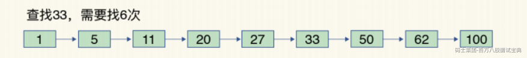

如果我们要在链表中查找 33 这个元素，只能从头开始遍历链表，查找 6 次，直到找到 33为止。此时，复杂度是 O(N)，查找效率很低

1、为了提高查找速度，我们来增加一级索引：从第一个元素开始，每两个元素选一个出来作为索引。这些索引再通过指针指向原始的链表。

例如，从前两个元素中抽取元素 1 作为一级索引，从第三、四个元素中抽取元素 11 作为一级索引。此时，我们只需要 4 次查找就能定位到元素 33 了

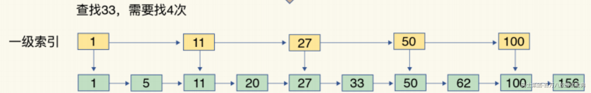

2、我们还想再快，可以再增加二级索引：从一级索引中，再抽取部分元素作为二级索引。例如，从一级索引中抽取 1、27、100 作为二级索引，二级索引指向一级索引。这样，我们只需要 3 次查找，就能定位到元素 33 了。

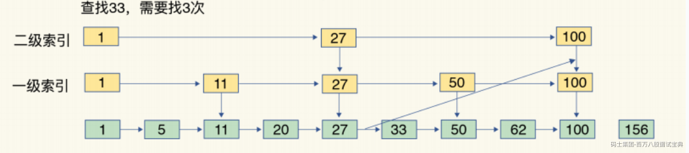

这种本质就是空间换时间的算法。

### 使用选择

#### List

**在 Redis 3.2 版本之前**

Redis 的 List 类型底层数据结构可以由双向链表或压缩列表实现。如果列表元素个数小于 512 个且每个元素的值都小于 64 字节，则 Redis 会使用压缩列表作为底层数据结构；否则，Redis 会使用双向链表作为底层数据结构。

**在 Redis 3.2 版本之后**

List 类型底层数据结构只由 quicklist 实现，代替了双向链表和压缩列表。

String 类型的底层实现只有一种数据结构，也就是简单动态字符串。而 List、Hash、Set 和 Sorted Set 这四种集合类型，都有两种底层实现结构。

#### Hash

当一个Hash类型的键值对数量比较少时，Redis会使用压缩列表（ziplist）来表示Hash。当Hash类型的键值对数量较多时，会使用哈希表（hashtable）来表示Hash。哈希表在元素数量较多时具有更好的性能。

#### Sorted Set

当Sorted Set类型的成员数量较少（元素数量小于配置的压缩列表最大元素数量限制，默认为128）且成员的值较短时，Redis会使用压缩列表（ziplist）来表示Sorted Set。

当Sorted Set类型的成员数量较多或成员的值较长时，会使用跳表（skiplist）来表示Sorted Set。跳表在有序集合类型中提供了高效的范围查询操作。

#### Set

当Set类型的元素数量较少（元素数量小于配置的哈希最大压缩列表元素数量限制，默认为512）时，Redis会使用压缩列表（ziplist）来表示Set。当Set类型的元素数量较多时，会使用哈希表（hashtable）来表示Set。
