# Redis-Redis分布式解决方案

本课主要以《从0到1手敲代码实现商城项目》的Redis运用为基础

代码地址：

<https://git.mashibing.com/msb-mca/msb_mall_project/src/branch/master/02-%E4%BB%A3%E7%A0%81%E8%B5%84%E6%96%99>

## Redis的客户端

Redis 官方推荐的Java 客户端 Jedis、lettuce 和 Redisson

### Jedis

老牌的Redis 的Java客户端，提供了比较全面的Redis命令的支持

**优点：**

API比较全面（参考：<https://tool.oschina.net/uploads/apidocs/redis/clients/jedis/Jedis.html>）

**缺点：**

使用阻塞的 I/O（方法调用都是同步的，程序流需要等到 sockets 处理完 I/O 才能执行，不支持异步）

Jedis 客户端实例不是线程安全的（多线程使用一个Jedis连接），所以需要通过连接池来使用Jedis（每个线程使用独自的Jedis连接）

### lettuce

lettuce是基于netty实现的与redis进行同步和异步的通信。

在spring boot2之后，redis连接默认就采用了lettuce（spring-boot-starter-data-redis）

官网：<https://lettuce.io/>

github：<https://github.com/lettuce-io/lettuce-core>

SpringData：<https://spring.io/projects/spring-data-redis>

**优点：**

线程安全的 Redis 客户端，支持异步模式

lettuce 底层基于 Netty，支持高级的 Redis 特性，比如哨兵，集群，管道，自动重新连接和Redis数据模型。

**缺点：**

没人知道... API比较复杂

### Redisson

Redisson 提供了使用Redis 的最简单和最便捷的方法，还提供了许多分布式服务（分布式锁，分布式集合，延迟队列等）

**优点：**

Redisson基于Netty框架的事件驱动的通信层，其方法调用是异步的

Redisson的API是线程安全的，所以可以操作单个Redisson连接来完成各种操作

**缺点：**

Redisson 对字符串的操作支持比较差

## 项目整合spring-boot-starter-data-redis

  要整合Redis那么我们在SpringBoot项目中首页来添加对应的依赖

```xml
<dependency>
            <groupId>org.springframework.boot</groupId>

            <artifactId>spring-boot-starter-data-redis</artifactId>

        </dependency>

```

  然后我们需要添加对应的配置信息

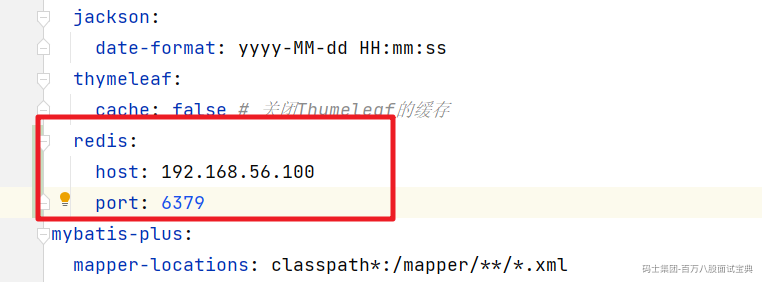

测试操作Redis的数据

```java
    @Autowired
    StringRedisTemplate stringRedisTemplate;

    @Test
    public void testStringRedisTemplate(){
        // 获取操作String类型的Options对象
        ValueOperations<String, String> ops = stringRedisTemplate.opsForValue();
        // 插入数据
        ops.set("name","bobo"+ UUID.randomUUID());
        // 获取存储的信息
        System.out.println("刚刚保存的值："+ops.get("name"));
    }
```

查看可以通过Redis的客户端连接查看

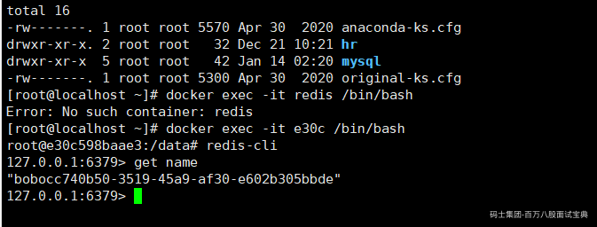

也可以通过工具查看

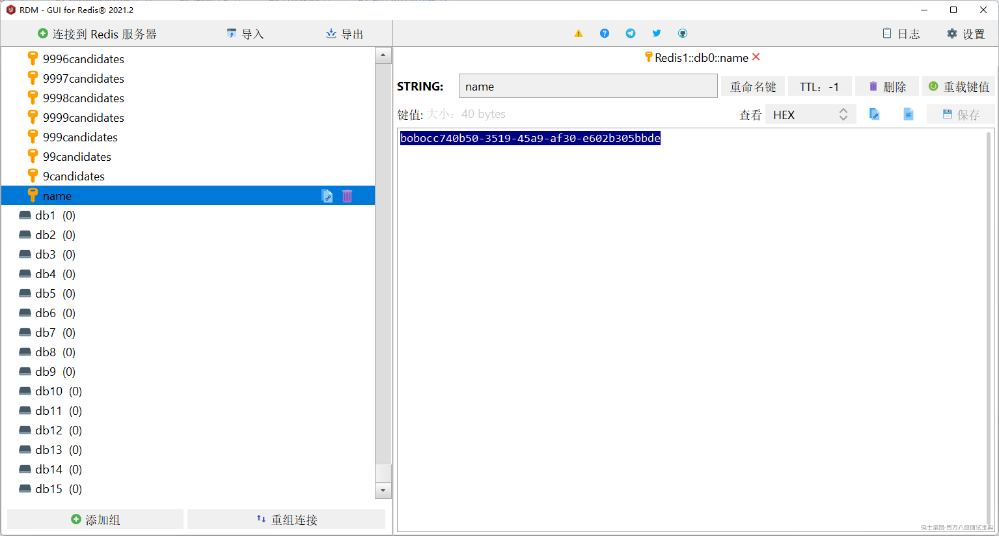

## 项目整合Redisson

添加对应的依赖

```xml
        <dependency>
            <groupId>org.redisson</groupId>

            <artifactId>redisson</artifactId>

            <version>3.16.1</version>

        </dependency>

```

添加对应的配置类

```java
@Configuration
public class MyRedisConfig {

    @Bean
    public RedissonClient redissonClient(){
        Config config = new Config();
        // 配置连接的信息
        config.useSingleServer()
                .setAddress("redis://192.168.56.100:6379");
        RedissonClient redissonClient = Redisson.create(config);
        return  redissonClient;
    }
}
```

## 缓存三级分类

  在首页查询二级和三级分类数据的时候我们可以通过Redis来缓存存储对应的数据，来提升检索的效率。

这里使用String类型存储，存储的是JSON的格式。

```java
 public Map<String, List<Catalog2VO>> getCatelog2JSONForDb() {
        String keys = "catalogJSON";
        synchronized (this){
            // 从Redis中获取分类的信息
            String catalogJSON = stringRedisTemplate.opsForValue().get(keys);
            if(!StringUtils.isEmpty(catalogJSON)){
                // 说明缓存命中
                // 表示缓存命中了数据，那么从缓存中获取信息，然后返回
                Map<String, List<Catalog2VO>> stringListMap = JSON.parseObject(catalogJSON, new TypeReference<Map<String, List<Catalog2VO>>>() {
                });
                return stringListMap;
            }
            System.out.println("-----------》查询数据库操作");

            // 获取所有的分类数据
            List<CategoryEntity> list = baseMapper.selectList(new QueryWrapper<CategoryEntity>());
            // 获取所有的一级分类的数据
            List<CategoryEntity> leve1Category = this.queryByParenCid(list,0l);
            // 把一级分类的数据转换为Map容器 key就是一级分类的编号， value就是一级分类对应的二级分类的数据
            Map<String, List<Catalog2VO>> map = leve1Category.stream().collect(Collectors.toMap(
                    key -> key.getCatId().toString()
                    , value -> {
                        // 根据一级分类的编号，查询出对应的二级分类的数据
                        List<CategoryEntity> l2Catalogs = this.queryByParenCid(list,value.getCatId());
                        List<Catalog2VO> Catalog2VOs =null;
                        if(l2Catalogs != null){
                            Catalog2VOs = l2Catalogs.stream().map(l2 -> {
                                // 需要把查询出来的二级分类的数据填充到对应的Catelog2VO中
                                Catalog2VO catalog2VO = new Catalog2VO(l2.getParentCid().toString(), null, l2.getCatId().toString(), l2.getName());
                                // 根据二级分类的数据找到对应的三级分类的信息
                                List<CategoryEntity> l3Catelogs = this.queryByParenCid(list,l2.getCatId());
                                if(l3Catelogs != null){
                                    // 获取到的二级分类对应的三级分类的数据
                                    List<Catalog2VO.Catalog3VO> catalog3VOS = l3Catelogs.stream().map(l3 -> {
                                        Catalog2VO.Catalog3VO catalog3VO = new Catalog2VO.Catalog3VO(l3.getParentCid().toString(), l3.getCatId().toString(), l3.getName());
                                        return catalog3VO;
                                    }).collect(Collectors.toList());
                                    // 三级分类关联二级分类
                                    catalog2VO.setCatalog3List(catalog3VOS);
                                }
                                return catalog2VO;
                            }).collect(Collectors.toList());
                        }

                        return Catalog2VOs;
                    }
            ));
            // 从数据库中获取到了对应的信息 然后在缓存中也存储一份信息
            //cache.put("getCatelog2JSON",map);
            // 表示缓存命中了数据，那么从缓存中获取信息，然后返回
            if(map == null){
                // 那就说明数据库中也不存在  防止缓存穿透（回种空值）
                stringRedisTemplate.opsForValue().set(keys,"",5, TimeUnit.SECONDS);
            }else{
                // 从数据库中查询到的数据，我们需要给缓存中也存储一份
                // 防止缓存雪崩
                String json = JSON.toJSONString(map);
                stringRedisTemplate.opsForValue().set("catalogJSON",json,100,TimeUnit.MINUTES);
            }
            return map;
        } }
```

  然后对三级分类的数据做压力测试

|  |  |  |  |  |
| --- | --- | --- | --- | --- |
| 压力测试内容 | 压力测试的线程数 | 吞吐量/s | 90%响应时间 | 99%响应时间 |
| Nginx | 50 | 7,385 | 10 | 70 |
| Gateway | 50 | 23,170 | 3 | 14 |
| 单独测试服务 | 50 | 23,160 | 3 | 7 |
| Gateway+服务 | 50 | 8,461 | 12 | 46 |
| Nginx+Gateway | 50 |  |  |  |
| Nginx+Gateway+服务 | 50 | 2,816 | 27 | 42 |
| 一级菜单 | 50 | 1,321 | 48 | 74 |
| 三级分类压测 | 50 | 12 | 4000 | 4000 |
| 三级分类压测(业务优化后) | 50 | 448 | 113 | 227 |
| 三级分类压测(Redis缓存) | 50 | 1163 | 49 | 59 |

  通过对比可以看到Redis缓存加入后的性能提升的效果还是非常明显的。

### 缓存穿透问题

  指查询一个一定不存在的数据，由于缓存是不命中，将去查询数据库，但是数据库也无此记录，我们没有将这次查询的null写入缓存，这将导致这个不存在的数据每次请求都要到存储层去查询，失去了缓存的意义.

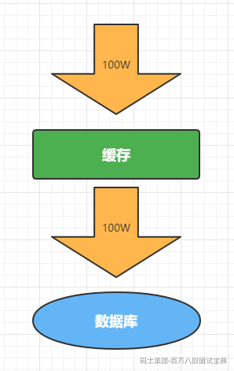

利用不存在的数据进行攻击，数据库瞬时压力增大，最终导致崩溃,解决方案也比较简单，直接把null结果缓存，并加入短暂的过期时间

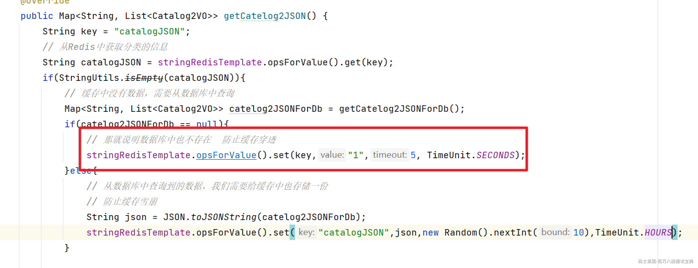

### 缓存雪崩问题

  缓存雪崩是指在我们设置缓存时key采用了相同的过期时间，导致缓存在某一时刻同时失效，请求全部转发到DB，DB瞬时压力过重雪崩。

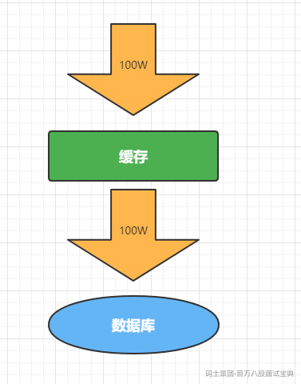

解决方案：原有的失效时间基础上增加一个随机值，比如1-5分钟随机，这样每一个缓存的过期时间的重复率就会降低，就很难引发集体失效的事件。

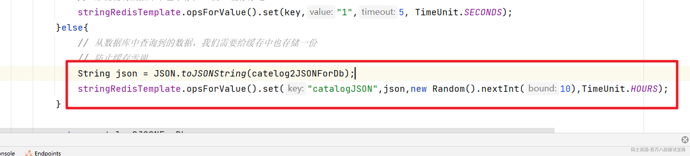

### 缓存击穿问题

  对于一些设置了过期时间的key，如果这些key可能会在某些时间点被超高并发地访问，是一种非常“热点”的数据。如果这个key在大量请求同时进来前正好失效，那么所有对这个key的数据查询都落到db，我们称为缓存击穿。

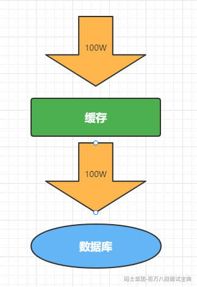

解决方案：加锁，大量并发只让一个去查，其他人等待，查到以后释放锁，其他人获取到锁，先查缓存，就会有数据，不用去db。

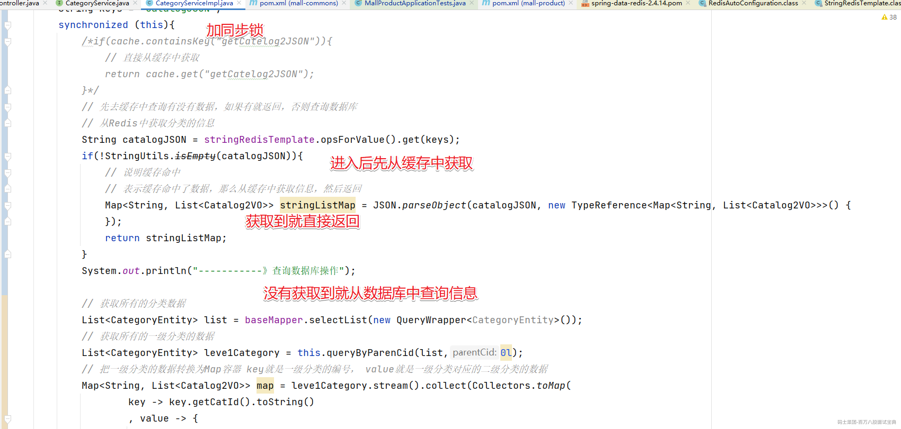

但是当我们压力测试的时候，输出的结果有点出乎我们的意料

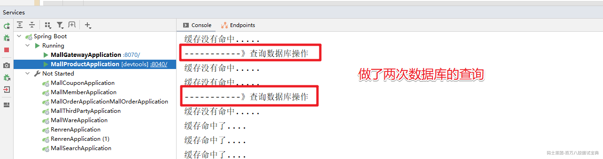

做了两次的查询，原因是释放锁和查询结果缓存的时序问题

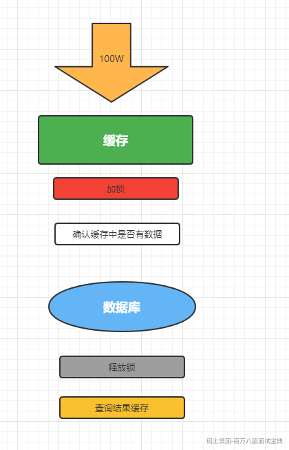

我们只需要调整下释放锁和结果缓存的时序问题就可以了

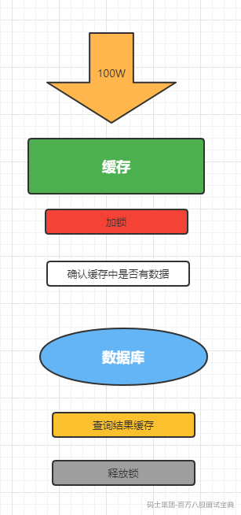

然后就是完整的代码处理

```java
/**
     * 查询出所有的二级和三级分类的数据
     * 并封装为Map<String, Catalog2VO>对象
     * @return
     */
    @Override
    public Map<String, List<Catalog2VO>> getCatelog2JSON() {
        String key = "catalogJSON";
        // 从Redis中获取分类的信息
        String catalogJSON = stringRedisTemplate.opsForValue().get(key);
        if(StringUtils.isEmpty(catalogJSON)){
            System.out.println("缓存没有命中.....");
            // 缓存中没有数据，需要从数据库中查询
            Map<String, List<Catalog2VO>> catelog2JSONForDb = getCatelog2JSONForDb();
            if(catelog2JSONForDb == null){
                // 那就说明数据库中也不存在  防止缓存穿透
                stringRedisTemplate.opsForValue().set(key,"1",5, TimeUnit.SECONDS);
            }else{
                // 从数据库中查询到的数据，我们需要给缓存中也存储一份
                // 防止缓存雪崩
                String json = JSON.toJSONString(catelog2JSONForDb);
                stringRedisTemplate.opsForValue().set("catalogJSON",json,10,TimeUnit.MINUTES);
            }

            return catelog2JSONForDb;
        }
        System.out.println("缓存命中了....");
        // 表示缓存命中了数据，那么从缓存中获取信息，然后返回
        Map<String, List<Catalog2VO>> stringListMap = JSON.parseObject(catalogJSON, new TypeReference<Map<String, List<Catalog2VO>>>() {
        });
        return stringListMap;
    }

    /**
     * 从数据库查询的结果
     * 查询出所有的二级和三级分类的数据
     * 并封装为Map<String, Catalog2VO>对象
     * 在SpringBoot中，默认的情况下是单例
     * @return
     */
    public Map<String, List<Catalog2VO>> getCatelog2JSONForDb() {
        String keys = "catalogJSON";
        synchronized (this){
            /*if(cache.containsKey("getCatelog2JSON")){
                // 直接从缓存中获取
                return cache.get("getCatelog2JSON");
            }*/
            // 先去缓存中查询有没有数据，如果有就返回，否则查询数据库
            // 从Redis中获取分类的信息
            String catalogJSON = stringRedisTemplate.opsForValue().get(keys);
            if(!StringUtils.isEmpty(catalogJSON)){
                // 说明缓存命中
                // 表示缓存命中了数据，那么从缓存中获取信息，然后返回
                Map<String, List<Catalog2VO>> stringListMap = JSON.parseObject(catalogJSON, new TypeReference<Map<String, List<Catalog2VO>>>() {
                });
                return stringListMap;
            }
            System.out.println("-----------》查询数据库操作");

            // 获取所有的分类数据
            List<CategoryEntity> list = baseMapper.selectList(new QueryWrapper<CategoryEntity>());
            // 获取所有的一级分类的数据
            List<CategoryEntity> leve1Category = this.queryByParenCid(list,0l);
            // 把一级分类的数据转换为Map容器 key就是一级分类的编号， value就是一级分类对应的二级分类的数据
            Map<String, List<Catalog2VO>> map = leve1Category.stream().collect(Collectors.toMap(
                    key -> key.getCatId().toString()
                    , value -> {
                        // 根据一级分类的编号，查询出对应的二级分类的数据
                        List<CategoryEntity> l2Catalogs = this.queryByParenCid(list,value.getCatId());
                        List<Catalog2VO> Catalog2VOs =null;
                        if(l2Catalogs != null){
                            Catalog2VOs = l2Catalogs.stream().map(l2 -> {
                                // 需要把查询出来的二级分类的数据填充到对应的Catelog2VO中
                                Catalog2VO catalog2VO = new Catalog2VO(l2.getParentCid().toString(), null, l2.getCatId().toString(), l2.getName());
                                // 根据二级分类的数据找到对应的三级分类的信息
                                List<CategoryEntity> l3Catelogs = this.queryByParenCid(list,l2.getCatId());
                                if(l3Catelogs != null){
                                    // 获取到的二级分类对应的三级分类的数据
                                    List<Catalog2VO.Catalog3VO> catalog3VOS = l3Catelogs.stream().map(l3 -> {
                                        Catalog2VO.Catalog3VO catalog3VO = new Catalog2VO.Catalog3VO(l3.getParentCid().toString(), l3.getCatId().toString(), l3.getName());
                                        return catalog3VO;
                                    }).collect(Collectors.toList());
                                    // 三级分类关联二级分类
                                    catalog2VO.setCatalog3List(catalog3VOS);
                                }
                                return catalog2VO;
                            }).collect(Collectors.toList());
                        }

                        return Catalog2VOs;
                    }
            ));
            // 从数据库中获取到了对应的信息 然后在缓存中也存储一份信息
            //cache.put("getCatelog2JSON",map);
            // 表示缓存命中了数据，那么从缓存中获取信息，然后返回
            if(map == null){
                // 那就说明数据库中也不存在  防止缓存穿透
                stringRedisTemplate.opsForValue().set(keys,"1",5, TimeUnit.SECONDS);
            }else{
                // 从数据库中查询到的数据，我们需要给缓存中也存储一份
                // 防止缓存雪崩
                String json = JSON.toJSONString(map);
                stringRedisTemplate.opsForValue().set("catalogJSON",json,10,TimeUnit.MINUTES);
            }
            return map;
        } }
```

## 分布式锁问题

### 分布式锁的原理

  分布式锁或者本地锁的本质其实是一样的，都是将并行的操作转换为了串行的操作

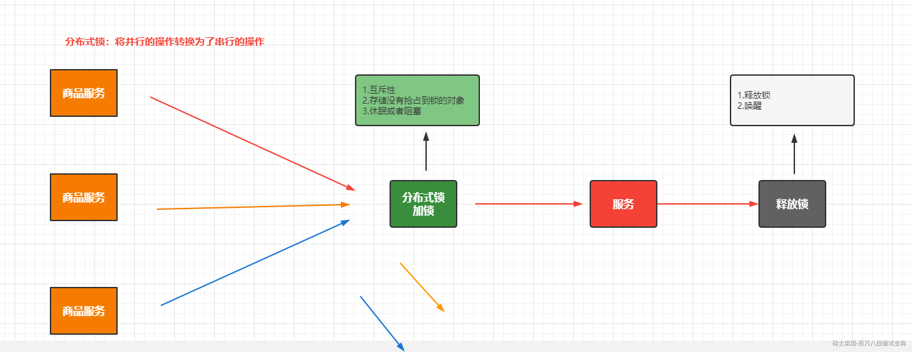

### Redis实现分布式锁

  在Redis中是通过setNX指令来实现锁的抢占，那么利用这个命令实现分布式锁的基础代码为：

```java
    public Map<String, List<Catalog2VO>> getCatelog2JSONDbWithRedisLock() {
        String keys = "catalogJSON";
        // 加锁
        Boolean lock = stringRedisTemplate.opsForValue().setIfAbsent("lock", "1111");
        if(lock){
            // 加锁成功
            Map<String, List<Catalog2VO>> data = getDataForDB(keys);
            // 从数据库中获取数据成功后，我们应该要释放锁
            stringRedisTemplate.delete("lock");
            return data;
        }else{
            // 加锁失败
            // 休眠+重试
            // Thread.sleep(1000);
            return getCatelog2JSONDbWithRedisLock();
        }
    }
```

  上面的代码其实是存在一些问题的，首先如果getDataForDB(keys)这个方法如果出现的异常，那么我们就不会删除该key也就是不会释放锁，从而造成了死锁，针对这个问题，我们可以通过设置过期时间来解决，具体代码如下：

```java
    public Map<String, List<Catalog2VO>> getCatelog2JSONDbWithRedisLock() {
        String keys = "catalogJSON";
        // 加锁
        Boolean lock = stringRedisTemplate.opsForValue().setIfAbsent("lock", "1111");
        if(lock){
            // 给对应的key设置过期时间
            stringRedisTemplate.expire("lock",20,TimeUnit.SECONDS);
            // 加锁成功
            Map<String, List<Catalog2VO>> data = getDataForDB(keys);
            // 从数据库中获取数据成功后，我们应该要释放锁
            stringRedisTemplate.delete("lock");
            return data;
        }else{
            // 加锁失败
            // 休眠+重试
            // Thread.sleep(1000);
            return getCatelog2JSONDbWithRedisLock();
        }
    }
```

  上面虽然解决了getDataForDB方法出现异常的问题，但是如果在expire方法执行之前就中断呢？这样也会出现我们介绍的死锁的问题，那这个问题怎么办？这时我们就希望setNx和设置过期时间的操作能够保证原子性。

这时我们就可以在setIfAbsent方法中同时指定过期时间，保证这个原子性的行为

```java
    public Map<String, List<Catalog2VO>> getCatelog2JSONDbWithRedisLock() {
        String keys = "catalogJSON";
        // 加锁 在执行插入操作的同时设置了过期时间
        Boolean lock = stringRedisTemplate.opsForValue().setIfAbsent("lock", "1111",30,TimeUnit.SECONDS);
        if(lock){
            // 给对应的key设置过期时间
            stringRedisTemplate.expire("lock",20,TimeUnit.SECONDS);
            // 加锁成功
            Map<String, List<Catalog2VO>> data = getDataForDB(keys);
            // 从数据库中获取数据成功后，我们应该要释放锁
            stringRedisTemplate.delete("lock");
            return data;
        }else{
            // 加锁失败
            // 休眠+重试
            // Thread.sleep(1000);
            return getCatelog2JSONDbWithRedisLock();
        }
    }
```

  如果获取锁的业务执行时间比较长，超过了我们设置的过期时间，那么就有可能业务还没执行完，锁就释放了，然后另一个请求进来了，并创建了key，这时原来的业务处理完成后，再去删除key的时候，那么就有可能删除别人的key，这时怎么办?针对这种情况我们可以查询的锁的信息通过UUID来区分，具体的代码如下：

```java
public Map<String, List<Catalog2VO>> getCatelog2JSONDbWithRedisLock() {
        String keys = "catalogJSON";
        // 加锁 在执行插入操作的同时设置了过期时间
        String uuid = UUID.randomUUID().toString();
        Boolean lock = stringRedisTemplate.opsForValue().setIfAbsent("lock", uuid,30,TimeUnit.SECONDS);
        if(lock){
            // 给对应的key设置过期时间
            stringRedisTemplate.expire("lock",20,TimeUnit.SECONDS);
            // 加锁成功
            Map<String, List<Catalog2VO>> data = getDataForDB(keys);
            // 获取当前key对应的值
            String val = stringRedisTemplate.opsForValue().get("lock");
            if(uuid.equals(val)){
                // 说明这把锁是自己的
                // 从数据库中获取数据成功后，我们应该要释放锁
                stringRedisTemplate.delete("lock");
            }
            return data;
        }else{
            // 加锁失败
            // 休眠+重试
            // Thread.sleep(1000);
            return getCatelog2JSONDbWithRedisLock();
        }
    }
```

  上面查询key的值和删除key其实不是一个原子性操作，这就会出现我查询出来key之后，时间过期了，然后key被删除了，然后其他的请求创建了一个新的key，然后原来的执行删除了这个key，又出现了删除别人key的情况。这时我们需要保证查询和删除是一个原子性行为。

```java
public Map<String, List<Catalog2VO>> getCatelog2JSONDbWithRedisLock() {
        String keys = "catalogJSON";
        // 加锁 在执行插入操作的同时设置了过期时间
        String uuid = UUID.randomUUID().toString();
        Boolean lock = stringRedisTemplate.opsForValue().setIfAbsent("lock", uuid,300,TimeUnit.SECONDS);
        if(lock){
            Map<String, List<Catalog2VO>> data = null;
            try {
                // 加锁成功
                data = getDataForDB(keys);
            }finally {
                String srcipts = "if redis.call('get',KEYS[1]) == ARGV[1]  then return redis.call('del',KEYS[1]) else  return 0 end ";
                // 通过Redis的lua脚本实现 查询和删除操作的原子性
                stringRedisTemplate.execute(new DefaultRedisScript<Integer>(srcipts,Integer.class)
                        ,Arrays.asList("lock"),uuid);
            }
            return data;
        }else{
            // 加锁失败
            // 休眠+重试
            // Thread.sleep(1000);
            return getCatelog2JSONDbWithRedisLock();
        }
    }
```

<https://space.bilibili.com/435498550> 分布式锁的实现

#### Redisson的分布式锁

添加对应的依赖

```xml
        <dependency>
            <groupId>org.redisson</groupId>

            <artifactId>redisson</artifactId>

            <version>3.16.1</version>

        </dependency>

```

添加对应的配置类

```java
@Configuration
public class MyRedisConfig {

    @Bean
    public RedissonClient redissonClient(){
        Config config = new Config();
        // 配置连接的信息
        config.useSingleServer()
                .setAddress("redis://192.168.56.100:6379");
        RedissonClient redissonClient = Redisson.create(config);
        return  redissonClient;
    }
}
```

#### 可重入锁

```java
/**
     * 1.锁会自动续期，如果业务时间超长，运行期间Redisson会自动给锁重新添加30s，不用担心业务时间，锁自动过去而造成的数据安全问题
     * 2.加锁的业务只要执行完成， 那么就不会给当前的锁续期，即使我们不去主动的释放锁，锁在默认30s之后也会自动的删除
     * @return
     */
    @ResponseBody
    @GetMapping("/hello")
    public String hello(){
        RLock myLock = redissonClient.getLock("myLock");
        // 加锁
        myLock.lock();
        try {
            System.out.println("加锁成功...业务处理....." + Thread.currentThread().getName());
            Thread.sleep(30000);
        }catch (Exception e){

        }finally {
            System.out.println("释放锁成功..." +  Thread.currentThread().getName());
            // 释放锁
            myLock.unlock();
        }
        return "hello";
    }
```

#### 读写锁

  根据业务操作我们可以分为读写操作，读操作其实不会影响数据，那么如果还对读操作做串行处理，效率会很低，这时我们可以通过读写锁来解决这个问题

```java
@GetMapping("/writer")
    @ResponseBody
    public String writerValue(){
        RReadWriteLock readWriteLock = redissonClient.getReadWriteLock("rw-lock");
        // 加写锁
        RLock rLock = readWriteLock.writeLock();
        String s = null;
        rLock.lock(); // 加写锁
        try {
            s = UUID.randomUUID().toString();
            stringRedisTemplate.opsForValue().set("msg",s);
            Thread.sleep(30000);
        } catch (InterruptedException e) {
            e.printStackTrace();
        } finally {
            rLock.unlock();
        }
        return s;
    }

    @GetMapping("/reader")
    @ResponseBody
    public String readValue(){
        RReadWriteLock readWriteLock = redissonClient.getReadWriteLock("rw-lock");
        // 加读锁
        RLock rLock = readWriteLock.readLock();
        rLock.lock();
        String s = null;
        try {
            s = stringRedisTemplate.opsForValue().get("msg");
        }finally {
            rLock.unlock();
        }

        return s;
    }
```

在读写锁中，只有读读的行为是共享锁，相互之间不影响，只要有写的行为存在，那么就是一个互斥锁(排他锁)

#### 信号量(Semaphore)

基于Redis的Redisson的分布式信号量（[Semaphore](http://static.javadoc.io/org.redisson/redisson/3.10.0/org/redisson/api/RSemaphore.html)）Java对象

`RSemaphore`采用了与 `java.util.concurrent.Semaphore`相似的接口和用法。同时还提供了[异步（Async）](http://static.javadoc.io/org.redisson/redisson/3.10.0/org/redisson/api/RSemaphoreAsync.html)、[反射式（Reactive）](http://static.javadoc.io/org.redisson/redisson/3.10.0/org/redisson/api/RSemaphoreReactive.html)和[RxJava2标准](http://static.javadoc.io/org.redisson/redisson/3.10.0/org/redisson/api/RSemaphoreRx.html)的接口。

```java
@GetMapping("/park")
    @ResponseBody
    public String park(){
        RSemaphore park = redissonClient.getSemaphore("park");
        boolean b = true;
        try {
            // park.acquire(); // 获取信号 阻塞到获取成功
            b = park.tryAcquire();// 返回获取成功还是失败
        } catch (Exception e) {
            e.printStackTrace();
        }
        return "停车是否成功:" + b;
    }

    @GetMapping("/release")
    @ResponseBody
    public String release(){
        RSemaphore park = redissonClient.getSemaphore("park");
        park.release();
        return "释放了一个车位";
    }
```

## 秒杀服务--Redis解决方案

### 秒杀活动流程

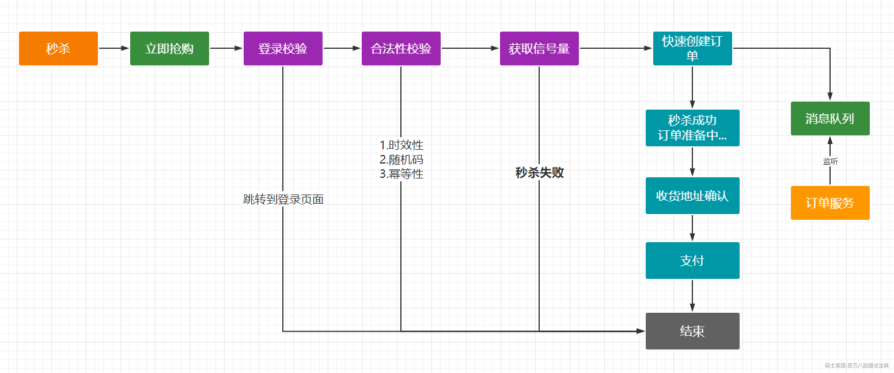

秒杀活动中Redis需要处理的内容

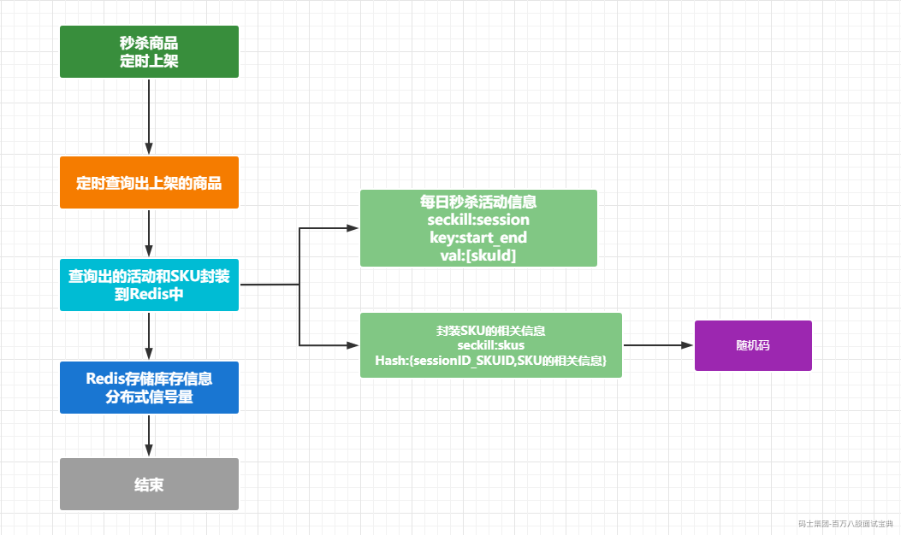

通过定时任务触发：

```java
/**
 * 定时上架秒杀商品信息
 */
@Slf4j
@Component
public class SeckillSkuSchedule {

    @Autowired
    SeckillService seckillService;

    @Autowired
    RedissonClient redissonClient;

    /**
     *
     */
    @Async
    @Scheduled(cron = "*/5 * * * * *")
    public void uploadSeckillSku3Days(){
        log.info("定时上架秒杀商品执行了...." + new Date());
        // 分布式锁
        RLock lock = redissonClient.getLock("seckill:upload:lock");
        lock.lock(10, TimeUnit.SECONDS);
        try {
            // 调用上架商品的方法
            seckillService.uploadSeckillSku3Days();
        }catch (Exception e){
            lock.unlock();
        }
    }

}
```

进入到Service中处理

```java
@Override
    public void uploadSeckillSku3Days() {
        // 1. 通过OpenFegin 远程调用Coupon服务中接口来获取未来三天的秒杀活动的商品
        R r = couponFeignService.getLates3DaysSession();
        if(r.getCode() == 0){
            // 表示查询操作成功
            String json = (String) r.get("data");
            List<SeckillSessionEntity> seckillSessionEntities = JSON.parseArray(json,SeckillSessionEntity.class);
            // 2. 上架商品  Redis数据保存
            // 缓存商品
            //  2.1 缓存每日秒杀的SKU基本信息
            saveSessionInfos(seckillSessionEntities);
            // 2.2  缓存每日秒杀的商品信息
            saveSessionSkuInfos(seckillSessionEntities);

        }
    }

/**
     * 保存每日活动的信息到Redis中
     * @param seckillSessionEntities
     */
    private void saveSessionInfos(List<SeckillSessionEntity> seckillSessionEntities) {
        for (SeckillSessionEntity seckillSessionEntity : seckillSessionEntities) {
            // 循环缓存每一个活动  key： start_endTime
            long start = seckillSessionEntity.getStartTime().getTime();
            long end = seckillSessionEntity.getEndTime().getTime();
            // 生成Key
            String key = SeckillConstant.SESSION_CHACE_PREFIX+start+"_"+end;
            Boolean flag = redisTemplate.hasKey(key);
            if(!flag){// 表示这个秒杀活动在Redis中不存在，也就是还没有上架，那么需要保存
                // 需要存储到Redis中的这个秒杀活动涉及到的相关的商品信息的SKUID
                List<String> collect = seckillSessionEntity.getRelationEntities().stream().map(item -> {
                    // 秒杀活动存储的 VALUE是 sessionId_SkuId
                    return item.getPromotionSessionId()+"_"+item.getSkuId().toString();
                }).collect(Collectors.toList());
                redisTemplate.opsForList().leftPushAll(key,collect);
            }
        }
    }

    /**
     * 存储活动对应的 SKU信息
     * @param seckillSessionEntities
     */
    private void saveSessionSkuInfos(List<SeckillSessionEntity> seckillSessionEntities) {
        seckillSessionEntities.stream().forEach(session -> {
            // 循环取出每个Session，然后取出对应SkuID 封装相关的信息
            BoundHashOperations<String, Object, Object> hashOps = redisTemplate.boundHashOps(SeckillConstant.SKU_CHACE_PREFIX);
            session.getRelationEntities().stream().forEach(item->{
                String skuKey = item.getPromotionSessionId()+"_"+item.getSkuId();
                Boolean flag = redisTemplate.hasKey(skuKey);
                if(!flag){
                    SeckillSkuRedisDto dto = new SeckillSkuRedisDto();
                    // 1.获取SKU的基本信息
                    R info = productFeignService.info(item.getSkuId());
                    if(info.getCode() == 0){
                        // 表示查询成功
                        String json = (String) info.get("skuInfoJSON");
                        dto.setSkuInfoVo(JSON.parseObject(json,SkuInfoVo.class));
                    }
                    // 2.获取SKU的秒杀信息
                    /*dto.setSkuId(item.getSkuId());
                    dto.setSeckillPrice(item.getSeckillPrice());
                    dto.setSeckillCount(item.getSeckillCount());
                    dto.setSeckillLimit(item.getSeckillLimit());
                    dto.setSeckillSort(item.getSeckillSort());*/
                    BeanUtils.copyProperties(item,dto);
                    // 3.设置当前商品的秒杀时间
                    dto.setStartTime(session.getStartTime().getTime());
                    dto.setEndTime(session.getEndTime().getTime());

                    // 4. 随机码
                    String token = UUID.randomUUID().toString().replace("-","");
                    dto.setRandCode(token);
                    // 分布式信号量的处理  限流的目的
                    RSemaphore semaphore = redissonClient.getSemaphore(SeckillConstant.SKU_STOCK_SEMAPHORE + token);
                    // 把秒杀活动的商品数量作为分布式信号量的信号量
                    semaphore.trySetPermits(item.getSeckillCount().intValue());
                    hashOps.put(skuKey,JSON.toJSONString(dto));
                }
            });
        });
    }
```

启动服务，数据会被保存到Redis中

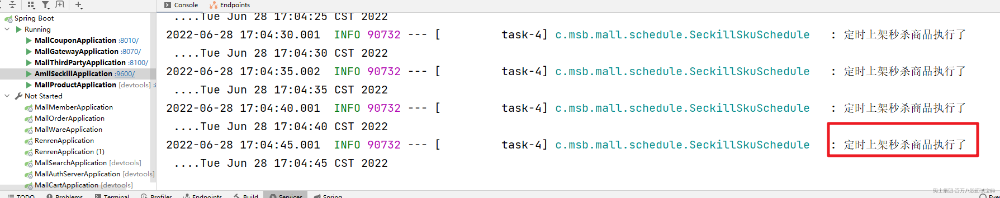

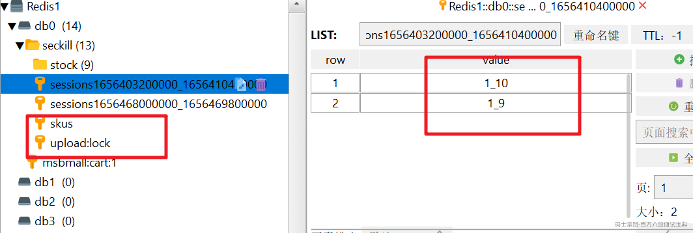

### 秒杀商品查询

  通过当前时间获取对应的秒杀活动及对应的SKU信息。

```java
   /**
     * 查询出当前时间内的秒杀活动及对应的商品SKU信息
     * @return
     */
    @Override
    public List<SeckillSkuRedisDto> getCurrentSeckillSkus() {
        // 1.确定当前时间是属于哪个秒杀活动的
        long time = new Date().getTime();
        // 从Redis中查询所有的秒杀活动
        Set<String> keys = redisTemplate.keys(SeckillConstant.SESSION_CHACE_PREFIX + "*");
        for (String key : keys) {
            //seckill:sessions1656468000000_1656469800000
            String replace = key.replace(SeckillConstant.SESSION_CHACE_PREFIX, "");
            // 1656468000000_1656469800000
            String[] s = replace.split("_");
            Long start = Long.parseLong(s[0]); // 活动开始的时间
            Long end = Long.parseLong(s[1]); // 活动结束的时间
            if(time > start && time < end){
                // 说明的秒杀活动就是当前时间需要参与的活动
                // 取出来的是SKU的ID  2_9
                List<String> range = redisTemplate.opsForList().range(key, -100, 100);
                BoundHashOperations<String, String, String> ops = redisTemplate.boundHashOps(SeckillConstant.SKU_CHACE_PREFIX);
                List<String> list = ops.multiGet(range);
                if(list != null && list.size() > 0){
                    List<SeckillSkuRedisDto> collect = list.stream().map(item -> {
                        SeckillSkuRedisDto seckillSkuRedisDto = JSON.parseObject(item, SeckillSkuRedisDto.class);
                        return seckillSkuRedisDto;
                    }).collect(Collectors.toList());
                    return collect;
                }
            }
        }
        return null;
    }
```

然后定义相关的Controller接口就可以访问了

```java
@RestController
@RequestMapping("/seckill")
public class SeckillController {

    @Autowired
    SeckillService seckillService;

    @GetMapping("/currentSeckillSessionSkus")
    public R getCurrentSeckillSessionSkus(){
        List<SeckillSkuRedisDto> currentSeckillSkus = seckillService.getCurrentSeckillSkus();

        return R.ok().put("data", JSON.toJSONString(currentSeckillSkus));
    }
}

```

展示的效果


### 秒杀活动

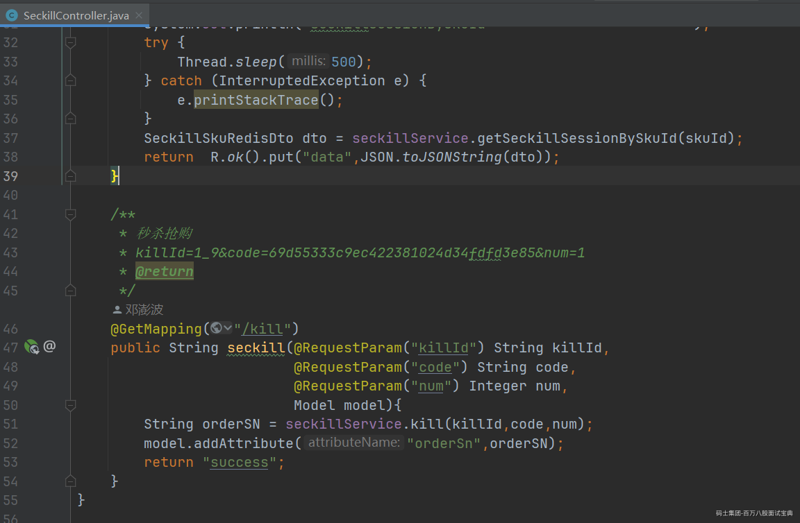

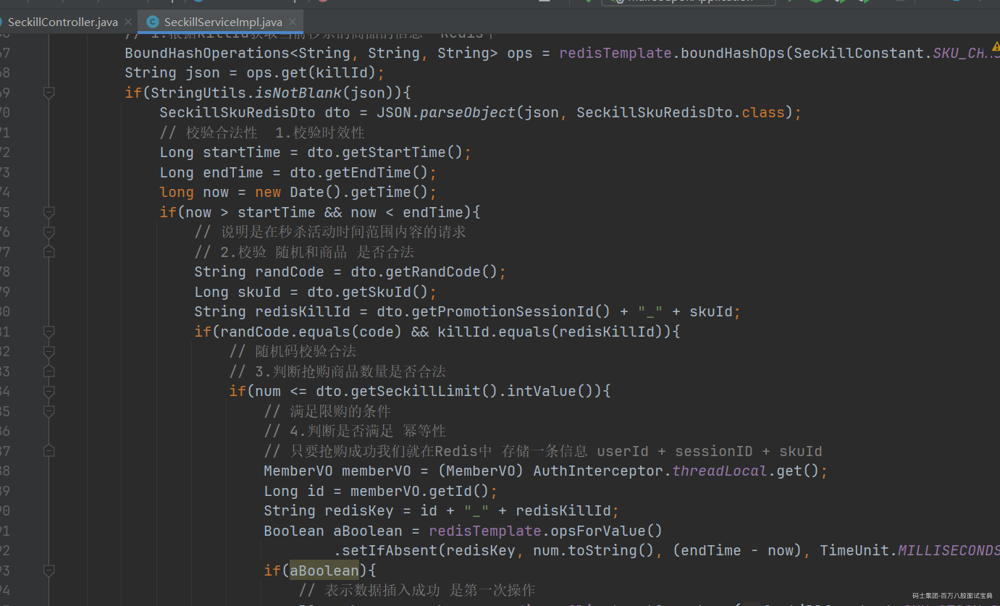

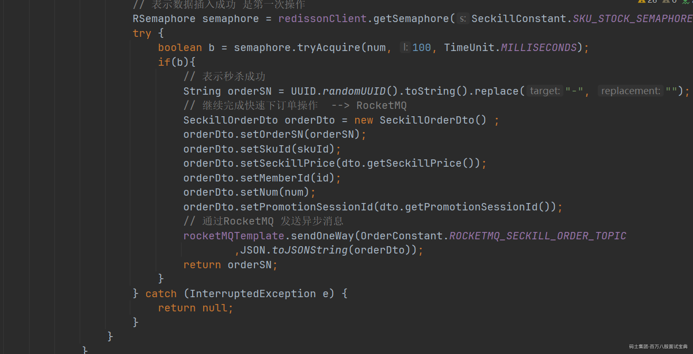

### 秒杀活动关注点

  秒杀活动的最大特点就是高并发而且是短时间内的高并发，那么对我们的服务要求就非常高，针对这种情况所产生的共性问题，对应的解决方案：

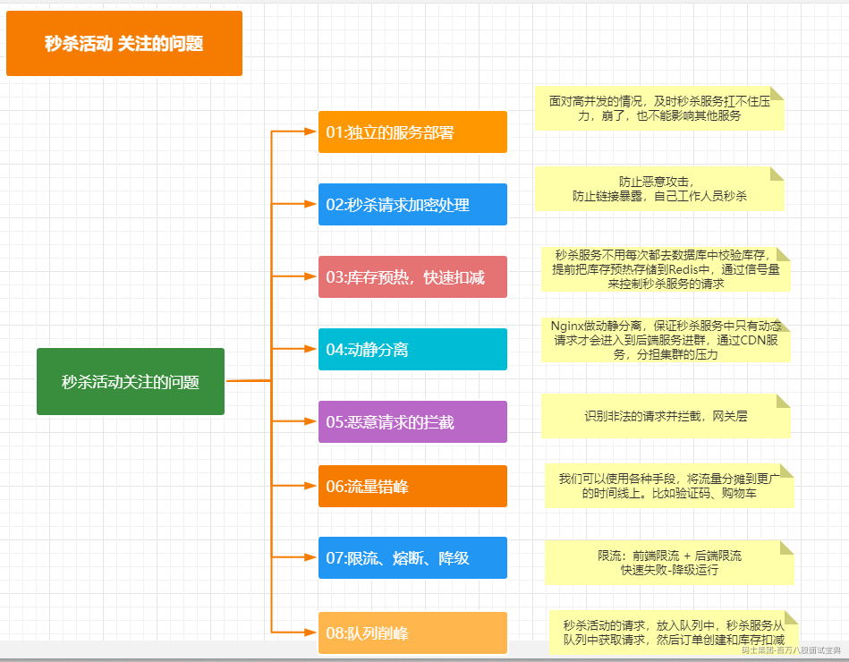

#### **信号量处理**

  通过信号量来控制秒杀的商品数量。降低了对库存商品操作，提升了处理能力。

Semaphore（信号量）是用来控制同时访问特定资源的线程数量，它通过协调各个线程，以保证合理的使用公共资源。

应用场景Semaphore可以用于做流量控制，特别是公用资源有限的应用场景，比如数据库连接。假如有一个需求，要读取几万个文件的数据，因为都是IO密集型任务，我们可以启动几十个线程并发地读取，但是如果读到内存后，还需要存储到数据库中，而数据库的连接数只有10个，这时我们必须控制只有10个线程同时获取数据库连接保存数据，否则会报错无法获取数据库连接。这个时候，就可以使用Semaphore来做流量控制。。Semaphore的构造方法Semaphore（int permits）接受一个整型的数字，表示可用的许可证数量。Semaphore的用法也很简单，首先线程使用Semaphore的acquire()方法获取一个许可证，使用完之后调用release()方法归还许可证。还可以用tryAcquire()方法尝试获取许可证。

```java
if(aBoolean){
                            // 表示数据插入成功 是第一次操作
                            RSemaphore semaphore = redissonClient.getSemaphore(SeckillConstant.SKU_STOCK_SEMAPHORE+randCode);
                            try {
                                boolean b = semaphore.tryAcquire(num, 100, TimeUnit.MILLISECONDS);
                                if(b){
                                    // 表示秒杀成功
                                    String orderSN = UUID.randomUUID().toString().replace("-", "");
                                    // 继续完成快速下订单操作  --> RocketMQ
                                    SeckillOrderDto orderDto = new SeckillOrderDto() ;
                                    orderDto.setOrderSN(orderSN);
                                    orderDto.setSkuId(skuId);
                                    orderDto.setSeckillPrice(dto.getSeckillPrice());
                                    orderDto.setMemberId(id);
                                    orderDto.setNum(num);
                                    orderDto.setPromotionSessionId(dto.getPromotionSessionId());
                                    // 通过RocketMQ 发送异步消息
                                    rocketMQTemplate.sendOneWay(OrderConstant.ROCKETMQ_SECKILL_ORDER_TOPIC
                                            ,JSON.toJSONString(orderDto));
                                    return orderSN;
                                }
                            } catch (InterruptedException e) {
                                return null;
                            }
                        }
```

#### **MQ异步下单**

  秒杀成功后给RocketMQ发送消息，订单服务订阅消息，实现异步下单，从而降低了对秒杀系统的影响。

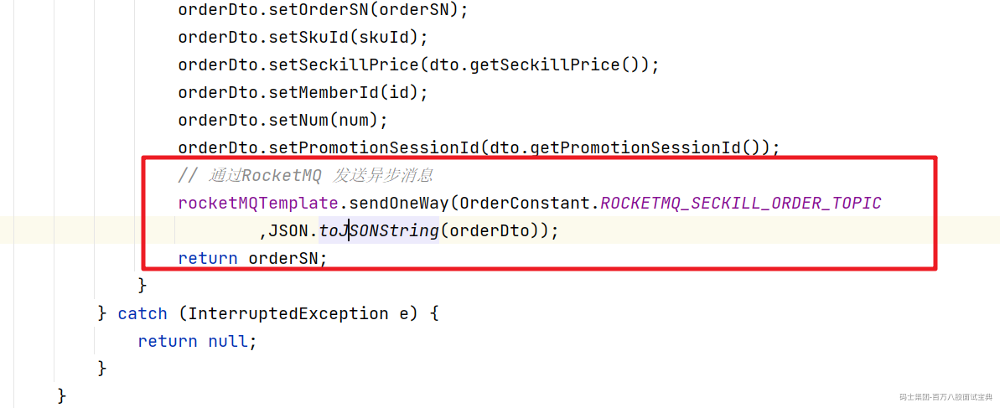

然后在订单服务中订阅对应的信息

```java
@RocketMQMessageListener(topic = OrderConstant.ROCKETMQ_SECKILL_ORDER_TOPIC,consumerGroup = "test")
@Component
public class SeckillOrderConsumer implements RocketMQListener<String> {
    @Autowired
    OrderService orderService;
    @Override
    public void onMessage(String s) {
        // 订单关单的逻辑实现
        SeckillOrderDto orderDto = JSON.parseObject(s,SeckillOrderDto.class);
        orderService.quickCreateOrder(orderDto);
    }
}
```

秒杀成功跳转到成功页面：

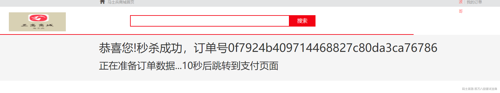

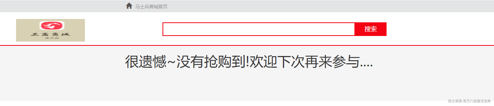

## Redlock真的安全吗？

Redis 作者提出的 Redlock方案，是如何解决主从切换后，锁失效问题的。

**Redlock 的方案基于一个前提：**

不再需要部署从库和哨兵实例，只部署主库；但主库要部署多个，官方推荐至少 5 个实例。

**注意：不是部署 Redis Cluster，就是部署 5 个简单的 Redis 实例。它们之间没有任何关系，都是一个个孤立的实例。**

做完之后，我们看官网代码怎么去用的：

[8. 分布式锁和同步器 · redisson/redisson Wiki · GitHub](https://github.com/redisson/redisson/wiki/8.-%E5%88%86%E5%B8%83%E5%BC%8F%E9%94%81%E5%92%8C%E5%90%8C%E6%AD%A5%E5%99%A8#84-%E7%BA%A2%E9%94%81redlock)

**8.4. 红锁（RedLock）**

基于Redis的Redisson红锁 `RedissonRedLock`对象实现了[Redlock](http://redis.cn/topics/distlock.html)介绍的加锁算法。该对象也可以用来将多个 `RLock`对象关联为一个红锁，每个 `RLock`对象实例可以来自于不同的Redisson实例。

```java
RLock lock1 = redissonInstance1.getLock("lock1");
RLock lock2 = redissonInstance2.getLock("lock2");
RLock lock3 = redissonInstance3.getLock("lock3");

RedissonRedLock lock = new RedissonRedLock(lock1, lock2, lock3);
// 同时加锁：lock1 lock2 lock3
// 红锁在大部分节点上加锁成功就算成功。
lock.lock();
...
lock.unlock();
```

大家都知道，如果负责储存某些分布式锁的某些Redis节点宕机以后，而且这些锁正好处于锁住的状态时，这些锁会出现锁死的状态。为了避免这种情况的发生，Redisson内部提供了一个监控锁的看门狗，它的作用是在Redisson实例被关闭前，不断的延长锁的有效期。默认情况下，看门狗的检查锁的超时时间是30秒钟，也可以通过修改[Config.lockWatchdogTimeout](https://github.com/redisson/redisson/wiki/2.-%E9%85%8D%E7%BD%AE%E6%96%B9%E6%B3%95#lockwatchdogtimeout%E7%9B%91%E6%8E%A7%E9%94%81%E7%9A%84%E7%9C%8B%E9%97%A8%E7%8B%97%E8%B6%85%E6%97%B6%E5%8D%95%E4%BD%8D%E6%AF%AB%E7%A7%92)来另行指定。

另外Redisson还通过加锁的方法提供了 `leaseTime`的参数来指定加锁的时间。超过这个时间后锁便自动解开了。

```java
RedissonRedLock lock = new RedissonRedLock(lock1, lock2, lock3);
// 给lock1，lock2，lock3加锁，如果没有手动解开的话，10秒钟后将会自动解开
lock.lock(10, TimeUnit.SECONDS);

// 为加锁等待100秒时间，并在加锁成功10秒钟后自动解开
boolean res = lock.tryLock(100, 10, TimeUnit.SECONDS);
...
lock.unlock();
```

### Redlock实现整体流程

1、客户端先获取「当前时间戳T1」

2、客户端依次向这 5 个 Redis 实例发起加锁请求

3、如果客户端从 >=3 个（大多数）以上Redis 实例加锁成功，则再次获取「当前时间戳T2」，如果 T2 - T1 &#x3c; 锁的过期时间，此时，认为客户端加锁成功，否则认为加锁失败。

4、加锁成功，去操作共享资源

5、加锁失败/释放锁，向「全部节点」发起释放锁请求。

所以总的来说：客户端在多个 Redis 实例上申请加锁；必须保证大多数节点加锁成功；大多数节点加锁的总耗时，要小于锁设置的过期时间；释放锁，要向全部节点发起释放锁请求。

**我们来看 Redlock 为什么要这么做？**

1. **为什么要在多个实例上加锁？**

本质上是为了「容错」，部分实例异常宕机，剩余的实例加锁成功，整个锁服务依旧可用。

2. **为什么大多数加锁成功，才算成功？**

多个 Redis 实例一起来用，其实就组成了一个「分布式系统」。在分布式系统中，总会出现「异常节点」，所以，在谈论分布式系统问题时，需要考虑异常节点达到多少个，也依旧不会影响整个系统的「正确性」。

这是一个分布式系统「容错」问题，这个问题的结论是：如果只存在「故障」节点，只要大多数节点正常，那么整个系统依旧是可以提供正确服务的。

3. **为什么步骤 3 加锁成功后，还要计算加锁的累计耗时？**

因为操作的是多个节点，所以耗时肯定会比操作单个实例耗时更久，而且，因为是网络请求，网络情况是复杂的，有可能存在延迟、丢包、超时等情况发生，网络请求越多，异常发生的概率就越大。

所以，即使大多数节点加锁成功，但如果加锁的累计耗时已经「超过」了锁的过期时间，那此时有些实例上的锁可能已经失效了，这个锁就没有意义了。

4. **为什么释放锁，要操作所有节点？**

在某一个 Redis 节点加锁时，可能因为「网络原因」导致加锁失败。

例如，客户端在一个 Redis 实例上加锁成功，但在读取响应结果时，网络问题导致读取失败，那这把锁其实已经在 Redis 上加锁成功了。

所以，释放锁时，不管之前有没有加锁成功，需要释放「所有节点」的锁，以保证清理节点上「残留」的锁。

好了，明白了 Redlock 的流程和相关问题，看似Redlock 确实解决了 Redis 节点异常宕机锁失效的问题，保证了锁的「安全性」。

但事实真的如此吗？

### RedLock的是是非非

一个分布式系统，更像一个复杂的「野兽」，存在着你想不到的各种异常情况。

这些异常场景主要包括三大块，这也是分布式系统会遇到的三座大山：NPC。

N：Network Delay，网络延迟

P：Process Pause，进程暂停（GC）

C：Clock Drift，时钟漂移

比如一个进程暂停（GC）的例子


1）客户端 1 请求锁定节点 A、B、C、D、E

2）客户端 1 的拿到锁后，进入 GC（时间比较久）

3）所有 Redis 节点上的锁都过期了

4）客户端 2 获取到了 A、B、C、D、E 上的锁

5）客户端 1 GC 结束，认为成功获取锁

6）客户端 2 也认为获取到了锁，发生「冲突」

GC 和网络延迟问题：这两点可以在红锁实现流程的第3步来解决这个问题。

但是最核心的还是时钟漂移，因为时钟漂移，就有可能导致第3步的判断本身就是一个BUG，所以当多个 Redis 节点「时钟」发生问题时，也会导致 Redlock 锁失效。

## RedLock总结

Redlock 只有建立在「时钟正确」的前提下，才能正常工作，如果你可以保证这个前提，那么可以拿来使用。

但是时钟偏移在现实中是存在的：

第一，从硬件角度来说，时钟发生偏移是时有发生，无法避免。例如，CPU 温度、机器负载、芯片材料都是有可能导致时钟发生偏移的。

第二，人为错误也是很难完全避免的。

所以，Redlock尽量不用它，而且它的性能不如单机版 Redis，部署成本也高，优先考虑使用主从+ 哨兵的模式

## Redis缓存使用问题

### 数据一致性

只要使用到缓存，无论是本地内存做缓存还是使用 redis 做缓存，那么就会存在数据同步的问题。

我以 Tomcat 向 MySQL 中写入和删改数据为例，来给你解释一下，数据的增删改操作具体是如何进行的。


我们分析一下几种解决方案，

1、先更新缓存，再更新数据库

2、先更新数据库，再更新缓存

3、先删除缓存，后更新数据库

4、先更新数据库，后删除缓存

#### 新增数据类

如果是新增数据，数据会直接写到数据库中，不用对缓存做任何操作，此时，缓存中本身就没有新增数据，而数据库中是最新值，此时，缓存和数据库的数据是一致的。

#### 更新缓存类

##### 1、先更新缓存，再更新DB

这个方案我们一般不考虑。原因是更新缓存成功，更新数据库出现异常了，导致缓存数据与数据库数据完全不一致，而且很难察觉，因为缓存中的数据一直都存在。


##### 2、先更新DB，再更新缓存

这个方案也我们一般不考虑，原因跟第一个一样，数据库更新成功了，缓存更新失败，同样会出现数据不一致问题。同时还有以下问题

*1* *）并发问题：*

*同时有请求A****和请求B****进行更新操作，那么会出现*

*（1* *）线程A*更新了数据库

*（2* *）线程B*更新了数据库

*（3* *）线程B*更新了缓存

*（4* *）线程A*更新了缓存

*这就出现请求A****更新缓存应该比请求B****更新缓存早才对，但是因为网络等原因，B****却比A****更早更新了缓存。这就导致了脏数据，因此不考虑。*

*2* *）业务场景问题*

*如果你是一个写数据库场景比较多，而读数据场景比较少的业务需求，采用这种方案就会导致，数据压根还没读到，缓存就被频繁的更新，浪费性能。*

**除了更新缓存之外，我们还有一种就是删除缓存。**

到底是选择更新缓存还是淘汰缓存呢？

主要取决于“更新缓存的复杂度”，更新缓存的代价很小，此时我们应该更倾向于更新缓存，以保证更高的缓存命中率，更新缓存的代价很大，此时我们应该更倾向于淘汰缓存。

#### 删除缓存类

##### 3、先删除缓存，后更新DB

该方案也会出问题，具体出现的原因如下。

1、此时来了两个请求，请求 A（更新操作） 和请求 B（查询操作）

2、请求 A 会先删除 Redis 中的数据，然后去数据库进行更新操作；

3、此时请求 B 看到 Redis 中的数据时空的，会去数据库中查询该值，补录到 Redis 中；

4、但是此时请求 A 并没有更新成功，或者事务还未提交，请求B去数据库查询得到旧值；

5、那么这时候就会产生数据库和 Redis 数据不一致的问题。

如何解决呢？其实最简单的解决办法就是延时双删的策略。就是

（1）先淘汰缓存

（2）再写数据库

（3）休眠1秒，再次淘汰缓存

**这段伪代码就是“延迟双删”**

```java
redis.delKey(X)
db.update(X)
Thread.sleep(N)
redis.delKey(X)
```

这么做，可以将1秒内所造成的缓存脏数据，再次删除。

那么，这个1秒怎么确定的，具体该休眠多久呢？

针对上面的情形，读该自行评估自己的项目的读数据业务逻辑的耗时。然后写数据的休眠时间则在读数据业务逻辑的耗时基础上，加几百ms即可。这么做的目的，就是确保读请求结束，写请求可以删除读请求造成的缓存脏数据。

但是上述的保证事务提交完以后再进行删除缓存还有一个问题，就是如果你使用的是\*\* Mysql \*\***的读写分离的架构**的话，那么其实主从同步之间也会有时间差。

此时来了两个请求，请求 A（更新操作） 和请求 B（查询操作）

请求 A 更新操作，删除了

请求主库进行更新操作，主库与从库进行同步数据的操作，

请 B 查询操作，发现 Redis

去从库中拿去数据，此时同步数据还未完成，拿到的数据是旧数据。

此时的解决办法有两个：

1、还是使用双删延时策略。只是，睡眠时间修改为在主从同步的延时时间基础上，加几百ms。

2、就是如果是对 Redis

继续深入，**采用这种同步淘汰策略，吞吐量降低怎么办？**

那就将第二次删除作为异步的。自己起一个线程，异步删除。这样，写的请求就不用沉睡一段时间后了，再返回。这么做，加大吞吐量。

继续深入，**第二次删除,如果删除失败怎么办？**

所以，我们引出了，下面的第四种策略，先更新数据库，再删缓存。

##### 4、先更新DB，后删除缓存

这种方式，被称为Cache Aside Pattern，读的时候，先读缓存，缓存没有的话，就读数据库，然后取出数据后放入缓存，同时返回响应。更新的时候，先更新数据库，然后再删除缓存。

### 如何选择问题

一般在线上，更多的偏向与使用删除缓存类操作，因为这种方式的话，会更容易避免一些问题。

因为删除缓存更新缓存的速度比在DB中要快一些，所以一般情况下我们可能会先用先更新DB，后删除缓存的操作。因为这种情况下缓存不一致性的情况只有可能是查询比删除慢的情况，而这种情况相对来说会少很多。同时结合延时双删的处理，可以有效的避免缓存不一致的情况。
