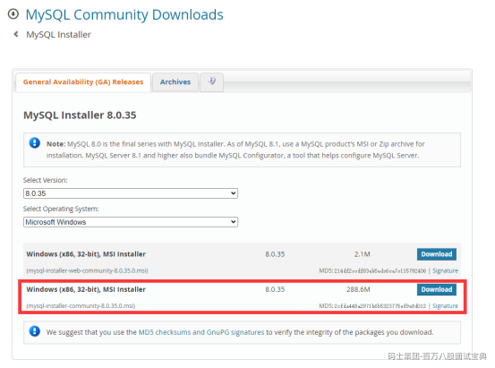
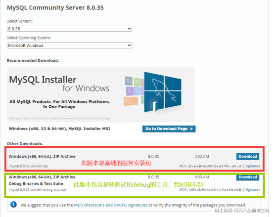
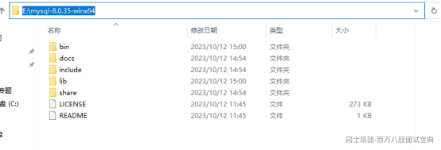
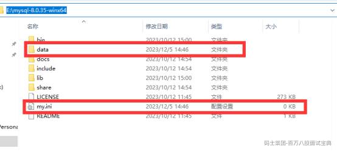
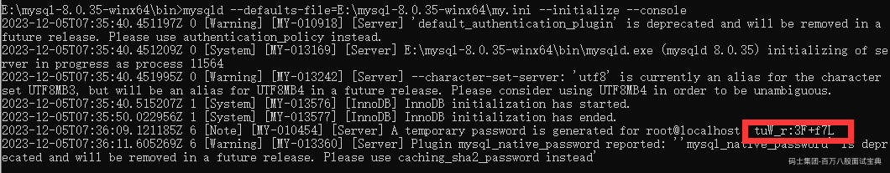
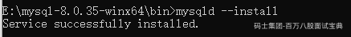
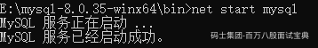

# mysql8安装

Mysql的安装可以直接从mysql的官网下载msi文件或者压缩包进行安装，如果选择msi的方式安装直接下一步安装就好，如果选择zip压缩包的方式需要执行一些特殊的命令进行初始化以及服务的启动。

因为我本人的PC上已经安装了mysql5.7的版本，因此选择zip的方式进行mysql8的安装，如果你的电脑上没有安装过任何mysql的版本，直接选择msi的文件双击运行即可，此处不再赘述。msi文件的下载地址：<https://dev.mysql.com/downloads/windows/installer/8.0.html>

下载图中红色框起来的安装包即可。如果不知道如何安装，参考如下帖子：<https://blog.csdn.net/weixin_52003205/article/details/132241675>

## ZIP的安装

1、首先找到mysql的官网，下载mysql8的压缩包，地址为：<https://dev.mysql.com/downloads/mysql/>，目前mysql8.2提供的版本为创新版，我们在使用的时候可以选择8.0.35的版本，此版本是稳定版，足以支撑我们的使用，如下图所示：

2、将下载好的安装包放到某一个磁盘目录中，可以自由选择，在我的个人PC上放在了E盘的根目录，如下图所示：

3、在当前目录创建data文件夹（用来保存mysql的数据文件）和my.ini文件（用来保存mysql的基础配置），如下图所示：

4、编辑my.ini文件

[mysqld]

# 设置 3307 端口 ，因为我的5.7版本的mysql占用了3306的端口，所以8版本设置为3307端口

port=3307

# 设置 mysql 的安装目录，跟你的安装目录保持一致即可

basedir=E:\\mysql-8.0.35-winx64

# 设置 mysql 数据库的数据的存放目录，跟你的安装目录保持一致即可

datadir=E:\\mysql-8.0.35-winx64\\data

# 允许最大连接数

max\_connections=200

# 允许连接失败的次数。这是为了防止有人从该主机试图攻击数据库系统

max\_connect\_errors=10

# 服务端使用的字符集默认为 UTF8

character-set-server=utf8

# 创建新表时将使用的默认存储引擎

default-storage-engine=INNODB

# 默认使用“mysql\_native\_password”插件认证

default\_authentication\_plugin=mysql\_native\_password

[mysql]

# 设置 mysql 客户端默认字符集

default-character-set=utf8

[client]

# 设置 mysql 客户端连接服务端时默认使用的端口

port=3307

default-character-set=utf8

5、打开命令行工具，此处一定要使用管理员方式打开，防止因为权限问题导致报错，然后切换到mysql的安装目录，初始化mysql的data目录，执行如下命令：

# 切换到执行命令的目录

cd bin

# 执行初始化语句,在输出的信息中会包含一个临时密码，在没有改正密码之前不要关闭cmd窗口，同时可以在data目录中可以看到生成一些数据文件

mysqld --defaules-file = E:\mysql-8.0.35-winx64\my.ini --initialize --console

6、安装mysql的服务，运行如下命令：

mysqld --install

出现下图所示内容表示安装成功

7、启动mysql，运行如下命令：

net start mysql

出现下图所示内容表示安装成功

8、登录mysql，运行如下命令：

mysql -uroot -p

此时需要填入密码，把刚刚上述日志中出现的临时密码复制进去，最好不要手敲，防止出错

9、因为刚刚在登录的时候使用的是临时密码，因此登录成功之后先修改密码，执行如下命令：

alter user user() identified by '123456';

到此步骤为止，mysql8就安装成功了，大家可以随意进行操作
