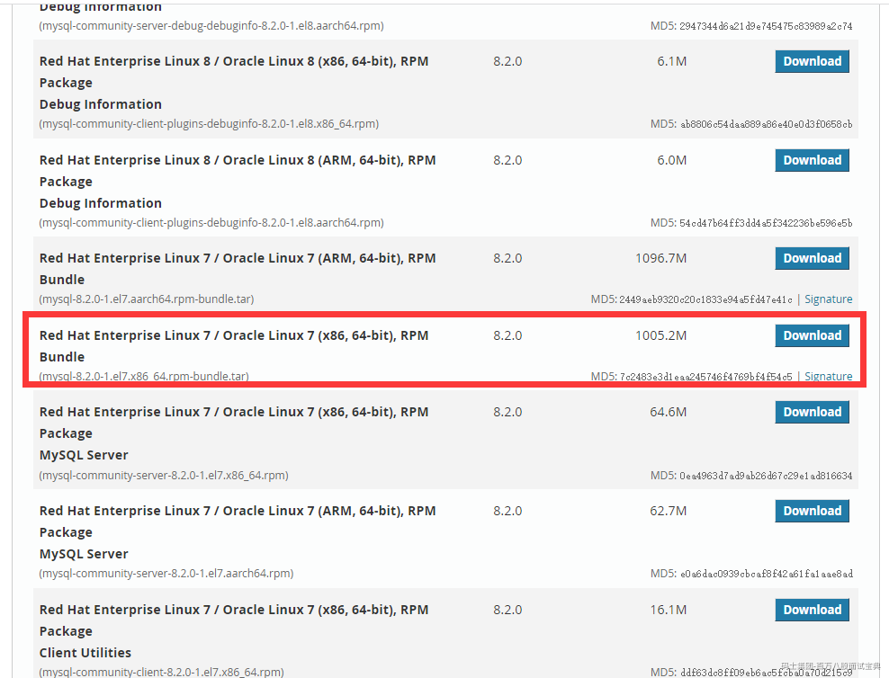
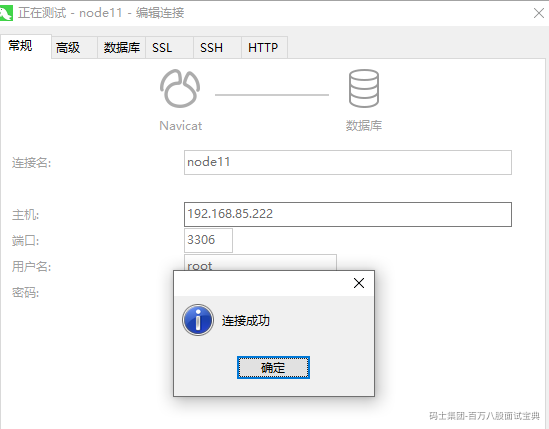

# CentOS7环境下安装mysql8

### 1、卸载mariadb

安装好centos系统之后，系统默认自带mariadb数据库，因为存在类库的冲突，因此要先卸载mariadb

#查找安装的mariadb软件版本信息

[root@node22 ~]# rpm -qa | grep mariadb

mariadb-libs-5.5.68-1.el7.x86\_64

#卸载安装的mariadb数据库

[root@node22 ~]# rpm -e mariadb-libs-5.5.68-1.el7.x86\_64

#运行过程中会进行报错，是依赖检测失败的问题，直接强制卸载即可

error: Failed dependencies:

libmysqlclient.so.18()(64bit) is needed by (installed) postfix-2:2.10.1-9.el7.x86\_64

libmysqlclient.so.18(libmysqlclient\_18)(64bit) is needed by (installed) postfix-2:2.10.1-9.el7.x86\_64

#强制卸载mariadb

[root@node22 ~]# rpm -e mariadb-libs-5.5.68-1.el7.x86\_64 --nodeps

#再次搜索是否还包含mariadb

[root@node22 ~]# rpm -qa | grep mariadb

### 2、下载mysql安装包

mysql的安装包需要去官网进行下载，下载地址：<https://dev.mysql.com/downloads/mysql/>

选择下图所示版本：

我的linux系统版本是centos7.9，如果是不同的linux系统，需要选择不同的安装包

### 3、安装mysql

1、将下载好的mysql的安装包放到centos的任意目录，我直接放在了root用户的家目录

2、创建文件夹并且解压mysql的安装包

#切换到对应的目录

[root@node22 ~]# cd /usr/local/

#创建mysql文件夹

[root@node22 local]# mkdir mysql

#切换到mysql文件夹

[root@node22 local]# cd mysql

#解压mysql压缩包到当前目录

[root@node22 mysql]# tar -xvf /root/mysql-8.2.0-1.el7.x86\_64.rpm-bundle.tar

mysql-community-client-8.2.0-1.el7.x86\_64.rpm

mysql-community-client-plugins-8.2.0-1.el7.x86\_64.rpm

mysql-community-common-8.2.0-1.el7.x86\_64.rpm

mysql-community-debuginfo-8.2.0-1.el7.x86\_64.rpm

mysql-community-devel-8.2.0-1.el7.x86\_64.rpm

mysql-community-embedded-compat-8.2.0-1.el7.x86\_64.rpm

mysql-community-icu-data-files-8.2.0-1.el7.x86\_64.rpm

mysql-community-libs-8.2.0-1.el7.x86\_64.rpm

mysql-community-libs-compat-8.2.0-1.el7.x86\_64.rpm

mysql-community-server-8.2.0-1.el7.x86\_64.rpm

mysql-community-server-debug-8.2.0-1.el7.x86\_64.rpm

mysql-community-test-8.2.0-1.el7.x86\_64.rpm

3、安装mysql的rpm文件，在安装rpm包的时候有依赖关系，一定要按照如下的顺序去安装mysql

#1、

[root@node22 mysql]# rpm -ivh mysql-community-common-8.2.0-1.el7.x86\_64.rpm

warning: mysql-community-common-8.2.0-1.el7.x86\_64.rpm: Header V4 RSA/SHA256 Signature, key ID 3a79bd29: NOKEY

Preparing... ################################# [100%]

Updating / installing...

1:mysql-community-common-8.2.0-1.el################################# [100%]

#2、

[root@node22 mysql]# rpm -ivh mysql-community-client-plugins-8.2.0-1.el7.x86\_64.rpm

warning: mysql-community-client-plugins-8.2.0-1.el7.x86\_64.rpm: Header V4 RSA/SHA256 Signature, key ID 3a79bd29: N

OKEYPreparing... ################################# [100%]

Updating / installing...

1:mysql-community-client-plugins-8.################################# [100%]

#3、

[root@node22 mysql]# rpm -ivh mysql-community-libs-8.2.0-1.el7.x86\_64.rpm

warning: mysql-community-libs-8.2.0-1.el7.x86\_64.rpm: Header V4 RSA/SHA256 Signature, key ID 3a79bd29: NOKEY

Preparing... ################################# [100%]

Updating / installing...

1:mysql-community-libs-8.2.0-1.el7 ################################# [100%]

#4、

[root@node22 mysql]# rpm -ivh mysql-community-client-8.2.0-1.el7.x86\_64.rpm

warning: mysql-community-client-8.2.0-1.el7.x86\_64.rpm: Header V4 RSA/SHA256 Signature, key ID 3a79bd29: NOKEY

Preparing... ################################# [100%]

Updating / installing...

1:mysql-community-client-8.2.0-1.el################################# [100%]

#5、

[root@node22 mysql]# rpm -ivh mysql-community-icu-data-files-8.2.0-1.el7.x86\_64.rpm

warning: mysql-community-icu-data-files-8.2.0-1.el7.x86\_64.rpm: Header V4 RSA/SHA256 Signature, key ID 3a79bd29: N

OKEYPreparing... ################################# [100%]

Updating / installing...

1:mysql-community-icu-data-files-8.################################# [100%]

#6、安装net-tools依赖

[root@node22 mysql]# yum install -y net-tools

#7、

[root@node22 mysql]# rpm -ivh mysql-community-server-8.2.0-1.el7.x86\_64.rpm

warning: mysql-community-server-8.2.0-1.el7.x86\_64.rpm: Header V4 RSA/SHA256 Signature, key ID 3a79bd29: NOKEY

Preparing... ################################# [100%]

Updating / installing...

1:mysql-community-server-8.2.0-1.el################################# [100%]

#8、验证安装的mysql的组件

[root@node22 mysql]# rpm -qa | grep mysql

mysql-community-client-plugins-8.2.0-1.el7.x86\_64

mysql-community-client-8.2.0-1.el7.x86\_64

mysql-community-common-8.2.0-1.el7.x86\_64

mysql-community-libs-8.2.0-1.el7.x86\_64

mysql-community-icu-data-files-8.2.0-1.el7.x86\_64

mysql-community-server-8.2.0-1.el7.x86\_64

4、初始化mysql数据且开启mysql服务

# 初始化mysql

[root@node22 mysql]# mysqld --initialize

# 修改mysql的文件夹权限

[root@node22 mysql]# chown mysql:mysql /var/lib/mysql -R

# 开启mysql的服务

[root@node22 mysql]# systemctl start mysqld.service

# 设置mysql的服务开机自启动

[root@node22 mysql]# systemctl enable mysqld

5、查看mysql的临时密码，登录mysql，修改临时密码

# 查看临时密码

[root@node22 mysql]# cat /var/log/mysqld.log | grep password

2023-12-06T12:23:11.424179Z 6 [Note] [MY-010454] [Server] A temporary password is generated for root@localhost: s#

w(E1K9iyoC

# 登录mysql

[root@node22 mysql]# mysql -uroot -p

# 输入临时密码

Enter password:

Welcome to the MySQL monitor. Commands end with ; or \g.

Your MySQL connection id is 10

Server version: 8.2.0

Copyright (c) 2000, 2023, Oracle and/or its affiliates.

Oracle is a registered trademark of Oracle Corporation and/or its

affiliates. Other names may be trademarks of their respective

owners.

Type 'help;' or '\h' for help. Type '\c' to clear the current input statement.

# 修改临时密码，此处改为123456

mysql> alter user 'root'@'localhost' identified with caching\_sha2\_password by '123456';

Query OK, 0 rows affected (0.01 sec)

# 创建远程连接的用户

mysql> CREATE USER IF NOT EXISTS 'root'@'%' IDENTIFIED BY '123456';

Query OK, 0 rows affected (0.01 sec)

# 给远程连接的用户进行授权

mysql> GRANT ALL ON \*.\* TO 'root'@'%' WITH GRANT OPTION;

Query OK, 0 rows affected (0.00 sec)

# 刷新权限

mysql> FLUSH PRIVILEGES;

Query OK, 0 rows affected (0.00 sec)

6、使用navicat进行msyql的连接，如下所示表示成功

