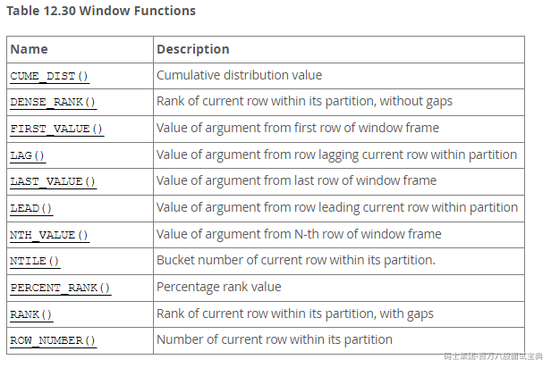

# mysql8新特性

mysql8版本中增加了很多新特性，这些新特性都是为了保证mysql能具备更高的性能，但是很多特性在日常的开发工作中，并不会用到，所以在此章节我们只会把对于面试和工作有帮助的新特性进行讲解，并不会把所有的内容挨个进行陈述和讲解，毕竟我们要做的不是专业的DBA，如果对于mysql8新特性比较感兴趣的话，可以通过以下地址详细了解：<https://dev.mysql.com/doc/refman/8.0/en/mysql-nutshell.html>

## 1、Data Dictionary（数据字典）

mysql在8.0之后合并了一个事务数据字典用来存储关于数据库对象的信息。在之前的mysql版本中，数据字典存储在元数据文件或者非事务表。

有些同学可能对于数据字典了解的不是很清楚，简单解释下，数据字典是用来存储元数据信息的表，举一个例子就可以知道，在公司做业务开发的时候，我们要进行数据库设计，那么各个表中的字段名称，类型等相关的信息就需要进行统一的管理，此时我们一般会创建数据字典来保存这些信息，方便后续的开发人员能够清楚的知道表的相关信息

此处的数据字典也是类似的意思，存储的是跟mysql相关的元数据信息，但是数据字典对于用户是不可见的，只能在debug的模式下进行访问，具体的数据字典中存储的表可以通过以下地址进行了解：<https://dev.mysql.com/doc/refman/8.0/en/system-schema.html#system-schema-data-dictionary-tables>

在之前的mysql5.7版本中，myisam和innodb存储引擎中有一个后缀为.frm的文件，存储的就是相关的元数据信息，也就是数据字典，只不过之前是用独立的文件来进行存储，在8.0之后的版本中进行了统一的管理，存储在了系统表空间中。

## 2、 Atomic data definition statements (Atomic DDL)（原子DDL）

原子DDL表示的意思是DDL语句将与DDL操作相关的数据字典更新、存储引擎操作和二进制日志写入合并到单个原子事务中，该操作要么被提交，要么被回滚。

我们在之前的数据库操作中很少关注DDL语句的相关操作，更多的操作是DML语句，那么此处的原子DDL代表什么意思呢？在之前的操作中，一条DDL语句都会隐式的结束当前会话中活跃的任何事务，就像执行了COMMIT语句一样，这意味着DDL语句不能再另一事务中运行，也不能在事务控制语句中执行。

通过在mysql8中引入的mysql数据字典，使原子DDL操作成为了可能。在早期的mysql版本中，元数据存储在元数据文件，非事务性表和存储引擎特定的字典中，这就需要中间提交。mysql数据字典提供的集中式事务性元数据存储消除了这个障碍，使得DDL语句操作可以转化为原子操作。具体的原子DDL特性在此处不再额外赘述，大家可以通过下述地址链接进行了解：<https://dev.mysql.com/doc/refman/8.0/en/atomic-ddl.html>

下面来列举一个简单的例子说明什么是原子DDL操作：

大家可以在mysql的5.7版本执行如下操作：

mysql> create table t1(c1 int);

Query OK, 0 rows affected (0.01 sec)

mysql> drop table t1,t2;

ERROR 1051 (42S02): Unknown table 'mysql8.t2'

mysql> show tables;

Empty set (0.00 sec)

mysql>

**通过上面执行的案例可以看到，只创建了t1表，然后删除t1表和t2表，t2表是不存在的，所以报错：不知道的表t2,但是看最后的结果发现t1表也删除了，说明他们不是一个原子操作，在执行过程中，虽然报错了，但是t1表依然删除成功**

在mysql8.0版本中执行如下操作：

mysql> create table t1(c1 int);

Query OK, 0 rows affected (0.00 sec)

mysql> drop table t1,t2;

ERROR 1051 (42S02): Unknown table 'mysql8.t2'

mysql> show tables;

+------------------+

| Tables\_in\_mysql8 |

+------------------+

| t1 |

+------------------+

1 row in set (0.00 sec)

**通过上面执行的案例可以看到，跟在mysql5.7中执行了一样的操作，但是在完成删除操作之后，t1表还存在，说明在删除t1,t2表的语句是一个原子操作，运行过程中报错了，所以要进行回滚。**

原子DDL操作的好处如下：

1. **一致性**：原子DDL确保在执行过程中不会出现任何中断或错误，从而保持数据的一致性。如果操作失败，整个事务都会回滚，从而防止数据损坏或不一致。
2. **可靠性**：由于原子DDL是事务性的，因此它们在执行过程中是可靠的。这意味着如果系统崩溃或发生其他故障，事务可以安全地回滚，确保数据库始终保持一致状态。
3. **性能**：原子DDL通常比传统的非原子DDL操作更快。因为它们在一个事务中执行，所以可以避免多次提交和回滚操作，从而提高性能。
4. **简化操作**：原子DDL简化了数据库管理员（DBA）的工作。它们提供了一种更简单、更可靠的方式来管理表结构，而无需担心中间状态或潜在的数据不一致问题。
5. **容错性**：原子DDL可以提供更好的容错性。如果一个操作失败，系统可以自动回滚，而不是尝试进行复杂的故障恢复。这降低了DBA的负担，并减少了出错的可能性。
6. **更好的备份和恢复**：由于原子DDL提供了更一致和可靠的操作，因此在进行备份和恢复时也更为简单和可靠。这有助于减少数据丢失的风险，并提高系统的可用性。
7. **简化开发**：对于开发人员来说，原子DDL操作可以简化数据库结构的更改和调整。通过使用原子DDL，开发人员可以一次性完成多个DDL操作，而无需分别执行每个操作。这减少了开发人员的工作量和复杂性。
8. **提高数据完整性**：原子DDL操作确保在执行DDL操作期间，数据库始终保持一致的状态。这有助于防止数据损坏或不一致的情况，从而提高了数据的完整性。
9. **减少错误和冲突**：由于原子DDL操作是事务性的，它们可以减少在执行DDL操作期间发生的错误和冲突。如果一个操作失败，整个事务都会回滚，从而避免了潜在的数据不一致问题。
10. **更好的可扩展性和性能**：原子DDL操作可以更好地支持数据库的可扩展性和性能。通过将多个DDL操作组合到一个事务中，可以减少提交和回滚的次数，从而提高数据库的性能

## 3、 *Security and account management* （安全和账户管理）

这些增强功能是为了提高mysql的安全性并且让DBA在账户管理方面具有更大的灵活性。

### 1、新增caching*sha2*password鉴权插件

在mysql8.0中国，caching*sha2*password是默认的鉴权插件，而不是mysql*native*password

**当使用了mysql8的新版本之后，建议大家不要修改默认的鉴权插件，因为caching*sha2*password提供了更加安全的密码加密以及更好的性能（使用缓存来解决连接时的延迟问题）。**

大家可以在不同的mysql版本中执行如下语句查看默认的鉴权插件：

在mysql5.7版本中，如下所示：

mysql> show variables like 'default\_authentication\_plugin';

+-------------------------------+-----------------------+

| Variable\_name | Value |

+-------------------------------+-----------------------+

| default\_authentication\_plugin | mysql\_native\_password |

+-------------------------------+-----------------------+

1 row in set, 1 warning (0.00 sec)

在mysql8.0版本中，如下所示：

mysql> show variables like 'default\_authentication\_plugin';

+-------------------------------+-----------------------+

| Variable\_name | Value |

+-------------------------------+-----------------------+

| default\_authentication\_plugin | caching\_sha2\_password |

+-------------------------------+-----------------------+

1 row in set (0.01 sec)

很多同学在日常工作或者学习的时候，使用某些客户端连接mysql可能会遇到mysql的用户名和密码都正确，但是连接不上的问题，这个时候，大家可以查看对应的鉴权插件是否正确，并且给对应的用户做插件的修改。

--从mysql的user表中查看不同的用户使用的鉴权插件

mysql> select user,host,plugin from mysql.user;

+------------------+-----------+-----------------------+

| user | host | plugin |

+------------------+-----------+-----------------------+

| root | % | caching\_sha2\_password |

| mysql.infoschema | localhost | caching\_sha2\_password |

| mysql.session | localhost | caching\_sha2\_password |

| mysql.sys | localhost | caching\_sha2\_password |

| root | localhost | mysql\_native\_password |

+------------------+-----------+-----------------------+

5 rows in set (0.01 sec)

--修改某个用户的鉴权插件

mysql> alter user 'root'@'localhost' identified with caching\_sha2\_password by '123456';

Query OK, 0 rows affected (0.01 sec)

--可以看到root用户的鉴权插件已经进行了修改

mysql> select user,host,plugin from mysql.user;

+------------------+-----------+-----------------------+

| user | host | plugin |

+------------------+-----------+-----------------------+

| root | % | caching\_sha2\_password |

| mysql.infoschema | localhost | caching\_sha2\_password |

| mysql.session | localhost | caching\_sha2\_password |

| mysql.sys | localhost | caching\_sha2\_password |

| root | localhost | caching\_sha2\_password |

+------------------+-----------+-----------------------+

5 rows in set (0.01 sec)

### 2、password management（新增用户密码管理）

mysql8版本现在维护有关密码历史的信息，启动对重用之前密码的限制。DBA可以要求在一定次数的密码修改或者一段时间内不从以前的密码中选择新密码。可以在全局或者单个账户的基础上建立密码重用策略。

#### 1、密码过期策略

为了更好的保证数据库的安全，可以设置在某个时间范围内将密码进行过期淘汰，可以通过全局的 default*password*lifetime 变量来进行设置，如果值为0表示，禁用密码淘汰策略，如果值为一个正数，表示在每N天必须要进行密码的修改

mysql> show variables like 'default\_password\_lifetime';

+---------------------------+-------+

| Variable\_name | Value |

+---------------------------+-------+

| default\_password\_lifetime | 0 |

+---------------------------+-------+

1 row in set (0.00 sec)

--修改全局的密码过期时间

mysql> SET PERSIST default\_password\_lifetime = 180;

Query OK, 0 rows affected (0.00 sec)

mysql> show variables like 'default\_password\_lifetime';

+---------------------------+-------+

| Variable\_name | Value |

+---------------------------+-------+

| default\_password\_lifetime | 180 |

+---------------------------+-------+

1 row in set (0.00 sec)

如果需要给某个特殊的用户设置密码过期时间，可以通过如下命令来实现：

--创建用户并且设置过期时间为90天

mysql> create user 'lian'@'%' password expire interval 90 day;

Query OK, 0 rows affected (0.01 sec)

--可以通过该语句查看用户密码过期时间

mysql> select user,host,password\_lifetime from mysql.user;

+------------------+-----------+-------------------+

| user | host | password\_lifetime |

+------------------+-----------+-------------------+

| lian | % | 90 |

| root | % | NULL |

| mysql.infoschema | localhost | NULL |

| mysql.session | localhost | NULL |

| mysql.sys | localhost | NULL |

| root | localhost | NULL |

+------------------+-----------+-------------------+

6 rows in set (0.00 sec)

--修改某个用户的过期时间

mysql> alter user 'lian'@'%' password expire interval 180 day;

Query OK, 0 rows affected (0.00 sec)

mysql> select user,host,password\_lifetime from mysql.user;

+------------------+-----------+-------------------+

| user | host | password\_lifetime |

+------------------+-----------+-------------------+

| lian | % | 180 |

| root | % | NULL |

| mysql.infoschema | localhost | NULL |

| mysql.session | localhost | NULL |

| mysql.sys | localhost | NULL |

| root | localhost | NULL |

+------------------+-----------+-------------------+

6 rows in set (0.00 sec)

--禁用某个用户的密码过期策略

mysql> alter user 'lian'@'%' password expire never;

Query OK, 0 rows affected (0.01 sec)

mysql> select user,host,password\_lifetime from mysql.user;

+------------------+-----------+-------------------+

| user | host | password\_lifetime |

+------------------+-----------+-------------------+

| lian | % | 0 |

| root | % | NULL |

| mysql.infoschema | localhost | NULL |

| mysql.session | localhost | NULL |

| mysql.sys | localhost | NULL |

| root | localhost | NULL |

+------------------+-----------+-------------------+

6 rows in set (0.00 sec)

--指定某个用户使用全局的密码过期策略

mysql> alter user 'lian'@'%' password expire default;

Query OK, 0 rows affected (0.00 sec)

mysql> select user,host,password\_lifetime from mysql.user;

+------------------+-----------+-------------------+

| user | host | password\_lifetime |

+------------------+-----------+-------------------+

| lian | % | NULL |

| root | % | NULL |

| mysql.infoschema | localhost | NULL |

| mysql.session | localhost | NULL |

| mysql.sys | localhost | NULL |

| root | localhost | NULL |

+------------------+-----------+-------------------+

6 rows in set (0.00 sec)

#### 2、密码重用策略

为了更好的保证数据库的安全，mysql允许对以前的密码重用进行限制，可以根据密码更改的次数和经过的时间同时建立重用限制。

--此变量用于根据所需的最小密码更改次数来控制以前密码的重用

mysql> show variables like 'password\_history';

+------------------+-------+

| Variable\_name | Value |

+------------------+-------+

| password\_history | 0 |

+------------------+-------+

1 row in set (0.01 sec)

--此变量用于根据经过的时间控制以前密码的重用

mysql> show variables like 'password\_reuse\_interval';

+-------------------------+-------+

| Variable\_name | Value |

+-------------------------+-------+

| password\_reuse\_interval | 0 |

+-------------------------+-------+

1 row in set (0.00 sec)

mysql> SET PERSIST password\_history = 3;

Query OK, 0 rows affected (0.00 sec)

mysql> SET PERSIST password\_reuse\_interval = 180;

Query OK, 0 rows affected (0.00 sec)

mysql> show variables like 'password\_history';

+------------------+-------+

| Variable\_name | Value |

+------------------+-------+

| password\_history | 3 |

+------------------+-------+

1 row in set (0.00 sec)

mysql>

mysql> show variables like 'password\_reuse\_interval';

+-------------------------+-------+

| Variable\_name | Value |

+-------------------------+-------+

| password\_reuse\_interval | 180 |

+-------------------------+-------+

1 row in set (0.00 sec)

下面的案例模拟修改密码所对应的错误：

mysql> create user 'lian'@'%' identified with caching\_sha2\_password by '123456';

Query OK, 0 rows affected (0.01 sec)

mysql> select user,host,password\_reuse\_history,password\_reuse\_time from mysql.user;

+------------------+-----------+------------------------+---------------------+

| user | host | password\_reuse\_history | password\_reuse\_time |

+------------------+-----------+------------------------+---------------------+

| lian | % | NULL | NULL |

| root | % | NULL | NULL |

| mysql.infoschema | localhost | NULL | NULL |

| mysql.session | localhost | NULL | NULL |

| mysql.sys | localhost | NULL | NULL |

| root | localhost | NULL | NULL |

+------------------+-----------+------------------------+---------------------+

6 rows in set (0.00 sec)

--通过下面的报错可以发现，跟我们之前制定的3次的策略违反了，所以报错

mysql> alter user 'lian'@'%' identified by '123456';

ERROR 3638 (HY000): Cannot use these credentials for 'lian@%' because they contradict the p

assword history policy

除了上述可以设置全局的重用策略之外，还可以给单个用户进行重用策略的设置。

mysql> select user,host,password\_reuse\_history,password\_reuse\_time from mysql.user;

+------------------+-----------+------------------------+---------------------+

| user | host | password\_reuse\_history | password\_reuse\_time |

+------------------+-----------+------------------------+---------------------+

| root | % | NULL | NULL |

| mysql.infoschema | localhost | NULL | NULL |

| mysql.session | localhost | NULL | NULL |

| mysql.sys | localhost | NULL | NULL |

| root | localhost | NULL | NULL |

+------------------+-----------+------------------------+---------------------+

5 rows in set (0.00 sec)

mysql> create user 'lian'@'%' password history 5;

Query OK, 0 rows affected (0.00 sec)

mysql> create user 'lian2'@'%' password reuse interval 365 day;

Query OK, 0 rows affected (0.00 sec)

mysql> select user,host,password\_reuse\_history,password\_reuse\_time from mysql.user;

+------------------+-----------+------------------------+---------------------+

| user | host | password\_reuse\_history | password\_reuse\_time |

+------------------+-----------+------------------------+---------------------+

| lian | % | 5 | NULL |

| lian2 | % | NULL | 365 |

| root | % | NULL | NULL |

| mysql.infoschema | localhost | NULL | NULL |

| mysql.session | localhost | NULL | NULL |

| mysql.sys | localhost | NULL | NULL |

| root | localhost | NULL | NULL |

+------------------+-----------+------------------------+---------------------+

7 rows in set (0.00 sec)

mysql> alter user 'lian'@'%' password history 10;

Query OK, 0 rows affected (0.00 sec)

mysql> alter user 'lian2'@'%' password reuse interval 180 day;

Query OK, 0 rows affected (0.00 sec)

mysql> select user,host,password\_reuse\_history,password\_reuse\_time from mysql.user;

+------------------+-----------+------------------------+---------------------+

| user | host | password\_reuse\_history | password\_reuse\_time |

+------------------+-----------+------------------------+---------------------+

| lian | % | 10 | NULL |

| lian2 | % | NULL | 180 |

| root | % | NULL | NULL |

| mysql.infoschema | localhost | NULL | NULL |

| mysql.session | localhost | NULL | NULL |

| mysql.sys | localhost | NULL | NULL |

| root | localhost | NULL | NULL |

+------------------+-----------+------------------------+---------------------+

7 rows in set (0.00 sec)

除了上述的两种策略之外，还包含密码验证要求策略，双重密码支持策略，随机密码生成策略等内容，在此处不再赘述，有想要了解的同学，可以通过以下地址进行学习：<https://dev.mysql.com/doc/refman/8.0/en/password-management.html>

**tips：**

在mysql8的版本中有一个小的语法区别：

在mysql的5.7版本中，可以将创建用户的命令和授权的命令一起执行，如下所示：

mysql> select user,host,plugin from mysql.user;

+---------------+-----------+-----------------------+

| user | host | plugin |

+---------------+-----------+-----------------------+

| root | % | mysql\_native\_password |

| mysql.session | localhost | mysql\_native\_password |

+---------------+-----------+-----------------------+

2 rows in set (0.00 sec)

mysql> grant all privileges on \*.\* to 'lian'@'%' identified by '123456';

Query OK, 0 rows affected, 1 warning (0.00 sec)

mysql> select user,host,plugin from mysql.user;

+---------------+-----------+-----------------------+

| user | host | plugin |

+---------------+-----------+-----------------------+

| lian | % | mysql\_native\_password |

| root | % | mysql\_native\_password |

| mysql.session | localhost | mysql\_native\_password |

+---------------+-----------+-----------------------+

3 rows in set (0.00 sec)

上述语句在mysql8的版本中执行会报错，要求必须要创建用户的命令和授权的命令分开执行：

--查看mysql的用户表

mysql> select user,host from mysql.user;

+------------------+-----------+

| user | host |

+------------------+-----------+

| root | % |

| mysql.infoschema | localhost |

| mysql.session | localhost |

| mysql.sys | localhost |

| root | localhost |

+------------------+-----------+

5 rows in set (0.00 sec)

-- 创建用户以及授权

mysql> grant all privileges on \*.\* to 'lian'@'%' identified by '123456';

ERROR 1064 (42000): You have an error in your SQL syntax; check the manual that corresponds

to your MySQL server version for the right syntax to use near 'identified by '123456'' at line 1

--创建用户

mysql> create user 'lian'@'%' identified by '123456';

Query OK, 0 rows affected (0.01 sec)

--授权

mysql> grant all privileges on \*.\* to 'lian'@'%';

Query OK, 0 rows affected (0.01 sec)

mysql> select user,host from mysql.user;

+------------------+-----------+

| user | host |

+------------------+-----------+

| lian | % |

| root | % |

| mysql.infoschema | localhost |

| mysql.session | localhost |

| mysql.sys | localhost |

| root | localhost |

+------------------+-----------+

6 rows in set (0.00 sec)

## 4、character set support(字符集支持)

mysql8版本中，将默认的字符集从latin1改为utf8mb4

## 5、Data type support(数据类型支持)

mysql8版本中现在支持在数据类型规范中使用表达式作为默认值。这些表达式可以作为BLOB、TEXT、GEOMETRY和JSON类型的默认值，而在之前的版本中是无法分配默认值的。

在创建表的时候可以显式的指定不同类型的默认值，如下所示：

CREATE TABLE t1 (

i INT DEFAULT -1,

c VARCHAR(10) DEFAULT '',

price DOUBLE(16,2) DEFAULT 0.00

);

在mysql8.0.13版本之后，可以指定数据类型的默认值为表达式，如下所示：

CREATE TABLE t1 (

-- literal defaults

i INT DEFAULT 0,

c VARCHAR(10) DEFAULT '',

-- expression defaults

f FLOAT DEFAULT (RAND() \* RAND()),

b BINARY(16) DEFAULT (UUID\_TO\_BIN(UUID())),

d DATE DEFAULT (CURRENT\_DATE + INTERVAL 1 YEAR),

p POINT DEFAULT (Point(0,0)),

j JSON DEFAULT (JSON\_ARRAY())

);

## 6、Common table expressions（通用表表达式）

mysql现在支持常见的表表达式，包括非递归和递归。公共表表达式支持使用命名临时结果集，通过允许在select语句和某些其他语句之前使用with子句来实现。

通用表表达式的好处如下：

1. **代码可读性**：CTE 可以使查询更清晰、更有组织。通过使用 CTE，你可以为复杂查询的不同部分分配描述性名称，使得整个查询更易于理解。
2. **减少重复代码**：如果你在多个地方使用相同的子查询，你可以将其放入一个 CTE 中，并在需要的地方引用它。这样可以避免重复代码，并使查询更加简洁。
3. **提高性能**：对于复杂的查询，CTE 可以帮助提高性能。有时，将一部分查询分解为 CTE 可以使查询优化器更有效地执行查询。
4. **模块化查询**：通过将复杂的查询分解为多个较小的部分，你可以使每个部分更易于理解和测试。这有助于提高代码的质量和可维护性。
5. **递归查询**：CTE 允许你执行递归查询，这在处理层次结构数据（如组织结构或目录）时特别有用。
6. **简化嵌套子查询**：对于包含嵌套子查询的复杂查询，CTE 可以提供一个更简洁、更易于管理的替代方案。
7. **可复用性**：一旦定义了 CTE，可以在多个查询中重复使用它，提高了代码的复用性

### **1、Common Table Expressions(公共表表达式)**

要使用公共表表达式，需要使用一个或者多个逗号分隔子句的with语句。每个子句提供一个产生结果集的子查询，并将名称和子查询关联起来。如下所示：

--官网给的案例

WITH

cte1 AS (SELECT a, b FROM table1),

cte2 AS (SELECT c, d FROM table2)

SELECT b, d FROM cte1 JOIN cte2

WHERE cte1.a = cte2.c;

--实际场景：查询雇员及其对应的部门名称

--正常的SQL语句

select ename,dname from emp e join dept d on e.deptno = d.deptno;

--使用公共表表达式

with e as (select ename,deptno from emp), d as (select dname,deptno from dept) selec

t ename,dname from e join d where e.deptno = d.deptno;

### **2、Recursive Common Table Expressions(递归公共表表达式)**

递归公共表表达式是具有引用其自身名称的子查询的表达式，例如：

WITH RECURSIVE cte (n) AS

(

SELECT 1

UNION ALL

SELECT n + 1 FROM cte WHERE n < 5

)

SELECT \* FROM cte;

在编写这类的递归语句时要注意：

1、如果with子句中的任何CTE引用自身，则with子句必须WITH RECURSIVE开头

2、递归CTE子查询有两部分，由union all或者union distinct分隔，第一个select为CTE生成初始行，并且不引用CTE名称，第二个select通过引用其from子句中的CTE名称来生成外包的行和递归，当此部分不再产生新行时，递归结束。因此，递归CTE是由一个非递归select部分和一个递归select部分组成

上述案例的执行过程是第一次迭代操作初始行结果为1并且产生1+1=2的新行，第二次迭代操作第一次迭代的结果2并产生新的行2+1=3，按照这个过程以此类推，知道n的值不再小于5的时候结束。

在使用递归通用表表达式的时候要注意，列是通过名称来访问的，并不是同规格为止来访问的，这意味着递归部分的列可以访问具有不同位置的非递归部分的列。

mysql> WITH RECURSIVE cte AS

-> (

-> SELECT 1 AS n, 1 AS p, -1 AS q

-> UNION ALL

-> SELECT n + 1, q \* 2, p \* 2 FROM cte WHERE n < 5

-> )

-> SELECT \* FROM cte;

+------+------+------+

| n | p | q |

+------+------+------+

| 1 | 1 | -1 |

| 2 | -2 | 2 |

| 3 | 4 | -4 |

| 4 | -8 | 8 |

| 5 | 16 | -16 |

+------+------+------+

5 rows in set (0.00 sec)

### **3、Limiting Common Table Expression Recursion（递归通用表表达式的限制）**

对于递归cte，重要的是递归select部分包含终止递归的条件，为了防止递归时空，可以通过限制来制止递归

1、配置 cte*max*recursion\_depth参数，该变量强制限制cte的递归级别数量，如果递归的级别超过该变量的值，那么服务器将终止执行任何CTE

2、配置max*execution*time参数，该变量强制在当前会话中执行select语句的执行超时

执行如下操作来验证：

--演示递归的层级深度

mysql> show variables like 'cte\_max\_recursion\_depth';

+-------------------------+-------+

| Variable\_name | Value |

+-------------------------+-------+

| cte\_max\_recursion\_depth | 1000 |

+-------------------------+-------+

1 row in set (0.00 sec)

mysql> WITH RECURSIVE cte (n) AS

-> (

-> SELECT 1

-> UNION ALL

-> SELECT n + 1 FROM cte

-> )

-> SELECT \* FROM cte;

ERROR 3636 (HY000): Recursive query aborted after 1001 iterations. Try increasing @@cte\_max\_recursion\_depth to a larger value.

--演示递归的超时限制

--由于之前的设置过深度，为了演示时间，需要把深度设置的大一些

mysql> set session cte\_max\_recursion\_depth = 100000000;

mysql> show variables like 'max\_execution\_time';

+--------------------+-------+

| Variable\_name | Value |

+--------------------+-------+

| max\_execution\_time | 0 |

+--------------------+-------+

1 row in set (0.00 sec)

mysql> set max\_execution\_time=1000;

Query OK, 0 rows affected (0.01 sec)

mysql> show variables like 'max\_execution\_time';

+--------------------+-------+

| Variable\_name | Value |

+--------------------+-------+

| max\_execution\_time | 1000 |

+--------------------+-------+

1 row in set (0.00 sec)

mysql> WITH RECURSIVE cte (n) AS

-> (

-> SELECT 1

-> UNION ALL

-> SELECT n + 1 FROM cte

-> )

-> SELECT \* FROM cte;

ERROR 3024 (HY000): Query execution was interrupted, maximum statement execution time exceeded

--从mysql8.0.19版本开始，也可以通过limit做限制

WITH RECURSIVE cte (n) AS

(

SELECT 1

UNION ALL

SELECT n + 1 FROM cte LIMIT 10000

)

SELECT \* FROM cte;

下面我们准备一些公共表表达式的递归案例：

1、斐波那契数列

mysql> WITH RECURSIVE fibonacci (n, fib\_n, next\_fib\_n) AS

-> (

-> SELECT 1, 0, 1

-> UNION ALL

-> SELECT n + 1, next\_fib\_n, fib\_n + next\_fib\_n

-> FROM fibonacci WHERE n < 10

-> )

-> SELECT \* FROM fibonacci;

+------+-------+------------+

| n | fib\_n | next\_fib\_n |

+------+-------+------------+

| 1 | 0 | 1 |

| 2 | 1 | 1 |

| 3 | 1 | 2 |

| 4 | 2 | 3 |

| 5 | 3 | 5 |

| 6 | 5 | 8 |

| 7 | 8 | 13 |

| 8 | 13 | 21 |

| 9 | 21 | 34 |

| 10 | 34 | 55 |

+------+-------+------------+

10 rows in set (0.00 sec)

2、日期序列生成

-- ----------------------------

-- Table structure for sales

-- ----------------------------

DROP TABLE IF EXISTS `sales`;

CREATE TABLE `sales` (

`date` date NULL DEFAULT NULL,

`price` double(10, 2) NULL DEFAULT NULL

) ENGINE = InnoDB CHARACTER SET = utf8mb4 COLLATE = utf8mb4\_0900\_ai\_ci ROW\_FORMAT = Dynamic;

-- ----------------------------

-- Records of sales

-- ----------------------------

INSERT INTO `sales` VALUES ('2017-01-03', 100.00);

INSERT INTO `sales` VALUES ('2017-01-03', 200.00);

INSERT INTO `sales` VALUES ('2017-01-06', 50.00);

INSERT INTO `sales` VALUES ('2017-01-08', 10.00);

INSERT INTO `sales` VALUES ('2017-01-08', 20.00);

INSERT INTO `sales` VALUES ('2017-01-08', 150.00);

INSERT INTO `sales` VALUES ('2017-01-10', 5.00);

--查询每天的销售额如下所示：

mysql> SELECT date, SUM(price) AS sum\_price FROM sales GROUP BY date ORDER BY date;

+------------+-----------+

| date | sum\_price |

+------------+-----------+

| 2017-01-03 | 300.00 |

| 2017-01-06 | 50.00 |

| 2017-01-08 | 180.00 |

| 2017-01-10 | 5.00 |

+------------+-----------+

4 rows in set (0.00 sec)

--经过查询之后发现最后的结果是没有问题的，但是有一个小的漏洞，结果集中无法显示不存在表中数据的日期以及对应的销售额，此时就可以使用CTE来生成连续的日期以及销售额

--显示连续的日期

mysql> WITH RECURSIVE dates (date) AS

-> (

-> SELECT MIN(date) FROM sales

-> UNION ALL

-> SELECT date + INTERVAL 1 DAY FROM dates

-> WHERE date + INTERVAL 1 DAY <= (SELECT MAX(date) FROM sales)

-> )

-> SELECT \* FROM dates;

+------------+

| date |

+------------+

| 2017-01-03 |

| 2017-01-04 |

| 2017-01-05 |

| 2017-01-06 |

| 2017-01-07 |

| 2017-01-08 |

| 2017-01-09 |

| 2017-01-10 |

+------------+

8 rows in set (0.00 sec)

--添加上销售额之后的语句

mysql> WITH RECURSIVE dates (date) AS

-> (

-> SELECT MIN(date) FROM sales

-> UNION ALL

-> SELECT date + INTERVAL 1 DAY FROM dates

-> WHERE date + INTERVAL 1 DAY <= (SELECT MAX(date) FROM sales)

-> )

-> SELECT dates.date, COALESCE(SUM(price), 0) AS sum\_price

-> FROM dates LEFT JOIN sales ON dates.date = sales.date

-> GROUP BY dates.date

-> ORDER BY dates.date;

+------------+-----------+

| date | sum\_price |

+------------+-----------+

| 2017-01-03 | 300.00 |

| 2017-01-04 | 0.00 |

| 2017-01-05 | 0.00 |

| 2017-01-06 | 50.00 |

| 2017-01-07 | 0.00 |

| 2017-01-08 | 180.00 |

| 2017-01-09 | 0.00 |

| 2017-01-10 | 5.00 |

+------------+-----------+

8 rows in set (0.00 sec)

3、分层数据遍历

递归公共表表达式对于遍历形成层次结构的数据非常有用，例如，有一个雇员表，表中存储的是员工的名字和id，还有其对应的经理的id，顶层的员工是没有经理的，值为null

CREATE TABLE employees (

id INT PRIMARY KEY NOT NULL,

name VARCHAR(100) NOT NULL,

manager\_id INT NULL,

INDEX (manager\_id),

FOREIGN KEY (manager\_id) REFERENCES employees (id)

);

INSERT INTO employees VALUES

(333, "Yasmina", NULL), # Yasmina is the CEO (manager\_id is NULL)

(198, "John", 333), # John has ID 198 and reports to 333 (Yasmina)

(692, "Tarek", 333),

(29, "Pedro", 198),

(4610, "Sarah", 29),

(72, "Pierre", 29),

(123, "Adil", 692);

--表中的数据如图所示：

mysql> select \* from employees;

+------+---------+------------+

| id | name | manager\_id |

+------+---------+------------+

| 29 | Pedro | 198 |

| 72 | Pierre | 29 |

| 123 | Adil | 692 |

| 198 | John | 333 |

| 333 | Yasmina | NULL |

| 692 | Tarek | 333 |

| 4610 | Sarah | 29 |

+------+---------+------------+

7 rows in set (0.00 sec)

--现在要生成每个员工的管理链的组织结构图，即把员工对应的所有领导编号展示出来：

mysql> WITH RECURSIVE employee\_paths (id, name, path) AS

-> (

-> SELECT id, name, CAST(id AS CHAR(200))

-> FROM employees

-> WHERE manager\_id IS NULL

-> UNION ALL

-> SELECT e.id, e.name, CONCAT(ep.path, ',', e.id)

-> FROM employee\_paths AS ep JOIN employees AS e

-> ON ep.id = e.manager\_id

-> )

-> SELECT \* FROM employee\_paths ORDER BY path;

+------+---------+-----------------+

| id | name | path |

+------+---------+-----------------+

| 333 | Yasmina | 333 |

| 198 | John | 333,198 |

| 29 | Pedro | 333,198,29 |

| 4610 | Sarah | 333,198,29,4610 |

| 72 | Pierre | 333,198,29,72 |

| 692 | Tarek | 333,692 |

| 123 | Adil | 333,692,123 |

+------+---------+-----------------+

7 rows in set (0.00 sec)

--为了方便大家理解，来解释下此递归表达式的含义：

--1、非递归select生成CEO的行（经理id为null的行），路径列被加宽为char(200),以确保有足够的空间可以存储较长的路径

--2、由递归select生成的每一行查找直接向前一行生成的员工报告的所有员工，即把所有领导所对应的下属员工的编号都作为新行，然后依次递归

--3、当员工没有其他下属的时候，递归就结束了

其他案例展示：

1、假设我们有一个员工表（employees），其中包含员工 ID、姓名和上级领导 ID。我们想要查找某个员工的所有下属员工，包括直接下属和间接下属，并返回他们的姓名。

-- ----------------------------

-- Table structure for employees

-- ----------------------------

DROP TABLE IF EXISTS `employees`;

CREATE TABLE `employees` (

`employee\_id` int(0) NOT NULL,

`employee\_name` varchar(50) CHARACTER SET utf8mb4 COLLATE utf8mb4\_0900\_ai\_ci NULL DEFAULT NULL,

`leader\_id` int(0) NULL DEFAULT NULL,

PRIMARY KEY (`employee\_id`) USING BTREE

) ENGINE = InnoDB CHARACTER SET = utf8mb4 COLLATE = utf8mb4\_0900\_ai\_ci ROW\_FORMAT = Dynamic;

-- ----------------------------

-- Records of employees

-- ----------------------------

INSERT INTO `employees` VALUES (1, 'John', NULL);

INSERT INTO `employees` VALUES (2, 'Jane', 1);

INSERT INTO `employees` VALUES (3, 'Mike', 1);

INSERT INTO `employees` VALUES (4, 'Emily', 2);

INSERT INTO `employees` VALUES (5, 'David', 2);

INSERT INTO `employees` VALUES (6, 'Sarah', 3);

INSERT INTO `employees` VALUES (7, 'Michael', 3);

--查找某个员工的所有下属，包括直接下属和间接下属

mysql> WITH RECURSIVE subordinates AS (

-> SELECT employee\_id, employee\_name, leader\_id

-> FROM employees

-> WHERE leader\_id = 《目标员工的id》

-> UNION ALL

-> SELECT e.employee\_id, e.employee\_name, e.leader\_id

-> FROM employees e

-> INNER JOIN subordinates s ON e.leader\_id = s.employee\_id

-> )

-> SELECT employee\_name FROM subordinates;

+---------------+

| employee\_name |

+---------------+

| Jane |

| Mike |

| Emily |

| David |

| Sarah |

| Michael |

+---------------+

6 rows in set (0.00 sec)

2、阶乘

mysql> WITH recursive FactorialCTE AS (

-> SELECT 1 AS Number, 1 AS Factorial

-> UNION ALL

-> SELECT Number + 1, Factorial \* (Number + 1)

-> FROM FactorialCTE

-> WHERE Number < 10 -- 限制递归的次数，这里计算到10的阶乘

-> )

-> SELECT Number, Factorial

-> FROM FactorialCTE;

+--------+-----------+

| Number | Factorial |

+--------+-----------+

| 1 | 1 |

| 2 | 2 |

| 3 | 6 |

| 4 | 24 |

| 5 | 120 |

| 6 | 720 |

| 7 | 5040 |

| 8 | 40320 |

| 9 | 362880 |

| 10 | 3628800 |

+--------+-----------+

10 rows in set (0.00 sec)

## 7、window Function(窗口函数)

mysql8版本之后开始支持窗口函数，对于查询中的每一行，使用与该行相关的行执行计算。所谓的窗口大家可以理解为记录的集合，窗口函数也就表示在满足某种特殊条件的记录集合上执行的函数。对于每条记录都要在此窗口内执行函数，有的函数随着记录不同，窗口大小是固定的，这种属于静态窗口，有的函数则相反，不同的记录对应着不同的窗口，这种动态变化的窗口叫做滑动窗口。

很多同学在刚开始接触窗口函数的时候容易跟聚合函数的搞混淆，他们的区别其实很明显，聚合函数是将多条记录聚合为一条，而窗口函数是每条记录都会执行，初始有几条记录，执行完之后还有几条

窗口函数的语法规则如下：

--我们在使用的时候只需要最最后添加如下语句即可：

WINDOW window\_name AS (window\_spec)

[, window\_name AS (window\_spec)] ...

--window\_spec的中可以指定窗口的名字，分区的规则，排序的规则，框架的规则

window\_spec:

[window\_name] [partition\_clause] [order\_clause] [frame\_clause]

--在此处partition\_clause和order\_clause的用法不再详细讲解，只需要在后续添加by 字段名即可，我们重点讲解下frame\_clause

frame\_clause:

frame\_units frame\_extent

--frame\_units表示窗口的单位，可以是行，也可以是某一个范围，当不指定值的时候表示把行作为单位

frame\_units:

{ROWS | RANGE}

--frame\_extent表示窗口的起始和结束点

frame\_extent:

{frame\_start | frame\_between}

frame\_between:

BETWEEN frame\_start AND frame\_end

frame\_start, frame\_end: {

--边界是当前行，一般跟其他范围关键字一起使用

CURRENT ROW

--边界是分区的第一行

| UNBOUNDED PRECEDING

--边界是分区的最后一行

| UNBOUNDED FOLLOWING

--边界是当前行减去expr的值

| expr PRECEDING

--边界是当前行加上expr的值

| expr FOLLOWING

}

mysql现在支持的窗口函数如下所示：

### 1、cume\_dist():返回一个累计分布值，即分组值小于等于当前值的行数与分组总行数的比值，取值范围为0-1

-- ----------------------------

-- Table structure for numbers

-- ----------------------------

DROP TABLE IF EXISTS `numbers`;

CREATE TABLE `numbers` (

`val` int(0) NULL DEFAULT NULL

) ENGINE = InnoDB CHARACTER SET = utf8mb4 COLLATE = utf8mb4\_0900\_ai\_ci ROW\_FORMAT = Dynamic;

-- ----------------------------

-- Records of numbers

-- ----------------------------

INSERT INTO `numbers` VALUES (1);

INSERT INTO `numbers` VALUES (1);

INSERT INTO `numbers` VALUES (2);

INSERT INTO `numbers` VALUES (3);

INSERT INTO `numbers` VALUES (3);

INSERT INTO `numbers` VALUES (3);

INSERT INTO `numbers` VALUES (4);

INSERT INTO `numbers` VALUES (4);

INSERT INTO `numbers` VALUES (5);

--row\_number函数表示是打印行号，cume\_dist函数表示的是小于等于该值的数据/总行数

mysql> SELECT

-> val,

-> ROW\_NUMBER() OVER w AS 'row\_number',

-> CUME\_DIST() OVER w AS 'cume\_dist'

-> FROM numbers

-> WINDOW w AS (ORDER BY val);

+------+------------+--------------------+

| val | row\_number | cume\_dist |

+------+------------+--------------------+

| 1 | 1 | 0.2222222222222222 |

| 1 | 2 | 0.2222222222222222 |

| 2 | 3 | 0.3333333333333333 |

| 3 | 4 | 0.6666666666666666 |

| 3 | 5 | 0.6666666666666666 |

| 3 | 6 | 0.6666666666666666 |

| 4 | 7 | 0.8888888888888888 |

| 4 | 8 | 0.8888888888888888 |

| 5 | 9 | 1 |

+------+------------+--------------------+

9 rows in set (0.00 sec)

### **2、rank()和dense\_rank();**

rank函数表示间断的组内排序，表示为每行分配一个排名，当出现相同值的是，会跳过排名数字

不间断的组内排序，表示为每行分配一个排名，当出现相同的值的时候，不会跳过排名

mysql> SELECT

-> val,

-> ROW\_NUMBER() OVER w AS 'row\_number',

-> RANK() OVER w AS 'rank',

-> DENSE\_RANK() OVER w AS 'dense\_rank'

-> FROM numbers

-> WINDOW w AS (ORDER BY val);

+------+------------+------+------------+

| val | row\_number | rank | dense\_rank |

+------+------------+------+------------+

| 1 | 1 | 1 | 1 |

| 1 | 2 | 1 | 1 |

| 2 | 3 | 3 | 2 |

| 3 | 4 | 4 | 3 |

| 3 | 5 | 4 | 3 |

| 3 | 6 | 4 | 3 |

| 4 | 7 | 7 | 4 |

| 4 | 8 | 7 | 4 |

| 5 | 9 | 9 | 5 |

+------+------------+------+------------+

9 rows in set (0.00 sec)

### **3、first*value()、next*value()、nth\_value()**

first\_value:返回窗口中第一行出现的值

last\_value:返回窗口中最后一行出现的值

nth\_value:返回窗口中第N行出现的值

-- ----------------------------

-- Table structure for observations

-- ----------------------------

DROP TABLE IF EXISTS `observations`;

CREATE TABLE `observations` (

`time` time(0) NULL DEFAULT NULL,

`subject` varchar(255) CHARACTER SET utf8mb4 COLLATE utf8mb4\_0900\_ai\_ci NULL DEFAULT NULL,

`val` int(0) NULL DEFAULT NULL

) ENGINE = InnoDB CHARACTER SET = utf8mb4 COLLATE = utf8mb4\_0900\_ai\_ci ROW\_FORMAT = Dynamic;

-- ----------------------------

-- Records of observations

-- ----------------------------

INSERT INTO `observations` VALUES ('07:00:00', 'st113', 10);

INSERT INTO `observations` VALUES ('07:15:00', 'st113', 9);

INSERT INTO `observations` VALUES ('07:30:00', 'st113', 25);

INSERT INTO `observations` VALUES ('07:45:00', 'st113', 20);

INSERT INTO `observations` VALUES ('07:00:00', 'xh458', 0);

INSERT INTO `observations` VALUES ('07:15:00', 'xh458', 10);

INSERT INTO `observations` VALUES ('07:30:00', 'xh458', 5);

INSERT INTO `observations` VALUES ('07:45:00', 'xh458', 30);

INSERT INTO `observations` VALUES ('08:00:00', 'xh458', 25);

--

mysql> SELECT

-> time, subject, val,

-> FIRST\_VALUE(val) OVER w AS 'first',

-> LAST\_VALUE(val) OVER w AS 'last',

-> NTH\_VALUE(val, 2) OVER w AS 'second',

-> NTH\_VALUE(val, 4) OVER w AS 'fourth'

-> FROM observations

-> WINDOW w AS (PARTITION BY subject ORDER BY time

-> ROWS UNBOUNDED PRECEDING);

+----------+---------+------+-------+------+--------+--------+

| time | subject | val | first | last | second | fourth |

+----------+---------+------+-------+------+--------+--------+

| 07:00:00 | st113 | 10 | 10 | 10 | NULL | NULL |

| 07:15:00 | st113 | 9 | 10 | 9 | 9 | NULL |

| 07:30:00 | st113 | 25 | 10 | 25 | 9 | NULL |

| 07:45:00 | st113 | 20 | 10 | 20 | 9 | 20 |

| 07:00:00 | xh458 | 0 | 0 | 0 | NULL | NULL |

| 07:15:00 | xh458 | 10 | 0 | 10 | 10 | NULL |

| 07:30:00 | xh458 | 5 | 0 | 5 | 10 | NULL |

| 07:45:00 | xh458 | 30 | 0 | 30 | 10 | 30 |

| 08:00:00 | xh458 | 25 | 0 | 25 | 10 | 30 |

+----------+---------+------+-------+------+--------+--------+

9 rows in set (0.00 sec)

### **4、lag()、lead()**

lag函数表示从当前行往前取第N行，如果没有N，默认为1，如果不存在前一行，则默认返回null

lead函数表示从当前行往后取第N行

-- ----------------------------

-- Table structure for series

-- ----------------------------

DROP TABLE IF EXISTS `series`;

CREATE TABLE `series` (

`t` time(0) NULL DEFAULT NULL,

`val` int(0) NULL DEFAULT NULL

) ENGINE = InnoDB CHARACTER SET = utf8mb4 COLLATE = utf8mb4\_0900\_ai\_ci ROW\_FORMAT = Dynamic;

-- ----------------------------

-- Records of series

-- ----------------------------

INSERT INTO `series` VALUES ('12:00:00', 100);

INSERT INTO `series` VALUES ('13:00:00', 125);

INSERT INTO `series` VALUES ('14:00:00', 132);

INSERT INTO `series` VALUES ('15:00:00', 145);

INSERT INTO `series` VALUES ('16:00:00', 140);

INSERT INTO `series` VALUES ('17:00:00', 150);

INSERT INTO `series` VALUES ('18:00:00', 200);

mysql> SELECT

-> t, val,

-> LAG(val) OVER w AS 'lag',

-> LEAD(val) OVER w AS 'lead',

-> val - LAG(val) OVER w AS 'lag diff',

-> val - LEAD(val) OVER w AS 'lead diff'

-> FROM series

-> WINDOW w AS (ORDER BY t);

+----------+------+------+------+----------+-----------+

| t | val | lag | lead | lag diff | lead diff |

+----------+------+------+------+----------+-----------+

| 12:00:00 | 100 | NULL | 125 | NULL | -25 |

| 13:00:00 | 125 | 100 | 132 | 25 | -7 |

| 14:00:00 | 132 | 125 | 145 | 7 | -13 |

| 15:00:00 | 145 | 132 | 140 | 13 | 5 |

| 16:00:00 | 140 | 145 | 150 | -5 | -10 |

| 17:00:00 | 150 | 140 | 200 | 10 | -50 |

| 18:00:00 | 200 | 150 | NULL | 50 | NULL |

+----------+------+------+------+----------+-----------+

7 rows in set (0.00 sec)

### **5、ntile():返回当前行在分组内的分桶号，在计算时要先将该分组内的所有数据划分为N个桶，之后返回每个记录所在的分桶号，返回范围是从1到N**

mysql> SELECT

-> val,

-> ROW\_NUMBER() OVER w AS 'row\_number',

-> NTILE(2) OVER w AS 'ntile2',

-> NTILE(4) OVER w AS 'ntile4'

-> FROM numbers

-> WINDOW w AS (ORDER BY val);

+------+------------+--------+--------+

| val | row\_number | ntile2 | ntile4 |

+------+------------+--------+--------+

| 1 | 1 | 1 | 1 |

| 1 | 2 | 1 | 1 |

| 2 | 3 | 1 | 1 |

| 3 | 4 | 1 | 2 |

| 3 | 5 | 1 | 2 |

| 3 | 6 | 2 | 3 |

| 4 | 7 | 2 | 3 |

| 4 | 8 | 2 | 4 |

| 5 | 9 | 2 | 4 |

+------+------------+--------+--------+

9 rows in set (0.00 sec)

### **6、percent\_rank:累计百分比，该函数的计算结果为：小于该条记录值的所有记录的行数/该分组的总行数-1，所以该记录的返回值为[0,1]**

mysql> SELECT

-> val,

-> ROW\_NUMBER() OVER w AS 'row\_number',

-> PERCENT\_RANK() OVER w AS 'percent\_rank'

-> FROM numbers

-> WINDOW w AS (ORDER BY val);

+------+------------+--------------+

| val | row\_number | percent\_rank |

+------+------------+--------------+

| 1 | 1 | 0 |

| 1 | 2 | 0 |

| 2 | 3 | 0.25 |

| 3 | 4 | 0.375 |

| 3 | 5 | 0.375 |

| 3 | 6 | 0.375 |

| 4 | 7 | 0.75 |

| 4 | 8 | 0.75 |

| 5 | 9 | 1 |

+------+------------+--------------+

9 rows in set (0.00 sec)

### **7、row\_number():当前行在其分组内的序号，不管是否出现重复值，其排序结果都是1，2，3，4，5**

具体的案例在前面的sql中已经用过很多次，此处不再赘述

利用窗口函数的案例展示，表结构如下所示：

-- ----------------------------

-- Table structure for sale

-- ----------------------------

DROP TABLE IF EXISTS `sale`;

CREATE TABLE `sale` (

`year` int(0) NULL DEFAULT NULL,

`country` varchar(10) CHARACTER SET utf8mb4 COLLATE utf8mb4\_0900\_ai\_ci NULL DEFAULT NULL,

`product` varchar(20) CHARACTER SET utf8mb4 COLLATE utf8mb4\_0900\_ai\_ci NULL DEFAULT NULL,

`profit` int(0) NULL DEFAULT NULL

) ENGINE = InnoDB CHARACTER SET = utf8mb4 COLLATE = utf8mb4\_0900\_ai\_ci ROW\_FORMAT = Dynamic;

-- ----------------------------

-- Records of sale

-- ----------------------------

INSERT INTO `sale` VALUES (2000, 'Finland', 'Computer', 1500);

INSERT INTO `sale` VALUES (2000, 'Finland', 'Phone', 100);

INSERT INTO `sale` VALUES (2001, 'Finland', 'Phone', 10);

INSERT INTO `sale` VALUES (2000, 'India', 'Computer', 1200);

INSERT INTO `sale` VALUES (2000, 'India', 'Calculator', 75);

INSERT INTO `sale` VALUES (2000, 'India', 'Calculator', 75);

INSERT INTO `sale` VALUES (2000, 'USA', 'Computer', 1500);

INSERT INTO `sale` VALUES (2000, 'USA', 'Calculator', 75);

INSERT INTO `sale` VALUES (2001, 'USA', 'Computer', 1500);

INSERT INTO `sale` VALUES (2001, 'USA', 'Calculator', 50);

INSERT INTO `sale` VALUES (2001, 'USA', 'Computer', 1200);

INSERT INTO `sale` VALUES (2001, 'USA', 'TV', 150);

INSERT INTO `sale` VALUES (2001, 'USA', 'TV', 100);

--查询每个国家的利润

--用到了聚合函数

mysql> SELECT country, SUM(profit) AS country\_profit

-> FROM sale

-> GROUP BY country

-> ORDER BY country;

+---------+----------------+

| country | country\_profit |

+---------+----------------+

| Finland | 1610 |

| India | 1350 |

| USA | 4575 |

+---------+----------------+

3 rows in set (0.00 sec)

--使用窗口函数

mysql> SELECT

-> year, country, product, profit,

-> SUM(profit) OVER() AS total\_profit,

-> SUM(profit) OVER(PARTITION BY country) AS country\_profit

-> FROM sale

-> ORDER BY country, year, product, profit;

+------+---------+------------+--------+--------------+----------------+

| year | country | product | profit | total\_profit | country\_profit |

+------+---------+------------+--------+--------------+----------------+

| 2000 | Finland | Computer | 1500 | 7535 | 1610 |

| 2000 | Finland | Phone | 100 | 7535 | 1610 |

| 2001 | Finland | Phone | 10 | 7535 | 1610 |

| 2000 | India | Calculator | 75 | 7535 | 1350 |

| 2000 | India | Calculator | 75 | 7535 | 1350 |

| 2000 | India | Computer | 1200 | 7535 | 1350 |

| 2000 | USA | Calculator | 75 | 7535 | 4575 |

| 2000 | USA | Computer | 1500 | 7535 | 4575 |

| 2001 | USA | Calculator | 50 | 7535 | 4575 |

| 2001 | USA | Computer | 1200 | 7535 | 4575 |

| 2001 | USA | Computer | 1500 | 7535 | 4575 |

| 2001 | USA | TV | 100 | 7535 | 4575 |

| 2001 | USA | TV | 150 | 7535 | 4575 |

+------+---------+------------+--------+--------------+----------------+

13 rows in set (0.00 sec)

--使用row\_numbert添加行号，在下面的案例中，行按照国家编号，默认情况下，行号是无序的，没有办法确定，如果想要进行排序，可以通过order by进行排序

mysql> SELECT

-> year, country, product, profit,

-> ROW\_NUMBER() OVER(PARTITION BY country) AS row\_num1,

-> ROW\_NUMBER() OVER(PARTITION BY country ORDER BY year, product) AS row\_num2

-> FROM sale;

+------+---------+------------+--------+----------+----------+

| year | country | product | profit | row\_num1 | row\_num2 |

+------+---------+------------+--------+----------+----------+

| 2000 | Finland | Computer | 1500 | 1 | 1 |

| 2000 | Finland | Phone | 100 | 2 | 2 |

| 2001 | Finland | Phone | 10 | 3 | 3 |

| 2000 | India | Calculator | 75 | 2 | 1 |

| 2000 | India | Calculator | 75 | 3 | 2 |

| 2000 | India | Computer | 1200 | 1 | 3 |

| 2000 | USA | Calculator | 75 | 2 | 1 |

| 2000 | USA | Computer | 1500 | 1 | 2 |

| 2001 | USA | Calculator | 50 | 4 | 3 |

| 2001 | USA | Computer | 1500 | 3 | 4 |

| 2001 | USA | Computer | 1200 | 5 | 5 |

| 2001 | USA | TV | 150 | 6 | 6 |

| 2001 | USA | TV | 100 | 7 | 7 |

+------+---------+------------+--------+----------+----------+

13 rows in set (0.00 sec)

--根据国家的收益进行排名

mysql> SELECT

-> YEAR,

-> country,

-> product,

-> profit,

-> row\_number() over (ORDER BY profit) AS 'rank',

-> rank() over (ORDER BY profit) AS 'rank\_1'

-> FROM

-> sale;

+------+---------+------------+--------+------+--------+

| YEAR | country | product | profit | rank | rank\_1 |

+------+---------+------------+--------+------+--------+

| 2001 | Finland | Phone | 10 | 1 | 1 |

| 2001 | USA | Calculator | 50 | 2 | 2 |

| 2000 | India | Calculator | 75 | 3 | 3 |

| 2000 | India | Calculator | 75 | 4 | 3 |

| 2000 | USA | Calculator | 75 | 5 | 3 |

| 2000 | Finland | Phone | 100 | 6 | 6 |

| 2001 | USA | TV | 100 | 7 | 6 |

| 2001 | USA | TV | 150 | 8 | 8 |

| 2000 | India | Computer | 1200 | 9 | 9 |

| 2001 | USA | Computer | 1200 | 10 | 9 |

| 2000 | Finland | Computer | 1500 | 11 | 11 |

| 2000 | USA | Computer | 1500 | 12 | 11 |

| 2001 | USA | Computer | 1500 | 13 | 11 |

+------+---------+------------+--------+------+--------+

13 rows in set (0.00 sec)

假设有一个销售数据表，表结构和数据如下所示：

-- ----------------------------

-- Table structure for sales\_data

-- ----------------------------

DROP TABLE IF EXISTS `sales\_data`;

CREATE TABLE `sales\_data` (

`product\_id` int(0) NULL DEFAULT NULL,

`product\_name` varchar(50) CHARACTER SET utf8mb4 COLLATE utf8mb4\_0900\_ai\_ci NULL DEFAULT NULL,

`sale\_date` date NULL DEFAULT NULL,

`sale\_amount` decimal(10, 2) NULL DEFAULT NULL

) ENGINE = InnoDB CHARACTER SET = utf8mb4 COLLATE = utf8mb4\_0900\_ai\_ci ROW\_FORMAT = Dynamic;

-- ----------------------------

-- Records of sales\_data

-- ----------------------------

INSERT INTO `sales\_data` VALUES (1, 'Product A', '2023-01-01', 100.00);

INSERT INTO `sales\_data` VALUES (1, 'Product A', '2023-01-02', 150.00);

INSERT INTO `sales\_data` VALUES (1, 'Product A', '2023-01-03', 200.00);

INSERT INTO `sales\_data` VALUES (2, 'Product B', '2023-01-01', 120.00);

INSERT INTO `sales\_data` VALUES (2, 'Product B', '2023-01-02', 80.00);

INSERT INTO `sales\_data` VALUES (3, 'Product C', '2023-01-02', 180.00);

INSERT INTO `sales\_data` VALUES (3, 'Product C', '2023-01-03', 250.00);

--计算每个产品的累计销售额

mysql> SELECT

-> product\_id,

-> product\_name,

-> sale\_amount,

-> SUM(sale\_amount) OVER (PARTITION BY product\_id ORDER BY sale\_date) AS cumulative

\_sales -> FROM

-> sales\_data;

+------------+--------------+-------------+------------------+

| product\_id | product\_name | sale\_amount | cumulative\_sales |

+------------+--------------+-------------+------------------+

| 1 | Product A | 100.00 | 100.00 |

| 1 | Product A | 150.00 | 250.00 |

| 1 | Product A | 200.00 | 450.00 |

| 2 | Product B | 120.00 | 120.00 |

| 2 | Product B | 80.00 | 200.00 |

| 3 | Product C | 180.00 | 180.00 |

| 3 | Product C | 250.00 | 430.00 |

+------------+--------------+-------------+------------------+

7 rows in set (0.00 sec)

--计算每个产品的最近7天的平均销售额

--刚开始相信同学们都会以如下的方式来编写：但是这样写完之后发现没有考虑最近7天这个条件

mysql> select product\_id,product\_name,sale\_amount,sale\_date,avg(sale\_amount) over w as last7

-> from sales\_data window w as (partition by product\_id order by sale\_date);

+------------+--------------+-------------+------------+------------+

| product\_id | product\_name | sale\_amount | sale\_date | last7 |

+------------+--------------+-------------+------------+------------+

| 1 | Product A | 100.00 | 2023-01-01 | 100.000000 |

| 1 | Product A | 150.00 | 2023-01-02 | 125.000000 |

| 1 | Product A | 200.00 | 2023-01-03 | 150.000000 |

| 2 | Product B | 120.00 | 2023-01-01 | 120.000000 |

| 2 | Product B | 80.00 | 2023-01-02 | 100.000000 |

| 3 | Product C | 180.00 | 2023-01-02 | 180.000000 |

| 3 | Product C | 250.00 | 2023-01-03 | 215.000000 |

+------------+--------------+-------------+------------+------------+

7 rows in set (0.00 sec)

--改写完之后发现好像是没有问题的

mysql> select product\_id,product\_name,sale\_amount,sale\_date,avg(sale\_amount) over w as last7

-> from sales\_data window w as (partition by product\_id order by sale\_date rows between 6 precedi

ng and current row);+------------+--------------+-------------+------------+------------+

| product\_id | product\_name | sale\_amount | sale\_date | last7 |

+------------+--------------+-------------+------------+------------+

| 1 | Product A | 100.00 | 2023-01-01 | 100.000000 |

| 1 | Product A | 150.00 | 2023-01-02 | 125.000000 |

| 1 | Product A | 200.00 | 2023-01-03 | 150.000000 |

| 2 | Product B | 120.00 | 2023-01-01 | 120.000000 |

| 2 | Product B | 80.00 | 2023-01-02 | 100.000000 |

| 3 | Product C | 180.00 | 2023-01-02 | 180.000000 |

| 3 | Product C | 250.00 | 2023-01-03 | 215.000000 |

+------------+--------------+-------------+------------+------------+

7 rows in set (0.00 sec)

--插入一条2022年的数据试一下

INSERT INTO `sales\_data` VALUES (1, 'Product A', '2022-01-01', 100.00);

mysql> select product\_id,product\_name,sale\_amount,sale\_date,avg(sale\_amount) over w as last7 from sal

es\_data window w as (partition by product\_id order by sale\_date rows between 6 preceding and current row);

+------------+--------------+-------------+------------+------------+

| product\_id | product\_name | sale\_amount | sale\_date | last7 |

+------------+--------------+-------------+------------+------------+

| 1 | Product A | 100.00 | 2022-01-01 | 100.000000 |

| 1 | Product A | 100.00 | 2023-01-01 | 100.000000 |

| 1 | Product A | 150.00 | 2023-01-02 | 116.666667 |

| 1 | Product A | 200.00 | 2023-01-03 | 137.500000 |

| 2 | Product B | 120.00 | 2023-01-01 | 120.000000 |

| 2 | Product B | 80.00 | 2023-01-02 | 100.000000 |

| 3 | Product C | 180.00 | 2023-01-02 | 180.000000 |

| 3 | Product C | 250.00 | 2023-01-03 | 215.000000 |

+------------+--------------+-------------+------------+------------+

8 rows in set (0.00 sec)

执行完之后，发现2022年的那条数据也被计算进入，而且进行了正常输出，所以此时肯定是有问题。

注意：

在窗口函数中可以对查询结果的范围进行框定，但是框定的条件并不是表中的某个列，而是按照行数来的，也就是说rows between 6 preceding and current row表示的是从当前行向前数6行，包含的是这部分的数据，测试如下：

--向表中依次插入2022年的数据

INSERT INTO `sales\_data` VALUES (1, 'Product A', '2022-02-01', 100.00);

INSERT INTO `sales\_data` VALUES (1, 'Product A', '2022-03-01', 100.00);

INSERT INTO `sales\_data` VALUES (1, 'Product A', '2022-04-01', 100.00);

INSERT INTO `sales\_data` VALUES (1, 'Product A', '2022-05-01', 100.00);

INSERT INTO `sales\_data` VALUES (1, 'Product A', '2022-06-01', 100.00);

INSERT INTO `sales\_data` VALUES (1, 'Product A', '2022-07-01', 100.00);

INSERT INTO `sales\_data` VALUES (1, 'Product A', '2022-08-01', 100.00);

INSERT INTO `sales\_data` VALUES (1, 'Product A', '2022-09-01', 100.00);

INSERT INTO `sales\_data` VALUES (1, 'Product A', '2022-10-01', 100.00);

INSERT INTO `sales\_data` VALUES (1, 'Product A', '2022-11-01', 100.00);

INSERT INTO `sales\_data` VALUES (1, 'Product A', '2022-12-01', 100.00);

--执行如上sql语句

mysql> select product\_id,product\_name,sale\_amount,sale\_date,avg(sale\_amount) over w as last7

-> from sales\_data window w as (partition by product\_id order by sale\_date rows between 6 precedi

ng and current row);+------------+--------------+-------------+------------+------------+

| product\_id | product\_name | sale\_amount | sale\_date | last7 |

+------------+--------------+-------------+------------+------------+

| 1 | Product A | 100.00 | 2022-01-01 | 100.000000 |

| 1 | Product A | 100.00 | 2022-02-01 | 100.000000 |

| 1 | Product A | 100.00 | 2022-03-01 | 100.000000 |

| 1 | Product A | 100.00 | 2022-04-01 | 100.000000 |

| 1 | Product A | 100.00 | 2022-05-01 | 100.000000 |

| 1 | Product A | 100.00 | 2022-06-01 | 100.000000 |

| 1 | Product A | 100.00 | 2022-07-01 | 100.000000 |

| 1 | Product A | 100.00 | 2022-08-01 | 100.000000 |

| 1 | Product A | 100.00 | 2022-09-01 | 100.000000 |

| 1 | Product A | 100.00 | 2022-10-01 | 100.000000 |

| 1 | Product A | 100.00 | 2022-11-01 | 100.000000 |

| 1 | Product A | 100.00 | 2022-12-01 | 100.000000 |

| 1 | Product A | 100.00 | 2023-01-01 | 100.000000 |

| 1 | Product A | 150.00 | 2023-01-02 | 107.142857 |

| 1 | Product A | 200.00 | 2023-01-03 | 121.428571 |

| 2 | Product B | 120.00 | 2023-01-01 | 120.000000 |

| 2 | Product B | 80.00 | 2023-01-02 | 100.000000 |

| 3 | Product C | 180.00 | 2023-01-02 | 180.000000 |

| 3 | Product C | 250.00 | 2023-01-03 | 215.000000 |

+------------+--------------+-------------+------------+------------+

19 rows in set (0.00 sec)

--查看第14行结果，发现这个平均值取得是2022-08-01到2023-01-02的数据计算的平均值，而不是最近7天的平均值，所以如果想要框定某一个时间范围的话，只能通过where条件来限制

mysql> select product\_id,product\_name,sale\_amount,sale\_date,avg(sale\_amount) over w as last7

-> from sales\_data where sale\_date between '2022-12-28' and '2023-01-03'

-> window w as(partition by product\_id order by sale\_date);

+------------+--------------+-------------+------------+------------+

| product\_id | product\_name | sale\_amount | sale\_date | last7 |

+------------+--------------+-------------+------------+------------+

| 1 | Product A | 100.00 | 2023-01-01 | 100.000000 |

| 1 | Product A | 150.00 | 2023-01-02 | 125.000000 |

| 1 | Product A | 200.00 | 2023-01-03 | 150.000000 |

| 2 | Product B | 120.00 | 2023-01-01 | 120.000000 |

| 2 | Product B | 80.00 | 2023-01-02 | 100.000000 |

| 3 | Product C | 180.00 | 2023-01-02 | 180.000000 |

| 3 | Product C | 250.00 | 2023-01-03 | 215.000000 |

+------------+--------------+-------------+------------+------------+

7 rows in set (0.00 sec)

## 8、hash Join Optimization（哈希连接优化）

从mysql8.0.18版本开始，只要连接中的每对表至少包含一个相等连接条件，并没有这些条件上没有索引的话就可以使用hash join。hash join不需要索引。在大多数的情况下，散列连接比块嵌套循环算法效率更高。

默认情况下，mysql8.0.18以及之后的版本尽可能使用hash join，可以使用BNL和NO\_BNL优化器提示来控制是否使用hash join。

**注意：在mysql8.0.18版本中可以使用HASH*JOIN和NO*HASH\_JOIN标志来控制，但是在8.0.19版本之后被移除**

在mysql8.0.18版本开始，只要连接中的每对表至少包含一个相等连接条件，并没有这些条件上没有索引的话就可以使用hash join，例如：

SELECT \*

FROM t1

JOIN t2

ON t1.c1=t2.c1;

hash join通常比之前版本的mysql中提供的块嵌套循环连接要更快，因此从mysql8.0.20版本开始，删除了对块嵌套循环连接的支持，在之前使用块嵌套循环连接的地方使用hash join，大家可以在下面的案例中看到hash join的应用：

CREATE TABLE t1 (c1 INT, c2 INT);

CREATE TABLE t2 (c1 INT, c2 INT);

CREATE TABLE t3 (c1 INT, c2 INT);

mysql> explain select \* from t1 join t2 on t1.c1 = t2.c2\G

\*\*\*\*\*\*\*\*\*\*\*\*\*\*\*\*\*\*\*\*\*\*\*\*\*\*\* 1. row \*\*\*\*\*\*\*\*\*\*\*\*\*\*\*\*\*\*\*\*\*\*\*\*\*\*\*

id: 1

select\_type: SIMPLE

table: t1

partitions: NULL

type: ALL

possible\_keys: NULL

key: NULL

key\_len: NULL

ref: NULL

rows: 1

filtered: 100.00

Extra: NULL

\*\*\*\*\*\*\*\*\*\*\*\*\*\*\*\*\*\*\*\*\*\*\*\*\*\*\* 2. row \*\*\*\*\*\*\*\*\*\*\*\*\*\*\*\*\*\*\*\*\*\*\*\*\*\*\*

id: 1

select\_type: SIMPLE

table: t2

partitions: NULL

type: ALL

possible\_keys: NULL

key: NULL

key\_len: NULL

ref: NULL

rows: 1

filtered: 100.00

Extra: Using where; Using join buffer (hash join)

2 rows in set, 1 warning (0.00 sec)

--在上述的执行计划的输出中，可以看到使用了hash join

hash join也可用于多个连接的查询，只要每对表至少有一个连接条件是等值连接即可，如下所示：

mysql> explain format = tree SELECT \* FROM t1

-> JOIN t2 ON (t1.c1 = t2.c1 AND t1.c2 < t2.c2)

-> JOIN t3 ON (t2.c1 = t3.c1)\G

\*\*\*\*\*\*\*\*\*\*\*\*\*\*\*\*\*\*\*\*\*\*\*\*\*\*\* 1. row \*\*\*\*\*\*\*\*\*\*\*\*\*\*\*\*\*\*\*\*\*\*\*\*\*\*\*

EXPLAIN: -> Inner hash join (t3.c1 = t1.c1) (cost=1.05 rows=1)

-> Table scan on t3 (cost=0.35 rows=1)

-> Hash

-> Filter: (t1.c2 < t2.c2) (cost=0.7 rows=1)

-> Inner hash join (t2.c1 = t1.c1) (cost=0.7 rows=1)

-> Table scan on t2 (cost=0.35 rows=1)

-> Hash

-> Table scan on t1 (cost=0.35 rows=1)

1 row in set (0.00 sec)

在mysql8.0.20版本之前，如果任何一对连接的表的连接条件中没有等值连接的条件，那么就不能使用hash join，但是在mysql8.0.20版本之后，这种情况也可以使用

mysql> EXPLAIN FORMAT=TREE

-> SELECT \* FROM t1

-> JOIN t2 ON (t1.c1 = t2.c1)

-> JOIN t3 ON (t2.c1 < t3.c1)\G

\*\*\*\*\*\*\*\*\*\*\*\*\*\*\*\*\*\*\*\*\*\*\*\*\*\*\* 1. row \*\*\*\*\*\*\*\*\*\*\*\*\*\*\*\*\*\*\*\*\*\*\*\*\*\*\*

EXPLAIN: -> Filter: (t1.c1 < t3.c1) (cost=1.05 rows=1)

-> Inner hash join (no condition) (cost=1.05 rows=1)

-> Table scan on t3 (cost=0.35 rows=1)

-> Hash

-> Inner hash join (t2.c1 = t1.c1) (cost=0.7 rows=1)

-> Table scan on t2 (cost=0.35 rows=1)

-> Hash

-> Table scan on t1 (cost=0.35 rows=1)

1 row in set (0.00 sec)

hash join也可以用于笛卡尔积，也就是说，没有指定连接条件的时候也可以使用：

mysql> EXPLAIN FORMAT=TREE

-> SELECT \*

-> FROM t1

-> JOIN t2

-> WHERE t1.c2 > 50\G

\*\*\*\*\*\*\*\*\*\*\*\*\*\*\*\*\*\*\*\*\*\*\*\*\*\*\* 1. row \*\*\*\*\*\*\*\*\*\*\*\*\*\*\*\*\*\*\*\*\*\*\*\*\*\*\*

EXPLAIN: -> Inner hash join (no condition) (cost=0.7 rows=1)

-> Table scan on t2 (cost=0.35 rows=1)

-> Hash

-> Filter: (t1.c2 > 50) (cost=0.35 rows=1)

-> Table scan on t1 (cost=0.35 rows=1)

1 row in set (0.00 sec)

通过上述的案例，大家可以看到，使用hash join的时候并不要求连接的表中必须包含等值连接的条件，实际上，也确实如此，在mysql8.0.20版本之后，以下案例的连接也可以使用hash join:

--非等值内连接

mysql> EXPLAIN FORMAT=TREE SELECT \* FROM t1 JOIN t2 ON t1.c1 < t2.c1\G

\*\*\*\*\*\*\*\*\*\*\*\*\*\*\*\*\*\*\*\*\*\*\*\*\*\*\* 1. row \*\*\*\*\*\*\*\*\*\*\*\*\*\*\*\*\*\*\*\*\*\*\*\*\*\*\*

EXPLAIN: -> Filter: (t1.c1 < t2.c1) (cost=0.7 rows=1)

-> Inner hash join (no condition) (cost=0.7 rows=1)

-> Table scan on t2 (cost=0.35 rows=1)

-> Hash

-> Table scan on t1 (cost=0.35 rows=1)

1 row in set (0.00 sec)

--半连接

mysql> EXPLAIN FORMAT=TREE SELECT \* FROM t1

-> WHERE t1.c1 IN (SELECT t2.c2 FROM t2)\G

\*\*\*\*\*\*\*\*\*\*\*\*\*\*\*\*\*\*\*\*\*\*\*\*\*\*\* 1. row \*\*\*\*\*\*\*\*\*\*\*\*\*\*\*\*\*\*\*\*\*\*\*\*\*\*\*

EXPLAIN: -> Hash semijoin (t2.c2 = t1.c1) (cost=0.7 rows=1)

-> Table scan on t1 (cost=0.35 rows=1)

-> Hash

-> Table scan on t2 (cost=0.35 rows=1)

1 row in set (0.00 sec)

--反连接

mysql> EXPLAIN FORMAT=TREE SELECT \* FROM t2

-> WHERE NOT EXISTS (SELECT \* FROM t1 WHERE t1.c1 = t2.c1)\G

\*\*\*\*\*\*\*\*\*\*\*\*\*\*\*\*\*\*\*\*\*\*\*\*\*\*\* 1. row \*\*\*\*\*\*\*\*\*\*\*\*\*\*\*\*\*\*\*\*\*\*\*\*\*\*\*

EXPLAIN: -> Hash antijoin (t1.c1 = t2.c1) (cost=0.7 rows=1)

-> Table scan on t2 (cost=0.35 rows=1)

-> Hash

-> Table scan on t1 (cost=0.35 rows=1)

1 row in set, 1 warning (0.00 sec)

--左外连接

mysql> EXPLAIN FORMAT=TREE SELECT \* FROM t1 LEFT JOIN t2 ON t1.c1 = t2.c1\G

\*\*\*\*\*\*\*\*\*\*\*\*\*\*\*\*\*\*\*\*\*\*\*\*\*\*\* 1. row \*\*\*\*\*\*\*\*\*\*\*\*\*\*\*\*\*\*\*\*\*\*\*\*\*\*\*

EXPLAIN: -> Left hash join (t2.c1 = t1.c1) (cost=0.7 rows=1)

-> Table scan on t1 (cost=0.35 rows=1)

-> Hash

-> Table scan on t2 (cost=0.35 rows=1)

1 row in set (0.00 sec)

--右外连接

mysql> EXPLAIN FORMAT=TREE SELECT \* FROM t1 RIGHT JOIN t2 ON t1.c1 = t2.c1\G

\*\*\*\*\*\*\*\*\*\*\*\*\*\*\*\*\*\*\*\*\*\*\*\*\*\*\* 1. row \*\*\*\*\*\*\*\*\*\*\*\*\*\*\*\*\*\*\*\*\*\*\*\*\*\*\*

EXPLAIN: -> Left hash join (t1.c1 = t2.c1) (cost=0.7 rows=1)

-> Table scan on t2 (cost=0.35 rows=1)

-> Hash

-> Table scan on t1 (cost=0.35 rows=1)

1 row in set (0.01 sec)

**注意：hash join在进行连接的时候需要用到内存空间，因此可以使用join*buffer*size系统变量来控制hash join的内存大小，在进行连接的时候不能超过此数值，如果超过，就会使用磁盘上的文件来进行处理**

从mysql8.0.18版本开始，hash join的连接缓存是增量分配的。

看到这里不知道大家是否对hash join有了一些理解和认知，如果大家想要详细的了解mysql中join的实现源码，那么可以参考以下链接：

<https://blog.csdn.net/solihawk/article/details/133866087>

## 9、explain analyze statement(执行计划分析语句)

在mysql8.0.18版本中实现了explain语句的一种新形式，explain analyze,为处理查询中使用的每个迭代器提供了以tree格式执行select语句的扩展信息，并且可以比较查询的估计成本和实际成本。这些信息包括启动成本，总成本，该迭代器返回的行数以及执行的循环次数。

在mysql8.0.21及更高的版本中，该语句还支持format=tree说明符。

在使用explain analyze语句之后，可以获取每一个迭代器的如下信息：

1、执行成本的估计值

2、返回行数的估计值

3、返回第一行记录的时间

4、执行迭代器所花费的时间

5、迭代器返回的行数

6、循环次数

可以运行如下案例：

CREATE TABLE t1 (

c1 INTEGER DEFAULT NULL,

c2 INTEGER DEFAULT NULL

);

CREATE TABLE t2 (

c1 INTEGER DEFAULT NULL,

c2 INTEGER DEFAULT NULL

);

CREATE TABLE t3 (

pk INTEGER NOT NULL PRIMARY KEY,

i INTEGER DEFAULT NULL

);

mysql> EXPLAIN ANALYZE SELECT \* FROM t1 JOIN t2 ON (t1.c1 = t2.c2)\G

\*\*\*\*\*\*\*\*\*\*\*\*\*\*\*\*\*\*\*\*\*\*\*\*\*\*\* 1. row \*\*\*\*\*\*\*\*\*\*\*\*\*\*\*\*\*\*\*\*\*\*\*\*\*\*\*

EXPLAIN: -> Inner hash join (t2.c2 = t1.c1) (cost=0.7 rows=1) (actual time=0.0178..0.0178

rows=0 loops=1) -> Table scan on t2 (cost=0.35 rows=1) (never executed)

-> Hash

-> Table scan on t1 (cost=0.35 rows=1) (actual time=0.0133..0.0133 rows=0 loops=1)

1 row in set (0.00 sec)

mysql> EXPLAIN ANALYZE SELECT \* FROM t3 WHERE i > 8\G

\*\*\*\*\*\*\*\*\*\*\*\*\*\*\*\*\*\*\*\*\*\*\*\*\*\*\* 1. row \*\*\*\*\*\*\*\*\*\*\*\*\*\*\*\*\*\*\*\*\*\*\*\*\*\*\*

EXPLAIN: -> Filter: (t3.i > 8) (cost=0.35 rows=1) (actual time=0.0132..0.0132 rows=0 loops

=1) -> Table scan on t3 (cost=0.35 rows=1) (actual time=0.0127..0.0127 rows=0 loops=1)

1 row in set (0.00 sec)

mysql> EXPLAIN ANALYZE SELECT \* FROM t3 WHERE pk > 17\G

\*\*\*\*\*\*\*\*\*\*\*\*\*\*\*\*\*\*\*\*\*\*\*\*\*\*\* 1. row \*\*\*\*\*\*\*\*\*\*\*\*\*\*\*\*\*\*\*\*\*\*\*\*\*\*\*

EXPLAIN: -> Filter: (t3.pk > 17) (cost=0.46 rows=1) (actual time=0.0083..0.0083 rows=0 loo

ps=1) -> Index range scan on t3 using PRIMARY over (17 < pk) (cost=0.46 rows=1) (actual time

=0.00772..0.00772 rows=0 loops=1)

1 row in set (0.01 sec)

## 10、 Default EXPLAIN output format（默认的执行计划输出格式）

mysql8.0.32增加了一个系统变量explain*format，它决定了在没有任何format选项的情况下，用于获取查询执行计划的explain语句的输出格式，例如，如果explain*format语句的值是tree，那么explain的输出都使用类似于tree的格式，就像语句指定了format=tree一样。

在MySQL 8.0.32中引入的explain\_format系统变量决定了当用于显示查询执行计划时EXPLAIN输出的格式。该变量可以采用FORMAT选项使用的任何值，并添加了DEFAULT作为tradition的同义词。下面的例子使用了世界数据库中的国家表，可以从分享的资料中下载，如果想要自行下载的话，参考如下链接：<https://dev.mysql.com/doc/index-other.html>

mysql> use world

Reading table information for completion of table and column names

You can turn off this feature to get a quicker startup with -A

Database changed

mysql> select @@explain\_format;

+------------------+

| @@explain\_format |

+------------------+

| TRADITIONAL |

+------------------+

1 row in set (0.00 sec)

mysql> EXPLAIN SELECT Name FROM country WHERE Code Like 'A%';

+----+-------------+---------+------------+-------+---------------+---------+---------+------+------+----------+-------------+

| id | select\_type | table | partitions | type | possible\_keys | key | key\_len | ref | rows | filtered | Extra |

+----+-------------+---------+------------+-------+---------------+---------+---------+------+------+----------+-------------+

| 1 | SIMPLE | country | NULL | range | PRIMARY | PRIMARY | 12 | NULL | 17 | 100.00 | Using where |

+----+-------------+---------+------------+-------+---------------+---------+---------+------+------+----------+-------------+

1 row in set, 1 warning (0.00 sec)

将explain\_format设置为tree值

mysql> set @@explain\_format=tree;

Query OK, 0 rows affected (0.00 sec)

mysql> select @@explain\_format;

+------------------+

| @@explain\_format |

+------------------+

| TREE |

+------------------+

1 row in set (0.00 sec)

mysql> EXPLAIN SELECT Name FROM country WHERE Code LIKE 'A%';

+--------------------------------------------------------------------------------------------------------------------------------------------------------

-------------+| EXPLAIN

|+--------------------------------------------------------------------------------------------------------------------------------------------------------

-------------+| -> Filter: (country.`Code` like 'A%') (cost=3.67 rows=17)

-> Index range scan on country using PRIMARY over ('A' <= Code <= 'A????????') (cost=3.67 rows=17)

|

+--------------------------------------------------------------------------------------------------------------------------------------------------------

-------------+1 row in set, 1 warning (0.00 sec)

在上述的参数设置情况下，如果在输出的时候指定格式是json，那么会覆盖explain\_format的值：

mysql> EXPLAIN FORMAT=JSON SELECT Name FROM country WHERE Code LIKE 'A%';

+--------------------------------------------------------------------------------------------------------------------------------------------------------

-----------------------------------------------------------------------------------------------------------------------------------------------------------------------------------------------------------------------------------------------------------------------------------------------------------------------------------------------------------------------------------------------------------------------------------------------------------------------------------------------------------------------------------------------------------------------------------------+| EXPLAIN

|+--------------------------------------------------------------------------------------------------------------------------------------------------------

-----------------------------------------------------------------------------------------------------------------------------------------------------------------------------------------------------------------------------------------------------------------------------------------------------------------------------------------------------------------------------------------------------------------------------------------------------------------------------------------------------------------------------------------------------------------------------------------+| {

"query\_block": {

"select\_id": 1,

"cost\_info": {

"query\_cost": "3.67"

},

"table": {

"table\_name": "country",

"access\_type": "range",

"possible\_keys": [

"PRIMARY"

],

"key": "PRIMARY",

"used\_key\_parts": [

"Code"

],

"key\_length": "12",

"rows\_examined\_per\_scan": 17,

"rows\_produced\_per\_join": 17,

"filtered": "100.00",

"cost\_info": {

"read\_cost": "1.97",

"eval\_cost": "1.70",

"prefix\_cost": "3.67",

"data\_read\_per\_join": "16K"

},

"used\_columns": [

"Code",

"Name"

],

"attached\_condition": "(`world`.`country`.`Code` like 'A%')"

}

}

} |

+--------------------------------------------------------------------------------------------------------------------------------------------------------

-----------------------------------------------------------------------------------------------------------------------------------------------------------------------------------------------------------------------------------------------------------------------------------------------------------------------------------------------------------------------------------------------------------------------------------------------------------------------------------------------------------------------------------------------------------------------------------------+1 row in set, 1 warning (0.00 sec)

## 11、JSON enhancements（json增强）

在mysql8版本中，提供了json格式的数据类型，此内容在本次课程中不再进行讲解，如果有需要的同学可以参考如下地址进行学习：<https://dev.mysql.com/doc/refman/8.0/en/json.html>

## 12、optimizer(优化增强)

### 1、mysql不可见索引

不可见的索引根本不会被优化器使用，而是正常维护。默认情况下索引是可见的，使用不可见的索引可以测试删除索引对查询性能的影响，而不必进行破坏性的更改，如果发现需要索引，就必须撤销该更改。

默认情况下索引是可见的。为了显式地控制新索引的可见性，可以在create table、create index或alter table的索引定义中使用visible或者invisible关键字

--在创建表的时候指定索引不可见

mysql> CREATE TABLE t1 (

-> i INT,

-> j INT,

-> k INT,

-> INDEX i\_idx (i) INVISIBLE

-> ) ENGINE = InnoDB;

Query OK, 0 rows affected (0.02 sec)

--创建索引的时候指定不可见索引

mysql> CREATE INDEX j\_idx ON t1 (j) INVISIBLE;

Query OK, 0 rows affected (0.00 sec)

Records: 0 Duplicates: 0 Warnings: 0

--通过alter语句创建不可见索引

mysql> ALTER TABLE t1 ADD INDEX k\_idx (k) INVISIBLE;

Query OK, 0 rows affected (0.01 sec)

Records: 0 Duplicates: 0 Warnings: 0

--使用alter语句来修改索引的可见性

mysql> ALTER TABLE t1 ALTER INDEX i\_idx INVISIBLE;

Query OK, 0 rows affected (0.00 sec)

Records: 0 Duplicates: 0 Warnings: 0

mysql> ALTER TABLE t1 ALTER INDEX i\_idx VISIBLE;

Query OK, 0 rows affected (0.00 sec)

Records: 0 Duplicates: 0 Warnings: 0

如果想要查看索引是否可见，可以通过information\_schema的statistics表或者show index语句来查看：

mysql> SELECT INDEX\_NAME, IS\_VISIBLE

-> FROM INFORMATION\_SCHEMA.STATISTICS

-> WHERE TABLE\_SCHEMA = 'optimizer' AND TABLE\_NAME = 't1';

+------------+------------+

| INDEX\_NAME | IS\_VISIBLE |

+------------+------------+

| i\_idx | YES |

| j\_idx | NO |

| k\_idx | NO |

+------------+------------+

3 rows in set (0.00 sec)

mysql> show index from t1;

+-------+------------+----------+--------------+-------------+-----------+-------------+----------+--------+------+------------+---------+---------------+---------+------------+

| Table | Non\_unique | Key\_name | Seq\_in\_index | Column\_name | Collation | Cardinality | Sub\_part | Packed | Null | Index\_type | Comment | Index\_comment | Visible | Expression |

+-------+------------+----------+--------------+-------------+-----------+-------------+----------+--------+------+------------+---------+---------------+---------+------------+

| t1 | 1 | i\_idx | 1 | i | A | 0 | NULL | NULL | YES | BTREE | | | YES | NULL |

| t1 | 1 | j\_idx | 1 | j | A | 0 | NULL | NULL | YES | BTREE | | | NO | NULL |

| t1 | 1 | k\_idx | 1 | k | A | 0 | NULL | NULL | YES | BTREE | | | NO | NULL |

+-------+------------+----------+--------------+-------------+-----------+-------------+----------+--------+------+------------+---------+---------------+---------+------------+

3 rows in set (0.00 sec)

使用不可见的索引可以测试删除索引对查询性能的影响，而不必进行破坏性的更改，如果发现需要索引，就必须撤销该更改。对于大型表来说，删除和重新添加索引代价高昂，而使索引可见和不可见则是快速的就地操作。

如果一个不可见的索引实际上是被优化器需要和使用的，有几种方式可以注意到它的缺失对表查询的影响：

1. 包含引用不可见索引的索引提示的查询会报错
2. performance schema显示受影响查询的工作负载有所增加
3. 查询有不同的执行计划
4. 查询出现在慢查询日志中，而以前没有出现在慢查询日志中

optimizer*switch系统变量的use*invisible\_indexes标志控制优化器是否使用不可见索引来构建查询执行计划，如果值为off，表示优化器会忽略不可见索引，如果为on，表示优化器会考虑不可见索引

--优化器考虑不可见索引

mysql> EXPLAIN SELECT /\*+ SET\_VAR(optimizer\_switch = 'use\_invisible\_indexes=on') \*/ i, j FROM t1 WHERE j >= 50\G

\*\*\*\*\*\*\*\*\*\*\*\*\*\*\*\*\*\*\*\*\*\*\*\*\*\*\* 1. row \*\*\*\*\*\*\*\*\*\*\*\*\*\*\*\*\*\*\*\*\*\*\*\*\*\*\*

id: 1

select\_type: SIMPLE

table: t1

partitions: NULL

type: range

possible\_keys: j\_idx

key: j\_idx

key\_len: 5

ref: NULL

rows: 1

filtered: 100.00

Extra: Using index condition

1 row in set, 1 warning (0.00 sec)

--优化器不考虑不可见索引

mysql> EXPLAIN SELECT i, j FROM t1 WHERE j >= 50\G

\*\*\*\*\*\*\*\*\*\*\*\*\*\*\*\*\*\*\*\*\*\*\*\*\*\*\* 1. row \*\*\*\*\*\*\*\*\*\*\*\*\*\*\*\*\*\*\*\*\*\*\*\*\*\*\*

id: 1

select\_type: SIMPLE

table: t1

partitions: NULL

type: ALL

possible\_keys: NULL

key: NULL

key\_len: NULL

ref: NULL

rows: 1

filtered: 100.00

Extra: Using where

1 row in set, 1 warning (0.00 sec)

当一张表没有显式的逐渐，但是在某一个not null的列上有唯一索引，那么是无法设置为不可见索引

--创建没有主键有唯一索引的表

mysql> CREATE TABLE t2 (

-> i INT NOT NULL,

-> j INT NOT NULL,

-> UNIQUE j\_idx (j)

-> ) ENGINE = InnoDB;

Query OK, 0 rows affected (0.03 sec)

--在唯一索引上配置不可见，会报错

mysql> ALTER TABLE t2 ALTER INDEX j\_idx INVISIBLE;

ERROR 3522 (HY000): A primary key index cannot be invisible

--添加主键

mysql> ALTER TABLE t2 ADD PRIMARY KEY (i);

Query OK, 0 rows affected (0.02 sec)

Records: 0 Duplicates: 0 Warnings: 0

--此时可以在唯一索引上配置不可见索引

mysql> ALTER TABLE t2 ALTER INDEX j\_idx INVISIBLE;

Query OK, 0 rows affected (0.00 sec)

Records: 0 Duplicates: 0 Warnings: 0

案例如下：

--表结构

mysql> create table f1 (id serial primary key, f1 int,f2 int );

Query OK, 0 rows affected (0.11 sec)

--创建两个索引，默认可见

mysql> alter table f1 add key idx\_f1(f1), add key idx\_f2(f2);

Query OK, 0 rows affected (0.12 sec)

Records: 0 Duplicates: 0 Warnings: 0

--查看创建表语句

mysql> show create table f1\G

\*\*\*\*\*\*\*\*\*\*\*\*\*\*\*\*\*\*\*\*\*\*\*\*\*\*\* 1. row \*\*\*\*\*\*\*\*\*\*\*\*\*\*\*\*\*\*\*\*\*\*\*\*\*\*\*

Table: f1

Create Table: CREATE TABLE `f1` (

`id` bigint(20) unsigned NOT NULL AUTO\_INCREMENT,

`f1` int(11) DEFAULT NULL,

`f2` int(11) DEFAULT NULL，

PRIMARY KEY (`id`),

UNIQUE KEY `id` (`id`),

KEY `idx\_f1` (`f1`),

KEY `idx\_f2` (`f2`)

) ENGINE=InnoDB DEFAULT CHARSET=utf8mb4 COLLATE=utf8mb4\_0900\_ai\_ci

1 row in set (0.00 sec)

--编写个造数据的存储过程

DELIMITER $$

USE `optimizer`$$

CREATE PROCEDURE `sp\_generate\_data\_f1`(

IN f\_cnt INT

)

BEGIN

DECLARE i,j INT DEFAULT 0;

SET @@autocommit=0;

WHILE i < f\_cnt DO

SET i = i + 1;

IF j = 100 THEN

SET j = 0;

COMMIT;

END IF;

SET j = j + 1;

INSERT INTO f1 (f1,f2) SELECT CEIL(RAND()\*100),CEIL(RAND()\*100);

END WHILE;

COMMIT;

SET @@autocommit=1;

END$$

DELIMITER ;

--调用存储过程

mysql> call sp\_generate\_data\_f1(10000);

Query OK, 0 rows affected (1.42 sec)

--将f2列上的索引变为不可见

mysql> alter table f1 alter index idx\_f2 invisible;

Query OK, 0 rows affected (0.05 sec)

Records: 0 Duplicates: 0 Warnings: 0

mysql> show create table f1 \G

\*\*\*\*\*\*\*\*\*\*\*\*\*\*\*\*\*\*\*\*\*\*\*\*\*\*\* 1. row \*\*\*\*\*\*\*\*\*\*\*\*\*\*\*\*\*\*\*\*\*\*\*\*\*\*\*

Table: f1

Create Table: CREATE TABLE `f1` (

`id` bigint(20) unsigned NOT NULL AUTO\_INCREMENT,

`f1` int(11) DEFAULT NULL,

`f2` int(11) DEFAULT NULL,

PRIMARY KEY (`id`),

UNIQUE KEY `id` (`id`),

KEY `idx\_f1` (`f1`),

KEY `idx\_f2` (`f2`) /\*!80000 INVISIBLE \*/

) ENGINE=InnoDB AUTO\_INCREMENT=10001 DEFAULT CHARSET=utf8mb4 COLLATE=utf8mb4\_0900\_ai\_ci

1 row in set (0.00 sec)

--执行sql

mysql> explain select count(\*) from f1 where f2 = 52\G

\*\*\*\*\*\*\*\*\*\*\*\*\*\*\*\*\*\*\*\*\*\*\*\*\*\*\* 1. row \*\*\*\*\*\*\*\*\*\*\*\*\*\*\*\*\*\*\*\*\*\*\*\*\*\*\*

id: 1

select\_type: SIMPLE

table: f1

partitions: NULL

type: ALL

possible\_keys: NULL

key: NULL

key\_len: NULL

ref: NULL

rows: 9921

filtered: 1.00

Extra: Using where

1 row in set, 1 warning (0.00 sec)

--强制指定索引会报错

mysql> explain select count(\*) from f1 force index (idx\_f2) where f2 = 52\G

ERROR 1176 (42000): Key 'idx\_f2' doesn't exist in table 'f1'

--设置参数，告诉优化器可以使用隐式索引

mysql> set @@optimizer\_switch = 'use\_invisible\_indexes=on';

Query OK, 0 rows affected (0.00 sec)

--执行sql

mysql> explain select count(\*) from f1 where f2 = 52\G

\*\*\*\*\*\*\*\*\*\*\*\*\*\*\*\*\*\*\*\*\*\*\*\*\*\*\* 1. row \*\*\*\*\*\*\*\*\*\*\*\*\*\*\*\*\*\*\*\*\*\*\*\*\*\*\*

id: 1

select\_type: SIMPLE

table: f1

partitions: NULL

type: ref

possible\_keys: idx\_f2

key: idx\_f2

key\_len: 5

ref: const

rows: 107

filtered: 100.00

Extra: Using index

1 row in set, 1 warning (0.00 sec)

### 2、mysql降序索引

mysql现在支持降序索引，索引定义中的desc不再被忽略 ，而是按照降序存储键值。以前，索引可以按相反的顺序扫描，但会降低性能。降序索引可以按正向顺序扫描，这样效率更高。降序索引还使优化器可以在最有效的扫描顺序混合了某些列的升序和其他列的降序时使用多列索引。

下面创建一张表，表中有两个列，将表中两个列的索引排序任意组合，如下所示：

mysql> CREATE TABLE t (

-> c1 INT, c2 INT,

-> INDEX idx1 (c1 ASC, c2 ASC),

-> INDEX idx2 (c1 ASC, c2 DESC),

-> INDEX idx3 (c1 DESC, c2 ASC),

-> INDEX idx4 (c1 DESC, c2 DESC)

-> );

Query OK, 0 rows affected (0.02 sec)

降序索引的使用受限于以下条件：

- 只有innodb存储引擎支持降序索引，但是有限制：1、如果索引中包含降序索引，那么不支持change buffer；2、innodb的sql解析器不能使用降序索引
- 支持升序索引的所有数据类型都支持降序索引
- 普通的列和生成的列都支持降序索引
- distinct可以使用包含匹配列的任何索引，包含降序键部分
- 对于调用聚合函数但没有GROUP BY子句的查询，不使用具有降序键部分的索引进行MIN()/MAX()优化
- BTREE支持降序索引，但不支持HASH索引。FULLTEXT或SPATIAL索引不支持降序索引

使用降序索引的时候，可以在执行计划的extra字段中看到提示信息，如下所示：

mysql> CREATE TABLE t3(

-> a INT,

-> b INT,

-> INDEX a\_desc\_b\_asc (a DESC, b ASC)

-> );

Query OK, 0 rows affected (0.00 sec)

mysql> explain select \* from t3 order by a asc\G

\*\*\*\*\*\*\*\*\*\*\*\*\*\*\*\*\*\*\*\*\*\*\*\*\*\*\* 1. row \*\*\*\*\*\*\*\*\*\*\*\*\*\*\*\*\*\*\*\*\*\*\*\*\*\*\*

id: 1

select\_type: SIMPLE

table: t3

partitions: NULL

type: index

possible\_keys: NULL

key: a\_desc\_b\_asc

key\_len: 10

ref: NULL

rows: 1

filtered: 100.00

Extra: Backward index scan; Using index

1 row in set, 1 warning (0.00 sec)

--如果要使用format=tree,那么会出现reverse的提示信息

mysql> EXPLAIN FORMAT=TREE SELECT \* FROM t3 ORDER BY a ASC\G

\*\*\*\*\*\*\*\*\*\*\*\*\*\*\*\*\*\*\*\*\*\*\*\*\*\*\* 1. row \*\*\*\*\*\*\*\*\*\*\*\*\*\*\*\*\*\*\*\*\*\*\*\*\*\*\*

EXPLAIN: -> Covering index scan on t3 using a\_desc\_b\_asc (reverse) (cost=0.35 rows=1)

1 row in set (0.00 sec)

### 3、函数索引

当在查询中使用函数的时候，会导致索引失效，所以在MySQL 8.0.13及更高版本支持索引表达式值而不是列或列前缀值。在传统的索引中，只能基于表中的列创建索引，但是如果想根据某个列的函数或计算结果来创建索引，那么会变得复杂，这就是索引函数的用武之地。

CREATE TABLE t1 (col1 INT, col2 INT, INDEX func\_index ((ABS(col1))));

CREATE INDEX idx1 ON t1 ((col1 + col2));

CREATE INDEX idx2 ON t1 ((col1 + col2), (col1 - col2), col1);

ALTER TABLE t1 ADD INDEX ((col1 \* 40) DESC);

函数索引案例：

--创建表

mysql> create table test(n1 varchar(10),n2 varchar(10));

Query OK, 0 rows affected (0.02 sec)

--普通列上创建索引

mysql> create index idx\_n1 on test(n1);

Query OK, 0 rows affected (0.01 sec)

Records: 0 Duplicates: 0 Warnings: 0

--创建函数索引

mysql> create index func\_idx on test((UPPER(n2)));

Query OK, 0 rows affected (0.01 sec)

Records: 0 Duplicates: 0 Warnings: 0

--插入数据

mysql> insert into test values('zhangsan', 'zhangsan2');

Query OK, 1 row affected (0.00 sec)

mysql> insert into test values('lisi', 'lisi2');

Query OK, 1 row affected (0.01 sec)

mysql> insert into test values('wangwu', 'wangwu2');

Query OK, 1 row affected (0.00 sec)

mysql> insert into test values('zhaoliu', 'zhaoliu2');

Query OK, 1 row affected (0.00 sec)

--查看test表上的索引

mysql> show index from test;

+-------+------------+----------+--------------+-------------+-----------+-------------+----------+--------+------+------------+---------+---------------

+---------+-------------+| Table | Non\_unique | Key\_name | Seq\_in\_index | Column\_name | Collation | Cardinality | Sub\_part | Packed | Null | Index\_type | Comment | Index\_comment

| Visible | Expression |+-------+------------+----------+--------------+-------------+-----------+-------------+----------+--------+------+------------+---------+---------------

+---------+-------------+| test | 1 | idx\_n1 | 1 | n1 | A | 2 | NULL | NULL | YES | BTREE | |

| YES | NULL || test | 1 | func\_idx | 1 | NULL | A | 2 | NULL | NULL | YES | BTREE | |

| YES | upper(`n2`) |+-------+------------+----------+--------------+-------------+-----------+-------------+----------+--------+------+------------+---------+---------------

+---------+-------------+2 rows in set (0.01 sec)

--当在普通索引的字段上使用函数，会导致索引失效

mysql> explain SELECT \* FROM `test` where UPPER(n1) = 'ZHANGSAN'\G

\*\*\*\*\*\*\*\*\*\*\*\*\*\*\*\*\*\*\*\*\*\*\*\*\*\*\* 1. row \*\*\*\*\*\*\*\*\*\*\*\*\*\*\*\*\*\*\*\*\*\*\*\*\*\*\*

id: 1

select\_type: SIMPLE

table: test

partitions: NULL

type: ALL

possible\_keys: NULL

key: NULL

key\_len: NULL

ref: NULL

rows: 4

filtered: 100.00

Extra: Using where

1 row in set, 1 warning (0.00 sec)

--当直接进行字段匹配的时候，索引是生效的

mysql> explain SELECT \* FROM `test` where n1 = 'ZHANGSAN'\G

\*\*\*\*\*\*\*\*\*\*\*\*\*\*\*\*\*\*\*\*\*\*\*\*\*\*\* 1. row \*\*\*\*\*\*\*\*\*\*\*\*\*\*\*\*\*\*\*\*\*\*\*\*\*\*\*

id: 1

select\_type: SIMPLE

table: test

partitions: NULL

type: ref

possible\_keys: idx\_n1

key: idx\_n1

key\_len: 43

ref: const

rows: 1

filtered: 100.00

Extra: NULL

1 row in set, 1 warning (0.00 sec)

--使用函数索引

mysql> explain SELECT \* FROM `test` where UPPER(n2) = 'ZHANGSAN'\G

\*\*\*\*\*\*\*\*\*\*\*\*\*\*\*\*\*\*\*\*\*\*\*\*\*\*\* 1. row \*\*\*\*\*\*\*\*\*\*\*\*\*\*\*\*\*\*\*\*\*\*\*\*\*\*\*

id: 1

select\_type: SIMPLE

table: test

partitions: NULL

type: ref

possible\_keys: func\_idx

key: func\_idx

key\_len: 43

ref: const

rows: 1

filtered: 100.00

Extra: NULL

1 row in set, 1 warning (0.00 sec)

--此时如果直接进行字段匹配，是不会使用索引的

mysql> explain SELECT \* FROM `test` where n2 = 'ZHANGSAN'\G

\*\*\*\*\*\*\*\*\*\*\*\*\*\*\*\*\*\*\*\*\*\*\*\*\*\*\* 1. row \*\*\*\*\*\*\*\*\*\*\*\*\*\*\*\*\*\*\*\*\*\*\*\*\*\*\*

id: 1

select\_type: SIMPLE

table: test

partitions: NULL

type: ALL

possible\_keys: NULL

key: NULL

key\_len: NULL

ref: NULL

rows: 4

filtered: 25.00

Extra: Using where

1 row in set, 1 warning (0.00 sec)

## 13、Innodb enhancements（innodb增强）

### 1、自增列持久化

在mysql5.7以及更早的版本中，自增列计数器的值存储在贮存中，而不是磁盘上，为了在服务器重启之后初始化自增列计数器的值，innodb会在第一次插入包含auto\_increment列的表时，执行如下的sql语句

select max(ai\_col) from table for update;

在mysql8.0版本之后，当前的最大的自增列计数器的值在每次更改的时候会写入redolog中，并保存到每个检查点的数据字典中，这样可以保证自增列计数器的值在服务器重新启动时保持不变。

当服务器正常关机重启时，innodb使用当前保存在数据字典中的自增列计数器的最大值来初始化内存中的自增列计数器的值。

当服务器在崩溃恢复期间重启时，innodb使用存储在数据字典中的当前最大自增列计数器的值来初始化内存中的自增列计数器，并扫描redolog中自上次检查点以来写入的自增列计数器值，如果redolog中的值大于内存计数器值，则应用redolog中的值。但是，在服务器意外退出的情况下，不能保证重用先前分配的自动增量值，因为每次由insert或者update操作而改变当前最大自增列值时，新值被写入redolog，如果在redolog刷新到磁盘之前发生意外退出，则在服务器重启之后，重用先前分配的值。

mysql5.7自增字段值重复bug复现：

mysql> create table t1(id int auto\_increment, a int, primary key (id)) engine=innodb;

Query OK, 0 rows affected (0.01 sec)

mysql> insert into t1 values (1,2);

Query OK, 1 row affected (0.00 sec)

mysql> insert into t1 values (null,2);

Query OK, 1 row affected (0.00 sec)

mysql> insert into t1 values (null,2);

Query OK, 1 row affected (0.00 sec)

mysql> select \* from t1;

+----+------+

| id | a |

+----+------+

| 1 | 2 |

| 2 | 2 |

| 3 | 2 |

+----+------+

3 rows in set (0.00 sec)

--执行删除操作

mysql> delete from t1 where id=2;

Query OK, 1 row affected (0.01 sec)

mysql> delete from t1 where id=3;

Query OK, 1 row affected (0.00 sec)

mysql> select \* from t1;

+----+------+

| id | a |

+----+------+

| 1 | 2 |

+----+------+

1 row in set (0.00 sec)

--现在重新启动mysql的服务，然后执行如下语句：

mysql> insert into t1 values (null,2);

Query OK, 1 row affected (0.01 sec)

mysql> select \* FROM t1;

+----+------+

| id | a |

+----+------+

| 1 | 2 |

| 2 | 2 |

+----+------+

2 rows in set (0.00 sec)

通过上述实验过程发现，我们在重启之后插入了2，2的数据，而如果没有重启的话，插入的数据应该是4,2，上面的测试也反应了mysql重启之后，innodb表的自增id出现了重复利用的情况，很多同学可能会觉得这个没有啥问题，思考一种场景，假设t1表有一个历史表t1*history用来保存t1表的历史数据，在mysql重启之前，t1*history已经有了2,2这条记录，重启之后又插入了2,2，当进行数据迁移的时候就会违反主键约束。其实产生这种情况的原因非常简单，mysql5.7版本中，自增列的值是保存在内存中的，当重启mysql的服务之后，内存中的数据肯定丢失了，那么在重新插入的时候就会执行上面所说的语句，所以新插入的数据是1的基础之上进行+1的操作，此时肯定就是2了，也就出现了id重复的问题。

同学们可以在mysql8的版本中运行同样的sql语句，会发现重启之后新插入的数据是从4开始的，并不是从2开始的，原因就在于这个自增列计数器的值保存在了磁盘中，而不是内存。

### 2、死锁检查控制变量

在mysql8版本中，新增一个动态变量innodb*deadlock*detect可以用来禁用死锁检测。在高并发的系统上，当许多线程等待相同的锁时，死锁检测可能会导致速度变慢。有时，在发生死锁时，禁用死锁检测并依赖innodb*lock*wait\_timeout设置进行事务回滚可能更加有效：

mysql> show variables like 'innodb\_deadlock\_detect';

+------------------------+-------+

| Variable\_name | Value |

+------------------------+-------+

| innodb\_deadlock\_detect | ON |

+------------------------+-------+

1 row in set (0.01 sec)

注意：禁用死锁检测并不是一个好的做法，除非在及其特殊的情况下，遇到性能问题并且确定死锁检测是性能瓶颈，才关闭死锁检测。

### 3、新增innodb*cached*indexes表

在information*schema系统库中新增innodb*cached\_indexes表，用来表示每个索引在innodb缓冲池中缓存的索引页数

--包含的数据比较多，因为只截取部分数据显示

--其中 space\_id表示表空间的id，index\_id表示索引的id，N\_cached\_pages表示innodb缓冲池中缓存的索引页数

mysql> select \* from information\_schema.innodb\_cached\_indexes;

+------------+----------+----------------+

| SPACE\_ID | INDEX\_ID | N\_CACHED\_PAGES |

+------------+----------+----------------+

| 4294967294 | 1 | 1 |

| 4294967294 | 2 | 1 |

| 4294967294 | 3 | 1 |

| 4294967294 | 4 | 1 |

| 4294967294 | 5 | 1 |

| 4294967294 | 7 | 1 |

| 4294967294 | 8 | 1 |

| 4294967294 | 9 | 1 |

| 4294967294 | 10 | 1 |

--如果想要查看每个index\_id值所对应的表名以及索引的名称，可以使用如下语句：

SELECT

tables.NAME AS table\_name,

indexes.NAME AS index\_name,

cached.N\_CACHED\_PAGES AS n\_cached\_pages

FROM

INFORMATION\_SCHEMA.INNODB\_CACHED\_INDEXES AS cached,

INFORMATION\_SCHEMA.INNODB\_INDEXES AS indexes,

INFORMATION\_SCHEMA.INNODB\_TABLES AS tables

WHERE

cached.INDEX\_ID = indexes.INDEX\_ID

AND indexes.TABLE\_ID = tables.TABLE\_ID;

### 4、innodb支持nowait和skip locked来返回数据

如果某行数据被事务锁定，select...for update或者select... for share事务请求同一行时，必须等待事务释放锁之后才可以进行操作。但是如果希望查询在所请求的行被锁定时立刻返回或者从结果集中返回排除锁定行的数据。

nowait：使用nowait永远不会等待获取行锁，会立刻执行，如果请求的数据被锁定，那么会返回失败错误

skip locked： 使用SKIP LOCKED的锁读从不等待获取行锁。查询立即执行，从结果集中删除锁定的行。

--创建表，准备数据，并且关闭事务自动提交

mysql> CREATE TABLE t (i INT, PRIMARY KEY (i)) ENGINE = InnoDB;

Query OK, 0 rows affected (0.01 sec)

mysql> INSERT INTO t (i) VALUES(1),(2),(3);

Query OK, 3 rows affected (0.01 sec)

Records: 3 Duplicates: 0 Warnings: 0

--为了演示事务的并发，我们需要开启三个mysql的session，并且将事务自动提交给关闭

mysql> set autocommit = 0;

Query OK, 0 rows affected (0.00 sec)

--session 1

mysql> start transaction;

Query OK, 0 rows affected (0.00 sec)

mysql> SELECT \* FROM t WHERE i = 2 FOR UPDATE;

+---+

| i |

+---+

| 2 |

+---+

1 row in set (0.00 sec)

--session 2

mysql> start transaction;

Query OK, 0 rows affected (0.00 sec)

mysql> SELECT \* FROM t WHERE i = 2 FOR UPDATE NOWAIT;

ERROR 3572 (HY000): Statement aborted because lock(s) could not be acquired immediately and NOWAIT is set.

--session 3

mysql> start transaction;

Query OK, 0 rows affected (0.00 sec)

mysql> SELECT \* FROM t FOR UPDATE SKIP LOCKED;

+---+

| i |

+---+

| 1 |

| 3 |

+---+

2 rows in set (0.00 sec)

从上面案例中可以发现，session2直接返回并显示nowait，session3直接返回数据，但是数据中不包含锁定的行数据。

应用场景：

nowait：当查询不希望等待其他事务释放锁时，可以使用nowait，避免长时间的等待或者死锁

skip locked：在进行某些批处理操作的时候，如果对于数据的一致性要求没那么高的时候

### 5、系统表和数据字典统一存储

mysql的系统表和数据字典信息存储在mysql.ibd的数据文件中，以前这些表是在mysql数据目录下的独立innodb表空间中

### 6、undolog表空间修改(后续详讲)

1、默认情况下，undolog存储在mysql初始化时创建的两个undo表中，而不再system表中创建

2、从mysql8.0.14版本开始，可以使用如下语句进行undolog表空间的创建删除和修改

CREATE UNDO TABLESPACE tablespace\_name ADD DATAFILE 'file\_name.ibu';

DROP UNDO TABLESPACE tablespace\_name;

ALTER UNDO TABLESPACE tablespace\_name SET {ACTIVE|INACTIVE};

### 7、新增innodb*dedicated*server变量

新增innodb*dedicated*server变量，默认是禁用的，当参数启用之后，可以让innodb根据服务器上检测到的内存量来自动配置一下参数：

- innodb*buffer*pool\_size：bufferpool的大小
- innodb*log*file*size：日志组中每一个日志文件的字节大小，在8.0.30版本之后变量名称改成了innodb*redo*log*capacity
- innodb*flush*method：将数据刷新到innodb数据文件和日志文件的方法

只有当mysql实例位于专用服务器上，可以使用所有可用的系统资源的时候，才考虑开启该选项：如安装mysql的docker容器或者只运行mysql的服务器

### 8、redolog优化（后续详讲）

1、用户线程可以并发的写入redolog，无需同步写入

2、用户线程现在可以轻松地将脏页添加到刷新列表中

3、一个专用的日志线程负责将数据从日志缓存区写入系统缓冲区，将系统缓冲区刷新到磁盘，通知用户线程关于写入和刷新redo，维护刷新列表顺序以及检查点

4、添加系统变量用于配置等待刷新redo的用户线程使用自旋延迟

5、innodb*log*buffer\_size变量允许在服务器在运行期间动态调整日志缓冲区的大小

### 9、doublewrite缓存区修改（后续详讲）

从mysql8.0.20版本开始，doublewrite缓冲区存储在doublewrite文件中，在之前的版本中，存储在系统表空间内。将存储的位置从系统表空间移出可以减少写延迟，提高吞吐量，可以通过以下变量进行控制：

innodb*doublewrite*dir：doublewrite buffer的文件目录

innodb*doublewrite*files：doublewrite文件的数量

innodb*doublewrite*pages：进行批处理写的时候每个线程的最大页面数

innodb*doublewrite*batch\_size：批处理中写的doublewrite页个数

### 10、秒加列

在mysql8版本之后，mysql支持秒加列操作，可以快速完成列的添加操作。

--在之前讲解hash join的时候，我们创建了一张t1的表，里面有50000条数据，为了更好的演示添加列的速度，我们复制t1表出来，然后将数据增加到百万级，然后分别在mysql5.7版本和mysql8版本中做测试

--在mysql8中执行如下sql：

mysql> create table t1\_copy like t1;

Query OK, 0 rows affected (0.01 sec)

mysql> insert into t1\_copy select \* from t1;

Query OK, 50000 rows affected (0.60 sec)

Records: 50000 Duplicates: 0 Warnings: 0

mysql> insert into t1\_copy(c1,c2) select c1,c2 from t1\_copy;

Query OK, 50000 rows affected (0.47 sec)

Records: 50000 Duplicates: 0 Warnings: 0

mysql> insert into t1\_copy(c1,c2) select c1,c2 from t1\_copy;

Query OK, 100000 rows affected (0.90 sec)

Records: 100000 Duplicates: 0 Warnings: 0

mysql> insert into t1\_copy(c1,c2) select c1,c2 from t1\_copy;

Query OK, 200000 rows affected (1.88 sec)

Records: 200000 Duplicates: 0 Warnings: 0

mysql> insert into t1\_copy(c1,c2) select c1,c2 from t1\_copy;

Query OK, 400000 rows affected (3.93 sec)

Records: 400000 Duplicates: 0 Warnings: 0

mysql> insert into t1\_copy(c1,c2) select c1,c2 from t1\_copy;

Query OK, 800000 rows affected (9.02 sec)

Records: 800000 Duplicates: 0 Warnings: 0

mysql> insert into t1\_copy(c1,c2) select c1,c2 from t1\_copy;

Query OK, 1600000 rows affected (26.19 sec)

Records: 1600000 Duplicates: 0 Warnings: 0

mysql> select count(\*) from t1\_copy;

+----------+

| count(\*) |

+----------+

| 3200000 |

+----------+

1 row in set (0.24 sec)

--可以看到表中的数据已经有320万了，现在执行添加列的操作：

mysql> alter table t1\_copy add column c3 int;

Query OK, 0 rows affected (0.22 sec)

Records: 0 Duplicates: 0 Warnings: 0

通过上述实验的结果可以看到在0.22s内完成了列的添加操作，下面在mysql5.7版本中左相同的操作

mysql> select count(\*) from t1\_copy;

+----------+

| count(\*) |

+----------+

| 3200000 |

+----------+

1 row in set (0.56 sec)

mysql> alter table t1\_copy add column c3 int;

Query OK, 0 rows affected (5.19 sec)

Records: 0 Duplicates: 0 Warnings: 0

通过上述实验的结果可以看到花费了5.19s的时间。
