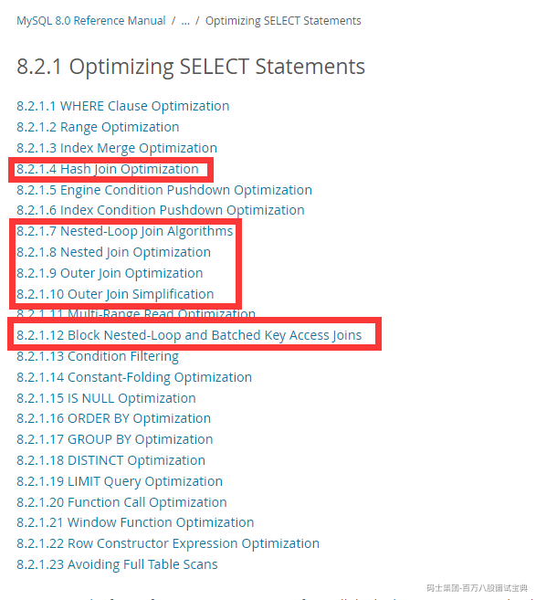
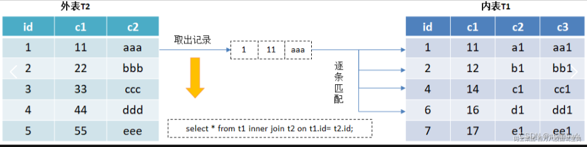
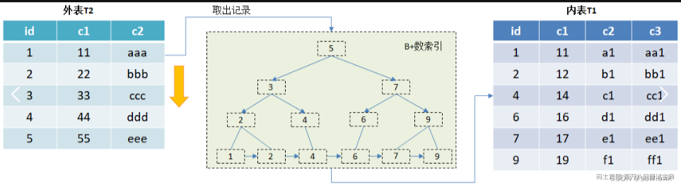
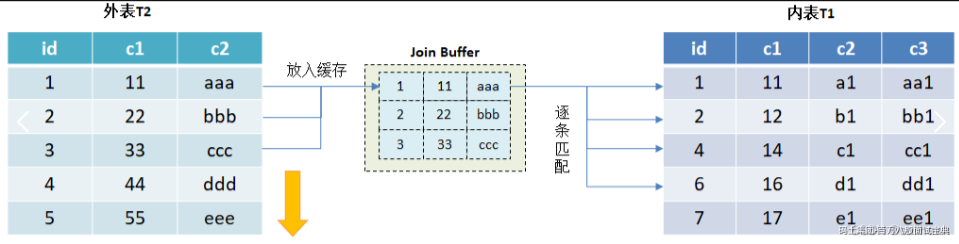
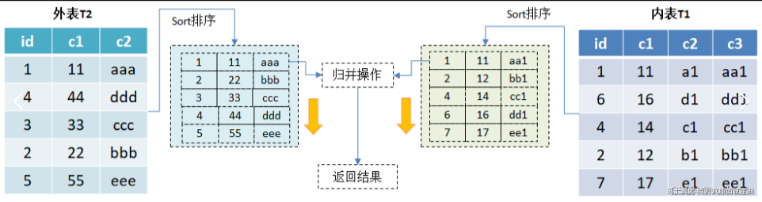
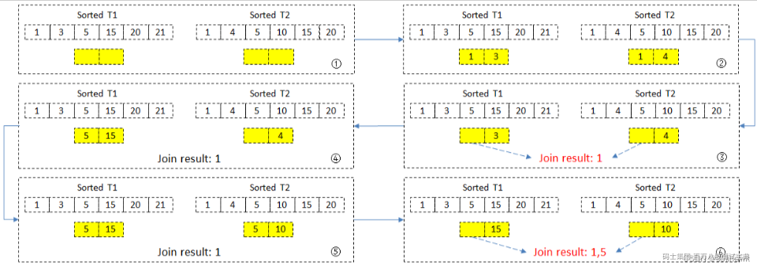
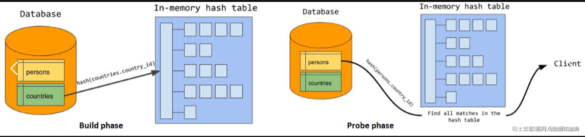
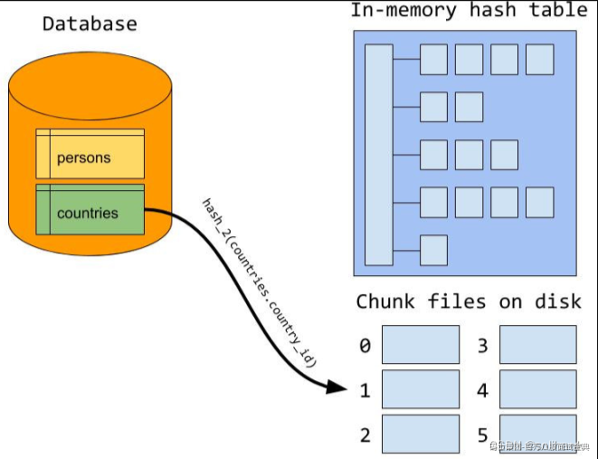
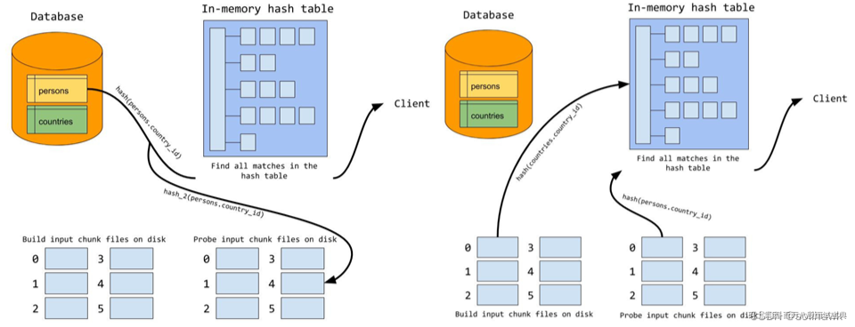
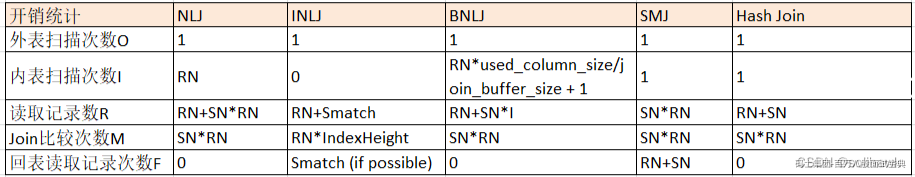

# mysql的join实现原理详解

大家如果想要详细了解mysql的join操作，可以去官方网站中查找对应的内容，具体的地址如下：

<https://dev.mysql.com/doc/refman/8.0/en/select-optimization.html>

打开上面的地址之后，大家可以阅读下图中框起来部分的内容：

为了让大家更好的了解mysql中join的实现原理，现在将每一种实现方式都详细讲解下，此文章中讲解的内容大家可以参考以下地址：<https://blog.csdn.net/solihawk/article/details/133866087>

mysql在多表查询的时候，可以使用多种join算法，比如 Nested Loop Join（嵌套循环连接）、Index Nested-Loop Join（索引嵌套循环连接）、Block Nested-Loop Join（块嵌套循环连接）、Sort-Merge Join（排序合并连接）和Hash Join（哈希连接）。

在MySQL 5.5版本之前，只支持一种关联算法Nested Loop Join，在5.5版本后通过引入Index Nested-Loop Join和Block Nested-Loop Join算法来优化嵌套查询。从MySQL 8.0.18开始，MySQL实现了对于相等条件下的Hash Join，并且join条件中无法使用任何索引。相对于Blocked Nested Loop算法，hash join性能更高，并且两者的使用场景相同，所以从8.0.20开始，Blocked Nested Loop算法已经被移除，使用hash join替代之。

### 1、Nested Loop Join

Nested Loop Join（NLJ）本质上是一个双层for循环，对于外表中的每一行数据，MySQL检查内表中是否满足JOIN条件。如果满足，则将其添加到结果集中。Nested Loop Join的执行流程如下图所示：

1、SQL从外表T2中读取一行记录，取出关联字段id到内表T1中逐条查找； 2、取出T1表中满足条件的记录与T2表中获取的结果进行合并，并将结果放入结果集中； 3、循环上述过程直到无法满足条件，将结果返回给客户端。 Nested Loop Join伪代码实现如下：

for each row in t1 matching range {

for each row in t2 matching reference key {

if(t1.id==t2.id) {

//返回结果

}

}

}

Nested Loop Join算法在处理小数据集时可能非常有效，但是对于大型数据集，可能会导致性能下降。通过双层循环来进行比较值获取结果，就是对外表和内表进行笛卡尔积运算，比如t1和t2表的数据量分别为R和S，运算的成本为O(R\*S)，当表数据量大时候，执行效率会非常低。

### 2、Index Nested-Loop Join

Index Nested-Loop Join（INLJ）是Nested-Loop Join的改进版，其优化思路是通过索引访问减少内层循环的匹配次数，也就是通过外层数据与内存的索引数据进行循环匹配，以减少数据访问提高查询效率。INLJ执行过程如下所示：

1、SQL从外表T2中读取一行记录，取出关联字段id到内表T1的索引树中查找； 2、从T1表中取出辅助索引树中满足条件的记录查到主键ID，再到主键索引中根据主键ID将剩下字段的数据取出与T2中获取到的结果进行合并，并将结果放入结果集 3、循环上述过程直到无法满足条件，将结果返回给客户端。

Index Nested-Loop Join被很多人诟病效率不高，主要是因为在Join过程很多时候用到的不是主键的cluster index而是辅助索引。如果关联字段id在T1表的主键索引字段中，则直接通过主键索引获取到数据，索引查找的开销非常小，并且访问模式也是顺序的；如果关联字段在辅助索引字段中，如果查询需要访问聚集索引上的列，那么必要需要进行回表取数据。辅助索引是随机IO访问、再回表查询又是随机IO访问，因此执行效率会降低。

### 3、Block Nested-Loop Join

Block Nested-Loop Join（BNLJ）也是Nested-Loop Join的优化方法，如果Join的关联字段不是索引或者有一个字段不在索引中，则会采用该算法进行查询。在BNLJ算法中增加一个join*buffer缓存块，在Join操作时候会把外表的数据放入缓存块中，然后扫描内表，把内表每一行取出来跟join*buffer中的数据批量做对比。BNLJ执行过程如下所示： 

1、将外表T2中的数据读入到join*buffer中（默认内存大小为256k,如果数据量多,会进行分段存放,然后进行比较） 2、把表T1的每一行数据，跟join*buffer中的数据批量进行对比，匹配的数据与T2表中获取的结果进行合并，并将结果放入结果集中； 3、循环以上步骤直到无法满足条件，将结果集返回给客户端

Block Nested-Loop Join的优化思路是利用join*buffer减少外表的循环次数，通过一次性缓存多条记录数，将参与查询的列放入join*buffer中，然后拿join buffer里的数据批量与内层表的数据进行匹配，从而减少对外表的访问IO次数。在MySQL 8.0.18版本之前，不使用Index Nested-Loop Join的时候，默认使用的是Block Nested-Loop Join。在8.0.20版本以后，MySQL中不再使用Block Nested-Loop Join，由hash join进行替代优化。

Prior to MySQL 8.0.18, this algorithm was applied for equi-joins when no indexes could be used; in MySQL 8.0.18 and later, the hash join optimization is employed in such cases. Starting with MySQL 8.0.20, the block nested loop is no longer used by MySQL, and a hash join is employed for in all cases where the block nested loop was used previously.

使用Block Nested-Loop Join算法需要开启优化器管理配置的optimizer*switch的设置block*nested\_loop为on，默认为开启。

1）查看block*nested*loop配置

mysql> show variables like 'optimizer\_switch'\G

\*\*\*\*\*\*\*\*\*\*\*\*\*\*\*\*\*\*\*\*\*\*\*\*\*\*\* 1. row \*\*\*\*\*\*\*\*\*\*\*\*\*\*\*\*\*\*\*\*\*\*\*\*\*\*\*

Variable\_name: optimizer\_switch

Value: index\_merge=on,index\_merge\_union=on,index\_merge\_sort\_union=on,index\_merge\_intersection=on,engine\_condition\_pushdown=on,index\_condition\_pushdown=on,mrr=on,mrr\_cost\_based=on,block\_nested\_loop=on,batched\_key\_access=off,materialization=on,semijoin=on,loosescan=on,firstmatch=on,duplicateweedout=on,subquery\_materialization\_cost\_based=on,use\_index\_extensions=on,condition\_fanout\_filter=on,derived\_merge=on,use\_invisible\_indexes=off,skip\_scan=on,hash\_join=on,subquery\_to\_derived=off,prefer\_ordering\_index=on,hypergraph\_optimizer=off,derived\_condition\_pushdown=on

2）查看join*buffer*size参数配置

mysql> show variables like 'join\_buffer\_size';

+------------------+--------+

| Variable\_name | Value |

+------------------+--------+

| join\_buffer\_size | 262144 |

+------------------+--------+

Join buffer的大小由参数join*buffer*size控制，默认是256KB，对于一些复杂的SQL语句为了提升性能可以调整该参数值。需要注意的是变量 join*buffer*size 的最大值在MySQL 5.1.22 版本前是4G，而之后的版本才能在64位操作系统下申请大于4G的Join Buffer空间。

在MySQL中Join buffer还有以下特性：

1、Join Buffer的使用条件：Join Buffer只有在join类型为all、index、range的时候才可以使用。也就是join字段没有使用到索引或部分字段不在索引列中会用到。 2、Join Buffer的分配与释放：在join之前就会分配Join Buffer，每个join都会分配一个buffer。在查询执行完毕后就会释放Join Buffer。 3、Join Buffer中保存的数据：Join Buffer中只会保存参与join的列，并非整个数据行。即使通过调整参数使其变大，也并不会加速查询，因为其内部逻辑和数据的排布方式不会因此而改变。

由于每次Join都会分配一个Join Buffer，假设高并发P查询有N张表参与Join，每张表之间使用Block Nested-Loop Join算法，需要分配P\*(N-1)个Join buffer。因此Join Buffer的设置需要考量，设置不当有可能会引起内存分配不足导致数据库宕机。

### 4、Sort-merge Join

Sort-Merge Join算法是MySQL中一种用于执行JOIN操作的算法。其原理是先对两个表根据Join列进行全扫描后排序，然后逐行比较它们以找到匹配的行。执行过程如下所示：

1、对两个表T1和T2进行排序，排序可以通过使用索引或执行额外的排序操作来完成。确保两个表中的数据按照连接键（JOIN条件）进行排序。 2、排序完成后，对两张表逐行进行比较和归并操作，从每个表中选取若港行并检查是否满足Join条件，如果满足Join条件将匹配的行添加到结果集中。 3、继续从每个表中选取下一行，并重复以上步骤直到扫描完所有行。

以上图为例，两个表T1和T2已经排好序进行等值Join连接查询，并假设内存中buffer能容纳2条记录：

1、首先取出T1(1,3)和T2(1,4)进行比较，此时只有(1,1)是匹配的，把记录1放入结果集中 2、再依次取出T1和T2表中的其它值，T1中的(5,15)和T2中的(5,10)，因为是等值Join，T1中的3和T2中的4被舍弃了。此时匹配到(5,5)并将记录5放入结果集中 3、进行新的一轮循环，直到两个表中的记录比对完成

Sort-Merge Join算法在处理大型数据集时可能非常有效，因为它通过排序和逐行比较来减少I/O操作次数。但是需要进行额外的排序操作，可能会增加查询的执行时间，通常情况下CBO模式下优化器不会优先选择该种Join算法。Sort Merge join一般适用于以下场景：

- RBO模式（基于规则的优化方式）
- 不等价关联(>,<,>=,<=,<>)
- HASH*JOIN*ENABLED=false
- 数据源已排序

### 5、Hash Join

MySQL 8.0.18版本开始增加了对Hash Join算法的支持，以提升Join的性能，在8.0.20版本以后，MySQL中不再使用Block Nested-Loop Join，由hash join进行替代优化。在MySQL 8.0.18中hash join的使用前提条件是表与表之间是等值连接并且连接字段上不使用索引，或者是不包含任何连接条件的笛卡尔连接，否则hash join会退化。

为了支持hash join，mysql在优化器optimizer*switch中新增了hash join开关选项hash*join，默认是ON状态。同时新增了两个hint：HASH*JOIN和NO*HASH\_JOIN，用于在SQL级别控制hash join行为。但是从MySQL 8.0.19开始，这两个hint被置为无效，hash join的使用就不受用户控制，由优化器决定。并且在MySQL 8.0.20及更高版本中，取消了对等值条件的约束，可以全面支持non-equi-join，Semijoin，Antijoin，Left outer join/Right outer join。比如非等值join使用hash join算法：

mysql> EXPLAIN FORMAT=TREE SELECT \* FROM t1 JOIN t2 ON t1.c1 < t2.c1\G

\*\*\*\*\*\*\*\*\*\*\*\*\*\*\*\*\*\*\*\*\*\*\*\*\*\*\* 1. row \*\*\*\*\*\*\*\*\*\*\*\*\*\*\*\*\*\*\*\*\*\*\*\*\*\*\*

EXPLAIN: -> Filter: (t1.c1 < t2.c1) (cost=4.70 rows=12)

-> Inner hash join (no condition) (cost=4.70 rows=12)

-> Table scan on t2 (cost=0.08 rows=6)

-> Hash

-> Table scan on t1 (cost=0.85 rows=6)

Hash join的基本原理是通过Hash的方式降低复杂度，MySQL根据连接条件对外表建立Hash表，对于内表的每一行记录也根据连接条件计算Hash值，只需要验证对应的hash值能否匹配完成连接操作。但是如果外表过大或者hash join可使用的内存过小，外表数据不能全部加载到内存中，优化器会把外表切分为不同的partition，使得切分后的分片能够放入内存，不能放入内存的会写入磁盘的chunk files中。

#### 5.1 In-memory Hash-join

外表数据能够全部放入内存中，称为in-memory hash-join，hash join分为两个过程：build过程构建hash表和probe过程探测hash表。

1、Build过程：遍历外表，以连接条件”countries.country*id”为hash key，查询需要的列作为value创建hash表。通常优化器优先选择占用内存最小的表作为外表构建hash表。 2、Probe过程：逐行遍历内表，对于内表的每行记录，根据连接条件”persons.country*id”计算hash值，并在hash表中查找。如果匹配到外表的记录，则输出，否则跳过，直到遍历完成所有内表的记录

上述场景适用于表数据能够存放在内存中的场景，这个内存由参数join*buffer*size控制，并且可以动态调整生效。

#### 5.2 On-disk Hash-join

在build阶段如果内存不够，优化器会将外表分成若干个partition执行，这些partition是保存在磁盘上的chunks。优化器会根据内存的大小计算出合适的chunks数，但是在mysql中chunk file数目硬限制为128个。分片的过程如下图所示：

在build阶段优化器根据hash算法将外表数据存放到磁盘中对应的chunks文件中，在probe阶段对内表数据使用同样的hash算法进行分区并存放在磁盘的chunks文件中。由于使用相同的hash函数，那么key相同（join条件相同）必然在同一个分片编号的chunk文件中。接下来，再对外表和内表中相同分片编号的数据放入到内存中进行Hash Join计算，所有分片计算完成后，整个join过程结束。这种算法的代价是外表和内表在build阶段进行一次读IO和一次写IO，在probe阶段进行了一次读IO。整个过程如下图所示：

上述算法能够解决内存不足的Join问题，但是如果数据倾斜严重导致哈希后的分片仍然超过内存的大小，MySQL优化器的处理方法是：读满内存中的hash表后停止build过程，然后执行一次probe。待处理这批数据后，清空hash表，在上次build停止的位点继续build过程来填充hash表，填充满再做一趟内表分片完整的probe。直到处理完所有build数据。

### 6、不同Join算法的代价对比：

### 7、不同Join的性能测试

#### 7.1、环境准备

mysql> select version();

+-----------+

| version() |

+-----------+

| 8.2.0 |

+-----------+

1 row in set (0.00 sec)

mysql> show variables like 'join\_buffer\_size';

+------------------+--------+

| Variable\_name | Value |

+------------------+--------+

| join\_buffer\_size | 262144 |

+------------------+--------+

1 row in set (0.00 sec)

#### 7.2、准备数据

##创建表

CREATE TABLE `t1` (

`id` int(11) NOT NULL AUTO\_INCREMENT,

`c1` int(11) DEFAULT NULL,

`c2` varchar(300) DEFAULT NULL,

PRIMARY KEY (`id`)

) ENGINE=InnoDB DEFAULT CHARSET=utf8;

mysql> create table t2 like t1;

##插入数据到表中

-- 往t1表插入5万行记录

drop procedure if exists insert\_t1;

delimiter ;;

create procedure insert\_t1()

begin

declare i int;

set i=1;

while(i<=50000)do

INSERT INTO t1 (c1, c2) VALUES (RAND() \* 100000, CONCAT('Record ', i));

set i=i+1;

end while;

end;;

delimiter ;

call insert\_t1();

-- 往t2表插入1000行记录

drop procedure if exists insert\_t2;

delimiter ;;

create procedure insert\_t2()

begin

declare i int;

set i=1;

while(i<=1000)do

INSERT INTO t2 (c1, c2) VALUES (RAND() \* 100, CONCAT('Record ', i));

set i=i+1;

end while;

end;;

delimiter ;

call insert\_t2();

#### 7.3、使用hash Join

mysql> explain format=tree select \* from t1 join t2 on t1.c1=t2.c1\G

\*\*\*\*\*\*\*\*\*\*\*\*\*\*\*\*\*\*\*\*\*\*\*\*\*\*\* 1. row \*\*\*\*\*\*\*\*\*\*\*\*\*\*\*\*\*\*\*\*\*\*\*\*\*\*\*

EXPLAIN: -> Inner hash join (t1.c1 = t2.c1) (cost=4.97e+6 rows=4.97e+6)

-> Table scan on t1 (cost=0.677 rows=49655)

-> Hash

-> Table scan on t2 (cost=101 rows=1000)

1 row in set (0.00 sec)

#### 7.4、向t1条添加索引，使用nested loop inner join

mysql> create index idx\_c1 on t2(c1);

Query OK, 0 rows affected (0.04 sec)

Records: 0 Duplicates: 0 Warnings: 0

mysql> explain format=tree select \* from t1 join t2 on t1.c1=t2.c1\G

\*\*\*\*\*\*\*\*\*\*\*\*\*\*\*\*\*\*\*\*\*\*\*\*\*\*\* 1. row \*\*\*\*\*\*\*\*\*\*\*\*\*\*\*\*\*\*\*\*\*\*\*\*\*\*\*

EXPLAIN: -> Nested loop inner join (cost=177078 rows=491634)

-> Filter: (t1.c1 is not null) (cost=5006 rows=49655)

-> Table scan on t1 (cost=5006 rows=49655)

-> Index lookup on t2 using idx\_c1 (c1=t1.c1) (cost=2.48 rows=9.9)

1 row in set (0.00 sec)

mysql> alter table t2 drop index idx\_c1;

Query OK, 0 rows affected (0.00 sec)

Records: 0 Duplicates: 0 Warnings: 0

#### 7.5、使用hint(BNL和NO\_BNL)将hash join 启动和关闭

mysql> explain format=tree select /\*+ NO\_BNL(t1,t2)\*/ \* from t1 join t2 on t1.c1=t2.c1\G

\*\*\*\*\*\*\*\*\*\*\*\*\*\*\*\*\*\*\*\*\*\*\*\*\*\*\* 1. row \*\*\*\*\*\*\*\*\*\*\*\*\*\*\*\*\*\*\*\*\*\*\*\*\*\*\*

EXPLAIN: -> Nested loop inner join (cost=5.01e+6 rows=4.97e+6)

-> Table scan on t2 (cost=101 rows=1000)

-> Filter: (t1.c1 = t2.c1) (cost=40.7 rows=4966)

-> Table scan on t1 (cost=40.7 rows=49655)

1 row in set (0.01 sec)

#### 7.6、性能结果展示：

mysql> show profiles;

+----------+------------+-------------------------------------------------------------+

| Query\_ID | Duration | Query |

+----------+------------+-------------------------------------------------------------+

| 1 | 0.01108950 | select \* from t1 join t2 on t1.c1=t2.c1 |

| 2 | 8.56882675 | select /\*+ NO\_BNL(t1,t2)\*/ \* from t1 join t2 on t1.c1=t2.c1 |

| 3 | 0.01672450 | create index idx\_c1 on t2(c1) |

| 4 | 0.06333300 | select \* from t1 join t2 on t1.c1=t2.c1 |

| 5 | 0.00513800 | alter table t2 drop index idx\_c1 |

| 6 | 0.09669925 | create index idx\_c2 on t1(c1) |

| 7 | 0.00269850 | select \* from t1 join t2 on t1.c1=t2.c1 |

| 8 | 0.01492200 | create index idx\_c1 on t2(c1) |

| 9 | 0.00305450 | select \* from t1 join t2 on t1.c1=t2.c1 |

+----------+------------+-------------------------------------------------------------+

9 rows in set, 1 warning (0.00 sec)

解释说明：

Query\_ID = 1的查询表示hash join，耗时0.011s

Query\_ID = 2的查询表示nested loop join，耗时8.568s

Query\_ID = 4的查询表示index nested loop join(小表)，耗时0.063s

Query\_ID = 7的查询表示index nested loop join(大表)，耗时0.002s

Query\_ID = 9的查询表示index nested loop join(全部表)，耗时0.003s

通过上述结果可以分析到：使用hash join比普通的nested loop join性能要好很多，而index nested loop join如果索引使用不当或者索引字段过滤系数不高，性能并不能比hash join好。
