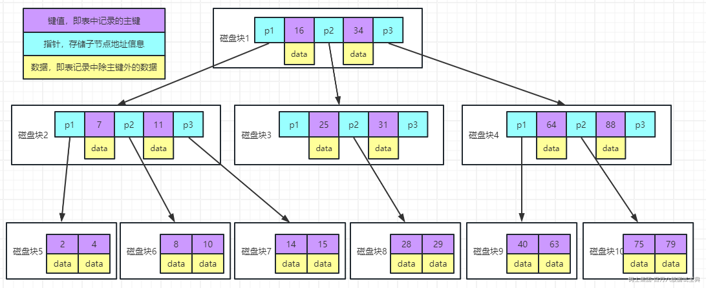
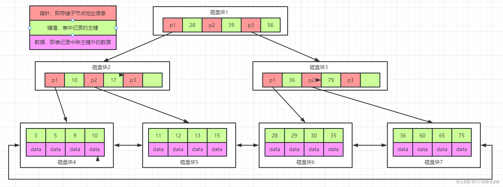
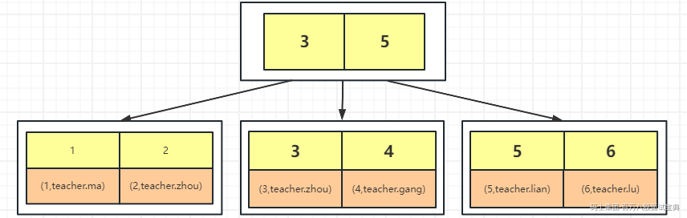
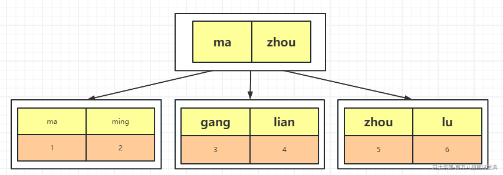

# mysql8索引实现原理及优化

提高select查询性能的最佳方式就是在查询中给表中的一个或者多个列添加索引，以便能够高效的检索到数据。但是要注意的是，并不是给所有的列都添加索引之后，效率就一定会高，多余的索引会浪费mysql确定使用哪些索引的空间和时间，索引还会增加插入、更新、删除的成本，增加索引的维护成本，所以要合理的去添加索引。

索引用于快速查找具有特定列值的行。如果没有索引，MySQL必须从第一行开始，然后遍历整个表以找到相关的行。表越大，成本就越高。如果表中有相关列的索引，MySQL可以快速确定数据在数据文件中的位置，而不必查看所有数据。这比按顺序读取每一行要快得多。

## 1、索引的用处

1、快速找到匹配where子句的行记录

2、如果需要再多个索引中进行选择，mysql通常使用找到行数最少的索引

3、如果表具有多列索引，那么优化器可以使用索引的最左边的任何前缀来查找行

4、在执行连接时从其他表检索行。如果将列声明为相同的类型和大小，那么可以更加有效的利用列上的索引

5、查找特定索引列的min或者max值。此操作通过预处理器来进行优化，该预处理器会在使用索引列上的值之前判断where条件上是否包含常量值，如果有，就会用常量替换它，官网的案例描述如下所示：

SELECT MIN(key\_part2),MAX(key\_part2) FROM tbl\_name WHERE key\_part1=10;

此语句表达的意思是假设某个表上有key*part1和key*part2的联合索引，那么这个查询很快，因为B+树本身的叶子节点的数据是有序的，那么可以根据where条件的key\_part1=10这个条件快速的进行等值命中，那么可以直接从命中的结果集中获取到最大值或者最小值。

6、使用order by或者group by的时候，注意组合索引的最左匹配原则和倒序操作

7、在某些情况下，可以对查询进行优化，不需要检索整行的数据（索引覆盖）

## 2、索引的匹配方式

执行如下SQL语句，创建对应的表：

create table staffs(

id int primary key auto\_increment,

name varchar(24) not null default '' comment '姓名',

age int not null default 0 comment '年龄',

pos varchar(20) not null default '' comment '职位',

add\_time timestamp not null default current\_timestamp comment '入职时间'

) charset utf8 comment '员工记录表';

alter table staffs add index idx\_nap(name, age, pos);

1、全值匹配：跟索引中的所有列进行匹配

mysql> explain select \* from staffs where name = 'July' and age = '23' and pos = 'dev'\G

\*\*\*\*\*\*\*\*\*\*\*\*\*\*\*\*\*\*\*\*\*\*\*\*\*\*\* 1. row \*\*\*\*\*\*\*\*\*\*\*\*\*\*\*\*\*\*\*\*\*\*\*\*\*\*\*

id: 1

select\_type: SIMPLE

table: staffs

partitions: NULL

type: ref

possible\_keys: idx\_nap

key: idx\_nap

key\_len: 140

ref: const,const,const

rows: 1

filtered: 100.00

Extra: NULL

1 row in set, 1 warning (0.00 sec)

2、匹配最左前缀：按照顺序匹配组合索引的左边列

mysql> explain select \* from staffs where name = 'July' and age = '23'\G

\*\*\*\*\*\*\*\*\*\*\*\*\*\*\*\*\*\*\*\*\*\*\*\*\*\*\* 1. row \*\*\*\*\*\*\*\*\*\*\*\*\*\*\*\*\*\*\*\*\*\*\*\*\*\*\*

id: 1

select\_type: SIMPLE

table: staffs

partitions: NULL

type: ref

possible\_keys: idx\_nap

key: idx\_nap

key\_len: 78

ref: const,const

rows: 1

filtered: 100.00

Extra: NULL

1 row in set, 1 warning (0.00 sec)

3、匹配列前缀：匹配某一列的前缀部分

mysql> explain select \* from staffs where name like 'J%'\G

\*\*\*\*\*\*\*\*\*\*\*\*\*\*\*\*\*\*\*\*\*\*\*\*\*\*\* 1. row \*\*\*\*\*\*\*\*\*\*\*\*\*\*\*\*\*\*\*\*\*\*\*\*\*\*\*

id: 1

select\_type: SIMPLE

table: staffs

partitions: NULL

type: range

possible\_keys: idx\_nap

key: idx\_nap

key\_len: 74

ref: NULL

rows: 1

filtered: 100.00

Extra: Using index condition

1 row in set, 1 warning (0.00 sec)

mysql> explain select \* from staffs where name like '%y'\G

\*\*\*\*\*\*\*\*\*\*\*\*\*\*\*\*\*\*\*\*\*\*\*\*\*\*\* 1. row \*\*\*\*\*\*\*\*\*\*\*\*\*\*\*\*\*\*\*\*\*\*\*\*\*\*\*

id: 1

select\_type: SIMPLE

table: staffs

partitions: NULL

type: ALL

possible\_keys: NULL

key: NULL

key\_len: NULL

ref: NULL

rows: 1

filtered: 100.00

Extra: Using where

1 row in set, 1 warning (0.00 sec)

4、匹配范围值：可以查找某一个范围的数据

mysql> explain select \* from staffs where name > 'Mary'\G

\*\*\*\*\*\*\*\*\*\*\*\*\*\*\*\*\*\*\*\*\*\*\*\*\*\*\* 1. row \*\*\*\*\*\*\*\*\*\*\*\*\*\*\*\*\*\*\*\*\*\*\*\*\*\*\*

id: 1

select\_type: SIMPLE

table: staffs

partitions: NULL

type: range

possible\_keys: idx\_nap

key: idx\_nap

key\_len: 74

ref: NULL

rows: 1

filtered: 100.00

Extra: Using index condition

1 row in set, 1 warning (0.00 sec)

5、精确匹配某一列并范围匹配另外一列：可以查询第一列的全部和第二列的部分

mysql> explain select \* from staffs where name = 'July' and age > 25\G

\*\*\*\*\*\*\*\*\*\*\*\*\*\*\*\*\*\*\*\*\*\*\*\*\*\*\* 1. row \*\*\*\*\*\*\*\*\*\*\*\*\*\*\*\*\*\*\*\*\*\*\*\*\*\*\*

id: 1

select\_type: SIMPLE

table: staffs

partitions: NULL

type: range

possible\_keys: idx\_nap

key: idx\_nap

key\_len: 78

ref: NULL

rows: 1

filtered: 100.00

Extra: Using index condition

1 row in set, 1 warning (0.00 sec)

6、只访问索引的查询：查询的时候只需要访问索引，不需要访问数据行

mysql> explain select name,age,pos from staffs where name = 'July' and age = 25 and pos = 'dev'\G

\*\*\*\*\*\*\*\*\*\*\*\*\*\*\*\*\*\*\*\*\*\*\*\*\*\*\* 1. row \*\*\*\*\*\*\*\*\*\*\*\*\*\*\*\*\*\*\*\*\*\*\*\*\*\*\*

id: 1

select\_type: SIMPLE

table: staffs

partitions: NULL

type: ref

possible\_keys: idx\_nap

key: idx\_nap

key\_len: 140

ref: const,const,const

rows: 1

filtered: 100.00

Extra: Using index

1 row in set, 1 warning (0.00 sec)

## 3、索引的实现原理

很多同学在回答索引实现原理的时候基本都会聊一下B+树的实现方式，树的高度变低，减少io次数等相关的内容，这种回答方式不能说错，但是不够完整，希望大家在聊索引的时候最好能够体系性的讲解。从io、操作系统、数据结构的选择、B+树的优势等方面详细的进行表述，让面试官感受到对于mysql索引系统的理解深度。

下面给大家整理一些索引实现原理的关键点，在进行描述的时候可以参考这些内容：

1、mysql的索引文件和数据文件都存储在磁盘中，我们在进行数据操作的时候必须要把磁盘中的数据加载到内存中，这个过程必然涉及到io的问题，io本质上是硬件层面的问题，比如将机械硬盘换成固态硬盘，但是在公司的生产环境中，除非公司疯了，一般情况下是肯定不会把机械硬盘全部换成固态硬盘的，而且现在很多公司用的是云厂商提供的服务器实例，自己也没有更换的权利，所以我们就需要在进行软件设计的时候尽可能的去提高io的效率，主要的方式就是减少io量和减少io次数，这个会作为我们索引设计的原则。

tips:

内存的读写速度比SSD快10-1000倍，机械硬盘比内存慢10w倍左右

2、mysql的索引数据和真实的行记录都保存在磁盘中，如果表比较小，我们可以一次性将所有的数据加载到内存中，但是当表特别大的时候，是没有办法一次性加载所有的数据的，因此，我们需要考虑使用分治的设计思想，将数据进行分块读取，那么块的大小应该如何确定呢？此时需要考虑操作系统中的一些原理：

局部性原理：

程序的局部性原理是指程序在执行时呈现出局部性规律，即在一段时间内，整个程序的执行仅限于程序中的某一部分。相应地，执行所访问的存储空间也局限于某个内存区域。局部性原理又表现为：时间局部性和空间局部性。

时间局部性是指如果程序中的某条指令一旦执行，则不久之后该指令可能再次被执行；如果某数据被访问，则不久之后该数据可能再次被访问。

空间局部性是指一旦程序访问了某个存储单元，则不久之后，其附近的存储单元也将被访问。

磁盘预读：

磁盘预读是一种优化技术，用于提高磁盘I/O性能。由于磁盘的读写速度远低于CPU和内存，因此对于大量数据的处理，磁盘I/O成为了性能瓶颈。为了解决这个问题，磁盘预读被引入，通过预测程序将要访问的数据，提前将数据从磁盘读取到内存中，减少磁盘I/O次数，提高程序的执行效率。

内存跟磁盘在进行数据交换的时候是以页为单位的，也叫做datapage，页的大小跟操作系统相关，一般是4KB或者8KB，我们在进行数据读取的时候可以读取页的整数倍。

根据上面操作系统中的一些基础概念，我们可以以页为块的大小来进行数据的读取，比如可以一次性读取4KB，8KB或者其他4KB整数倍的数据，这个可以自行选择，比如在innodb存储引擎中，我们进行数据读取的时候每次读取16KB的数据

3、当数据块的大小确定好之后，下面就要考虑每个数据块存储的数据格式了。我们在进行索引查询的时候一般会执行这样的语句：

select \* from table where index\_column = val1;

也就是说在进行数据检索的时候，是根据某一个或者几个key值去检索整行记录的，那么我们可以将数据格式设置为K-V格式的数据，那么K很明显就是索引对应的列的值，V代表的是整行的记录，这样的话可以方便我们进行快速的数据读取操作。

大家在面试的时候可以按照上述的方式直接描述K、V分别存储什么类型的数据，但是在进行索引设计的时候，大家还是要多一些思考的：

mysql的数据文件都是存储在磁盘中，如果我们想要获取到某个文件的某一部分数据的话，应该先获取文件的名称，然后对应的数据在这个文件中的偏移量，最后是数据的长度，也就是说V的值应该（filename，offset，length），那么此时细心的同学应该发现了，如果V的值定义成这样的格式，那么在读取数据的时候还需要打开原始的数据文件，也就是说在读取数据的时候，需要先根据K值，找到对应的V值，然后根据V值再去对应的数据文件中读取到要查询的全量数据结果，一个文件是一次IO的话，那么这个过程至少要两次IO，这个违反了我们之前提高IO效率的原则，所以在进行数据组织的时候应该直接将V值设置为行记录，可以减少IO的次数，可以直接根据K值读取到行记录

4、现在分块读取以及数据格式都准备好了，现在要开始考虑使用什么数据结构在存储数据了。支持K-V格式数据存储的数据结构有很多，比如哈希表，各种树等，但是所有人都知道mysql最终选择了B+树，原因是什么呢？下面开始进行各种数据结构的对比和选择：

**哈希表**

1、哈希表的本质是散列表，那么数据在进行存储的时候可能会导致分布不均匀，那么在访问某些数据的时候可能会导致性能非常差

2、哈希冲突问题，尽管设计好的哈希算法可以减少哈希冲突，但是哈希冲突不可能不存在，当存在大量的数据插入和删除的时候，可能会导致哈希冲突的增加，影响性能

3、哈希表是无序表，所以当需要进行范围查询的时候，只能挨个进行对比，效率比较低

此处需要注意：

mysql的innodb存储引擎虽然没有使用哈希表作为索引的数据结构，但是支持自适应hash

mysql的memory存储引擎使用的是哈希索引

**二叉树、BST，AVL，红黑树**

上述所展示的这些树都有一个共同的特性，每个节点至多只有两个分支，也就是说，当存储的数据变多的话，会导致树的高度变高，每一层都是一次IO操作，那么树的高度变高之后会导致IO次数变多，影响查询性能。

**B-树**

经过上述的分析发现，上述这些树的子节点至多只有两个是导致树的高度变高的主要原因，因此要将树的子节点变多，也就是变成多叉树，所以我们可以选择B-树来进行索引的存储。

在选择B-树作为数据结构的时候要注意，每一个节点中都包含了key值和Data值，为了找到下一个磁盘块，还应该包含指针的信息，如下图所示：

上述图说明：

每个节点占用一个磁盘块，一个节点上有两个升序排序的关键字和三个指向子树根节点的指针，指针存储的是子节点所在磁盘块的地址。两个关键词划分成的三个范围域对应三个指针指向的子树的数据的范围域。以根节点为例，关键字为 16 和 34，P1 指针指向的子树的数据范围为小于 16，P2 指针指向的子树的数据范围为 16~34，P3 指针指向的子树的数据范围为大于 34。

查找关键字过程：

1、根据根节点找到磁盘块 1，读入内存。【磁盘 I/O 操作第 1 次】

2、比较关键字 28 在区间（16,34），找到磁盘块 1 的指针 P2。

3、根据 P2 指针找到磁盘块 3，读入内存。【磁盘 I/O 操作第 2 次】

4、比较关键字 28 在区间（25,31），找到磁盘块 3 的指针 P2。

5、根据 P2 指针找到磁盘块 8，读入内存。【磁盘 I/O 操作第 3 次】

6、在磁盘块 8 中的关键字列表中找到关键字 28。

缺点：

1、每个节点都有key，同时也包含data，而每个页存储空间是有限的，如果data比较大的话会导致每个节点存储的key数量变小

2、当存储的数据量很大的时候会导致深度较大，增大查询时磁盘io次数，进而影响查询性能

为了方便大家的理解，我们可以预估下3层的B-树可以存储多少数据：

为了方便计算，我们假设一个data占用的空间是1KB，

1、每一个节点至多可以保存15条记录，因为key值和指针也会占用空间

2、第二层的节点个数是由第一层来决定的，因为至多可以存储15条记录，所以第二层的子节点一共有16个，每个节点可以存储15条记录，所以第二层可以保存240条记录

3、第三层的节点个数是由第二层来决定的，而第二层有16个节点，每个节点又可以由16个子节点，所以第三层的子节点个数为16x16=256个节点，每个节点保存15条记录，所以第二层可以保存3840条记录

4、将三层保存的所有数据加起来之后，总数据数为15+240+3840=4095

根据上述计算之后发现3层的B-树存满的话，只能存储4095条记录，如果想要存储更多的数据的话，只能再次增加树的高度，但是这样的话又会违反提高IO效率的原则，因此需要考虑，如何在3层的树高的情况下存储更多的数据？

**B+树**

根据上述情况的分析，发现存储数据量比较小的原因是data占用的大量的空间，因此我们可以选择B+树来进行数据存储，在B+树中，只有叶子节点存储数据，非叶子节点中存储key值和指针，如下图所示：

我们可以按照上述的方式预估下3层的B+树存满的情况下，可以存储多少数据？

为了方便计算，我们假设一个data占用的空间是1KB，

1、在第一层中没有保存实际的数据，只是存储key值和指针，那么假设key值加上指针占用10个字节，那么意味着第二层可以有16x1024/10=1638个子节点

2、在第二层中依然没有保存实际的数据，只是存储key值和指针，那么第二层一共有1638个节点，同时每一个节点依然有16x1024/10=1638个子节点，

3、经过上述计算之后，第三层一共有1638x1638=2683044个节点，每个节点可以存储16条记录，所以总记录数为1638x1638x16=42928704

经过上述的对比之后发现，使用B+树和使用B-树在相同的层高的情况下，保存的数据量不是一个量级，这也是为什么mysql要选择B+树作为索引数据结构的原因。

**根据上述的分析之后，我们可以得到以下结论：**

**1、一般3-4层的B+树足以支撑千万级别的数据量存储**

为什么是3-4层？因为在上述计算公式时，我们假设key+指针的长度是10个字节，那么如果假设长度是100呢，只能存储163x163x16=425104条记录

**2、在选择索引列的时候，key值占用的空间越小越好**

为什么key值越小越好？因为在计算总记录数的时候，key+指针的长度有很多的影响，当key越小的时候，就可以存储更多的数据

**3、在满足业务系统的情况下，主键尽可能自增**

为什么要自增？因为自增的话，数据在插入的时候只会向后插入，不会影响前面的节点信息，而如果不自增的话，有可能会产生页分裂，导致索引的维护成本增加

## 4、聚簇索引和非聚簇索引

在面试或者工作中，大家经常会遇到聚簇索引和非聚簇索引的问题，很多同学傻傻分不清楚，其实非常简单，我们通过几个问题来了解这个点：

**1、一张表中可以由多少个索引**

理论上来说是没有限制的，主要跟列的个数相关，但是在mysql的官网中有这样的描述：

所有的存储引擎每个表至少支持16个索引

**2、一个索引对应一棵树，还是多个索引对应一棵树**

每个索引对应一棵树

**3、根据上述的分析，我们发现索引的叶子节点存储实际的数据，那么当表中包含多个索引的时候，数据存储几份**

数据只存储一份

**4、如果只存储一份的话，那么其他索引的叶子节点存储什么数据？**

官网上的描述是primary key，但是不能直接翻译成主键，应该表示的是聚簇索引的值

innodb存储引擎在进行数据插入的时候，数据必须跟某一个索引列绑定在一起，如果有主键，那么选择主键，如果没有主键，那么选择唯一键（如果存在多个唯一键，那么按照定义的顺序选择），如果没有唯一键，那么系统会自动生成一个6字节的rowid来进行数据绑定，所以

聚簇索引：跟数据绑定在一起的索引称之为聚簇索引

非聚簇索引：没有跟数据绑定在一起的索引称之为非聚簇索引

假设一张表有id，name两列，id是主键，name是普通索引，那么索引图如下所示：

聚簇索引

非聚簇索引

## 5、索引的几种特殊查找方式

### **1、回表**

回表是指在执行查询时，需要通过索引查找数据行的位置，然后再回到原始表中获取完整的数据行

假设有一张表，表中有以下字段：id，name，age，gender，address

id是主键，name是普通索引

Select \* from table where name = 'zhangsan';

查找过程如下：首先根据name的值去name的B+树中检索记录，找到匹配的记录之后可以取出id值，然后再根据id的值去id的B+树上检索整行记录，这个过程就是回表

回表会增加额外的IO操作，导致查询性能变低，所以在查询中应该尽量减少回表的操作

### 2、索引覆盖

索引覆盖是指一个索引包含了查询所需要的所有数据，从而在查询中无需回表从原表中获取数据

假设有一张表，表中有以下字段：id，name，age，gender，address

id是主键，name是普通索引

Select id,name from table where name = 'zhangsan';

查找过程如下：在name的索引树上包含了要查询的所有字段，所以直接通过name字段去name的B+树上检索对应的记录即可，不需要找到id之后再去id的B+树上检索数据

索引覆盖可以提高查询的性能，所以在生产环境做SQL优化的时候，可以考虑索引覆盖

### 3、最左匹配原则

最左匹配原则主要适用于组合索引，指的是多个列值进行匹配的时候要严格遵循从左到右的顺序，否则会导致索引失效

假设有一张表，表中有以下字段：id，name，age，gender，address

id是主键，(name,age)是组合索引

1、Select \* from table where name = 'zhangsan' and age = 10;

2、Select \* from table where name = 'zhangsan';

3、Select \* from table where age = 10;

4、Select \* from table where age = 10 and name = 'zhangsan';

上述的四条语句中，1,2,4都可以用到组合索引，3用不到，但是很多同学会有疑问，为什么第四条会用到，明明不符合最左匹配原则的顺序，这里需要注意，如果把第四条SQL语句的条件换一下顺序，会影响最终的查询结果吗？答案是不会的，所以mysql中的优化器会进行优化，调整条件的顺序

### 4、索引下推

ICP是针对mysql使用索引从表中检索行的情况进行优化，如果没有ICP，那么存储引擎会根据索引来定位到记录，然后将结果返回给mysql的server，然后在server上对where条件进行筛选。在启用ICP之后，如果where条件的一部分可以通过使用索引中的列来求值，那么mysql会把这部分的where条件筛选下推到存储引擎中。

使用索引下推的时候会有以下的条件：

1、当需要访问完整的行记录时，ICP用于range、ref、eq*ref和ref*or\_null访问方法

2、ICP可以用于innodb和myisam表，包括分区的innodb表和myisam表

3、对于innodb表，ICP仅用于二级索引。ICP的目标是减少整行读取的次数，从而减少IO操作

4、在虚拟列上创建的二级索引不支持ICP

5、引用子查询的条件不能下推

6、引用存储函数的条件不能下推

7、触发器条件不能下推

8、不能将条件下推到包含对系统变量引用的派生表中

假设有一张表，表中有以下字段：id，name，age，gender，address

id是主键，(name,age)是组合索引

Select \* from table where name = 'zhangsan' and age = 10;

没有索引下推：mysql执行这条SQL语句的时候，会首先根据name的值去存储引擎中拉取数据，然后将数据返回到mysql server，然后在server层对age进行条件过滤，把符合条件的结果返回给客户端

有索引下推：mysql执行这条SQL语句的时候，会直接根据name和age的值去存储引擎中拉取数据，而无需在server层对数据进行条件过滤

所谓的下推指的是将条件的筛选从server层下推到存储引擎层

可以通过optizizer*switch中的index*condition\_pushdown条件来是否开启，默认是开启的

SET optimizer\_switch = 'index\_condition\_pushdown=off';

SET optimizer\_switch = 'index\_condition\_pushdown=on';

## 6、哈希索引

哈希索引是一种基于哈希表的索引结构，主要用于快速查找。在哈希索引中，通过哈希函数将键值转化为哈希码，然后在哈希表中查找对应的值。由于哈希索引可以直接通过键值快速定位到数据，因此在大量数据的查找操作中，哈希索引的查询性能优于其他索引。

在mysql中只有memory存储引擎支持哈希索引

哈希索引有以下限制：

1、 哈希索引的查询性能高度依赖于哈希函数的设计，如果哈希函数无法将数据均匀地分布在哈希表中，那么查询性能会受到影响

2、 哈希索引不支持范围查询和排序操作，因为哈希索引只能定位到具体的键值，而无法定位到某个范围内的键值

3、 哈希索引也不支持部分匹配查询，即无法通过部分键值匹配查询到相应的数据

## 7、Adaptive Hash Index(自适应hash)

自适应哈希能够让Innodb在不牺牲事务特性和可靠性的情况下，在工作负载和缓冲池有足够内存的系统上看起来更像是一个内存数据库，可以通过innodb*adaptive*hash\_index变量来控制是否开启。

在Innodb存储引擎中，内部会自己去监控索引表，如果监控到某个索引经常使用，那么就认为是热数据，然后内部自己创建一个hash索引，称之为自适应哈希索引( Adaptive Hash Index,AHI)，创建以后，如果下次又查询到这个索引，那么直接通过hash算法推导出记录的地址，直接一次就能查到数据，比重复去B+tree索引中查询三四次节点的效率高了不少。

InnoDB存储引擎使用的哈希函数采用除法散列方式，其冲突机制采用链表方式。注意，对于自适应哈希索引仅是数据库自身创建并使用的，我们并不能对其进行干预。

## 8、索引优化

### 1、主键优化

表的主键表示在最重要的查询中使用的列或者列的集合，它有一个关联索引，用于快速查找数据。查询性能受益于NOT NULL的优化，因为它不能包含任何的NULL值。使用Innodb存储引擎，表数据被物理组织起来，可以根据主键做超快速的查找和排序。

如果你的表很大同时很重要，但是没有明显的列或者列的集合做主键，那么可以创建一个带有自动增量值的单独列作为主键。当使用外键连接表时，这些唯一ID可以作为指向其他表中相应行的指针。

### 2、外键优化

如果一个表有许多列，并且要查询很多不同的列组合，那么将不经常使用的数据分成单独的表，每个表有几列，并通过复制主表中的数字ID将它们关联回主表可能是有效的。这样，每个小表都可以有一个主键，用于快速查找数据，并且可以使用连接操作查询所需的列集。根据数据的分布方式，查询可能执行更少的IO并占用很少的缓存内存，因为相关的列被聚集存储在磁盘上（为了使性能最大化，查询尝试从磁盘读取尽可能少的数据块，只有几列的表可以在每个数据块容纳更多的行）。

### 3、索引前缀

使用字符串列的索引规范中的col\_name(N)语法，可以创建一个仅使用该列的前N个字符的索引。以索引列值的前缀的方式创建索引可以让索引文件小得多。在索引BLOB或者TEXT列上，必须为索引指定前缀长度。

使用索引前缀可以减少索引的大小，这有助于提高插入、更新和删除操作的性能，因为数据库可以更快的找到和更新索引条目，但是索引前缀也会有一些限制和潜在的问题，比如索引前缀可能会使索引变得不再唯一，因此，使用索引前缀的关键在于要选择足够长的前缀来保证较高的选择性，同时又不能太长。

这个可以通过索引的选择性来进行筛选，索引的选择性表示不重复的索引值和数据表记录总数的比值，索引的选择性越高，则查询的效率越高。

--从mysql的官网中下载skila数据库，这个数据库中有一个叫做city的数据表

--创建数据表

create table citydemo(city varchar(50) not null);

insert into citydemo(city) select city from city;

--重复执行5次下面的sql语句

insert into citydemo(city) select city from citydemo;

--更新城市表的名称

update citydemo set city=(select city from city order by rand() limit 1);

--查找最常见的城市列表，发现每个值都出现45-65次，

select count(\*) as cnt,city from citydemo group by city order by cnt desc limit 10;

--查找最频繁出现的城市前缀，先从3个前缀字母开始，发现比原来出现的次数更多，可以分别截取多个字符查看城市出现的次数

select count(\*) as cnt,left(city,3) as pref from citydemo group by pref order by cnt desc limit 10;

select count(\*) as cnt,left(city,7) as pref from citydemo group by pref order by cnt desc limit 10;

--此时前缀的选择性接近于完整列的选择性

--还可以通过另外一种方式来计算完整列的选择性，可以看到当前缀长度到达7之后，再增加前缀长度，选择性提升的幅度已经很小了

select count(distinct left(city,3))/count(\*) as sel3,

count(distinct left(city,4))/count(\*) as sel4,

count(distinct left(city,5))/count(\*) as sel5,

count(distinct left(city,6))/count(\*) as sel6,

count(distinct left(city,7))/count(\*) as sel7,

count(distinct left(city,8))/count(\*) as sel8

from citydemo;

--计算完成之后可以创建前缀索引

alter table citydemo add key(city(7));

--注意：前缀索引是一种能使索引更小更快的有效方法，但是也包含缺点：mysql无法使用前缀索引做order by 和 group by。

### 4、通过执行计划优化SQL语句

通过执行计划可以判断查询中是否用到了索引，以便进行SQL优化。

explain语句提供了mysql如何执行语句的信息，explain可以跟select、delete、insert、replace、update语句一起工作

#### id

select查询的序列号，包含一组数字，表示查询中执行select子句或者操作表的顺序

id号分为三种情况：

1、如果id相同，那么执行顺序从上到下

explain select \* from emp e join dept d on e.deptno = d.deptno join salgrade sg on e.sal between sg.losal and sg.hisal;

2、如果id不同，如果是子查询，id的序号会递增，id值越大优先级越高，越先被执行

explain select \* from emp where ename not in (select ename from emp where ename like '%S%') ;

3、id相同和不同的，同时存在：相同的可以认为是一组，从上往下顺序执行，在所有组中，id值越大，优先级越高，越先执行

explain Select dept.\*,person\_num,avg\_sal from dept,(select count(\*) person\_num,avg(sal) avg\_sal,deptno from emp group by deptno) t where dept.deptno = t.deptno ;

#### **select\_type**

主要用来分辨查询的类型，是普通查询还是联合查询还是子查询

--simple:简单的查询，不包含子查询和union

explain select \* from emp;

--primary:查询中最外层的查询，如果查询中有子查询，则最外层的查询被标记为primary

explain select \* from emp where ename not in (select ename from emp where ename like '%S%') ;

--union:若第二个select出现在union之后，则被标记为union

explain select \* from emp where deptno = 10 union select \* from emp where sal >2000;

--dependent union:跟union类似，此处的depentent表示union或union all联合而成的结果会受外部表影响

explain select \* from emp e where e.empno in ( select empno from emp where deptno = 10 union select empno from emp where sal >2000)

--union result:表示一个union的结果集作为一个单独的表返回，这通常发生在union操作之后，并且可能跟其他表进行join操作

explain select \* from emp where deptno = 10 union select \* from emp where sal >2000;

--subquery:在查询中作为另一个查询的子查询的查询，例如，在 `SELECT ... WHERE column IN (SELECT ...)` 结构中的子查询。

explain select \* from emp where sal > (select avg(sal) from emp) ;

--dependent subquery:与subquery类似，但是这个查询依赖于外部查询的某些部分。

explain select e.empno,e.ename,e.sal from emp e where e.sal < (select e2.sal from emp e2 where e2.empno = e.mgr)

--DERIVED: 出现在from子句中的子查询，MySQL会为这个子查询生成一个临时表。这个值表示该查询是为派生表生成的。

explain select t.job from (select min(sal) min\_sal,job from emp group by job) t where t.min\_sal > 2500 ;

--dependent derived：与derived类似，但是这个查询依赖于外部查询的某些部分：未找到案例

--materialized：表示该子查询的结果被物化（即存储在临时表中），以供稍后的join使用，这种类型的子查询在执行时比常规子查询要慢，

EXPLAIN

select \* from emp where deptno in (select deptno from (select min(sal) min\_sal,deptno from emp group by deptno) a where min\_sal < '2000') ;

--UNCACHEABLE SUBQUERY：一个子查询的结果不能被缓存，因此每次都会重新计算：未找到案例

--uncacheable union:一个union的结果不能被缓存，因此每次都会重新计算：未找到案例

#### table

对应行正在访问哪一个表，表名或者别名，可能是临时表或者union合并结果集 1、如果是具体的表名，则表明从实际的物理表中获取数据，当然也可以是表的别名

2、表名是derivedN的形式，表示使用了id为N的查询产生的衍生表

3、当有union result的时候，表名是union n1,n2等的形式，n1,n2表示参与union的id

#### **type**

type显示的是访问类型，访问类型表示我是以何种方式去访问我们的数据，最容易想的是全表扫描，直接暴力的遍历一张表去寻找需要的数据，效率非常低下，访问的类型有很多，效率从最好到最坏依次是：

system > const > eq*ref > ref > fulltext > ref*or*null > index*merge > unique*subquery > index*subquery > range > index > ALL

一般情况下，得保证查询至少达到range级别，最好能达到ref

--all:全表扫描，一般情况下出现这样的sql语句而且数据量比较大的话那么就需要进行优化。

explain select \* from emp;

--index：全索引扫描这个比all的效率要好，主要有两种情况，一种是当前的查询时覆盖索引，即我们需要的数据在索引中就可以索取，或者是使用了索引进行排序，这样就避免数据的重排序

explain select empno from emp;

--range：表示利用索引查询的时候限制了范围，在指定范围内进行查询，这样避免了index的全索引扫描，适用的操作符： =, <>, >, >=, <, <=, IS NULL, BETWEEN, LIKE, or IN()

explain select \* from emp where empno between 7000 and 7500;

--index\_subquery：跟unique\_subquery类型，使用的是辅助索引

SET optimizer\_switch='materialization=off';

EXPLAIN select \* from emp where ename not in (select dname from dept where dname like '%SALES' );

SET optimizer\_switch='materialization=on';

--unique\_subquery:子查询的结果由聚簇索引或者唯一索引覆盖

--dept表的deptno字段有主键

SET optimizer\_switch='materialization=off';

EXPLAIN select \* from emp where deptno not in (select deptno from dept where deptno >20 );

SET optimizer\_switch='materialization=on';

--index\_merge：索引合并，在where条件中使用不同的索引字段

--ename，deptno都创建索引

explain select \* from emp where ename='SMITH' or deptno = 10;

--ref\_or\_null：跟ref类似，在ref的查询基础上，加一个null值的条件查询

explain select \* from emp where ename = 'SMITH' or ename is null;

--ref：使用了非聚集索引进行数据的查找

alter table emp add index idx\_name(ename);

explain select \* from emp where ename = 'SMITH';

--eq\_ref ：使用唯一性索引进行数据查找

explain select \* from emp e,emp e2 where e.empno = e2.empno;

--const：这个表至多有一个匹配行，

explain select \* from emp where empno = 7369;

--system：表只有一行记录（等于系统表），这是const类型的特例，平时不会出现

#### **possible\_keys**

显示可能应用在这张表中的索引，一个或多个，查询涉及到的字段上若存在索引，则该索引将被列出，但不一定被查询实际使用

explain select \* from emp where ename = 'SIMTH' and deptno = 10;

#### **key**

实际使用的索引，如果为null，则没有使用索引，查询中若使用了覆盖索引，则该索引和查询的select字段重叠。

explain select \* from emp where ename = 'SIMTH' and deptno = 10;

#### **key\_len**

表示索引中使用的字节数，可以通过key\_len计算查询中使用的索引长度，在不损失精度的情况下长度越短越好。

explain select \* from emp where ename = 'SIMTH' and deptno = 10;

#### **ref**

显示了那些列或常量被用于查找索引列，这对于非唯一索引查找有效

explain select \* from emp,dept where emp.deptno = dept.deptno and emp.deptno = 10;

#### **rows**

根据表的统计信息及索引使用情况，大致估算出找出所需记录需要读取的行数，此参数很重要，直接反应的sql找了多少数据，在完成目的的情况下越少越好

explain select \* from emp;

#### filtered

表示返回行的预估百分比，它显示了哪些行被过滤掉了，最大的值为100，这意味这没有对行进行筛选，从100开始递减的值表示过滤量在增加，rows表示预估的行数，rows\*filtered表示与下表连接的行数

#### **extra**

提供查询的额外信息

--using filesort:说明mysql无法利用索引进行排序，只能利用排序算法进行排序，会消耗额外的位置

explain select \* from emp order by sal;

--using temporary:建立临时表来保存中间结果，查询完成之后把临时表删除

explain select ename,count(\*) from emp where deptno = 10 group by ename;

--using index:这个表示当前的查询时覆盖索引的，直接从索引中读取数据，而不用访问数据表。如果同时出现using where 表名索引被用来执行索引键值的查找，如果没有，表面索引被用来读取数据，而不是真的查找

explain select deptno,count(\*) from emp group by deptno limit 10;

--using where:通常是进行全表或者全索引扫描后再用where子句完成结果过滤，需要添加索引

explain select \* from emp where job='SMITH';

--using join buffer:使用连接缓存

explain select \* from t3 join t2 on t3.c1 = t2.c1;

--impossible where：where语句的结果总是false

explain select \* from emp where 1=0

### 5、扩展索引的使用

innodb通过附加主键列来自动扩展每个二级索引。

CREATE TABLE t1 (

i1 INT NOT NULL DEFAULT 0,

i2 INT NOT NULL DEFAULT 0,

d DATE DEFAULT NULL,

PRIMARY KEY (i1, i2),

INDEX k\_d (d)

) ENGINE = InnoDB;

在上述表中定义了一个（i1,i2）的主键。它还在列d上定义了一个二级索引k\_d，但在innodb内部扩展了这个索引，并将其视为列（d,i1,i2）。

在确定如何以及是否使用扩展二级索引时，优化器会考虑扩展二级索引的主键列。这可以产生更有效的查询计划和更好的性能。

优化器可以为ref、range和index\_merge索引访问，松散索引扫描访问，连接和排序优化以及min/max优化使用扩展的二级索引。

--向t1表中插入如下数据：

INSERT INTO t1 VALUES

(1, 1, '1998-01-01'), (1, 2, '1999-01-01'),

(1, 3, '2000-01-01'), (1, 4, '2001-01-01'),

(1, 5, '2002-01-01'), (2, 1, '1998-01-01'),

(2, 2, '1999-01-01'), (2, 3, '2000-01-01'),

(2, 4, '2001-01-01'), (2, 5, '2002-01-01'),

(3, 1, '1998-01-01'), (3, 2, '1999-01-01'),

(3, 3, '2000-01-01'), (3, 4, '2001-01-01'),

(3, 5, '2002-01-01'), (4, 1, '1998-01-01'),

(4, 2, '1999-01-01'), (4, 3, '2000-01-01'),

(4, 4, '2001-01-01'), (4, 5, '2002-01-01'),

(5, 1, '1998-01-01'), (5, 2, '1999-01-01'),

(5, 3, '2000-01-01'), (5, 4, '2001-01-01'),

(5, 5, '2002-01-01');

--当优化器不考虑索引扩展时，它把索引k\_d视为d，执行计划如下所示：

mysql> EXPLAIN SELECT COUNT(\*) FROM t1 WHERE i1 = 3 AND d = '2000-01-01'\G

\*\*\*\*\*\*\*\*\*\*\*\*\*\*\*\*\*\*\*\*\*\*\*\*\*\*\* 1. row \*\*\*\*\*\*\*\*\*\*\*\*\*\*\*\*\*\*\*\*\*\*\*\*\*\*\*

id: 1

select\_type: SIMPLE

table: t1

partitions: NULL

type: ref

possible\_keys: PRIMARY,k\_d

key: PRIMARY

key\_len: 4

ref: const

rows: 5

filtered: 20.00

Extra: Using where

1 row in set, 1 warning (0.00 sec)

mysql> SET optimizer\_switch = 'use\_index\_extensions=on';

Query OK, 0 rows affected (0.01 sec)

--当优化器考虑扩展索引时，他会把k\_d做为（d，i1,i2）

mysql> EXPLAIN SELECT COUNT(\*) FROM t1 WHERE i1 = 3 AND d = '2000-01-01'\G

\*\*\*\*\*\*\*\*\*\*\*\*\*\*\*\*\*\*\*\*\*\*\*\*\*\*\* 1. row \*\*\*\*\*\*\*\*\*\*\*\*\*\*\*\*\*\*\*\*\*\*\*\*\*\*\*

id: 1

select\_type: SIMPLE

table: t1

partitions: NULL

type: ref

possible\_keys: PRIMARY,k\_d

key: k\_d

key\_len: 8

ref: const,const

rows: 1

filtered: 100.00

Extra: Using index

1 row in set, 1 warning (0.00 sec)

对于是否使用扩展索引，可以通过如下参数进行设置：

SET optimizer\_switch = 'use\_index\_extensions=off';

### 6、不可见索引、降序索引

这部分内容在之前的mysql8的新特性中已经进行讲解，此处不再赘述。

### 7、索引合并优化

index merge检索具有多个范围扫描的行，并将其结果合并为一个。此操作仅合并单个表中的索引扫描，而不是跨多个表进行扫描，合并可以产生器底层扫描的并集或者交集

SELECT \* FROM tbl\_name WHERE key1 = 10 OR key2 = 20;

SELECT \* FROM tbl\_name

WHERE (key1 = 10 OR key2 = 20) AND non\_key = 30;

SELECT \* FROM t1, t2

WHERE (t1.key1 IN (1,2) OR t1.key2 LIKE 'value%')

AND t2.key1 = t1.some\_col;

SELECT \* FROM t1, t2

WHERE t1.key1 = 1

AND (t2.key1 = t1.some\_col OR t2.key2 = t1.some\_col2);

如果SQL语句的执行触发了index merge操作，那么在执行计划输出的时候会在type列显示index\_merge,同时会在extra字段显示如下字段,表示索引合并使用了什么算法：

- Using intersect(...)
- Using union(...)
- Using sort\_union(...)

1、index merge intersection access algorithm

该算法适用于将一个where子句转换为多个不同键的范围查询，并使用AND进行条件关联,该算法对所有使用到的索引执行同步扫描，并产生这些结果的交集

key\_part1 = const1 AND key\_part2 = const2 ... AND key\_partN = constN

例如：

SELECT \* FROM innodb\_table

WHERE primary\_key < 10 AND key\_col1 = 20;

SELECT \* FROM tbl\_name

WHERE key1\_part1 = 1 AND key1\_part2 = 2 AND key2 = 2;

2、index merge union access algorithm

该算法适用于将一个where子句转换为多个不同键的范围查询，并使用OR进行条件关联,该算法对所有使用到的索引执行同步扫描，并产生这些结果的交集

key\_part1 = const1 OR key\_part2 = const2 ... OR key\_partN = constN

SELECT \* FROM t1

WHERE key1 = 1 OR key2 = 2 OR key3 = 3;

SELECT \* FROM innodb\_table

WHERE (key1 = 1 AND key2 = 2)

OR (key3 = 'foo' AND key4 = 'bar') AND key5 = 5;

### 8、索引优化的经验之谈

#### 1、当使用索引列进行查询的时候，不要使用表达式，使用表达式可能会导致索引失效

--会使用emp上的deptno索引列

mysql> explain select \* from emp where deptno = 10\G

\*\*\*\*\*\*\*\*\*\*\*\*\*\*\*\*\*\*\*\*\*\*\*\*\*\*\* 1. row \*\*\*\*\*\*\*\*\*\*\*\*\*\*\*\*\*\*\*\*\*\*\*\*\*\*\*

id: 1

select\_type: SIMPLE

table: emp

partitions: NULL

type: ref

possible\_keys: idx\_3

key: idx\_3

key\_len: 5

ref: const

rows: 3

filtered: 100.00

Extra: NULL

1 row in set, 1 warning (0.00 sec)

--使用表达式之后会导致索引失效

mysql> explain select \* from emp where deptno + 1 = 11\G

\*\*\*\*\*\*\*\*\*\*\*\*\*\*\*\*\*\*\*\*\*\*\*\*\*\*\* 1. row \*\*\*\*\*\*\*\*\*\*\*\*\*\*\*\*\*\*\*\*\*\*\*\*\*\*\*

id: 1

select\_type: SIMPLE

table: emp

partitions: NULL

type: ALL

possible\_keys: NULL

key: NULL

key\_len: NULL

ref: NULL

rows: 12

filtered: 100.00

Extra: Using where

1 row in set, 1 warning (0.00 sec)

--但是要注意，当使用的索引列是主键的时候，使用表达式也会使用索引

--参考sakila数据库的actor表

mysql> explain select \* from actor where actor\_id = 4\G

\*\*\*\*\*\*\*\*\*\*\*\*\*\*\*\*\*\*\*\*\*\*\*\*\*\*\* 1. row \*\*\*\*\*\*\*\*\*\*\*\*\*\*\*\*\*\*\*\*\*\*\*\*\*\*\*

id: 1

select\_type: SIMPLE

table: actor

partitions: NULL

type: const

possible\_keys: PRIMARY

key: PRIMARY

key\_len: 2

ref: const

rows: 1

filtered: 100.00

Extra: Using index

1 row in set, 1 warning (0.00 sec)

mysql> explain select \* from actor where actor\_id + 1 = 4\G

\*\*\*\*\*\*\*\*\*\*\*\*\*\*\*\*\*\*\*\*\*\*\*\*\*\*\* 1. row \*\*\*\*\*\*\*\*\*\*\*\*\*\*\*\*\*\*\*\*\*\*\*\*\*\*\*

id: 1

select\_type: SIMPLE

table: actor

partitions: NULL

type: index

possible\_keys: NULL

key: PRIMARY

key\_len: 2

ref: NULL

rows: 200

filtered: 100.00

Extra: Using where; Using index

1 row in set, 1 warning (0.00 sec)

#### 2、在进行查询的时候尽量使用主键索引，因为此时不会触发回表查询

#### 3、使用索引来排序

我们在进行SQL查询的时候，经常需要用到order by子句，在进行排序的时候经常需要使用filesort，而filesort的性能较差，所以在很多时候，我们可以借助索引的有序性来进行排序。

filesort的基本原理：

1、临时表的创建：当mysql需要进行排序操作，但无法直接使用索引进行排序时，会创建一个临时表，这个临时表包含了需要排序的所有行数据

2、外部排序：mysql使用外部排序算法（快速排序，归并排序等）对临时表中的数据进行排序

3、返回结果：排序完成之后，mysql从临时表中读取排序后的数据被返回给客户端

优化filesort的方式如下：

1、使用索引：借助索引的有序性来进行排序操作

2、增大内存：增大sort\_buffer\_size和read\_rnd\_buffer\_size的值，这样可以减少磁盘I/O操作，提高排序性能

3、定期优化表：使用optimize table命令可以重新组织表的物理存储

扫描索引本身是很快的，因为只需要从一条索引记录移动到紧接着的下一条记录。但如果索引不能覆盖查询所需的全部列，那么就不得不每扫描一条索引记录就得回表查询一次对应的行，这基本都是随机IO，因此按索引顺序读取数据的速度通常要比顺序地全表扫描慢

mysql可以使用同一个索引即满足排序，又用于查找行，如果可能的话，设计索引时应该尽可能地同时满足这两种任务。

只有当索引的列顺序和order by子句的顺序完全一致，并且所有列的排序方式都一样时，mysql才能够使用索引来对结果进行排序，如果查询需要关联多张表，则只有当orderby子句引用的字段全部为第一张表时，才能使用索引做排序。order by子句和查找型查询的限制是一样的，需要满足索引的最左前缀的要求，否则，mysql都需要执行顺序操作，而无法利用索引排序

--sakila数据库中rental表在rental\_date,inventory\_id,customer\_id上有rental\_date的索引

--使用rental\_date索引为下面的查询做排序

--order by子句不满足索引的最左前缀的要求，也可以用于查询排序，这是因为所以你的第一列被指定为一个常数

explain select rental\_id,staff\_id from rental where rental\_date='2005-05-25' order by inventory\_id,customer\_id\G

\*\*\*\*\*\*\*\*\*\*\*\*\*\*\*\*\*\*\*\*\*\*\*\*\*\*\* 1. row \*\*\*\*\*\*\*\*\*\*\*\*\*\*\*\*\*\*\*\*\*\*\*\*\*\*\*

id: 1

select\_type: SIMPLE

table: rental

partitions: NULL

type: ref

possible\_keys: rental\_date

key: rental\_date

key\_len: 5

ref: const

rows: 1

filtered: 100.00

Extra: Using index condition

1 row in set, 1 warning (0.00 sec)

--该查询为索引的第一列提供了常量条件，而使用第二列进行排序，将两个列组合在一起，就形成了索引的最左前缀

explain select rental\_id,staff\_id from rental where rental\_date='2005-05-25' order by inventory\_id desc\G

\*\*\*\*\*\*\*\*\*\*\*\*\*\*\*\*\*\*\*\*\*\*\*\*\*\*\* 1. row \*\*\*\*\*\*\*\*\*\*\*\*\*\*\*\*\*\*\*\*\*\*\*\*\*\*\*

id: 1

select\_type: SIMPLE

table: rental

partitions: NULL

type: ref

possible\_keys: rental\_date

key: rental\_date

key\_len: 5

ref: const

rows: 1

filtered: 100.00

Extra: Using where

1 row in set, 1 warning (0.00 sec)

--下面的查询不会利用索引

explain select rental\_id,staff\_id from rental where rental\_date>'2005-05-25' order by rental\_date,inventory\_id\G

\*\*\*\*\*\*\*\*\*\*\*\*\*\*\*\*\*\*\*\*\*\*\*\*\*\*\* 1. row \*\*\*\*\*\*\*\*\*\*\*\*\*\*\*\*\*\*\*\*\*\*\*\*\*\*\*

id: 1

select\_type: SIMPLE

table: rental

partitions: NULL

type: ALL

possible\_keys: rental\_date

key: NULL

key\_len: NULL

ref: NULL

rows: 16005

filtered: 50.00

Extra: Using where; Using filesort

--该查询使用了两中不同的排序方向，但是索引列都是正序排序的

explain select rental\_id,staff\_id from rental where rental\_date>'2005-05-25' order by inventory\_id desc,customer\_id asc\G

\*\*\*\*\*\*\*\*\*\*\*\*\*\*\*\*\*\*\*\*\*\*\*\*\*\*\* 1. row \*\*\*\*\*\*\*\*\*\*\*\*\*\*\*\*\*\*\*\*\*\*\*\*\*\*\*

id: 1

select\_type: SIMPLE

table: rental

partitions: NULL

type: ALL

possible\_keys: rental\_date

key: NULL

key\_len: NULL

ref: NULL

rows: 16005

filtered: 50.00

Extra: Using where; Using filesort

1 row in set, 1 warning (0.00 sec)

--该查询中引用了一个不再索引中的列

explain select rental\_id,staff\_id from rental where rental\_date>'2005-05-25' order by inventory\_id,staff\_id\G

\*\*\*\*\*\*\*\*\*\*\*\*\*\*\*\*\*\*\*\*\*\*\*\*\*\*\* 1. row \*\*\*\*\*\*\*\*\*\*\*\*\*\*\*\*\*\*\*\*\*\*\*\*\*\*\*

id: 1

select\_type: SIMPLE

table: rental

partitions: NULL

type: ALL

possible\_keys: rental\_date

key: NULL

key\_len: NULL

ref: NULL

rows: 16005

filtered: 50.00

Extra: Using where; Using filesort

1 row in set, 1 warning (0.00 sec)

#### 4、in,or等范围查询优化

在使用in或者or等条件进行查询的时候，执行计划中显示的type基本都是range，表示进行范围查询，在进行范围查询的时候有一个范围查询的优化器，可以通过range*optimizer*max*mem*size变量来控制。

mysql> show variables like 'range\_optimizer\_max\_mem\_size';

+------------------------------+---------+

| Variable\_name | Value |

+------------------------------+---------+

| range\_optimizer\_max\_mem\_size | 8388608 |

+------------------------------+---------+

1 row in set (0.01 sec)

值为0表示没有限制，当值为大于0时，优化器将考虑在进行范围查询时候消耗的内存，如果超过了这个内存的值，则mysql会放弃使用范围查询，而使用其他方法，更多的是全表扫描

所以在进行这些范围查询的时候，可以适当增大这个参数的值，可能会提高性能。

在进行范围查询所需要的内存量的时候，可以使用以下准则：

对于想下面的简单查询，其中范围访问方法只有一个候选键，每个谓词与or结合大约是230字节

SELECT COUNT(\*) FROM t

WHERE a=1 OR a=2 OR a=3 OR .. . a=N;

对于像下面这样的查询，每个谓词与and结合使用大约125个字节：

SELECT COUNT(\*) FROM t

WHERE a=1 AND b=1 AND c=1 ... N;

对于带有in谓词的查询：

SELECT COUNT(\*) FROM t

WHERE a IN (1,2, ..., M) AND b IN (1,2, ..., N);

in列表中的每一个值都作为与or组合的谓词计数，如果有两个in列表，则与or组合的谓词数量是每个列表中值数量的乘积。

在上述的参考标准中，并没有明确指出对应的计算公式，只是一个参考的计算方式，所以大家在使用的时候，如果发现了in或者or的查询让索引失效了，那么可以适当调大range*optimizer*max*mem*size参数的值

同时还要注意一件事，当in后面条件的个数接近或者等于表数量，执行引擎认为此时全表扫描更合适

#### 5、强制类型转换会全表扫描

当我们在编写select语句的时候，如果where条件的值跟实际存储的字段类型不匹配，可能会导致全表扫描，所以要保证字段的类型一致：

create table user(id int,name varchar(10),phone varchar(11));

alter table user add index idx\_1(phone);

explain select \* from user where phone=13800001234;

explain select \* from user where phone='13800001234';

#### 6、更新十分频繁，数据区分度不高的字段不宜创建索引

1、索引需要随着数据的更新而进行相应的维护，如果一个字段经常更新，那么与之相关的索引也会经常发生变化，这个会增加数据库的维护成本

2、频繁的索引维护会影响数据库的性能，大量数据更新的情况下，索引的重建会消耗大量的计算资源

3、对于区分度不高的字段，不应创建索引，因为没有办法有效的过滤数据，同时索引的存储会浪费大量的空间，而这些空间的浪费没有意义

4、一般区分度在80%以上的时候就可以建立索引，区分度可以使用 count(distinct(列名))/count(\*) 来计算

#### 7、创建索引的列，尽量不要为空

null值在数据库中具有特殊的含义，表示缺失或未知的数据。在创建索引时，null通常不会被包含在内，因为它们不符合索引的唯一性和排序规则。

当对索引进行查询时，如果该列包含控制，可能会导致查询结果不准确或者遗漏一些数据，此外，对于包含空值的列进行索引，也可以会影响索引的性能和维护。

#### 8、analyze table

mysql的优化器在进行索引选择的时候依托于表的统计信息，当进行大量的update或者delete操作的时候可能会导致统计信息不准确，从而选择错误的索引，因此可以定期执行analyze table操作，但是一定要注意，analyze table在执行的时候比较费事，同时会对表加读锁，所以选择在负载低谷的时候执行。

#### 9、如果SQL出现JOIN操作，那么JOIN的字段最好创建索引，同时字段类型和字符集需要保持一致

#### 10、删除不再使用或者很少使用的索引

11、避免在where子句中使用!=或者<>操作符，会导致索引失效

12、进行模糊查询的时候%不要写在最左边，会导致索引失效

13、使用exists代替in的查询

### 9、索引设计原则

1、选择索引列的时候越小越好，因为占用的空间越小，在树高度相同的情况下可以保存更多的数据

2、选择索引列的是基数越大越好，基数表示唯一值/总记录数

3、不要创建过多的索引，索引越多并不一定会带来性能的提升

4、在创建主键索引的时候，在满足业务系统的情况下能自增的尽量自增

5、经常更新的字段不要创建索引

6、创建索引的列尽量不要为空

7、创建组合索引的时候尽可能的覆盖足够多的条件

8、分组字段或者排序字段应该创建索引

9、不建议用无序的值作为索引，比如身份证，uuid

10、尽量避免给某个列创建重复索引

11、distinct上的列要创建索引

12、表的主键或者外键上必须有索引

13、创建组合索引的时候，第一个列尽量选择选择性高的列
