# MyBatis的缓存和日志模块

# 一、缓存模块

MyBatis作为一个强大的持久层框架，缓存是其必不可少的功能之一，Mybatis中的缓存分为一级缓存和二级缓存。但本质上是一样的，都是使用Cache接口实现的。缓存位于 org.apache.ibatis.cache包下。

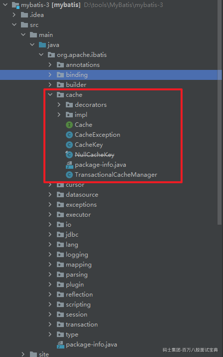

通过结构我们能够发现Cache其实使用到了装饰器模式来实现缓存的处理。首先大家需要先回顾下装饰器模式的相关内容哦。我们先来看看Cache中的基础类的API

> // 煎饼加鸡蛋加香肠  
> “装饰者模式（Decorator Pattern）是指在不改变原有对象的基础之上，将功能附加到对象上，提供了比继承更有弹性的替代方案（扩展原有对象的功能）。”

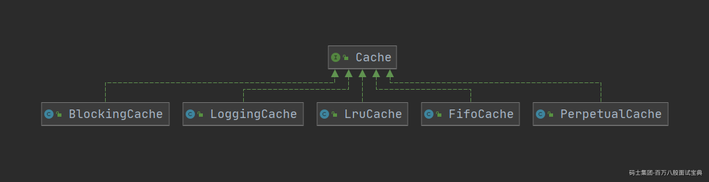

## 1. Cache接口

```plain
Cache接口是缓存模块中最核心的接口，它定义了所有缓存的基本行为，Cache接口的定义如下:
```

```java
public interface Cache {

  /**
   * 缓存对象的 ID
   * @return The identifier of this cache
   */
  String getId();

  /**
   * 向缓存中添加数据，一般情况下 key是CacheKey  value是查询结果
   * @param key Can be any object but usually it is a {@link CacheKey}
   * @param value The result of a select.
   */
  void putObject(Object key, Object value);

  /**
   * 根据指定的key，在缓存中查找对应的结果对象
   * @param key The key
   * @return The object stored in the cache.
   */
  Object getObject(Object key);

  /**
   * As of 3.3.0 this method is only called during a rollback
   * for any previous value that was missing in the cache.
   * This lets any blocking cache to release the lock that
   * may have previously put on the key.
   * A blocking cache puts a lock when a value is null
   * and releases it when the value is back again.
   * This way other threads will wait for the value to be
   * available instead of hitting the database.
   *   删除key对应的缓存数据
   *
   * @param key The key
   * @return Not used
   */
  Object removeObject(Object key);

  /**
   * Clears this cache instance.
   * 清空缓存
   */
  void clear();

  /**
   * Optional. This method is not called by the core.
   * 缓存的个数。
   * @return The number of elements stored in the cache (not its capacity).
   */
  int getSize();

  /**
   * Optional. As of 3.2.6 this method is no longer called by the core.
   * <p>
   * Any locking needed by the cache must be provided internally by the cache provider.
   *  获取读写锁
   * @return A ReadWriteLock
   */
  default ReadWriteLock getReadWriteLock() {
    return null;
  }

}
```

Cache接口的实现类很多，但是大部分都是装饰器，只有PerpetualCache提供了Cache接口的基本实现。

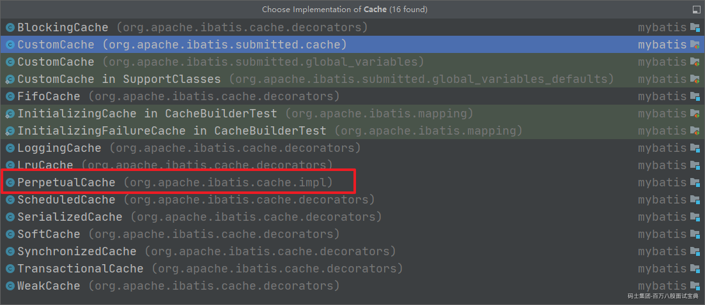

## 2. PerpetualCache

PerpetualCache在缓存模块中扮演了ConcreteComponent的角色，其实现比较简单，底层使用HashMap记录缓存项，具体的实现如下：

```java
/**
 * 在装饰器模式用 用来被装饰的对象
 * 缓存中的  基本缓存处理的实现
 * 其实就是一个 HashMap 的基本操作
 * @author Clinton Begin
 */
public class PerpetualCache implements Cache {

  private final String id; // Cache 对象的唯一标识

  // 用于记录缓存的Map对象
  private final Map<Object, Object> cache = new HashMap<>();

  public PerpetualCache(String id) {
    this.id = id;
  }

  @Override
  public String getId() {
    return id;
  }

  @Override
  public int getSize() {
    return cache.size();
  }

  @Override
  public void putObject(Object key, Object value) {
    cache.put(key, value);
  }

  @Override
  public Object getObject(Object key) {
    return cache.get(key);
  }

  @Override
  public Object removeObject(Object key) {
    return cache.remove(key);
  }

  @Override
  public void clear() {
    cache.clear();
  }

  @Override
  public boolean equals(Object o) {
    if (getId() == null) {
      throw new CacheException("Cache instances require an ID.");
    }
    if (this == o) {
      return true;
    }
    if (!(o instanceof Cache)) {
      return false;
    }

    Cache otherCache = (Cache) o;
    // 只关心ID
    return getId().equals(otherCache.getId());
  }

  @Override
  public int hashCode() {
    if (getId() == null) {
      throw new CacheException("Cache instances require an ID.");
    }
    // 只关心ID
    return getId().hashCode();
  }

}

```

然后我们可以来看看cache.decorators包下提供的装饰器。他们都实现了Cache接口。这些装饰器都在PerpetualCache的基础上提供了一些额外的功能，通过多个组合实现一些特殊的需求。

## 3.BlockingCache

通过名称我们能看出来是一个阻塞同步的缓存，它保证只有一个线程到缓存中查找指定的key对应的数据。

```java
public class BlockingCache implements Cache {

  private long timeout; // 阻塞超时时长
  private final Cache delegate; // 被装饰的底层 Cache 对象
  // 每个key 都有对象的 ReentrantLock 对象
  private final ConcurrentHashMap<Object, ReentrantLock> locks;

  public BlockingCache(Cache delegate) {
    // 被装饰的 Cache 对象
    this.delegate = delegate;
    this.locks = new ConcurrentHashMap<>();
  }

  @Override
  public String getId() {
    return delegate.getId();
  }

  @Override
  public int getSize() {
    return delegate.getSize();
  }

  @Override
  public void putObject(Object key, Object value) {
    try {
      // 执行 被装饰的 Cache 中的方法
      delegate.putObject(key, value);
    } finally {
      // 释放锁
      releaseLock(key);
    }
  }

  @Override
  public Object getObject(Object key) {
    acquireLock(key); // 获取锁
    Object value = delegate.getObject(key); // 获取缓存数据
    if (value != null) { // 有数据就释放掉锁，否则继续持有锁
      releaseLock(key);
    }
    return value;
  }

  @Override
  public Object removeObject(Object key) {
    // despite of its name, this method is called only to release locks
    releaseLock(key);
    return null;
  }

  @Override
  public void clear() {
    delegate.clear();
  }

  private ReentrantLock getLockForKey(Object key) {
    return locks.computeIfAbsent(key, k -> new ReentrantLock());
  }

  private void acquireLock(Object key) {
    Lock lock = getLockForKey(key);
    if (timeout > 0) {
      try {
        boolean acquired = lock.tryLock(timeout, TimeUnit.MILLISECONDS);
        if (!acquired) {
          throw new CacheException("Couldn't get a lock in " + timeout + " for the key " +  key + " at the cache " + delegate.getId());
        }
      } catch (InterruptedException e) {
        throw new CacheException("Got interrupted while trying to acquire lock for key " + key, e);
      }
    } else {
      lock.lock();
    }
  }

  private void releaseLock(Object key) {
    ReentrantLock lock = locks.get(key);
    if (lock.isHeldByCurrentThread()) {
      lock.unlock();
    }
  }

  public long getTimeout() {
    return timeout;
  }

  public void setTimeout(long timeout) {
    this.timeout = timeout;
  }
}

```

通过源码我们能够发现，BlockingCache本质上就是在我们操作缓存数据的前后通过 ReentrantLock对象来实现了加锁和解锁操作。其他的具体实现类，大家可以自行查阅

|  |  |  |  |
| --- | --- | --- | --- |
| 缓存实现类 | **描述** | **作用** | 装饰条件 |
| 基本缓存 | 缓存基本实现类 | 默认是PerpetualCache，也可以自定义比如RedisCache、EhCache等，具备基本功能的缓存类 | 无 |
| LruCache | LRU策略的缓存 | 当缓存到达上限时候，删除最近最少使用的缓存（Least Recently Use） | eviction="LRU"（默认） |
| FifoCache | FIFO策略的缓存 | 当缓存到达上限时候，删除最先入队的缓存 | eviction="FIFO" |
| SoftCacheWeakCache | 带清理策略的缓存 | 通过JVM的软引用和弱引用来实现缓存，当JVM内存不足时，会自动清理掉这些缓存，基于SoftReference和WeakReference | eviction="SOFT"eviction="WEAK" |
| LoggingCache | 带日志功能的缓存 | 比如：输出缓存命中率 | 基本 |
| SynchronizedCache | 同步缓存 | 基于synchronized关键字实现，解决并发问题 | 基本 |
| BlockingCache | 阻塞缓存 | 通过在get/put方式中加锁，保证只有一个线程操作缓存，基于Java重入锁实现 | blocking=true |
| SerializedCache | 支持序列化的缓存 | 将对象序列化以后存到缓存中，取出时反序列化 | readOnly=false（默认） |
| ScheduledCache | 定时调度的缓存 | 在进行get/put/remove/getSize等操作前，判断缓存时间是否超过了设置的最长缓存时间（默认是一小时），如果是则清空缓存--即每隔一段时间清空一次缓存 | flushInterval不为空 |
| TransactionalCache | 事务缓存 | 在二级缓存中使用，可一次存入多个缓存，移除多个缓存 | 在TransactionalCacheManager中用Map维护对应关系 |

## 4. 缓存的应用

### 4.1 缓存对应的初始化

在Configuration初始化的时候会为我们的各种Cache实现注册对应的别名

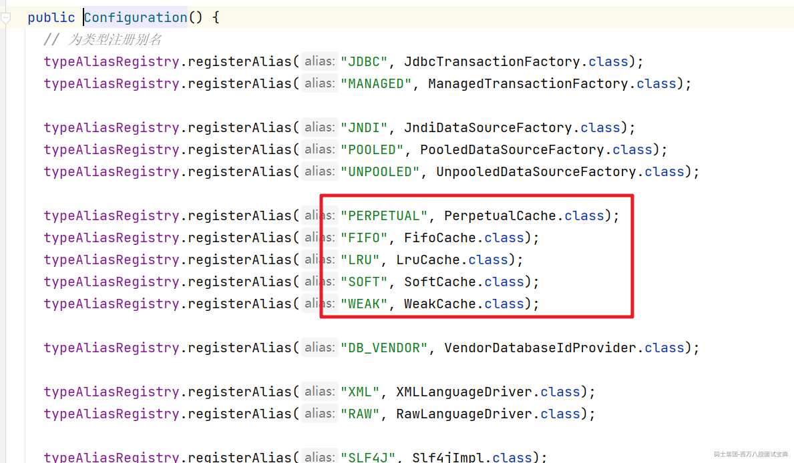

```plain
在解析settings标签的时候，设置的默认值有如下
```

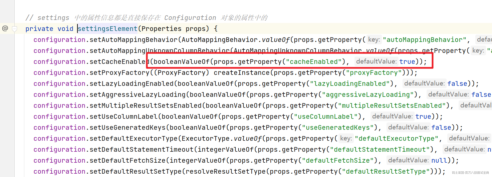

cacheEnabled默认为true，localCacheScope默认为 SESSION

在解析映射文件的时候会解析我们相关的cache标签

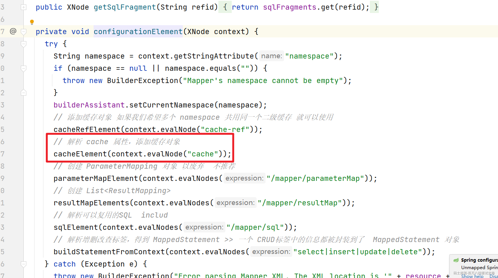

然后解析映射文件的cache标签后会在Configuration对象中添加对应的数据在

```java
  private void cacheElement(XNode context) {
    // 只有 cache 标签不为空才解析
    if (context != null) {
      String type = context.getStringAttribute("type", "PERPETUAL");
      Class<? extends Cache> typeClass = typeAliasRegistry.resolveAlias(type);
      String eviction = context.getStringAttribute("eviction", "LRU");
      Class<? extends Cache> evictionClass = typeAliasRegistry.resolveAlias(eviction);
      Long flushInterval = context.getLongAttribute("flushInterval");
      Integer size = context.getIntAttribute("size");
      boolean readWrite = !context.getBooleanAttribute("readOnly", false);
      boolean blocking = context.getBooleanAttribute("blocking", false);
      Properties props = context.getChildrenAsProperties();
      builderAssistant.useNewCache(typeClass, evictionClass, flushInterval, size, readWrite, blocking, props);
    }
  }
```

继续

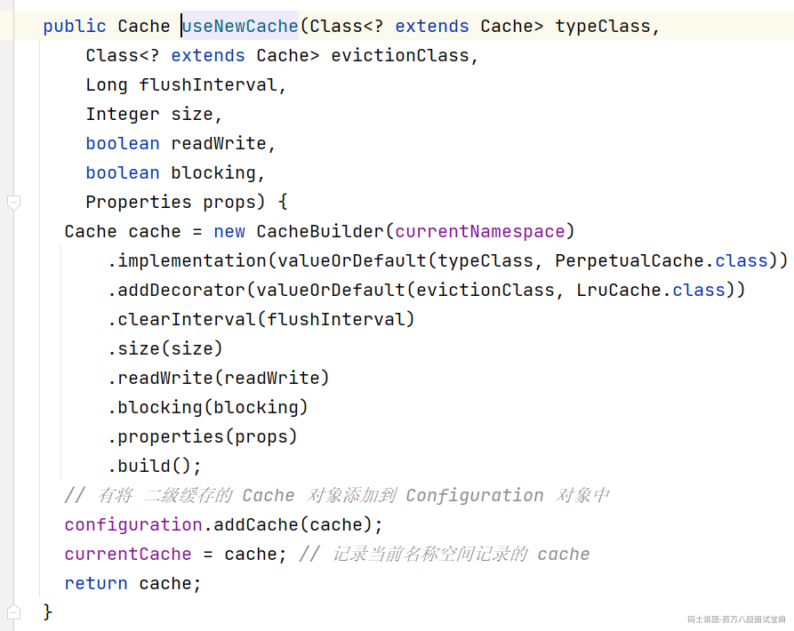

然后我们可以发现 如果存储 cache 标签，那么对应的 Cache对象会被保存在 currentCache 属性中。

进而在 Cache 对象 保存在了 MapperStatement 对象的 cache 属性中。

然后我们再看看openSession的时候又做了哪些操作，在创建对应的执行器的时候会有缓存的操作

```java
  public Executor newExecutor(Transaction transaction, ExecutorType executorType) {
    executorType = executorType == null ? defaultExecutorType : executorType;
    executorType = executorType == null ? ExecutorType.SIMPLE : executorType;
    Executor executor;
    if (ExecutorType.BATCH == executorType) {
      executor = new BatchExecutor(this, transaction);
    } else if (ExecutorType.REUSE == executorType) {
      executor = new ReuseExecutor(this, transaction);
    } else {
      // 默认 SimpleExecutor
      executor = new SimpleExecutor(this, transaction);
    }
    // 二级缓存开关，settings 中的 cacheEnabled 默认是 true
    if (cacheEnabled) {
      executor = new CachingExecutor(executor);
    }
    // 植入插件的逻辑，至此，四大对象已经全部拦截完毕
    executor = (Executor) interceptorChain.pluginAll(executor);
    return executor;
  }
```

也就是如果 cacheEnabled 为 true 就会通过 CachingExecutor 来装饰executor 对象，然后就是在执行SQL操作的时候会涉及到缓存的具体使用。这个就分为一级缓存和二级缓存，这个我们来分别介绍

### 4.2 一级缓存

一级缓存也叫本地缓存（Local Cache），MyBatis的一级缓存是在会话（SqlSession）层面进行缓存的。MyBatis的一级缓存是默认开启的，不需要任何的配置（如果要关闭，localCacheScope设置为STATEMENT）。在BaseExecutor对象的query方法中有关闭一级缓存的逻辑

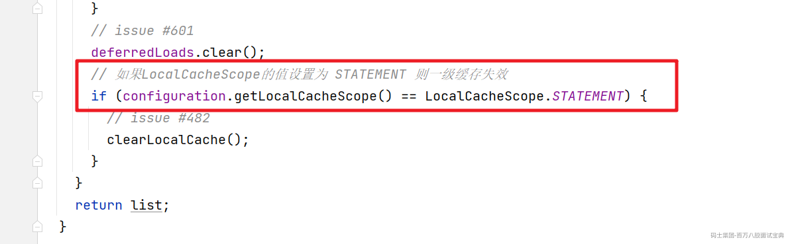

```plain
然后我们需要考虑下在一级缓存中的 PerpetualCache 对象在哪创建的，因为一级缓存是Session级别的缓存，肯定需要在Session范围内创建，其实PerpetualCache的实例化是在BaseExecutor的构造方法中创建的
```

```java
  protected BaseExecutor(Configuration configuration, Transaction transaction) {
    this.transaction = transaction;
    this.deferredLoads = new ConcurrentLinkedQueue<>();
    this.localCache = new PerpetualCache("LocalCache");
    this.localOutputParameterCache = new PerpetualCache("LocalOutputParameterCache");
    this.closed = false;
    this.configuration = configuration;
    this.wrapper = this;
  }
```

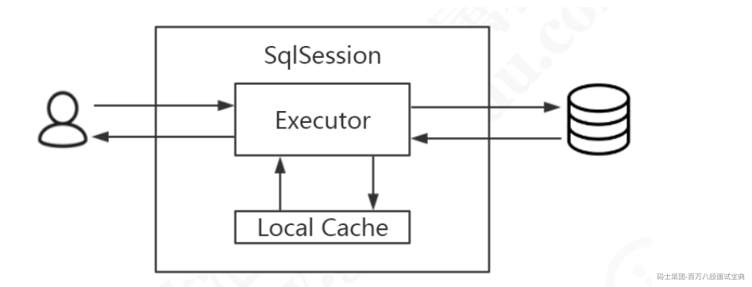

一级缓存的具体实现也是在BaseExecutor的query方法中来实现的

```java
public <E> List<E> query(MappedStatement ms, Object parameter, RowBounds rowBounds, ResultHandler resultHandler, CacheKey key, BoundSql boundSql) throws SQLException {
    // 异常体系之 ErrorContext
    ErrorContext.instance().resource(ms.getResource()).activity("executing a query").object(ms.getId());
    if (closed) {
      throw new ExecutorException("Executor was closed.");
    }
    if (queryStack == 0 && ms.isFlushCacheRequired()) {
      // flushCache="true"时，即使是查询，也清空一级缓存
      clearLocalCache();
    }
    List<E> list;
    try {
      // 防止递归查询重复处理缓存
      queryStack++;
      // 查询一级缓存
      // ResultHandler 和 ResultSetHandler的区别
      list = resultHandler == null ? (List<E>) localCache.getObject(key) : null;
      if (list != null) {
        handleLocallyCachedOutputParameters(ms, key, parameter, boundSql);
      } else {
        // 真正的查询流程
        list = queryFromDatabase(ms, parameter, rowBounds, resultHandler, key, boundSql);
      }
    } finally {
      queryStack--;
    }
    if (queryStack == 0) {
      for (DeferredLoad deferredLoad : deferredLoads) {
        deferredLoad.load();
      }
      // issue #601
      deferredLoads.clear();
      if (configuration.getLocalCacheScope() == LocalCacheScope.STATEMENT) {
        // issue #482
        clearLocalCache();
      }
    }
    return list;
  }
```

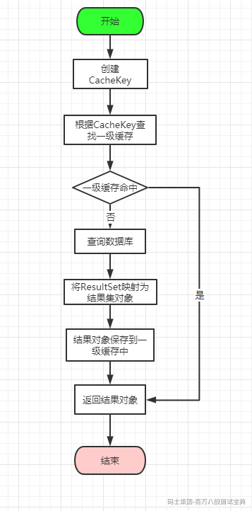

一级缓存的验证：

同一个Session中的多个相同操作

```java
    @Test
    public void test1() throws  Exception{
        // 1.获取配置文件
        InputStream in = Resources.getResourceAsStream("mybatis-config.xml");
        // 2.加载解析配置文件并获取SqlSessionFactory对象
        SqlSessionFactory factory = new SqlSessionFactoryBuilder().build(in);
        // 3.根据SqlSessionFactory对象获取SqlSession对象
        SqlSession sqlSession = factory.openSession();
        // 4.通过SqlSession中提供的 API方法来操作数据库
        List<User> list = sqlSession.selectList("com.gupaoedu.mapper.UserMapper.selectUserList");
        System.out.println(list.size());
        // 一级缓存测试
        System.out.println("---------");
        list = sqlSession.selectList("com.gupaoedu.mapper.UserMapper.selectUserList");
        System.out.println(list.size());
        // 5.关闭会话
        sqlSession.close();
    }
```

输出日志

```plain
Setting autocommit to false on JDBC Connection [com.mysql.cj.jdbc.ConnectionImpl@477b4cdf]
==>  Preparing: select * from t_user 
==> Parameters: 
<==    Columns: id, user_name, real_name, password, age, d_id
<==        Row: 1, zhangsan, 张三, 123456, 18, null
<==        Row: 2, lisi, 李四, 11111, 19, null
<==        Row: 3, wangwu, 王五, 111, 22, 1001
<==        Row: 4, wangwu, 王五, 111, 22, 1001
<==        Row: 5, wangwu, 王五, 111, 22, 1001
<==        Row: 6, wangwu, 王五, 111, 22, 1001
<==        Row: 7, wangwu, 王五, 111, 22, 1001
<==        Row: 8, aaa, bbbb, null, null, null
<==        Row: 9, aaa, bbbb, null, null, null
<==        Row: 10, aaa, bbbb, null, null, null
<==        Row: 11, aaa, bbbb, null, null, null
<==        Row: 12, aaa, bbbb, null, null, null
<==        Row: 666, hibernate, 持久层框架, null, null, null
<==      Total: 13
13
---------
13
```

可以看到第二次查询没有经过数据库操作

不同Session的相同操作

```java
    @Test
    public void test2() throws  Exception{
        // 1.获取配置文件
        InputStream in = Resources.getResourceAsStream("mybatis-config.xml");
        // 2.加载解析配置文件并获取SqlSessionFactory对象
        SqlSessionFactory factory = new SqlSessionFactoryBuilder().build(in);
        // 3.根据SqlSessionFactory对象获取SqlSession对象
        SqlSession sqlSession = factory.openSession();
        // 4.通过SqlSession中提供的 API方法来操作数据库
        List<User> list = sqlSession.selectList("com.gupaoedu.mapper.UserMapper.selectUserList");
        System.out.println(list.size());
        sqlSession.close();
        sqlSession = factory.openSession();
        // 一级缓存测试
        System.out.println("---------");
        list = sqlSession.selectList("com.gupaoedu.mapper.UserMapper.selectUserList");
        System.out.println(list.size());
        // 5.关闭会话
        sqlSession.close();
    }
```

输出结果

```plain
Setting autocommit to false on JDBC Connection [com.mysql.cj.jdbc.ConnectionImpl@477b4cdf]
==>  Preparing: select * from t_user 
==> Parameters: 
<==    Columns: id, user_name, real_name, password, age, d_id
<==        Row: 1, zhangsan, 张三, 123456, 18, null
<==        Row: 2, lisi, 李四, 11111, 19, null
<==        Row: 3, wangwu, 王五, 111, 22, 1001
<==        Row: 4, wangwu, 王五, 111, 22, 1001
<==        Row: 5, wangwu, 王五, 111, 22, 1001
<==        Row: 6, wangwu, 王五, 111, 22, 1001
<==        Row: 7, wangwu, 王五, 111, 22, 1001
<==        Row: 8, aaa, bbbb, null, null, null
<==        Row: 9, aaa, bbbb, null, null, null
<==        Row: 10, aaa, bbbb, null, null, null
<==        Row: 11, aaa, bbbb, null, null, null
<==        Row: 12, aaa, bbbb, null, null, null
<==        Row: 666, hibernate, 持久层框架, null, null, null
<==      Total: 13
13
Resetting autocommit to true on JDBC Connection [com.mysql.cj.jdbc.ConnectionImpl@477b4cdf]
Closing JDBC Connection [com.mysql.cj.jdbc.ConnectionImpl@477b4cdf]
Returned connection 1199262943 to pool.
---------
Opening JDBC Connection
Checked out connection 1199262943 from pool.
Setting autocommit to false on JDBC Connection [com.mysql.cj.jdbc.ConnectionImpl@477b4cdf]
==>  Preparing: select * from t_user 
==> Parameters: 
<==    Columns: id, user_name, real_name, password, age, d_id
<==        Row: 1, zhangsan, 张三, 123456, 18, null
<==        Row: 2, lisi, 李四, 11111, 19, null
<==        Row: 3, wangwu, 王五, 111, 22, 1001
<==        Row: 4, wangwu, 王五, 111, 22, 1001
<==        Row: 5, wangwu, 王五, 111, 22, 1001
<==        Row: 6, wangwu, 王五, 111, 22, 1001
<==        Row: 7, wangwu, 王五, 111, 22, 1001
<==        Row: 8, aaa, bbbb, null, null, null
<==        Row: 9, aaa, bbbb, null, null, null
<==        Row: 10, aaa, bbbb, null, null, null
<==        Row: 11, aaa, bbbb, null, null, null
<==        Row: 12, aaa, bbbb, null, null, null
<==        Row: 666, hibernate, 持久层框架, null, null, null
<==      Total: 13
13
Resetting autocommit to true on JDBC Connection [com.mysql.cj.jdbc.ConnectionImpl@477b4cdf]
Closing JDBC Connection [com.mysql.cj.jdbc.ConnectionImpl@477b4cdf]
Returned connection 1199262943 to pool.
```

通过输出我们能够发现，不同的Session中的相同操作，一级缓存是没有起作用的。

### 4.3 二级缓存

二级缓存是用来解决一级缓存不能跨会话共享的问题的，范围是namespace级别的，可以被多个SqlSession共享（只要是同一个接口里面的相同方法，都可以共享），生命周期和应用同步。

二级缓存的设置，首先是settings中的cacheEnabled要设置为true，当然默认的就是为true，这个步骤决定了在创建Executor对象的时候是否通过CachingExecutor来装饰。

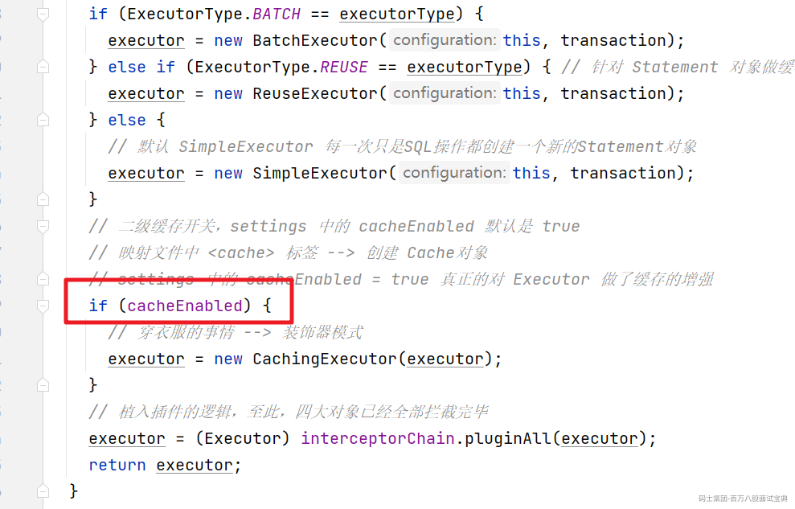

那么设置了cacheEnabled标签为true是否就意味着 二级缓存是否一定可用呢？当然不是，我们还需要在 对应的映射文件中添加 cache 标签才行。

```xml
<!-- 声明这个namespace使用二级缓存 -->
<cache type="org.apache.ibatis.cache.impl.PerpetualCache"
      size="1024"  <!—最多缓存对象个数，默认1024-->
      eviction="LRU" <!—回收策略-->
      flushInterval="120000" <!—自动刷新时间 ms，未配置时只有调用时刷新-->
      readOnly="false"/> <!—默认是false（安全），改为true可读写时，对象必须支持序列化 -->
```

cache属性详解：

|  |  |  |
| --- | --- | --- |
| **属性** | **含义** | **取值** |
| type | 缓存实现类 | 需要实现Cache接口，默认是PerpetualCache，可以使用第三方缓存 |
| size | 最多缓存对象个数 | 默认1024 |
| eviction | 回收策略（缓存淘汰算法） | LRU – 最近最少使用的：移除最长时间不被使用的对象（默认）。FIFO – 先进先出：按对象进入缓存的顺序来移除它们。SOFT – 软引用：移除基于垃圾回收器状态和软引用规则的对象。WEAK – 弱引用：更积极地移除基于垃圾收集器状态和弱引用规则的对象。 |
| flushInterval | 定时自动清空缓存间隔 | 自动刷新时间，单位 ms，未配置时只有调用时刷新 |
| readOnly | 是否只读 | true：只读缓存；会给所有调用者返回缓存对象的相同实例。因此这些对象不能被修改。这提供了很重要的性能优势。false：读写缓存；会返回缓存对象的拷贝（通过序列化），不会共享。这会慢一些，但是安全，因此默认是 false。改为false可读写时，对象必须支持序列化。 |
| blocking | 启用阻塞缓存 | 通过在get/put方式中加锁，保证只有一个线程操作缓存，基于Java重入锁实现 |

再来看下cache标签在源码中的体现，创建cacheKey

```java
  @Override
  public <E> List<E> query(MappedStatement ms, Object parameterObject, RowBounds rowBounds, ResultHandler resultHandler) throws SQLException {
    // 获取SQL
    BoundSql boundSql = ms.getBoundSql(parameterObject);
    // 创建CacheKey：什么样的SQL是同一条SQL？ >>
    CacheKey key = createCacheKey(ms, parameterObject, rowBounds, boundSql);
    return query(ms, parameterObject, rowBounds, resultHandler, key, boundSql);
  }
```

createCacheKey自行进去查看

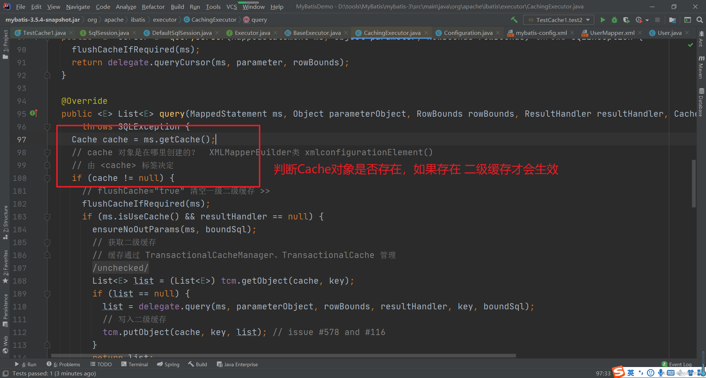

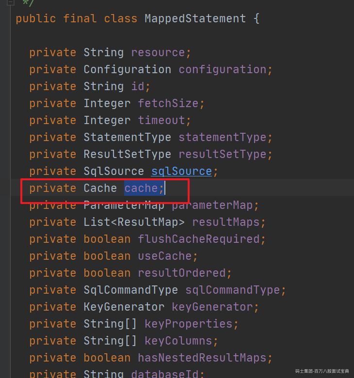

而这看到的和我们前面在缓存初始化时看到的 cache 标签解析操作是对应上的。所以我们要开启二级缓存两个条件都要满足。

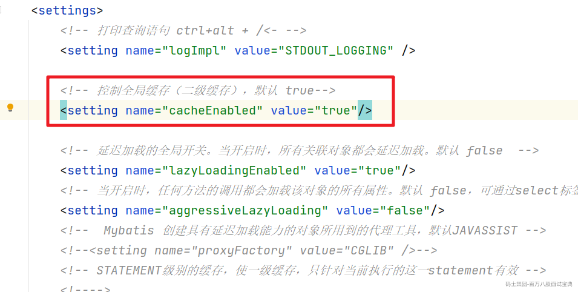

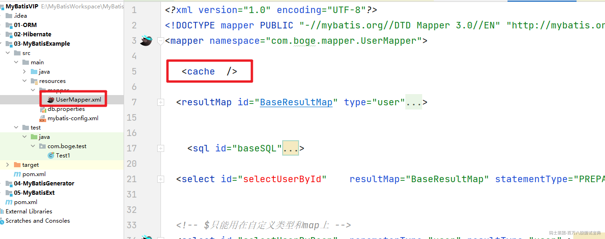

这样的设置表示当前的映射文件中的相关查询操作都会触发二级缓存，但如果某些个别方法我们不希望走二级缓存怎么办呢？我们可以在标签中添加一个 useCache=false 来实现的设置不使用二级缓存

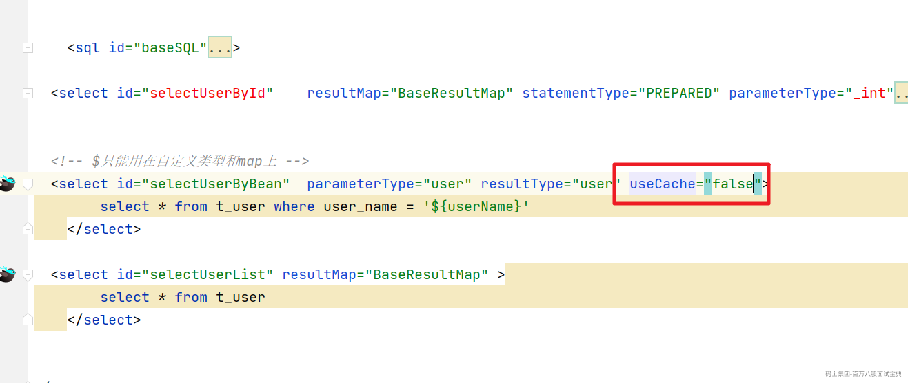

还有就是当我们执行的对应的DML操作，在MyBatis中会清空对应的二级缓存和一级缓存。

```java
  private void flushCacheIfRequired(MappedStatement ms) {
    Cache cache = ms.getCache();
    // 增删改查的标签上有属性：flushCache="true" （select语句默认是false）
    // 一级二级缓存都会被清理
    if (cache != null && ms.isFlushCacheRequired()) {
      tcm.clear(cache);
    }
  }
```

在解析映射文件的时候DML操作flushCacheRequired为true

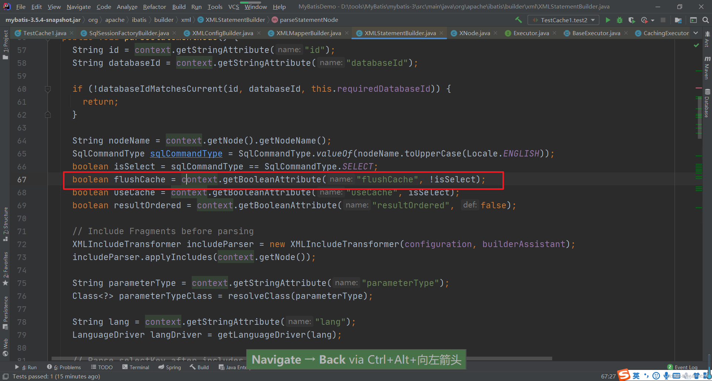

### 4.4 第三方缓存

```plain
在实际开发的时候我们一般也很少使用MyBatis自带的二级缓存，这时我们会使用第三方的缓存工具Ehcache获取Redis来实现,那么他们是如何来实现的呢？
```

<https://github.com/mybatis/redis-cache>

添加依赖

```xml
<dependency>
   <groupId>org.mybatis.caches</groupId>

   <artifactId>mybatis-redis</artifactId>

   <version>1.0.0-beta2</version>

</dependency>

```

然后加上Cache标签的配置

```xml
  <cache type="org.mybatis.caches.redis.RedisCache"
         eviction="FIFO" 
         flushInterval="60000" 
         size="512" 
         readOnly="true"/>
```

然后添加redis的属性文件

```properties
host=192.168.100.120
port=6379
connectionTimeout=5000
soTimeout=5000
database=0
```

# 二、日志模块

首先日志在我们开发过程中占据了一个非常重要的地位，是开发和运维管理之间的桥梁，在Java中的日志框架也非常多，Log4j,Log4j2,Apache Commons Log,java.util.logging,slf4j等，这些工具对外的接口也都不尽相同，为了统一这些工具，MyBatis定义了一套统一的日志接口供上层使用。首先大家对于适配器模式要了解下哦。

## 1、Log

```plain
Log接口中定义了四种日志级别，相比较其他的日志框架的多种日志级别显得非常的精简，但也能够满足大多数常见的使用了
```

```java
public interface Log {

  boolean isDebugEnabled();

  boolean isTraceEnabled();

  void error(String s, Throwable e);

  void error(String s);

  void debug(String s);

  void trace(String s);

  void warn(String s);

}
```

## 2、LogFactory

```plain
LogFactory工厂类负责创建日志组件适配器，
```

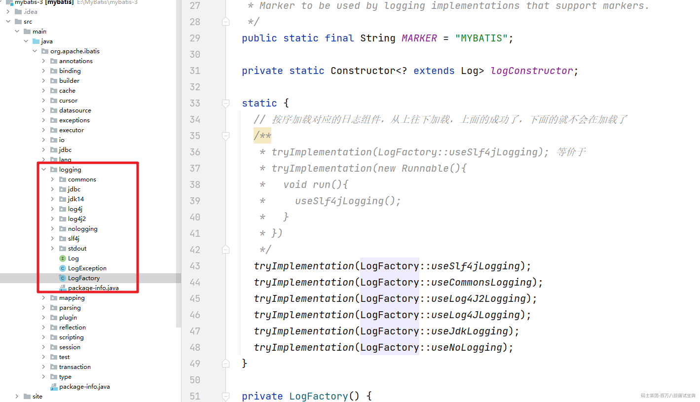

```plain
在LogFactory类加载时会执行其静态代码块，其逻辑是按序加载并实例化对应日志组件的适配器，然后使用LogFactory.logConstructor这个静态字段，记录当前使用的第三方日志组件的适配器。具体代码如下，每个方法都比较简单就不一一赘述了。
```

## 3、 日志应用

```plain
那么在MyBatis系统启动的时候日志框架是如何选择的呢？首先我们在全局配置文件中我们可以设置对应的日志类型选择
```

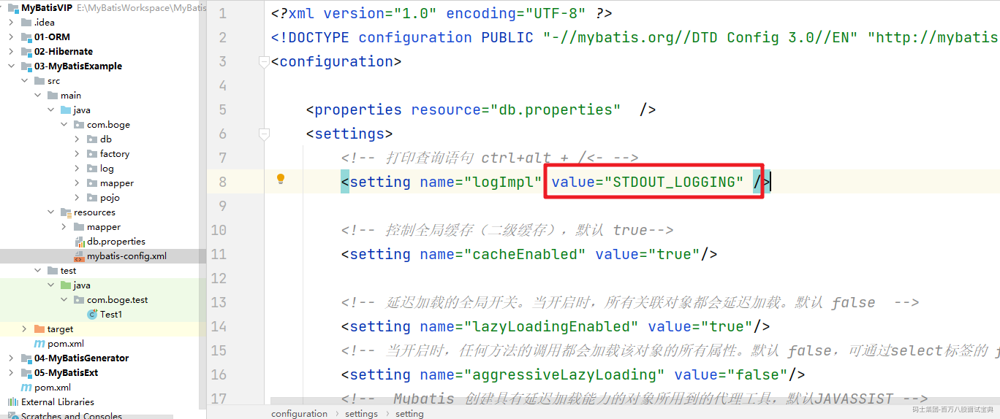

这个"STDOUT\_LOGGING"是怎么来的呢？在Configuration的构造方法中其实是设置的各个日志实现的别名的

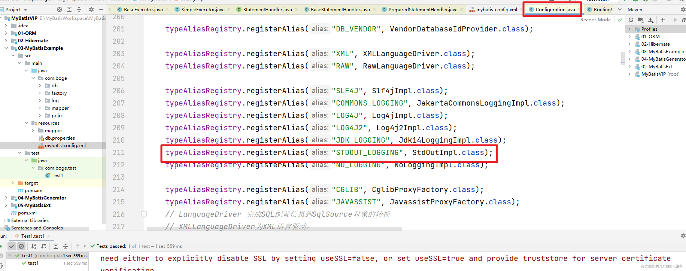

然后在解析全局配置文件的时候就会处理日志的设置

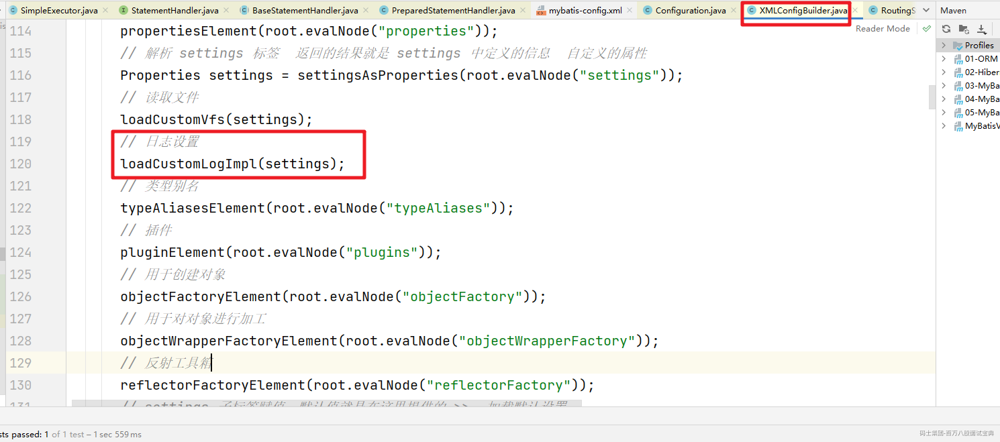

进入方法

```java
  private void loadCustomLogImpl(Properties props) {
    // 获取 logImpl设置的 日志 类型
    Class<? extends Log> logImpl = resolveClass(props.getProperty("logImpl"));
    // 设置日志
    configuration.setLogImpl(logImpl);
  }
```

进入setLogImpl方法中

```java
  public void setLogImpl(Class<? extends Log> logImpl) {
    if (logImpl != null) {
      this.logImpl = logImpl; // 记录日志的类型
      // 设置 适配选择
      LogFactory.useCustomLogging(this.logImpl);
    }
  }
```

再进入useCustomLogging方法

```java
  public static synchronized void useCustomLogging(Class<? extends Log> clazz) {
    setImplementation(clazz);
  }
```

再进入

```java
  private static void setImplementation(Class<? extends Log> implClass) {
    try {
      // 获取指定适配器的构造方法
      Constructor<? extends Log> candidate = implClass.getConstructor(String.class);
      // 实例化适配器
      Log log = candidate.newInstance(LogFactory.class.getName());
      if (log.isDebugEnabled()) {
        log.debug("Logging initialized using '" + implClass + "' adapter.");
      }
      // 初始化 logConstructor 字段
      logConstructor = candidate;
    } catch (Throwable t) {
      throw new LogException("Error setting Log implementation.  Cause: " + t, t);
    }
  }
```

这就关联上了我们前面在LogFactory中看到的代码，启动测试方法看到的日志也和源码中的对应上来了，还有就是我们自己设置的会覆盖掉默认的sl4j日志框架的配置

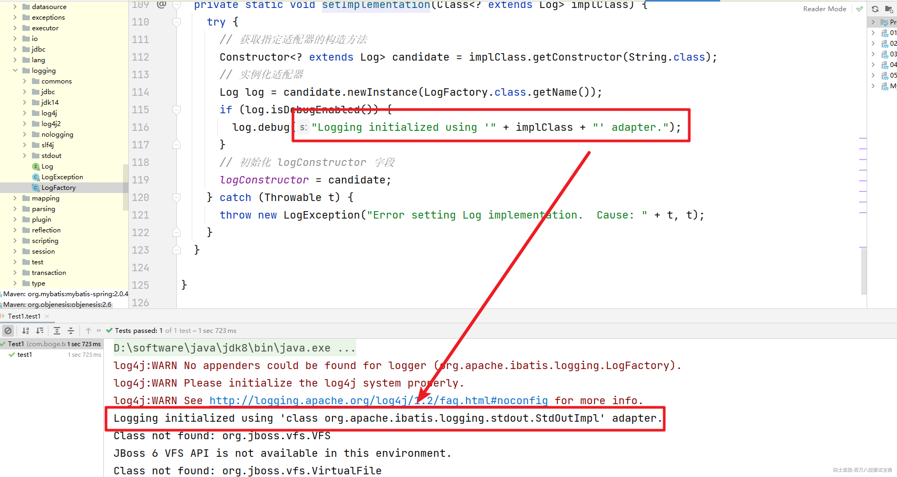

## 4、JDBC 日志

```plain
当我们开启了 STDOUT的日志管理后，当我们执行SQL操作时我们发现在控制台中可以打印出相关的日志信息
```

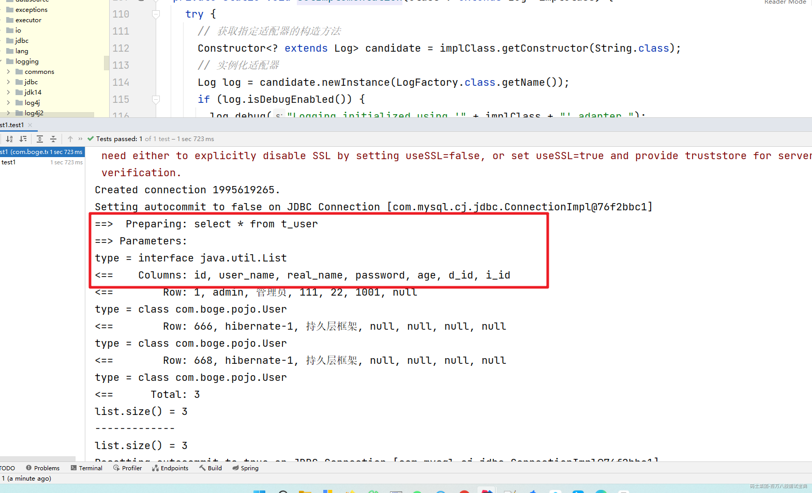

```plain
那这些日志信息是怎么打印出来的呢？原来在MyBatis中的日志模块中包含了一个jdbc包，它并不是将日志信息通过jdbc操作保存到数据库中，而是通过JDK动态代理的方式，将JDBC操作通过指定的日志框架打印出来。下面我们就来看看它是如何实现的。
```

### 4.1 BaseJdbcLogger

```plain
BaseJdbcLogger是一个抽象类，它是jdbc包下其他Logger的父类。继承关系如下
```

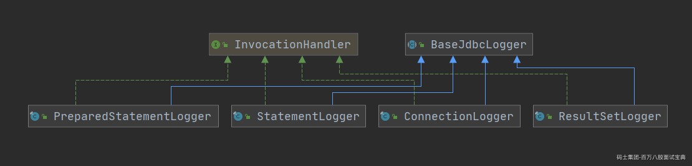

```plain
从图中我们也可以看到4个实现都实现了InvocationHandler接口。属性含义如下
```

```java
  // 记录 PreparedStatement 接口中定义的常用的set*() 方法
  protected static final Set<String> SET_METHODS;
  // 记录了 Statement 接口和 PreparedStatement 接口中与执行SQL语句有关的方法
  protected static final Set<String> EXECUTE_METHODS = new HashSet<>();

  // 记录了PreparedStatement.set*() 方法设置的键值对
  private final Map<Object, Object> columnMap = new HashMap<>();
  // 记录了PreparedStatement.set*() 方法设置的键 key
  private final List<Object> columnNames = new ArrayList<>();
  // 记录了PreparedStatement.set*() 方法设置的值 Value
  private final List<Object> columnValues = new ArrayList<>();

  protected final Log statementLog;// 用于日志输出的Log对象
  protected final int queryStack;  // 记录了SQL的层数，用于格式化输出SQL
```

```plain
其他几个方法可自行观看
```

### 4.2 ConnectionLogger

```plain
ConnectionLogger的作用是记录数据库连接相关的日志信息，在实现中是创建了一个Connection的代理对象，在每次Connection操作的前后我们都可以实现日志的操作。
```

```java
public final class ConnectionLogger extends BaseJdbcLogger implements InvocationHandler {

  // 真正的Connection对象
  private final Connection connection;

  private ConnectionLogger(Connection conn, Log statementLog, int queryStack) {
    super(statementLog, queryStack);
    this.connection = conn;
  }

  @Override
  public Object invoke(Object proxy, Method method, Object[] params)
      throws Throwable {
    try {
      // 如果是调用从Object继承过来的方法，就直接调用 toString,hashCode,equals等
      if (Object.class.equals(method.getDeclaringClass())) {
        return method.invoke(this, params);
      }
      // 如果调用的是 prepareStatement方法
      if ("prepareStatement".equals(method.getName())) {
        if (isDebugEnabled()) {
          debug(" Preparing: " + removeBreakingWhitespace((String) params[0]), true);
        }
        // 创建  PreparedStatement
        PreparedStatement stmt = (PreparedStatement) method.invoke(connection, params);
        // 然后创建 PreparedStatement 的代理对象 增强
        stmt = PreparedStatementLogger.newInstance(stmt, statementLog, queryStack);
        return stmt;
        // 同上
      } else if ("prepareCall".equals(method.getName())) {
        if (isDebugEnabled()) {
          debug(" Preparing: " + removeBreakingWhitespace((String) params[0]), true);
        }
        PreparedStatement stmt = (PreparedStatement) method.invoke(connection, params);
        stmt = PreparedStatementLogger.newInstance(stmt, statementLog, queryStack);
        return stmt;
        // 同上
      } else if ("createStatement".equals(method.getName())) {
        Statement stmt = (Statement) method.invoke(connection, params);
        stmt = StatementLogger.newInstance(stmt, statementLog, queryStack);
        return stmt;
      } else {
        return method.invoke(connection, params);
      }
    } catch (Throwable t) {
      throw ExceptionUtil.unwrapThrowable(t);
    }
  }

  /**
   * Creates a logging version of a connection.
   *
   * @param conn - the original connection
   * @return - the connection with logging
   */
  public static Connection newInstance(Connection conn, Log statementLog, int queryStack) {
    InvocationHandler handler = new ConnectionLogger(conn, statementLog, queryStack);
    ClassLoader cl = Connection.class.getClassLoader();
    // 创建了 Connection的 代理对象 目的是 增强 Connection对象 给他添加了日志功能
    return (Connection) Proxy.newProxyInstance(cl, new Class[]{Connection.class}, handler);
  }

  /**
   * return the wrapped connection.
   *
   * @return the connection
   */
  public Connection getConnection() {
    return connection;
  }

}
```

其他几个xxxxLogger的实现和ConnectionLogger几乎是一样的就不在次赘述了，请自行观看。

### 4.3 应用实现

```plain
在实际处理的时候，日志模块是如何工作的，我们来看看。
```

在我们要执行SQL语句前需要获取Statement对象，而Statement对象是通过Connection获取的，所以我们在SimpleExecutor中就可以看到相关的代码

```java
  private Statement prepareStatement(StatementHandler handler, Log statementLog) throws SQLException {
    Statement stmt;
    Connection connection = getConnection(statementLog);
    // 获取 Statement 对象
    stmt = handler.prepare(connection, transaction.getTimeout());
    // 为 Statement 设置参数
    handler.parameterize(stmt);
    return stmt;
  }
```

先进入如到getConnection方法中

```java
  protected Connection getConnection(Log statementLog) throws SQLException {
    Connection connection = transaction.getConnection();
    if (statementLog.isDebugEnabled()) {
      // 创建Connection的日志代理对象
      return ConnectionLogger.newInstance(connection, statementLog, queryStack);
    } else {
      return connection;
    }
  }
```

在进入到handler.prepare方法中

```java
  @Override
  protected Statement instantiateStatement(Connection connection) throws SQLException {
    String sql = boundSql.getSql();
    if (mappedStatement.getKeyGenerator() instanceof Jdbc3KeyGenerator) {
      String[] keyColumnNames = mappedStatement.getKeyColumns();
      if (keyColumnNames == null) {
        return connection.prepareStatement(sql, PreparedStatement.RETURN_GENERATED_KEYS);
      } else {
        // 在执行 prepareStatement 方法的时候会进入进入到ConnectionLogger的invoker方法中
        return connection.prepareStatement(sql, keyColumnNames);
      }
    } else if (mappedStatement.getResultSetType() == ResultSetType.DEFAULT) {
      return connection.prepareStatement(sql);
    } else {
      return connection.prepareStatement(sql, mappedStatement.getResultSetType().getValue(), ResultSet.CONCUR_READ_ONLY);
    }
  }
```

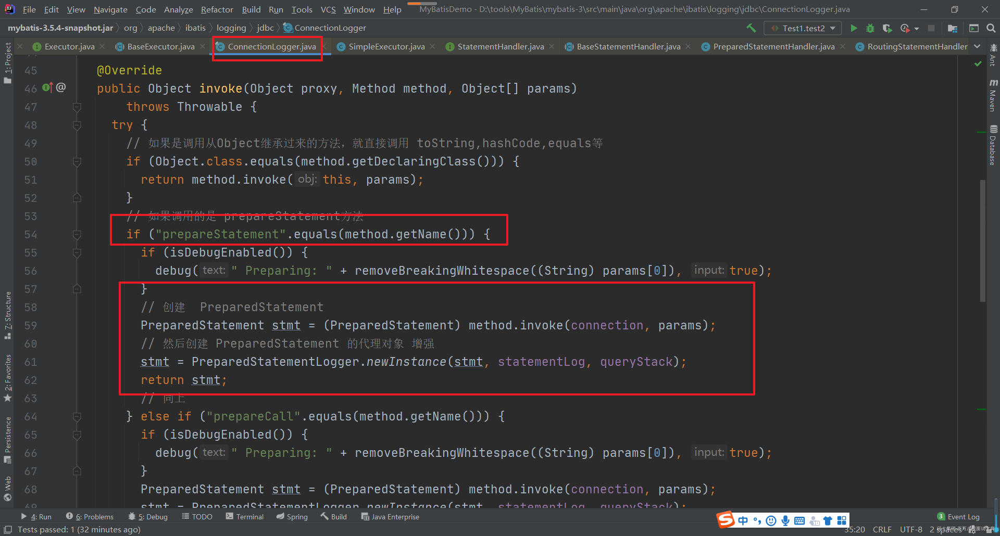

在执行sql语句的时候

```java
  @Override
  public <E> List<E> query(Statement statement, ResultHandler resultHandler) throws SQLException {
    PreparedStatement ps = (PreparedStatement) statement;
    // 到了JDBC的流程
    ps.execute(); // 本质上 ps 也是 日志代理对象
    // 处理结果集
    return resultSetHandler.handleResultSets(ps);
  }
```

如果是查询操作，后面的ResultSet结果集操作，其他是也通过ResultSetLogger来处理的，前面的清楚了，后面的就很容易的。

# 三、DataSource

  首先大家要清楚DataSource属于MyBatis三层架构设计的基础层  
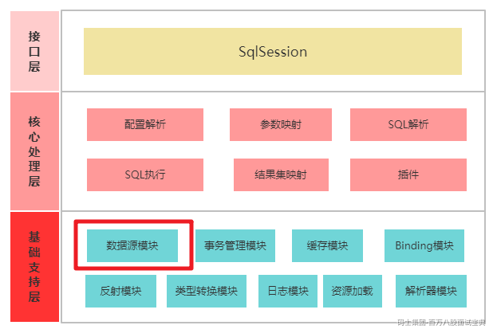

  然后我们来看看具体的实现。

   在MyBatis中提供了两个 javax.sql.DataSource 接口的实现，分别是 PooledDataSource 和 UnpooledDataSource .

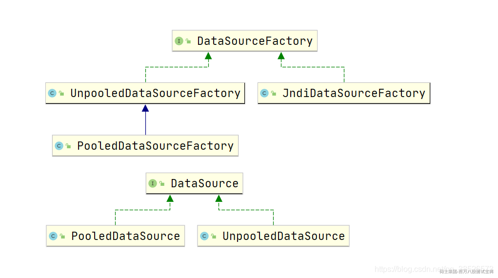

## 1 DataSourceFactory

   DataSourceFactory是用来创建DataSource对象的，接口中声明了两个方法，作用如下

```java
public interface DataSourceFactory {
  // 设置 DataSource 的相关属性，一般紧跟在初始化完成之后
  void setProperties(Properties props);

  // 获取 DataSource 对象
  DataSource getDataSource();

}
```

  DataSourceFactory接口的两个具体实现是 UnpooledDataSourceFactory 和 PooledDataSourceFactory 这两个工厂对象的作用通过名称我们也能发现是用来创建不带连接池的数据源对象和创建带连接池的数据源对象，先来看下 UnpooledDataSourceFactory 中的方法

```java
  /**
   * 完成对 UnpooledDataSource 的配置
   * @param properties 封装的有 DataSource 所需要的相关属性信息
   */
  @Override
  public void setProperties(Properties properties) {
    Properties driverProperties = new Properties();
    // 创建 DataSource 对应的 MetaObject 对象
    MetaObject metaDataSource = SystemMetaObject.forObject(dataSource);
    // 遍历 Properties 集合，该集合中配置了数据源需要的信息
    for (Object key : properties.keySet()) {
      String propertyName = (String) key; // 获取属性名称
      if (propertyName.startsWith(DRIVER_PROPERTY_PREFIX)) {
        // 以 "driver." 开头的配置项是对 DataSource 的配置
        String value = properties.getProperty(propertyName);
        driverProperties.setProperty(propertyName.substring(DRIVER_PROPERTY_PREFIX_LENGTH), value);
      } else if (metaDataSource.hasSetter(propertyName)) {
        // 有该属性的 setter 方法
        String value = (String) properties.get(propertyName);
        Object convertedValue = convertValue(metaDataSource, propertyName, value);
        // 设置 DataSource 的相关属性值
        metaDataSource.setValue(propertyName, convertedValue);
      } else {
        throw new DataSourceException("Unknown DataSource property: " + propertyName);
      }
    }
    if (driverProperties.size() > 0) {
      // 设置 DataSource.driverProperties 的属性值
      metaDataSource.setValue("driverProperties", driverProperties);
    }
  }
```

```plain
UnpooledDataSourceFactory的getDataSource方法实现比较简单，直接返回DataSource属性记录的 UnpooledDataSource 对象
```

## 2 UnpooledDataSource

  UnpooledDataSource 是 DataSource接口的其中一个实现，但是 UnpooledDataSource 并没有提供数据库连接池的支持，我们来看下他的具体实现吧

  声明的相关属性信息

```java
  private ClassLoader driverClassLoader; // 加载Driver的类加载器
  private Properties driverProperties; // 数据库连接驱动的相关信息
  // 缓存所有已注册的数据库连接驱动
  private static Map<String, Driver> registeredDrivers = new ConcurrentHashMap<>();

  private String driver; // 驱动
  private String url; // 数据库 url
  private String username; // 账号
  private String password; // 密码

  private Boolean autoCommit; // 是否自动提交
  private Integer defaultTransactionIsolationLevel; // 事务隔离级别
  private Integer defaultNetworkTimeout;
```

```plain
然后在静态代码块中完成了 Driver的复制
```

```java
  static {
    // 从 DriverManager 中获取 Drivers
    Enumeration<Driver> drivers = DriverManager.getDrivers();
    while (drivers.hasMoreElements()) {
      Driver driver = drivers.nextElement();
      // 将获取的 Driver 记录到 Map 集合中
      registeredDrivers.put(driver.getClass().getName(), driver);
    }
  }
```

```plain
UnpooledDataSource 中获取Connection的方法最终都会调用 doGetConnection() 方法。
```

```java
  private Connection doGetConnection(Properties properties) throws SQLException {
      // 初始化数据库驱动
      initializeDriver();
    // 创建真正的数据库连接
    Connection connection = DriverManager.getConnection(url, properties);
    // 配置Connection的自动提交和事务隔离级别
    configureConnection(connection);
    return connection;
  }
```

## 3 PooledDataSource

  有开发经验的小伙伴都知道，在操作数据库的时候数据库连接的创建过程是非常耗时的，数据库能够建立的连接数量也是非常有限的，所以数据库连接池的使用是非常重要的，使用数据库连接池会给我们带来很多好处，比如可以实现数据库连接的重用，提高响应速度，防止数据库连接过多造成数据库假死，避免数据库连接泄漏等等。

首先来看下声明的相关的属性

```java
  // 管理状态
  private final PoolState state = new PoolState(this);

  // 记录UnpooledDataSource，用于生成真实的数据库连接对象
  private final UnpooledDataSource dataSource;

  // OPTIONAL CONFIGURATION FIELDS
  protected int poolMaximumActiveConnections = 10; // 最大活跃连接数
  protected int poolMaximumIdleConnections = 5; // 最大空闲连接数
  protected int poolMaximumCheckoutTime = 20000; // 最大checkout时间
  protected int poolTimeToWait = 20000; // 无法获取连接的线程需要等待的时长
  protected int poolMaximumLocalBadConnectionTolerance = 3; //
  protected String poolPingQuery = "NO PING QUERY SET"; // 测试的SQL语句
  protected boolean poolPingEnabled; // 是否允许发送测试SQL语句
  // 当连接超过 poolPingConnectionsNotUsedFor毫秒未使用时，会发送一次测试SQL语句，检测连接是否正常
  protected int poolPingConnectionsNotUsedFor;
 // 根据数据库URL，用户名和密码生成的一个hash值。
  private int expectedConnectionTypeCode;
```

  然后重点来看下 getConnection 方法，该方法是用来给调用者提供 Connection 对象的。

```java
  @Override
  public Connection getConnection() throws SQLException {
    return popConnection(dataSource.getUsername(), dataSource.getPassword()).getProxyConnection();
  }
```

  我们会发现其中调用了 popConnection 方法，在该方法中 返回的是 PooledConnection 对象，而 PooledConnection 对象实现了 InvocationHandler 接口，所以会使用到Java的动态代理，其中相关的属性为

```java
  private static final String CLOSE = "close";
  private static final Class<?>[] IFACES = new Class<?>[] { Connection.class };

  private final int hashCode;
  private final PooledDataSource dataSource;
  //  真正的数据库连接
  private final Connection realConnection;
  //  数据库连接的代理对象
  private final Connection proxyConnection;
  private long checkoutTimestamp; // 从连接池中取出该连接的时间戳
  private long createdTimestamp; // 该连接创建的时间戳
  private long lastUsedTimestamp; // 最后一次被使用的时间戳
  private int connectionTypeCode; // 又数据库URL、用户名和密码计算出来的hash值，可用于标识该连接所在的连接池
  // 连接是否有效的标志
  private boolean valid;
```

  重点关注下invoke 方法

```java
  @Override
  public Object invoke(Object proxy, Method method, Object[] args) throws Throwable {
    String methodName = method.getName();
    if (CLOSE.equals(methodName)) {
      // 如果是 close 方法被执行则将连接放回连接池中，而不是真正的关闭数据库连接
      dataSource.pushConnection(this);
      return null;
    }
    try {
      if (!Object.class.equals(method.getDeclaringClass())) {
        // issue #579 toString() should never fail
        // throw an SQLException instead of a Runtime
        // 通过上面的 valid 字段来检测 连接是否有效
        checkConnection();
      }
      // 调用真正数据库连接对象的对应方法
      return method.invoke(realConnection, args);
    } catch (Throwable t) {
      throw ExceptionUtil.unwrapThrowable(t);
    }

  }
```

  还有就是前面提到的 PoolState 对象，它主要是用来管理 PooledConnection 对象状态的组件，通过两个 ArrayList 集合分别管理空闲状态的连接和活跃状态的连接，定义如下：

```java
  protected PooledDataSource dataSource;
  // 空闲的连接
  protected final List<PooledConnection> idleConnections = new ArrayList<>();
  // 活跃的连接
  protected final List<PooledConnection> activeConnections = new ArrayList<>();
  protected long requestCount = 0; // 请求数据库连接的次数
  protected long accumulatedRequestTime = 0; // 获取连接累计的时间
  // CheckoutTime 表示应用从连接池中取出来，到归还连接的时长
  // accumulatedCheckoutTime 记录了所有连接累计的CheckoutTime时长
  protected long accumulatedCheckoutTime = 0;
  // 当连接长时间没有归还连接时，会被认为该连接超时
  // claimedOverdueConnectionCount 记录连接超时的个数
  protected long claimedOverdueConnectionCount = 0;
  // 累计超时时间
  protected long accumulatedCheckoutTimeOfOverdueConnections = 0;
  // 累计等待时间
  protected long accumulatedWaitTime = 0;
  // 等待次数
  protected long hadToWaitCount = 0;
  // 无效连接数
  protected long badConnectionCount = 0;
```

  再回到 popConnection 方法中来看

```java
  private PooledConnection popConnection(String username, String password) throws SQLException {
    boolean countedWait = false;
    PooledConnection conn = null;
    long t = System.currentTimeMillis();
    int localBadConnectionCount = 0;

    while (conn == null) {
      synchronized (state) { // 同步
        if (!state.idleConnections.isEmpty()) { // 检测空闲连接
          // Pool has available connection 连接池中有空闲的连接
          conn = state.idleConnections.remove(0); // 获取连接
          if (log.isDebugEnabled()) {
            log.debug("Checked out connection " + conn.getRealHashCode() + " from pool.");
          }
        } else {// 当前连接池 没有空闲连接
          // Pool does not have available connection
          if (state.activeConnections.size() < poolMaximumActiveConnections) { // 活跃数没有达到最大连接数 可以创建新的连接
            // Can create new connection 创建新的数据库连接
            conn = new PooledConnection(dataSource.getConnection(), this);
            if (log.isDebugEnabled()) {
              log.debug("Created connection " + conn.getRealHashCode() + ".");
            }
          } else { // 活跃数已经达到了最大数 不能创建新的连接
            // Cannot create new connection 获取最先创建的活跃连接
            PooledConnection oldestActiveConnection = state.activeConnections.get(0);
            // 获取该连接的超时时间
            long longestCheckoutTime = oldestActiveConnection.getCheckoutTime();
            // 检查是否超时
            if (longestCheckoutTime > poolMaximumCheckoutTime) {
              // Can claim overdue connection  对超时连接的信息进行统计
              state.claimedOverdueConnectionCount++;
              state.accumulatedCheckoutTimeOfOverdueConnections += longestCheckoutTime;
              state.accumulatedCheckoutTime += longestCheckoutTime;
              // 将超时连接移除 activeConnections
              state.activeConnections.remove(oldestActiveConnection);
              if (!oldestActiveConnection.getRealConnection().getAutoCommit()) {
                // 如果超时连接没有提交 则自动回滚
                try {
                  oldestActiveConnection.getRealConnection().rollback();
                } catch (SQLException e) {
                  /*
                     Just log a message for debug and continue to execute the following
                     statement like nothing happened.
                     Wrap the bad connection with a new PooledConnection, this will help
                     to not interrupt current executing thread and give current thread a
                     chance to join the next competition for another valid/good database
                     connection. At the end of this loop, bad {@link @conn} will be set as null.
                   */
                  log.debug("Bad connection. Could not roll back");
                }
              }
              // 创建 PooledConnection，但是数据库中的真正连接并没有创建
              conn = new PooledConnection(oldestActiveConnection.getRealConnection(), this);
              conn.setCreatedTimestamp(oldestActiveConnection.getCreatedTimestamp());
              conn.setLastUsedTimestamp(oldestActiveConnection.getLastUsedTimestamp());
              // 将超时的 PooledConnection 设置为无效
              oldestActiveConnection.invalidate();
              if (log.isDebugEnabled()) {
                log.debug("Claimed overdue connection " + conn.getRealHashCode() + ".");
              }
            } else {
              // Must wait  无空闲连接，无法创建新连接和无超时连接 那就只能等待
              try {
                if (!countedWait) {
                  state.hadToWaitCount++; // 统计等待次数
                  countedWait = true;
                }
                if (log.isDebugEnabled()) {
                  log.debug("Waiting as long as " + poolTimeToWait + " milliseconds for connection.");
                }
                long wt = System.currentTimeMillis();
                state.wait(poolTimeToWait); // 阻塞等待
                // 统计累计的等待时间
                state.accumulatedWaitTime += System.currentTimeMillis() - wt;
              } catch (InterruptedException e) {
                break;
              }
            }
          }
        }
        if (conn != null) {
          // ping to server and check the connection is valid or not
          // 检查 PooledConnection 是否有效
          if (conn.isValid()) {
            if (!conn.getRealConnection().getAutoCommit()) {
              conn.getRealConnection().rollback();
            }
            // 配置 PooledConnection 的相关属性
            conn.setConnectionTypeCode(assembleConnectionTypeCode(dataSource.getUrl(), username, password));
            conn.setCheckoutTimestamp(System.currentTimeMillis());
            conn.setLastUsedTimestamp(System.currentTimeMillis());
            state.activeConnections.add(conn);
            state.requestCount++; // 进行相关的统计
            state.accumulatedRequestTime += System.currentTimeMillis() - t;
          } else {
            if (log.isDebugEnabled()) {
              log.debug("A bad connection (" + conn.getRealHashCode() + ") was returned from the pool, getting another connection.");
            }
            state.badConnectionCount++;
            localBadConnectionCount++;
            conn = null;
            if (localBadConnectionCount > (poolMaximumIdleConnections + poolMaximumLocalBadConnectionTolerance)) {
              if (log.isDebugEnabled()) {
                log.debug("PooledDataSource: Could not get a good connection to the database.");
              }
              throw new SQLException("PooledDataSource: Could not get a good connection to the database.");
            }
          }
        }
      }

    }
```

  为了更好的理解代码的含义，我们绘制了对应的流程图  
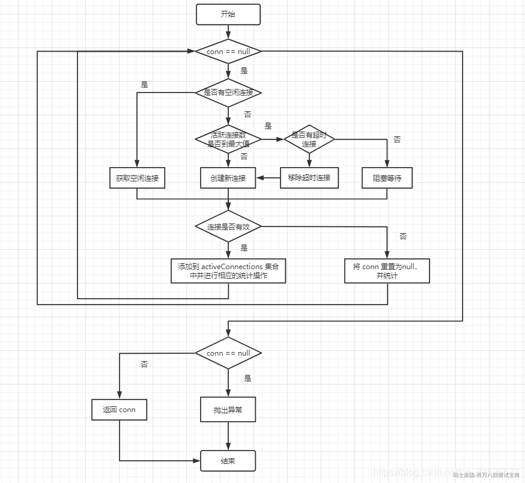

  然后我们来看下当我们从连接池中使用完成了数据库的相关操作后，是如何来关闭连接的呢？通过前面的 invoke 方法的介绍其实我们能够发现，当我们执行代理对象的 close 方法的时候其实是执行的 pushConnection 方法。  
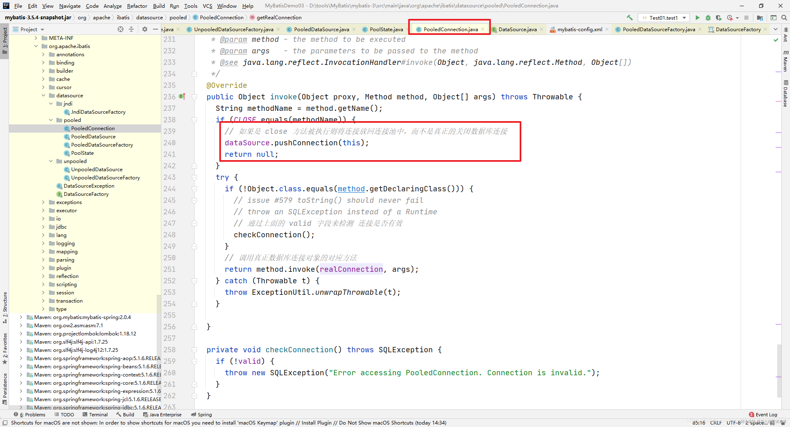

  具体的实现代码为

```java
  protected void pushConnection(PooledConnection conn) throws SQLException {

    synchronized (state) {
      // 从 activeConnections 中移除 PooledConnection 对象
      state.activeConnections.remove(conn);
      if (conn.isValid()) { // 检测 连接是否有效
        if (state.idleConnections.size() < poolMaximumIdleConnections // 是否达到上限
            && conn.getConnectionTypeCode() == expectedConnectionTypeCode // 该 PooledConnection 是否为该连接池的连接
        ) {
          state.accumulatedCheckoutTime += conn.getCheckoutTime(); // 累计 checkout 时长
          if (!conn.getRealConnection().getAutoCommit()) { // 回滚未提交的事务
            conn.getRealConnection().rollback();
          }
          // 为返还连接创建新的 PooledConnection 对象
          PooledConnection newConn = new PooledConnection(conn.getRealConnection(), this);
          // 添加到 空闲连接集合中
          state.idleConnections.add(newConn);
          newConn.setCreatedTimestamp(conn.getCreatedTimestamp());
          newConn.setLastUsedTimestamp(conn.getLastUsedTimestamp());
          conn.invalidate(); // 将原来的 PooledConnection 连接设置为无效
          if (log.isDebugEnabled()) {
            log.debug("Returned connection " + newConn.getRealHashCode() + " to pool.");
          }
          // 唤醒阻塞等待的线程
          state.notifyAll();
        } else { // 空闲连接达到上限或者 PooledConnection不属于当前的连接池
          state.accumulatedCheckoutTime += conn.getCheckoutTime(); // 累计 checkout 时长
          if (!conn.getRealConnection().getAutoCommit()) {
            conn.getRealConnection().rollback();
          }
          conn.getRealConnection().close(); // 关闭真正的数据库连接
          if (log.isDebugEnabled()) {
            log.debug("Closed connection " + conn.getRealHashCode() + ".");
          }
          conn.invalidate(); // 设置 PooledConnection 无线
        }
      } else {
        if (log.isDebugEnabled()) {
          log.debug("A bad connection (" + conn.getRealHashCode() + ") attempted to return to the pool, discarding connection.");
        }
        state.badConnectionCount++; // 统计无效的 PooledConnection 对象个数
      }
    }
  }
```

  为了便于理解，我们同样的来绘制对应的流程图：

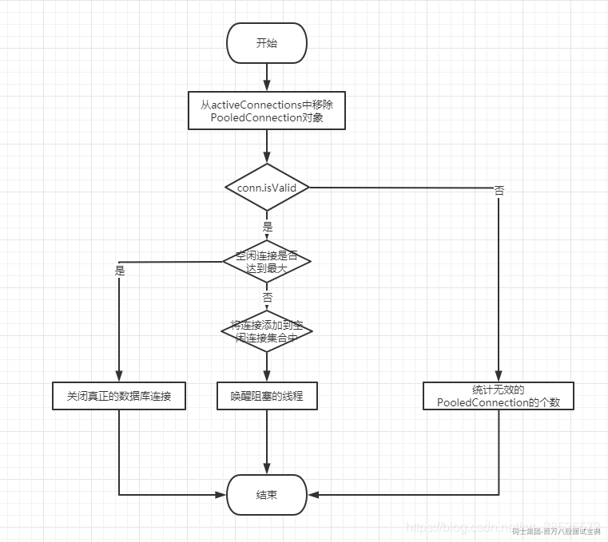

  还有就是我们在源码中多处有看到 conn.isValid方法来检测连接是否有效

```java
  public boolean isValid() {
    return valid && realConnection != null && dataSource.pingConnection(this);
  }
```

  dataSource.pingConnection(this)中会真正的实现数据库的SQL执行操作

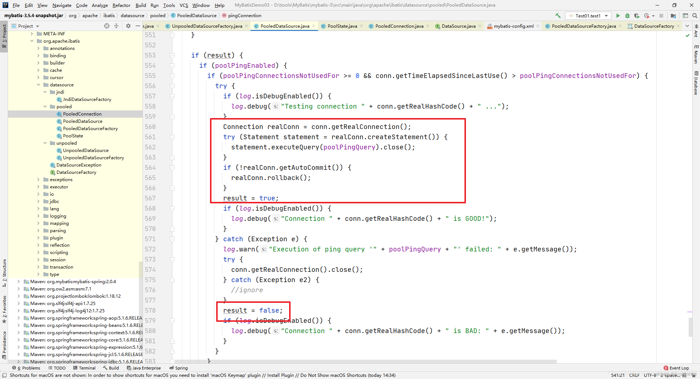

  最后一点要注意的是在我们修改了任意的PooledDataSource中的属性的时候都会执行forceCloseAll来强制关闭所有的连接。

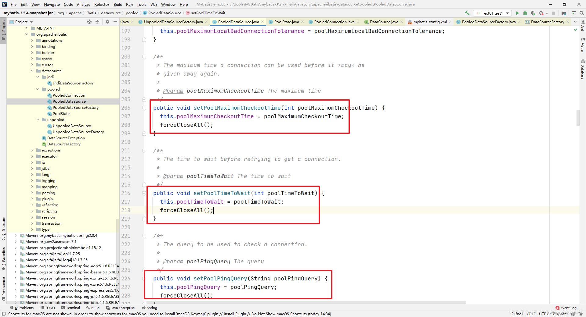

```java
  /**
   * Closes all active and idle connections in the pool.
   */
  public void forceCloseAll() {
    synchronized (state) {
      // 更新 当前的 连接池 标识
      expectedConnectionTypeCode = assembleConnectionTypeCode(dataSource.getUrl(), dataSource.getUsername(), dataSource.getPassword());
      for (int i = state.activeConnections.size(); i > 0; i--) {// 处理全部的活跃连接
        try {
          // 获取 获取的连接
          PooledConnection conn = state.activeConnections.remove(i - 1);
          conn.invalidate(); // 标识为无效连接
          // 获取真实的 数据库连接
          Connection realConn = conn.getRealConnection();
          if (!realConn.getAutoCommit()) {
            realConn.rollback(); // 回滚未处理的事务
          }
          realConn.close(); // 关闭真正的数据库连接
        } catch (Exception e) {
          // ignore
        }
      }
      // 同样的逻辑处理空闲的连接
      for (int i = state.idleConnections.size(); i > 0; i--) {
        try {
          PooledConnection conn = state.idleConnections.remove(i - 1);
          conn.invalidate();

          Connection realConn = conn.getRealConnection();
          if (!realConn.getAutoCommit()) {
            realConn.rollback();
          }
          realConn.close();
        } catch (Exception e) {
          // ignore
        }
      }
    }
    if (log.isDebugEnabled()) {
      log.debug("PooledDataSource forcefully closed/removed all connections.");
    }
  }
```
