# MyBatis整合Spring的原理分析

<http://mybatis.org/spring/zh/index.html>

## 1. MyBatis整合Spring实现

```plain
我们先来实现MyBatis和Spring的整合操作。
```

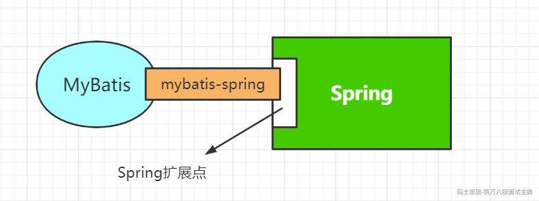

### 1.1 添加相关的依赖

```xml
<dependency>
    <groupId>org.mybatis</groupId>

    <artifactId>mybatis-spring</artifactId>

    <version>2.0.4</version>

</dependency>

<dependency>
    <groupId>org.springframework</groupId>

    <artifactId>spring-context</artifactId>

    <version>5.1.6.RELEASE</version>

</dependency>

<dependency>
    <groupId>org.springframework</groupId>

    <artifactId>spring-orm</artifactId>

    <version>5.1.6.RELEASE</version>

</dependency>

<dependency>
    <groupId>org.springframework</groupId>

    <artifactId>spring-test</artifactId>

    <version>5.1.6.RELEASE</version>

</dependency>

<dependency>
    <groupId>junit</groupId>

    <artifactId>junit</artifactId>

    <version>4.12</version>

    <scope>test</scope>

</dependency>

<dependency>
    <groupId>com.alibaba</groupId>

    <artifactId>druid</artifactId>

    <version>1.1.14</version>

</dependency>

```

### 1.2 配置文件

我们将MyBatis整合到Spring中，那么原来在MyBatis的很多配置我们都可以在Spring的配置文件中设置，我们可以给MyBatis的配置文件设置为空

```xml
<?xml version="1.0" encoding="UTF-8" ?>
<!DOCTYPE configuration PUBLIC "-//mybatis.org//DTD Config 3.0//EN" "http://mybatis.org/dtd/mybatis-3-config.dtd">
<configuration>

</configuration>

```

添加Spring的配置文件，并在该文件中实现和Spring的整合操作

```xml
<beans xmlns="http://www.springframework.org/schema/beans"
       xmlns:xsi="http://www.w3.org/2001/XMLSchema-instance" xmlns:context="http://www.springframework.org/schema/context"
       xmlns:aop="http://www.springframework.org/schema/aop" xmlns:tx="http://www.springframework.org/schema/tx"
       xsi:schemaLocation="http://www.springframework.org/schema/beans http://www.springframework.org/schema/beans/spring-beans.xsd
        http://www.springframework.org/schema/context http://www.springframework.org/schema/context/spring-context-4.3.xsd
        http://www.springframework.org/schema/aop http://www.springframework.org/schema/aop/spring-aop-4.3.xsd
        http://www.springframework.org/schema/tx http://www.springframework.org/schema/tx/spring-tx-4.3.xsd">
    <!-- 关联数据属性文件 -->
    <context:property-placeholder location="classpath:db.properties"/>
    <!-- 开启扫描 -->
    <context:component-scan base-package="com.bobo"/>

    <!-- 配置数据源 -->
    <bean class="com.alibaba.druid.pool.DruidDataSource"
          id="dataSource" >
        <property name="driverClassName" value="${jdbc.driver}"></property>

        <property name="url" value="${jdbc.url}"></property>

        <property name="username" value="${jdbc.username}"></property>

        <property name="password" value="${jdbc.password}"></property>

    </bean>

    <!-- 整合mybatis -->
    <bean class="org.mybatis.spring.SqlSessionFactoryBean"
          id="sqlSessionFactoryBean" >
        <!-- 关联数据源 -->
        <property name="dataSource" ref="dataSource"/>
        <!-- 关联mybatis的配置文件 -->
        <property name="configLocation" value="classpath:mybatis-config-spring.xml"/>
        <!-- 指定映射文件的位置 -->
        <property name="mapperLocations" value="classpath:mapper/*.xml" />
        <!-- 添加别名 -->
        <property name="typeAliasesPackage" value="com.bobo.domain" />

    </bean>

    <!-- 配置扫描的路径 -->
    <bean class="org.mybatis.spring.mapper.MapperScannerConfigurer" >
        <property name="basePackage" value="com.bobo.mapper"/>
    </bean>

</beans>

```

### 1.3 单元测试

然后我们就可以通过测试来操作。如下：

```java
@ContextConfiguration(locations = {"classpath:applicationContext.xml"})
@RunWith(value = SpringJUnit4ClassRunner.class)
public class MyBatisSpringTest {

    @Autowired
    private UserMapper userMapper;

    @Test
    public void testQuery(){
        List<User> users = userMapper.selectUserList();
        for (User user : users) {
            System.out.println(user);
        }
    }
}
```

查询到的结果

通过单元测试的代码我们可以发现，将MyBatis整合到Spring中后，原来操作的核心对象(SqlSessionFactory,SqlSession,getMapper)都不见了，使我们的开发更加的简洁。

## 2.MyBatis整合Spring的原理

把MyBatis集成到Spring里面，是为了进一步简化MyBatis的使用，所以只是对MyBatis做了一些封装，并没有替换MyBatis的核心对象。也就是说：MyBatis jar包中的SqlSessionFactory、SqlSession、MapperProxy这些类都会用到。mybatis-spring.jar里面的类只是做了一些包装或者桥梁的工作。

只要我们弄明白了这三个对象是怎么创建的，也就理解了Spring继承MyBatis的原理。我们把它分成三步：

1. SqlSessionFactory在哪创建的。

2. SqlSession在哪创建的。

3. 代理类在哪创建的。

### 2.1 SqlSessionFactory

首先我们来看下在MyBatis整合Spring中SqlSessionFactory的创建过程，查看这步的入口在Spring的配置文件中配置整合的标签中

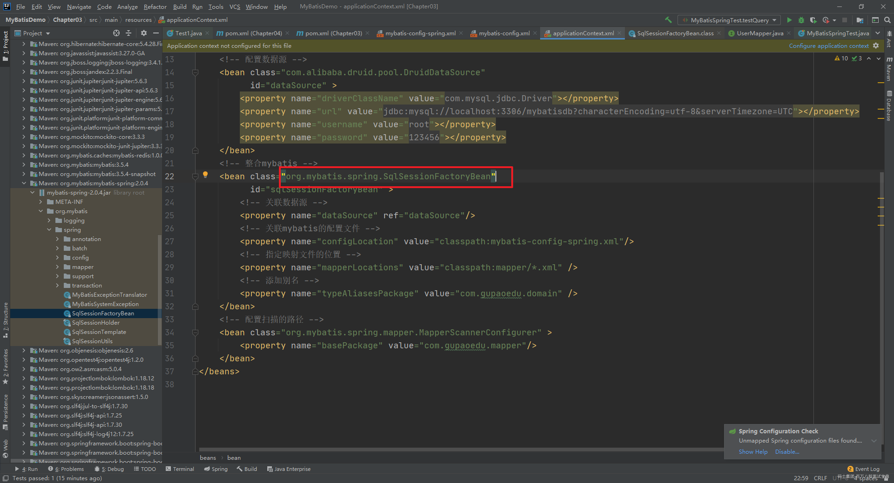

我们进入SqlSessionFactoryBean中查看源码发现，其实现了InitializingBean 、FactoryBean、ApplicationListener 三个接口

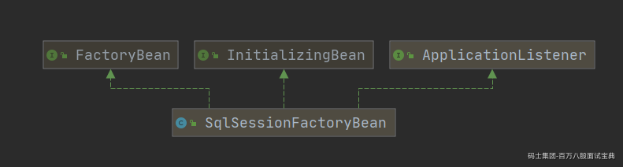

对于这三个接口，学过Spring生命周期的小伙伴应该清楚他们各自的作用

|  |  |  |
| --- | --- | --- |
| **接口** | **方法** | **作用** |
| FactoryBean | getObject() | 返回由FactoryBean创建的Bean实例 |
| InitializingBean | afterPropertiesSet() | bean属性初始化完成后添加操作 |
| ApplicationListener | onApplicationEvent() | 对应用的时间进行监听 |

#### 2.1.1 afterPropertiesSet

我们首先来看下 afterPropertiesSet 方法中的逻辑

```java
public void afterPropertiesSet() throws Exception {
    Assert.notNull(this.dataSource, "Property 'dataSource' is required");
    Assert.notNull(this.sqlSessionFactoryBuilder, "Property 'sqlSessionFactoryBuilder' is required");
    Assert.state(this.configuration == null && this.configLocation == null || this.configuration == null || this.configLocation == null, "Property 'configuration' and 'configLocation' can not specified with together");
    this.sqlSessionFactory = this.buildSqlSessionFactory();
}
```

可以发现在afterPropertiesSet中直接调用了buildSqlSessionFactory方法来实现 sqlSessionFactory 对象的创建

```java
    protected SqlSessionFactory buildSqlSessionFactory() throws Exception {
        // 解析全局配置文件的 XMLConfigBuilder 对象
        XMLConfigBuilder xmlConfigBuilder = null;
        // Configuration 对象
        Configuration targetConfiguration;
        Optional var10000;
        if (this.configuration != null) { // 判断是否存在 configuration对象，如果存在说明已经解析过了
            targetConfiguration = this.configuration;
            // 覆盖属性
            if (targetConfiguration.getVariables() == null) {
                targetConfiguration.setVariables(this.configurationProperties);
            } else if (this.configurationProperties != null) {
                targetConfiguration.getVariables().putAll(this.configurationProperties);
            }
            // 如果configuration对象不存在，但是存在configLocation属性，就根据mybatis-config.xml的文件路径来构建 xmlConfigBuilder对象
        } else if (this.configLocation != null) {  
            xmlConfigBuilder = new XMLConfigBuilder(this.configLocation.getInputStream(), (String)null, this.configurationProperties);
            targetConfiguration = xmlConfigBuilder.getConfiguration();
        } else {
            // 属性'configuration'或'configLocation'未指定，使用默认MyBatis配置
            LOGGER.debug(() -> {
                return "Property 'configuration' or 'configLocation' not specified, using default MyBatis Configuration";
            });
            targetConfiguration = new Configuration();
            var10000 = Optional.ofNullable(this.configurationProperties);
            Objects.requireNonNull(targetConfiguration);
            var10000.ifPresent(targetConfiguration::setVariables);
        }
        // 设置 Configuration 中的属性  即我们可以在Mybatis和Spring的整合文件中来设置 MyBatis的全局配置文件中的设置
        var10000 = Optional.ofNullable(this.objectFactory);
        Objects.requireNonNull(targetConfiguration);
        var10000.ifPresent(targetConfiguration::setObjectFactory);
        var10000 = Optional.ofNullable(this.objectWrapperFactory);
        Objects.requireNonNull(targetConfiguration);
        var10000.ifPresent(targetConfiguration::setObjectWrapperFactory);
        var10000 = Optional.ofNullable(this.vfs);
        Objects.requireNonNull(targetConfiguration);
        var10000.ifPresent(targetConfiguration::setVfsImpl);
        Stream var24;
        if (StringUtils.hasLength(this.typeAliasesPackage)) {
            var24 = this.scanClasses(this.typeAliasesPackage, this.typeAliasesSuperType).stream().filter((clazz) -> {
                return !clazz.isAnonymousClass();
            }).filter((clazz) -> {
                return !clazz.isInterface();
            }).filter((clazz) -> {
                return !clazz.isMemberClass();
            });
            TypeAliasRegistry var10001 = targetConfiguration.getTypeAliasRegistry();
            Objects.requireNonNull(var10001);
            var24.forEach(var10001::registerAlias);
        }

        if (!ObjectUtils.isEmpty(this.typeAliases)) {
            Stream.of(this.typeAliases).forEach((typeAlias) -> {
                targetConfiguration.getTypeAliasRegistry().registerAlias(typeAlias);
                LOGGER.debug(() -> {
                    return "Registered type alias: '" + typeAlias + "'";
                });
            });
        }

        if (!ObjectUtils.isEmpty(this.plugins)) {
            Stream.of(this.plugins).forEach((plugin) -> {
                targetConfiguration.addInterceptor(plugin);
                LOGGER.debug(() -> {
                    return "Registered plugin: '" + plugin + "'";
                });
            });
        }

        if (StringUtils.hasLength(this.typeHandlersPackage)) {
            var24 = this.scanClasses(this.typeHandlersPackage, TypeHandler.class).stream().filter((clazz) -> {
                return !clazz.isAnonymousClass();
            }).filter((clazz) -> {
                return !clazz.isInterface();
            }).filter((clazz) -> {
                return !Modifier.isAbstract(clazz.getModifiers());
            });
            TypeHandlerRegistry var25 = targetConfiguration.getTypeHandlerRegistry();
            Objects.requireNonNull(var25);
            var24.forEach(var25::register);
        }

        if (!ObjectUtils.isEmpty(this.typeHandlers)) {
            Stream.of(this.typeHandlers).forEach((typeHandler) -> {
                targetConfiguration.getTypeHandlerRegistry().register(typeHandler);
                LOGGER.debug(() -> {
                    return "Registered type handler: '" + typeHandler + "'";
                });
            });
        }

        if (!ObjectUtils.isEmpty(this.scriptingLanguageDrivers)) {
            Stream.of(this.scriptingLanguageDrivers).forEach((languageDriver) -> {
                targetConfiguration.getLanguageRegistry().register(languageDriver);
                LOGGER.debug(() -> {
                    return "Registered scripting language driver: '" + languageDriver + "'";
                });
            });
        }

        var10000 = Optional.ofNullable(this.defaultScriptingLanguageDriver);
        Objects.requireNonNull(targetConfiguration);
        var10000.ifPresent(targetConfiguration::setDefaultScriptingLanguage);
        if (this.databaseIdProvider != null) {
            try {
                targetConfiguration.setDatabaseId(this.databaseIdProvider.getDatabaseId(this.dataSource));
            } catch (SQLException var23) {
                throw new NestedIOException("Failed getting a databaseId", var23);
            }
        }

        var10000 = Optional.ofNullable(this.cache);
        Objects.requireNonNull(targetConfiguration);
        var10000.ifPresent(targetConfiguration::addCache); // 如果cache不为空就把cache 添加到 configuration对象中
        if (xmlConfigBuilder != null) {
            try {
                xmlConfigBuilder.parse(); // 解析全局配置文件
                LOGGER.debug(() -> {
                    return "Parsed configuration file: '" + this.configLocation + "'";
                });
            } catch (Exception var21) {
                throw new NestedIOException("Failed to parse config resource: " + this.configLocation, var21);
            } finally {
                ErrorContext.instance().reset();
            }
        }

        targetConfiguration.setEnvironment(new Environment(this.environment, (TransactionFactory)(this.transactionFactory == null ? new SpringManagedTransactionFactory() : this.transactionFactory), this.dataSource));
        if (this.mapperLocations != null) {
            if (this.mapperLocations.length == 0) {
                LOGGER.warn(() -> {
                    return "Property 'mapperLocations' was specified but matching resources are not found.";
                });
            } else {
                Resource[] var3 = this.mapperLocations;
                int var4 = var3.length;

                for(int var5 = 0; var5 < var4; ++var5) {
                    Resource mapperLocation = var3[var5];
                    if (mapperLocation != null) {
                        try {
                            //创建了一个用来解析Mapper.xml的XMLMapperBuilder，调用了它的parse()方法。这个步骤我们之前了解过了，
                            //主要做了两件事情，一个是把增删改查标签注册成MappedStatement对象。
                            // 第二个是把接口和对应的MapperProxyFactory工厂类注册到MapperRegistry中
                            XMLMapperBuilder xmlMapperBuilder = new XMLMapperBuilder(mapperLocation.getInputStream(), targetConfiguration, mapperLocation.toString(), targetConfiguration.getSqlFragments());
                            xmlMapperBuilder.parse();
                        } catch (Exception var19) {
                            throw new NestedIOException("Failed to parse mapping resource: '" + mapperLocation + "'", var19);
                        } finally {
                            ErrorContext.instance().reset();
                        }

                        LOGGER.debug(() -> {
                            return "Parsed mapper file: '" + mapperLocation + "'";
                        });
                    }
                }
            }
        } else {
            LOGGER.debug(() -> {
                return "Property 'mapperLocations' was not specified.";
            });
        }
      // 最后调用sqlSessionFactoryBuilder.build()返回了一个DefaultSqlSessionFactory。
        return this.sqlSessionFactoryBuilder.build(targetConfiguration);
    }
```

在afterPropertiesSet方法中完成了SqlSessionFactory对象的创建，已经相关配置文件和映射文件的解析操作。

方法小结一下：通过定义一个实现了InitializingBean接口的SqlSessionFactoryBean类，里面有一个afterPropertiesSet()方法会在bean的属性值设置完的时候被调用。Spring在启动初始化这个Bean的时候，完成了解析和工厂类的创建工作。

#### 2.1.2 getObject

另外SqlSessionFactoryBean实现了FactoryBean接口。

FactoryBean的作用是让用户可以自定义实例化Bean的逻辑。如果从BeanFactory中根据Bean的ID获取一个Bean，它获取的其实是FactoryBean的getObject()返回的对象。

也就是说，我们获取SqlSessionFactoryBean的时候，就会调用它的getObject()方法。

```java
    public SqlSessionFactory getObject() throws Exception {
        if (this.sqlSessionFactory == null) {
            this.afterPropertiesSet();
        }

        return this.sqlSessionFactory;
    }
```

getObject方法中的逻辑就非常简单，返回SqlSessionFactory对象，如果SqlSessionFactory对象为空的话就又调用一次afterPropertiesSet来解析和创建一次。

#### 2.1.3 onApplicationEvent

实现ApplicationListener接口让SqlSessionFactoryBean有能力监控应用发出的一些事件通知。比如这里监听了ContextRefreshedEvent（上下文刷新事件），会在Spring容器加载完之后执行。这里做的事情是检查ms是否加载完毕。

```java
public void onApplicationEvent(ApplicationEvent event) {
    if (this.failFast && event instanceof ContextRefreshedEvent) {
        this.sqlSessionFactory.getConfiguration().getMappedStatementNames();
    }
}
```

### 2.2 SqlSession

#### 2.2.1 DefaultSqlSession的问题

在前面介绍MyBatis的使用的时候，通过SqlSessionFactory的open方法获取的是DefaultSqlSession，但是在Spring中我们不能直接使用DefaultSqlSession，因为DefaultSqlSession是线程不安全的。所以直接使用会存在数据安全问题，针对这个问题的，在整合的MyBatis-Spring的插件包中给我们提供了一个对应的工具SqlSessionTemplate。

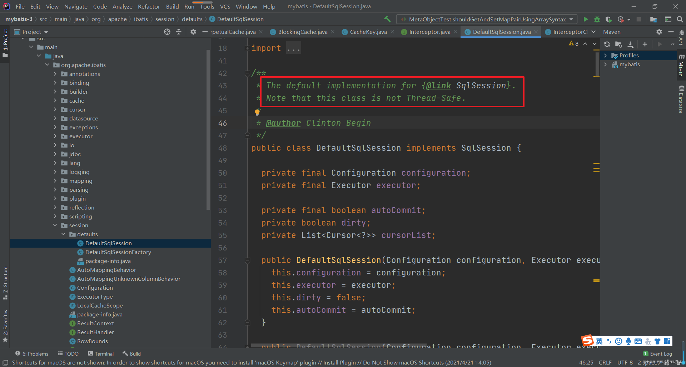

<https://mybatis.org/mybatis-3/zh/getting-started.html>

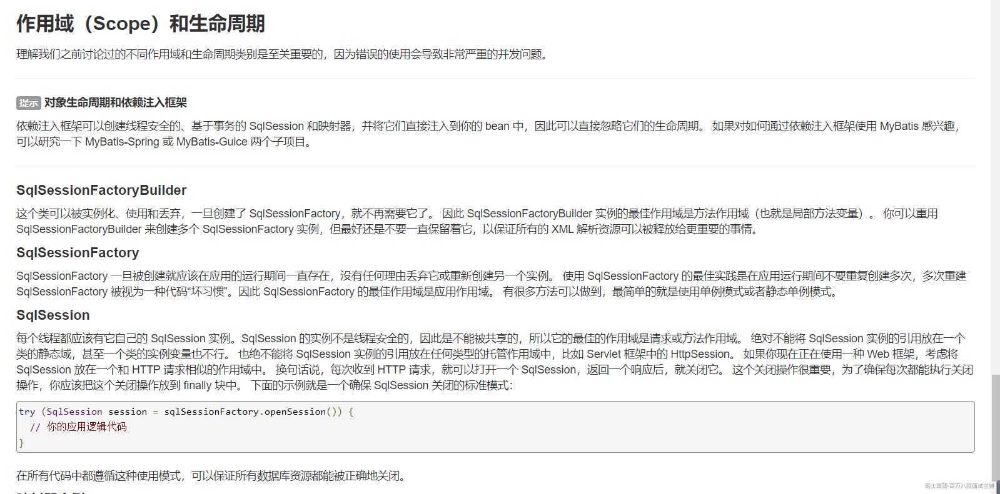

也就是在我们使用SqlSession的时候都需要使用try catch 块来处理

```java
try (SqlSession session = sqlSessionFactory.openSession()) {
  // 你的应用逻辑代码
}
// 或者
SqlSession session = null;
try {
   session = sqlSessionFactory.openSession();
  // 你的应用逻辑代码
}finally{
    session.close();
}
```

在整合Spring中通过提供的SqlSessionTemplate来简化了操作，提供了安全处理。

#### 2.2.2 SqlSessionTemplate

在mybatis-spring的包中，提供了一个线程安全的SqlSession的包装类，用来替代SqlSession，这个类就是SqlSessionTemplate。因为它是线程安全的，所以可以在所有的DAO层共享一个实例（默认是单例的）。

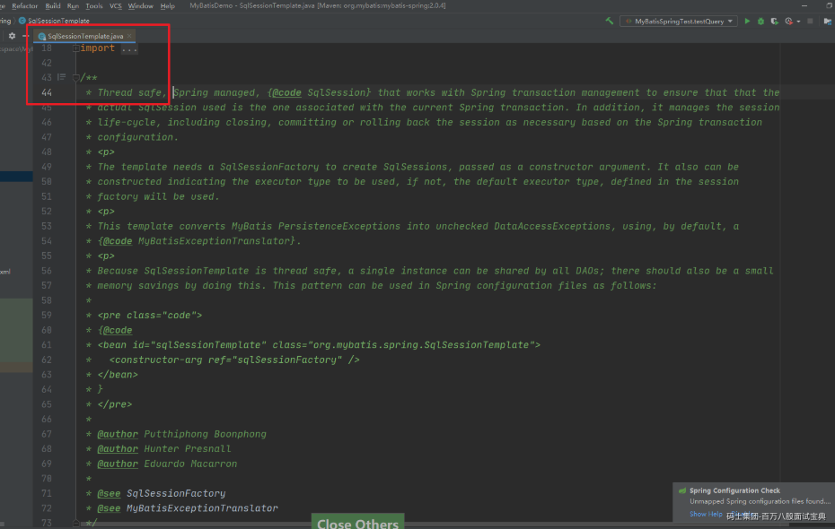

SqlSessionTemplate虽然跟DefaultSqlSession一样定义了操作数据的selectOne()、selectList()、insert()、update()、delete()等所有方法，但是没有自己的实现，全部调用了一个代理对象的方法。

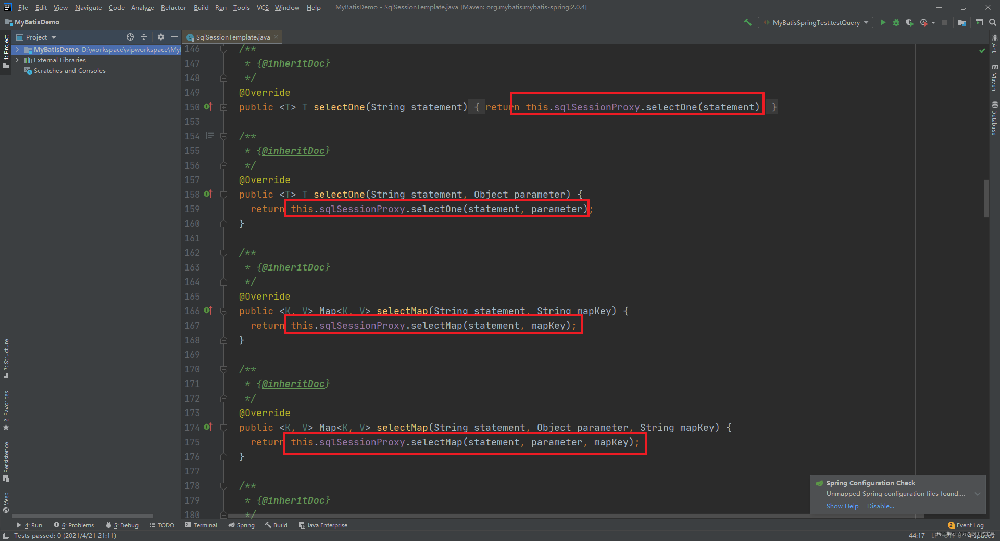

那么SqlSessionProxy是怎么来的呢？在SqlSessionTemplate的构造方法中有答案

```java
  public SqlSessionTemplate(SqlSessionFactory sqlSessionFactory, ExecutorType executorType,
      PersistenceExceptionTranslator exceptionTranslator) {

    notNull(sqlSessionFactory, "Property 'sqlSessionFactory' is required");
    notNull(executorType, "Property 'executorType' is required");

    this.sqlSessionFactory = sqlSessionFactory;
    this.executorType = executorType;
    this.exceptionTranslator = exceptionTranslator;
      // 创建了一个 SqlSession 接口的代理对象， 调用SqlSessionTemplate中的 selectOne() 方法，其实就是调用
      // SqlSessionProxy的 selectOne() 方法，然后执行的是 SqlSessionInterceptor里面的 invoke方法
    this.sqlSessionProxy = (SqlSession) newProxyInstance(SqlSessionFactory.class.getClassLoader(),
        new Class[] { SqlSession.class }, new SqlSessionInterceptor());
  }
```

通过上面的介绍那么我们应该进入到 SqlSessionInterceptor 的 invoke 方法中。

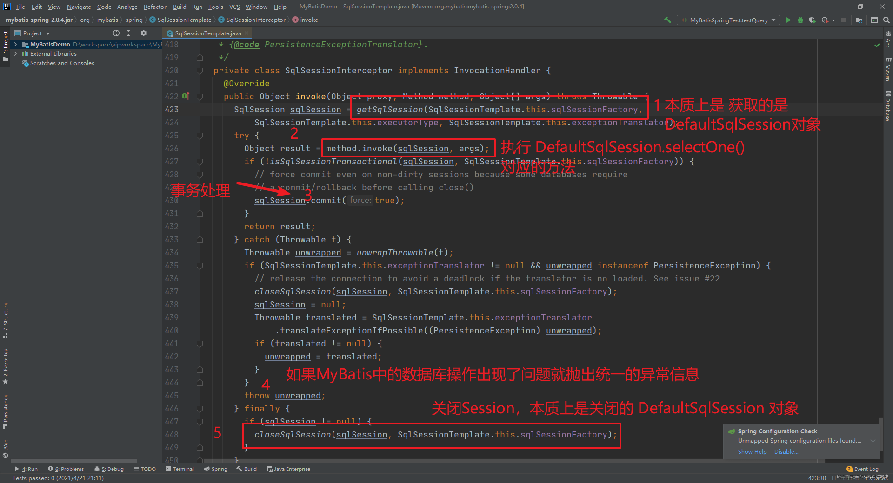

上面的代码虽然看着比较复杂，但是本质上就是下面的操作

```java
SqlSession session = null;
try {
   session = sqlSessionFactory.openSession();
  // 你的应用逻辑代码
}finally{
    session.close();
}
```

getSqlSession方法中的关键代码：

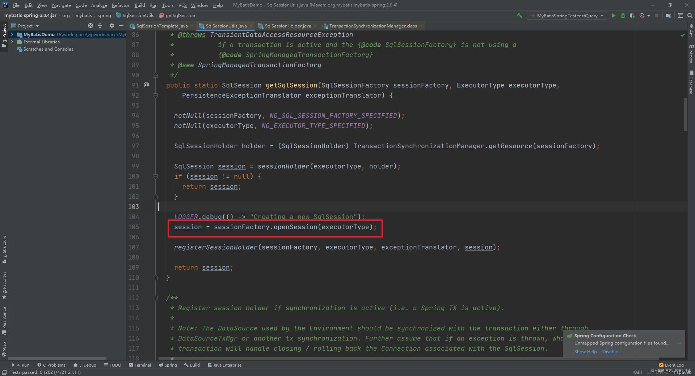

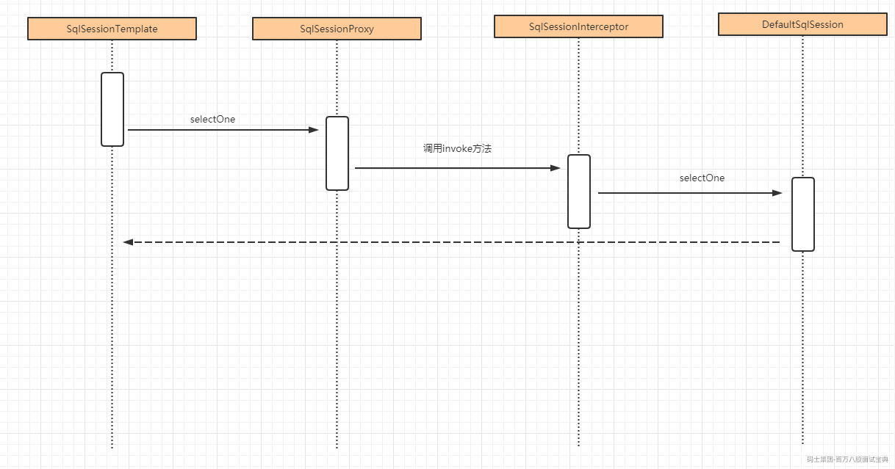

**总结一下**：因为DefaultSqlSession自己做不到每次请求调用产生一个新的实例，我们干脆创建一个代理类，也实现SqlSession，提供跟DefaultSqlSession一样的方法，在任何一个方法被调用的时候都先创建一个DefaultSqlSession实例，再调用被代理对象的相应方法。

MyBatis还自带了一个线程安全的SqlSession实现：SqlSessionManager，实现方式一样，如果不集成到Spring要保证线程安全，就用SqlSessionManager。

#### 2.2.3 SqlSessionDaoSupport

通过上面的介绍我们清楚了在Spring项目中我们应该通过SqlSessionTemplate来执行数据库操作，那么我们就应该首先将SqlSessionTemplate添加到IoC容器中，然后我们在Dao通过@Autowired来获取具体步骤参考官网：<http://mybatis.org/spring/zh/sqlsession.html>

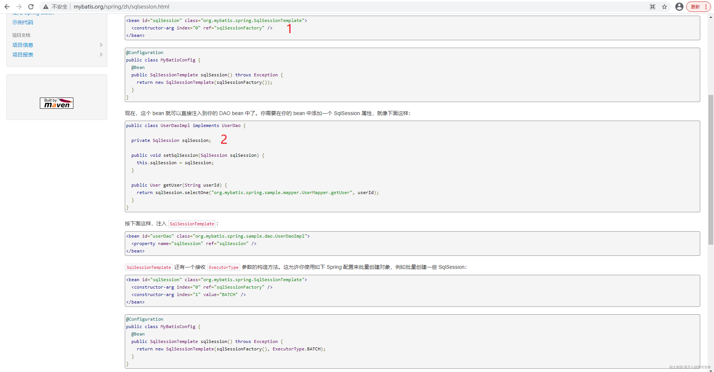

然后我们可以看看SqlSessionDaoSupport中的代码

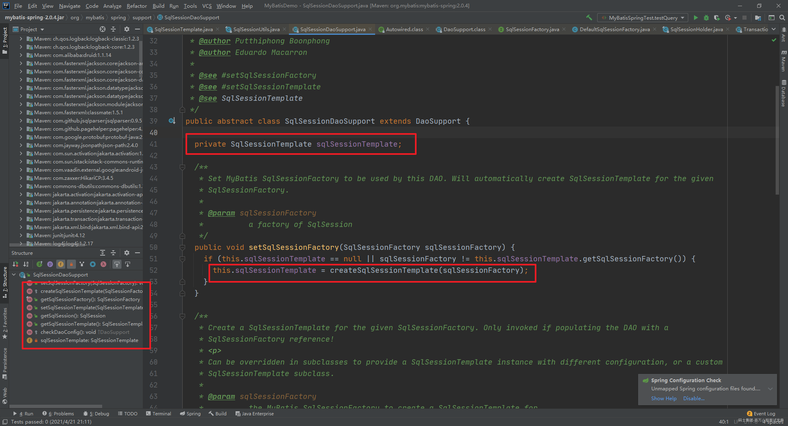

如此一来在Dao层我们就只需要继承 SqlSessionDaoSupport就可以通过getSqlSession方法来直接操作了。

```java
public abstract class SqlSessionDaoSupport extends DaoSupport {

 private SqlSessionTemplate sqlSessionTemplate;

 public SqlSession getSqlSession() {
   return this.sqlSessionTemplate;
}
// 其他代码省略
```

也就是说我们让DAO层（实现类）继承抽象类SqlSessionDaoSupport，就自动拥有了getSqlSession()方法。调用getSqlSession()就能拿到共享的SqlSessionTemplate。

在DAO层执行SQL格式如下：

```java
getSqlSession().selectOne(statement, parameter);
getSqlSession().insert(statement);
getSqlSession().update(statement);
getSqlSession().delete(statement);
```

还是不够简洁。为了减少重复的代码，我们通常不会让我们的实现类直接去继承SqlSessionDaoSupport，而是先创建一个BaseDao继承SqlSessionDaoSupport。在BaseDao里面封装对数据库的操作，包括selectOne()、selectList()、insert()、delete()这些方法，子类就可以直接调用。

```java
public  class BaseDao extends SqlSessionDaoSupport {
   //使用sqlSessionFactory
   @Autowired
   private SqlSessionFactory sqlSessionFactory;

   @Autowired
   public void setSqlSessionFactory(SqlSessionFactory sqlSessionFactory) {
       super.setSqlSessionFactory(sqlSessionFactory);
  }

   public Object selectOne(String statement, Object parameter) {
       return getSqlSession().selectOne(statement, parameter);
  }
// 后面省略
```

然后让我们的DAO层实现类继承BaseDao并且实现我们的Mapper接口。实现类需要加上@Repository的注解。

在实现类的方法里面，我们可以直接调用父类（BaseDao）封装的selectOne()方法，那么它最终会调用sqlSessionTemplate的selectOne()方法。

```java
@Repository
public class EmployeeDaoImpl extends BaseDao implements EmployeeMapper {
   @Override
   public Employee selectByPrimaryKey(Integer empId) {
       Employee emp = (Employee) this.selectOne("com.boboedu.crud.dao.EmployeeMapper.selectByPrimaryKey",empId);
       return emp;
  }
// 后面省略
```

然后在需要使用的地方，比如Service层，注入我们的实现类，调用实现类的方法就行了。我们这里直接在单元测试类DaoSupportTest.java里面注入：

```java
@Autowired
EmployeeDaoImpl employeeDao;

@Test
public void EmployeeDaoSupportTest() {
   System.out.println(employeeDao.selectByPrimaryKey(1));
}
```

最终会调用到DefaultSqlSession的方法。

#### 2.2.4 MapperScannerConfigurer

上面我们介绍了SqlSessionTemplate和SqlSessionDaoSupport，也清楚了他们的作用，但是我们在实际开发的时候，还是能够直接获取到 Mapper 的代理对象，并没有创建Mapper的实现类，这个到底是怎么实现的呢？这个我们就要注意在整合MyBatis的配置文件中除了SqlSessionFactoryBean以外我们还设置了一个MapperScannerConfigurer，我们来分析下这个类

首先是MapperScannerConfigurer的继承结构

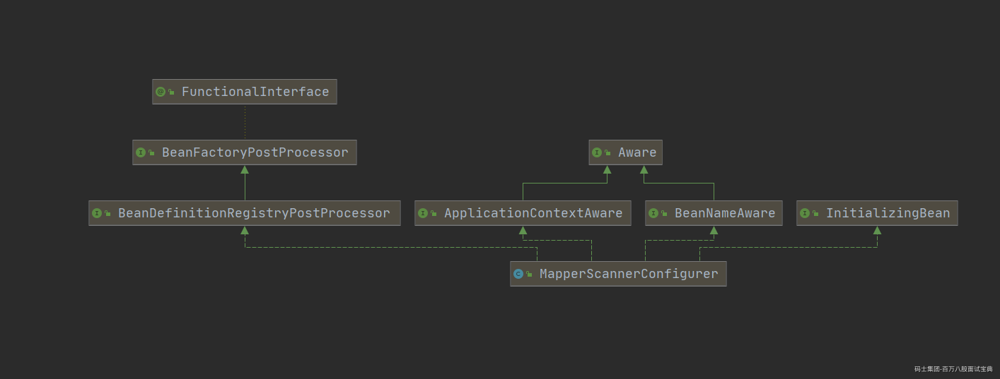

MapperScannerConfigurer实现了BeanDefinitionRegistryPostProcessor接口。BeanDefinitionRegistryPostProcessor 是BeanFactoryPostProcessor的子类，里面有一个postProcessBeanDefinitionRegistry()方法。

实现了这个接口，就可以在Spring创建Bean之前，修改某些Bean在容器中的定义。Spring创建Bean之前会调用这个方法。

```java
  @Override
  public void postProcessBeanDefinitionRegistry(BeanDefinitionRegistry registry) {
    if (this.processPropertyPlaceHolders) {
      processPropertyPlaceHolders(); // 处理 占位符
    }

      // 创建 ClassPathMapperScanner 对象
    ClassPathMapperScanner scanner = new ClassPathMapperScanner(registry);
    scanner.setAddToConfig(this.addToConfig);
    scanner.setAnnotationClass(this.annotationClass);
    scanner.setMarkerInterface(this.markerInterface);
    scanner.setSqlSessionFactory(this.sqlSessionFactory);
    scanner.setSqlSessionTemplate(this.sqlSessionTemplate);
    scanner.setSqlSessionFactoryBeanName(this.sqlSessionFactoryBeanName);
    scanner.setSqlSessionTemplateBeanName(this.sqlSessionTemplateBeanName);
    scanner.setResourceLoader(this.applicationContext);
    scanner.setBeanNameGenerator(this.nameGenerator);
    scanner.setMapperFactoryBeanClass(this.mapperFactoryBeanClass);
    if (StringUtils.hasText(lazyInitialization)) {
      scanner.setLazyInitialization(Boolean.valueOf(lazyInitialization));
    }
      // 根据上面的配置生成对应的 过滤器
    scanner.registerFilters();
      // 开始扫描basePackage字段中指定的包及其子包
    scanner.scan(
        StringUtils.tokenizeToStringArray(this.basePackage, ConfigurableApplicationContext.CONFIG_LOCATION_DELIMITERS));
  }
```

上面代码的核心是 scan方法

```java
public int scan(String... basePackages) {
    int beanCountAtScanStart = this.registry.getBeanDefinitionCount();
    this.doScan(basePackages);
    if (this.includeAnnotationConfig) {
        AnnotationConfigUtils.registerAnnotationConfigProcessors(this.registry);
    }

    return this.registry.getBeanDefinitionCount() - beanCountAtScanStart;
}
```

然后会调用子类ClassPathMapperScanner 中的 doScan方法

```java
  @Override
  public Set<BeanDefinitionHolder> doScan(String... basePackages) {
      // 调用父类中的 doScan方法 扫描所有的接口，把接口全部添加到beanDefinitions中。
    Set<BeanDefinitionHolder> beanDefinitions = super.doScan(basePackages);

    if (beanDefinitions.isEmpty()) {
      LOGGER.warn(() -> "No MyBatis mapper was found in '" + Arrays.toString(basePackages)
          + "' package. Please check your configuration.");
    } else {
        // 在注册beanDefinitions的时候，BeanClass被改为MapperFactoryBean
      processBeanDefinitions(beanDefinitions);
    }

    return beanDefinitions;
  }
```

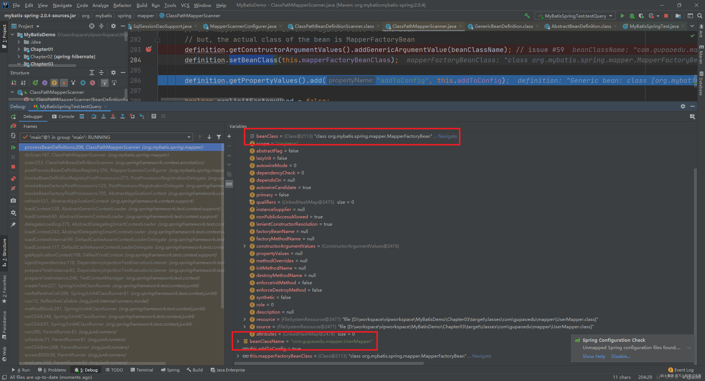

因为一个接口是没法创建实例对象的，这时我们就在创建对象之前将这个接口类型指向了一个具体的普通Java类型，MapperFactoryBean .也就是说，所有的Mapper接口，在容器里面都被注册成一个支持泛型的MapperFactoryBean了。然后在创建这个接口的对象时创建的就是MapperFactoryBean 对象。

#### 2.2.5 MapperFactoryBean

为什么要注册成它呢？那注入使用的时候，也是这个对象，这个对象有什么作用？首先来看看他们的类图结构

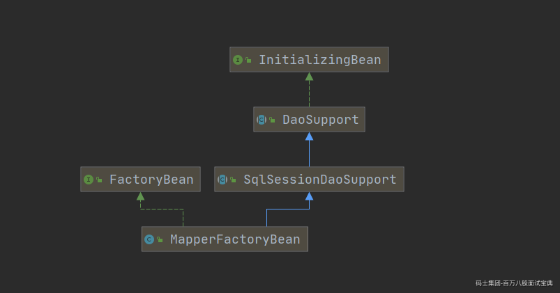

从类图中我们可以看到MapperFactoryBean继承了SqlSessionDaoSupport,那么每一个注入Mapper的地方，都可以拿到SqlSessionTemplate对象了。然后我们还发现MapperFactoryBean实现了 FactoryBean接口，也就意味着，向容器中注入MapperFactoryBean对象的时候，本质上是把getObject方法的返回对象注入到了容器中，

```java
  /**
   * {@inheritDoc}
   */
  @Override
  public T getObject() throws Exception {
     // 从这可以看到 本质上 Mapper接口 还是通过DefaultSqlSession.getMapper方法获取了一个JDBC的代理对象，和我们前面讲解的就关联起来了
    return getSqlSession().getMapper(this.mapperInterface);
  }
```

它并没有直接返回一个MapperFactoryBean。而是调用了SqlSessionTemplate的getMapper()方法。SqlSessionTemplate的本质是一个代理，所以它最终会调用DefaultSqlSession的getMapper()方法。后面的流程我们就不重复了。也就是说，最后返回的还是一个JDK的动态代理对象。

所以最后调用Mapper接口的任何方法，也是执行MapperProxy的invoke()方法，后面的流程就跟编程式的工程里面一模一样了

总结一下，Spring是怎么把MyBatis继承进去的？

1、提供了SqlSession的替代品SqlSessionTemplate，里面有一个实现了实现了InvocationHandler的内部SqlSessionInterceptor，本质是对SqlSession的代理。

2、提供了获取SqlSessionTemplate的抽象类SqlSessionDaoSupport。

3、扫描Mapper接口，注册到容器中的是MapperFactoryBean，它继承了SqlSessionDaoSupport，可以获得SqlSessionTemplate。

4、把Mapper注入使用的时候，调用的是getObject()方法，它实际上是调用了SqlSessionTemplate的getMapper()方法，注入了一个JDK动态代理对象。

5、执行Mapper接口的任意方法，会走到触发管理类MapperProxy，进入SQL处理流程。

核心对象：

|  |  |
| --- | --- |
| **对象** | **生命周期** |
| SqlSessionTemplate | Spring中SqlSession的替代品，是线程安全的 |
| SqlSessionDaoSupport | 用于获取SqlSessionTemplate |
| SqlSessionInterceptor（内部类） | 代理对象，用来代理DefaultSqlSession，在SqlSessionTemplate中使用 |
| MapperFactoryBean | 代理对象，继承了SqlSessionDaoSupport用来获取SqlSessionTemplate |
| SqlSessionHolder | 控制SqlSession和事务 |

## 3.设计模式总结

|  |  |
| --- | --- |
| 设计模式 | **类** |
| 工厂模式 | SqlSessionFactory、ObjectFactory、MapperProxyFactory |
| 建造者模式 | XMLConfigBuilder、XMLMapperBuilder、XMLStatementBuidler |
| 单例模式 | SqlSessionFactory、Configuration、ErrorContext |
| 代理模式 | 绑定：MapperProxy 延迟加载：ProxyFactory &#x3c;br/>插件：PluginSpring &#x3c;br>集成MyBaits： SqlSessionTemplate的内部SqlSessionInterceptorMyBatis&#x3c;br>自带连接池：PooledConnection&#x3c;br/>日志打印：ConnectionLogger、StatementLogger |
| 适配器模式 | Log，对于Log4j、JDK logging这些没有直接实现slf4j接口的日志组件，需要适配器 |
| 模板方法 | BaseExecutor、SimpleExecutor、BatchExecutor、ReuseExecutor |
| 装饰器模式 | LoggingCache、LruCache对PerpetualCacheCachingExecutor对其他Executor |
| 责任链模式 | Interceptor、InterceptorChain |
