**微服务架构筑基**

**软件架构演进**

软件架构的发展经历了从单体结构、垂直架构、SOA架构到微服务架构的过程.

1.**单体架构**

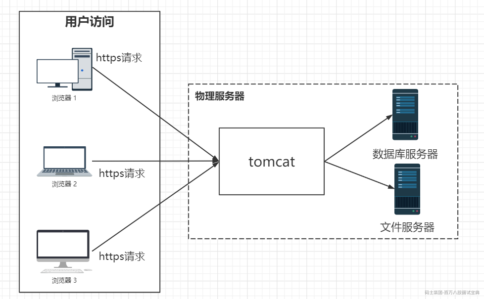

**特点：**

1、所有的功能集成在一个项目工程中。

2、所有的功能打一个war包部署到服务器。

3、应用与数据库分开部署。

4、通过部署应用集群和数据库集群来提高系统的性能。

**优点：**

1、项目架构简单，前期开发成本低，周期短，小型项目的首选。

**缺点：**

1、全部功能集成在一个工程中，对于大型项目不易开发、扩展及维护。

2、系统性能扩展只能通过扩展集群结点，成本高、有瓶颈。

3、技术栈受限。

2.**集群架构**

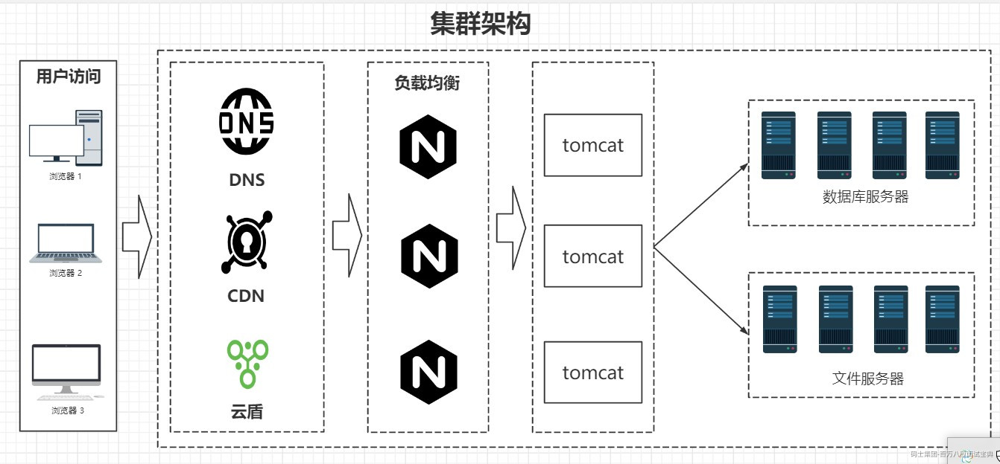

**特点：**

在单体架构的基础上进行了水平扩容

3.**垂直架构**

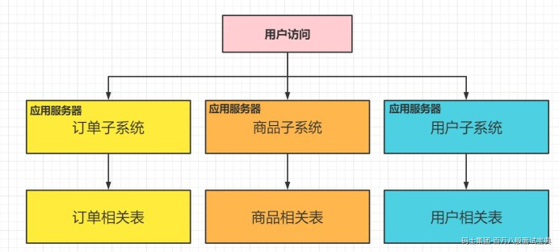

**特点：**

1、以单体结构规模的项目为单位进行垂直划分项目即将一个大项目拆分成一个一个单体结构项目。

2、项目与项目之间的存在数据冗余，耦合性较大，比如上图中三个项目都存在客户信息。

3、项目之间的接口多为数据同步功能，如：数据库之间的数据库，通过网络接口进行数据库同步。

**优点：**

1、项目架构简单，前期开发成本低，周期短，小型项目的首选。

2、通过垂直拆分，原来的单体项目不至于无限扩大。

3、不同的项目可采用不同的技术。

**缺点：**

1、全部功能集成在一个工程中，对于大型项目不易开发、扩展及维护。

2、系统性能扩展只能通过扩展集群结点，成本高、有瓶颈。

4.SOA**架构 特点：**

1、基于SOA的架构思想将重复公用的功能抽取为组件，以服务的方式给各各系统提供服务。

2、各各项目（系统）与服务之间采用webservice、rpc等方式进行通信。

3、ESB企业服务总线作为项目与服务之间通信的桥梁。解决**信息孤岛**

**优点：**

1、将重复的功能抽取为服务，提高开发效率，提高系统的可重用性、可维护性。

2、可以针对不同服务的特点制定集群及优化方案。

3、采用ESB减少系统中的接口耦合。

**缺点：**

1、系统与服务的界限模糊，不利于开发及维护。

2、虽然使用了ESB，但是服务的接口协议不固定，种类繁多，不利于系统维护。

3、抽取的服务的粒度过大，系统与服务之间耦合性高。

5.**微服务架构**

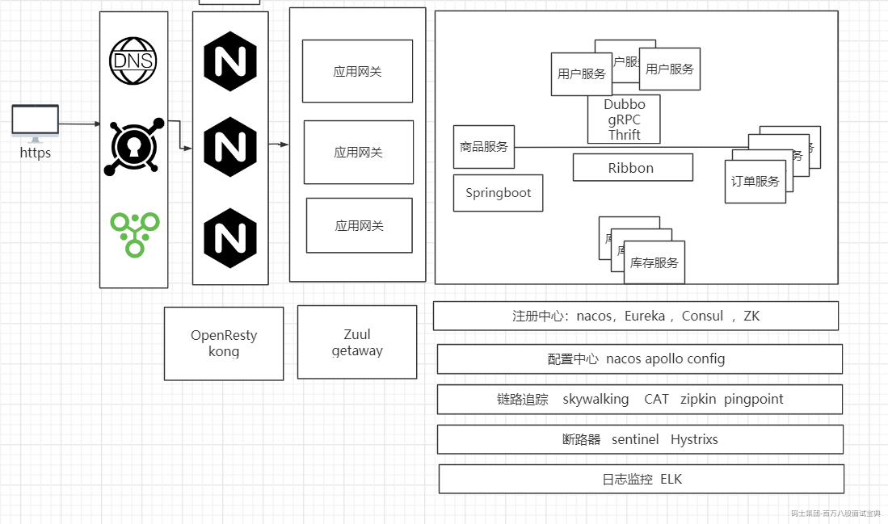

**特点：**

1、将系统服务层完全独立出来，并将服务层抽取为一个一个的微服务。

2、微服务遵循单一原则。

3、微服务之间采用RESTful等轻量协议传输。

4、**解耦**

**优点：**

1、服务拆分粒度更细，有利于资源重复利用，提高开发效率。

2、可以更加精准的制定每个服务的优化方案，提高系统可维护性。

3、微服务架构采用去中心化思想，服务之间采用RESTful等轻量协议通信，相比ESB更轻量。

4、适用于互联网时代，产品迭代周期更短。

**缺点：**

1、微服务过多，服务治理成本高，不利于系统维护。

2、分布式系统开发的技术成本高（容错、分布式事务等），对团队挑战大。

**微服务与**SOA**的区别**

SOA：解决服务可复用性 ，信息孤岛 微服务： 解耦 拓展

**微服务解决方案之**SpringCloud

构建分布式系统不需要复杂和容易出错。Spring Cloud 为最常见的分布式系统模式提供了一种简单且易 于接受的编程模型，帮助开发人员构建有弹性的、可靠的、协调的应用程序。Spring Cloud 构建于 Spring Boot 之上，使得开发者很容易入手并快速应用于生产中。

我所理解的 Spring Cloud 就是微服务系统架构的一站式解决方案，在平时我们构建微服务的过程中需 要做如 **服务发现注册** 、**配置中心** 、**消息总线** 、**负载均衡** 、**断路器** 、**数据监控** 等操作，而 Spring Cloud 为我们提供了一套简易的编程模型，使我们能在 Spring Boot 的基础上轻松地实现微服务项目的 构建。

**服务通信**

作用：解决服务间通信

1.远程调用过程(Remote procedure call)，也叫做RPC

2.基于Rest风格的Http

RPC**与**HTTP**的区别**

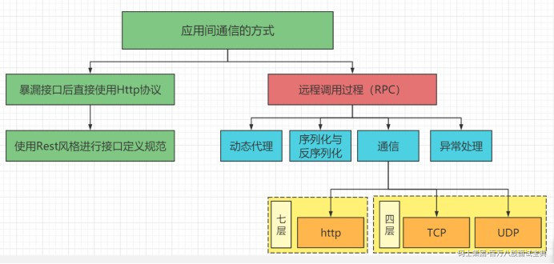

**应用网关**

作用：api网关，路由，负载均衡等多种作用 **什么是有状态的服务呢？** 两个来自相同发起者的请求在服务器端是否具备上下文关系 **注册中心**

作用：解决服务治理问题（服务发现，服务续约，服务下线，动态感知等）

**负载均衡** 作用：，主要提供客户侧的软件负载均衡算法。 **配置中心** 作用：解决配置一致化问题以及统一管理 **链路追踪** 作用：优化系统瓶颈以及生成网络拓扑 **日志监控**

作用：日志数据分析可视化

**断路器**

作用：断路器，保护系统，控制故障范围。

Nacos

Nacos官方文档：

<https://nacos.io/zh-cn/docs/what-is-nacos.html>

Nacos**是什么**

Nacos提供了统一配置管理、服务发现与注册。 其中服务注册和发现的功能，相当于dubbo里面使用到的zookeeper、 或者spring cloud里面应用到的

consoul以及eureka。

而统一配置管理则相当于Spring Cloud Config或者携程的apollo

他是一个多功能集成组件。 Nacos**的特性** **服务发现和服务健康监测**

Nacos提供了基于RPC的服务发现，服务提供者可以将自身的服务通过原生API或者openApi来实现服务 的注册，服务消费者可以使用API或者Http来查找和发现服务

同时，Nacos提供了对服务的实时监控检查，当发现服务不可用时，可以实现对服务的动态下线从而阻 止服务消费者向不健康的服务发送请求。

**配置管理**

传统的配置管理，是基于项目中的配置文件来实现，当出现配置文件变更时需要重新部署，而动态配置 中心可以将配置进行统一的管理，是的配置变得更加灵活以及高效。

动态配置中心可以实现路由规则的动态配置、限流规则的动态配置、动态数据源、开关、动态UI等场景 国内比较有名的开源配置中心: Apollo / Spring Cloud Config/ disconf **简述服务配置中心和注册中心**

**服务注册中心**

服务注册中心是服务实现服务化管理的核心组件，类似于目录服务的作用，主要用来存储服务信息，譬 如提供者 url 串、路由信息等。服务注册中心是微服务架构中最基础的设施之一。

注册中心可以说是微服务架构中的“通讯录”，它记录了服务和服务地址的映射关系。在分布式架构中， 服务会注册到这里，当服务需要调用其它服务时，就到这里找到服务的地址，进行调用。

简单理解就是：在没有注册中心时候，服务间调用需要知道被当服务调方的具体地址（写死的 ip:port）。更换部署地址，就不得不修改调用当中指定的地址。而有了注册中心之后，每个服务在调用 别人的时候只需要知道服务名称（软编码）就好，地址都会通过注册中心根据服务名称获取到具体的服 务地址进行调用。

**注册中心相关特性面试点**

服务治理相关功能（服务注册，服务获取，服务下线等）

这是一个注册中心的基本功能，拥有这些功能才能算得上是一个注册中心

架构特性

CAP定理 可用性 一致性 分区容错性 **配置中心** 随着业务的发展、微服务架构的升级，服务的数量、程序的配置日益增多（各种微服务、各种服务器地

址、各种参数），传统的配置文件方式和数据库的方式已无法满足开发人员对配置管理的要求：

安全性：配置跟随源代码保存在代码库中，容易造成配置泄漏；

时效性：修改配置，需要重启服务才能生效； 局限性：无法支持动态调整：例如日志开关、功能开关；

因此，我们需要配置中心来统一管理配置！把业务开发者从复杂以及繁琐的配置中解脱出来，只需专注 于业务代码本身，从而能够显著提升开发以及运维效率。同时将配置和发布包解藕也进一步提升发布的 成功率，并为运维的细力度管控、应急处理等提供强有力的支持。

**配置中心相关特性面试点**

配置隔离

环境隔离：不同环境配置隔离（开发、测试、预发布、灰度/线上）

访问层面的隔离：比如命名空间，不同的空间相互是隔离的，不能相互访问

配置推送刷新

配置在修改后能够实时的推送到应用程序中进行更新，这个是最重要的一个功能，用户体验也是非 常好的。在没用配置中心之前，有用 Mysql 进行配置存储的，为了提高性能，减小数据库的压 力，配置信息读取后会放入缓存中，后台会启动一个定时线程去更新，比如 1 分钟一次。

这样带来的问题就是配置改完后需要等待一定的时间客户端才能更新好，一般场景都没啥问题，对 于一些特殊的场景还是需要改完立马生效，才能尽可能避免某些业务问题带来的损失。

对于配置修改及时更新的实现方式目前主要分为两种：推和拉。 拉模式前面讲过了，有时间间隔问题，就算设置的很快，比如 1 秒一次，频率太高会导致服务端

压力过大。

推模式是比较好的方式，当服务端有变动的时候将变更的信息推送给客户端，即及时又能减轻定时 拉取的频率。

更好的方式是推拉结合，目前主流的配置中心都是采用这种方式。推保证及时性，拉用于兜底，保 证最终配置一致性，推拉结合的模式可以将拉取的时间放长，降低服务端压力。

**实现一个注册中心应该要考虑些什么？**

咱们今天主要来聊Nacos注册中心方面的功能，做为一个注册中心，实际上不管是Nacos，Eureka，只 要是身份注册中心，那么必然会有三大核心要素

举例：订单需要商品的相关信息，所以需要订单与商品模块进行通信。而通信的前提是我需要你的Ip， 端口号以及对应的serviceName

**服务提供者**

服务提供者，将自己的服务信息（IP，端口号，serviceName等）提供到注册中心服务端上去。

**服务消费者**

服务的消费者，用来获取服务列表，并且通过应用负载均衡策略调用相应服务的提供者

**注册中心服务端**

注册中心的服务端，提供服务注册与发现功能。 而我们注册中心的所有操作其实就是这三个核心要素之间的交互。以及其自身的内部结构剖析。

服务提供者把自己的协议地址注册到Nacos server

服务消费者需要从Nacos Server上去查询服务提供者的地址（根据服务名称） Nacos Server需要感知到服务提供者的上下线的变化 服务消费者需要动态感知到Nacos Server端服务地址的变化

当实现了上述功能之后，我们注册中心的雏形才初步建立。

那么我们的nacos是怎么做的呢？

我们可以尝试着分析一下nacos的注册流程。 Nacos**的基本应用** 首先，我们需要先启动Nacos服务，启动服务有两种方式，一种是直接下载已经编译好的包直接运行。 另一种是通过源码来构建。 我们先使用第一种方式 因为目前版本发布比较频繁，所以我们讲的时候，它的内容也一直在变化。基本上我们只需要简单了解 它的应用就行

**配置数据库**

进入conf文件夹，配置Nacos的数据库。 首先新建一个数据库，名称随意，最好为nacos。

然后导入conf下的mysql-nacos.sql脚本

在application.properties文件中找到如下图中位置，修改数据库连接

### If use MySQL as datasource:

spring.datasource.platform=mysql //数据库连接类型

### Count of DB:

db.num=1 //数据库数量

### Connect URL of DB:

db.url.0=jdbc:mysql://127.0.0.1:3306/nacos?

characterEncoding=utf8&connectTimeout=1000&socketTimeout=3000&autoReconnect=true

&useUnicode=true&useSSL=false&serverTimezone=UTC //ip端口号以及数据库名称

db.user.0=root //数据库账号

db.password.0=root //数据库密码

**单节点启动服务**

bin目录下

linux系统下： sh startup.sh -m standalone

window系统： cmd startup.cmd

不过windows启动前需要先进行改动startup.cmd脚本

将set MODE="cluster" 改为 set MODE="standalone"

**启动成功后访问页面**

地址： <http://localhost:8848/nacos/>

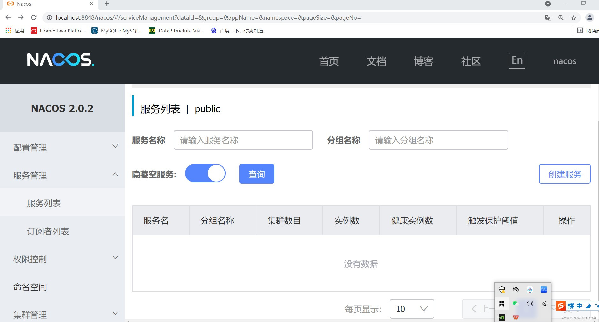

建立一个Maven模板项目，添加Dubbo以及Nacos配置中心以及注册中心相关依赖

建立完成之后配置

application.properties文件中：

# Nacos 服务发现与注册配置，其中子属性 server-addr 指定 Nacos 服务器主机和端口

spring.cloud.nacos.discovery.service-addr= 192.168.1.44:8848

bootstrap.properties文件中

# 设置配置中心服务端地址 我们这节课只讲解注册中心 可以注释

spring.cloud.nacos.config.server-addr=192.168.1.44:8848

这个时候我们启动项目，可以发现我们的项目已经注册到我们的Nacos之上

那么这个时候我们已经完成了我们的注册中心应该拥有的第一个功能 服务提供者把自己的协议地址注册到Nacos server

那么他到底是如何完成的我们的注册操作呢？

Nacos**架构原理剖析**

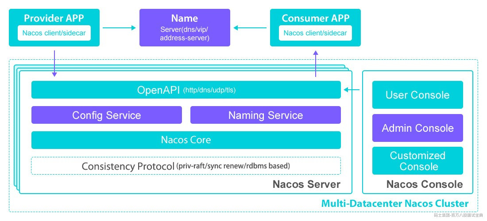

**服务** (Service)

服务是指一个或一组软件功能（例如特定信息的检索或一组操作的执行），其目的是不同的客户端可以 为不同的目的重用（例如通过跨进程的网络调用）。Nacos 支持主流的服务生态，如 Kubernetes Service、gRPC|Dubbo RPC Service 或者 Spring Cloud RESTful Service.

**服务注册中心** (Service Registry)

服务注册中心，它是服务，其实例及元数据的数据库。服务实例在启动时注册到服务注册表，并在关闭 时注销。服务和路由器的客户端查询服务注册表以查找服务的可用实例。服务注册中心可能会调用服务 实例的健康检查 API 来验证它是否能够处理请求。

**服务元数据** (Service Metadata)

服务元数据是指包括服务端点(endpoints)、服务标签、服务版本号、服务实例权重、路由规则、安全策 略等描述服务的数据

**服务提供方** (Service Provider) 是指提供可复用和可调用服务的应用方 **服务消费方** (Service Consumer) 是指会发起对某个服务调用的应用方

**交互逻辑**

实际上我们会发现，我们的交互是由服务注册中心，服务提供方，以及消费者三方进行逻辑交互，并且 借用服务元数据做为交互资料。并且由最底层的算法来保证其架构特性。

**服务治理相关功能源码解析**

**源码下载**

git clone https://github.com/alibaba/nacos.git

将编译完成的nacos源码导入到idea开发工具中；进入到nacos-console模块下，启动该模块下的

com.alibaba.nacos.Nacos类。

但通常情况下，会报如下错误：

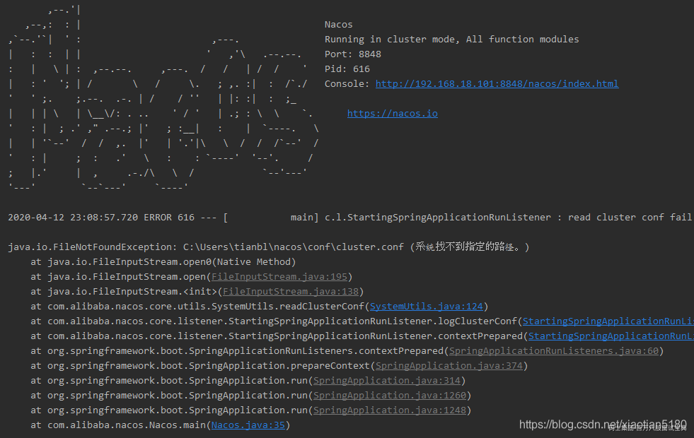

这是由于nacos默认使用的是集群方式，启动时会到默认的配置路径下，寻找集群配置文件 cluster.conf。 我们源码运行时，通常使用的是单机模式，因此需要在启动参数中进行设置，在jvm的启动参数中，添 加

-Dnacos.standalone=true

设置完毕后，再次启动时，nacos启动成功，打开<http://192.168.18.101:8848/nacos/index.html>控制

台首页，使用默认的用户名/密码（nacos/nacos）即可以正常登录成功。

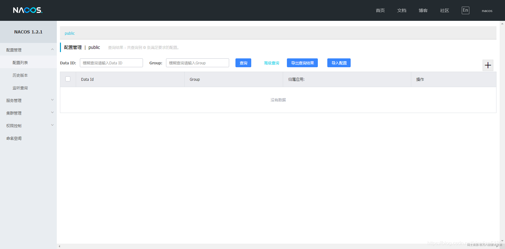

1.**服务注册源码分析**

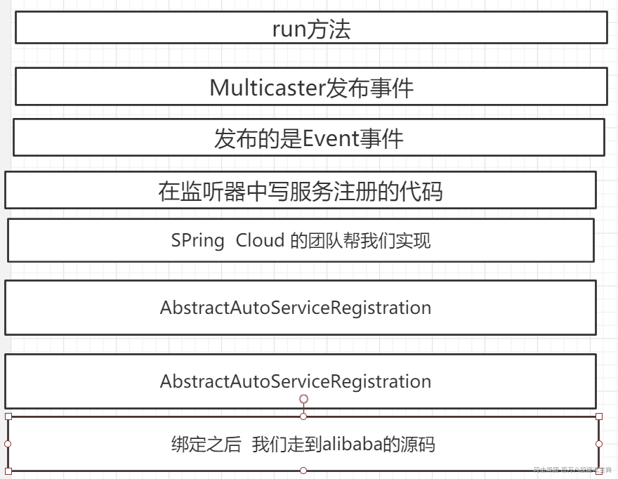

**限流组件**

**高并发架构下的限流和降级策略实战**

**互联网三高架构之高并发**

有没有同学知道三高是哪三高？高血压，高血糖，高血脂。我们人的身体有三高，互联网架构同样也有 三高。

那有没有同学知道互联网三高架构是哪三高？ 并非高血压，高血糖，高血脂。互联网三高架构：高并发、高性能、高可用，简称三高（3H） 。 互联

网应用系统开发肯定经常会看到高并发、高性能以及高可用这三个词，但是他具体的含义和关系真的如

你所想的那样吗？你真正的理解它是什么了吗？我们今天的重点就是互联网三高之高并发。

高并发（High Concurrency）是一种系统运行过程中遇到的一种“短时间内遇到大量操作请求”的情况， 主要发生在web系统集中大量访问收到大量请求

（例如：12306的抢票情况或者天猫双十一活动）。该情况的发生会导致系统在这段时间内执行大量操 作，例如对资源的请求，数据库的操作等。

**高并发的常用指标**

高并发相关常用的一些指标有:

响应时间，吞吐量 ，QPS,TPS，并发用户数。

1.**响应时间（**Response Time**）**

响应时间：系统对请求做出响应的时间。例如系统处理一个HTTP请求需要200ms，这个200ms就是系 统的响应时间

2.**吞吐量（**Throughput**）（开车）**

吞吐量：单位时间内处理的请求数量。

3.**每秒查询率**QPS**（**Query Per Second**）** QPS：每秒响应请求数。在互联网领域，这个指标和吞吐量区分的没有这么明显。 TPS：是TransactionsPerSecond的缩写，也就是事务数/秒。它是软件测试结果的测量单位。一个事务

是指一个客户机向服务器发送请求然后服务器做出反应的过程。客户机在发送请求时开始计时，收到服

务器响应后结束计时，以此来计算使用的时间和完成的事务个数，

Qps基本类似于Tps，但是不同的是，对于一个页面的一次访问，形成一个Tps；但一次页面请求，可能 产生多次对服务器的请求，服务器对这些请求，就可计入“Qps”之中。

访问一个页面会请求服务器3次，一次放，产生一个TPS，产生3个QPS

4.**并发用户数**

并发用户数：同时承载正常使用系统功能的用户数量。例如一个即时通讯系统，同时的在线量一定程度 上代表了系统的并发用户数。

**什么算高并发？**

在了解了这几个指标之后，可能有同学会说，老师，老师，那到底多少并发用户数，多少QPS，多少

TPS算高并发呢，这个东西能不能量化呢？

这个问题的答案不是一个数字。 场景：

固态硬盘SSD（Solid State Disk）说：我读取和写入高达 1000MB/秒

mysql说：我单机TPS10000+ nginx说：我单机QPS10W+ 秀儿说：给我一台56核200G高配物理机，我可以创建一个单机QPS1000W

不在同一维度，没有任何前提，无法比较谁更牛。“我的系统算不算高并发？”这个问题就如同一个女孩 子爱问的问题：“我美不美？”

比较的维度不一样，你的感知也不一样，其实在企业架构中，我们更应该关注的事情是什么，是我的并 发是否已经达到了我当前系统的瓶颈，如果达到了我当前的系统瓶颈，我怎么去打破他，如果现在还没 有达到你的系统瓶颈，那么请告诉我，你当时架构设计的时候有没有考虑到你后续可能会出现的并发问 题。（可能大部分的同学会说，我当时压根就没有考虑过并发，这样想的同学给我Q个1）。

总而言之，我们在考虑并发问题的时候，永远要先考虑能不能在现有的资源下突破我们的性能瓶颈，而 不是优先考虑增加机器，增加成本来保证我的系统的稳定性。

那么这个时候我们是不是应该有什么方案呢？ 而且我们做高并发，肯定需要做到的是预先做好方案，而不是等到并发来了之后再临时想解决方案，这

样肯定是不对的，我们预先就会根据运营的方针对我们系统的一系列数据进行预估，根据预估的情况来

设计我们的架构，预估我们需要采购的服务器。

比如运营预估并发用户大概10W左右，那么这10W用户有多少会下单，有多少会走到订单那一系列的链 路，比如5W，然后这就是5W个TPS，然后订单这条链路调用类似库存，积分这样的微服务大概会有10-

20次。那么每个就是10-20个QPS ，根据这样的计算，我们才能真正估算出我们的系统该怎么设计最节 省资源，怎么设计才会最好。

**如何解决高并发**

比如我们现在正在开发12306系统，这个时候，春节过节回家抢票的时候。在我们放票的一瞬间，是不 是会有非常多的请求给到我们，那么是不是就形成了一个高并发场景。这个时候，我们会用什么手段对 我们的系统进行保护，让我们的系统不至于被大量的请求瞬间击溃呢？

在开发高并发系统时，有三把利器来保护系统：缓存、降级、限流。 缓存的目的是提升系统访问速度和增大系统处理的容量，可以说是抗高并发流量的银弹；

降级是当服务出问题或者影响到核心流程的性能则需要暂时屏蔽掉某些功能，等高峰或者问题解决后再 打开；

而有些场景并不能用缓存和降级来解决，比如秒杀、抢购；写服务（评论、下单）、频繁的复杂查询， 因此需要一种手段来限制这些场景的并发/请求量，这就是：限流。

**限流的策略**

限流，故名思意，限制流量，他实际上是对资源访问做控制的一个组件实现或者功能实现，那么怎么控 制呢？这块主要有两个策略：

限流策略和熔断策略。 对于熔断策略，不同的系统有不同的熔断策略诉求，有得系统希望直接拒绝服务、有的系统希望排队等

待、有的系统希望服务降级。限流服务这块有两个核心概念：资源和策略

资源：被流量控制的对象，比如接口 策略：限流策略由限流算法和可调节的参数两部份组成 而我们的限流算法基本上是基于两个维度来判断我们的参数设置

基于请求限流：指从外部请求的角度考虑限流。 基于资源限流：指从系统内部考虑，找到影响性能的关键资源，对其使用上限限制。

限流的目的是通过对并发访问/请求进行限速或者一个时间窗口内的请求进行限速来保护系统，一旦达到 限制速率则可以拒绝服务（定向到错误页或者告知资源没有了）、排队或等待(秒杀、下单)、降级（返回 兜底数据或默认数据或默认数据，如商品详情页库存默认有货）

一般互联网企业常见的限流方案有：限制总并发数（如数据库连接池、线程池）、限制瞬时并发数

（nginx的limit\_conn模块，用来限制瞬时并发连接数，limit\_req模块，限制并发请求数）、限制时间窗 口内的平均速率（如Guava的RateLimiter、nginx的limit\_req模块，限制每秒的平均速率）；其他的还 有限制远程接口调用速率、限制MQ的消费速率。另外还可以根据网络连接数、网络流量、CPU或内存 负载等来限流。

有了缓存以后再加上限流，在处理高并发的时候就能够从容应对，不用担心瞬间流量导致系统挂掉或雪 崩，最终做到有损服务而不是完全拒绝服务；但是限流需要评估好，不能乱用，否则一些正常流量出现 一些奇怪的问题而导致用户体验很差造成用户流失。

**常见的限流算法**

**漏桶（控制传输速率**Leaky bucket**）**\*\*

漏桶算法思路是，不断的往桶里面注水，无论注水的速度是大还是小，水都是按固定的速率往外漏水； 如果桶满了，水会溢出；

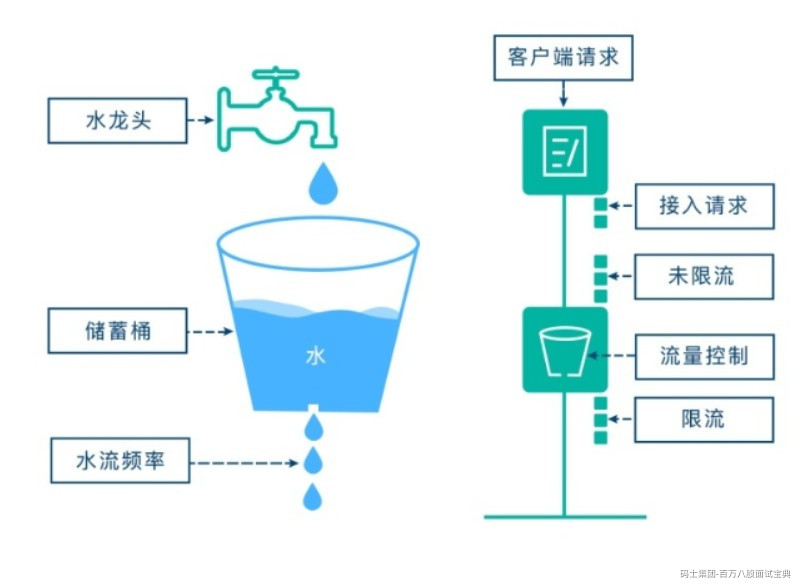

注意：在我们的应用中，漏桶算法强制限定流量速率后，多出的（溢出的）流量可以被利用起来，并非

完全丢弃，我们可以把它收集到一个队列里面，做流量队列，尽量做到合理利用所有资源。

漏桶算法：水（请求）先进入到漏桶里，漏桶以一定的速度出水，当水流入速度过大会直接溢出（拒绝 服务），可以看出漏桶算法能强行限制数据的传输速率

流入：以任意速率往桶中放入水滴。 流出：以固定速率从桶中流出水滴。

用白话具体说明：假设漏斗总支持并发100个最大请求，如果超过100个请求，那么会提示系统繁忙，请 稍后再试，数据输出那可以设置1个线程池，处理线程数5个，每秒处理20个请求。 缺点：因为当流出速度固定，大规模持续突发量，无法多余处理，浪费网络带宽

优点：无法击垮服务

**令牌桶算法**

令牌桶算法(Token Bucket)和 Leaky Bucket 效果一样但方向相反的算法,更加容易理解.随着时间流逝,系 统会按恒定1/QPS时间间隔(如果QPS=100,则间隔是10ms)往桶里加入Token(想象和漏洞漏水相反,有个 水龙头在不断的加水),如果桶已经满了，令牌就溢出了。如果桶未满，令牌可以积累。新请求来临时,会 各自拿走一个Token,如果没有Token可拿了就阻塞或者拒绝服务.

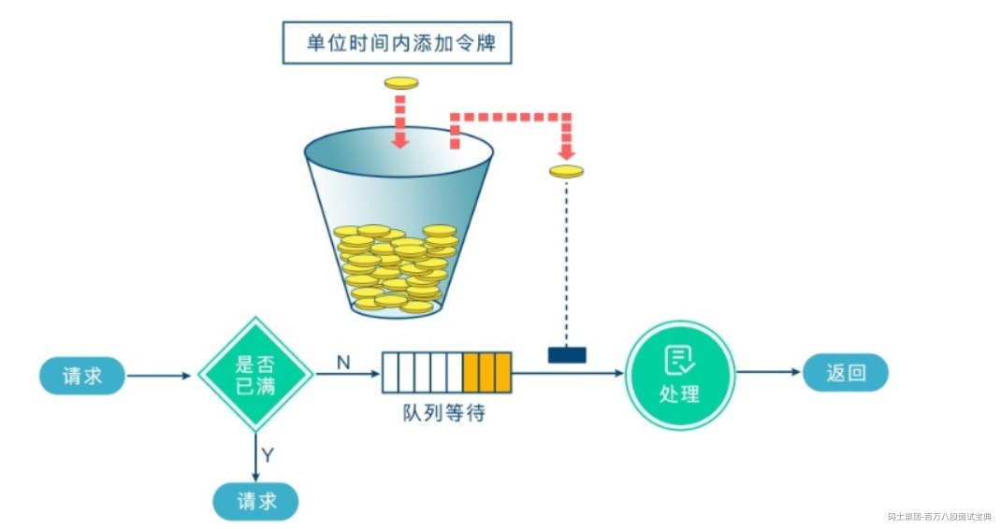

令牌桶的另外一个好处是可以方便的改变速度. 一旦需要提高速率,则按需提高放入桶中的令牌的速率. 一

般会定时(比如100毫秒)往桶中增加一定数量的令牌, 有些变种算法则实时的计算应该增加的令牌的数量.

令牌桶算法：一个存放固定容量令牌的桶，按照固定速率（每秒/或者可以自定义时间）往桶里添加令 牌，然后每次获取一个令牌，当桶里没有令牌可取时，则拒绝服务 令牌桶分为2个动作，动作1(固定速率往桶中存入令牌)、动作2(客户端如果想访问请求，先从桶中获取 token)

流入：以固定速率从桶中流入水滴 流出：按照任意速率从桶中流出水滴

**漏桶和令牌桶的区别：**

并不能说明令牌桶一定比漏洞好，她们使用场景不一样。 令牌桶算法，放在服务端，用来保护服务端（自己），主要用来对调用者频率进行限流，为的是不

让自己被压垮。所以如果自己本身有处理能力的时候，如果流量突发（实际消费能力强于配置的流

量限制=桶大小），那么实际处理速率可以超过配置的限制（桶大小）。 而漏桶算法，放在调用方，这是用来保护他人，也就是保护他所调用的系统。主要场景是，当调用 的第三方系统本身没有保护机制，或者有流量限制的时候，我们的调用速度不能超过他的限制，由 于我们不能更改第三方系统，所以只有在主调方控制。这个时候，即使流量突发，也必须舍弃。因 为消费能力是第三方决定的。

**计数器**

计数器法是限流算法里最简单也是最容易实现的一种算法。比如我们规定，对于A接口来说，我们1分钟 的访问次数不能超过100个。那么我们我们可以设置一个计数器counter，其有效时间为1分钟（即每分 钟计数器会被重置为0），每当一个请求过来的时候，counter就加1，如果counter的值大于100，就说 明请求数过多；

这个算法虽然简单，但是有一个十分致命的问题，那就是临界问题。

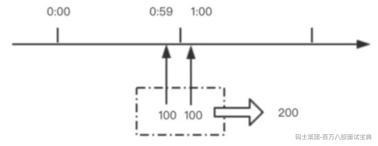

如上图所示，在1:00前一刻到达100个请求，1:00计数器被重置，1:00后一刻又到达100个请求，显然计

数器不会超过100，所有请求都不会被拦截；然而这一时间段内请求数已经达到200，远超100。违背定 义的固定速率。

**滑动窗口** 其实是TCP协议（传输层）流控 的手段 说起TCP协议，很多程序员都对三次握手、四次挥手都已经背得滚瓜烂熟，但是对于TCP一些其他的特性

却没能掌握好

大家都知道，我们从一台机器向另外一台机器发送数据的时候，数据并不是一口气也不可能一口气传输 给接收方。这个并不难理解，因为网络环境特别的复杂，有些地方快有些地方慢。所以，操作系统把这 些数据写成连续的数据包，并且以一定的速率发给对方。一定的速率怎么理解呢？网络环境就像复杂的 交通链路。就好比一个沙漏，

中间可能有一个地方流量非常的小，这个最小的口径决定了网络传输的真正速度。我们要考虑到带宽缓 冲区等因素，如果一下子发送所有的数据只会加大网络压力，造成丢包重试，轻则传输更慢，重则网络 崩溃。因为TCP是顺序发送的，

所以说，这个时候我们就会想到，能不能让操作系统将这些数据包一批一批的发送给对方，就像一个窗 口，不停地往后移动，这个时候，我们的滑动窗口协议应运而生。

接收方通过通告发送方自己的窗口大小，从而控制发送方的发送速度，从而达到防止发送方发送速度过 快而导致自己被淹没的目的。

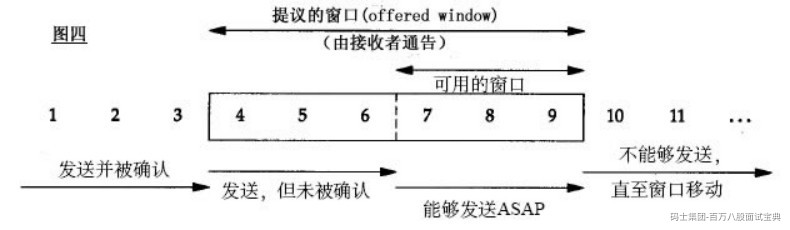

简单解释下，发送和接受方都会维护一个数据帧的序列，这个序列被称作窗口。发送方的窗口大小由接

受方确定，目的在于控制发送速度，以免接受方的缓存不够大，而导致溢出，同时控制流量也可以避免 网络拥塞。下面图中的4,5,6号数据帧已经被发送出去，但是未收到关联的ACK，7,8,9帧则是等待发送。 可以看出发送端的窗口大小为6，这是由接受端告知的。此时如果发送端收到4号ACK，则窗口的左边缘 向右收缩，窗口的右边缘则向右扩展，此时窗口就向前“滑动了”，即数据帧10也可以被发送。

参考如下网址提供的动态效果

[https://media.pearsoncmg.com/aw/ecs\_kurose\_compnetwork\_7/cw/content/interactiveanimation](https://media.pearsoncmg.com/aw/ecs_kurose_compnetwork_7/cw/content/interactiveanimations/selective-repeat-protocol/index.html)

[s/selective-repeat-protocol/index.html](https://media.pearsoncmg.com/aw/ecs_kurose_compnetwork_7/cw/content/interactiveanimations/selective-repeat-protocol/index.html)

Sentinel

Sentinel 是阿里中间件团队开源的，面向分布式服务架构的轻量级高可用流量控制组件，主要以流量为 切入点，从流量控制、熔断降级、系统负载保护等多个维度来帮助用户保护服务的稳定性。

Sentinel 官网：<https://github.com/alibaba/Sentinel>

随着分布式系统变得越来越流行，服务之间的可靠性变得比以往任何时候都更加重要。Sentinel以“流量” 为切入点，在**流量控制**、 **流量整形**、**熔断**、**系统自适应保护**等多个领域开展**工作**，保障微服务的可靠性 和弹性。

哨兵具有以下特点：

**丰富的适用场景**：Sentinel在阿里巴巴得到了广泛的应用，几乎覆盖了近10年双11（11.11）购物 节的所有核心场景，比如“秒杀”需要限制突发流量到满足系统容量、消息削峰填谷、下游不可靠业 务断路、集群流量控制等。

**实时监控**：Sentinel 还提供实时监控能力。可以实时查看单台机器的运行时信息，以及500个节点 以下的集群的聚合运行时信息。

**广泛的开源生态系统**：Sentinel 提供与 Spring Cloud、Dubbo 和 gRPC 等常用框架和库的开箱即 用集成。您只需将适配器依赖项添加到您的服务即可轻松使用 Sentinel。

**多语言支持**：Sentinel 为 Java、[Go](https://github.com/alibaba/sentinel-golang)和[C++](https://github.com/alibaba/sentinel-cpp)提供了本机支持。 **丰富的**SPI**扩展**：Sentinel提供简单易用的SPI扩展接口，可以让您快速自定义逻辑，例如自定义规 则管理、适配数据源等。

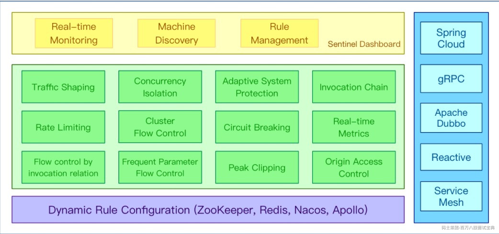

生态

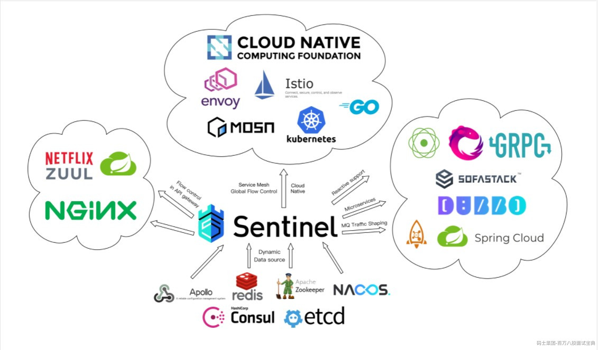

效果展示使用：

配置文件：

server.port=8084

# 应用名称

spring.application.name=sentinel-demo

# Sentinel 控制台地址

spring.cloud.sentinel.transport.dashboard=localhost:8080

# 取消Sentinel控制台懒加载

# 默认情况下 Sentinel 会在客户端首次调用的时候进行初始化，开始向控制台发送心跳包

# 配置 sentinel.eager=true 时，取消Sentinel控制台懒加载功能

spring.cloud.sentinel.eager=true

# 如果有多套网络，又无法正确获取本机IP，则需要使用下面的参数设置当前机器可被外部访问的IP地址，供

admin控制台使用

# spring.cloud.sentinel.transport.client-ip=

#spring.cloud.sentinel.transport.port=8719

#spring.cloud.sentinel.block-page=

# spring 静态资源扫描路径

spring.resources.static\_locations=classpath:/static/

依赖：

<!-- replace here with the latest version -->

<dependency>

<groupId>com.alibaba.csp</groupId>

<artifactId>sentinel-core</artifactId>

<version>1.8.2</version>

</dependency>

代码：

public static void main(String[] args) {

initRules();

while (true) {

try (Entry entry = SphU.entry("HelloWorld")) {

// Your bus iness logic here. System.out.println("hello world");

} catch (BlockException e) {

// Handle rejected request. System.out.println("被拒绝了"); e.printStackTrace();

}

// try-with-resources auto exit

}

public static void initRules() {

//定义规则对象数组

List<FlowRule> rules = new ArrayList<>();

//创建规则对象

FlowRule rule = new FlowRule();

//定义资源

rule.setResource("HelloWorld");

//定义QPS为20 rule.setCount(20);

//设置规则

rule.setGrade(RuleConstant.FLOW\_GRADE\_QPS);

//添加规则

rules.add(rule);

//规则管理器，加载规则

FlowRuleManager.loadRules(rules);

}

日志路径：C:\Users\root\logs\csp

时间戳 当前时间 资源名 请求总次数 定义的次数 拒绝的次

数

1627462920000|2021-07-28 17:02:00|HelloWorld|100511|0|100510|0|0|0|0|0

1627462921000|2021-07-28 17:02:01|HelloWorld|245001|0|245001|0|0|0|0|0

1627462922000|2021-07-28 17:02:02|HelloWorld|287578|0|287579|0|0|0|0|0

1627462923000|2021-07-28 17:02:03|HelloWorld|295271|0|295270|0|0|0|0|0

1627462924000|2021-07-28 17:02:04|HelloWorld|296892|0|296892|0|0|0|0|0

1627462925000|2021-07-28 17:02:05|HelloWorld|302227|0|302227|0|0|0|0|0

1627462926000|2021-07-28 17:02:06|HelloWorld|304159|0|304159|0|0|0|0|0

1627462927000|2021-07-28 17:02:07|HelloWorld|288124|0|288124|0|0|0|0|0

1627462928000|2021-07-28 17:02:08|HelloWorld|287586|0|287586|0|0|0|0|0

1627462929000|2021-07-28 17:02:09|HelloWorld|309930|0|309930|0|0|0|0|0

1627462930000|2021-07-28 17:02:10|HelloWorld|295750|0|295750|0|0|0|0|0

1627462931000|2021-07-28 17:02:11|HelloWorld|297275|0|297275|0|0|0|0|0

下面我们可以尝试一下控制面板

Sentinel 分为两个部分：

核心库（Java 客户端）不依赖任何框架/库，能够运行于所有 Java 运行时环境，同时对 Dubbo / Spring Cloud 等框架也有较好的支持。

控制台（Dashboard）基于 Spring Boot 开发，打包后可以直接运行，不需要额外的 Tomcat 等应 用容器。

启动的时候加上参数

-Dcsp.sentinel.dashboard.server=localhost:8080 这是监控自己的命令

接口

package com.yteach.sentinel.demo;

import org.springframework.web.bind.annotation.GetMapping; import org.springframework.web.bind.annotation.PathVariable; import org.springframework.web.bind.annotation.RestController;

import javax.annotation.Resource;

@RestController

public class SentinelController {

@Resource

private TestService testService;

@GetMapping("/sayHello/{name}")

public String sayHello(@PathVariable String name) {

// initRules();

String test = testService.test(name);

return test;

}

}

实现

package com.yteach.sentinel.demo;

import com.alibaba.csp.sentinel.annotation.SentinelResource;

import org.springframework.stereotype.Service;

@Service

public class TestService {

//定义资源

@SentinelResource("test")

public String test(String name){

return "你好，"+name;

}

}

在启动器定义规则

package com.yteach.sentinel.demo;

import com.alibaba.csp.sentinel.slots.block.RuleConstant;

import com.alibaba.csp.sentinel.slots.block.flow.FlowRule;

import com.alibaba.csp.sentinel.slots.block.flow.FlowRuleManager;

import org.springframework.boot.SpringApplication;

import org.springframework.boot.autoconfigure.SpringBootApplication;

import java.util.ArrayList;

import java.util.List;

@SpringBootApplication

public class SentinelDemoApplication {

public static void main(String[] args) { initRules(); SpringApplication.run(SentinelDemoApplication.class, args);

}

public static void initRules() {

//定义规则对象数组

List<FlowRule> rules = new ArrayList<>();

//创建规则对象

FlowRule rule = new FlowRule();

//定义资源

rule.setResource("test");

//定义QPS为2,方便手动刷新效果

rule.setCount(2);

//设置规则

rule.setGrade(RuleConstant.FLOW\_GRADE\_QPS);

//添加规则

rules.add(rule);

//规则管理器，加载规则

FlowRuleManager.loadRules(rules);

}

}

C:\Users\root\logs\csp\

但是这样写没有页面，只能报错，所以我们需要给一个页面

在TestService中加上

public String blockHandler(String name, BlockException e) {

return "被限流了";

}

并且在@SentinelResource注解中

@SentinelResource(value = "test",blockHandler = "blockHandler")

启动之后我们可以看效果。

OK，我们看到效果之后，我们其实也可以不用在启动器中这样写规则。同时我们可以集成到面板中去。 而这里我们需要配置一下我们的规则配置类

FlowRuleInitFunc类

package com.yteach.sentinel.demo;

import com.alibaba.csp.sentinel.init.InitFunc;

import com.alibaba.csp.sentinel.slots.block.RuleConstant;

import com.alibaba.csp.sentinel.slots.block.flow.FlowRule;

import com.alibaba.csp.sentinel.slots.block.flow.FlowRuleManager;

import java.util.ArrayList;

import java.util.List;

public class FlowRuleInitFunc implements InitFunc {

@Override

public void init() throws Exception {

//定义规则对象数组

List<FlowRule> rules = new ArrayList<>();

//创建规则对象

FlowRule rule = new FlowRule();

//定义资源

rule.setResource("test");

//定义QPS为20 rule.setCount(2);

//设置规则

rule.setGrade(RuleConstant.FLOW\_GRADE\_QPS);

//添加规则

rules.add(rule);

//规则管理器，加载规则

FlowRuleManager.loadRules(rules);

}

}

在resource下面生成文件

META-INF.services

在下面创建文件

com.alibaba.csp.sentinel.init.InitFunc

文件内容

com.yteach.sentinel.demo.FlowRuleInitFunc

**熔断降级**

Sentinel 和 Hystrix 的原则是一致的: 当检测到调用链路中某个资源出现不稳定的表现，例如请求响应时 间长或异常比例升高的时候，则对这个资源的调用进行限制，让请求快速失败，避免影响到其它的资源 而导致级联故障。

在限制的手段上，Sentinel 和 Hystrix 采取了完全不一样的方法。

Hystrix 通过线程池隔离的方式，来对依赖（在 Sentinel 的概念中对应 资源）进行了隔离。这样做的好 处是资源和资源之间做到了最彻底的隔离。缺点是除了增加了线程切换的成本（过多的线程池导致线程 数目过多），还需要预先给各个资源做线程池大小的分配。

Sentinel 对这个问题采取了两种手段:

通过并发线程数进行限制

和资源池隔离的方法不同，Sentinel 通过限制资源并发线程的数量，来减少不稳定资源对其它资源的影

响。这样不但没有线程切换的损耗，也不需要您预先分配线程池的大小。当某个资源出现不稳定的情况 下，例如响应时间变长，对资源的直接影响就是会造成线程数的逐步堆积。当线程数在特定资源上堆积 到一定的数量之后，对该资源的新请求就会被拒绝。堆积的线程完成任务后才开始继续接收请求。

通过响应时间对资源进行降级

除了对并发线程数进行控制以外，Sentinel 还可以通过响应时间来快速降级不稳定的资源。当依赖的资 源出现响应时间过长后，所有对该资源的访问都会被直接拒绝，直到过了指定的时间窗口之后才重新恢 复。
