**一、配置中心存在的意义**

1.**开发环境的配置**

在正式企业级开发互联网项目中，通常会严格按照四套环境进行设计和配置，这四套环境分别是开发环 境、测试环境、预生产环境（也称为预发布环境或准生产环境）和生产环境。它们各自承担着不同的角 色和职责，以确保项目的顺利开发和稳定运行。

1.1. **开发环境**

**定义与职责**： 开发环境是开发人员用于编写、调试和测试代码的环境。

它通常部署在开发人员的本地计算机上，或者是一个专门为开发人员提供的远程开发服务器。

在这个环境中，开发人员可以自由地修改代码、配置和数据库，以进行新功能的开发和现有功能的 改进。

**特点**：

允许频繁的代码提交和版本更新。

可能包含多个开发分支，以支持并行开发。 数据通常不用于生产，而是用于开发和测试目的。

1.2. **测试环境**

**定义与职责**： 测试环境是用于对新开发的功能和修改后的功能进行集成测试和系统测试的环境。

它通常模拟生产环境的配置和条件，以确保软件在真实环境中能够正常运行。

**特点**： 测试环境通常与生产环境保持一定的隔离，以避免测试活动对生产环境造成干扰。

测试人员会在这个环境中执行测试用例，以验证软件的正确性、稳定性和性能。

数据可以是模拟的或基于生产数据的子集，用于测试不同的场景和用例。

1.3. **预生产环境**

**定义与职责**：

预生产环境（也称为预发布环境或准生产环境）是一个与生产环境非常相似的环境，用于进行最终

的测试和验证。 它通常从生产环境定期同步数据和配置，以确保与生产环境的高度一致性。

**特点**：

预生产环境用于模拟生产环境的负载和条件，以评估软件在实际运行中的表现。

它允许在不影响生产环境的情况下，进行更全面的测试和验证。 测试结果将直接影响是否将软件部署到生产环境。 极端情况下，比如说生产环境出现重大意外，那么预生产环境可能会临时切换成生产环境

1.4. **生产环境**

**定义与职责**： 生产环境是软件正式运行的环境，面向最终用户提供服务。

它通常包含多个服务器和数据库，以确保高可用性和负载均衡。

**特点**： 生产环境中的数据是真实的、有价值的，因此需要采取严格的安全措施来保护数据的安全性和完整

性。

对生产环境的任何更改都需要经过严格的审批和测试流程，以避免对业务造成不必要的干扰和损 失。

生产环境的稳定性和性能是评估软件质量的重要指标之一。

这四套环境在企业级开发互联网项目中扮演着不可或缺的角色。它们通过各自的职责和特点，共同确保

了项目的顺利开发和稳定运行。

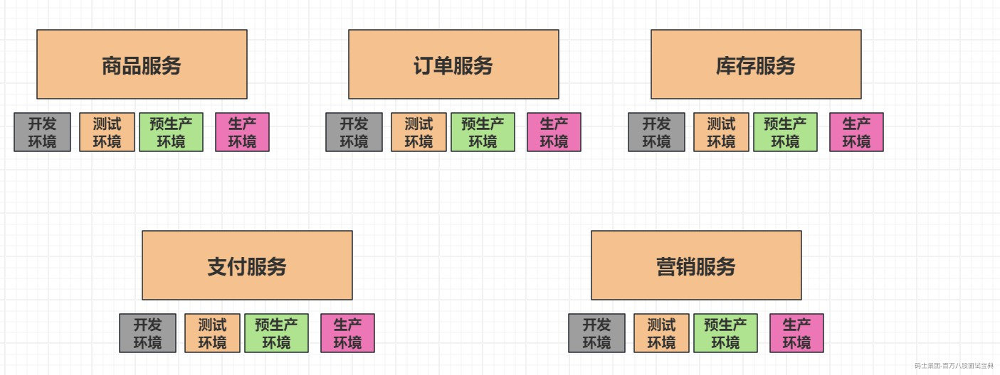

2**、微服务中配置文件的问题**

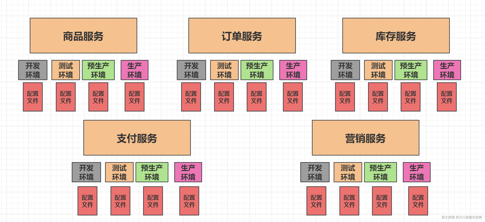

配置文件的问题：

配置文件的数量会随着服务的增加持续递增

单个配置文件无法区分多个运行环境 配置文件内容无法动态更新，需要重启服务

引入配置文件：刚才架构就会成为这样。我们仅仅5个服务，就需要维护20个配置文件，每个配置文件 还需要解决一系列问题

所以我们需要进行配置的统一管理以及一系列服务治理的需求。（微服务的本质就是服务治理，所有微 服务的组件都是在某种程度上提供服务治理的功能）

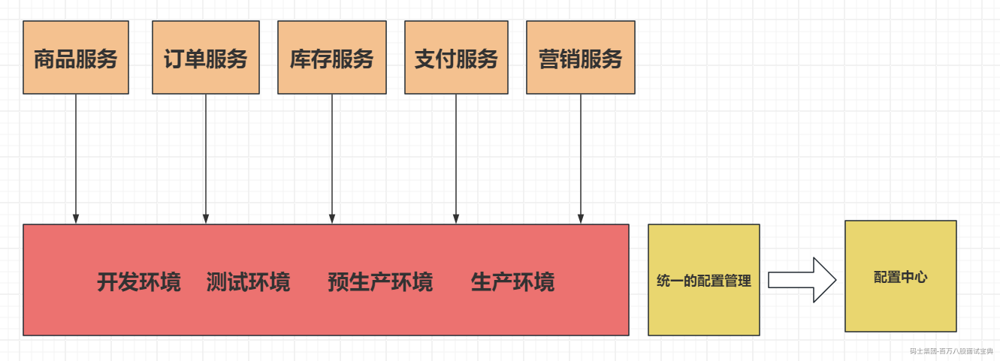

统一配置文件管理 提供统一标准接口，服务根据标准接口自行拉取配置 支持动态更新的到所有服务

2**、业界常用的配置中心**

Appllo

1. 统一管理不同环境、不同集群的配置

2. 配置修改实时生效（热发布）

3. 版本发布管理

4. 灰度发布

5. 权限管理、发布审核、操作审计

6. 提供开放平台 API Disconf

是百度开源的框架，他是基于zk来实现配置变更后来实时通知和生效的。

SpringCloud Config

他是springcloud自带的配置组件，他可以和spring进行无缝集成，spring自家研发的，使用起来很 方便，配置存储是支持git ,不过他缺少可视化界面，并且配置的生效也不是实时的。需要重启，或 者手动刷新的功能。

Nacos

**二、**Nacos**安装以及编译**

1**、下载源码**

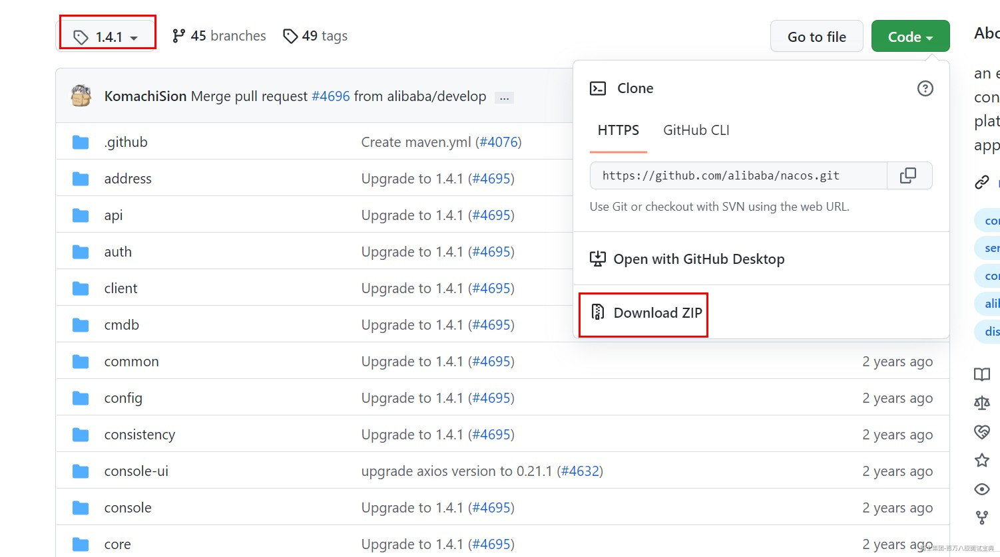

解压进入目录中进行maven编译

mvn clean install -DskipTests -Drat.skip=true -f pom.xml

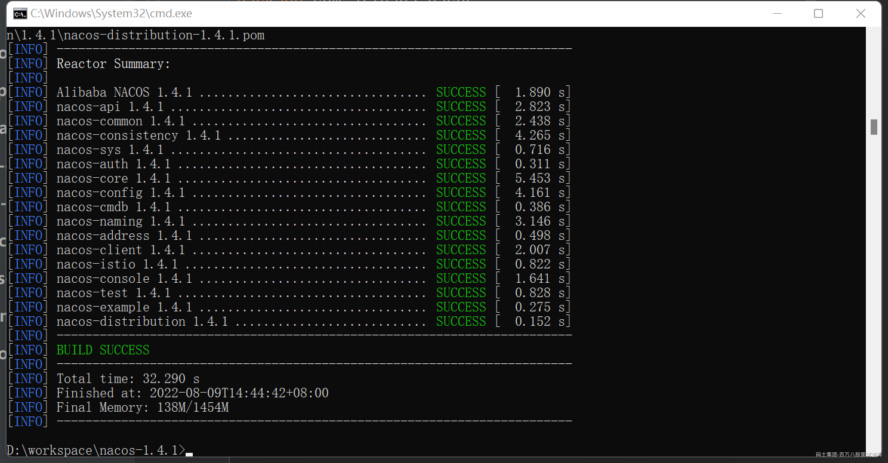

注意：编译的时候可能需要你自己指定jdk版本，可以修改maven配置文件conf/settings.xml

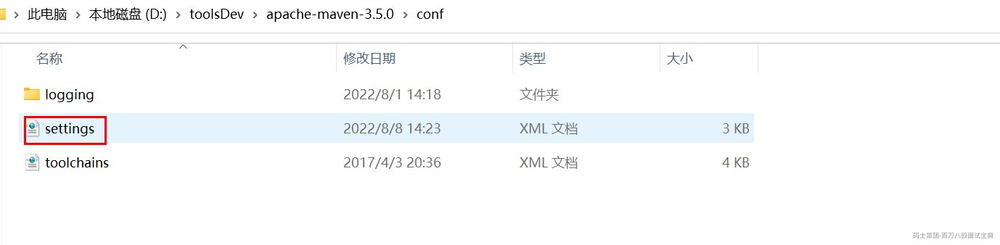

<profile>

<id>jdk-1.8</id>

<activation>

<activeByDefault>true</activeByDefault>

<jdk>1.8</jdk>

</activation>

<properties>

<maven.compiler.source>1.8</maven.compiler.source>

<maven.compiler.target>1.8</maven.compiler.target>

<maven.compiler.compilerVersion>1.8</maven.compiler.compilerVersion>

</properties>

</profile>

2**、源码单机启动**

将jdk版本都设置为jdk8

设置参数

-Dnacos.standalone=true

3**、单机启动服务**

下载nacos服务

<https://github.com/alibaba/nacos/releases>

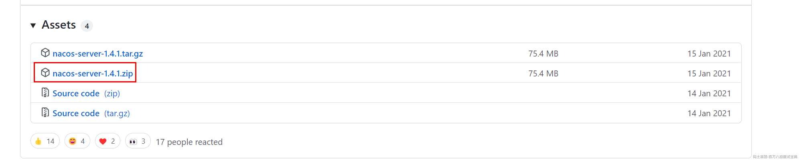

解压进入bin目录

执行命令

startup.cmd -m standalone

5**、修改**startup.cmd

将MODE模式改为standalone，这样下次直接双击startup.cmd就可以了

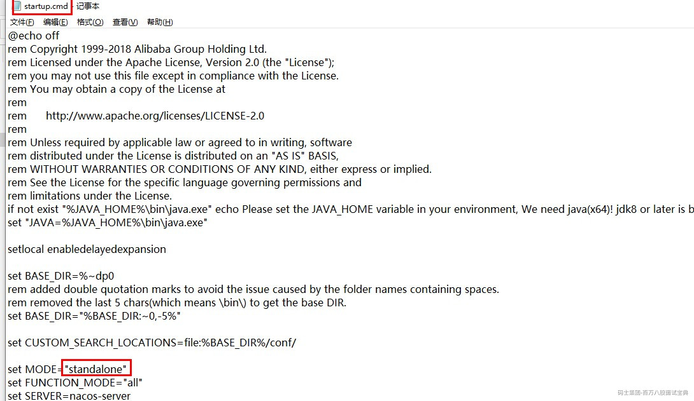

**三、**Nacos Config**数据模型**

Nacos Config数据模型

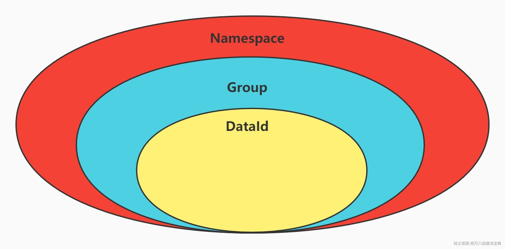

数据模型最佳实践

**四、**Nacos**集成**springboot**实现统一配置管**

**理**

1**、集成过程**

<dependency>

<groupId>com.alibaba.cloud</groupId>

<artifactId>spring-cloud-starter-alibaba-nacos-config</artifactId>

</dependency>

2. 开启注解

没有注解

3. 增加配置 这里的配置是bootstrap.yaml(bootstrap.properties) bootstrap.yml（bootstrap.properties）用来程序引导时执行，应用于更加早期配置信息读取，如

可以使用来配置application.yml中使用到参数等

application.yml（application.properties) 应用程序特有配置信息，可以用来配置后续各个模块中 需使用的公共参数等。

加载顺序bootstrap.yml > application.yml > application-dev(prod).yml

spring.application.name=nacos-config

#nacos地址

spring.cloud.nacos.config.server-addr=localhost:8848

4、获取对应的属性

@RestController

public class NacosConfigController {

@Value("${name}")

private String name;

@RequestMapping("/getName")

public String getName(){

return name;

}

}

此时是可以获取到数据配置中心的数据的，但是他不能动态更新，为此我们可以加注解@RefreshScope

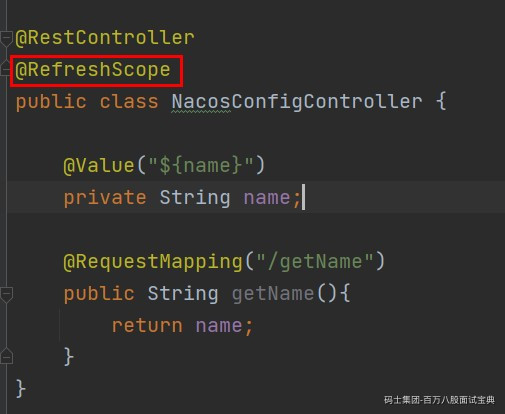

2**、各种配置加载顺序**

spring.application.name=nacos-config

server.port=8081

#nacos地址

spring.cloud.nacos.config.server-addr=localhost:8848

#1、只有上面的配置的时候他默认加载文件为：${application.name}

#2、指定文件后缀名称

#加载文件为：${application.name}.${file-extension}

#nacos-config.yaml spring.cloud.nacos.config.file-extension=yaml

##3、profile： 指定环境 文件名：${application.name}-${profile}.${file-extension}

##nacos-config-prod.yaml spring.profiles.active=prod

#4、nacos自己提供的环境隔离 ，这里是开发环境下的

spring.cloud.nacos.config.namespace=ff02931a-6fdb-4681-ac37-2f6d9a0596f8

#5、 自定义 group 配置，这里也可以设置为数据库配置组，中间件配置组，但是一般不用，

# 配置中心淡化了组的概念，使用默认值DEFAULT\_GROUP

spring.cloud.nacos.config.group=DEFAULT\_GROUP

#

#6、自定义Data Id的配置 共享配置（sharedConfigs）0 spring.cloud.nacos.config.shared-configs[0].data-id= common.yaml

#可以不配置，使用默认

spring.cloud.nacos.config.shared-configs[0].group=DEFAULT\_GROUP

# 这里需要设置为true，动态可以刷新，默认为false spring.cloud.nacos.config.shared-configs[0].refresh=true

# 7、扩展配置(extensionConfigs)

# 支持一个应用有多个DataId配置，mybatis.yaml datasource.yaml spring.cloud.nacos.config.extension-configs[0].data-id=datasource.yaml spring.cloud.nacos.config.extension-configs[0].group=DEFAULT\_GROUP

#作用：顺序

#${application.name}-${profile}.${file- extension} msb-edu-prod.yaml

#${application.name}.${file-extension} nacos-config.yaml

#${application.name} nacos-config

#extensionConfigs 扩展配置文件

#sharedConfigs 多个微服务公共配置 redis

**五、**Nacos config**动态刷新实现原理解析**

1**、动态监听**

Push**表示服务端主动将数据变更信息推送给客户端**

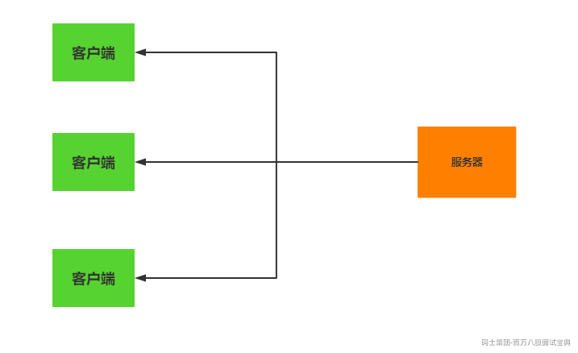

推送的模式服务器必须保持客户端的长连接，这样服务端会耗费大量的内存，并且还要检测链接的有效性。需 要一些心跳机制来维护

Pull**表示客户端主动去服务端拉取数据**

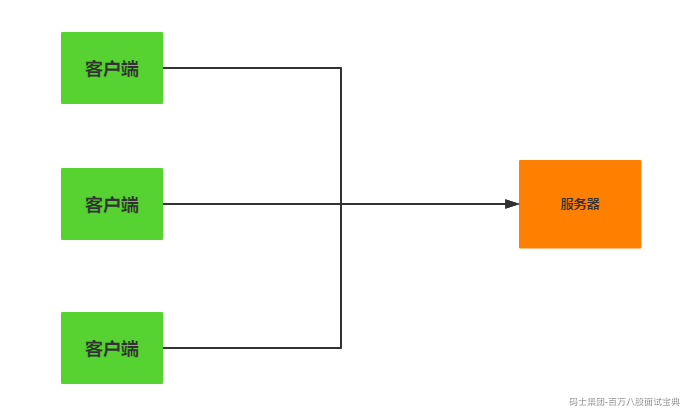

这样客户端缺少了时效性，客户端不可能实时的从服务端拉取的，他要有时间间隔的。这个时间间隔不好控

制，时间长了就实时性不高，时间短了，如果配 置没有变化时候他会有需要无效的拉取。

2**、动态刷新流程图（长轮询机制）**

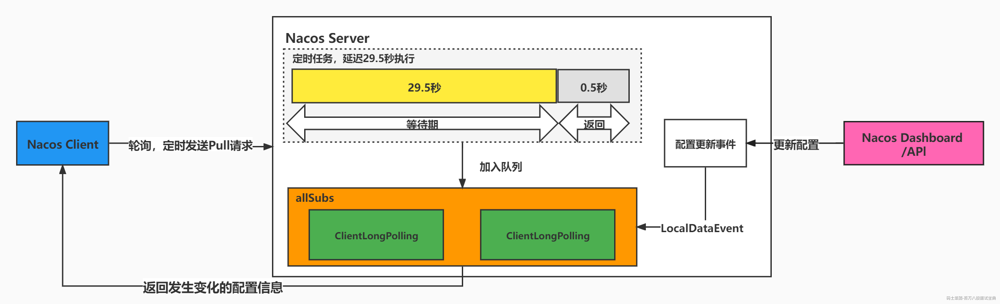

客户端会轮询向服务端发出一个长连接请求，这个长连接最多30s就会超时，服务端收到客户端的请求 会先判断当前是否有配置更新，有则立即返回如果没有服务端会将这个请求拿住“hold”29.5s加入队列， 最后0.5s再检测配置文件无论有没有更新都进行正常返回，但等待的29.5s期间有配置更新可以提前结束 并返回。

3**、长轮训机制源码分析**

3.1 **源码方式打包**

客户端源码中增加打包方式，将源码打入包中

<plugin>

<groupId>org.apache.maven.plugins</groupId>

<artifactId>maven-source-plugin</artifactId>

<version>3.2.1</version>

<configuration>

<attach>true</attach>

</configuration>

<executions>

<execution>

<phase>compile</phase>

<goals>

<goal>jar</goal>

</goals>

</execution>

</executions>

</plugin>

然后打包：

mvn install -DskipTests

3.2 **入口**

我们想Nacos和SpringBoot整合一定是自动装配，那么我们需要找自动装配类。如下：

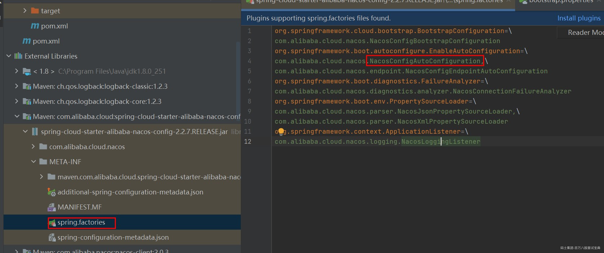

3.3 NacosConfigManager**源码分析**

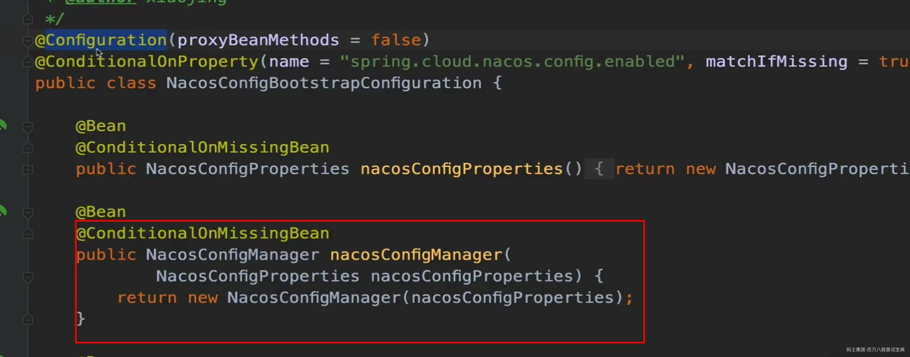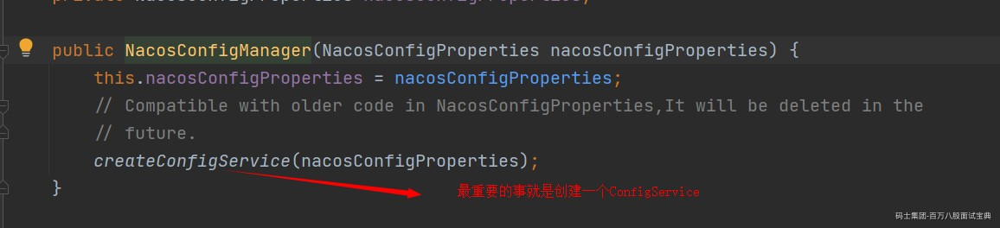

这里是用一个单例的方式来处理，synchronized来处理并发。

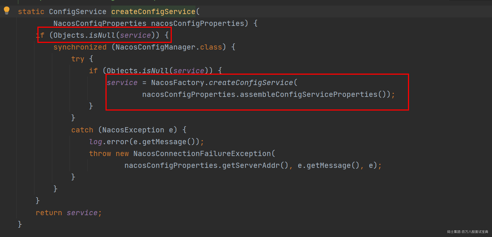

我们ConfigService默认实现类就是NacosConfigService，这个service的初始化就比较关键了，我们需

要关注两个属性agent 是一个HttpAgent类型，用于发起http的一个类，这里也是用了一个非常经典的装 饰器模式，

第二个是ClientWorker类，他是客户端的工作类，这里可以猜测，他会基于agent 做一些http请求，这 个clientwork也是nacos配置中心，客户端中比较关键的一个类，

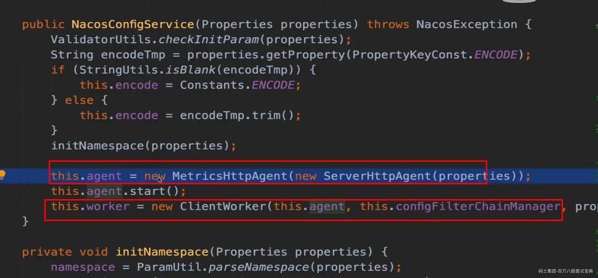

3.4 ClientWork**分析** 我们进入clientWork里面： init初始化几个比价关键的bean

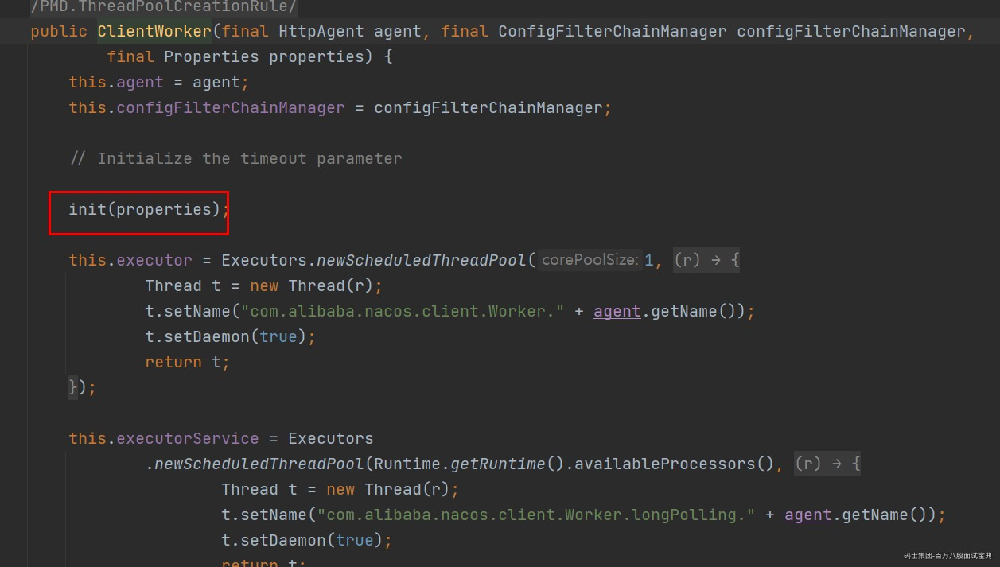

timeout :初始时间是30000ms，咱们讲过nacos长轮询的默认值就是30秒，这个值就是从这里来的。这

个值会放到http头当中。然后发给服务端，服务端会根据这个时间进行长轮询，

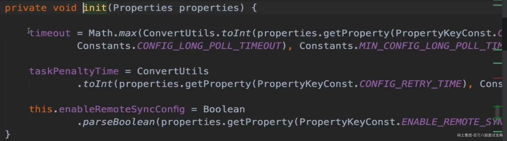

意思就是这个线程池里面就有一个线程进行执行

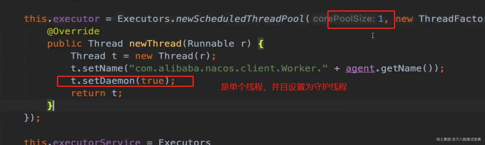

接着是一样，这里用一个newScheduleThreadPool，这里是一个定时任务的线程池

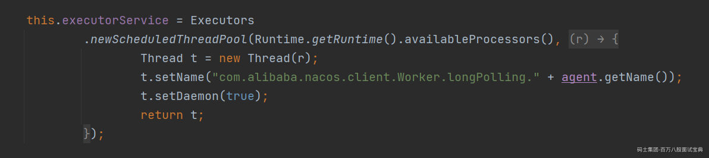

接着执行第一个线程池。延迟1毫秒进行执行，每过10毫秒然后执行一个，然后我们看一下里面的执行 内容

注意：这里每10毫秒执行一次，会不会很频繁对性能有损耗？

这里定时任务是在上个任务执行完毕后和现在任务开始之间相差10ms，也就是在上个任务没有执行完毕 时候，他不会开启第二个任务，而每个任务是长轮询机制。所以不会有每10ms执行一次的问题。

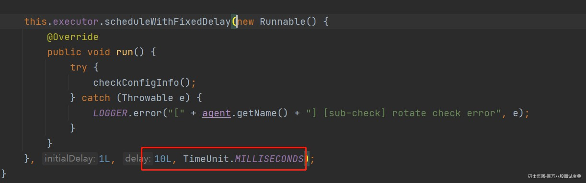

cacheMap就是我们启动的时候，加载的需要监听的nacos配置文件的类，他的key是什么？ 就是 dataId+groupID来表示一个key,value就是配置的内容。我们可以看一下他的类型里面用的 ConcurrentHashMap，里面可以避免并发产生的线程问题。 ，这里第一步就是获取监听配置文件的数 量。

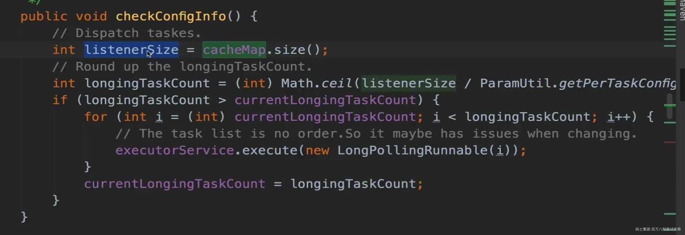

一个LongPollingRunnable可以监听3000个文件的变化。如果超过3000文件就会有额外的类来监听

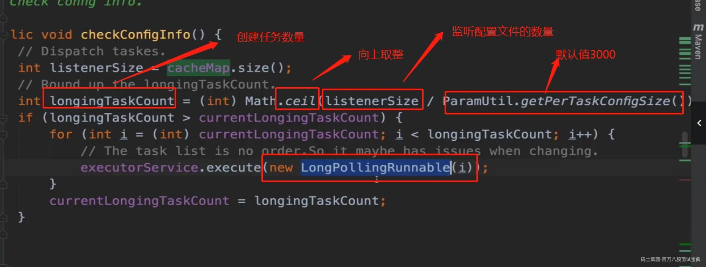

我们看一下LongPollingRunnable的run方法： 第一：遍历我们的cacheMap的集合，去看他的本地的配置进行检查，

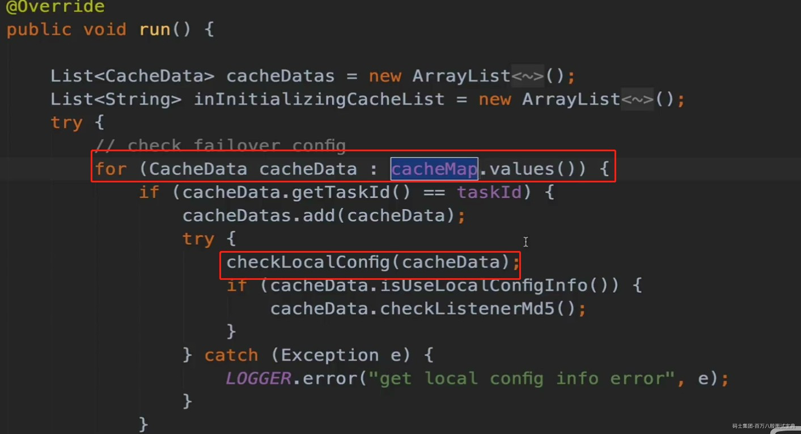

第二部：这个就是之前讲到的比较关键的流程，调用服务端长轮询的流程，

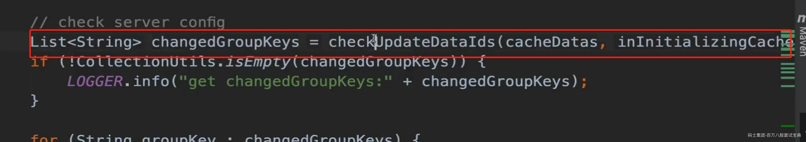

首先拼写dataId和group组，

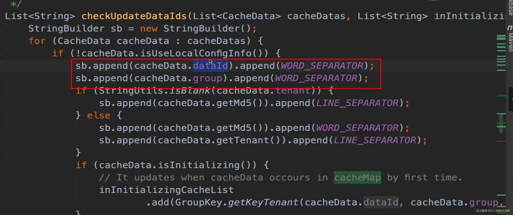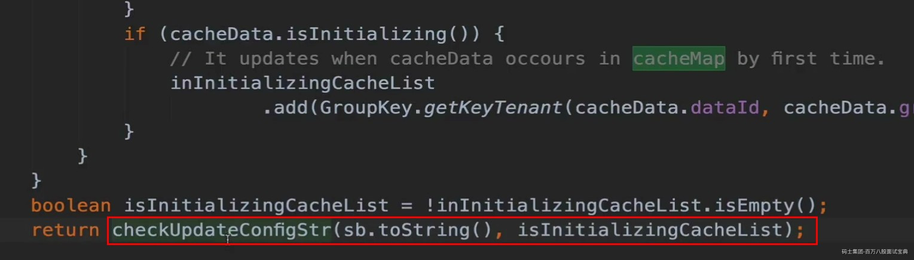

这里就是做一个http请求调用，来调用服务端，来请求我要关注的数据，那些数据发生了变化，他会将 我们本地需要监听的配置文件，以dataId和group进行组合，然后调用到服务端， 首先拼一个头，他里 面有一个关键的参数就是timeout，他的默认值就是30秒，前面说过，

3.5 **发送**HTTP**请求获取配置**

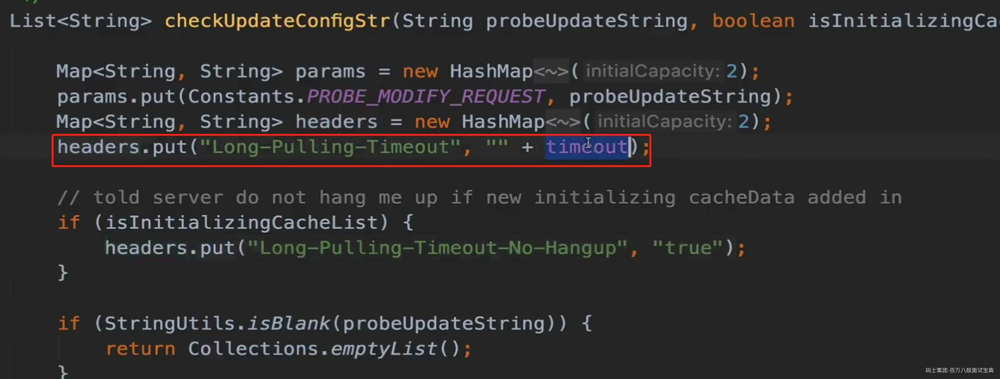

接着他会发送一个请求，调用他们的listen接口。好，客户端的请求就可能在这里hang住了，客户端会 发送一个链接，服务端会阻塞30秒，我们来看一下服务端做了什么？

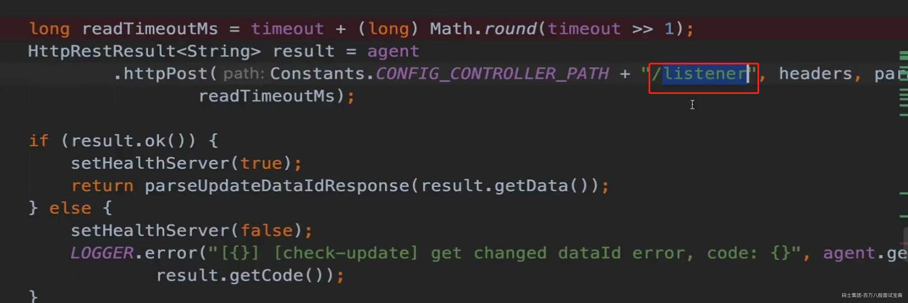

3.6 **服务端处理长轮询**

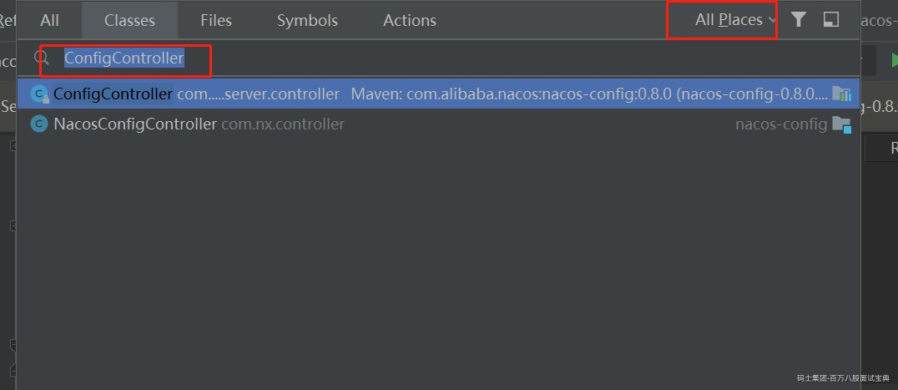

找到对应listener请求的controller类。这个接口就是接收客户端发送长轮询的http请求的接口。 首先他会获取客户端发送的需要监听的可能发生变化的配置文件的列表，并且计算他们的md5值，然后

他会调用inner.doPollingConfig,

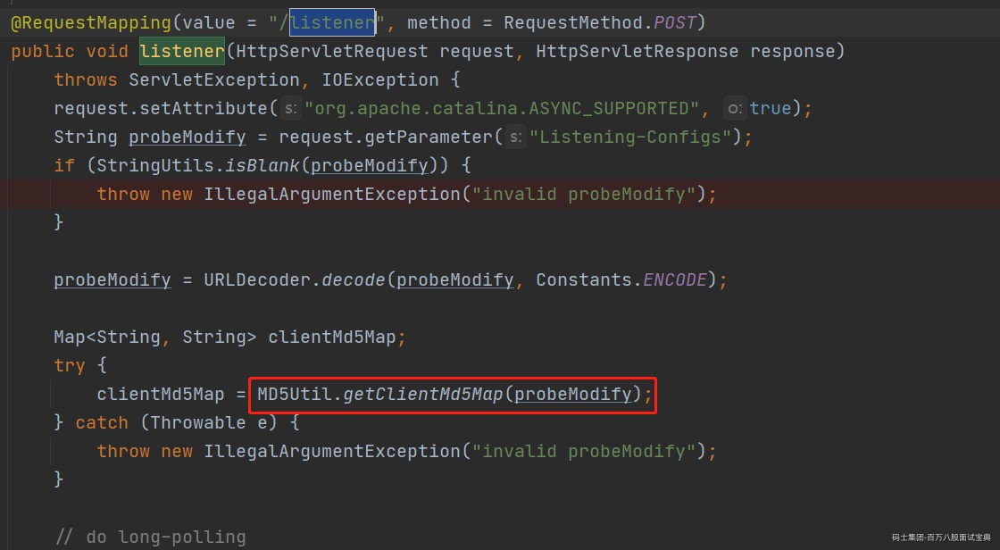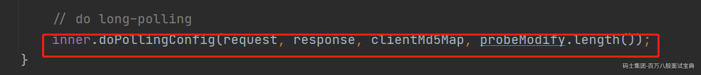

这个方法里面就会调用所谓的长轮询，他的长轮询 是怎么实现的，我们进来看一下：

首先判断是否支持长轮询，isSupportLongPolling

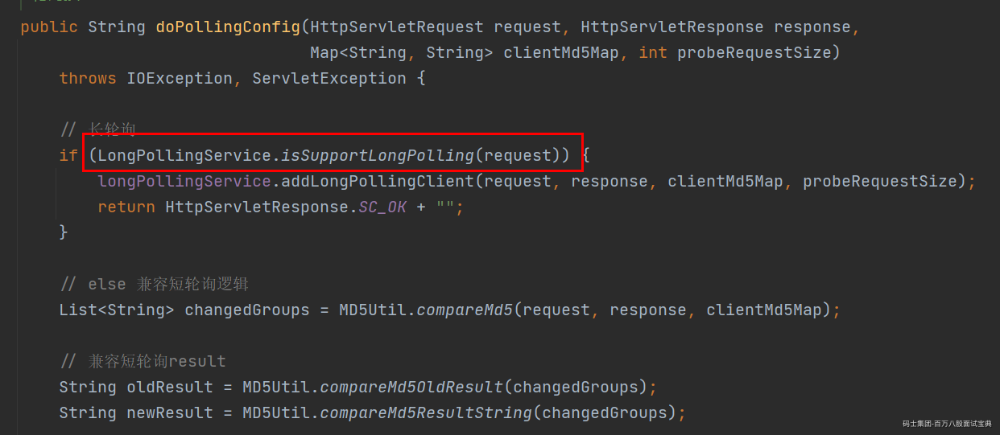

他会从header里面获取LONG\_POLLING\_HEADER，如果没有就不支持长轮询，服务端发送是一个短轮 询的请求默认是支持长轮询的，他就会调用addLongPollingClient

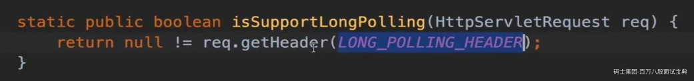

将客户端传过来的值都传递进来。

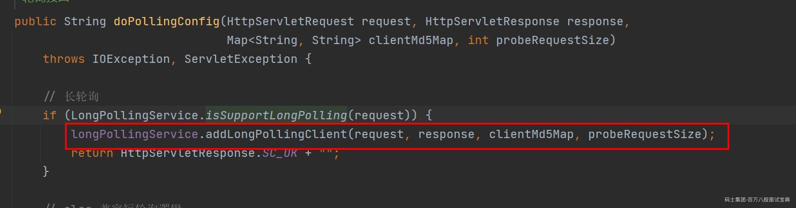

进入方法里面我们会发现，有中文注释他会提前500ms进行返回。避免客户端超时。前面说的500毫秒

就是在这里来的。

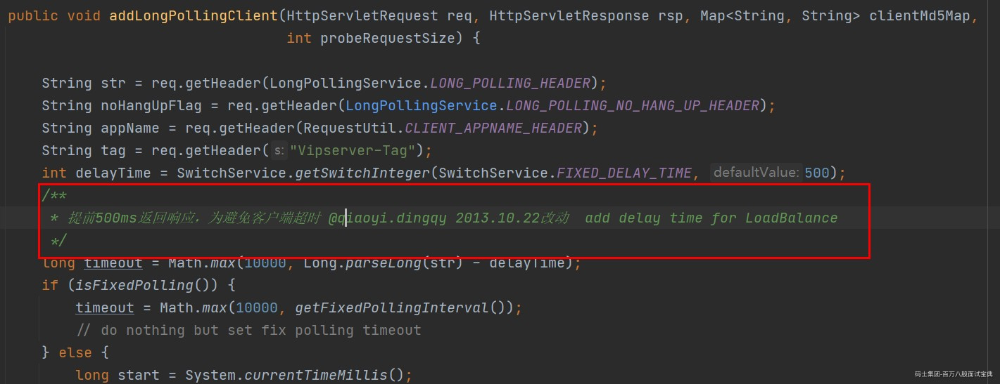

首先判断是否是一个IsFixedPolling，如果是就是30秒，如果不是就是29.5秒，执行完毕，我们这里要不 就是30秒，要不就是29.5s，下面的代码可能不是很重要关键就是这个scheduler执行这样一个线程，

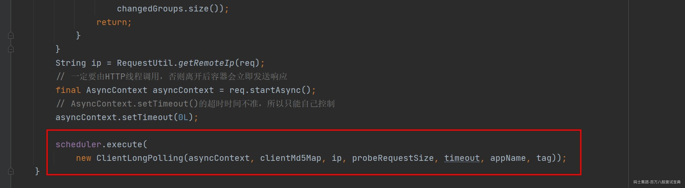

我们可以看一下这个scheduler初始化： 两个关键的变量一个是allSubs：他是一个支持并发链接的队列。这个也是在之前的图中讲到，他是将客

户端每次请求都会放到这个quene里面，放到这里面就是，当页面或者通过api调用修改了配置，修改配 置之后会发送一个消息，订阅消息一端就会遍历我们刚刚这个allSubs队列当中，看看这个队列里面请求 的配置发生了变化，如果发生变化的配置和请求的客户端监听的配置匹配上之后，就会立即将变更的内 容发挥给客户端。这就是队列的作用。

初始化的第二个参数：他有是一个schedule的线程池，nacos里面大量使用这样的线程池，在初始化的 后，他就会执行每10ms就会执行一下这个任务。

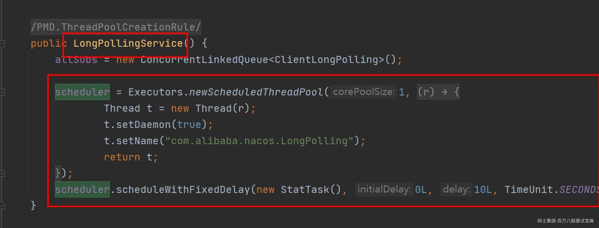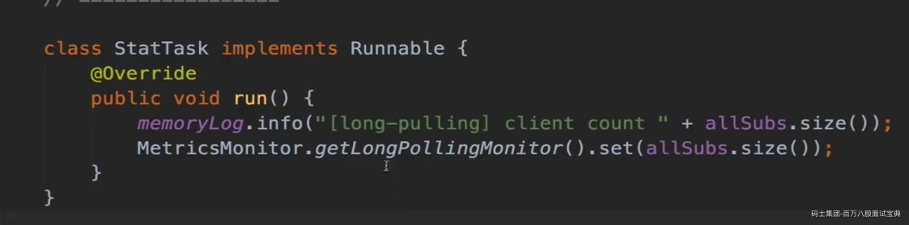

返回到最初：

将客户端的长轮询请求封装我 CliengLongPolling，交给定时任务去处理，

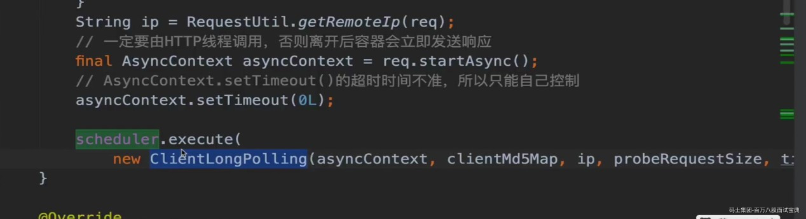

我们来看来看一下ClientLongPolling的run里面执行了些什么事情： 里面是一个schedule，所有的逻辑在里面的run方法里面。他也是在timeoutTime之后才会执行。他会

再29.5秒或者30秒之后执行这段代码。这里面的代码就是将客户端请求，进行个返回，那返回之前他会

干什么，他会进行比较， 他会比较我们监听的配置和我本身的配置是否发生了变化，

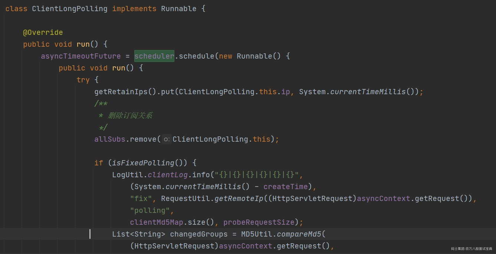

如果发生变化，changedGroups.size()就会大于0了，就会changeGroup以及里面内容返回给客户端， 如果没有变化就返回一个空。所以他在发送请求之前也会放到刚才说的队列当中，当然我们源码分析中 会直接返回并不会检查。

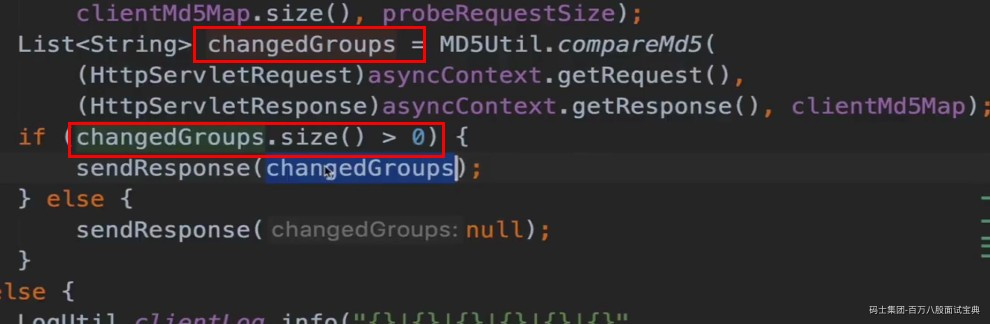

这个队列的作用我们刚才也说过，就是在29.5秒之内，如果有人再服务端页面或者调用相关api，更改了 配置，立刻就会有一个消息发送过来，消息发送监听之后就会操作这个队列，

从这段代码我们可以看出，其实服务端收到长轮询之后，不会立即返回，而是在延长29.5秒才会将请求 返回给客户端。这就使得客户端和服务端在30秒之内数据没有发生变化的情况下，是一直处于链接状 态，到这里服务端配置的疑惑基本已经跟同学们讲明白了。 目前讲到这里我们还有另一个疑惑，我们通 过api或者控制台怎样实时的显示。目前来看我们这个定时任务是延迟timeoutTime，去执行的，根本没 有达到一个实时的目的，那我们可以看一下本类（LongPollingService）他继承了 AbstractEventListener，这个listener就是一个消息监听机制，他有一个对应的onEvent的，

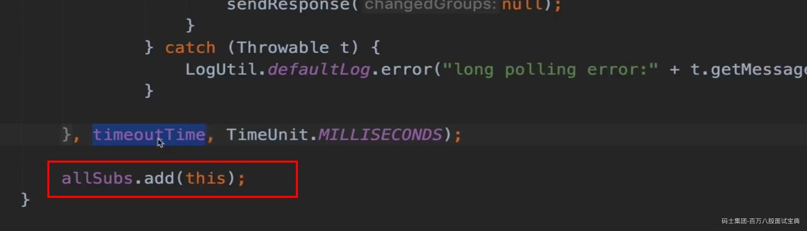

3.7 **控制台更新配置** 我们看一下这个onEvent做了什么？ 他就是监听了本地变更的消息，他机会执行一个DataChangeTask，这里面就会传递这个groupKey，我

们查看一下这个DataChangeTask里面的内容。 这个task也是一个线程。他的执行的代码在他的run当

中，

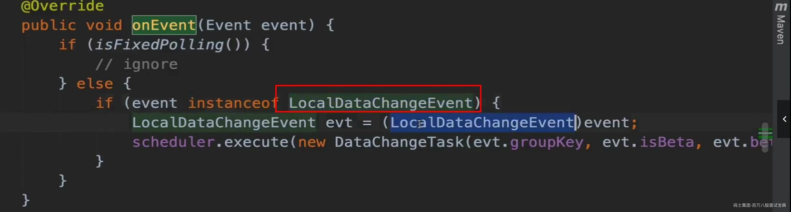

他就是遍历我们刚才的队列，他在遍历过程中，就那我们发生变更的groupKey，和队列中的groupKey 是否是匹配的。如果是匹配的他就会知道这个客户端的请求。将他响应给客户端，这就达到实时通信的 目的。

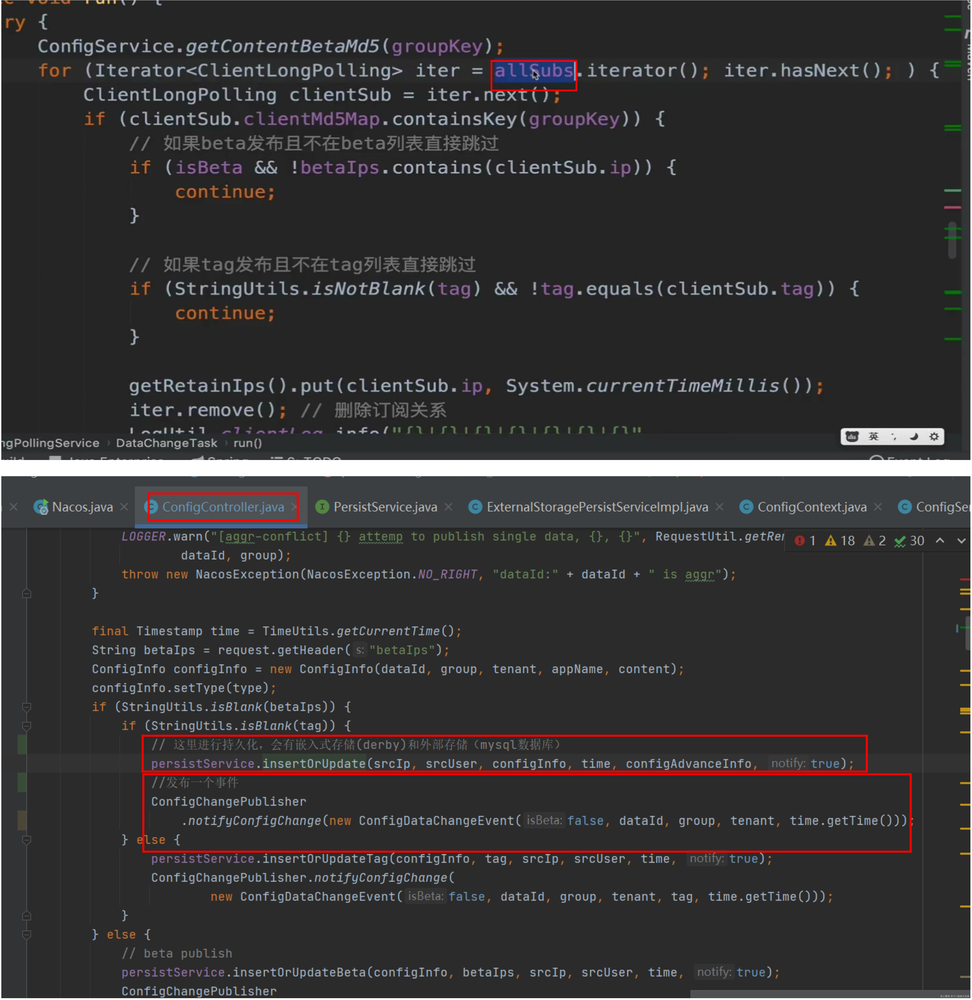

DataChangeTask

-EEE

=

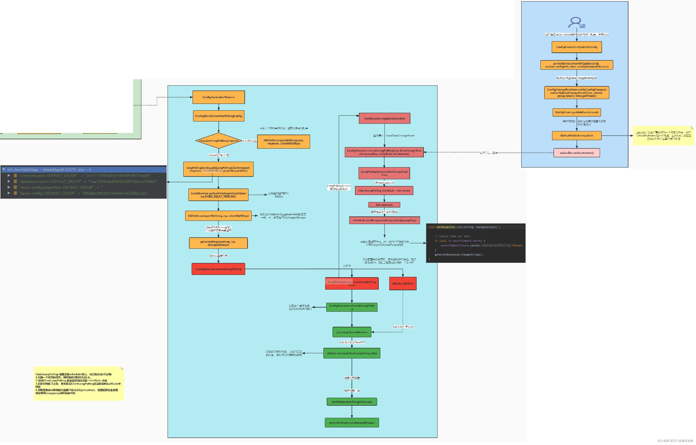

Lf
