JVM**的深入浅出实战 作者：严镇涛**

01 **优秀的**Java**开发者**

大家都是有经验的Java开发人员，想想为何要学习JVM？[面试？调优？装逼？]

不管出于何种原因，总之你得先学好。那怎么学好呢？ 因为目前课堂中有大学生和工作几年的，也就是每个人对于JVM的了解可能不一样，这就要考虑到怎么

切入

既然大家都学习过Java，那不妨就从Java开始聊起，同时也是扫盲，毕竟不是每个小伙伴都是计算机专 业

1.1 **什么是**Java**？**

Java是一门面向对象的高级编程语言

1.2 **编程语言**

**编程语言**（英语：programming language），是用来定义[计算机程序]的[形式语言]。它是一种被[标准 化]的交流技巧，用来向[计算机]发出指令。一种能够让[程序员]准确地定义计算机所需要使用数据的计 算机语言，并精确地定义在不同情况下所应当采取的行动。

**说白了就是让人类能够和计算机沟通，所以要学习计算机能够懂的语言**

1.3 **计算机**[**硬件**]**能够懂的语言**

1.3.1 **计算机发展史**

1946-1958：电子管计算机

1958-1964：晶体管计算机

1964-1970：集成电路计算机

1970-至今：大规模集成电路计算机 猜想：未来以蛋白质分子作为原材料，量子计算机[已经有了]

1.3.2 **计算机体系结构**

遵循冯诺依曼计算机结构

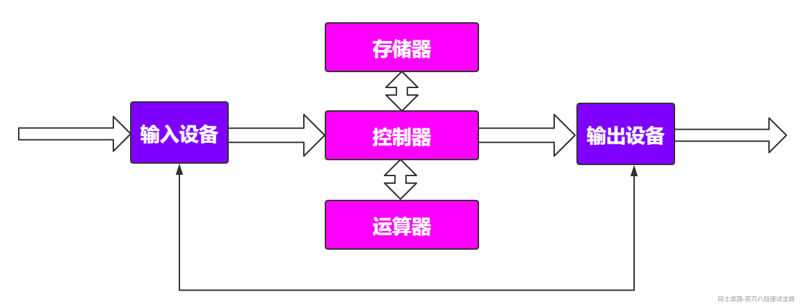

1.3.3 **计算机处理数据过程**

（1）提取阶段:由输入设备把原始数据或信息输入给计算机存储器存起来

（2）解码阶段:根据CPU的指令集架构(ISA)定义将数值解译为指令

（3）执行阶段:再由控制器把需要处理或计算的数据调入运算器

（4）最终阶段:由输出设备把最后运算结果输出 **本质上就是**CPU**取数据指令然后返回** CPU=存储器+运算器+控制器

1.3.4 **机器语言**

我们把CPU能够直接认识的数据指令，称为机器语言，也就是010101001这种形式

1.3.5 **不同厂商的**CPU 单核、双核、多核 Intel、AMD、IBM等

不同CPU使用的CPU指令集是不一样的，这就会有不兼容的问题 而且要是直接操作01这种形式的，非常麻烦并且容易出错，硬件资源管理起来也不方便

1.3.6 **操作系统**

向下对接指令系统、管理硬件资源 向上提供给用户简单的操作命令和界面

1.3.7 **汇编语言** 低级语言，通过汇编器翻译成机器语言 MOV、PUSH、ADD等

对机器友好，执行效率比较高，移植性差 但是人类操作起来还是不太方便，或者需要专业的人员

1.3.8 **高级语言**

C、C++、Java、Python、Golang等

**最终肯定还是要转换成机器能够懂的机器语言**

1.3.9 **编译型和解释型**

1.3.9.1 **编译型** 使用专门的编译器，针对**特定的平台**，将高级语言源代码一次性的编译成 可被该平台硬件执行的机器码，并包装成该平台所能识别的可执行性程序的格式。

C、C++、GoLang

编译型语言： 执行速度快、效率高；依靠编译器、跨平台性差些。 把做好的源程序全部编译成二进制代码的可运行程序。然后，可直接运行这个程序。

1.3.9.2 **解释型**

使用专门的解释器对源程序逐行解释成特定平台的机器码并立即执行。 是代码在执行时才被解释器一行行动态翻译和执行，而不是在执行之前就完成翻译。

Python、Javascript

解释型语言：

执行速度慢、效率低；依靠解释器、跨平台性好。 把做好的源程序翻译一句，然后执行一句，直至结束。

1.3.9.3 Java**呢？**

Java属于编译型+解释型的高级语言

其实并不是因为有javac将Java源码编译成class文件，才说Java属于编译+解释语言，因为在这个编译器编

译之后，生成的类文件不能直接在对应的平台上运行。 那为何又说Java是编译+解释语言呢？因为class文件最终是通过JVM来翻译才能在对应的平台上运行，而这 个翻译大多数时候是解释的过程，但是也会有编译，称之为运行时编译，即JIT(Just In Time)。 综上所述，Java是一门编译型+解释型的高级语言。

1.4 So JVM**是什么？**

Java Virtual Machine(Java虚拟机)

Write Once Run Anywhere

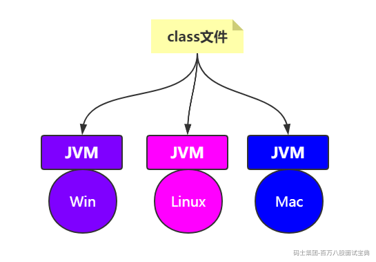

1.5 JDK JRE JVM

Java官网 ：<https://docs.oracle.com/javase/8/>

Reference -> Developer Guides -> 定位到:<https://docs.oracle.com/javase/8/docs/index.html>

JDK 8 is a superset of JRE 8, and contains everything that is in JRE 8, plus tools such as the compilers and debuggers necessary for developing applets and applications. JRE 8 provides the libraries, the Java Virtual Machine (JVM), and other components to run applets and applications written in the Java programming language. Note that the JRE includes components not required by the Java SE specification, including both standard and non-standard Java components.

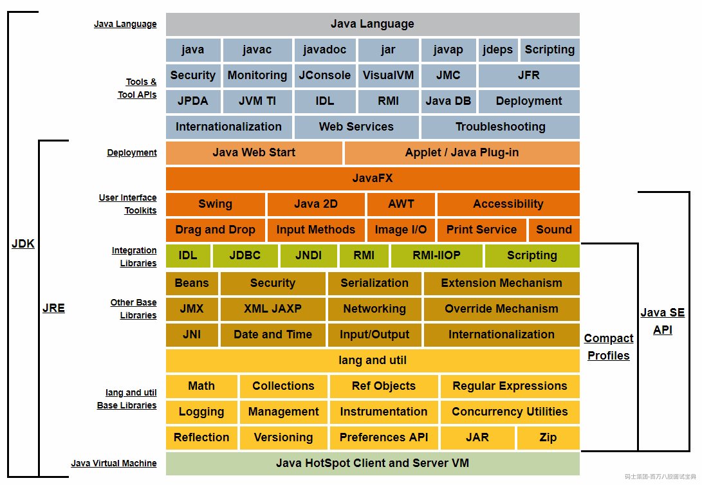

02 JVM**到底该学习什么**

或者换句话说，JVM到底从哪边开始学习起？

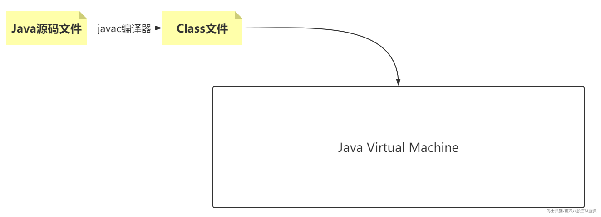

(1)源码到类文件 (2)类文件到JVM (3)JVM各种折腾[内部结构、执行方式、垃圾回收、本地调用等]

2.1 **源码到类文件**

2.1.1 **源码**demo

class Person{

private String name="司马老师";

private int age;

private final double salary=100;

private static String address;

private final static String hobby="Programming";

private static Object obj=new Object();

public void say(){ System.out.println("person say...");

}

public static int calc(int op1,int op2){

op1=3;

int result=op1+op2; Object obj=new Object(); return result;

}

public static void main(String[] args){

calc(1,2);

}

}

编译: javac -g:vars Person.java ---> Person.class

2.1.2 **前期编译**

Person.java -> 词法分析器 -> tokens流 -> 语法分析器 -> 语法树/抽象语法树

-> 语义分析器 -> 注解抽象语法树 -> 字节码生成器 -> Person.class文件

2.1.3 **类文件**(Class**文件**)

2.1.3.1 16**进制**

cafe babe 0000 0034 003f 0a00 0a00 2b08

002c 0900 0d00 2d06 4059 0000 0000 0000

0900 0d00 2e09 002f 0030 0800 310a 0032

0033 0700 340a 000d 0035 0900 0d00 3607

0037 0100 046e 616d 6501 0012 4c6a 6176

612f 6c61 6e67 2f53 7472 696e 673b 0100

0361 6765 0100 0149 0100 0673 616c 6172

7901 0001 4401 000d 436f 6e73 7461 6e74

......

2.1.3.2 The ClassFile Structure

官网 ：  <https://docs.oracle.com/javase/specs/jvms/se8/html/jvms-4.html>

ClassFile {

u4 magic;

u2 minor\_version;

u2 major\_version;

u2 constant\_pool\_count;

cp\_info constant\_pool[constant\_pool\_count-1];

u2 access\_flags;

u2 this\_class;

u2 super\_class;

u2 interfaces\_count;

u2 interfaces[interfaces\_count];

u2 fields\_count; field\_info fields[fields\_count]; u2 methods\_count;

method\_info methods[methods\_count]; u2 attributes\_count; attribute\_info attributes[attributes\_count];

}

2.1.3.3 Simple analysis

u4 :cafebabe

magic:The magic item supplies the magic number identifying the class file

format

u2+u2:0000+0034，34等于10进制的52，表示JDK8

minor\_version

major\_version

u2:003f=63(10进制)

constant\_pool\_count:

The value of the constant\_pool\_count item is equal to the number of entries in the constant\_pool table plus one.

**表示常量池中的数量是**62

cp\_info constant\_pool[constant\_pool\_count-1]

The constant\_pool is a table of structures representing various string constants, class and interface names, field names, and other constants that are referred to within the ClassFile structure and its substructures. The format of each constant\_pool table entry is indicated by its first "tag" byte.

The constant\_pool table is indexed from 1 to constant\_pool\_count - 1.

**常量池主要存储两方面内容：字面量**(Literal)**和符号引用**(Symbolic References)

字面量:文本字符串，final修饰等

符号引用：类和接口的全限定名、字段名称和描述符、方法名称和描述符

2.1.3.4 javap**验证**

JDK自带的命令

javap -h

可以验证一下上述Classfile Structure前面几块内容的正确性 javap -v -p Person.class 进行反编译，查看字节码信息和指令等信息 是否有一种感觉？

JVM相对class文件来说可以理解为是操作系统；class文件相对JVM来说可以理解为是汇编语言或者机器 语言。

C lassfile /O : / temp/ jvm /labs/ Person .class

Last modif ied 2020-3-26 ; size 93 bytes

MD5 checksum Oc4ee2ae34eb7e62 f4 bf 621dc4 5b3325 class Person

:::::2 J

:;;:::; -

f lags : ACC SUPER Co######n#################################### !J.t.:l.nt pool

EJEJ4EaJAEJAEJHE4J6RJA4EJ4EJ4RAqJAAAAUFdUnAsdqdqdJqdAnIsqdJ--"II

!f)

EEJAApJJbaa9?E4-l"EdQQUQU"4UUUQQ64JArQQAQJJJJFJnnnn4EAvvvu&4 = Methodref

*1**2* =====================--============================ String

*13* = UUNCcNCUUUuUUUUUSUUNUUUUUUUUUUUuUUUUNUNieldref

1ataaatttttttttttttttttttttttttatatatt

#4 = ble

Domfmfafamffffffffaffffmfffffffffffffmffmff BeBBsBBeBeBBeBBBBBSIBBBeBBBBBBBBBBBBBB ieldsMSMSMhh

#6 = F r ef

*1**7* = Fieldrdddddddf

*1**8* = String TTTTTTTmmmwwmw

*1**9* = Methodref

*1**1**0* = Class

eeeeeee

110 .143

*1**44*

113.14 5

100 . 0d

113 .14 6

*14**7**.**14*

*14**9*

*1**50**.**1**51*

*1**52*

/ / java/lang /Ob ject . "<in it>" : ()V

/ / Jack

// Person . name :Ljava/lang/String;

// Person . sa la ry :D

// java/lang /System .ou Ljava/io/ PrintSt eami

/ / person say

// java/io/ PrintStream . print ln : ( Ljava /lang/String; )V

// java/lang /Ob ject

*1**11* = Methodref

112 = Fieldref

*1**13**.**#**53* // Person .calc : (11)1

*1**1**3**.**1**5**4* // Person .ob j :Ljava/lang/Ob ject ;

*1**55* // Person

Lj ava /lang/Stringi age

z

salary D ConstantValue address

hobby

*1**56* // programming ob j

Ljava/lang/Object;

<in it> ()V Code

LocalVariableTable

this LPerson; say

S

calc (II) 1 p1

op2 result

([L java/lang/St ring;) V

args

[L java/lang/String;

<clinit>

*1**26**:**1**2**7*

Jack

114 :115

11:119

*1**57*

*1**58**:1**59*

person say ...

/ / "<init>" : () V

// name :Ljava/lang/String;

// sa lary :D

// java/lang /System

// out :Ljava /io/ PrintStream ;

*1**60* // java/io/ printSt ream

#6*1**:* *162* // println : ( Lj ava /lang /String; )V

java /lang/Object

*133* *:* 134 / / calc : (II ) 1

*1**2**4**:**12**5* //ob j :Ljava /lang /Ob ject ; Person

p rog amm.1ng

java /lang/System ut

Ljava/io/PrintStrearn i java/io/ printStream println

( Ljava/lang/Stringi )V

private java . lang .Dtring narne descriptor : Ljava/lang /String; f lags : ACC\_ PR1VATE

pr1vate 1nt age;

descriptor : 1

f lags : ACC\_ PR1VATE

private f inal double salary;

descripto D

f lags : ACC\_ PR1VATE ACC\_F1NAL ConstantValue : double 100 . 0d

private static java .lang .St ring address;

descriptor : Ljava/lang /String;

f lags : ACC\_ PR1VATE ACC\_STAT1C

private static f ina l java . lang .String hobby;

descriptor : Lj ava /lang /String;

f lags : ACC\_ PR1VATE ACC\_STAT1C ACC\_F1NAL ConstantValue : String Programming

private static java .lang .Ob ject Ob ji descriptor : Ljava/lang/Ob ject;

f lags : ACC\_ PR1VATE ACC\_STAT1C

Person() ; descriptor : () V f lags

Code

stack=3 loca ls=1 args size=1

0 : a load 0

1: invokespecial *1**1*

4 : a load 0

// Method java llang/Ob ject . "<init>" : ()V

5 : ldc 12

7 : putfield 13

10 : a load 0

/ / String Jack

// Field name :L java/lang/Str ing;

11: ldc2 w

*14* // double 100 . 0d

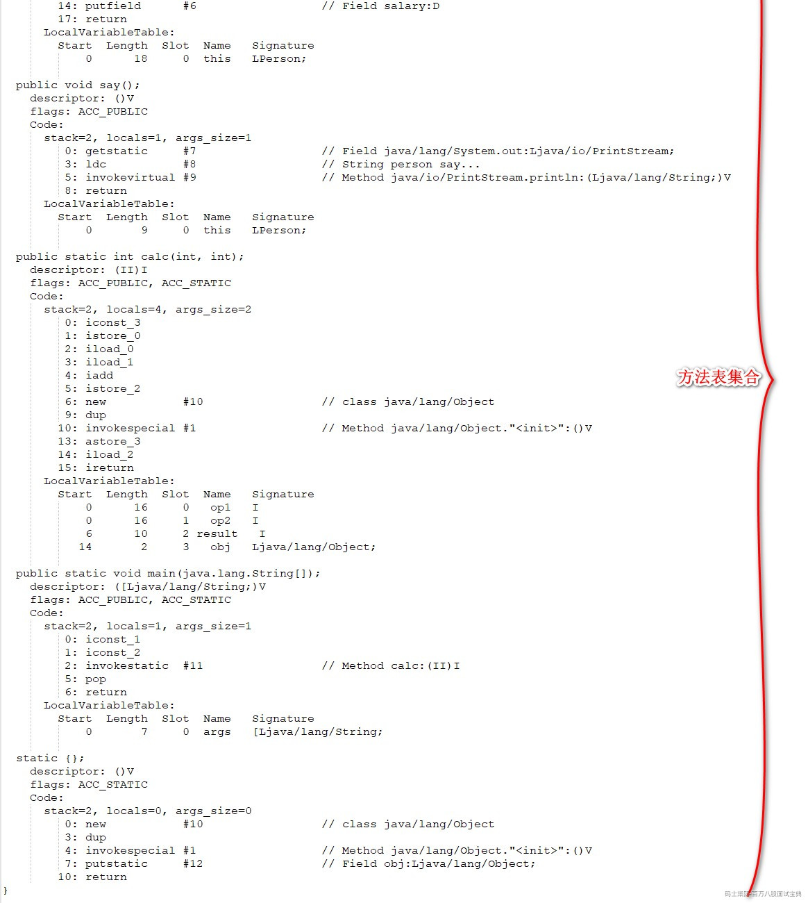

2.1.3.5 Continous analysis

上面分析到常量池中常量的数量是62，接下来我们来具体分析一下这62个常量 cp\_info constant\_pool[constant\_pool\_count-1] 也就是这块包括的信息 cp\_info其实就是一个表格的形式

All constant\_pool table entries have the following general format:

cp\_info {

u1 tag;

u1 info[];

}

官网 ：<https://docs.oracle.com/javase/specs/jvms/se8/html/jvms-4.html#jvms-4.4>

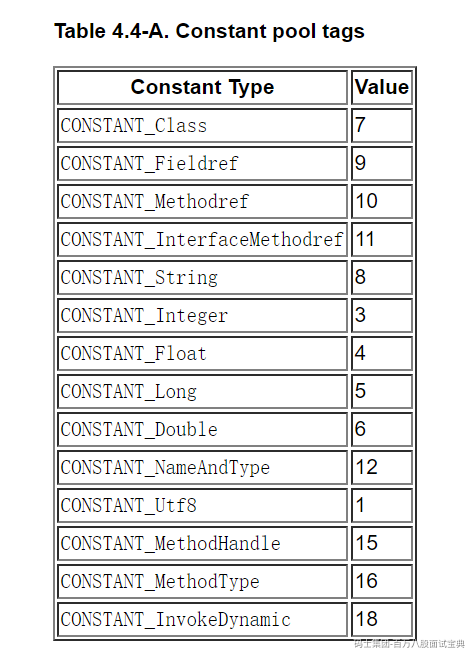

(1)往下数一个u1，即0a->10:代表的是CONSTANT\_Methodref，表示这是一个方法引用

CONSTANT\_Fieldref\_info {

u1 tag;

u2 class\_index;

u2 name\_and\_type\_index;

}

往下数u2和u2

u2，即00 0a->10:代表的是class\_index，表示该方法所属的类在常量池中的索引

u2，即00 2b->43:代表的是name\_and\_type\_index，表示该方法的名称和类型的索引

#1 = Methodref #10，#43

(2)往下数u1，即08->8:表示的是CONSTANT\_String，表示字符串类型

CONSTANT\_String\_info {

u1 tag;

u2 string\_index;

}

往下数u2

u2，即00 2c->44:代表的是string\_index

#1 = Methodref #10，#43

#2 = String #44

(3)往下数u1，即09->9:表示的是CONSTANT\_Fieldref，表示字段类型

CONSTANT\_Fieldref\_info {

u1 tag;

u2 class\_index;

u2 name\_and\_type\_index;

}

往下数u2和u2

u2，即00 0d->13:代表的是class\_index

u2，即00 2d->45:代表的是name\_and\_type\_index

#1 = Methodref #10.#43

#2 = String #44

#3 = Fieldref #13.#45

2.2 **类文件到虚拟机**( **类加载机制**)

**所谓类加载机制就是**

虚拟机把Class文件加载到内存

并对数据进行校验，转换解析和初始化 形成可以虚拟机直接使用的Java类型，即java.lang.Class

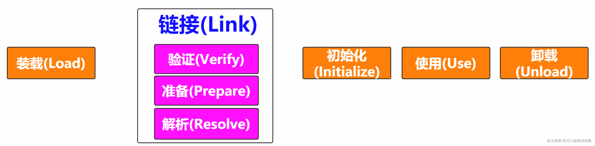

2.2.1 **装载**(Load)

查找和导入class文件

（1）通过一个类的全限定名获取定义此类的二进制字节流

（2）将这个字节流所代表的静态存储结构转化为方法区的运行时数据结构

（3）在Java堆中生成一个代表这个类的java.lang.Class对象，作为对方法区中这些数据的访问入口

Class对象封装了类在方法区内的数据结构，并且向Java程序员提供了访问方法区内的数据结构的接口。在

Java堆中生成一个代表这个类的java.lang.Class对象，作为对方法区中这些数据的访问入口

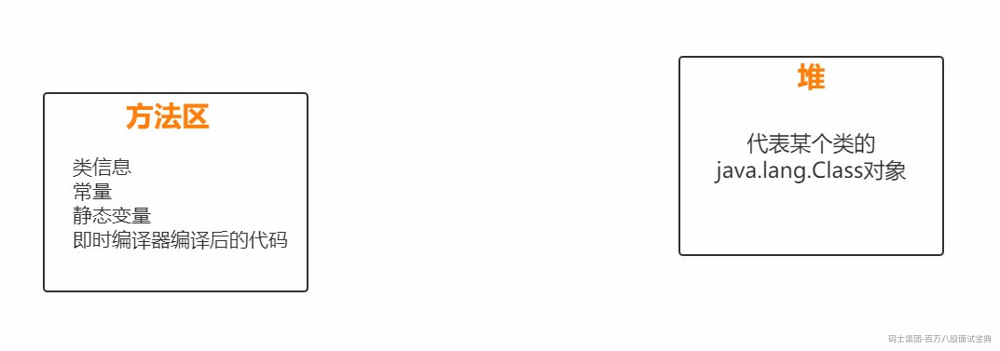

2.2.2 **链接**(Link)

2.2.2.1 **验证**(Verify)

保证被加载类的正确性 文件格式验证

元数据验证 字节码验证 符号引用验证

2.2.2.2 **准备**(Prepare)

为类的静态变量分配内存，并将其初始化为默认值

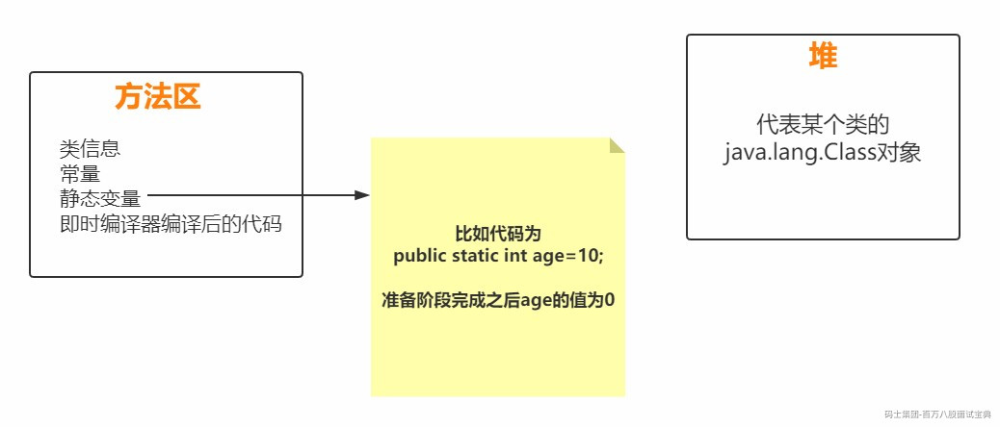

public class Demo1 {

private static int i;

public static void main(String[] args) {

// 正常打印出0，因为静态变量i在准备阶段会有默认值0

System.out.println(i);

}

}

public class Demo2 {

public static void main(String[] args) {

// 编译通不过，因为局部变量没有赋值不能被使用

int i; System.out.println(i);

}

}

2.2.2.3 **解析**(Resolve)

把类中的符号引用转换为直接引用

符号引用就是一组符号来描述目标，可以是任何字面量。

直接引用就是直接指向目标的指针、相对偏移量或一个间接定位到目标的句柄。

解析阶段是虚拟机将常量池内的符号引用替换为直接引用的过程。

解析动作主要针对类或接口、字段、类方法、接口方法、方法类型、方法句柄和调用限定符7类符号引用进 行。

2.2.3 **初始化**(Initialize)

对类的静态变量，静态代码块执行初始化操作

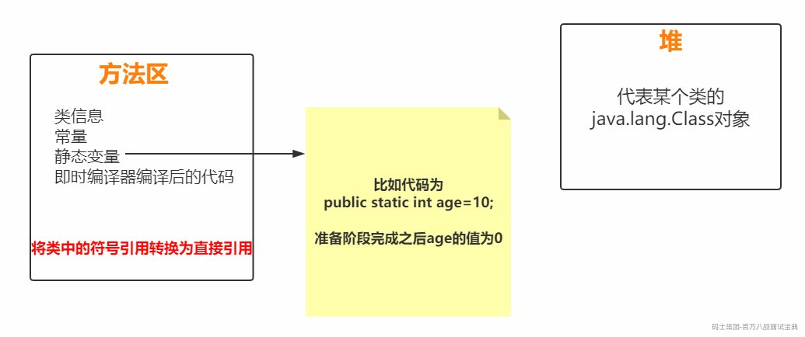

2.2.4 **类加载器**ClassLoader

在装载(Load)阶段，其中第(1)步:通过类的全限定名获取其定义的二进制字节流，需要借助类装载 器完成，顾名思义，就是用来装载Class文件的。

2.2.4.1 **分类**

1）Bootstrap ClassLoader 负责加载$JAVA\_HOME中 jre/lib/rt.jar 里所有的class或

Xbootclassoath选项指定的jar包。由C++实现，不是ClassLoader子类。

2）Extension ClassLoader 负责加载java平台中扩展功能的一些jar包，包括$JAVA\_HOME中

jre/lib/\*.jar 或 -Djava.ext.dirs指定目录下的jar包。

3）App ClassLoader 负责加载classpath中指定的jar包及 Djava.class.path 所指定目录下的类和

jar包。

4）Custom ClassLoader 通过java.lang.ClassLoader的子类自定义加载class，属于应用程序根据自 身需要自定义的ClassLoader，如tomcat、jboss都会根据j2ee规范自行实现ClassLoader。

2.2.4.2 **图解**

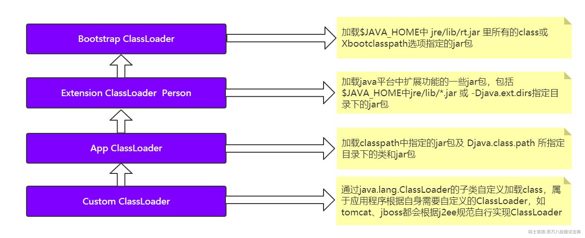

public class Demo3 {

public static void main(String[] args) {

// App ClassLoader

System.out.println(new Worker().getClass().getClassLoader());

// Ext ClassLoader

System.out.println(new

Worker().getClass().getClassLoader().getParent());

// Bootstrap ClassLoader

System.out.println(new

Worker().getClass().getClassLoader().getParent().getParent()); System.out.println(new String().getClass().getClassLoader());

}

}

sun.misc.Launcher$AppClassLoader@18b4aac2 sun.misc.Launcher$ExtClassLoader@3a71f4dd null

null

2.2.4.3 **加载原则**[**双亲委派**]

（1）检查某个类是否已经加载

自底向上，从Custom ClassLoader到BootStrap ClassLoader逐层检查，只要某个Classloader已加载， 就视为已加载此类，保证此类只所有ClassLoader加载一次。

（2）加载的顺序 自顶向下，也就是由上层来逐层尝试加载此类。

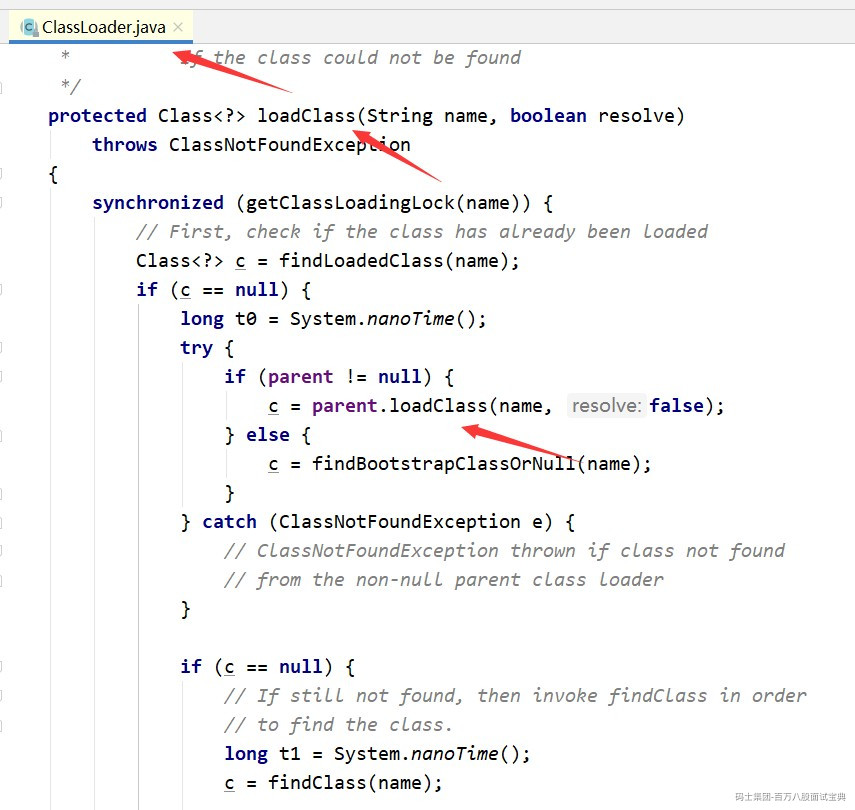

2.2.4.4 **破坏双亲委派**

（1）tomcat

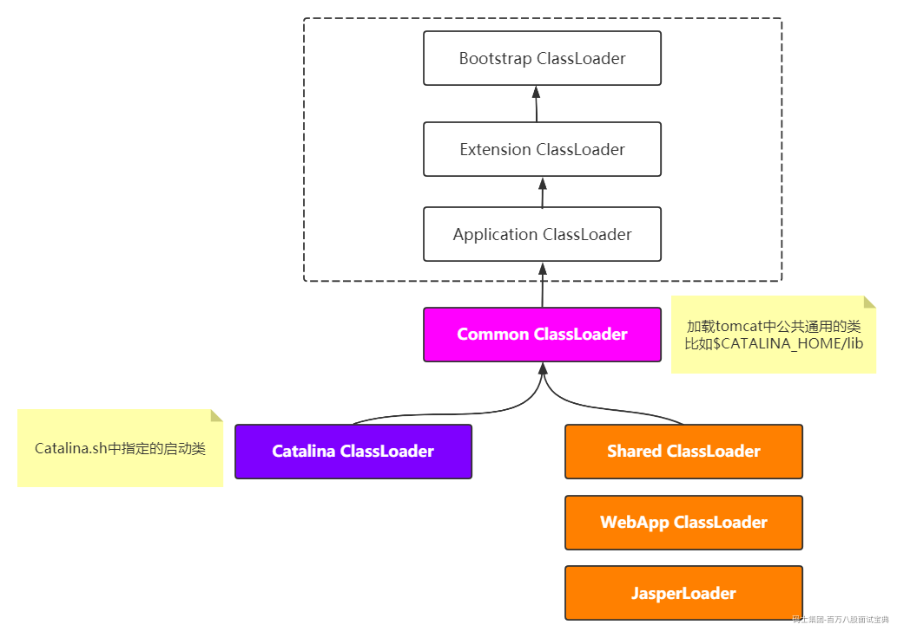

（2）SPI机制

（3）OSGi

2.3 **运行时数据区**(Run-Time Data Areas)

在装载阶段的第(2),(3)步可以发现有运行时数据，堆，方法区等名词

(2)将这个字节流所代表的静态存储结构转化为方法区的运行时数据结构 (3)在Java堆中生成一个代表这个类的java.lang.Class对象，作为对方法区中这些数据的访问入口 说白了就是类文件被类装载器装载进来之后，类中的内容(比如变量，常量，方法，对象等这些数据得要 有个去处，也就是要存储起来，存储的位置肯定是在JVM中有对应的空间)

2.3.1 **官网概括**

官网 ：<https://docs.oracle.com/javase/specs/jvms/se8/html/index.html>

The Java Virtual Machine defines various run-time data areas that are used during execution of a program. Some of these data areas are created on Java Virtual Machine start-up and are destroyed only when the Java Virtual Machine exits.

Other data areas are per thread. Per-thread data areas are created when a thread

is created and destroyed when the thread exits.

2.3.2 **图解**

Each run-time constant pool is allocated from the Java Virtual Machine's method area (§2.5.4).s

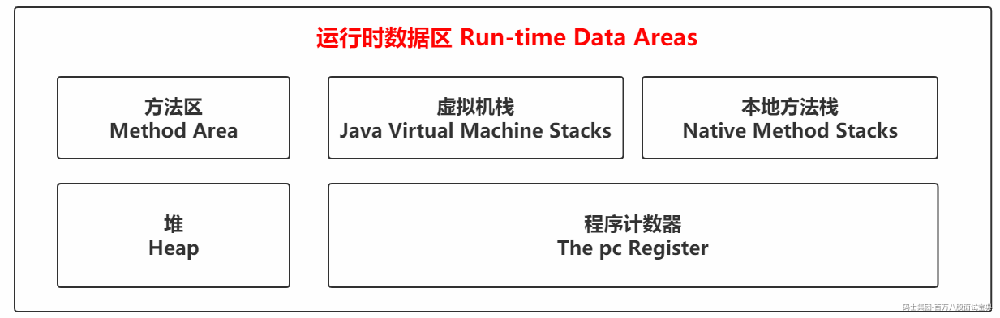

2.3.3 **初步认识**

2.3.3.1 Method Area(**方法区**)

（1）方法区是各个线程共享的内存区域，在虚拟机启动时创建

The Java Virtual Machine has a method area that is shared among all Java Virtual

Machine threads.

The method area is created on virtual machine start-up.

（2）虽然Java虚拟机规范把方法区描述为堆的一个逻辑部分，但是它却又一个别名叫做Non-Heap(非

堆)，目的是与Java堆区分开来

Although the method area is logically part of the heap,......

（3）用于存储已被虚拟机加载的类信息、常量、静态变量、即时编译器编译后的代码等数据

It stores per-class structures such as the run-time constant pool, field and method data, and the code for methods and constructors, including the special methods (§2.9) used in class and instance initialization and interface

initialization.

（4）当方法区无法满足内存分配需求时，将抛出OutOfMemoryError异常

If memory in the method area cannot be made available to satisfy an allocation

request, the Java Virtual Machine throws an OutOfMemoryError.

此时回看装载阶段的第2步，将这个字节流所代表的静态存储结构转化为方法区的运行时数据结构

如果这时候把从Class文件到装载的第(1)和(2)步合并起来理解的话，可以画个图

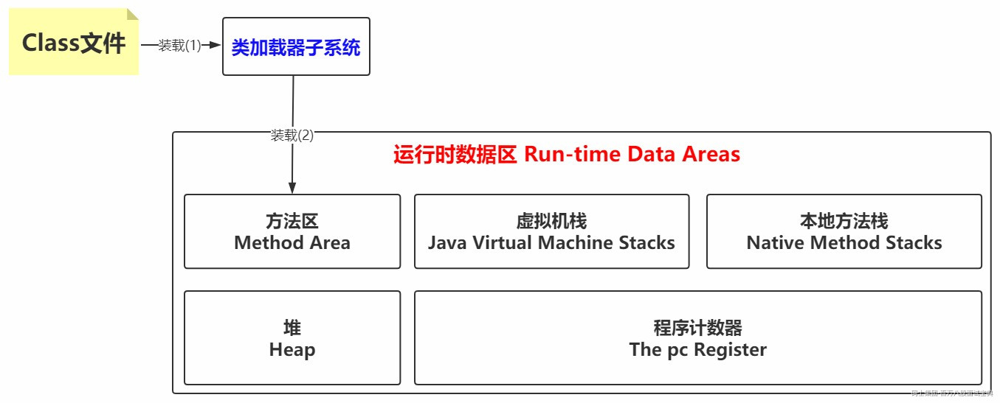

**值得说明的**

JVM运行时数据区是一种规范，真正的实现

在JDK 8中就是Metaspace，在JDK6或7中就是Perm Space

2.3.3.2 Heap(**堆**)

（1）Java堆是Java虚拟机所管理内存中最大的一块，在虚拟机启动时创建，被所有线程共享。

（2）Java对象实例以及数组都在堆上分配。

The Java Virtual Machine has a heap that is shared among all Java Virtual Machine threads. The heap is the run-time data area from which memory for all class instances and arrays is allocated.

The heap is created on virtual machine start-up.

此时回看装载阶段的第3步，在Java堆中生成一个代表这个类的java.lang.Class对象，作为对方法

区中这些数据的访问入口

此时装载(1)(2)(3)的图可以改动一下

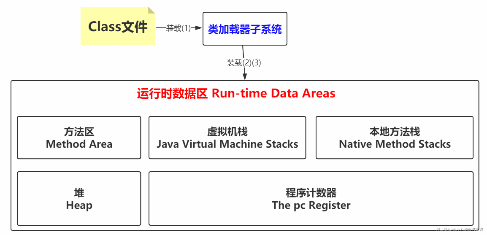

2.3.3.3 Java Virtual Machine Stacks(**虚拟机栈**)

经过上面的分析，类加载机制的装载过程已经完成，后续的链接，初始化也会相应的生效。 假如目前的阶段是初始化完成了，后续做啥呢？肯定是Use使用咯，不用的话这样折腾来折腾去有

什么意义？那怎样才能被使用到？换句话说里面内容怎样才能被执行？比如通过主函数main调用 其他方法，这种方式实际上是main线程执行之后调用的方法，即要想使用里面的各种内容，得要 以线程为单位，执行相应的方法才行。**那一个线程执行的状态如何维护？一个线程可以执行多少个 方法？这样的关系怎么维护呢？**

（1）虚拟机栈是一个线程执行的区域，保存着一个线程中方法的调用状态。换句话说，一个Java线程的 运行状态，由一个虚拟机栈来保存，所以虚拟机栈肯定是线程私有的，独有的，随着线程的创建而创 建。

Each Java Virtual Machine thread has a private Java Virtual Machine stack,

created at the same time as the thread.

（2）每一个被线程执行的方法，为该栈中的栈帧，即每个方法对应一个栈帧。

调用一个方法，就会向栈中压入一个栈帧；一个方法调用完成，就会把该栈帧从栈中弹出。

A Java Virtual Machine stack stores frames (§2.6).

A new frame is created each time a method is invoked. A frame is destroyed when

its method invocation completes.

**图解栈和栈帧**

void a(){

b();

}

void b(){

c();

}

void c(){

}

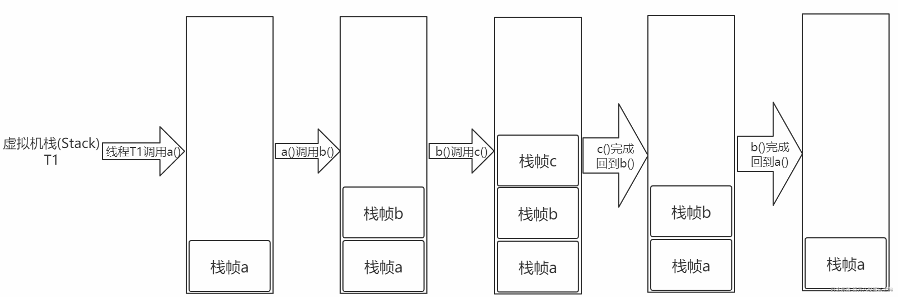

**栈帧**

官网 ：<https://docs.oracle.com/javase/specs/jvms/se8/html/jvms-2.html#jvms-2.6>

栈帧：每个栈帧对应一个被调用的方法，可以理解为一个方法的运行空间。 每个栈帧中包括局部变量表(Local Variables)、操作数栈(Operand Stack)、指向运行时常量池的引用(A

reference to the run-time constant pool)、方法返回地址(Return Address)和附加信息。

局部变量表:方法中定义的局部变量以及方法的参数存放在这张表中

局部变量表中的变量不可直接使用，如需要使用的话，必须通过相关指令将其加载至操作数栈中作为操作数使 用。

操作数栈:以压栈和出栈的方式存储操作数的

动态链接:每个栈帧都包含一个指向运行时常量池中该栈帧所属方法的引用，持有这个引用是为了支持方法调用

过程中的动态连接(Dynamic Linking)。

方法返回地址:当一个方法开始执行后,只有两种方式可以退出，一种是遇到方法返回的字节码指令；一种是遇

见异常，并且这个异常没有在方法体内得到处理。

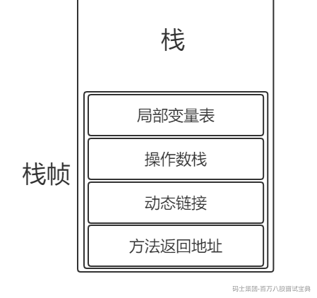

**结合字节码指令理解栈帧**

javap -c Person.class > Person.txt

Compiled from "Person.java" class Person {

...

public static int calc(int, int); Code:

0: iconst\_3 //将int类型常量3压入[操作数栈]

1: istore\_0 //将int类型值存入[局部变量0]

2: iload\_0 //从[局部变量0]中装载int类型值入栈

3: iload\_1 //从[局部变量1]中装载int类型值入栈

4: iadd //将栈顶元素弹出栈，执行int类型的加法，结果入栈

5: istore\_2 //将栈顶int类型值保存到[局部变量2]中

6: iload\_2 //从[局部变量2]中装载int类型值入栈

7: ireturn //从方法中返回int类型的数据

...

}

思考 ：index的值是0还是1

On class method invocation, any parameters are passed in consecutive local variables starting from local variable 0. On instance method invocation, local variable 0 is always used to pass a reference to the object on which the instance method is being invoked (this in the Java programming language). Any parameters are subsequently passed in consecutive local variables starting from local variable 1.

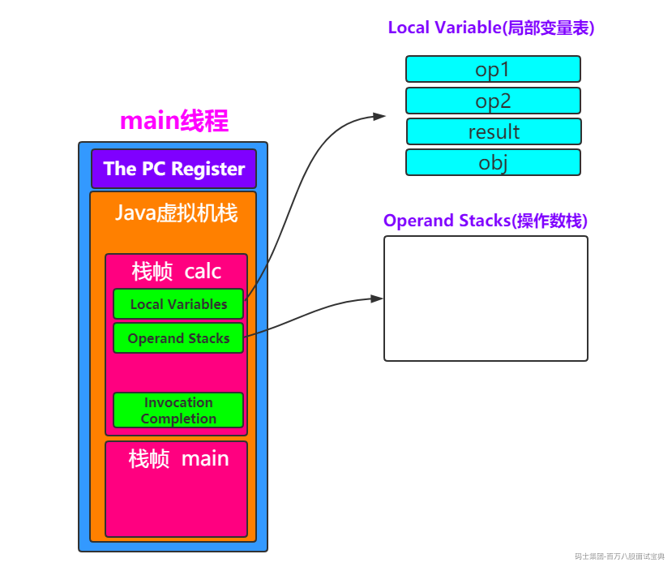

2.3.3.4 The pc Register(**程序计数器**)

我们都知道一个JVM进程中有多个线程在执行，而线程中的内容是否能够拥有执行权，是根据CPU

调度来的。

假如线程A正在执行到某个地方，突然失去了CPU的执行权，切换到线程B了，然后当线程A再获得 CPU执行权的时候，怎么能继续执行呢？这就是需要在线程中维护一个变量，记录线程执行到的位 置。

如果线程正在执行Java方法，则计数器记录的是正在执行的虚拟机字节码指令的地址； 如果正在执行的是Native方法，则这个计数器为空。

The Java Virtual Machine can support many threads of execution at once (JLS §17). Each Java Virtual Machine thread has its own pc (program counter) register. At

any point, each Java Virtual Machine thread is executing the code of a single method, namely the current method (§2.6) for that thread. If that method is not native, the pc register contains the address of the Java Virtual Machine instruction currently being executed. If the method currently being executed by the thread is native, the value of the Java Virtual Machine's pc register is undefined. The Java Virtual Machine's pc register is wide enough to hold a returnAddress or a native pointer on the specific platform.

2.3.3.5 Native Method Stacks(**本地方法栈**)

如果当前线程执行的方法是Native类型的，这些方法就会在本地方法栈中执行。 那如果在Java方法执行的时候调用native的方法呢？

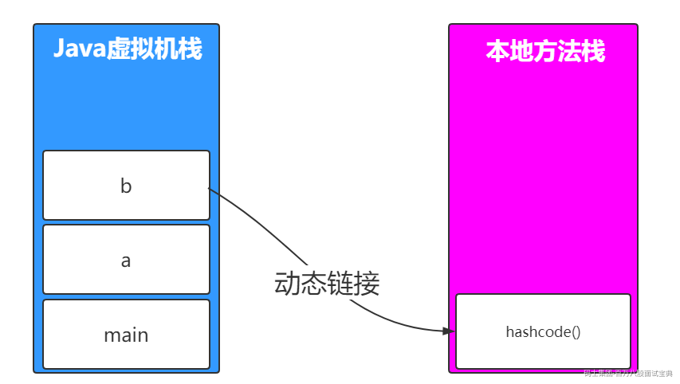

2.3.4 **折腾一下**

2.3.4.1 **栈指向堆**

如果在栈帧中有一个变量，类型为引用类型，比如Object obj=new Object()，这时候就是典型的栈中元 素指向堆中的对象。

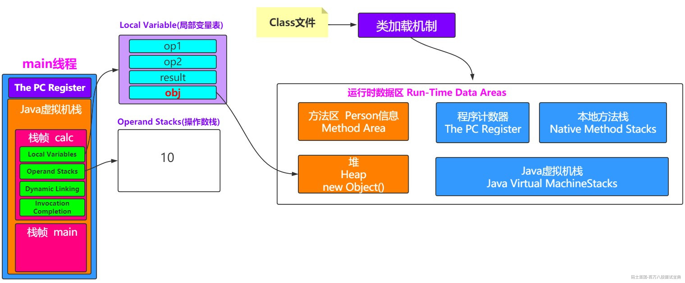

2.3.4.2 **方法区指向堆**

方法区中会存放静态变量，常量等数据。如果是下面这种情况，就是典型的方法区中元素指向堆中的对 象。

private static Object obj=new Object();

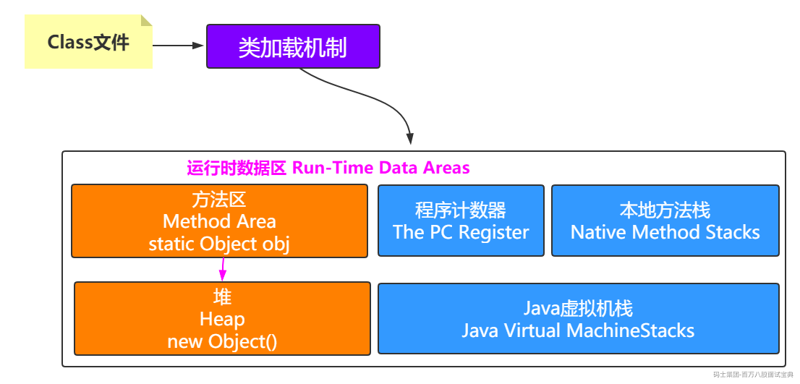

2.3.4.3 **堆指向方法区**

What？堆还能指向方法区？ 注意，方法区中会包含类的信息，堆中会有对象，那怎么知道对象是哪个类创建的呢？

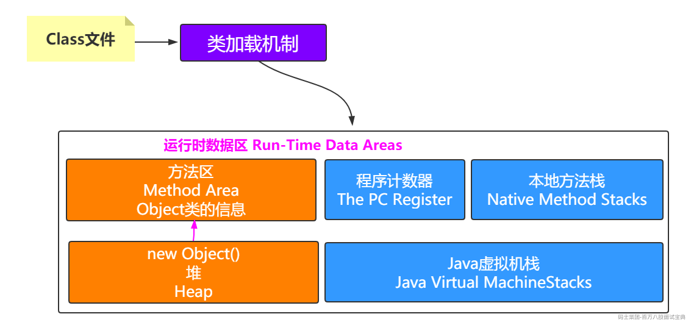

思考 ： 一个对象怎么知道它是由哪个类创建出来的？怎么记录？这就需要了解一个Java对象的具体信息咯。

2.3.4.4 Java**对象内存模型**

一个Java对象在内存中包括3个部分：对象头、实例数据和对齐填充

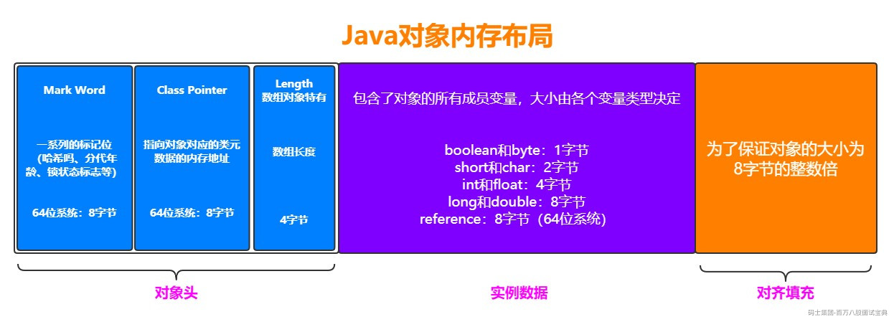

2.4 JVM**内存模型**

2.4.1 **与运行时数据区**

上面对运行时数据区描述了很多，其实重点存储数据的是堆和方法区(非堆)，所以内存的设计也着重从这 两方面展开(注意这两块区域都是线程共享的)。

对于虚拟机栈，本地方法栈，程序计数器都是线程私有的。

**可以这样理解，**JVM**运行时数据区是一种规范，而**JVM**内存模式是对该规范的实现**

2.4.2 **图形展示**

一块是非堆区，一块是堆区

堆区分为两大块，一个是Old区，一个是Young区 Young区分为两大块，一个是Survivor区（S0+S1），一块是Eden区 S0和S1一样大，也可以叫From和To

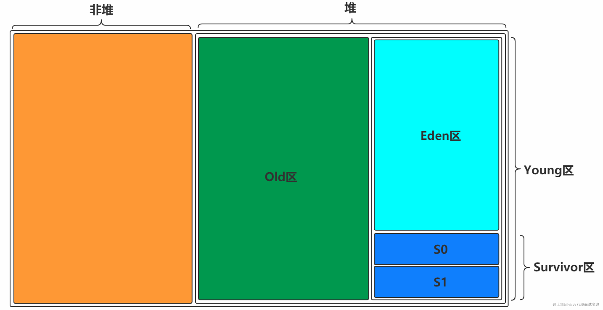

2.4.3 **对象创建过程**

一般情况下，新创建的对象都会被分配到Eden区，一些特殊的大的对象会直接分配到Old区。

我是一个普通的Java对象,我出生在Eden区,在Eden区我还看到和我长的很像的小兄弟,我们在Eden区中玩了

挺长时间。有一天Eden区中的人实在是太多了,我就被迫去了Survivor区的“From”区,自从去了Survivor 区,我就开始漂了,有时候在Survivor的“From”区,有时候在Survivor的“To”区,居无定所。直到我18岁的 时候,爸爸说我成人了,该去社会上闯闯了。于是我就去了年老代那边,年老代里,人很多,并且年龄都挺大的。

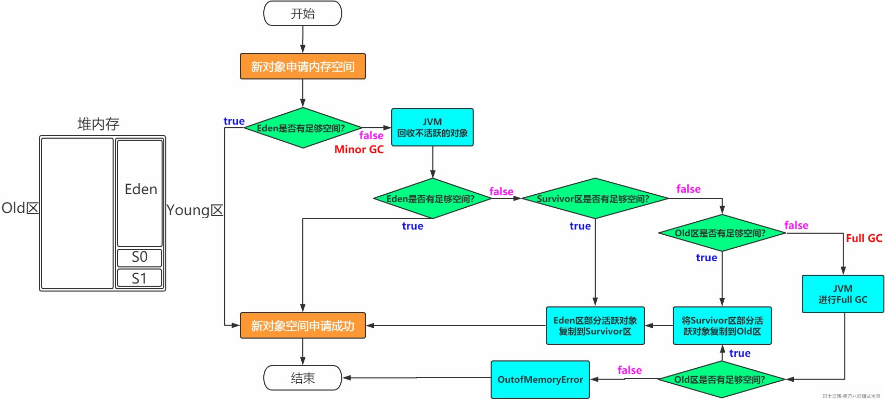

2.4.4 **常见问题**

如何理解Minor/Major/Full GC

Minor GC:新生代

Major GC:老年代

Full GC:新生代+老年代

为什么需要Survivor区?只有Eden不行吗？

如果没有Survivor,Eden区每进行一次Minor GC,存活的对象就会被送到老年代。

这样一来，老年代很快被填满,触发Major GC(因为Major GC一般伴随着Minor GC,也可以看做触发了Full

GC)。

老年代的内存空间远大于新生代,进行一次Full GC消耗的时间比Minor GC长得多。 执行时间长有什么坏处?频发的Full GC消耗的时间很长,会影响大型程序的执行和响应速度。

可能你会说，那就对老年代的空间进行增加或者较少咯。 假如增加老年代空间，更多存活对象才能填满老年代。虽然降低Full GC频率，但是随着老年代空间加大,一 旦发生Full GC,执行所需要的时间更长。

假如减少老年代空间，虽然Full GC所需时间减少，但是老年代很快被存活对象填满,Full GC频率增加。

所以Survivor的存在意义,就是减少被送到老年代的对象,进而减少Full GC的发生,Survivor的预筛选保 证,只有经历16次Minor GC还能在新生代中存活的对象,才会被送到老年代。

为什么需要两个Survivor区？

最大的好处就是解决了碎片化。也就是说为什么一个Survivor区不行?第一部分中,我们知道了必须设置

Survivor区。假设现在只有一个Survivor区,我们来模拟一下流程: 刚刚新建的对象在Eden中,一旦Eden满了,触发一次Minor GC,Eden中的存活对象就会被移动到Survivor 区。这样继续循环下去,下一次Eden满了的时候,问题来了,此时进行Minor GC,Eden和Survivor各有一些 存活对象,如果此时把Eden区的存活对象硬放到Survivor区,很明显这两部分对象所占有的内存是不连续的, 也就导致了内存碎片化。

永远有一个Survivor space是空的,另一个非空的Survivor space无碎片。

新生代中Eden:S1:S2为什么是8:1:1？

新生代中的可用内存：复制算法用来担保的内存为9:1 可用内存中Eden：S1区为8:1 即新生代中Eden:S1:S2 = 8:1:1

现代的商业虚拟机都采用这种收集算法来回收新生代，IBM公司的专门研究表明，新生代中的对象大概98%是

“朝生夕死”的

堆内存中都是线程共享的区域吗？

JVM默认为每个线程在Eden上开辟一个buffer区域，用来加速对象的分配，称之为TLAB，全称:Thread

Local Allocation Buffer。 对象优先会在TLAB上分配，但是TLAB空间通常会比较小，如果对象比较大，那么还是在共享区域分配。

2.4.5 **体验与验证**

2.4.5.1 **使用**visualvm

visualgc插件下载链接 ：<https://visualvm.github.io/pluginscenters.html>

选择对应JDK版本链接--->Tools--->Visual GC

若上述链接找不到合适的，大家也可以自己在网上下载对应的版本

2.4.5.2 **堆内存溢出**

代码

@RestController

public class HeapController {

List<Person> list=new ArrayList<Person>();

@GetMapping("/heap")

public String heap(){

while(true){

list.add(new Person());

}

}

}

记得设置参数比如-Xmx20M -Xms20M

运行结果

访问 ：<http://localhost:8080/heap>

Exception in thread "http-nio-8080-exec-2" java.lang.OutOfMemoryError: GC

overhead limit exceeded

2.4.5.3 **方法区内存溢出**

比如向方法区中添加Class的信息

asm依赖和Class代码

<dependency>

<groupId>asm</groupId>

<artifactId>asm</artifactId>

<version>3.3.1</version>

</dependency>

public class MyMetaspace extends ClassLoader {

public static List<Class<?>> createClasses() { List<Class<?>> classes = new ArrayList<Class<?>>(); for (int i = 0; i < 10000000; ++i) {

ClassWriter cw = new ClassWriter(0);

cw.visit(Opcodes.V1\_1, Opcodes.ACC\_PUBLIC, "Class" + i, null, "java/lang/Object", null);

MethodVisitor mw = cw.visitMethod(Opcodes.ACC\_PUBLIC, "<init>", "()V", null, null);

mw.visitVarInsn(Opcodes.ALOAD, 0);

mw.visitMethodInsn(Opcodes.INVOKESPECIAL, "java/lang/Object", "<init>", "()V");

mw.visitInsn(Opcodes.RETURN); mw.visitMaxs(1, 1); mw.visitEnd();

Metaspace test = new Metaspace();

byte[] code = cw.toByteArray();

Class<?> exampleClass = test.defineClass("Class" + i, code, 0, code.length);

classes.add(exampleClass);

}

return classes;

}

}

代码

@RestController

public class NonHeapController {

List<Class<?>> list=new ArrayList<Class<?>>();

@GetMapping("/nonheap")

public String nonheap(){

while(true){

list.addAll(MyMetaspace.createClasses());

}

}

}

设置Metaspace的大小，比如-XX:MetaspaceSize=50M -XX:MaxMetaspaceSize=50M

运行结果

访问-><http://localhost:8080/nonheap>

java.lang.OutOfMemoryError: Metaspace

at java.lang.ClassLoader.defineClass1(Native Method) ~[na:1.8.0\_191]

at java.lang.ClassLoader.defineClass(ClassLoader.java:763) ~[na:1.8.0\_191]

2.4.5.4 **虚拟机栈**

代码演示StackOverFlow

public class StackDemo {

public static long count=0;

public static void method(long i){ System.out.println(count++); method(i);

}

public static void main(String[] args) {

method(1);

}

}

运行结果

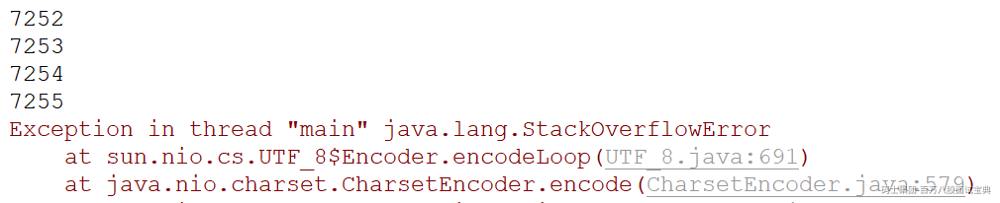

说明

Stack Space用来做方法的递归调用时压入Stack Frame(栈帧)。所以当递归调用太深的时候，就有可能耗

尽Stack Space，爆出StackOverflow的错误。

-Xss128k：设置每个线程的堆栈大小。JDK 5以后每个线程堆栈大小为1M，以前每个线程堆栈大小为256K。 根据应用的线程所需内存大小进行调整。在相同物理内存下，减小这个值能生成更多的线程。但是操作系统对 一个进程内的线程数还是有限制的，不能无限生成，经验值在3000~5000左右。

线程栈的大小是个双刃剑，如果设置过小，可能会出现栈溢出，特别是在该线程内有递归、大的循环时出现溢 出的可能性更大，如果该值设置过大，就有影响到创建栈的数量，如果是多线程的应用，就会出现内存溢出的 错误。

2.5 Garbage Collect(**垃圾回收**)

之前说堆内存中有垃圾回收，比如Young区的Minor GC，Old区的Major GC，Young区和Old区 的Full GC。 但是对于一个对象而言，怎么确定它是垃圾？是否需要被回收？怎样对它进行回收？等等这些问 题我们还需要详细探索。 因为Java是自动做内存管理和垃圾回收的，如果不了解垃圾回收的各方面知识，一旦出现问题我 们很难进行排查和解决，自动垃圾回收机制就是寻找Java堆中的对象，并对对象进行分类判别， 寻找出正在使用的对象和已经不会使用的对象，然后把那些不会使用的对象从堆上清除 。

2.5.1 **如何确定一个对象是垃圾？**

要想进行垃圾回收，得先知道什么样的对象是垃圾。

2.5.1.1 **引用计数法**

对于某个对象而言，只要应用程序中持有该对象的引用，就说明该对象不是垃圾，如果一个对象没有任 何指针对其

引用，它就是垃圾。

弊端 :如果AB相互持有引用，导致永远不能被回收。

2.5.1.2 **可达性分析**

通过GC Root的对象，开始向下寻找，看某个对象是否可达

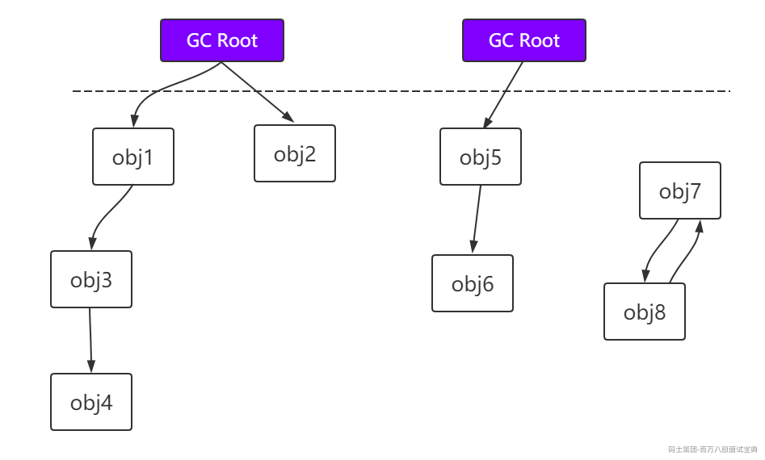

能作为GC Root:类加载器、Thread、虚拟机栈的本地变量表、static成员、常量引用、本地方法栈 的变量等。

虚拟机栈（栈帧中的本地变量表）中引用的对象。

方法区中类静态属性引用的对象。 方法区中常量引用的对象。 本地方法栈中JNI（即一般说的Native方法）引用的对象。

2.5.2 **什么时候会垃圾回收**

GC是由JVM自动完成的，根据JVM系统环境而定，所以时机是不确定的。 当然，我们可以手动进行垃圾回收，比如调用System.gc()方法通知JVM进行一次垃圾回收，但是 具体什么时刻运行也无法控制。也就是说System.gc()只是通知要回收，什么时候回收由JVM决 定。**但是不建议手动调用该方法，因为**GC**消耗的资源比较大**。

（1）当Eden区或者S区不够用了

（2）老年代空间不够用了

（3）方法区空间不够用了

（4）System.gc()

2.5.3 **垃圾收集算法**

已经能够确定一个对象为垃圾之后，接下来要考虑的就是回收，怎么回收呢？得要有对应的算法， 下面介绍常见的垃圾回收算法。

2.5.3.1 **标记**-**清除**(Mark-Sweep)

标记

找出内存中需要回收的对象，并且把它们标记出来

此时堆中所有的对象都会被扫描一遍，从而才能确定需要回收的对象，比较耗时

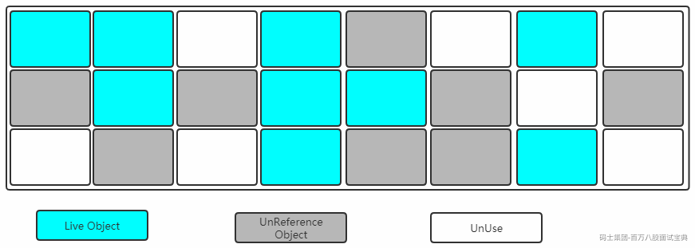

清除 清除掉被标记需要回收的对象，释放出对应的内存空间

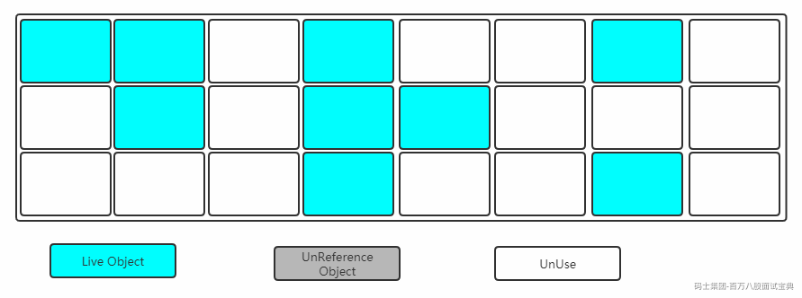

缺点

标记清除之后会产生大量不连续的内存碎片，空间碎片太多可能会导致以后在程

序运行过程中需要分配较大对象时，无法找到足够的连续内存而不得不提前触发另一次垃圾收集动作。 (1)标记和清除两个过程都比较耗时，效率不高 (2)会产生大量不连续的内存碎片，空间碎片太多可能会导致以后在程序运行过程中需要分配较大对象时，无 法找到足够的连续内存而不得不提前触发另一次垃圾收集动作。

2.5.3.2 **标记**-**复制**(Mark-Copying)

将内存划分为两块相等的区域，每次只使用其中一块，如下图所示：

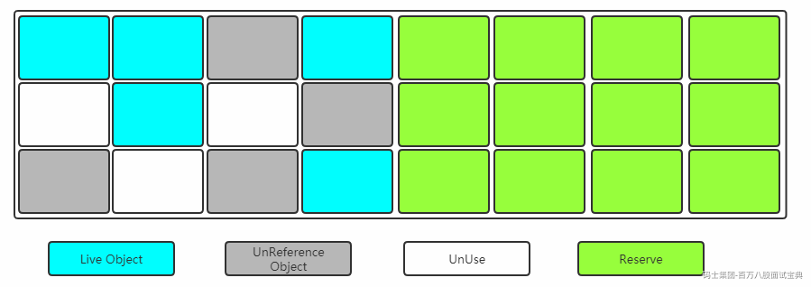

当其中一块内存使用完了，就将还存活的对象复制到另外一块上面，然后把已经使用过的内存空间一次

清除掉。

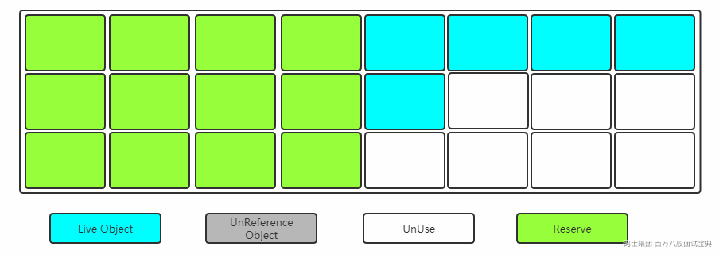

缺点: 空间利用率降低。

2.5.3.3 **标记**-**整理**(Mark-Compact)

复制收集算法在对象存活率较高时就要进行较多的复制操作，效率将会变低。更关键的是，如果不 想浪费50%的空间，就需要有额外的空间进行分配担保，以应对被使用的内存中所有对象都有

100%存活的极端情况，所以老年代一般不能直接选用这种算法。

标记过程仍然与"标记-清除"算法一样，但是后续步骤不是直接对可回收对象进行清理，而是让所有存活 的对象都向一端移动，然后直接清理掉端边界以外的内存。

其实上述过程相对"复制算法"来讲，少了一个"保留区"

让所有存活的对象都向一端移动，清理掉边界意外的内存。

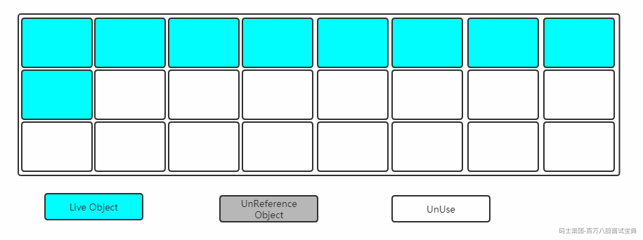

2.5.4 **分代收集算法**

既然上面介绍了3中垃圾收集算法，那么在堆内存中到底用哪一个呢？ Young区：复制算法(对象在被分配之后，可能生命周期比较短，Young区复制效率比较高) Old区：标记清除或标记整理(Old区对象存活时间比较长，复制来复制去没必要，不如做个标记再清理)

2.5.5 **垃圾收集器**

如果说收集算法是内存回收的方法论，那么垃圾收集器就是内存回收的具体实现。

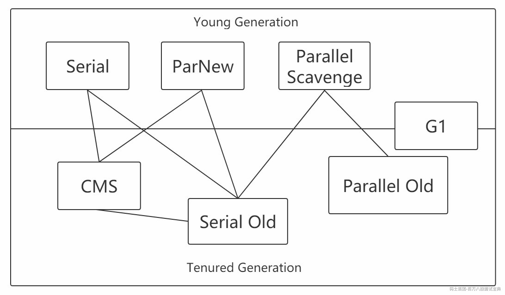

2.5.5.1 Serial

Serial收集器是最基本、发展历史最悠久的收集器，曾经（在JDK1.3.1之前）是虚拟机新生代收集的唯一 选择。

它是一种单线程收集器，不仅仅意味着它只会使用一个CPU或者一条收集线程去完成垃圾收集工作，更 重要的是其在进行垃圾收集的时候需要暂停其他线程。

优点：简单高效，拥有很高的单线程收集效率

缺点：收集过程需要暂停所有线程 算法：复制算法

适用范围：新生代 应用：Client模式下的默认新生代收集器

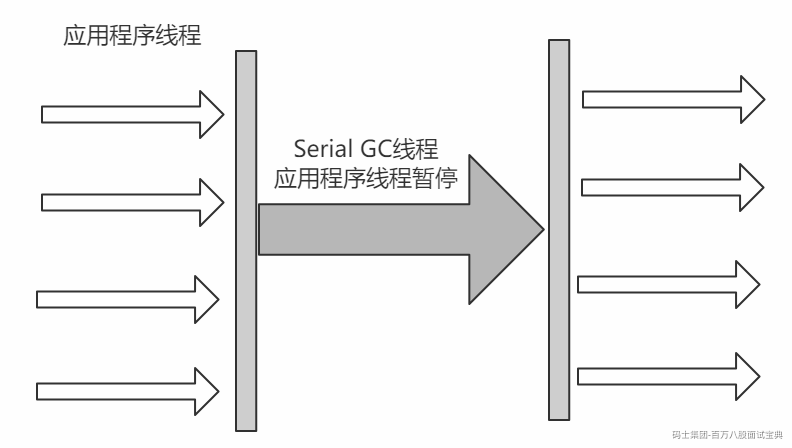

2.5.5.2 Serial Old

Serial Old收集器是Serial收集器的老年代版本，也是一个单线程收集器，不同的是采用"**标记**-**整理算 法**"，运行过程和Serial收集器一样。

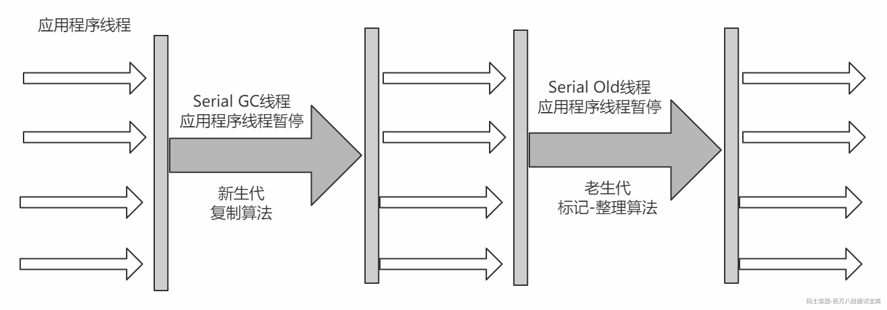

2.5.5.3 ParNew

可以把这个收集器理解为Serial收集器的多线程版本。

优点：在多CPU时，比Serial效率高。

缺点：收集过程暂停所有应用程序线程，单CPU时比Serial效率差。 算法：复制算法

适用范围：新生代 应用：运行在Server模式下的虚拟机中首选的新生代收集器

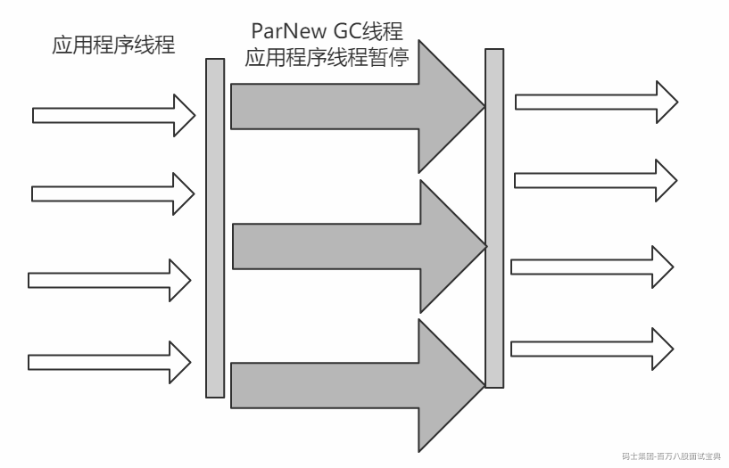

2.5.5.4 Parallel Scavenge

Parallel Scavenge收集器是一个新生代收集器，它也是使用复制算法的收集器，又是并行的多线程收集 器，看上去和ParNew一样，但是Parallel Scanvenge更关注系统的**吞吐量**。

吞吐量=运行用户代码的时间/(运行用户代码的时间+垃圾收集时间)

比如虚拟机总共运行了100分钟，垃圾收集时间用了1分钟，吞吐量=(100-1)/100=99%。 若吞吐量越大，意味着垃圾收集的时间越短，则用户代码可以充分利用CPU资源，尽快完成程序的

运算任务。

-XX:MaxGCPauseMillis控制最大的垃圾收集停顿时间，

-XX:GCRatio直接设置吞吐量的大小。

2.5.5.5 Parallel Old

Parallel Old收集器是Parallel Scavenge收集器的老年代版本，使用多线程和**标记**-**整理算法**进行垃圾回 收，也是更加关注系统的**吞吐量**。

2.5.4.6 CMS

[官网 ： https://docs.oracle.com/javase/8/docs/technotes/guides/vm/gctuning/cms.html#con](https://docs.oracle.com/javase/8/docs/technotes/guides/vm/gctuning/cms.html#concurrent_mark_sweep_cms_collector)

[current\_mark\_sweep\_cms\_collector](https://docs.oracle.com/javase/8/docs/technotes/guides/vm/gctuning/cms.html#concurrent_mark_sweep_cms_collector)

CMS(Concurrent Mark Sweep)收集器是一种以获取 最短回收停顿时间 为目标的收集器。 采用的是"标记-清除算法",整个过程分为4步

(1)初始标记 CMS initial mark 标记GC Roots直接关联对象，不用Tracing，速度很快

(2)并发标记 CMS concurrent mark 进行GC Roots Tracing

(3)重新标记 CMS remark 修改并发标记因用户程序变动的内容

(4)并发清除 CMS concurrent sweep 清除不可达对象回收空间，同时有新垃圾产生，留着下次清理称为 浮动垃圾

由于整个过程中，并发标记和并发清除，收集器线程可以与用户线程一起工作，所以总体上来说，

CMS收集器的内存回收过程是与用户线程一起并发地执行的。

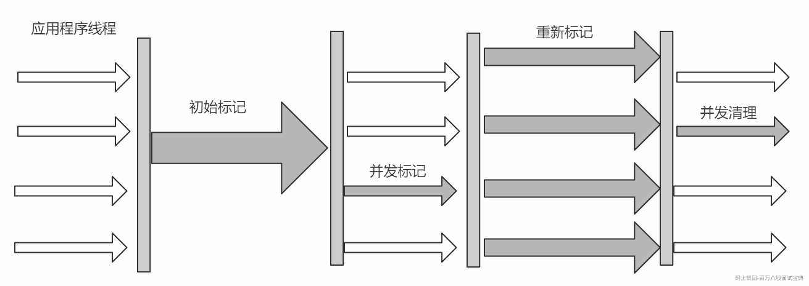

优点：并发收集、低停顿 缺点：产生大量空间碎片、并发阶段会降低吞吐量

2.5.5.7 G1(Garbage-First)

[官网 ： https://docs.oracle.com/javase/8/docs/technotes/guides/vm/gctuning/g1\_gc.html#ga](https://docs.oracle.com/javase/8/docs/technotes/guides/vm/gctuning/g1_gc.html#garbage_first_garbage_collection)

[rbage\_first\_garbage\_collection](https://docs.oracle.com/javase/8/docs/technotes/guides/vm/gctuning/g1_gc.html#garbage_first_garbage_collection)

使用G1收集器时，Java堆的内存布局与就与其他收集器有很大差别，它将整个Java堆划分为多个 大小相等的独立区域（Region），虽然还保留有新生代和老年代的概念，但新生代和老年代不再 是物理隔离的了，它们都是一部分Region（不需要连续）的集合。

每个Region大小都是一样的，可以是1M到32M之间的数值，但是必须保证是2的n次幂 如果对象太大，一个Region放不下[超过Region大小的50%]，那么就会直接放到H中 设置Region大小：-XX:G1HeapRegionSize=M

所谓Garbage-Frist，其实就是优先回收垃圾最多的Region区域

（1）分代收集（仍然保留了分代的概念）

（2）空间整合（整体上属于“标记-整理”算法，不会导致空间碎片）

（3）可预测的停顿（比CMS更先进的地方在于能让使用者明确指定一个长度为M毫秒的时间片段内，消 耗在垃圾收集上的时间不得超过N毫秒）

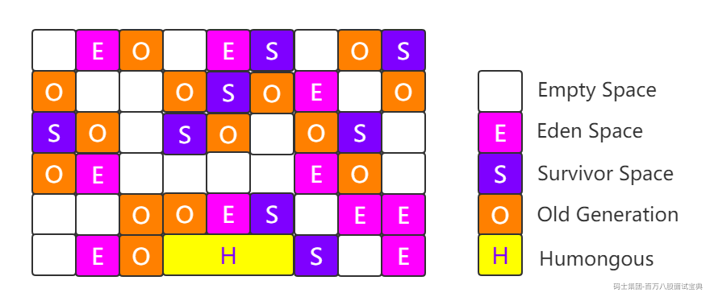

工作过程可以分为如下几步

初始标记（Initial Marking） 标记以下GC Roots能够关联的对象，并且修改TAMS的值，需要暂 停用户线程

并发标记（Concurrent Marking） 从GC Roots进行可达性分析，找出存活的对象，与用户线程并发执 行

最终标记（Final Marking） 修正在并发标记阶段因为用户程序的并发执行导致变动的数据，需暂 停用户线程

筛选回收（Live Data Counting and Evacuation） 对各个Region的回收价值和成本进行排序，根据 用户所期望的GC停顿时间制定回收计划

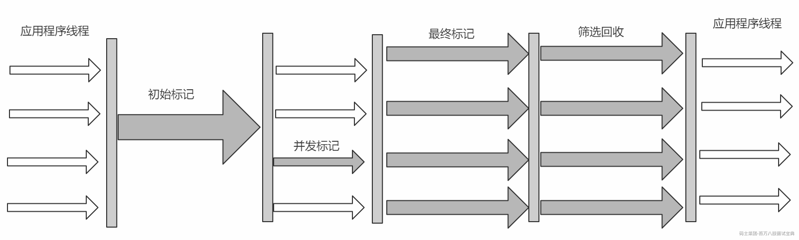

2.5.5.8 ZGC

[官网 ：  https://docs.oracle.com/en/java/javase/11/gctuning/z-garbage-collector1.html#GUID](https://docs.oracle.com/en/java/javase/11/gctuning/z-garbage-collector1.html#GUID-A5A42691-095E-47BA-B6DC-FB4E5FAA43D0)

[-A5A42691-095E-47BA-B6DC-FB4E5FAA43D0](https://docs.oracle.com/en/java/javase/11/gctuning/z-garbage-collector1.html#GUID-A5A42691-095E-47BA-B6DC-FB4E5FAA43D0)

JDK11新引入的ZGC收集器，不管是物理上还是逻辑上，ZGC中已经不存在新老年代的概念了

会分为一个个page，当进行GC操作时会对page进行压缩，因此没有碎片问题 只能在64位的linux上使用，目前用得还比较少

（1）可以达到10ms以内的停顿时间要求

（2）支持TB级别的内存

（3）堆内存变大后停顿时间还是在10ms以内

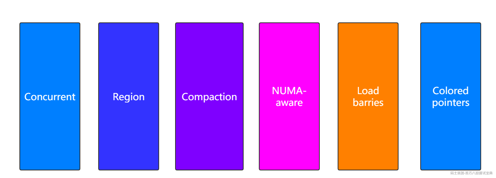

2.5.5.9 **垃圾收集器分类**

**串行收集器**->Serial和Serial Old

只能有一个垃圾回收线程执行，用户线程暂停。

适用于内存比较小的嵌入式设备 。

**并行收集器**[吞吐量优先]->Parallel Scanvenge、Parallel Old

多条垃圾收集线程并行工作，但此时用户线程仍然处于等待状态。

适用于科学计算、后台处理等若交互场景 。

**并发收集器**[停顿时间优先]->CMS、G1

用户线程和垃圾收集线程同时执行(但并不一定是并行的，可能是交替执行的)，垃圾收集线程在执行的时 候不会停顿用户线程的运行。

适用于相对时间有要求的场景，比如Web 。

2.5.5.10 **常见问题**

吞吐量和停顿时间

停顿时间->垃圾收集器 进行 垃圾回收终端应用执行响应的时间

吞吐量->运行用户代码时间/(运行用户代码时间+垃圾收集时间)

停顿时间越短就越适合需要和用户交互的程序，良好的响应速度能提升用户体验；

高吞吐量则可以高效地利用CPU时间，尽快完成程序的运算任务，主要适合在后台运算而不需要太多交互 的任务。

小结 :这两个指标也是评价垃圾回收器好处的标准。

如何选择合适的垃圾收集器

[https://docs.oracle.com/javase/8/docs/technotes/guides/vm/gctuning/collectors.html#](https://docs.oracle.com/javase/8/docs/technotes/guides/vm/gctuning/collectors.html#sthref28)

[sthref28](https://docs.oracle.com/javase/8/docs/technotes/guides/vm/gctuning/collectors.html#sthref28)

优先调整堆的大小让服务器自己来选择

如果内存小于100M，使用串行收集器 如果是单核，并且没有停顿时间要求，使用串行或JVM自己选 如果允许停顿时间超过1秒，选择并行或JVM自己选 如果响应时间最重要，并且不能超过1秒，使用并发收集器

对于G1收集

JDK 7开始使用，JDK 8非常成熟，JDK 9默认的垃圾收集器，适用于新老生代。 是否使用G1收集器？

（1）50%以上的堆被存活对象占用

（2）对象分配和晋升的速度变化非常大

（3）垃圾回收时间比较长

G1中的RSet

全称Remembered Set，记录维护Region中对象的引用关系

试想，在G1垃圾收集器进行新生代的垃圾收集时，也就是Minor GC，假如该对象被老年代的Region中所引

用，这时候新生代的该对象就不能被回收，怎么记录呢？ 不妨这样，用一个类似于hash的结构，key记录region的地址，value表示引用该对象的集合，这样就能知 道该对象被哪些老年代的对象所引用，从而不能回收。

如何开启需要的垃圾收集器

这里JVM参数信息的设置大家先不用关心，后面会学习到。

（1）串行

-XX：+UseSerialGC

-XX：+UseSerialOldGC

（2）并行(吞吐量优先)：

-XX：+UseParallelGC

-XX：+UseParallelOldGC

（3）并发收集器(响应时间优先)

-XX：+UseConcMarkSweepGC

-XX：+UseG1GC

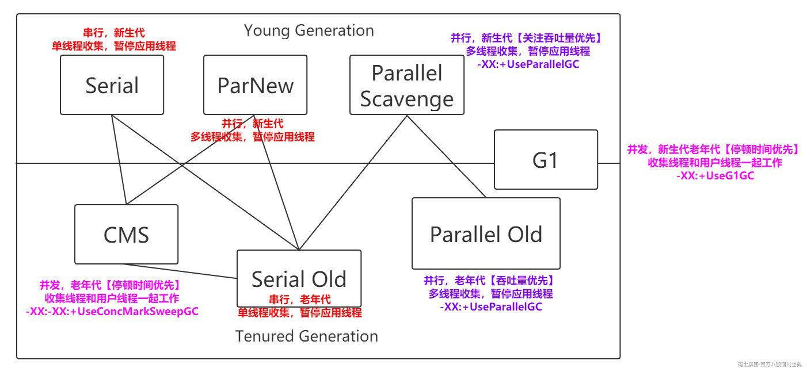

3.**深入**

经过前面的各种分析学习，我们知道了关于JVM很多的知识，比如版本信息，类加载，堆，方法 区，垃圾回收等，但是总觉得心里不踏实，原因是没看到实际的一些东西。

所以这一章节，咱们就好好来聊一聊关于怎么将这些内容进行直观地展示在我们面前，包括怎么进 行相应的一些设置。OK，let's go!

3.1 JVM**参数**

3.1.1 **标准参数**

-version

-help

-server

-cp

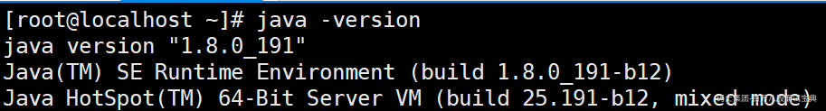

3.1.2 -X**参数**

非标准参数，也就是在JDK各个版本中可能会变动

-Xint 解释执行

-Xcomp 第一次使用就编译成本地代码

-Xmixed 混合模式，JVM自己来决定

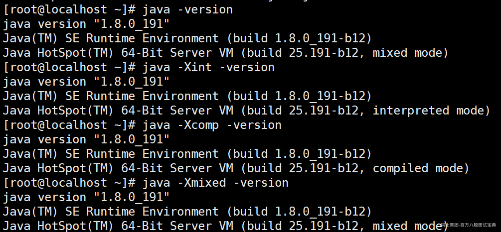

3.1.3 -XX**参数**

使用得最多的参数类型 非标准化参数，相对不稳定，主要用于JVM调优和Debug

a.Boolean类型

格式：-XX:[+-]<name> +或-表示启用或者禁用name属性 比如：-XX:+UseConcMarkSweepGC 表示启用CMS类型的垃圾回收器

-XX:+UseG1GC 表示启用G1类型的垃圾回收器

b.非Boolean类型

格式：-XX<name>=<value>表示name属性的值是value

比如：-XX:MaxGCPauseMillis=500

3.1.4 **其他参数**

-Xms1000M等价于-XX:InitialHeapSize=1000M

-Xmx1000M等价于-XX:MaxHeapSize=1000M

-Xss100等价于-XX:ThreadStackSize=100

所以这块也相当于是-XX类型的参数

3.1.5 **查看参数**

java -XX:+PrintFlagsFinal -version > flags.txt

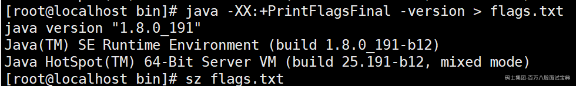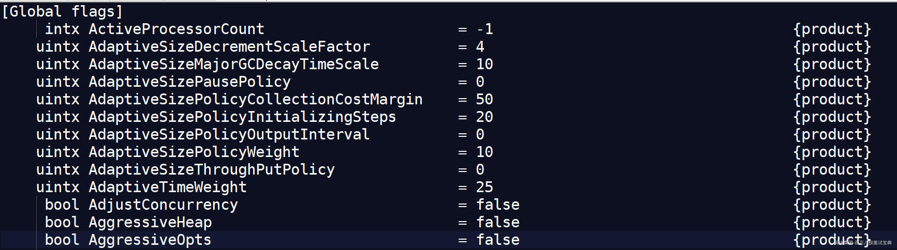

值得注意的是"="表示默认值，":="表示被用户或JVM修改后的值

要想查看某个进程具体参数的值，可以使用jinfo，这块后面聊 一般要设置参数，可以先查看一下当前参数是什么，然后进行修改

3.1.6 **设置参数的常见方式**

开发工具中设置比如IDEA，eclipse 运行jar包的时候:java -XX:+UseG1GC xxx.jar web容器比如tomcat，可以在脚本中的进行设置

通过jinfo实时调整某个java进程的参数(参数只有被标记为manageable的flags可以被实时修改)

3.1.7 **实践和单位换算**

1Byte(字节)=8bit(位)

1KB=1024Byte(字节)

1MB=1024KB

1GB=1024MB

1TB=1024GB

(1)设置堆内存大小和参数打印

-Xmx100M -Xms100M -XX:+PrintFlagsFinal

(2)查询+PrintFlagsFinal的值

:=true

(3)查询堆内存大小MaxHeapSize

:= 104857600 (4)换算

104857600(Byte)/1024=102400(KB)

102400(KB)/1024=100(MB) (5)结论

104857600是字节单位

3.1.8 **常用参数含义**

3.2 **常用命令**

3.2.1 jps

查看java进程

The jps command lists the instrumented Java HotSpot VMs on the target system. The command is limited to reporting information on JVMs for which it has the access permissions.

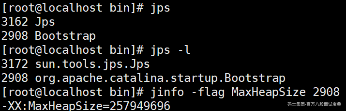

3.2.2 jinfo

（1）实时查看和调整JVM配置参数

The jinfo command prints Java configuration information for a specified Java process or core file or a remote debug server. The configuration information includes Java system properties and Java Virtual Machine (JVM) command-line

flags.

（2）查看用法

jinfo -flag name PID 查看某个java进程的name属性的值

jinfo -flag MaxHeapSize PID

jinfo -flag UseG1GC PID

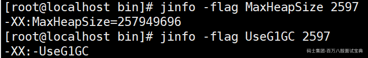

（3）修改

**参数只有被标记为**manageable**的**flags**可以被实时修改**

jinfo -flag [+|-] PID

jinfo -flag <name>=<value> PID

（4）查看曾经赋过值的一些参数

jinfo -flags PID

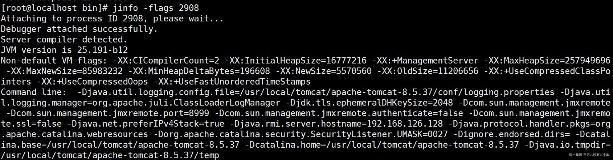

3.2.3 jstat

（1）查看虚拟机性能统计信息

The jstat command displays performance statistics for an instrumented Java

HotSpot VM. The target JVM is identified by its virtual machine identifier, or vmid option.

（2）查看类装载信息

jstat -class PID 1000 10 查看某个java进程的类装载信息，每1000毫秒输出一次，共输出10次

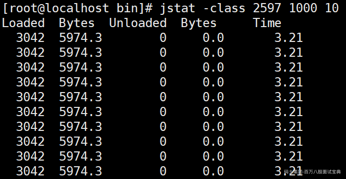

（3）查看垃圾收集信息

jstat -gc PID 1000 10

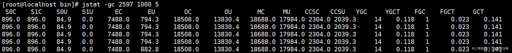

3.2.4 jstack

（1）查看线程堆栈信息

The jstack command prints Java stack traces of Java threads for a specified Java

process, core file, or remote debug server.

（2）用法

jstack PID

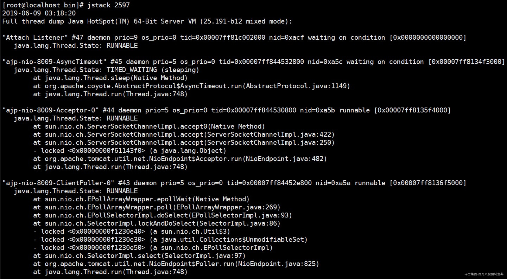

(4)排查死锁案例

DeadLockDemo

//运行主类

public class DeadLockDemo

{

public static void main(String[] args)

{

DeadLock d1=new DeadLock(true); DeadLock d2=new DeadLock(false); Thread t1=new Thread(d1);

Thread t2=new Thread(d2);

t1.start();

t2.start();

}

}

//定义锁对象

class MyLock{

public static Object obj1=new Object();

public static Object obj2=new Object();

}

//死锁代码

class DeadLock implements Runnable{ private boolean flag; DeadLock(boolean flag){

this.flag=flag;

}

public void run() {

if(flag) {

while(true) {

synchronized(MyLock.obj1) { System.out.println(Thread.currentThread().getName()+"----if获

得obj1锁");

-if获得obj2锁");

synchronized(MyLock.obj2) { System.out.println(Thread.currentThread().getName()+"---

}

}

}

}

else {

while(true){

synchronized(MyLock.obj2) { System.out.println(Thread.currentThread().getName()+"----否则

获得obj2锁");

-否则获得obj1锁");

synchronized(MyLock.obj1) { System.out.println(Thread.currentThread().getName()+"---

}

}

}

}

}

}

运行结果

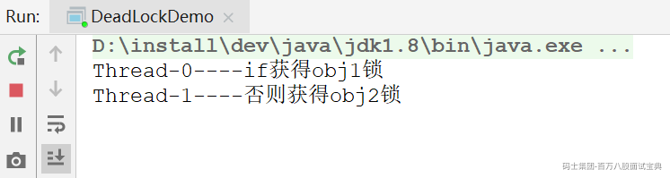

jstack分析

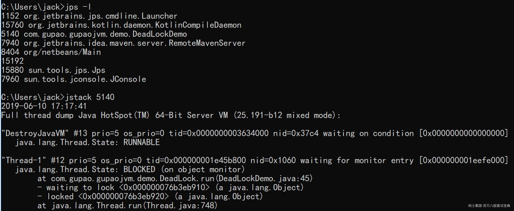

把打印信息拉到最后可以发现

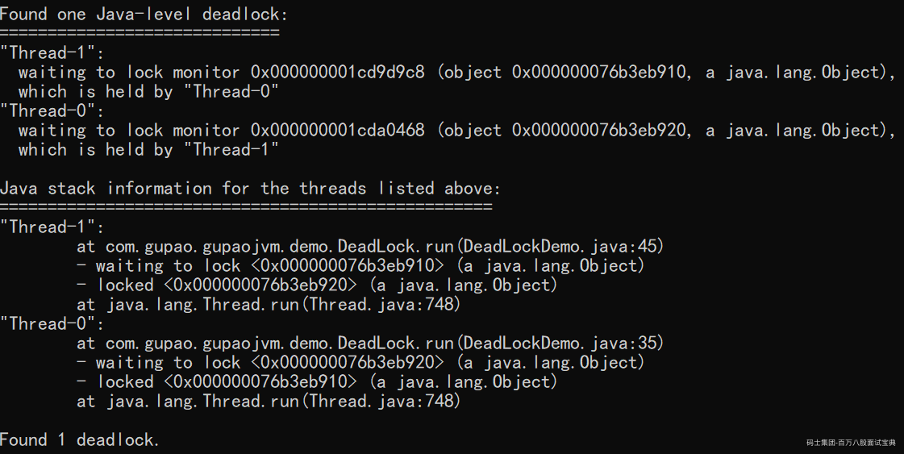

3.2.5 jmap

（1）生成堆转储快照

The jmap command prints shared object memory maps or heap memory details of a

specified process, core file, or remote debug server.

（2）打印出堆内存相关信息

jmap -heap PID

jinfo -flag UsePSAdaptiveSurvivorSizePolicy 35352

-XX:SurvivorRatio=8

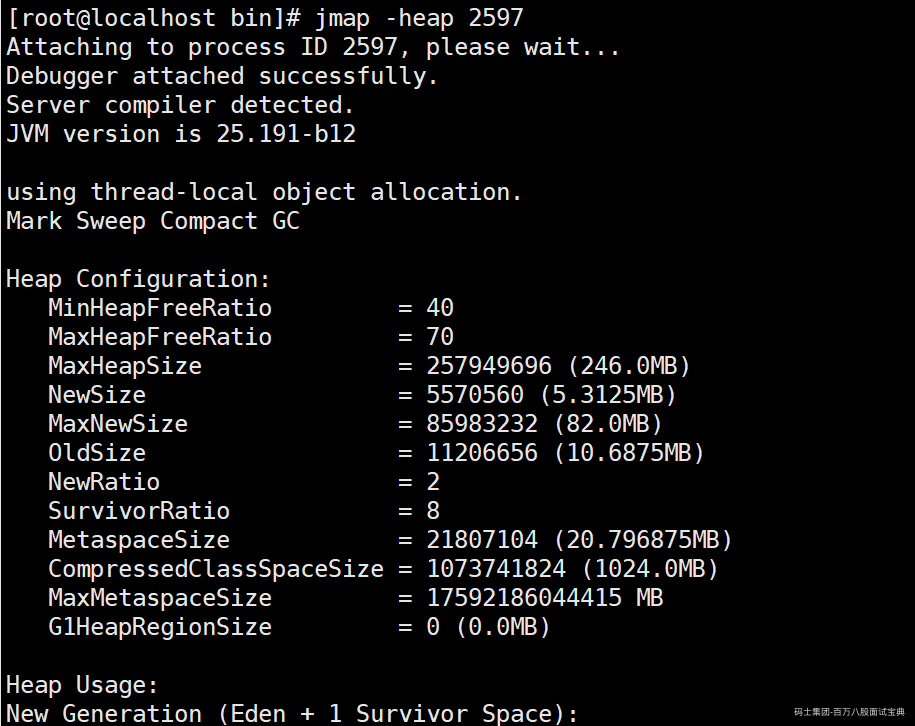

（3）dump出堆内存相关信息

jmap -dump:format=b,file=heap.hprof PID

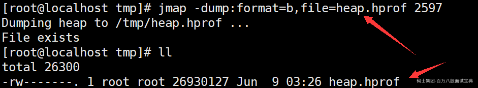

（4）要是在发生堆内存溢出的时候，能自动dump出该文件就好了 一般在开发中，JVM参数可以加上下面两句，这样内存溢出时，会自动dump出该文件

-XX:+HeapDumpOnOutOfMemoryError -XX:HeapDumpPath=heap.hprof

设置堆内存大小: -Xms20M -Xmx20M

启动，然后访问localhost:9090/heap，使得堆内存溢出

# **性能优化**

JVM的性能优化可以分为代码层面和非代码层面。 在代码层面，大家可以结合字节码指令进行优化，比如一个循环语句，可以将循环不相关的代码提

取到循环体之外，这样在字节码层面就不需要重复执行这些代码了。

在非代码层面，一般情况可以从内存、gc以及cpu占用率等方面进行优化。

注意，JVM调优是一个漫长和复杂的过程，而在很多情况下，JVM是不需要优化的，因为JVM本身 已经做了很多的内部优化操作。

那今天我们就从内存、gc以及cpu这3个方面和大家一起探讨一下JVM的优化，但是大家要注意的 是**不要为了调优和调优**。

4.1 **内存**

4.1.1 **内存分配** 正常情况下不需要设置，那如果是促销或者秒杀的场景呢？ 每台机器配置2c4G，以每秒3000笔订单为例，整个过程持续60秒

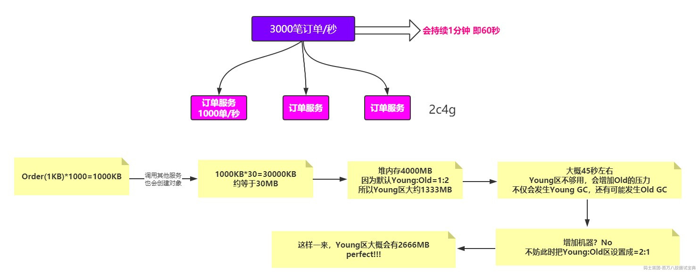

4.1.2 **内存溢出**(OOM)

一般会有两个原因：

（1）大并发情况下

（2）内存泄露导致内存溢出

4.1.2.1 **大并发**[**秒杀**] 浏览器缓存、本地缓存、验证码 CDN静态资源服务器 集群+负载均衡

动静态资源分离、限流[基于令牌桶、漏桶算法] 应用级别缓存、接口防刷限流、队列、Tomcat性能优化 异步消息中间件

Redis热点数据对象缓存 分布式锁、数据库锁

5分钟之内没有支付，取消订单、恢复库存等

4.1.2.2 **内存泄露导致内存溢出**

ThreadLocal引起的内存泄露，最终导致内存溢出

public class TLController {

@RequestMapping(value = "/tl")

public String tl(HttpServletRequest request) { ThreadLocal<Byte[]> tl = new ThreadLocal<Byte[]>();

// 1MB

tl.set(new Byte[1024\*1024]);

return "ok";

}

}

（1）上传到阿里云服务器

jvm-case-0.0.1-SNAPSHOT.jar

（2）启动

java -jar -Xms1000M -Xmx1000M -XX:+HeapDumpOnOutOfMemoryError -

XX:HeapDumpPath=jvm.hprof jvm-case-0.0.1-SNAPSHOT.jar

（3）使用jmeter模拟10000次并发

39.100.39.63:8080/tl

（4）top命令查看

top

top -Hp PID

（5）jstack查看线程情况，发现没有死锁或者IO阻塞的情况

jstack PID

java -jar arthas.jar ---> thread

（6）查看堆内存的使用，发现堆内存的使用率已经高达88.95%

jmap -heap PID

java -jar arthas.jar ---> dashboard

（7）此时可以大体判断出来，发生了内存泄露从而导致的内存溢出，那怎么排查呢？

jmap -histo:live PID | more

获取到jvm.hprof文件，上传到指定的工具分析，比如heaphero.io

4.2 GC

这里以G1垃圾收集器调优为例

官网 ：<https://docs.oracle.com/javase/8/docs/technotes/guides/vm/G1.html#use_cases>

（1）50%以上的堆被存活对象占用

（2）对象分配和晋升的速度变化非常大

（3）垃圾回收时间比较长

4.2.2 G1**调优**

（1）使用G1GC垃圾收集器: -XX:+UseG1GC

修改配置参数，获取到gc日志，使用GCViewer分析吞吐量和响应时间

（2）调整内存大小再获取gc日志分析

-XX:MetaspaceSize=100M

-Xms300M

-Xmx300M

比如设置堆内存的大小，获取到gc日志，使用GCViewer分析吞吐量和响应时间

（3）调整最大停顿时间

-XX:MaxGCPauseMillis=200 设置最大GC停顿时间指标

比如设置最大停顿时间，获取到gc日志，使用GCViewer分析吞吐量和响应时间

（4）启动并发GC时堆内存占用百分比

-XX:InitiatingHeapOccupancyPercent=45

G1用它来触发并发GC周期,基于整个堆的使用率,而不只是某一代内存的使用比例。值为 0 则表示“一直执行

GC循环)'. 默认值为 45 (例如, 全部的 45% 或者使用了45%).

比如设置该百分比参数，获取到gc日志，使用GCViewer分析吞吐量和响应时间

[官网 ：https://docs.oracle.com/javase/8/docs/technotes/guides/vm/gctuning/g1\_gc\_tuning.html#r](https://docs.oracle.com/javase/8/docs/technotes/guides/vm/gctuning/g1_gc_tuning.html#recommendations)

[ecommendations)](https://docs.oracle.com/javase/8/docs/technotes/guides/vm/gctuning/g1_gc_tuning.html#recommendations)

（1）不要手动设置新生代和老年代的大小，只要设置整个堆的大小

why：<https://blogs.oracle.com/poonam/increased-heap-usage-with-g1-gc>

G1收集器在运行过程中，会自己调整新生代和老年代的大小

其实是通过adapt代的大小来调整对象晋升的速度和年龄，从而达到为收集器设置的暂停时间目标 如果手动设置了大小就意味着放弃了G1的自动调优

（2）不断调优暂停时间目标

一般情况下这个值设置到100ms或者200ms都是可以的(不同情况下会不一样)，但如果设置成50ms就不

太合理。暂停时间设置的太短，就会导致出现G1跟不上垃圾产生的速度。最终退化成Full GC。所以对 这个参数的调优是一个持续的过程，逐步调整到最佳状态。暂停时间只是一个目标，并不能总是得到满 足。

（3）使用-XX:ConcGCThreads=n来增加标记线程的数量

IHOP如果阀值设置过高，可能会遇到转移失败的风险，比如对象进行转移时空间不足。如果阀值设置过

低，就会使标记周期运行过于频繁，并且有可能混合收集期回收不到空间。 IHOP值如果设置合理，但是在并发周期时间过长时，可以尝试增加并发线程数，调高 ConcGCThreads。

（4）MixedGC调优

-XX:InitiatingHeapOccupancyPercent

-XX:G1MixedGCLiveThresholdPercent

-XX:G1MixedGCCountTarger

-XX:G1OldCSetRegionThresholdPercent

（5）适当增加堆内存大小

（6）不正常的Full GC

有时候会发现系统刚刚启动的时候，就会发生一次Full GC，但是老年代空间比较充足，一般是由Metaspace

区域引起的。可以通过MetaspaceSize适当增加其大家，比如256M。

4.3 JVM**性能优化指南**

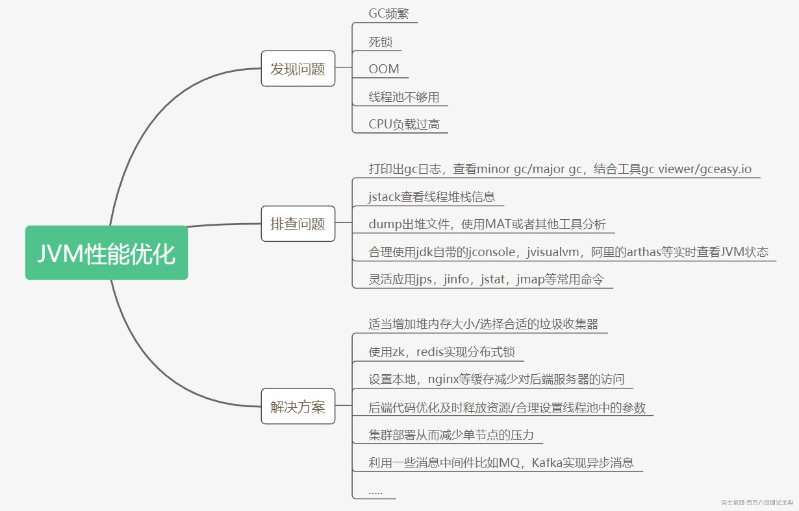

4.4**常见问题**

（1）内存泄漏与内存溢出的区别

内存泄漏是指不再使用的对象无法得到及时的回收，持续占用内存空间，从而造成内存空间的浪费。

内存泄漏很容易导致内存溢出，但内存溢出不一定是内存泄漏导致的。

（2）young gc会有stw吗？

不管什么 GC，都会发送 stop-the-world，区别是发生的时间长短。而这个时间跟垃圾收集器又有关

系，Serial、PartNew、Parallel Scavenge 收集器无论是串行还是并行，都会挂起用户线程，而 CMS 和 G1 在并发标记时，是不会挂起用户线程的，但其它时候一样会挂起用户线程，stop the world 的时 间相对来说就小很多了。

（3）major gc和full gc的区别

Major GC在很多参考资料中是等价于 Full GC 的，我们也可以发现很多性能监测工具中只有 Minor GC

和 Full GC。一般情况下，一次 Full GC 将会对年轻代、老年代、元空间以及堆外内存进行垃圾回收。触 发 Full GC 的原因有很多：当年轻代晋升到老年代的对象大小，并比目前老年代剩余的空间大小还要大 时，会触发 Full GC；当老年代的空间使用率超过某阈值时，会触发 Full GC；当元空间不足时（JDK1.7 永久代不足），也会触发 Full GC；当调用 System.gc() 也会安排一次 Full GC。

（4）什么是直接内存

Java的NIO库允许Java程序使用直接内存。直接内存是在java堆外的、直接向系统申请的内存空间。通

常访问直接内存的速度会优于Java堆。因此出于性能的考虑，读写频繁的场合可能会考虑使用直接内 存。由于直接内存在java堆外，因此它的大小不会直接受限于Xmx指定的最大堆大小，但是系统内存是 有限的，Java堆和直接内存的总和依然受限于操作系统能给出的最大内存。

（5）垃圾判断的方式

引用计数法：指的是如果某个地方引用了这个对象就+1，如果失效了就-1，当为0就会回收但是JVM没 有用这种方式，因为无法判定相互循环引用（A引用B,B引用A）的情况。

引用链法： 通过一种GC ROOT的对象（方法区中静态变量引用的对象等-static变量）来判断，如果有 一条链能够到达GC ROOT就说明，不能到达GC ROOT就说明可以回收。

（6）不可达的对象一定要被回收吗？

即使在可达性分析法中不可达的对象，也并非是“非死不可”的，这时候它们暂时处于“缓刑阶段”，要真

正宣告一个对象死亡，至少要经历两次标记过程；可达性分析法中不可达的对象被第一次标记并且进行 一次筛选，筛选的条件是此对象是否有必要执行 finalize 方法。当对象没有覆盖 finalize 方法，或 finalize 方法已经被虚拟机调用过时，虚拟机将这两种情况视为没有必要执行。 被判定为需要执行的对象将会被放在一个队列中进行第二次标记，除非这个对象与引用链上的任何一个 对象建立关联，否则就会被真的回收。

（7）为什么要区分新生代和老年代？

当前虚拟机的垃圾收集都采用分代收集算法，这种算法没有什么新的思想，只是根据对象存活周期的不

同将内存分为几块。一般将 java 堆分为新生代和老年代，这样我们就可以根据各个年代的特点选择合 适的垃圾收集算法。 比如在新生代中，每次收集都会有大量对象死去，所以可以选择复制算法，只需要付出少量对象的复制 成本就可以完成每次垃圾收集。而老年代的对象存活几率是比较高的，而且没有额外的空间对它进行分 配担保，所以我们必须选择“标记-清除”或“标记-整理”算法进行垃圾收集。

（8）G1与CMS的区别是什么

CMS 主要集中在老年代的回收，而 G1 集中在分代回收，包括了年轻代的 Young GC 以及老年代的 Mix

GC；G1 使用了 Region 方式对堆内存进行了划分，且基于标记整理算法实现，整体减少了垃圾碎片的 产生；在初始化标记阶段，搜索可达对象使用到的 Card Table，其实现方式不一样。

（9）方法区中的无用类回收

方法区主要回收的是无用的类，那么如何判断一个类是无用的类的呢？

判定一个常量是否是“废弃常量”比较简单，而要判定一个类是否是“无用的类”的条件则相对苛刻许多。 类需要同时满足下面 3 个条件才能算是 “无用的类” :

a-该类所有的实例都已经被回收，也就是 Java 堆中不存在该类的任何实例。

b-加载该类的 ClassLoader 已经被回收。

c-该类对应的 java.lang.Class 对象没有在任何地方被引用，无法在任何地方通过反射访问该类的方法。
