# Spring源码手写篇-手写IoC

# 一、IoC分析

## 1.Spring的核心

  在Spring中非常核心的内容是 `IOC`和 `AOP`.


## 2.IoC的几个疑问?

### 2.1 IoC是什么？

  IoC:Inversion of Control 控制反转，简单理解就是：依赖对象的获得被反转了。


### 2.2 IoC有什么好处?

IoC带来的好处：

1. 代码更加简洁，不需要去new 要使用的对象了

2. 面向接口编程，使用者与具体类，解耦，易扩展、替换实现者

3. 可以方便进行AOP编程

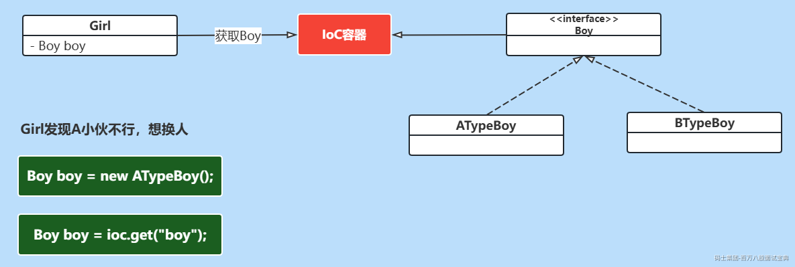

### 2.3 IoC容器做了什么工作?

  IoC容器的工作：负责创建，管理类实例，向使用者提供实例。

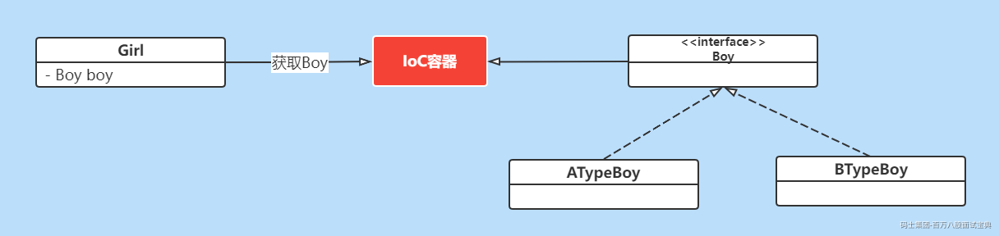

### 2.4 IoC容器是否是工厂模式的实例?

  是的，IoC容器负责来创建类实例对象，需要从IoC容器中get获取。IoC容器我们也称为Bean工厂。


  那么我们一直说的Bean是什么呢？bean：组件，也就是类的对象!!!

# 二、IoC实现

  通过上面的介绍我们也清楚了IoC的核心就是Bean工厂，那么这个Bean工厂我们应该要如何来设计实现它呢？我们来继续分析。

## 1.Bean工厂的作用

  首先Bean工厂的作用我们上面也分析了就是创建，管理Bean，并且需要对外提供Bean的实例。


## 2.Bean工厂的初步设计

  基于Bean工厂的基本作用，我们可以来分析Bean工厂应该具备的相关行为。


  首先Bean工厂应该要对外提供获取bean实例的方法，所以需要定义一个getBean()方法。同时工厂需要知道生产的bean的类型，所以getBean()方法需要接受对应的参数，同时返回类型这块也可能有多个类型，我们就用Object来表示。这样Bean工厂的定义就出来了。

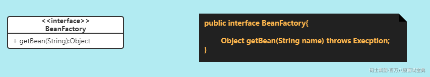

  上面定义了Bean工厂对外提供bean实例的方法，但是Bean工厂如何知道要创建上面对象，怎么创建该对象呢？

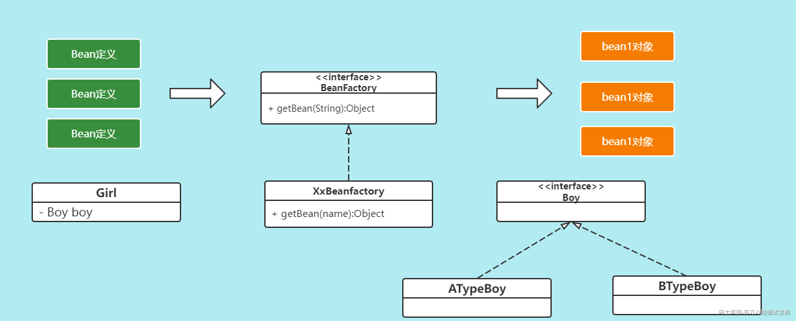

  所以在这里我们得把Bean的定义信息告诉BeanFactory工厂，然后BeanFactory工厂根据Bean的定义信息来生成对应的bean实例对象。所以在这儿我们要考虑两个问题

1. 我们需要定义一个模型来表示该如何创建Bean实例的信息，也就是Bean定义。

2. Bean工厂需要提供行为来接收这些Bean的定义信息。

## 3.Bean的定义

  根据上面的接收我们就清楚了Bean定义的意义了。那么我们来定义Bean定义的模型要考虑几个问题。

### 3.1 Bean定义的作用是什么?

  作用肯定是告诉Bean工厂应该如何来创建某类的Bean实例

### 3.2 获取实例的方式有哪些?

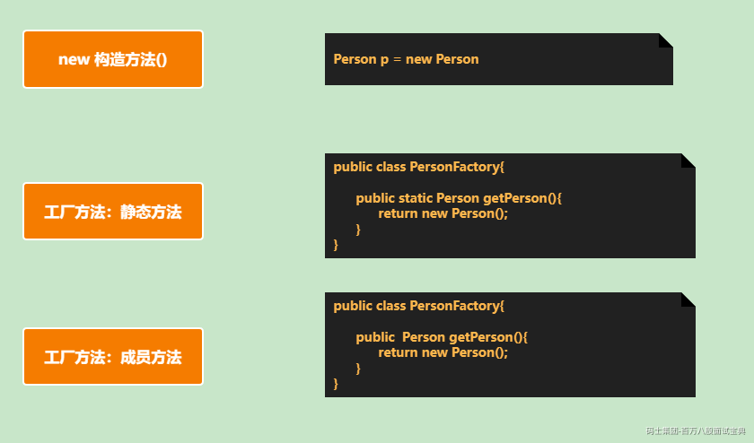

### 3.3 我们需要在BeanDefinition中给Bean工厂提供哪些信息?

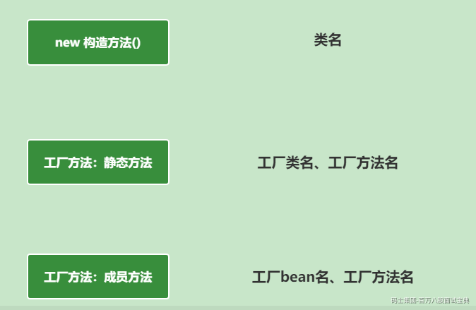

这样一来我们就清楚了BeanDefinition应该要具有的基本功能了。

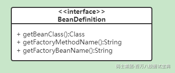

### 3.4 增强功能要求

  当然我们可以在现有的基础上增强要求，比如Bean工厂创建的是单例对象，具有特定的初始化方法和销毁逻辑的方法。

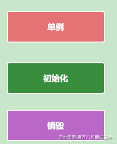

  同时创建BeanDefinition的一个通用实现类：GenericBeanDefinition。

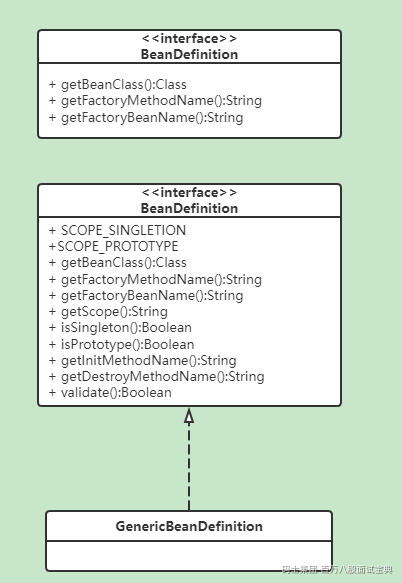

具体代码为：

```java
/**
 * bean定义接口
 */
public interface BeanDefinition {

    String SCOPE_SINGLETION = "singleton";

    String SCOPE_PROTOTYPE = "prototype";

    /**
     * 类
     */
    Class<?> getBeanClass();

    /**
     * Scope
     */
    String getScope();

    /**
     * 是否单例
     */
    boolean isSingleton();

    /**
     * 是否原型
     */
    boolean isPrototype();

    /**
     * 工厂bean名
     */
    String getFactoryBeanName();

    /**
     * 工厂方法名
     */
    String getFactoryMethodName();

    /**
     * 初始化方法
     */
    String getInitMethodName();

    /**
     * 销毁方法
     */
    String getDestroyMethodName();

    boolean isPrimary();

    /**
     * 校验bean定义的合法性
     */
    default boolean validate() {
        // 没定义class,工厂bean或工厂方法没指定，则不合法。
        if (this.getBeanClass() == null) {
            if (StringUtils.isBlank(getFactoryBeanName()) || StringUtils.isBlank(getFactoryMethodName())) {
                return false;
            }
        }

        // 定义了类，又定义工厂bean，不合法
        if (this.getBeanClass() != null && StringUtils.isNotBlank(getFactoryBeanName())) {
            return false;
        }

        return true;
    }

}
```

## 4.Bean的注册

  Bean的定义清楚后，我们要考虑的就是如何实现BeanDefinition和BeanFactory的关联了。

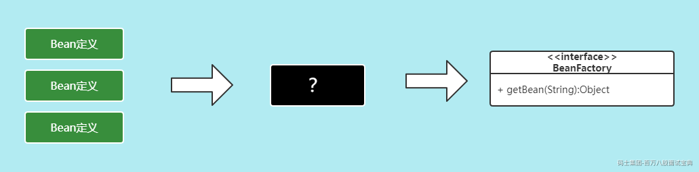

  在这儿我们可以专门定义一个 `BeanDefinitionRegistry`来实现Bean定义的注册功能。

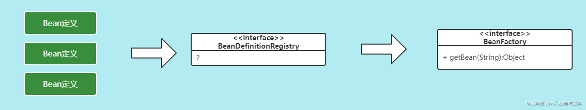

  那么我们需要考虑 BeanDefinitionRegistry 应该具备的功能，其实也简单就两个：

1. 注册BeanDefinition

2. 获取BeanDefinition

  同时为了保证能够区分每个BeanDefinition的定义信息，我们得给每一个Bean定义一个唯一的名称。

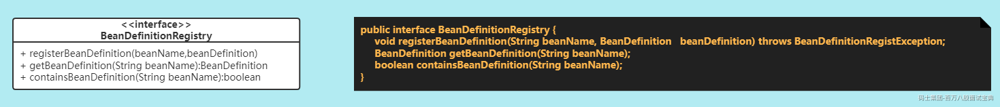

具体实现代码:

```java
public interface BeanDefinitionRegistry {

    void registerBeanDefinition(String beanName, BeanDefinition beanDefinition) throws BeanDefinitionRegistException;

    BeanDefinition getBeanDefinition(String beanName);

    boolean containsBeanDefinition(String beanName);

}
```

## 5.BeanFactory实现

  到现在为止我们来看看已经实现的相关设计功能：

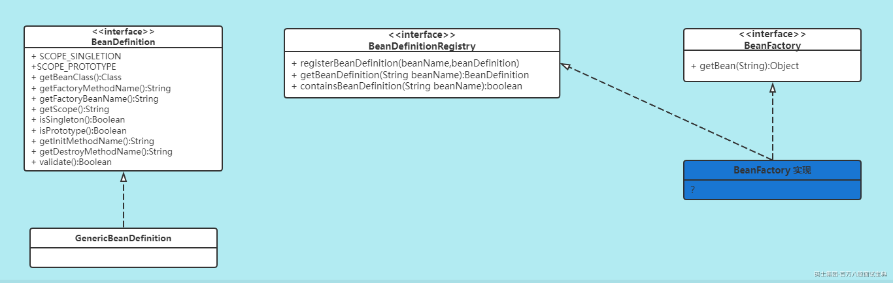

  通过上面的分析我们接下来就要考虑BeanFactory的功能实现了。我们先来实现一个最基础的默认的Bean工厂：DefaultBeanFactory。需要DefaultBeanFactory实现如下的5个功能

1. 实现Bean定义信息的注册

2. 实现Bean工厂定义的getBean方法

3. 实现初始化方法的执行

4. 实现单例的要求

5. 实现容器关闭是执行单例的销毁操作

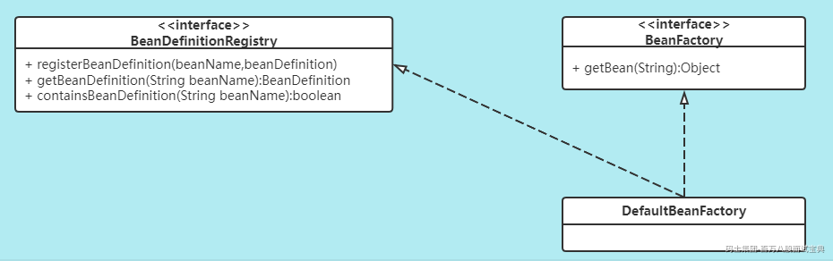

具体看代码的案例代码，代码太多就不贴出来了。

思考：对于单例bean，我们可否提前实例化? 系统启动的时候/系统运行时需要对象的时候

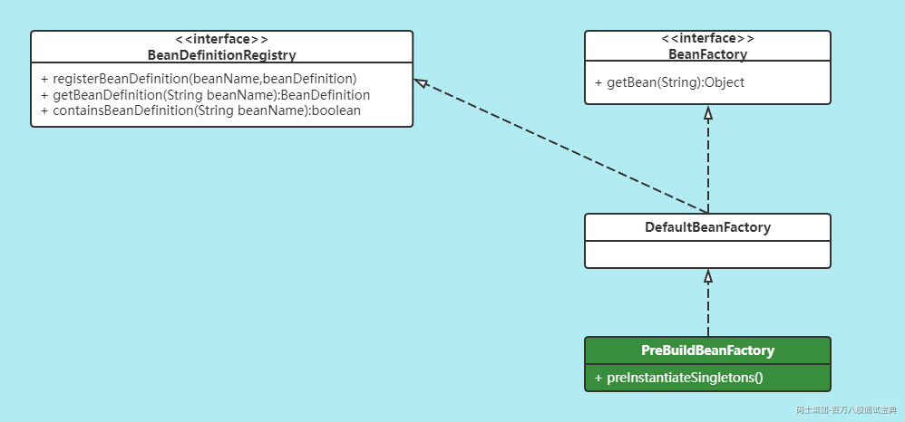

# 三、IoC增强

  上面第一版本的IoC容器我们已经实现了，我们可以在这个基础上来基础迭代增强IoC的功能

## 1.Bean别名的增强

  Bean除了标识唯一的名称外，还可以有任意个别名，别名也是唯一的。别名的特点

1. 可以有多个别名

2. 也可以是别名的别名

3. 别名也是唯一的

   实现的时候我们需要考虑的问题

1. 数据结构

2. 功能点

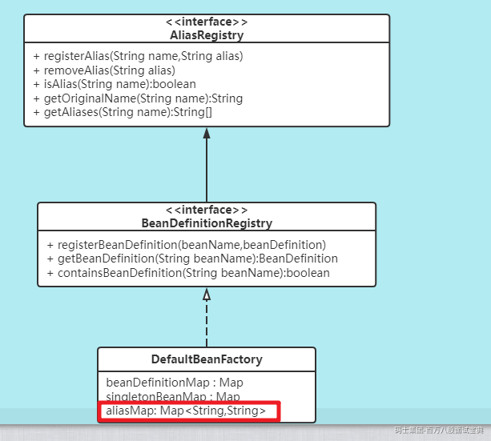

具体代码交给大家课后尝试实现。

## 2. Type类型的增强

  上面实现的是根据 bean的 `name`来获取Bean实例，我们还希望能扩展通过 `Type`来获取实例对象。这时对应的接口为：

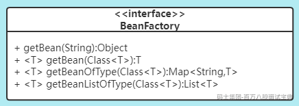

  也就是需要实现根据Type找到Bean对象的功能。正常的实例逻辑为：

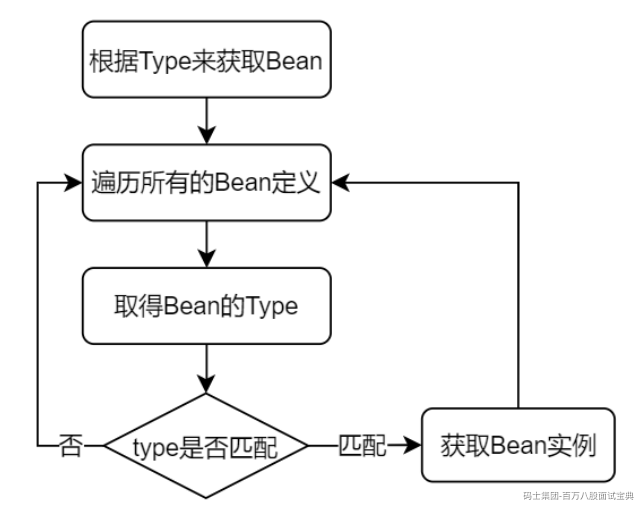

  但是上面的实现方案有点吃性能，我们可以尝试优化下，我们可以提前把Type和Bean的对应关系找出来，然后用Map缓存起来处理。对应的存储方式通过Map来处理

我们需要考虑几个问题：

1. Map中存储的数据用什么合适？

2. type和bean是一对一的关系吗？

3. 何时建立该关系呢？


```java
private Map<Class<?>, Set<String>> typeMap = new ConcurrentHashMap<>(256);
```

  具体的实现我们可以在DefaultBeanFactory中添加一个buildTypeMap()方法来处理这个事情

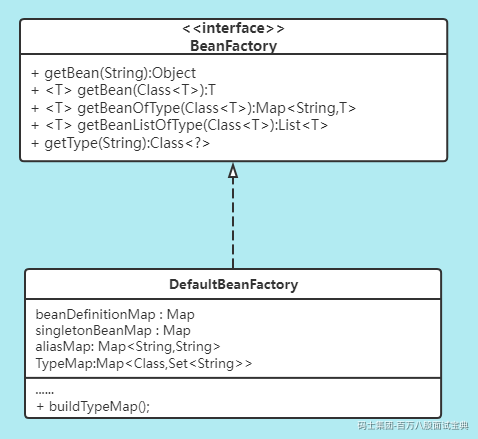

  buildTypeMap()方法处理的逻辑如下：

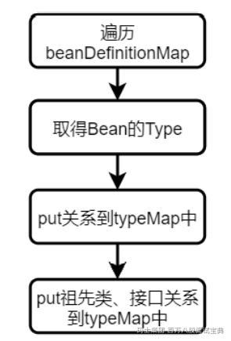

  然后我们在BeanFactory中添加一个getType方法，封装获取Bean的Type的逻辑，方便buildTypeMap()方法的使用。最后就是getBean(Class) 方法的实现了。因为Class对应的类型可能有多个，这时需要通过Primary来处理了。

IoC容器-核心部分类图

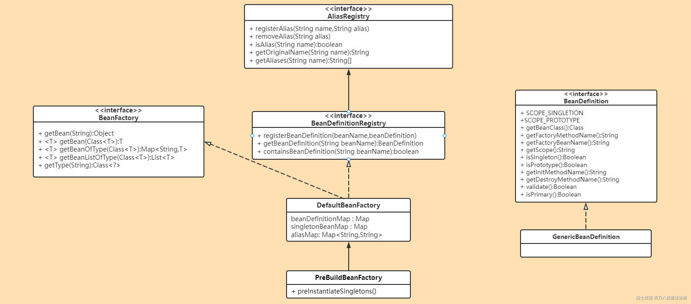

总结：应用设计的原则：

1. 抽象，行为抽象分类处理(接口)

2. 继承，扩展功能

3. 面向接口编程

4. 单一职责原则
