# Spring源码手写篇-手写AOP

  手写IoC和DI后已经实现的类图结构。

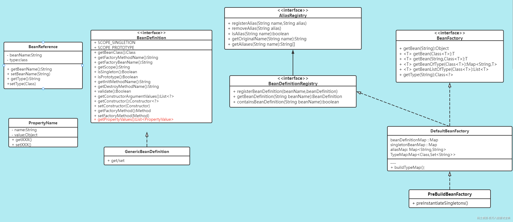

# 一、AOP分析


## 1.AOP是什么?

   AOP[Aspect Oriented Programming] 面向切面编程，在不改变类的代码的情况下，对类方法进行功能的增强。

## 2.我们要做什么？

  我们需要在前面手写IoC，手写DI的基础上给用户提供AOP功能，让他们可以通过AOP技术实现对类方法功能增强。


## 3.我们的需求是什么？

  提供AOP功能!,然后呢？... 没有了。关键还是得从上面的定义来理解。


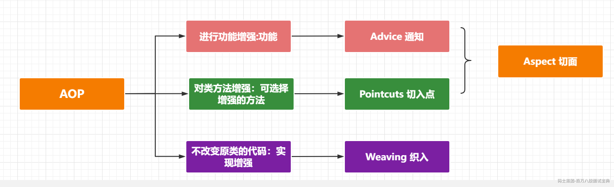

# 二、AOP概念讲解

  上面在分析AOP需求的时候，我们介绍到了相关的概念，Advice、Pointcuts和weaving等，首先我们来看看在AOP中我们会接触到的相关的概念都有哪些。

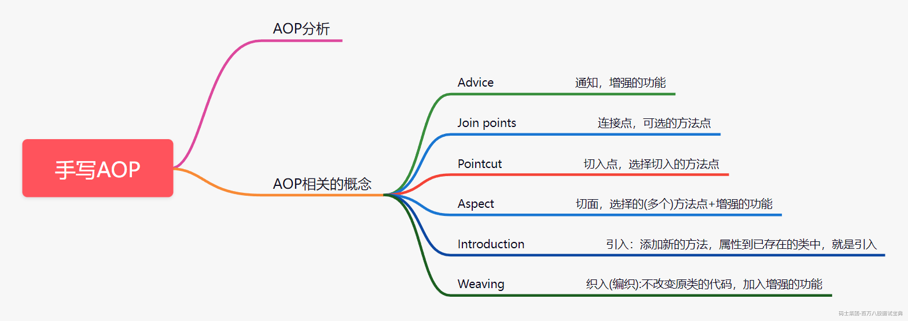

更加形象的描述

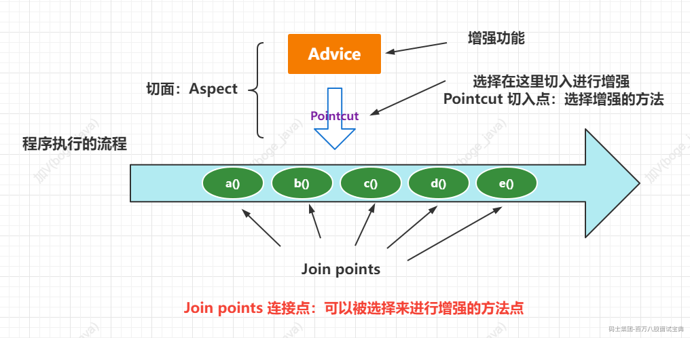

然后对于上面的相关概念，我们就要考虑哪些是用户需要提供的，哪些是框架要写好的？

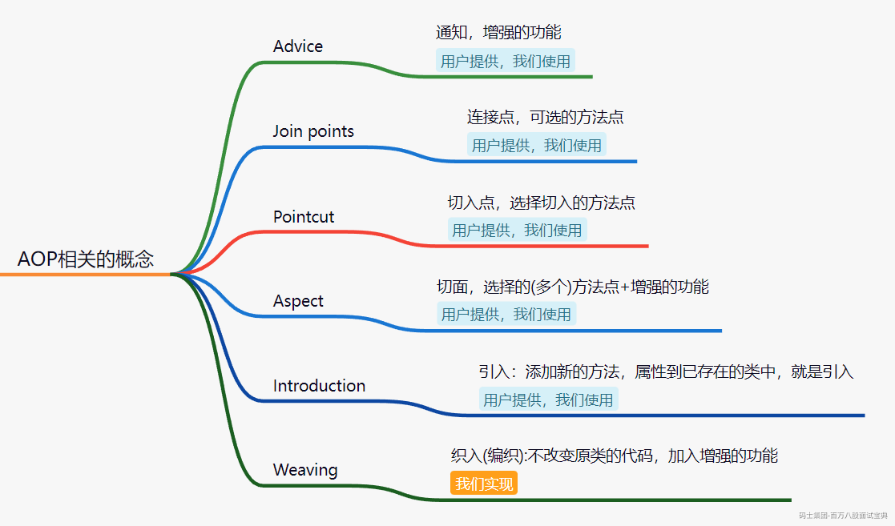

思考：Advice，Pointcuts和Weaving各自的特点

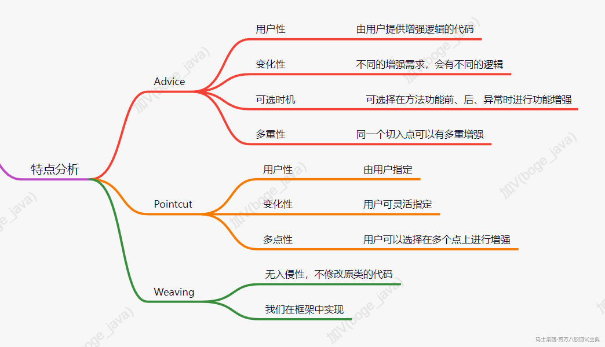

# 三、切面实现

  通过上面的分析，我们要设计实现AOP功能，其实就是要设计实现上面分析的相关概念对应的组件。

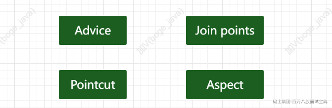

## 1.Advice

### 1.1 面向接口编程

  Advice:通知，是由用户提供的，我们来使用，主要是用户提供就突出了 `多变性`。针对这块我们应该怎么设计?这里有两个问题:

1. 我们如何能够识别用户提供的东西呢?用户在我们写好框架后使用我们的框架

2. 如何让我们的代码隔绝用户提供的多变性呢?

针对这种情况我们定义一套标准的接口，用户通过实现接口类提供他们不同的逻辑。是否可行?

这里有个重要的设计原则大家要注意: 如何应对变化，通过面向接口编程来搞定!!!

我们先定义一个空的接口,可以先思考下我们为什么定义一个空的接口呢?

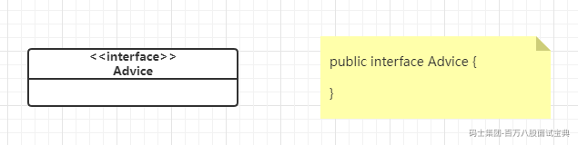

### 1.2 Advice的特点分析

  Advice的特点：可选时机，可选择在方法执行前、后、异常时进行功能的增强

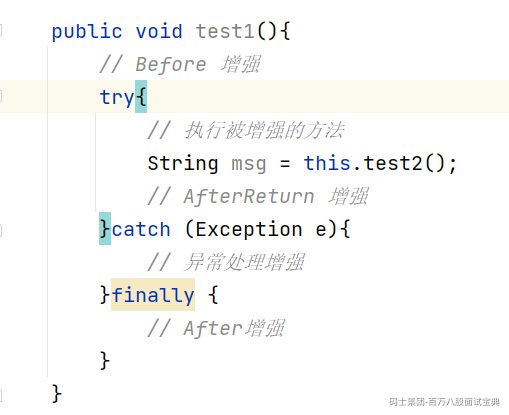

结合上面的情况我们可以分析出Advice通知的几种情况

- 前置增强-Before

- 后置增强-AfterReturn

- 环绕增强-Around

- 最终通知-After

- 异常通知-Throwing

有这么多的情况我们应该要怎么来实现呢?我们可以定义标准的接口方法，让用户来实现它，提供各种具体的增强内容。那么这四种增强相关的方法定义是怎样的呢？我们一一来分析下。

### 1.3 各种通知分析

#### 1.3.1 前置增强

**前置增强**：在方法执行前进行增强。

问题1：它可能需要的参数?

  目的是对方法进行增强，应该需要的是方法相关的信息，我们使用它的时候能给如它的就是当前要执行方法的相关信息了

问题2:运行时方法有哪些信息?

1. 方法本身 Method

2. 方法所属的对象 Object

3. 方法的参数 Object[]

问题3:前置增强的返回值是什么?

  在方法执行前进行增强，不需要返回值!

```java
public interface MethodBeforeAdvice extends Advice {

    /**
     * 实现该方法进行前置增强
     * 
     * @param method
     *            被增强的方法
     * @param args
     *            方法的参数
     * @param target
     *            被增强的目标对象
     * @throws Throwable
     */
    void before(Method method, Object[] args, Object target) throws Throwable;
}
```

#### 1.3.2 最终通知

  最终通知：在方法执行后进行增强

问题1:它可能需要的参数?

- 方法本身 Method

- 方法所属的对象 Object

- 方法的参数 Object[]

- 方法的返回值 Object 可能没有

问题2:它的返回值是什么?

  这个就需要看是否允许在After中更改返回的结果，如果规定只可用、不可修改返回值就不需要返回值

```java
public interface AfterAdvice extends Advice {
    /**
     * 实现该方法，提供后置增强
     * 
     * @param returnValue
     *            返回值
     * @param method
     *            被增强的方法
     * @param args
     *            方法的参数
     * @param target
     *            方法的所属对象
     * @throws Throwable
     */
    void after(Object returnValue, Method method, Object[] args, Object target) throws Throwable;
}
```

#### 1.3.3 后置通知

  后置增强：在方法执行后进行增强

问题1:他可能需要的参数

- 方法本身 Method

- 方法所属的对象 Object

- 方法的参数 Object[]

- 方法的返回值 Object

问题2:它的返回值是什么?

  这个就需要看是否允许在After中更改返回的结果，如果规定只可用、不可修改返回值就不需要返回值

```java
public interface AfterReturningAdvice extends Advice {
    /**
     * 实现该方法，提供AfterRetun增强
     * 
     * @param returnValue
     *            返回值
     * @param method
     *            被增强的方法
     * @param args
     *            方法的参数
     * @param target
     *            方法的所属对象
     * @throws Throwable
     */
    void afterReturning(Object returnValue, Method method, Object[] args, Object target) throws Throwable;
}
```

#### 1.3.4 环绕通知

Around环绕增强：包裹方法进行增强

问题1:他可能需要的参数

- 方法本身 Method

- 方法所属的对象 Object

- 方法的参数 Object[]

问题2:它的返回值是什么?

  方法被它包裹，即方法将由它来执行，它需要返回方法的返回值

```java
public interface MethodInterceptor extends Advice {
    /**
     * 对方法进行环绕（前置、后置）增强、异常处理增强，方法实现中需调用目标方法。
     * 
     * @param method
     *            被增强的方法
     * @param args
     *            方法的参数
     * @param target
     *            方法所属对象
     * @return Object 返回值
     * @throws Throwable
     */
    Object invoke(Method method, Object[] args, Object target) throws Throwable;
}
```

#### 1.3.5 异常通知

异常通知增强：对方法执行时的异常，进行增强处理

问题1：它可能需要什么参数?

- 一定需要Exception

- 可能需要方法本身 Method

- 可能需要方法所属的对象 Object

- 可能需要方法的参数 Object[]

问题2:它的返回值是什么?

  这个就需要看是否允许在After中更改返回的结果，如果规定只可用、不可修改返回值就不需要返回值

```java
public interface ThrowsAdvice extends Advice {

    void afterThrowing(Method method, Object[] args, Object target, Exception ex) throws Throwable;
}
```

### 1.4 Advice设计

  结合上面的分析，我们就可以得出Advice的体系图了

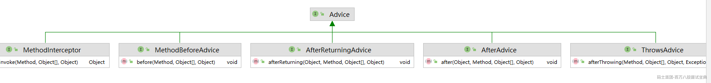

## 2.Pointcut

### 2.1 Pointcut的特点有：

- 用户性：由用户指定

- 变化性：用户可灵活指定

- 多点性：用户可以选择在多个点上进行增强

### 2.2 Pointcut分析

  为用户提供一个东西，让他们可以灵活地指定多个方法点，而且我们还能看懂!

思考：切入点是由用户来指定在哪些方法点上进行增强，那么这个哪些方法点如何来表示能满足上面的需求呢?

分析：

1. 指定哪些方法，是不是一个描述信息?

2. 如何来指定一个方法?

3. 如果有重载的情况怎么办?

4. 123要求的其实就是一个完整的方法签名

```java
com.boge.spring.aop.Girl.dbj(Boy,Time)

com.boge.spring.aop.Girl.dbj(Boy,Girl,Time)
```

我们还得进一步分析：如何做到多点性和灵活性，在一个描述中指定一类类的某些方法?

- 某个包下的某个类的某个方法

- 某个包下的所有类中的所有方法

- 某个包下的所有类中的do开头的方法

- 某个包下的以service结尾的类中的do开头的方法

- .....

也就是我们需要有这样一个表达式能够灵活的描述上面的这些信息。

这个表达式表达的内容有：


而且每个部分的要求是怎么样的呢？

- 包名：有父子特点，要能模糊匹配

- 类名：要能模糊匹配

- 方法名:要能模糊匹配

- 参数类型：参数可以有多个

那么我们设计的这个表达式将被我们用来决定是否需要对某个类的某个方法进行增强，这个决定过程应该是怎么样的？


针对需求我们的选择是：


AspectJ官网：<http://www.eclipse.org/aspectj>

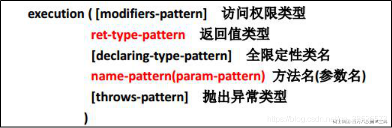

切入点表达式要匹配的对象就是目标方法的方法名。所以，execution表达式中明显就是方法的签名。注意，表达式中加[ ]的部分表示可省略部分，各部分间用空格分开。在其中可以使用以下符号

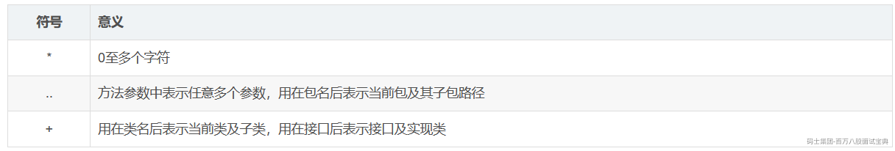

举例：

> execution(public \* *(. .))  
> 指定切入点为：任意公共方法。  
> execution(* set *(. .))  
> 指定切入点为：任何一个以“set”开始的方法。  
> execution(* com.xyz.service.*.*(. .))  
> 指定切入点为：定义在service包里的任意类的任意方法。  
> execution(\* com.xyz.service. .*.*(. .))  
> 指定切入点为：定义在service包或者子包里的任意类的任意方法。“..”出现在类名中时，  
> 后面必须跟“*”，表示包、子包下的所有类。  
> execution(* *.service.*.*(. .))  
> 指定只有一级包下的serivce子包下所有类(接口)中的所有方法为切入点  
> execution(* *. .service.*.\*(. .))  
> 指定所有包下的serivce子包下所有类(接口)中的所有方法为切入点

### 2.3 Pointcut设计

  通过分析完成我们就该对Pointcut类设计了，接口，类。

思考1：首先考虑切入点应该具有的属性--->切入点表达式

思考2：切入点应对外提供什么行为

思考3：切入点被我们设计用来做什么？

  对类和方法进行匹配，切入点应该提供匹配类，匹配方法的行为

思考4：如果在我们设计的框架中要能灵活的扩展切点，我们应该如何设计?

  这又是一个要支持可多变的问题，像通知一样，我们定义一套标准接口，定义好基本行为，面向接口编程，屏蔽掉具体的实现。不管哪些方案，都实现匹配类，匹配方法的接口。

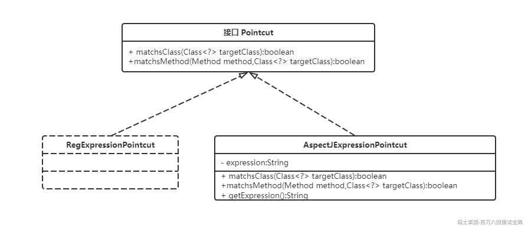

案例代码

```java
public interface Pointcut {

    boolean matchsClass(Class<?> targetClass);

    boolean matchsMethod(Method method, Class<?> targetClass);
}
```

然后来看看AspectJ的实现

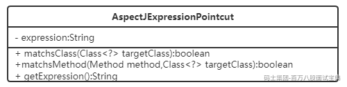

案例代码

```java
public class AspectJExpressionPointcut implements Pointcut {

    private static PointcutParser pp = PointcutParser
            .getPointcutParserSupportingAllPrimitivesAndUsingContextClassloaderForResolution();

    private String expression;

    private PointcutExpression pe;

    public AspectJExpressionPointcut(String expression) {
        super();
        this.expression = expression;
        pe = pp.parsePointcutExpression(expression);
    }

    @Override
    public boolean matchsClass(Class<?> targetClass) {
        return pe.couldMatchJoinPointsInType(targetClass);
    }

    @Override
    public boolean matchsMethod(Method method, Class<?> targetClass) {
        ShadowMatch sm = pe.matchesMethodExecution(method);
        return sm.alwaysMatches();
    }

    public String getExpression() {
        return expression;
    }

}
```

## 3.切面Aspect

搞定了两个难点后，我们来看看用户该如何使用我们提供的东西

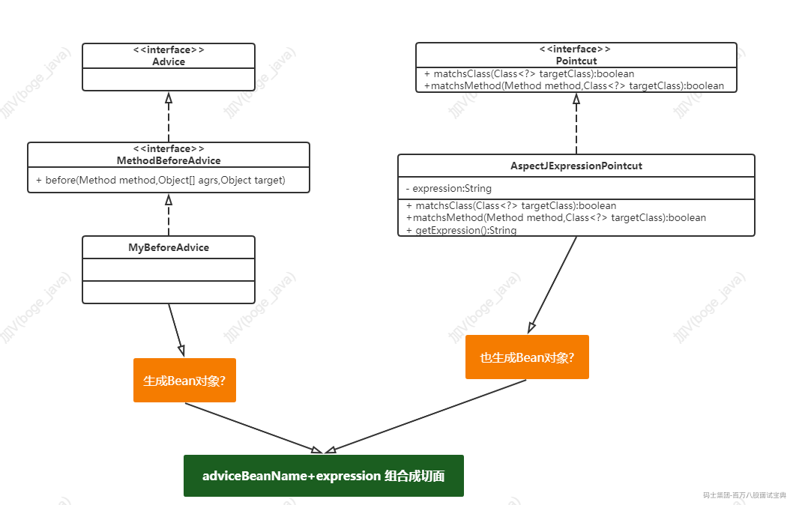

为此我们需要创建对应的接口来管理。

## 4. Advisor

为用户提供更简单的外观，Advisor(通知者)组合Advice和Pointcut。

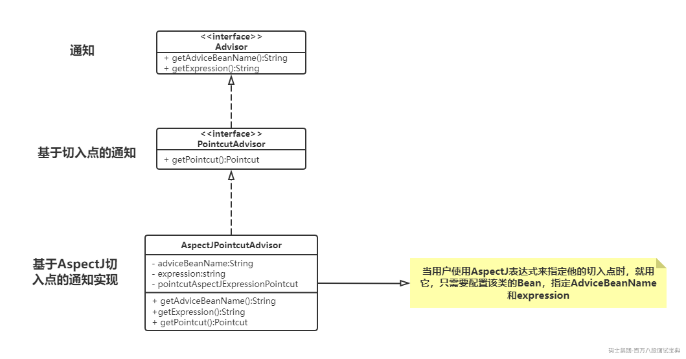

当然扩展的形式比较多：

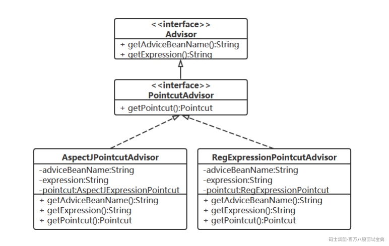

或者：

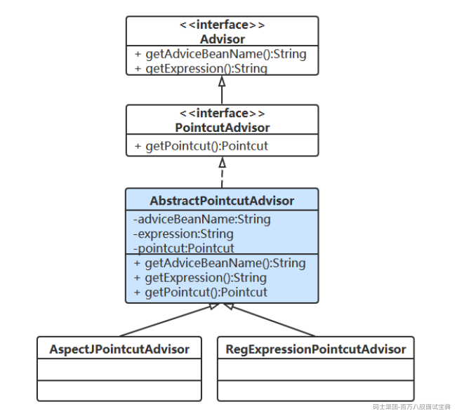

# 四、织入实现

## 1. 织入的分析

  织入要完成的是什么？织入其实就是要把用户提供的增强功能加到指定的方法上。

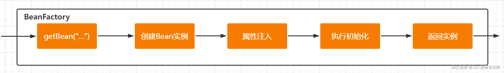

思考1：在什么时候织入?

  创建Bean实例的时候，在Bean初始化后，再对其进行增强。

思考2：如何确定bean要增强?

  对bean类及方法挨个匹配用户配置的切面，如果有切面匹配就是要增强

思考3：如何实现织入？

  代理方式

## 2.织入的设计

  为了更好的去设计织入的实现，先整理下AOP的使用流程。

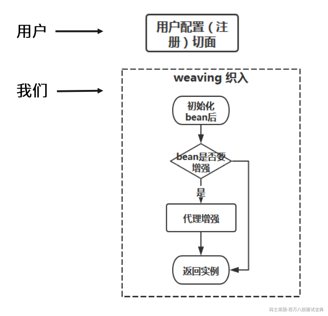

这里我们要考虑匹配、织入逻辑写到哪里？是写在BeanFactory中吗?

这时我们要考虑如果我们直接在BeanFactory中来处理，后续如果还有其他的需求是不是也要在BeanFactory中处理呢？这样操作有什么不好的地方呢？

- BeanFactory代码爆炸，不专情

- 不易扩展

那我们应该要怎么来设计呢？

我们先来回顾下Bean的生产的过程

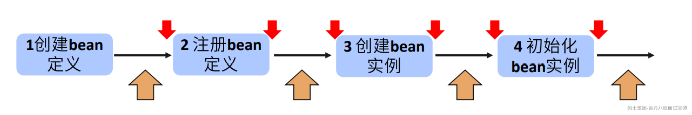

在这个过程中， 将来会有更多处理逻辑加入到Bean生产过程的不同阶段。我们现在最好是设计出能让我们后面不用再改BeanFactory的代码就能灵活的扩展。

这时我们可以考虑用观察者模式，通过在各个节点加入扩展点，加入注册机制。

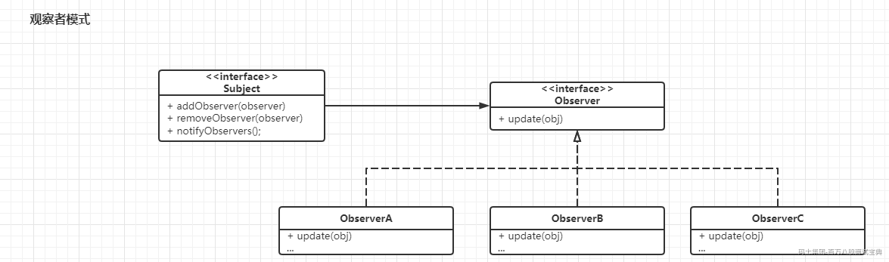

那么在这块我们就应用观察者模式来加入一个Bean的后置处理器 BeanPostProcessor

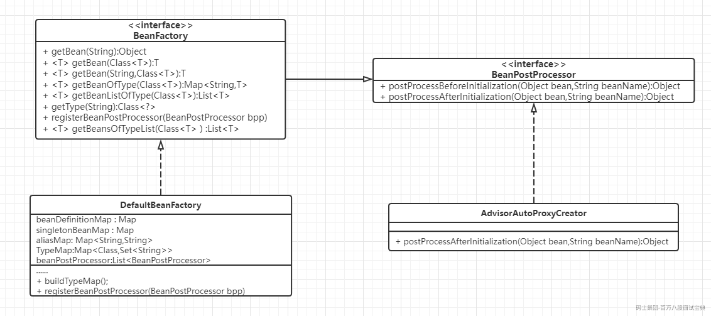

具体的我们在代码中来看看。

## 3.织入的实现

### 3.1 分析

  我们先定义了 BeanPostProcessor 接口，在这个接口中我们定义了相关的行为，也就是初始化之前和初始化之后要执行的方法。

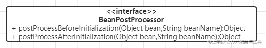

  那么在此处我们需要在BeanFactory对创建的Bean对象做初始化前后要校验是否需要做相关的增强操作。

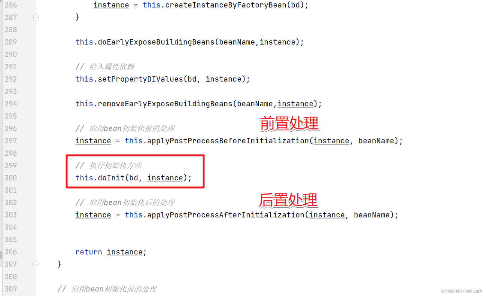

  在BeanFactory中我们提供了BeanPostProcessor的注册方法。

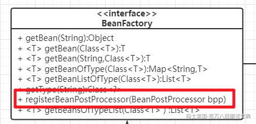

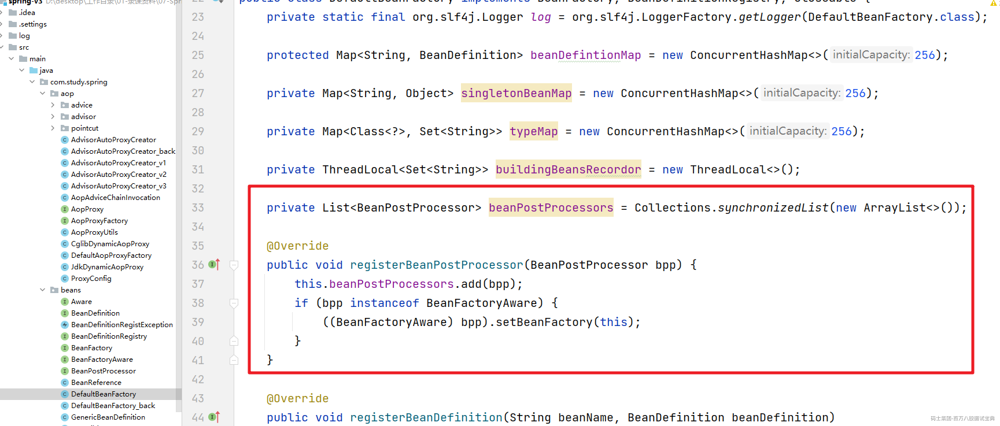

那么结合BeanFactory要实现相关的Bean增强操作，我们要做的行为就是两方面

1. 创建相关的BeanPostProcessor，并注册到BeanFactory中

2. BeanFactory在初始化Bean前后判断是否有相关BeanPostProcessor，如果有做相关的增强处理

  有了上面的分析，那么我们要实现具体的织入就需要来看看在对应前置和后置方法中我们要实现的功能

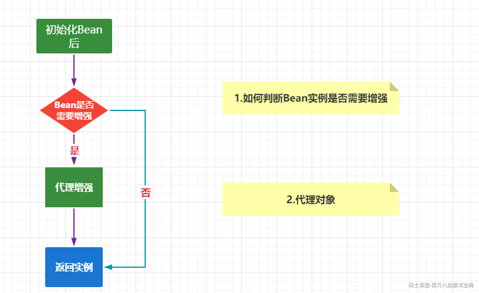

### 3.2 判断是否需要增强

  我们如何判断Bean对象是否需要增强呢？其实就是需要判断该Bean是否满足用户定义的切入点表达式。也就是我们需要简单Bean所属的类和所有方法。然后遍历Advisor。取出advisor中的Pointcut来匹配类和方法。

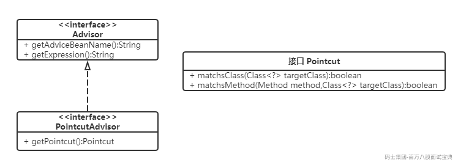

代码层面

```java
    @Override
    public Object postProcessAfterInitialization(Object bean, String beanName) throws Throwable {

        /*逻辑
        1 判断Bean是否需要增强
        2 创建代理来实现增强
        */

        //1 判断Bean是否需要增强
        List<Advisor> matchAdvisors = getMatchedAdvisors(bean, beanName);

        // 2如有切面切中，创建代理来实现增强
        if (CollectionUtils.isNotEmpty(matchAdvisors)) {
            bean = this.createProxy(bean, beanName, matchAdvisors);
        }

        return bean;
    }
```

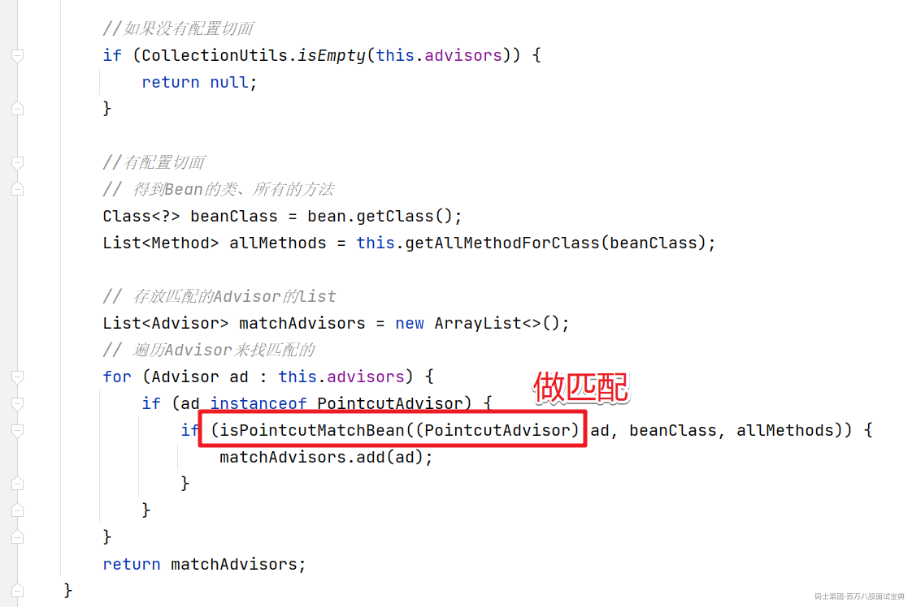

### 3.3 代理对象

  通过上面的分析如果Bean需要被增强，那么我们就需要创建Bean对应的代理对象了。代理模式：为其他对象提供一种代理以控制对这个对象的访问。在某些情况下，一个对象不适合或者不能直接引用另一个对象，而代理对象可以在调用者和目标对象之间起到中介的作用；

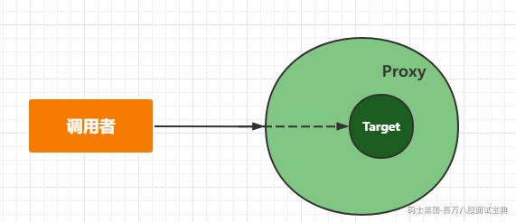

  动态代理的实现方法有哪些?


JDK动态代理：

在运行时，对接口创建代理对象

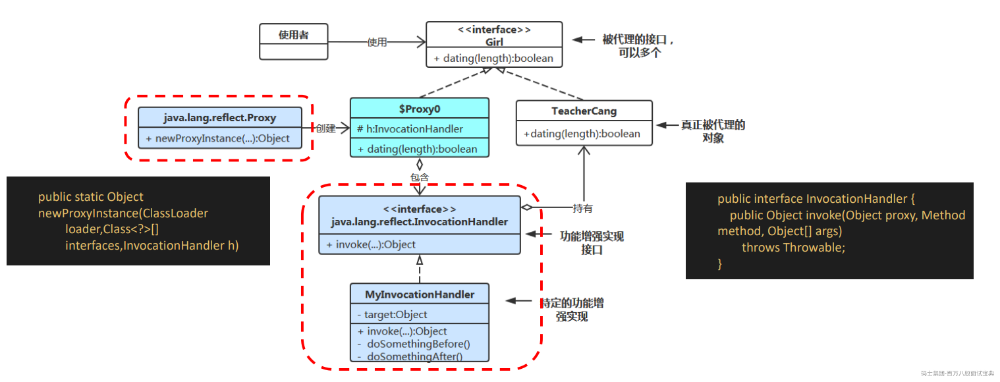

cglib动态代理：

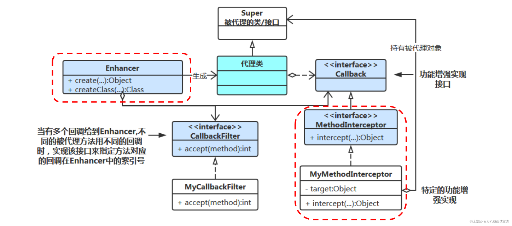

### 3.4 代理实现层设计

  动态代理的实现方式有很多种，如何能够做到灵活的扩展呢？在这里我们同样可以通过 `抽象`和 `面向接口编程`来设计一套支持不同代理实现的代码

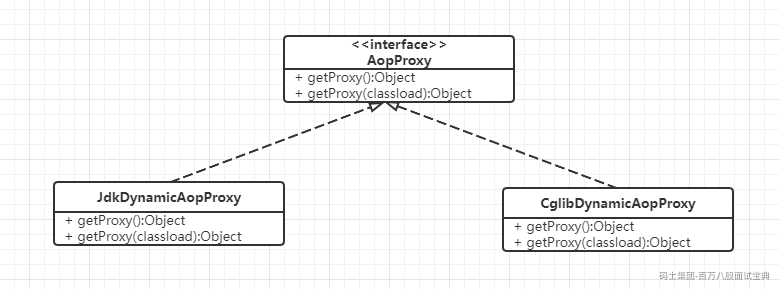

  有了上面的设计，然后就是需要考虑代理对象的创建了。

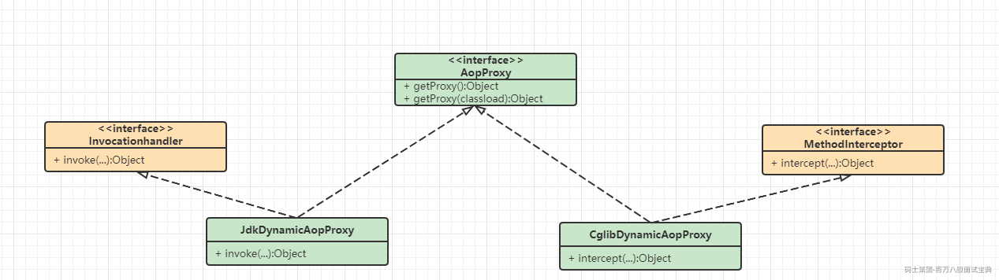

### 3.5 增强逻辑实现

  代理对象搞定后我们需要考虑核心的问题就是怎么来实现我们要增强的逻辑呢？首先不管你用哪种方式来生成代理对象最终增强的逻辑代码是一样的。所以我们可以把这部分内容提炼出来。

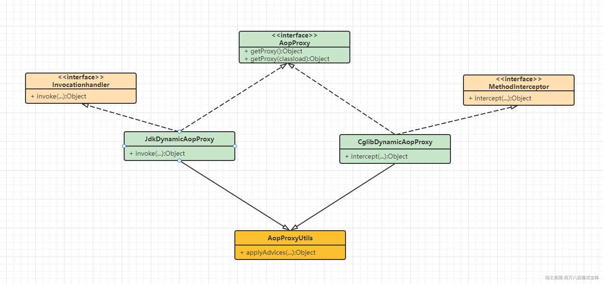

  然后具体的应用Advice增强实现的逻辑为：

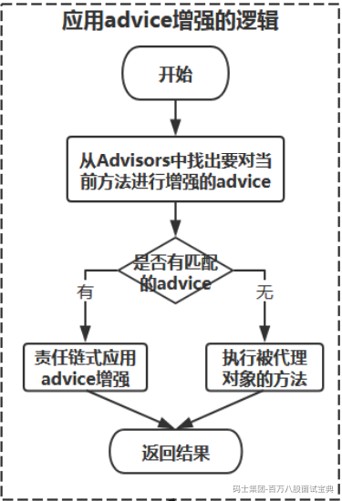

注意此处用到了责任链模式

```java
    public static Object applyAdvices(Object target, Method method, Object[] args, List<Advisor> matchAdvisors,
            Object proxy, BeanFactory beanFactory) throws Throwable {
        // 这里要做什么？   需要获取相关案例代码的+V：boge3306 备注:手写Spring
        // 1、获取要对当前方法进行增强的advice
        List<Object> advices = AopProxyUtils.getShouldApplyAdvices(target.getClass(), method, matchAdvisors,
                beanFactory);
        // 2、如有增强的advice，责任链式增强执行
        if (CollectionUtils.isEmpty(advices)) {
            return method.invoke(target, args);
        } else {
            // 责任链式执行增强
            AopAdviceChainInvocation chain = new AopAdviceChainInvocation(proxy, target, method, args, advices);
            return chain.invoke();
        }
    }
```

然后我们前面的Creator要怎么使用AopProxy呢？这块我们可以通过工厂模式来处理

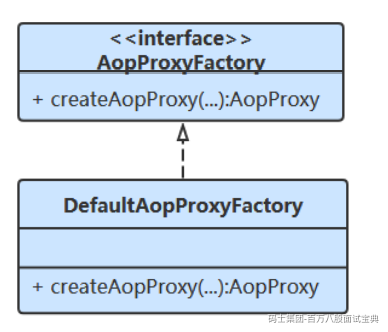

```java
public interface AopProxyFactory {

    AopProxy createAopProxy(Object bean, String beanName, List<Advisor> matchAdvisors, BeanFactory beanFactory)
            throws Throwable;

    /**
     * 获得默认的AopProxyFactory实例
     *    需要获取相关案例代码的+V：boge3306 备注:手写Spring
     * @return AopProxyFactory
     */
    static AopProxyFactory getDefaultAopProxyFactory() {
        return new DefaultAopProxyFactory();
    }
}
```

到这儿，完整的增强逻辑就梳理通了
