## JVM常用参数以及垃圾收集器常见参数（一般会问你怎么调整的垃圾收集器的具体参数，上节课是泛参数）：

## JVM调优 调整某些参数 为了让程序达到硬件性能瓶颈

### GC常用参数（一般各个垃圾收集器都可以使用的一些打印类参数以及大（类似于堆内存大小这种）参数）

-Xmx：设置堆的最大值，一般为操作系统的 2/3 大小 MaxHeapSize

-Xms：设置堆的初始值，一般设置成和 Xmx 一样的大小来避免动态扩容。 InitialHeapSize

项目启动直接Full GC

-Xmn：表示年轻代的大小，默认新生代占堆大小的 1/3。高并发、对象快消亡场景可适当加大这个区域，对半，或者更多，都是可以的。但是在 G1 下，就不用再设置这个值了，它会自动调整。

-Xss：用于设置栈的大小，默认为 1M，如果代码中局部变量不多，可设置成256K节约空间。

-XX:+UseTLAB 使用TLAB，默认打开

-XX:+PrintTLAB 打印TLAB的使用情况

-XX:TLABSize 设置TLAB大小

-XX:+DisableExplicitGC 启用用于禁用对的调用处理的选项System.gc()

-XX:+PrintGC 查看GC基本信息

-XX:+PrintGCDetails 查看GC详细信息

-XX:+PrintHeapAtGC 每次一次GC后，都打印堆信息

-XX:+PrintGCTimeStamps 启用在每个GC上打印时间戳的功能

-XX:+PrintGCApplicationConcurrentTime 打印应用程序时间(低)

-XX:+PrintGCApplicationStoppedTime 打印暂停时长（低）

-XX:+PrintReferenceGC 记录回收了多少种不同引用类型的引用（重要性低）

-verbose:class 类加载详细过程

-XX:+PrintVMOptions 可在程序运行时，打印虚拟机接受到的命令行显示参数

-XX:+PrintFlagsFinal -XX:+PrintFlagsInitial 打印所有的JVM参数、查看所有JVM参数启动的初始值（必须会用）

-XX:MaxTenuringThreshold

升代（分代）年龄，这个值在CMS 下默认为 6，G1 下默认为 15，这个值和我们前面提到的对象提升有关，改动效果会比较明显。对象的年龄分布可以使用 -XX:+PrintTenuringDistribution 打印，如果后面几代的大小总是差不多，证明过了某个年龄后的对象总能晋升到老生代，就可以把晋升阈值设小。

动态年龄分配：某一批对象晋升到S区 这批对象大小是S区的一半，年龄大于等于当前这批对象年龄的对象直接晋升老年代

### Parallel常用参数

**-XX:SurvivorRatio 你要讲的出道理**

设置伊甸园空间大小与幸存者空间大小之间的比率。默认情况下，此选项设置为**8**

**-XX:PreTenureSizeThreshold 对象到达一定的限定值的时候 会直接进入老年代**

大对象到底多大，大于这个值的参数直接在老年代分配

**-XX:MaxTenuringThreshold**

升代年龄，最大值15 **并行（吞吐量）收集器的默认值为**15，而CMS收集器的默认值为6。

**-XX:+ParallelGCThreads**

并行收集器的线程数，同样适用于**CMS**，一般设为和CPU核数相同 N+1

**-XX:+UseAdaptiveSizePolicy**

自动选择各区大小比例

### **CMS常用参数**

**-XX:+UseConcMarkSweepGC**

**启用**CMS垃圾回收器

**-XX:+ParallelGCThreads**

并行收集器的线程数，同样适用于**CMS**，一般设为和CPU核数相同

**-XX:CMSInitiatingOccupancyFraction 并发失败的模式**

**使用多少比例的老年代后开始**CMS收集，默认是68%(近似值)，如果频繁发生SerialOld卡顿，应该调小，（频繁CMS回收）

**-XX:+UseCMSCompactAtFullCollection**

**在**FGC时进行压缩

**-XX:CMSFullGCsBeforeCompaction**

**多少次**FGC之后进行压缩

**-XX:+CMSClassUnloadingEnabled**

使用并发标记扫描（**CMS**）垃圾收集器时，启用类卸载。默认情况下启用此选项。

**-XX:CMSInitiatingPermOccupancyFraction**

**达到什么比例时进行**Perm Space回收，**JDK 8**中不推荐使用此选项，不能替代。

-XX:GCTimeRatio

设置**GC**时间占用程序运行时间的百分比（不推荐使用）

**-XX:MaxGCPauseMillis**

停顿时间，是一个建议时间，**GC**会尝试用各种手段达到这个时间，比如减小年轻代

### **G1常用参数**

**-XX:+UseG1GC**

启用G1垃圾收集器

**-XX:MaxGCPauseMillis**

**设置最大**GC暂停时间的目标（以毫秒为单位）。这是一个软目标，并且JVM将尽最大的努力（G1会尝试调整Young区的块数来）来实现它。默认情况下，没有最大暂停时间值。

**-XX:GCPauseIntervalMillis**

GC的间隔时间

**-XX:+G1HeapRegionSize 你的堆内存小于2G的时候 4C8G起步**

**单个Region大小，取值是1M-32M，建议逐渐增大该值，****1 2 4 8 16 32****。随着size增加，垃圾的存活时间更长，GC间隔更长，但每次GC的时间也会更长-XX:G1NewSizePercent** **新生代最小比例，默认为**1/2000

**-XX:G1MaxNewSizePercent**

**新生代最大比例，默认为**60%

**-XX:GCTimeRatioGC**

时间建议比例，**G1**会根据这个值调整堆空间

**-XX:ConcGCThreads**

初始标记线程数量

**-XX:InitiatingHeapOccupancyPercent**

**启动**G1**的堆空间占用比例，根据整个堆的占用而触发并发**GC周期

# ZGC原理深入解析

> `官网`： <https://docs.oracle.com/en/java/javase/11/gctuning/z-garbage-collector1.html#GUID-A5A42691-095E-47BA-B6DC-FB4E5FAA43D0>
>
> **ZGC（The Z Garbage Collector）是JDK 11中推出的一款追求极致低延迟的实验性质的垃圾收集器，不管是物理上还是逻辑上，在ZGC中已经不存在新老年代的概念了 pauseless GC C4 GC**
>
> **会分为一个个page，当进行GC操作时会对page进行压缩，因此没有碎片问题**
>
> **在JDK11只能在64位的linux上使用，目前用得还比较少**
>
> 个人认为用的少的原因:
>
> 1. 用JDK8以上的就不多，够用了是关键
>
> 2. 对于内存架构要求高
>
> 3. 在JDK15之前处于实验阶段

**（1）可以达到10ms以内的停顿时间要求**

**（2）支持TB级别的内存（支持8MB~4TB级别的堆，JDK15以后支持16TB）**

**（3）停顿时间不会随着堆的大小，或者活跃对象的大小而增加；堆内存变大后停顿时间还是在10ms以内**

内存结构上的区别：

ZGC（The Z Garbage Collector）在内存管理上采用了分区模型，这种模型有助于它实现高效的并发垃圾回收。以下是关于ZGC分区方式的详细解释：

1. **页面（Page）作为基本单位** ：

- ZGC将堆内存划分为多个等大小的页面（Page），这些页面是ZGC内存管理的基本单位。

- 页面大小固定，ZGC提供了三种不同大小的页面：小页面（2MB）、中页面（32MB）和大页面（受操作系统控制的大页）。

2. **对象分配策略** ：

- 根据对象的大小，ZGC将它们分配到不同大小的页面中。

- 小于或等于256KB的对象被分配在小页面中。

- 256KB到4MB之间的对象被分配在中页面中。

- 大于4MB的对象则分配在大页面中。

3. **并发性** ：

- 由于ZGC的标记和重定位过程都是并发的，因此这种分区模型有助于减少垃圾回收对应用程序的影响。

- 在并发标记阶段，ZGC可以并行地处理多个页面，提高了垃圾回收的效率。

垃圾收集流程：

1. **初始标记（Initial Mark）** ：

- ZGC会暂停Java虚拟机（JVM）的工作，进行初始的根对象标记。这些根对象包括线程栈上的引用、静态变量和一些特殊的对象。

- 此阶段的目标是确定一组初始的存活对象，以便在后续的并发标记和重定位阶段中进行处理。

- 初始标记的处理时间和GC Roots的数量成正比，一般情况耗时非常短。

2. **并发标记/对象重定位（Concurrent Mark/Relocate）** ：

- ZGC并发地遍历堆中的对象，并标记出这些对象的存活状态。

- 同时，ZGC会将存活对象从旧的内存区域重定位到新的内存区域，以便为后续的对象分配提供更大的连续空间。

- 这个阶段的并发执行可以减少垃圾回收对应用程序的停顿时间。

3. **再标记（Remark）** ：

- 在并发标记阶段期间，应用程序可能会继续产生新的对象，而这些新对象也需要被标记为存活。

- 因此，ZGC需要进行一次再标记阶段，以标记并更新在并发标记期间产生的新对象。

- 再标记阶段是一个短暂的STW（Stop-The-World）阶段，但时间非常短，最多只有1ms。如果超过这个时间，则再次进入并发标记阶段。

4. **并发转移准备（Concurrent Transfer Preparation）** ：

- 在并发转移准备阶段，ZGC会准备进行并发的对象转移。

- 这包括处理与并发标记阶段重叠的一些操作，例如更新引用和处理根对象。

- 这个阶段的目的是为并发转移阶段做准备，以确保在该阶段的并发执行期间，应用程序的执行不会受到过多的停顿。

5. **初始转移（Initial Relocate）** ：

- ZGC会将剩余的存活对象从旧的内存区域转移到新的内存区域。

- 这是一个短暂的STW阶段，其处理时间和GC Roots的数量成正比，一般情况耗时也非常短。

6. **并发转移（Concurrent Relocate）** ：

- ZGC会在后台并发地处理剩余的存活对象，并将它们从旧的内存区域转移到新的内存区域。

- 与并发标记/对象重定位阶段一样，这个阶段的并发执行可以最大程度地减少应用程序的停顿时间。

7. **完成（Done）** ：

- 一旦所有的存活对象都被转移并整理完毕，ZGC会恢复JVM的工作，完成整个垃圾回收过程。

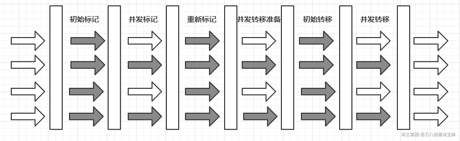

> 实际上:
>
> ZGC诞生于JDK11，经过不断的完善，JDK15中的ZGC已经不再是实验性质的了。
>
> 从只支持Linux/x64，到现在支持多平台；从不支持指针压缩，到支持压缩类指针…
>
> 在JDK16，ZGC将支持并发线程栈扫描（Concurrent Thread Stack Scanning），根据**SPECjbb2015测试**结果，实现并发线程栈扫描之后，ZGC的STW时间又能降低一个数量级，停顿时间将进入毫秒时代。
>
> **SPECjbb:** SPECjbb 是这几个字母的首字母组成的，**S**tandard **P**erformance **E**valuation **C**orporation（spec公司），**J**AVA server **B**usiness **B**enchmark（java服务器业务测试工具）。
>
> 在SPECjbb 这个基准测试中，被测产品要运行JVM，模拟一家全球大型零售企业的各种终端销售点请求、在线购买、数据挖掘等日常业务，通过不断增加的业务量来测试系统能够处理的最大值，同时会测试随着业务量增加，系统响应时间的变化，以全面评估运行各项Java业务应用的服务器性能水平。
>
> SPECjbb 模拟了三层客户/服务器模型结构：第一层是用户（客户端输入）；第二层是商业应用逻辑；第三层是数据库。

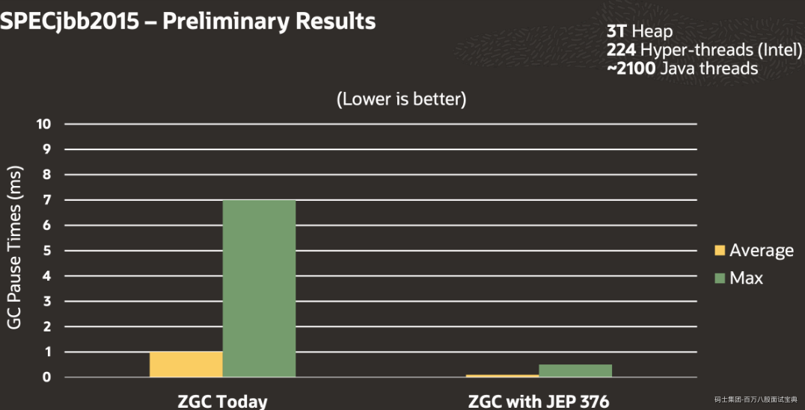

## ZGC三大核心技术

### 多重映射

为了能更好的理解ZGC的内存管理，我们先看一下这个例子：

你在你爸爸妈妈眼中是儿子，在你女朋友眼中是男朋友。在全世界人面前就是最帅的人。你还有一个名字，但名字也只是你的一个代号，并不是你本人。将这个关系画一张映射图表示：

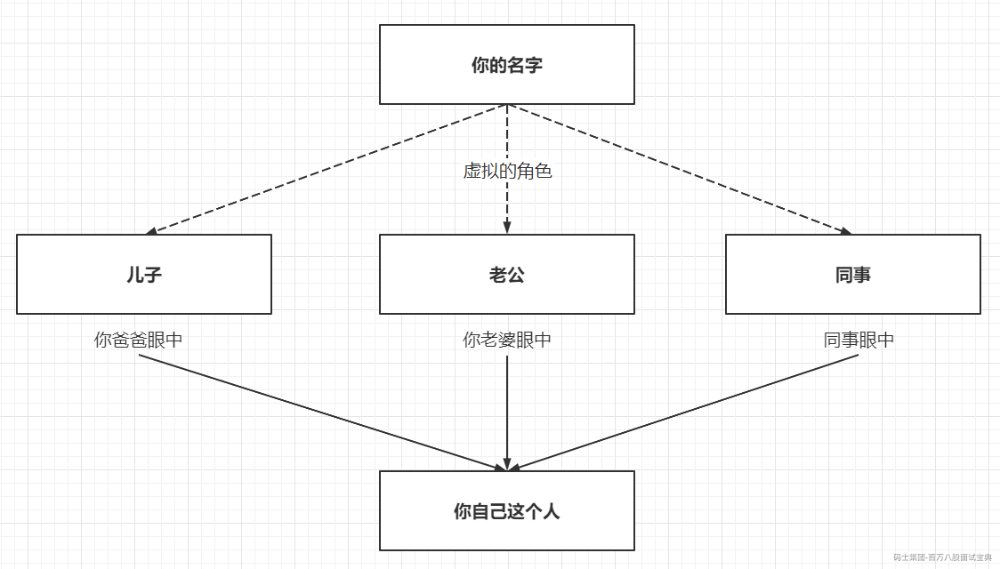

在你爸爸的眼中，你就是儿子；  
在你老婆的眼中，你就是老公；  
在你同事的眼中，你就是同事；  
假如你的名字是全世界唯一的，通过“你的名字”、“你爸爸的儿子”、“你老婆的老公”，“世界上最帅的人”最后定位到的都是你本人。

现在我们再来看看ZGC的内存管理。

ZGC为了能高效、灵活地管理内存，实现了两级内存管理：虚拟内存和物理内存，并且实现了物理内存和虚拟内存的映射关系。这和操作系统中虚拟地址和物理地址设计思路基本一致。

当应用程序创建对象时，首先在堆空间申请一个虚拟地址，ZGC同时会为该对象在Marked0、Marked1和Remapped三个视图空间分别申请一个虚拟地址，且这三个虚拟地址对应同一个物理地址。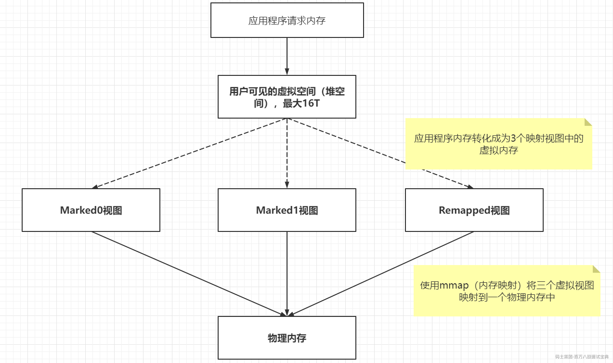

图中的Marked0、Marked1和Remapped三个视图是什么意思呢？

对照上面的例子，这三个视图分别对应的就是"你爸爸眼中"，“你老婆的眼中”，“同事眼中”。

而三个视图里面的地址，都是虚拟地址，对应的是“你爸爸眼中的儿子”，“你老婆眼中的老公”…

最后，这些虚地址都能映射到同一个物理地址，这个物理地址对应上面例子中的“你本人”。

为什么这么设计呢？

这就是ZGC的高明之处，利用虚拟空间换时间，这三个空间的切换是由垃圾回收的不同阶段触发的，通过限定三个空间在同一时间点有且仅有一个空间有效高效的完成GC过程的并发操作，具体实现会在后面讲ZGC并发处理算法的部分再详细描述

### 读屏障

请各位注意，之前我们一直在聊写屏障，而这里聊到读屏障，很多同学就会把这个读屏障跟java内存模型的读屏障混淆。这里的读屏障实际上指的是一种手段，并且是一种类似于AOP的手段。

我们之前聊的写屏障是数据写入时候的屏障，而java内存屏障中的读屏障实际上也是类似的。

但是在ZGC中的读屏障，则是JVM向应用代码插入一小段代码的技术，当应用线程从堆中读取对象引用时，就会执行这段代码。他跟我们的java内存屏障中的读屏障根本就不是一个东西。他是在字节码层面或者编译代码层面给读操作增加一个额外的处理。一个类似与面向切面的处理。

并且ZGC的读屏障是只有从中读取对象引用，才需要加入读屏障

**读屏障案例：**

```java
Object o = obj.FieldA      // 从堆中读取对象引用，需要加入读屏障
<load barrier needed here>
  
Object p = o               // 无需加入读屏障，因为不是从堆中读取引用
o.dosomething()            // 无需加入读屏障，因为不是从堆中读取引用
int i =  obj.FieldB        // 无需加入读屏障，因为不是对象引用
```

**那么我加上这个读屏障有什么作用呢？**

这里我们思考下：

由于GC线程和应用线程是并发执行的，所以肯定会存在应用线程去A对象内部的引用所指向的对象B的时候，这个对象B正在被GC线程移动或者其他操作，加上读屏障之后，应用线程会去探测对象B是否被GC线程操作，然后等待操作完成再读取对象，确保数据的准确性。这个操作强依赖于前面的多种映射。

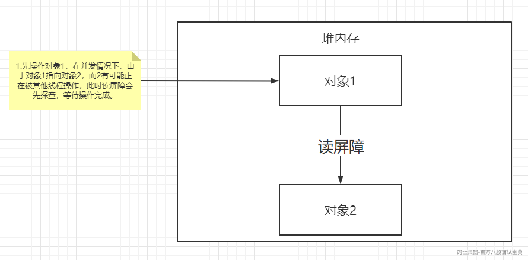

具体探查操作图：

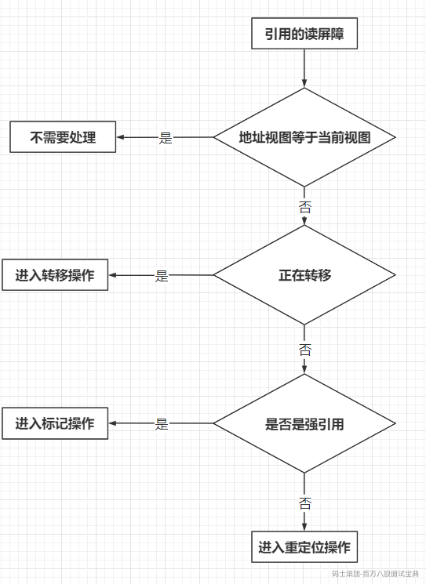

问题：如此复杂的探查操作会不会影响程序的性能呢？

会，据测试，最多百分之4的性能损耗。但这是ZGC并发转移的基础，为了降低STW，设计者认为这点牺牲是可接受的。

### 指针染色

读屏障以及指针染色是我们能够实现并发转移的核心技术之一，也是关键所在。

在讲ZGC并发处理算法之前，还需要补充一个知识点——染色指针。

我们都知道，之前的垃圾收集器都是把GC信息（标记信息、GC分代年龄…）存在对象头的Mark Word里。举个例子：

如果某个物品是个垃圾，就在这个物品上盖一个“垃圾”的章；如果这个物品不是垃圾了，就把这个物品上的“垃圾”印章洗掉。

而ZGC是这样做的：

如果某个物品是垃圾。就在这个物品的信息或者标签里面标注这个物品是个垃圾，以后不管这个物品在哪扫描，快递到哪，别人都知道他是个垃圾了。也许哪一天，这个物品不再是垃圾，比如收废品的小王，觉得比如这个物品有利用价值。就把这个物品标签信息里面的“垃圾”标志去掉。

在这例子中，“这个物品”就是一个对象，而“标签”就是指向这个对象的指针。

ZGC将信息存储在指针中，这种技术有一个高大上的名字——染色指针（Colored Pointer）

原理：  
Linux下64位指针的高18位不能用来寻址，但剩余的46位指针所能支持的64TB内存在今天仍然能够充分满足大型服务器的需要。鉴于此，ZGC的染色指针技术继续盯上了这剩下的46位指针宽度，将其高4位提取出来存储四个标志信息。通过这些标志位，虚拟机可以直接从指针中看到其引用对象的三色标记状态、是否进入了重分配集（即被移动过）、是否只能通过finalize()方法才能被访问到。当然，由于这些标志位进一步压缩了原本就只有46位的地址空间，也直接导致  
ZGC能够管理的内存不可以超过4TB（2的42次幂) 当然，后续的版本可以了，因为开发了更多的位数。前面是觉得没必要，够大了。

而后续开发变成了这个样子：

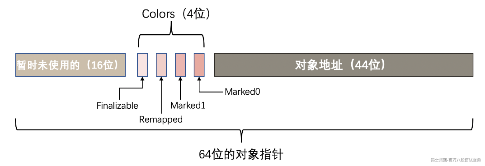

在64位的机器中，对象指针是64位的。

- ZGC使用64位地址空间的第0~43位存储对象地址，2^44 = 16TB，所以ZGC最大支持16TB的堆。

- 而第44~47位作为颜色标志位，Marked0、Marked1和Remapped代表三个视图标志位，Finalizable表示这个对象只能通过finalizer才能访问。

- 第48~63位固定为0没有利用。

## ZGC并发处理算法

GC并发处理算法利用全局空间视图的切换和对象地址视图的切换，结合SATB算法实现了高效的并发。

相比于 Java 原有的百毫秒级的暂停的 Parallel GC 和 G1，以及未解决碎片化问题的 CMS ，并发和压缩式的 ZGC 可谓是 Java GC 能力的一次重大飞跃—— GC 线程在整理内存的同时，可以让 Java 线程继续执行。 ZGC 采用标记-压缩策略来回收 Java 堆：ZGC 首先会并发标记( concurrent mark )堆中的活跃对象，然后并发转移( concurrent relocate )将部分区域的活跃对象整理到一起。这里与早先的 Java GC 不同之处在于，目前 ZGC 是单代垃圾回收器，在标记阶段会遍历堆中的全部对象。

ZGC的并发处理算法三个阶段的全局视图切换如下：

初始化阶段：ZGC初始化之后，整个内存空间的地址视图被设置为Remapped  
标记阶段：当进入标记阶段时的视图转变为Marked0（以下皆简称M0）或者Marked1（以下皆简称M1）  
转移阶段：从标记阶段结束进入转移阶段时的视图再次设置为Remapped

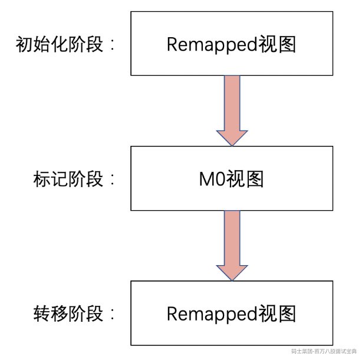

### 标记阶段

标记阶段全局视图切换到M0视图。因为应用程序和标记线程并发执行，那么对象的访问可能来自标记线程和应用程序线程。

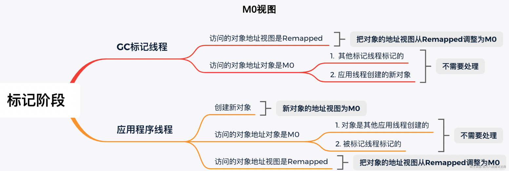

在标记阶段结束之后，对象的地址视图要么是M0，要么是Remapped。

如果对象的地址视图是M0，说明对象是活跃的；  
如果对象的地址视图是Remapped，说明对象是不活跃的，即对象所使用的内存可以被回收。  
当标记阶段结束后，ZGC会把所有活跃对象的地址存到对象活跃信息表，活跃对象的地址视图都是M0。

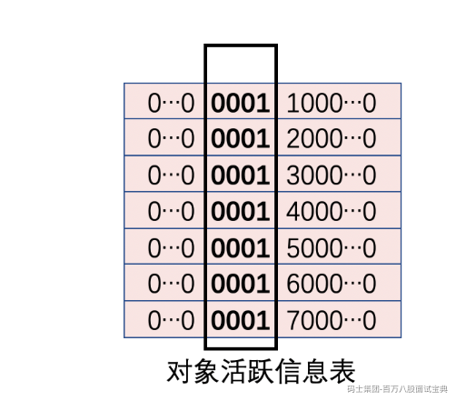

### 转移阶段

转移阶段切换到Remapped视图。因为应用程序和转移线程也是并发执行，那么对象的访问可能来自转移线程和应用程序线程。

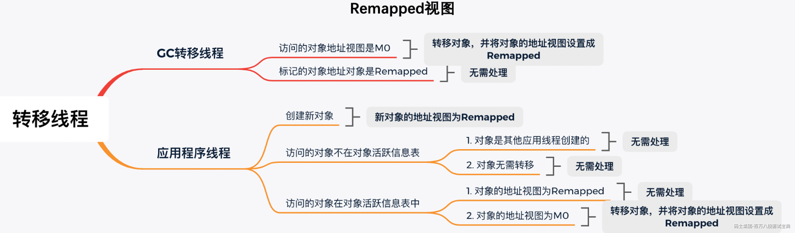

至此，ZGC的一个垃圾回收周期中，并发标记和并发转移就结束了。

**为何要设计M0和M1**  
我们提到在标记阶段存在两个地址视图M0和M1，上面的算法过程显示只用到了一个地址视图，为什么设计成两个？简单地说是为了区别前一次标记和当前标记。

ZGC是按照页面进行部分内存垃圾回收的，也就是说当对象所在的页面需要回收时，页面里面的对象需要被转移，如果页面不需要转移，页面里面的对象也就不需要转移。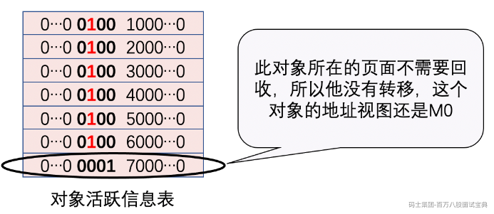

如图，这个对象在第二次GC周期开始的时候，地址视图还是M0。如果第二次GC的标记阶段还切到M0视图的话，就不能区分出对象是活跃的，还是上一次垃圾回收标记过的。这个时候，第二次GC周期的标记阶段切到M1视图的话就可以区分了，此时这3个地址视图代表的含义是：

- M1：本次垃圾回收中识别的活跃对象。

- M0：前一次垃圾回收的标记阶段被标记过的活跃对象，对象在转移阶段未被转移，但是在本次垃圾回收中被识别为不活跃对象。

- Remapped：前一次垃圾回收的转移阶段发生转移的对象或者是被应用程序线程访问的对象，但是在本次垃圾回收中被识别为不活跃对象。

### ZGC并发处理演示图

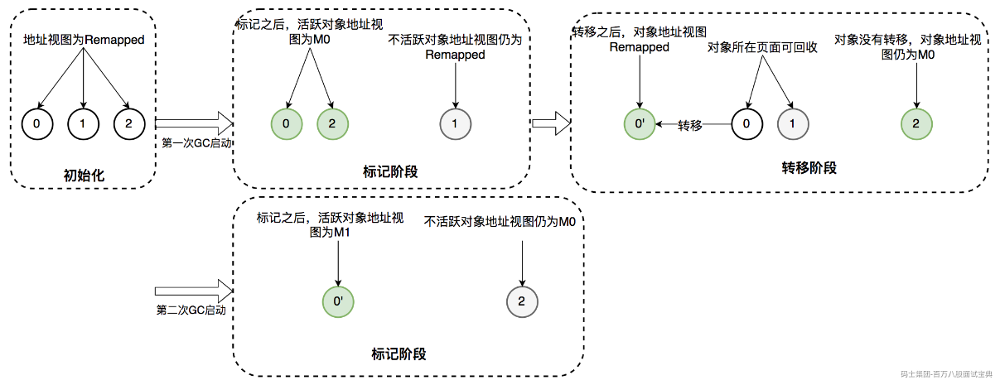

**使用地址视图和染色指针有什么好处？**

使用地址视图和染色指针可以加快标记和转移的速度。以前的垃圾回收器通过修改对象头的标记位来标记GC信息，这是有内存存取访问的，而ZGC通过地址视图和染色指针技术，无需任何对象访问，只需要设置地址中对应的标志位即可。这就是ZGC在标记和转移阶段速度更快的原因。

当GC信息不再存储在对象头上时而存在引用指针上时，当确定一个对象已经无用的时候，可以立即重用对应的内存空间，这是把GC信息放到对象头所做不到的。

ZGC只有三个STW阶段：初始标记，再标记，初始转移。

其中，初始标记和初始转移分别都只需要扫描所有GC Roots，其处理时间和GC Roots的数量成正比，一般情况耗时非常短；

再标记阶段STW时间很短，最多1ms，超过1ms则再次进入并发标记阶段。即，ZGC几乎所有暂停都只依赖于GC Roots集合大小，停顿时间不会随着堆的大小或者活跃对象的大小而增加。与ZGC对比，G1的转移阶段完全STW的，且停顿时间随存活对象的大小增加而增加。

### ZGC最佳调优参数：

- `-Xms -Xmx`：堆的最大内存和最小内存，这里都最小设置为16G，程序的堆内存将保持16G不变。小于16G建议G1

- `-XX:ReservedCodeCacheSize -XX:InitialCodeCacheSize`：设置CodeCache的大小， JIT编译的代码都放在CodeCache中，一般服务64m或128m就已经足够。我们的服务因为有一定特殊性，所以设置的较大，后面会详细介绍。

- `-XX:+UnlockExperimentalVMOptions -XX:+UseZGC`：启用ZGC的配置。

- `-XX:ConcGCThreads`：并发回收垃圾的线程。默认是总核数的12.5%，8核CPU默认是1。调大后GC变快，但会占用程序运行时的CPU资源，吞吐会受到影响。

- `-XX:ParallelGCThreads`：STW阶段使用线程数，默认是总核数的60%。

- `-XX:ZCollectionInterval`：ZGC发生的最小时间间隔，单位秒。

- `-XX:ZAllocationSpikeTolerance`：ZGC触发自适应算法的修正系数，默认2，数值越大，越早的触发ZGC。

- `-XX:+UnlockDiagnosticVMOptions -XX:-ZProactive`：是否启用主动回收，默认开启，这里的配置表示关闭。

- `-Xlog`：设置GC日志中的内容、格式、位置以及每个日志的大小。

```xml

-Xms16G -Xmx16G 
-XX:ReservedCodeCacheSize=256m -XX:InitialCodeCacheSize=256m 
-XX:+UnlockExperimentalVMOptions -XX:+UseZGC 
-XX:ConcGCThreads=2 -XX:ParallelGCThreads=6 
-XX:ZCollectionInterval=120 -XX:ZAllocationSpikeTolerance=5 
-XX:+UnlockDiagnosticVMOptions -XX:-ZProactive 
-Xlog:safepoint,classhisto*=trace,age*,gc*=info:file=/opt/logs/logs/gc-%t.log:time,tid,tags:filecount=5,filesize=50m 
```

## ZGC垃圾回收触发时机

> 相比于CMS和G1的GC触发机制，ZGC的GC触发机制有很大不同。ZGC的核心特点是并发，GC过程中一直有新的对象产生。如何保证在GC完成之前，新产生的对象不会将堆占满，是ZGC参数调优的第一大目标。因为在ZGC中，当垃圾来不及回收将堆占满时，会导致正在运行的线程停顿，持续时间可能长达秒级之久。

ZGC有多种GC触发机制，总结如下：

- **阻塞内存分配请求触发** ：当垃圾来不及回收，垃圾将堆占满时，会导致部分线程阻塞。我们应当避免出现这种触发方式。日志中关键字是“Allocation Stall”。

- **基于分配速率的自适应算法** ：最主要的GC触发方式，其算法原理可简单描述为”ZGC根据近期的对象分配速率以及GC时间，计算出当内存占用达到什么阈值时触发下一次GC”。自适应算法的详细理论可参考彭成寒《新一代垃圾回收器ZGC设计与实现》一书中的内容。通过ZAllocationSpikeTolerance参数控制阈值大小，该参数默认2，数值越大，越早的触发GC。我们通过调整此参数解决了一些问题。日志中关键字是“Allocation Rate”。

- **基于固定时间间隔** ：通过ZCollectionInterval控制，适合应对突增流量场景。流量平稳变化时，自适应算法可能在堆使用率达到95%以上才触发GC。流量突增时，自适应算法触发的时机可能会过晚，导致部分线程阻塞。我们通过调整此参数解决流量突增场景的问题，比如定时活动、秒杀等场景。日志中关键字是“Timer”。

- **主动触发规则** ：类似于固定间隔规则，但时间间隔不固定，是ZGC自行算出来的时机，我们的服务因为已经加了基于固定时间间隔的触发机制，所以通过-ZProactive参数将该功能关闭，以免GC频繁，影响服务可用性。 日志中关键字是“Proactive”。

- **预热规则** ：服务刚启动时出现，一般不需要关注。日志中关键字是“Warmup”。

- **外部触发** ：代码中显式调用System.gc()触发。 日志中关键字是“System.gc()”。

- **元数据分配触发** ：元数据区不足时导致，一般不需要关注。 日志中关键字是“Metadata GC Threshold”。
