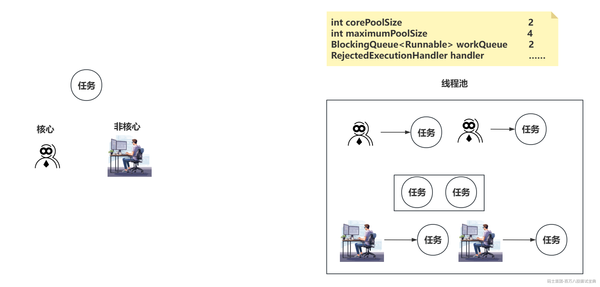
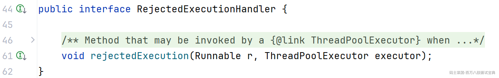

# 线程池核心参数设计落地

## 一、线程池参数回顾

> 这个东西，即便是面试问，你也必须会，而且要流畅清晰的回答清楚

```java
public ThreadPoolExecutor(int corePoolSize,                    核心线程数  
                          int maximumPoolSize,                 最大线程数
                          long keepAliveTime,                  最大空闲时间
                          TimeUnit unit,                       空闲时间单位
                          BlockingQueue<Runnable> workQueue,   工作队列
                          ThreadFactory threadFactory,         线程工厂
                          RejectedExecutionHandler handler) {  拒绝策略
} 
```

## 二、任务流转方向回顾

> 任务投递给线程池之后，线程池怎么去处理这个任务。
>
> 1、优先 **创建核心线程** 去处理任务。
>
> - 工作线程数 < corePoolSize
>
> 2、将任务扔到工作队列中。
>
> - 工作队列的任务数 < workQueue的长度
>
> 3、创建非核心线程去处理任务。
>
> - 工作线程数 < maximumPoolSize
>
> 4、执行拒绝策略。
>
> - 前面的1、2、3、都没法处理时，走拒绝策略。



## 三、核心线程数设计准则

> **一般情况下，核心线程数（corePoolSize）跟最大线程数（maximumPoolSize）推荐设置成一样的。**
>
> 原因：因为核心线程数设置的足够合理，这些线程就已经可以充分发挥CPU的性能了，如果再额外的追加一些线程，反而可能会因为CPU的上下文切换之类的问题，到底性能变低。

---

> 核心线程数的设置需要从三个维度去考虑：
>
> - **CPU内核数**
>
> - **任务情况（CPU密集，IO密集，混合型）**
>
> - 内存情况。（这个不是重点，主要是体现一个事情，线程数别太多，别因为线程个数导致OOM）
>
> **Ps：内存情况不用过多考虑，一般很少会因为线程池的线程个数导致OOM。**
>
> 主要考虑CPI核心数以及任务类型
>
> - 如果 **任务是CPU密集的** ，这个任务在处理时，就希望CPU核心可以尽可能的调度我，减少线程的切换，一般情况下，核心线程数配置为 **CPU核心数 ± 1** 左右就可以，不会有很大的浮动。
>
> - 如果 **任务是IO密集或者是混合型的** ，这个任务会有一定的时间在等待网络IO，磁盘IO的时间，线程在IO时，是WAITING状态，不需要CPU分配时间片，此时CPU可以去调度其他线程，来提升线程池处理任务的性能。公式也有，但是不会很准确！
>
> - **核心和线程：CPU内核×2，最大线程数：CPU核心数×25。 （不合理）**
>
> - **线程数 = CPU内核数 × CPU内核数 \* （1 + W/C）。（不合理）W是IO时间，C是计算时间**
>
> - **都不合理的原因是：CPU不单单是为了你这个线程池活的，他要维持操作系统，要维持其他组件中的线程的调度，比如Tomcat线程池，一些中间件之类也需要线程。**
>
> **最后的结论就是，可以根据你的任务是CPU密集或者IO密集的情况，根据所谓的公式大致估算出一个数值，如果希望这个数值可以调整到最佳的数值，还需要再进行压测，比如公式得出的数值是50，咱们可以需要做一些上下的浮动去压测，40，60，70，80，，得出哪个数值的吞吐量最高，或者平均RT时间最快，等压测的数值，选择一个合理的。**

## 四、工作队列设计准则

> 工作队列的设置咱们要考虑三个事：
>
> - **阻塞队列实现** 的选择：线程池里的工作队列中要频繁的增删任务。So，LinkedBlockingQueue更适合线程池里的需求。
>
> - **长度问题：**
>
> - 内存问题：投递的任务是一个Runnable，任务会占用一定的内存资源，如果长度太长，你的内存资源不一定够啊，甚至严重的，直接OOM。
>
> - **任务延迟时间问题：因为队列太长的话，排在最后面的任务到线程去处理时，会有一定的时间成本，这个延迟的时间业务上能否接受。**

## 五、拒绝策略设计准则

> **如果前面的核心线程数，以及队列长度已经设置的非常合理了。**
>
> **但是任务依然触发了拒绝策略，那一般情况下，就是硬件条件不足，最好是扩容一个节点。**
>
> **还有一个非常重要的事，如果触发了拒绝策略，咱们要得到通知。**
>
> 如果真的触发的拒绝策略，咱们也需要考虑一下处理的方式，四种他提供方式：
>
> - Abort：抛异常（默认，可以得到通知）
>
> - CallerRuns：线程池处理不过来的话，由提交任务的线程自己去处理。（并行变串行）
>
> - Discard：任务直接扔了，而且不告诉你。（任务不重要，扔了就扔了）
>
> - DiscardOldest：将工作队列排在最前面的任务丢弃掉，重新投递当前任务到线程池。
>
> 如果上述提供的四种没有办法满足你业务的需求，你可以自己实现。
>
> **只需要实现RejectedExecutionHandler接口，重新rejectedExecution的方法即可，参数里你可以看到提交的任务Runnable，以及线程池本身executor。**
>
> 

## 六、美团动态线程池策略及落地

> 前面在聊核心线程数的设计准则时，有说道需要压测，而压测的话，一般不能在Windows下去玩，要扔掉测试环境或者是类生产环境上，这样测试的数值才是合理。
>
> 而且在压测时，咱们还需要不停的去调整线程池的各个参数。
>
> 压测的流程基本是设置数值，打包，扔到对应环境，启动，再测试。
>
> 如果每次都手动的去重新设置数值，咱们压测所要花费的时间太多了，很麻烦。
>
> So，咱们希望可以做到线程池的参数是可以动态调整的。
>
> 而这个动态线程池在美团的文章里有提到，而美团的动态线程池不是开源的，So，咱们可以直接用开源的一个项目，叫做Hippo4j来帮助咱们实现动态线程池。
>
> 具体则那么用，可以自己看这个课程，现在直接基于这个方式，来一波压测。调整出合理的核心线程数的设置方案。
>
> **Hippo4j的课程：** <https://www.mashibing.com/study?courseNo=2377&sectionNo=96418&systemId=1&courseVersionId=3237>

## 七、基于之前的短信平台做测试

> 这里咱们的短信平台的压测调整，没有办法基于Jmeter直接看到吞吐量以及平均的RT时间，所以我调整了部分代码，通过日志输出，查看单位时间的吞吐量以及任务处理的耗时等内容。
>
> 但是很多业务里其实可以直接基于Jemeter看到很好的效果，不需要额外的借助日志。
>
> 通过恶心的压测过程。
>
> 最终把线程池参数从 50核心，512队列长队。调整为30核心，1024队列长度。相对更核心。
>
> 但是有问题，Tomcat线程池资源导致CPU飙升太多，需要调低Tomcat线程池的线程数。

## 大家的问题：

核心线程跟非核心线程是同等优先度 去取队列里面的任务么：

**其实，线程池里的核心线程跟非核心线程，他只有在创建的时候会区分，因为他需要去判断不同的参数，核心判断corePoolSize，非核心要去判断maximumPoolSize。 而当线程创建出来之后，他就是一个普通的线程，不会再去区分所谓的核心跟非核心。**

所有线程都超时了 都会销毁么 一个都不留么：

**默认情况，只要线程个数，超过了corePoolSize，就会把多余的线程根据空闲时间，干掉。默认会保留corePoolSize个线程。**

一个使用的线程池的java应用，cpu占比、内存占比、吞吐量和响应时间多少算正常？

- **CPU的利用率一般在IO密集的情况下，不上上升太多，但是CPU密集会有明显的上升，一般别超过你们公司报警的阈值，一般是70~80%左右。**

- **内存也是一样，内存占用率别超过报警的阈值，一般是70~80%左右。**

- **吞吐量和RT时间要根据你们的需求做一个合理的把控，自然都最高最好。**

其他同学分享开源动态线程池：https://dynamictp.cn/
