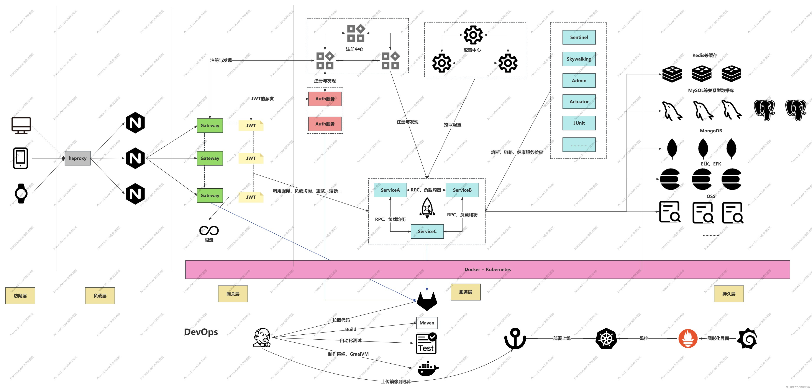

# 微服务架构及常见微服务技术栈

## 一、微服务架构介绍

微服务、微服务架构、微服务技术栈。

**微服务：** 就是将一个单体服务拆分出来的某一个服务，咱们成为微服务。

**微服务技术栈：** 微服务技术栈不单单指SpringCloud，还有很多，比如你常见的Redis也是，MQ也在这个范畴，甚至云原生也是微服务技术栈中一部分。

**微服务架构：** 他是一个思想，将一个应用基于 **业务** 分解成一些列的小型，自治的服务的架构思想。

- **独立的微服务：** 可以单独运行，更新和扩展，和其他的服务之间做到解耦，并且服务之间 **最好** 有自己独立的数据库，每个微服务要做到可以弹性伸缩。

- **单一职责、高内聚：** 每个服务 **最好** 都是基于特定的业务功能去构建的。

- **云原生：** 将微服务运行在多台机器的Pod容器里，并且还要提供各种监控操作。

## 二、微服务架构的优势与挑战

### 2.1 优势

- **灵活性：** 每个服务可以使用不用的语言去构建。整个产品是可以做到异构的。（Java，Python，Golang）

- **可扩展：** 大流量的服务可以单独扩容，不影响其他服务的。

- **独立部署：** 更新一个微服务，不需要重启整个系统，对于敏捷式开发的支持效果更好。

- **团队自治：** 小团队服务特定的业务线，团队之间干扰会特别少，对于敏捷式开发的支持效果更好。

- **容错性：** 不会因为某个服务的宕机导致整个系统不可用。

- …………

### 2.2 挑战

- **分布式复杂性：** 服务之间的通讯、网络延迟、数据一致性问题。（锁、事务、ID、调度……）

- **运维难度：** 部署、监控、日志分散，需要强大的支持。

- **性能问题：** 服务之间的调用是存在网络IO成本的，这个没法规避，So，需要各种方式来优化程序。

- **人、钱成本：** 架构设计会导致基础人力成本、服务器的成本、运维监控成本的提高。

## 三、微服务架构常见组件

服务的注册与发现：

- 组件：Nacos、Eureka、Consul、Zookeeper……

- 解决的问题：服务之间调度的地址问题还有服务上下线监控相关…………

负载均衡（客户端负载均衡）：

- 组件：Ribbon、LoadBalancer……

- 解决的问题：基于服务名拉取到多个服务地址信息后，在里面选一个~

配置中心：

- 组件：Nacos、Config、Apollo……

- 解决的问题：统一管理各个服务组件的配置信息、还有配置动态刷新的效果……

熔断降级：

- 组件：Hystrix、Sentinel……

- 解决的问题：解决服务雪崩，给接口提供快速失败（限流、异常、超时、熔断）的手段，返回托底数据……

API网关：

- 组件：~~Zuul~~、Gateway……

- 解决的问题：后端服务的入口，可以在这统一的做一些，限流、鉴权等操作……

负载网关：

- 组件：Nginx、Kong、Tengine……

- 解决的问题：客户端请求的入口，在第一步抗住客户端的大流量，负载到各个API网关服务……

消息队列：

- 工具：RabbitMQ、RocketMQ、Kafka、Stream……

- 解决的问题：解耦、异步、削峰、大数据传输……

链路追踪：

- 工具：Sleuth + Zipkin、Skywalking

- 解决的问题：快速定位问题，更舒服的方式查看整个调用链路……

容器化：

- 工具：Docker、Containerd、Kubernetes、GraalVM……

- 解决的问题：快速部署、弹性伸缩…………

监控、日志：

- 工具：Prometheus + Grafana、ELK、EFK

- 解决的问题：监控各个容器和硬件资源，收集日志，方便错误排查……

CI、CD：

- 工具：Jenkins、KuberSphere……

- 解决的问题：自动化测试、自动化部署

存储………………

## 四、微服务架构图

