# 微服务核心组件Nacos源码分析

## 一、NacosClient服务注册

### 1.1 搭建基本的SpringCloud

> 自己构建好一个SpringCloudAlibaba的工程，咱们主要查看两个版本的底层源码实现
>
> 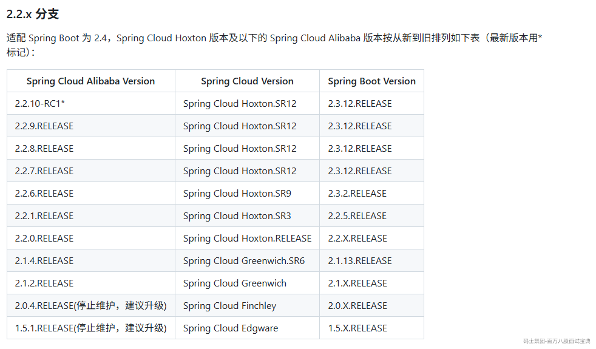
>
> 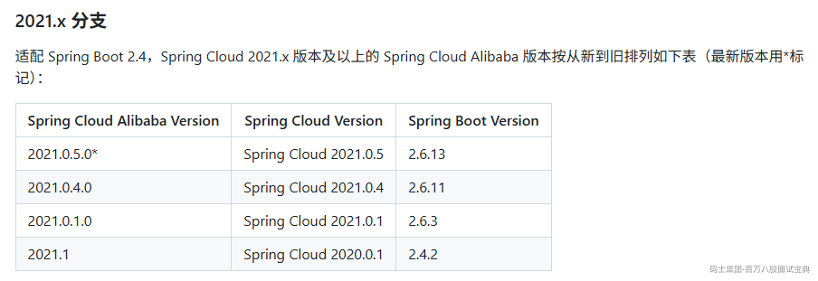
>
> 优先分析2.2.x的版本，对应的各个版本信息

```xml
<parent>
    <groupId>org.springframework.boot</groupId>
```

```plain
<artifactId>spring-boot-starter-parent</artifactId>
```

```plain
<version>2.3.12.RELEASE</version>
```

```plain
<relativePath />
```

> Hoxton.SR12

```plain
    <spring.cloud.alibaba-version>2.2.6.RELEASE</spring.cloud.alibaba-version>
```

```plain
</properties>
```

```plain
<dependencyManagement>
    <dependencies>
        <dependency>
            <groupId>org.springframework.cloud</groupId>
```

```plain
            <artifactId>spring-cloud-dependencies</artifactId>
```

```plain
            <version>${spring.cloud-version}</version>
```

```plain
            <type>pom</type>
```

```plain
            <scope>import</scope>
```

```plain
        </dependency>
```

```plain
        <dependency>
            <groupId>com.alibaba.cloud</groupId>
```

```plain
            <artifactId>spring-cloud-alibaba-dependencies</artifactId>
```

```plain
            <version>${spring.cloud.alibaba-version}</version>
```

```plain
            <type>pom</type>
```

```plain
            <scope>import</scope>
```

```plain
        </dependency>
```

```plain
    </dependencies>
```

```plain
</dependencyManagement>
```

```plain

```

### 1.2 注册操作的触发

> 因为咱们的工程是SpringBoot，他存在自动装配的操作，注册操作的触发必然是基于某个AutoConfiguration去构建某个对象实现的。
>
> 直接去查看nacos-discovery的依赖，他内部的META-INF下的spring.factories中有一个自动配置类，叫做：NacosServiceRegistryAutoConfiguration，在这个内部有实现注册服务的触发
>
> 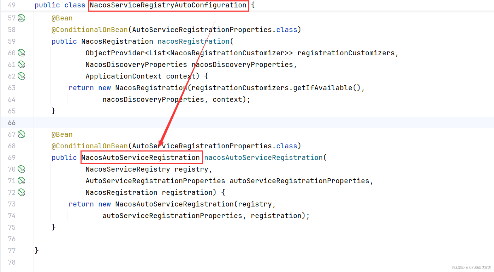点开NacosAutoServiceRegistration类后，可以发现内部存在一个有参构造，构建当前对象，必然要走这个有参构造，而在他的有参构造里，除了初始化父类内容之外，就是给一个属性赋值。So，咱们需要进一步查看他的父类里做了什么事情。
>
> 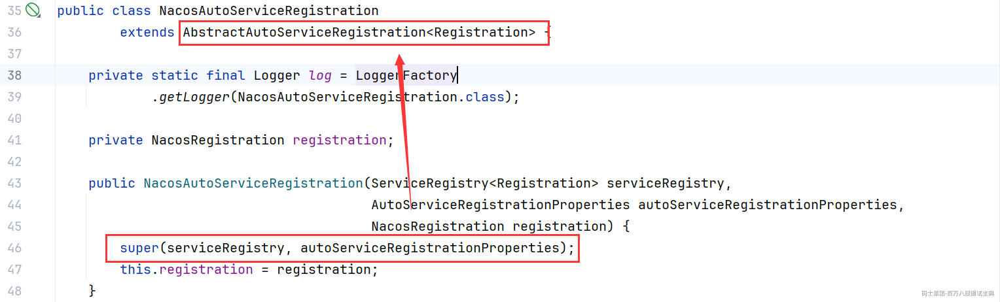
>
> 查看父类发现，父类中实现了ApplicationListener的接口，实现这个接口，就必须要重写提供的一个方法，onApplicationEvent方法。
>
> 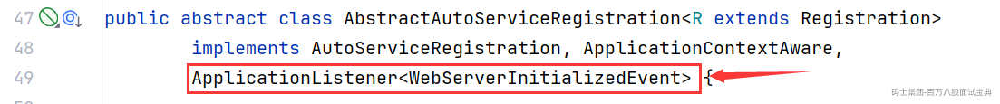
>
> 在触发onApplicationEvent方法后，后续在当前类中有一系列的调用过程
>
> 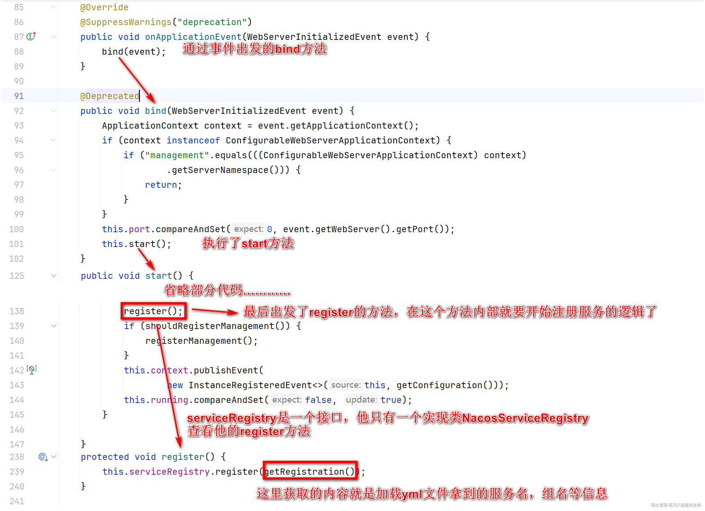

### 1.3 注册前的准备工作

> 注册前的准备其实就是将配置文件中加载的到当前服务的各种信息封装为一个Instance的实例，然后基于NacosNamingService的对象去完成注册操作

```java
// registration通过配置文件拿到的服务信息
@Override
public void register(Registration registration) {
    // 健壮性校验，确保拿到了服务的Id（服务名称spring.application.name）
    if (StringUtils.isEmpty(registration.getServiceId())) {
        log.warn("No service to register for nacos client...");
        return;
    }

    // 在获取参数，获取服务名和分组信息
    String serviceId = registration.getServiceId();
    String group = nacosDiscoveryProperties.getGroup();

    // 这里就是将registration内部的各种服务信息封装为Instance的POJO类里。
    Instance instance = getNacosInstanceFromRegistration(registration);

    // 后面完成注册需要的一个对象。
    NamingService namingService = namingService();
    try {
        // 这里就是基于NacosNamingService对象去完成注册。
        namingService.registerInstance(serviceId, group, instance);
        log.info("nacos registry, {} {} {}:{} register finished", group, serviceId,
                instance.getIp(), instance.getPort());
    }
    catch (Exception e) {
        if (nacosDiscoveryProperties.isFailFast()) {
            log.error("nacos registry, {} register failed...{},", serviceId,
                    registration.toString(), e);
            rethrowRuntimeException(e);
        }
        else {
            log.warn("Failfast is false. {} register failed...{},", serviceId,
                    registration.toString(), e);
        }
    }
}
```

### 1.4 完成注册操作

> 注册服务之前会完成额外的一个心跳相关的操作。
>
> 心跳操作搞定后，再将封装好的instance等数据作为参数，请求发送到NacosServer
>
> **/nacos/v1/ns/instance** 的这个地址上。

```java
@Override
public void registerInstance(String serviceName, String groupName, Instance instance) throws NacosException {
    // 健壮性判断，判断心跳间隔要小于心跳超时和剔除服务的时间。
    NamingUtils.checkInstanceIsLegal(instance);
    // 生成一个唯一标识   组名@@服务名
    String groupedServiceName = NamingUtils.getGroupedName(serviceName, groupName);
    // 判断服务是不是临时服务  （咱们自己写的基本都是临时服务。）
    if (instance.isEphemeral()) {
        // 完成一些心跳的操作，然后才会去注册服务
        // 封装一个BeatInfo，内存存放的是一些心跳的属性信息。
        BeatInfo beatInfo = beatReactor.buildBeatInfo(groupedServiceName, instance);
        // 准备出发定时任务，而出发的方式，是基于JUC包下提供的ScheduleThreadPoolExecutor，
                // 基于他的schedule方法，执行一个延迟的任务
                // 延迟任务是BeatTask的任务，在内部就是默认每5s发一次心跳请求，到Nacos服务的/instance/beat地址。
        beatReactor.addBeatInfo(groupedServiceName, beatInfo);
    }
    // 真正的服务的注册。
    // 这行最终基于NacosRestTemplate将请求发送到/nacos/v1/ns/instance，完成服务的注册。
    serverProxy.registerService(groupedServiceName, groupName, instance);
}
```

## 二、NacosServer服务注册

### 2.1 准备NacosServer的源码

> 直接去Github下载就可以，基于
>
> 下载完毕后，用IDEA打开，直接编译即可，现在的 **JDK版本依然保持JDK1.8** 就成。
>
> 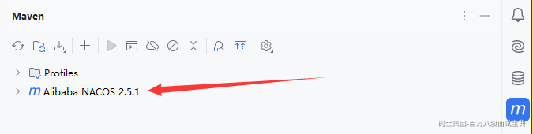
>
> 启动项目需要运行console服务，但是启动时，会报错，找不到
>
> 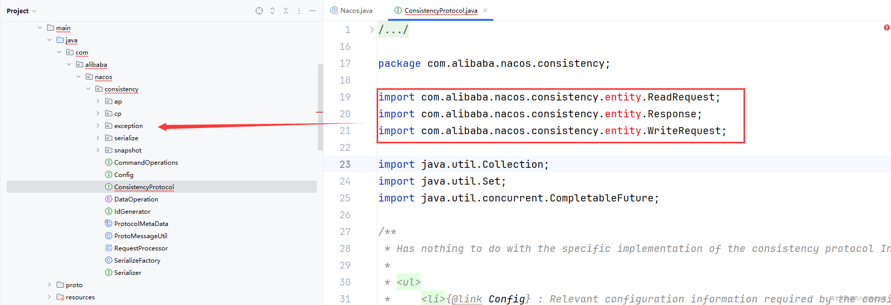
>
> 这个位置就没有entity的包，因为他需要基于proto去生成这三个entity对象，可以单独的将consistency进行一次compile编译。 **倒不如，直接将全部的工程，都compile一下。程序就可以正常跑了。。**
>
> **在全部编译时，会有一个istio服务网格的包无法导入，但是不影响启动。**
>
> 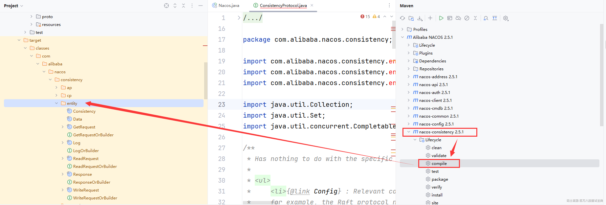
>
> 启动之前有一点，默认Nacos启动依然是集群模式，需要将其设置为单机模式启动。
>
> 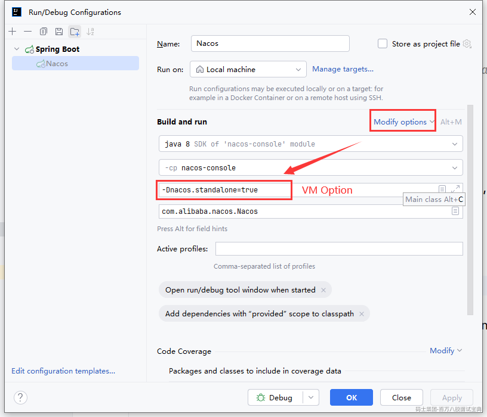

```shell
git clone -b 2.5.1  https://github.com/alibaba/nacos.git
```

### 2.2 接收请求的Controller

> 映射请求的Controller在这个位置
>
> 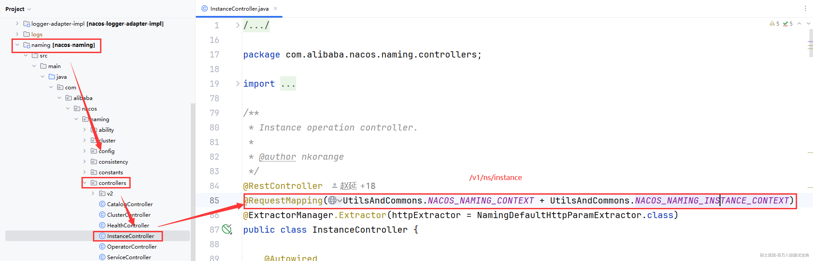
>
> 在Controller接口中完成了下述操作

```java
@CanDistro
@PostMapping
@TpsControl(pointName = "NamingInstanceRegister", name = "HttpNamingInstanceRegister")
@Secured(action = ActionTypes.WRITE)
public String register(HttpServletRequest request) throws Exception {
  
    // 获取请求参数。
    final String namespaceId = WebUtils.optional(request, CommonParams.NAMESPACE_ID,
            Constants.DEFAULT_NAMESPACE_ID);
    final String serviceName = WebUtils.required(request, CommonParams.SERVICE_NAME);
    NamingUtils.checkServiceNameFormat(serviceName);
  
    // 跟Nacos-Client里的操作一样，将服务的各种信息封装为instance实例。
    final Instance instance = HttpRequestInstanceBuilder.newBuilder()
            .setDefaultInstanceEphemeral(switchDomain.isDefaultInstanceEphemeral()).setRequest(request).build();
  
    // 注册服务，获取InstanceOperatorClientImpl对象，执行registerInstance方法。
    getInstanceOperator().registerInstance(namespaceId, serviceName, instance);
    // 下面不管。
    NotifyCenter.publishEvent(new RegisterInstanceTraceEvent(System.currentTimeMillis(),
            NamingRequestUtil.getSourceIpForHttpRequest(request), false, namespaceId,
            NamingUtils.getGroupName(serviceName), NamingUtils.getServiceName(serviceName), instance.getIp(),
            instance.getPort()));
    return "ok";
}
```

### 2.3 注册服务前的准备

> 基本的一些参数校验。将数据做一些封装，将封装的IpPortBasedClient会扔到CHM中，做缓存，后续的操作会涉及到。

```java
@Override
public void registerInstance(String namespaceId, String serviceName, Instance instance) throws NacosException {
    // 健壮性校验………………
    NamingUtils.checkInstanceIsLegal(instance);
    // 获取服务的ephemeral信息，咱们当前服务就是临时服务
    boolean ephemeral = instance.isEphemeral();
    // 将地址信息 # 临时服务的true拼接成了一个clientId的唯一标识。
    String clientId = IpPortBasedClient.getClientId(instance.toInetAddr(), ephemeral);
    // 将当前的实例的IpPortBasedClient对象信息扔到CHM中。后续的其他业务先会涉及到。
    createIpPortClientIfAbsent(clientId);
    // 基于服务的信息封装一波Service，你可以把Service也看成一个POJO类。
    Service service = getService(namespaceId, serviceName, ephemeral);
    // 这里再基于clientOperationService去完成真正的注册服务操作。
    // 采用的是EphemeralClientOperationServiceImpl的registerInstance方法
    clientOperationService.registerInstance(service, instance, clientId);
}
```

### 2.4 完成注册操作

> 注册操作的本质就是将instance对象做好封装，扔到一个叫做publishers的CHM中。

```java
@Override
public void registerInstance(Service service, Instance instance, String clientId) throws NacosException {
    // 再次校验，跟之前的校验一模一样，但是这里的注册方法也针对GRPC的方式做支持。
    NamingUtils.checkInstanceIsLegal(instance);

    // 1、利用单例方式，确保全局只有这一套CHM
    // 2、利用 private final ConcurrentHashMap<Service, Service> singletonRepository;确保服务是全局唯一的。
    // 3、利用 private final ConcurrentHashMap<String, Set<Service>> namespaceSingletonMaps;存储指定命名空间下的全部服务
    Service singleton = ServiceManager.getInstance().getSingleton(service);
    if (!singleton.isEphemeral()) {
        throw new NacosRuntimeException(NacosException.INVALID_PARAM,
                String.format("Current service %s is persistent service, can't register ephemeral instance.",
                        singleton.getGroupedServiceName()));
    }
    // 将之前存储到clientManager中的IpPortBasedClient对象取出来。
    Client client = clientManager.getClient(clientId);
    // 健壮性判断…………
    checkClientIsLegal(client, clientId);
    // 再次将instance实例封装为InstancePublishInfo的实例。
    InstancePublishInfo instanceInfo = getPublishInfo(instance);
    // 将封装好的Service以及InstancePublishInfo扔到clientManager
    // 将Service作为key，InstancePublishInfo作为value，扔到了一个叫做publishers的CHM中，到这基本就完成了注册。
    client.addServiceInstance(singleton, instanceInfo);
    // 这里再设置一下最后修改时间（最后活跃时间），再搞一个版本号，就完事了。
    client.setLastUpdatedTime();
    client.recalculateRevision();
    // 暂时不关注。。
    NotifyCenter.publishEvent(new ClientOperationEvent.ClientRegisterServiceEvent(singleton, clientId));
    NotifyCenter.publishEvent(new MetadataEvent.InstanceMetadataEvent(singleton, instanceInfo.getMetadataId(), false));
}
```

## 三、GRPC形式注册服务

> 本质没啥变化，其实就是将之前的HTTP的方式，更改为了基于GRPC的方式而已。

### 3.1 针对NacosClient

> 首先需要将本地代码的版本修改一下，因为现在看的版本没有grpc的形式。

```xml
<parent>
    <groupId>org.springframework.boot</groupId>
```

```plain
<artifactId>spring-boot-starter-parent</artifactId>
```

```plain
<version>2.6.11</version>
```

```plain
<relativePath />
```

> 2021.0.4

```plain
<spring.cloud.alibaba-version>2021.0.4.0</spring.cloud.alibaba-version>
```

> org.springframework.cloud

```plain
        <artifactId>spring-cloud-dependencies</artifactId>
```

```plain
        <version>${spring.cloud-version}</version>
```

```plain
        <type>pom</type>
```

```plain
        <scope>import</scope>
```

```plain
    </dependency>
```

```plain
    <dependency>
        <groupId>com.alibaba.cloud</groupId>
```

```plain
        <artifactId>spring-cloud-alibaba-dependencies</artifactId>
```

```plain
        <version>${spring.cloud.alibaba-version}</version>
```

```plain
        <type>pom</type>
```

```plain
        <scope>import</scope>
```

```plain
    </dependency>
```

```plain
</dependencies>
```

```plain

看注册过程的方式跟之前没区分。一直到，NacosNamingService去完成registerInstance方法时，从之前的直接发送HTTP请求，变为了基于


完成注册，clientProxy的实现类中，就包含了，GRPC的方式。

在GRPC方式中，优先是完成了一个数据的缓存，之后开始封装GRPC的request请求，在request请求里可以看到一个 **type=registerInstance** 。

还有一个小细节，就是心跳没看到，而GRPC的方式，其实是在初始化NamingGrpcClientProxy实例时，就会搞一堆的定时任务。包括心跳在内。
```

### 3.2 针对NacosServer

> 是在哪个位置接收到的GRPC请求。至于其他的，依然没有变化，完成注册的最终操作，还是将服务信息扔到一个叫publishers的CHM中。
>
> 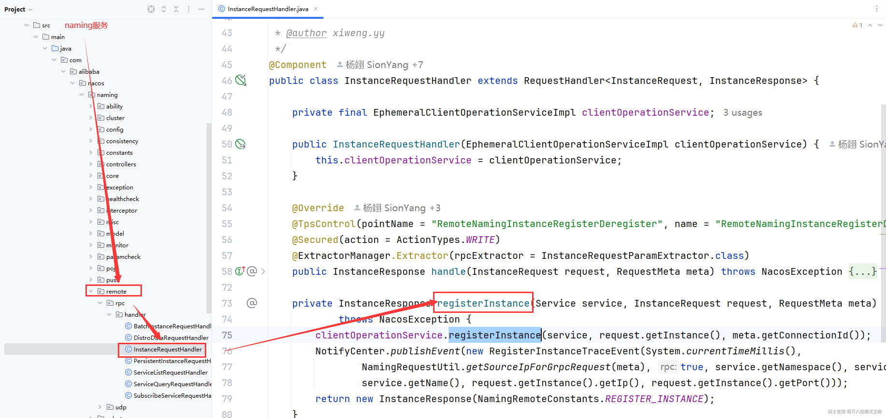
