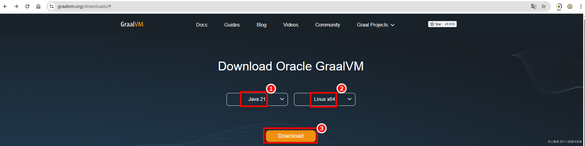
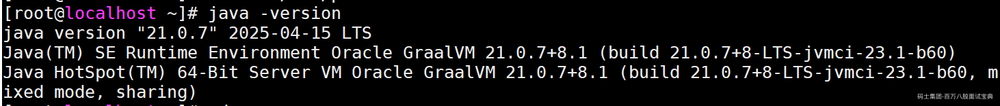
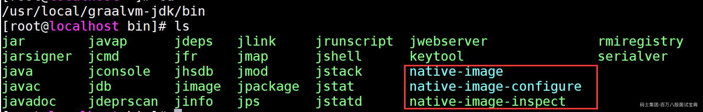
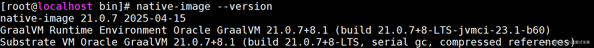
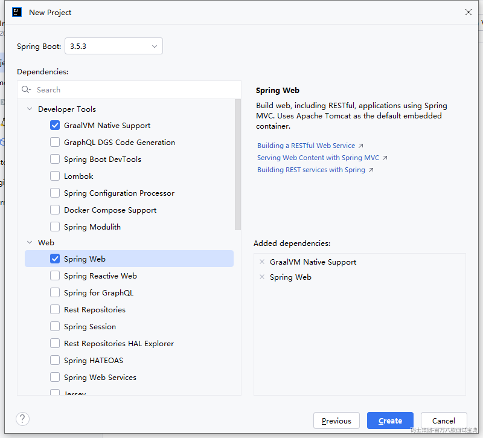
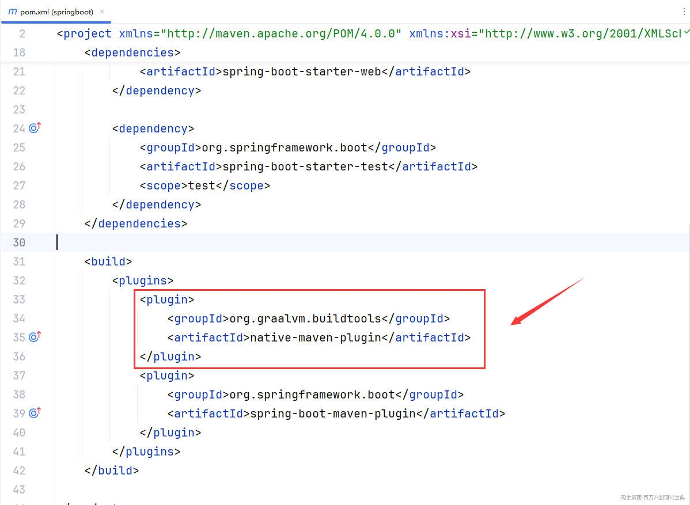
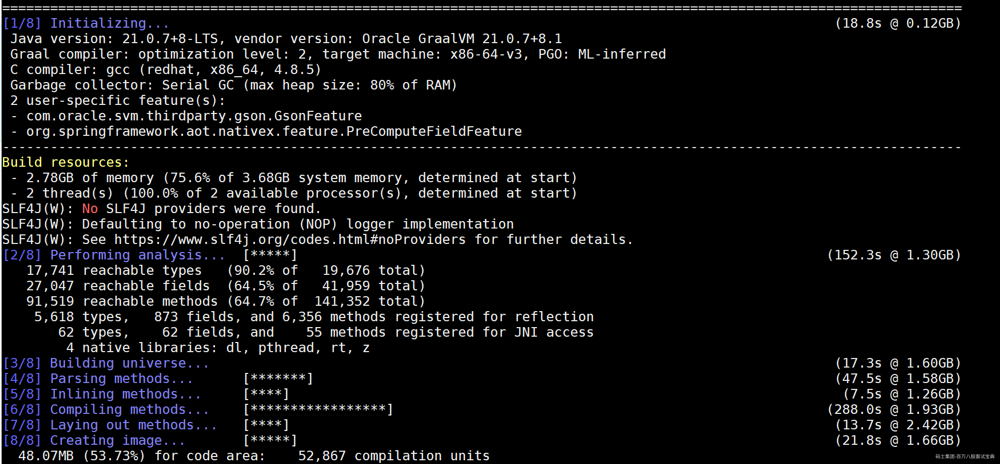
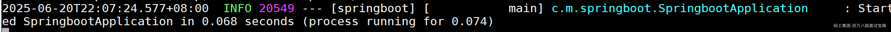

# 微服务架构必备-GraalVM

## 一、微服务架构&云原生

### 1.1 微服务架构和云原生的关系

> 上节课咱们有聊到微服务架构中的一些技术点，有提到容器化跟自动化的一些内容，其实这里咱们是拆开聊的，如果算成一个整体，可以称为是云原生生态的一部分。
>
> 如果站在微服务的角度来说，云原生就是给我的微服务提供了一套更舒服，或者说更合理的部署方式。
>
> 最开始在没有云原生的时候，微服务项目的部署成本贼高，拆分成多个服务后，每个服务都要单独的部署，而且服务宕机后要重启，集群需要扩展等等等…………
>
> 同时服务之间的资源隔离，环境之类的问题，这些都需要人去把控，成本很高，费人。而云原生出现后，让微服务的部署成本大大的降低，甚至跟部署单体项目差不多。

### 1.2 云原生的定义

聊云原生定义前，咱们要先知道一个团伙。CNCF组织。*云原生*计算基金会，是Google牵头搞的一个组织，目的就是把一堆云原生的开源生态搞起来。核心思想就是 **让云原生无处不在**

CNCF提供一套原生的生态参考体系。

在CNCF中，给云原生下了一个定义。

<https://github.com/cncf/toc/blob/main/DEFINITION.md#%E4%B8%AD%E6%96%87%E7%89%88%E6%9C%AC>

> 云原生技术有利于各组织在公有云、私有云和混合云等新型动态环境中，构建和运行可弹性扩展的应用。云原生的代表技术包括 **容器** 、服务网格、微服务、不可变基础设施和声明式API 。
>
> 这些技术能够构建 **容错性好** 、 **易于管理和便于观察** 的 **松耦合** 系统。结合可靠的 **自动化** 手段，云原生技术使工程师能够轻松地对系统作出频繁和可预测的重大变更。
>
> 云原生计算基金会（CNCF）致力于培育和维护一个厂商中立的开源生态系统，来推广云原生技术。我们通过将最前沿的模式民主化，让这些创新为大众所用。

云原生：包含了一组应用的技术栈，用于帮助企业快速，持续，可靠地去交付软件。云原生核心是 **微服务架构、DevOps、容器** 为核心。

### 1.3 容器化技术

Docker！

Docker到现在应当是作为常识性的知识，你会，是应该的，不会不成。

Docker解决的问题：

- 环境问题，Docker可以将一整套环境、程序、中间件之类的打包成一个可移动的镜像。

- 隔离问题，Docker启动的每一个容器，都是独立的，互不影响。

- …………

**Ps：Docker因为一些政策原因，现在国内不能拉取镜像，不过上有政策，下有对策，暂时能用…………**

### 1.4 容器化的编排技术

**Kubernetes！K8s！**

Kubernetes可以理解为就是帮助咱们管理容器的技术……

**弹性伸缩：** 比如某个程序的容器资源使用率达到了阈值，可以是CPU，内存，其他的自定义度量标准，Kubernetes就可以自动的扩一个容器。

**健康监控：** 如果监控每个容器宕机后，Kubernetes可以自动的在其他健康的节点上再跑一个容器。

…………

**Ps：现在来，整个Java对于云原生的支持看似都不错，但是现在存在几个问题。**

- **Java程序启动速度相对都比较慢，弹性伸缩和健康监控时，需要一定时间成本才能跑起来……**

- **Java程序对于内存的占用是比较大的。**

## 二、GraalVM

### 2.1 GraalVM是个啥？

开源的：<https://github.com/oracle/graal>

GraalVM是Oracle主推的新一代的JVM，而且很多框架都是支持GraalVM，包括Spring Boot3.5.x（LTS版本）。

其次，咱们现在玩的JVM，基本都是Oracle官方的hotspot虚拟机。

其实除了Oracle的hotspot之外，其他很多公司在部署到生产环境时，会用到一些OpenJDK，比如IBM的，阿里的[*Dragonwell*](http://www.baidu.com/link?url=vJh2SM1ZmT3q1DeCPKnpj8oPhozPqt7NZFOXYkjf5tJfa39MtX9Ouk_GYAUGba9O5mD16Tv5W8FADFbSHN4E9q)，华为[*毕*昇](http://www.baidu.com/link?url=gxuNZY6F7Ngfp7HRi4NCo876cxQQpr4GJu5Y_5t4T8RM_PlqRoVSzLAEeGhAzgAXtfBhJFwbIQeL9wo13m6vof6ET_NuJw-fc7nfDhQMnrlURKhgIUdJG7V3dyf-Vc7LexF5PXUyHj3yr0DqvFaOs-QAKVRC5qp0jni-nMNH94J9xrlfkOua9nMMg9zERPKEaGFoWTpX3n-o5ZVMo5CLbpp1vF2ez7-7ea616MRDOSpIhv6CcXOwHwpbnWf1NNRnpqnxQJP2Q3hEXjleimI7Aa)………………

很多公司在开发的时候，用的是hotspot虚拟机，在部署到线上的时候，再换成这些OpenJDK。

这么做为了解决一些问题：

- 关于JDK到Oracle后，开源协议存在一些细微的变化，一些大型企业长期时候可能存在法律问题……

- 比如垃圾回收器的问题，如果用JDK8部署，最多就搞到G1，比如其他的ZGC等等……

而GraalVM不仅仅是一个OpenJDK，但他包含了OpenJDK解决的问题（不包括开源问题）。同时还有两手操作

- JIT：GraalVM针对JIT的这种即时编译做的更极致，性能会有更大的提升。

- **AOT（Ahead of Time）：提前编译，会将你的Java程序提前编译成一个可执行文件，启动速度提升近百倍，内存占用少很多。**

其实到这，GraalVM做的事情，基本已经可以解决云原生不太适配的问题，但是GraalVM可不仅仅要做这点事，他想做到 **天下大同** ，让其他的所有语言的程序，都可以在GraalVM上跑！

除了一些Java的嫡系，比如Scala之外，甚至Python，JavaScript，NodeJS，Ruby等等都可以在GraalVM上去运行。。。。。

GraalVM官网：<https://www.graalvm.org/>

### 2.2 安装GraalVM（安装个JDK）

直接在官网的位置下载即可，官网首页就有一个Download



下载Linux的GraalVM。

准备Linux环境，将下载好的GraalVM扔到Linux环境中，之前怎么配置JDK，现在就怎么配置GraalVM。

操作步骤

- 将拖拽进去的压缩包，进行解压，（我的个人习惯，扔/usr/local下）

```plain
tar -zxvf graalvm-jdk-21_linux-x64_bin.tar.gz -C /usr/local
```

- 直接配置好GraalVM的环境变量

```plain
# 修改文件
vi /etc/profile
# 在最下面追加
export JAVA_HOME=/usr/local/graalvm-jdk
export PATH=$JAVA_HOME/bin:$PATH
# 重新加载
source /etc/profile
# 执行java -version
```



- 现在安装的JDK21的GraalVM中在bin目录下已经自带了native-image相关的内容，不需要额外安装



**Ps：其次，咱们玩GraalVM进行AOT时，需要依赖Maven环境，也需要在Linux中安装Maven，版本至少是3.6.3以上。**

### 2.3 AOT

> 这里需要一个JDK21的SpringBoot工程，并且SpringBoot版本选择3.5.x。
>
> 创建SpringBoot工程
>
> 
>
> 选择需要的依赖和版本相关的内容
>
> 
>
> 创建完毕后，查看一下pom.xml文件，里面有支持GraalVM的plugin
>
> 

```xml
<build>
    <plugins>
        <plugin>
            <groupId>org.graalvm.buildtools</groupId>
```

```plain
        <artifactId>native-maven-plugin</artifactId>
```

```plain
    </plugin>
```

```plain
    <plugin>
        <groupId>org.springframework.boot</groupId>
```

```plain
        <artifactId>spring-boot-maven-plugin</artifactId>
```

```plain
    </plugin>
```

```plain
</plugins>
```

```plain

**Ps：可能很多同学的IDEA版本比较低，不支持JDK21，不过没关系，只要自己构建好一个SpringBoot工程，将SpringBoot版本，Java版本，GraalVM插件在pom.xml文件中指定好即可。**

本地运行一波，测试没问题，大概占用了2.5s启动


（152M左右）

打包的jar包文件大小


（20M左右）
```

---

将Java程序模拟CI、CD的过程，扔到Linux里面利用GraalVM提前编译测试效果。

- 将程序拖拽到Linux环境中

- 在项目利用GraalVM编译前，先安装一下环境，GraalVM编译需要C的环境

```plain
yum -y install gcc glibc-devel zlib-devel
# 如果安装上述内容，会报错，returned non-zero result的错误信息。
```

- 在项目目录下，执行一个命令，利用GraalVM提前编译

```plain
mvn -Pnative native:compile
# 过程很长，具体的根据电脑的情况，如果想快一些，就给Linux分配的资源多一点。
```

- AOT的时间很长

- 编译成功后，可以在项目目录的target目录下，找到编译后的可执行文件，直接执行即可

- 查看一下他的各个资源占用情况启动时间：0.068s占用内存64M可执行文件占用的资源多，84M。

### 2.4 GraalVM的缺点

- GraalVM现在并没有大批量的使用，因为并不是所有的框架都可以适配GraalVM。因为很多Java框架的底层都是基于反射去玩的，而GraalVM的JIT优化，基本让反射失效了，所以需要各个组件，框架提前适配好关于反射的问题。

- \*\*在编译时期，他占用的资源是非常夸张的，而且编译的时间也非常的长。\*\*但是无伤大雅，AOT之后，项目启动就，对于性能有大大的提升，而且资源占用也会更小，这样就可以更加适配云原生能了。

- GraalVM暂时只有高版本这么玩，虽然JDK9也能碰，但是基本上推荐到了JDK21再上…………

- GraalVM的生态暂时不太完整。。
