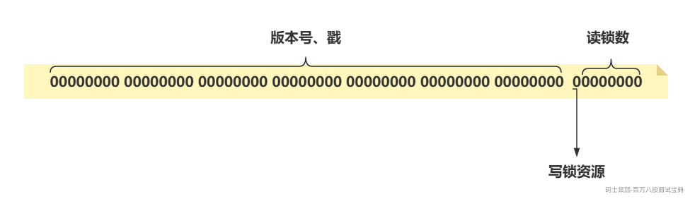
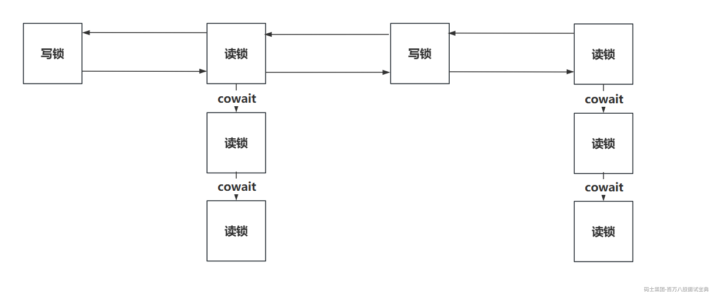

# StampedLock读写锁

## 一、互斥锁、读写锁（扫盲）

> 在项目里面，经常会涉及到锁操作。
>
> 而锁的分类方向很多，听过我课的同学都知道，比如：
>
> - 乐观锁、悲观锁。
>
> - 可重入锁，不可重入锁。
>
> - 公平锁，非公平锁。
>
> - JVM锁，分布式锁。
>
> - **互斥锁，读写锁。**
>
> 互斥锁其实就是咱们最最常见的内哥俩，synchronized，ReentrantLock。
>
> 如果业务中每次都涉及到写操作，那用互斥锁完全没问题。但是有一些业务他可能仅仅是做一些读的操作，这种互斥锁会严重影响到查询的效率。
>
> So，咱们在这种业务情况下，需要使用到读写锁了。最常用的也就是ReentrantReadWriteLock这种读写锁。如果同学们没涉及多，可以看一下这个课程：
>
> [https://www.mashibing.com/study?courseNo=2726§ionNo=110969&systemId=1&courseVersionId=3632&versionsId=215](https://www.mashibing.com/study?courseNo=2726&sectionNo=110969&systemId=1&courseVersionId=3632&versionsId=215)
>
> ReentrantReadWriteLock问题：
>
> - 每次即便是读操作，也需要基于CAS去修改state属性，从而获取读锁资源后，才能去执行具体的业务操作。
>
> - 写锁线程饥饿问题，如果AQS的同步队列中，在head.next的位置是等待写锁的线程，那么尝试获取读锁的线程就需要排队等待，等待写线程获取写锁操作完毕后，才能继续走读锁的流程。
>
> **So，JDK1.8中就出现了StampedLock（邮戳锁，戳锁，版本锁……）**

## 二、StampedLock、ReentrantReadWriteLock

> StampedLock也是读写锁。
>
> **底层实现区别：**
>
> - ReentrantReadWriteLock
>
> - 基于AQS实现的一种相对标准的读写锁。
>
> - 支持公平锁，非公平锁。
>
> - 支持锁重入操作的。
>
> - 支持Condition，可以实现await，signal之类的操作。
>
> - StampedLock
>
> - 引入了一个所谓的戳的概念，每次获取锁资源后，都会返回这个戳，释放锁资源需要基于这个戳。本质就是一个long类型的数值。
>
> - 没有所谓的公平，与公平锁的概念。
>
> - 不允许锁重入的。
>
> - 不支持Condition的操作。
>
> **锁的类型区别：**
>
> - ReentrantReadWriteLock：
>
> - 读写锁，读锁之间不互斥，只要涉及到写操作，必然会互斥。拿不到锁资源那就直接在AQS的同步队列挂起等待。（持有写锁可以锁降低到读锁）
>
> - StampedLock：
>
> - 读写锁，分成了三种， **传统的读锁跟写锁，还有一个乐观读锁。** 传统的读锁跟写锁与ReentrantReadWriteLock中没有太大的区别，但是乐观读锁不去真正的获取锁，而是直接操作，然后在去验证是否安全。
>
> **性能的区别：**
>
> - ReentrantReadWriteLock：
>
> - 性能中规中矩，适合在 读多写少 的业务中。
>
> - 如果写操作比较多的时候，性能会受到比较大的影响。
>
> - 但是即便写操作少，也会因为写锁饥饿，跟每次CAS都会影响性能。
>
> - StampedLock：
>
> - 性能相对来说，比ReentrantReadWriteLock好很多。
>
> - 他提供的乐观读锁，在尝试获取锁和验证锁的时候，连CAS操作都不需要，性能非常的快。
>
> - 如果是写操作比较多，这哥们也不成，记住，只要是读写锁，就必然要在读多写少的场景下使用。
>
> **使用的难度：**
>
> - ReentrantReadWriteLock：
>
> - 简单的丫批，标准的读写锁的API。
>
> - StampedLock：
>
> - 相对来说复杂，但是也挺简单。只是额外的需要你去维护戳。

## 三、基本API

### 3.1 ReentrantReadWriteLock API

> 操作没啥聊的，就是基于ReentrantReadWriteLock单独的拿到读锁或者写锁，需要操作，就直接lock即可，拿到锁资源才会执行业务逻辑。

```java
package com.mashibing.test;

import java.util.concurrent.locks.Lock;
import java.util.concurrent.locks.ReentrantReadWriteLock;

/**
 * 回顾一下ReentrantReadWriteLock的API
 */
public class Demo01 {

    static ReentrantReadWriteLock readWriteLock = new ReentrantReadWriteLock();
    static Lock readLock = readWriteLock.readLock();
    static Lock writeLock = readWriteLock.writeLock();

    public static void main(String[] args) throws InterruptedException {
        new Thread(() -> {
            readLock.lock();
            try{
                System.out.println("readWriteLock，拿到读锁资源，走业务！");
                Thread.sleep(2000);
            } catch (InterruptedException e) {
                throw new RuntimeException(e);
            } finally {
                readLock.unlock();
            }
        }).start();

        Thread.sleep(10);
        writeLock.lock();
        try{
            System.out.println("readWriteLock，拿到写锁资源，走业务！");
        }finally {
            writeLock.unlock();
        }
    }
}

```

### 3.2 StampedLock基本使用

#### 3.2.1 StampedLock-传统的读写锁 API

> 传统的读写锁的API套路，其实跟ReentrantReadWriteLock大差不差。
>
> 只是之前的ReentrantReadWriteLock默认基于当前线程去控制释放操作。
>
> 而现在的StampedLock要基于获取锁资源之后返回的stamped去控制释放锁的操作。
>
> 通过测试，可以发现，StampedLock是不可重入的。

```java
package com.mashibing.test;

import java.util.concurrent.locks.StampedLock;

/**
 * StampedLock的传统读写锁操作。
 */
public class Demo02 {

    static StampedLock stampedLock = new StampedLock();

    public static void main(String[] args) throws InterruptedException {
        new Thread(() -> {
            // 获取写锁资源
            long writeStamped = stampedLock.writeLock();
            try{
                System.out.println("StampedLock，获取到写锁资源，执行业务逻辑！writeStamped：" + writeStamped);
                Thread.sleep(2000);
            } catch (InterruptedException e) {
                throw new RuntimeException(e);
            } finally {
                stampedLock.unlockWrite(writeStamped);
            }
        }).start();

        Thread.sleep(10);
        // 获取读锁资源
        long readStamped = stampedLock.readLock();
        try{
            System.out.println("StampedLock，获取到读锁资源，执行业务逻辑！readStamped：" + readStamped);
        }finally {
            stampedLock.unlockRead(readStamped);
        }

    }

}

```

#### 3.2.2 StampedLock-乐观读锁基本使用

> 乐观读锁在获取的时候，不关注有没有什么并发情况，而且操作仅仅是获取内存变量做基本的&运算，所以获取乐观读锁的速度非常快。
>
> 可以在回去到乐观读锁后，直接拿到临界资源，存在到局部。
>
> 验证操作临界资源时，是否存在写操作的并发：
>
> - 存在，需要做额外的一些补偿措施。
>
> - 不存在，继续往下走逻辑代码即可。
>
> **乐观读锁不需要释放任何资源，只需要validate即可。**

```java
package com.mashibing.test;

import java.util.concurrent.locks.StampedLock;

/**
 * StampedLock的乐观读锁
 */
public class Demo03 {

    static StampedLock stampedLock = new StampedLock();

    static volatile int xxx = 0;

    public static void main(String[] args) {
        //1、获取乐观读锁，拿到返回的乐观读锁的戳
        // 这个方法非常快，通常就是一个读取数据，以及二进制的基本运算，没有任何CAS之类的原子性操作。
        //      也不会因为有写锁被持有，导致拿不到。
        // 返回的戳，他是代表一个状态，或者是一个版本，你可以在持有乐观读锁后直接操作，但是操作完要利用这个戳做验证
        //      如果有并发，你的操作要回滚，补偿，要么就是重新尝试。
        long optimisticReadStamped = stampedLock.tryOptimisticRead();

        //2、 将临界资源，共享变量存储为一个局部变量，以便后面操作使用。
        int x = xxx;

        //3、 验证一下，存储临界资源时，是否发生了并发的写操作。
        //    返回false，代表在前面2、操作时，有其他线程持有了写锁资源，存在并发问题，引用的临时变量x，不可用。
        //    返回true，代表在前面2、操作时，没有写操作发生，安全的丫批，可以用临时变量x去走具体的逻辑。
        if (!stampedLock.validate(optimisticReadStamped)) {
            // 到这，代表有并发。调整变量x。
            System.out.println("有并发！");
        }

        //4、业务代码，代表x必然是可用的了。
        System.out.println("乐观读锁，获取到临界资源xxx = " + x);

    }

}

```

#### 3.2.3 StampedLock-乐观读锁校验失败

> 如果在持有乐观读锁操作后，发现有并发，导致validate没通过。咱们有两个方案
>
> - 无锁套路：既然有并发，再次获取新的乐观读锁，再次去操作临界资源，直到validate通过。
>
> - 锁升级套路：既然有并发，咱就直接锁升级，从乐观读锁升级传统的读锁。

**无锁套路：**

```java
package com.mashibing.test;

import java.util.concurrent.locks.StampedLock;

/**
 * 乐观读锁校验失败 -- 再次乐观操作！！
 */
public class Demo04 {

    static StampedLock stampedLock = new StampedLock();

    static volatile int xxx = 0;

    public static void main(String[] args) {
        //1、获取乐观读锁，拿到返回的乐观读锁的戳
        long optimisticReadStamped = stampedLock.tryOptimisticRead();

        //2、 将临界资源，共享变量存储为一个局部变量，以便后面操作使用。
        int x = xxx;
  
        //3、 验证一下，存储临界资源时，是否发生了并发的写操作。
        // 问题：如果写操作时间太长，这里明显类似CAS的自旋效果，浪费CPU资源。。。
        while (!stampedLock.validate(optimisticReadStamped)) {
            // 到这，代表有并发。重新尝试获取乐观读锁，再次操作临界资源，再次判断
            Thread.yield();
            // 重新获取乐观锁资源
            optimisticReadStamped = stampedLock.tryOptimisticRead();
            // 再次将临界资源做局部存储
            x = xxx;
        }

        //4、业务代码，代表x必然是可用的了。
        System.out.println("乐观读锁，获取到临界资源xxx = " + x);

    }
}
```

**锁升级套路：**

```java
package com.mashibing.test;

import java.util.concurrent.locks.StampedLock;

/**
 * 乐观读锁校验失败 -- 锁升级套路
 */
public class Demo05 {

    static StampedLock stampedLock = new StampedLock();

    static volatile int xxx = 0;

    public static void main(String[] args) {
        //1、获取乐观读锁，拿到返回的乐观读锁的戳
        long optimisticReadStamped = stampedLock.tryOptimisticRead();

        //2、 将临界资源，共享变量存储为一个局部变量，以便后面操作使用。
        int x = xxx;

        //3、 验证一下，存储临界资源时，是否发生了并发的写操作。
        // 问题：如果写操作时间太长，这里明显类似CAS的自旋效果，浪费CPU资源。。。
        if (!stampedLock.validate(optimisticReadStamped)) {
            // 到这，代表有并发。直接采用传统的读锁，阻塞等待读锁资源。
            // 获取传统读锁
            long readStamped = stampedLock.readLock();
            try {
                // 将临界资源，共享变量存储为一个局部变量
                x = xxx;
            } finally {
                stampedLock.unlockRead(readStamped);
            }
        }

        //4、业务代码，代表x必然是可用的了。
        System.out.println("乐观读锁，获取到临界资源xxx = " + x);

    }
}

```

## 四、StampedLock源码分析

### 4.1 核心属性

> 这里的核心属性比较多，咱们先分成两块去看。

#### 4.1.1 自旋次数变量（暂时了解）

```java
// 就是你的CPU核心数，比如你是6核12线程的CPU，他就返回12.
// 其实，多少核无所谓，主要是区别单核跟多核。
private static final int NCPU = Runtime.getRuntime().availableProcessors();

// 在进入到队列排队前，最多会重试多少次，单核-0次，多核-64次
private static final int SPINS = (NCPU > 1) ? 1 << 6 : 0;

// 在进入到队列已经排到head时“第一名”，走的次数是 单核-0次，多核-1024次
private static final int HEAD_SPINS = (NCPU > 1) ? 1 << 10 : 0;

// 在队列作为“第一名”时，多次失败，自旋的次数  单核-0次，多核-65536
private static final int MAX_HEAD_SPINS = (NCPU > 1) ? 1 << 16 : 0;

// 技术的操作，如果超出的了阈值，跟OVERFLOW_YIELD_RATE变量有关系。
private static final int OVERFLOW_YIELD_RATE = 7; // must be power 2 - 1
```

#### 4.1.2 state参数变量

> 在StampedLock中，获取锁资源的核心属性依然是基于state变量去判断的，这次是一个long类型的变量

```java
private transient volatile long state;
```

> 在StampedLock前面的核心属性的第二部分，都是针对state要使用的各种属性。
>
> 在传统的ReentrantReadWriteLock中，他int state中，高16位作为读锁资源，低16位作为写锁资源。
>
> 而StampedLock中的long state被分成了三部分
>
> - 读锁个数，低7位。
>
> - 写锁资源，第8位。
>
> - 版本号、戳，剩下的56位。
>
> 
>
> **Ps：读锁就7位，不够用咋办，三步之内，必有解药。如果超过了内7位，会在这个int类型的变量中去存储超过的读锁个数。**
>
> 这里是为了方便计算得出各种位信息的核心属性

```java
/** extra reader count when state read count saturated */
private transient int readerOverflow;
```

```java
// 这个7，就代表读锁个数的内个7位，后面的运行部分位置会用到这个变量。
private static final int LG_READERS = 7;
// 每次获取一个读锁后， + 1L，也就是加RUNIT。 释放就 - 1L
private static final long RUNIT = 1L;
// WriteBit，就是写锁的Bit位，也就是第8位。  10000000
private static final long WBIT  = 1L << LG_READERS;
// 做运算用的，可以利用他跟state做&运算，得出现在state中可以看到的读锁的持有个数 01111111
private static final long RBITS = WBIT - 1L;
// 这里是代表state可以存储的读锁持有个数的最大值，是126，至于127你认为可以是做一个标记，到127就溢出了。
private static final long RFULL = RBITS - 1L;
// 用于标识写锁资源位，以及读锁的计数。  11111111
private static final long ABITS = RBITS | WBIT;
// 这里是RBITS取反，而RITS取反后是   111……10000000。 跟state&运算可以拿到版本号以及写锁位的内容
private static final long SBITS = ~RBITS; 
// ORIGIN是state的默认值，查看计算方式，1 00000000，默认版本是1，这个1是第9位
private static final long ORIGIN = WBIT << 1;
```

### 4.2 核心数据结构

> 之前玩的读写锁用的依然是AQS去实现的，利用了AQS内部提供的一些队列操作。
>
> 而StampedLock内部没有使用AQS去实现，但是他也需要做排队的。
>
> 排队的时候就依然会基于StampedLock内部提供的一个WNode去实现。
>
> 本质也是一个CLH队列，内部依然是基于CAS实现的队列的插入之类的操作。
>
> WNode跟AQS里的同步队列，几乎没啥太大区别，唯一的是，多个等待读锁资源的线程，会基于cowait的属性关联在一起
>
> 

```java
// 代表WNode的两个状态，一个是线程挂起了，一个是取消了。
private static final int WAITING   = -1;
private static final int CANCELLED =  1;

// 代表当前WNode是要等待写锁还是读锁资源。
private static final int RMODE = 0;
private static final int WMODE = 1;

/** 内部类 */
static final class WNode {
    // 上一个跟下一个的指针。
    volatile WNode prev;
    volatile WNode next;
    // 连接着等待读锁资源的一个链表结构，多个等待读锁资源的WNode基于这个属性连接在一起，方便一起唤醒
    volatile WNode cowait;    // list of linked readers
    // 每个WNode都是一个等待资源的线程
    volatile Thread thread;   // non-null while possibly parked
    volatile int status;      // 0, WAITING, or CANCELLED
    final int mode;           // RMODE or WMODE
    //  new WNode(读/写，tail)
    WNode(int m, WNode p) { mode = m; prev = p; }
}

// 整个同步队列的头和尾。
private transient volatile WNode whead;
private transient volatile WNode wtail;
```

### 4.3 View视图

> 这里的视图，不是MySQL中的那种视图，不过功能方向大差不差。
>
> 因为之前的ReentrantReadWriteLock是JDK1.5版本推出的，现在的StampedLock是JDK1.8推出的，StampedLock的性能是要高于ReentrantReadWriteLock。
>
> 为了让之前的代码做迭代时，修改的API不会太多，可以直接利用视图来解决这个问题。
>
> 但是，如果你之前读写锁使用到了Condition，那在StampedLock中是无法使用的。
>
> 其次，如果只是更换API，没法使用乐观读锁。
>
> So，想完整发挥StampedLock的性能，还有一定重构的成本的。

```java
final class ReadLockView implements Lock {
    public void lock() { readLock(); }
    public void lockInterruptibly() throws InterruptedException {
        readLockInterruptibly();
    }
    public boolean tryLock() { return tryReadLock() != 0L; }
    public boolean tryLock(long time, TimeUnit unit)
        throws InterruptedException {
        return tryReadLock(time, unit) != 0L;
    }
    public void unlock() { unstampedUnlockRead(); }
    public Condition newCondition() {
        throw new UnsupportedOperationException();
    }
}

final class WriteLockView implements Lock {
    public void lock() { writeLock(); }
    public void lockInterruptibly() throws InterruptedException {
        writeLockInterruptibly();
    }
    public boolean tryLock() { return tryWriteLock() != 0L; }
    public boolean tryLock(long time, TimeUnit unit)
        throws InterruptedException {
        return tryWriteLock(time, unit) != 0L;
    }
    public void unlock() { unstampedUnlockWrite(); }
    public Condition newCondition() {
        throw new UnsupportedOperationException();
    }
}
```

### 4.4 乐观读锁

#### 4.4.1 tryOptimisticRead

> 没有任何的原子操作，甚至CAS也没用。单纯的做个计算，然后返回版本号。
>
> 有竞争就返回0。

```java
// 乐观读锁加锁。
public long tryOptimisticRead() {
    long s;
    // 基于state跟WBIT做运算，唯一不等于0的情况，就是有线程在持有写锁。
    // 如果没有写锁被持有，返回s & SBITS ，得到版本号+ 写锁资源的数值，作为版本
    // 反之返回0
    return (((s = state) & WBIT) == 0L) ? (s & SBITS) : 0L;
}
```

#### 4.4.2 validate

> 就是拿着之前返回的版本号，以及现在StampedLock中的state分别做计算，看一下版本号是否有变化。

```java
// 校验乐观读锁
public boolean validate(long stamp) {
    // 搞了一个读屏障。
    // 是为了避免volidate之前的读操作跟后面的validate出现指令重排，导致乐观读锁不安全。
    // 规避  读数据 -> validate  被重排为  validate -> 读数据
    U.loadFence();
    // 查看版本号已经写锁位置的数值是否有变化，只要没变化，乐观读锁校验通过，反之有写并发，校验失败！
    return (stamp & SBITS) == (state & SBITS);
}
```

### 4.5 传统读锁

#### 4.5.1 加锁

> 传统的读锁内部是会涉及到CAS甚至线程挂起的操作的。
>
> 主要就是查看写锁资源是否被占用，并且是否可以在state中做读锁技术，能就CAS，成功就告辞。

```java
// 传统读锁的加锁操作
public long readLock() {
    // s是state，还有个next变量
    long s = state, next;  
    // 1、 确保当前队列要么一个WNode没有，要么就一个。
    // 2、 如果满足，可以达到两个效果。
        // 2.1、写锁资源没被占用
        // 2.2、读锁技术没有达到后7位的上限，126个读锁资源并发。
    // 3、 直接利用CAS，对state + 1，代表又来了一个读线程。
    // 如果1、2、3、都满足，他会直接返回state + 1的值，代表是版本号。
    // 如果1、2、3、任意一个失败，都需要走acquireRead，而在acquireRead中主要就是重试、在readerOverflow + 1、考虑进队列挂起等待   
    return ((whead == wtail && 
            (s & ABITS) < RFULL &&
            U.compareAndSwapLong(this, STATE, s, next = s + RUNIT)) ?
            next : acquireRead(false, 0L));
}
```

#### 4.5.2 释放锁

> 释放锁主要几个操作。
>
> 1、判断stamp正常与否。
>
> 2、查看是在state中-1，还是在readerOverflow中-1
>
> 3、查看是否需要唤醒队列中排队的WNode

```java
// 传统读锁释放锁。
public void unlockRead(long stamp) {
    // 声明了三变量
    long s, m; WNode h;
    // 死循环
    for (;;) {
        // 1、 分别基于传递的版本号，以及state分别跟SBITS运算得到版本号跟写锁资源，如果满足，代表stamp被篡改了。
        // 2、 如果满足，代表写锁没占用，读锁也没占用，那你这释放读锁资源就必然出问题。
        // 3、 这里跟2、一样，只不过使用state做的运算。
        // 4、 如果满足，代表现在没有线程持有读锁，只有一个线程在持有写锁。
        // 满足任意一个，直接抛异常！！！
        if (((s = state) & SBITS) != (stamp & SBITS) ||
            (stamp & ABITS) == 0L || 
            (m = s & ABITS) == 0L || 
            m == WBIT)
            throw new IllegalMonitorStateException();
        // 如果满足这个条件，代表可以直接在state的后7位中去 - 1，释放当前读锁资源
        if (m < RFULL) {
            // 直接CAS对state - 1，释放读锁。
            if (U.compareAndSwapLong(this, STATE, s, s - RUNIT)) {
                // 1、 如果m == RUNIT满足，代表读锁资源释放干净。
                // 2、 whead != null满足，代表队列中有排队的。
                // 3、 排队的WNode状态不是0，代表WNode可能挂起了，也可能取消了。
                // 如果1、2、3、都满足，需要去唤醒队列中排队的WNode。
                if (m == RUNIT && 
                    (h = whead) != null && 
                    h.status != 0){
                        release(h);
                    }
                break;
            }
        }
        // 如果到这，代表state的后7位满的，需要去readerOverflow - 1，释放读锁。
        else if (tryDecReaderOverflow(s) != 0L)
            break;
    }
}
```

### 4.6 写锁

#### 4.6.1 加锁

> 查看写锁跟读锁是否被持有。
>
> 如果没有持有，直接CAS尝试抢写锁。
>
> 上述操作如果失败，走acquireWrite准备排队。

```java
// 写锁加锁操作
public long writeLock() {
    // 阿巴阿巴！
    long s, next; 
    // 1、 代表现在没有任何线程在持有写锁或者读锁
    // 2、 满足1、之后，才能走CAS，尝试对state的第8位 + 1 
    // 如果1、2、都ok了，那就拿到写锁了，走人，返回next
    // 如果没满足，走acquireWrite，重试 + 排队等操作。
    return ((((s = state) & ABITS) == 0L &&
             U.compareAndSwapLong(this, STATE, s, next = s + WBIT)) ?
            next : acquireWrite(false, 0L));
}
```

#### 4.6.2 释放锁

> 优先去判断stamp是否正常，并且确保写锁被持有，才可以走后续的释放锁流程
>
> 释放写锁很简单，就是对state + WBIT，这样写锁被释放，版本号也会 +1。
>
> 看看是否需要唤醒后续排队的WNode。

```java
// 写锁释放锁
public void unlockWrite(long stamp) {
    WNode h;
    // 1、 直接判断state跟stamp是否相等，不等就直接扔异常。
    // 2、 如果stamp表示没有线程持有写锁，那也是直接扔异常。
    // 1、2、满足任意一个，直接甩你异常！
    if (state != stamp || 
        (stamp & WBIT) == 0L)
        throw new IllegalMonitorStateException();
    // (stamp += WBIT) -->  版本号 + 1
    // 判断+1后的state是否为0，如果为0，代表版本号超过界限了，重置为默认值ORIGIN，否则还是原来的state + 1
    state = (stamp += WBIT) == 0L ? ORIGIN : stamp;
    // 查看队列中是否有排队的，并且排队的WNode是挂起或者取消，那就直接唤醒他去。
    if ((h = whead) != null && h.status != 0)
        release(h);
}

11111111 11111111 11111111 11111111 11111111 11111111 11111111 10000000    State
+ 
00000000 00000000 00000000 00000000 00000000 00000000 00000000 10000000    WBIT
=
1 00000000 00000000 00000000 00000000 00000000 00000000 00000000 00000000  long类型取这个，就是0
```

### 4.7 传统读锁排队

> 其实排队分为acquireRead，以及acquireWrite，但是这俩代码的实现都是又长又臭，但是套路几乎没差太多。
>
> 所以咱们就看一个读锁排队的流程即可，写锁没啥必要看。
>
> 一定要清楚，必然是读锁获取失败了，才会走acquireRead方法。
>
> 1、再挂起之前，会经过非常多次的重试，实在实在不成，才会挂起线程。
>
> 2、读锁的WNode会利用cowait属性挂在一个CLH队列的位置。
>
> 3、读锁的释放会传递，把所有cowait里的都唤醒。
>
> 3、如果实在拿不到，后续会有很多很多次的重试！（这里源码不建议看）

```java
// interruptible：排队期间，是否可以中断。
// deadline：是否有等待的具体时间。
// 现在是以lock方式为主，interruptible=false。deadline=0L。
private long acquireRead(boolean interruptible, long deadline) {
    WNode node = null, p;
    // spins：重试次数，先声明出来。
    // 死循环。
    for (int spins = -1;;) {
        // h，后面赋值为head
        WNode h;
        // 查看头尾是否相等，队列大概率还没初始化，也有可能有一个WNode。
        if ((h = whead) == (p = wtail)) {
            // ---------------------重试，拿锁！---------------------------
            // 死循环
            for (long m, s, ns;;) {
                // s：state，   m：s & ABITS  
                // 判断低8位，是否小于RFULL（126）
                if ((m = (s = state) & ABITS) < RFULL ?
                        // 满足，代表可以对state + 1，再次尝试获取读锁。就一个CAS操作。
                    U.compareAndSwapLong(this, STATE, s, ns = s + RUNIT) :
                        // 如果没有写锁被持有，并且低7位读锁技术满了，就要对readerOverflow去 + 1，做读锁技术。
                    (m < WBIT && (ns = tryIncReaderOverflow(s)) != 0L))
                    // 任意一个操作成功，直接返回，读锁拿到了。
                    return ns;
                // 代表写锁被持有了。
                else if (m >= WBIT) {
                    // 第一次循环进来，spins == -1，过不来
                    // 第二次循环进来，spins 在多核情况下是64
                    if (spins > 0) {
                        // 生成随机数，来决定是否对spins - 1.所以虽然spins是64，但是重试的次数会更多。
                        if (LockSupport.nextSecondarySeed() >= 0)
                            --spins;
                    }
                    else {
                        // 重试的出口
                        if (spins == 0) {
                            // 经过多次重试，依赖没拿到读锁资源，到这了。
                            WNode nh = whead, np = wtail;
                            // 如果头尾没变化，或者头尾不相等，代表有排队的，不在这重试了。
                            if ((nh == h && np == p) || (h = nh) != (p = np))
                                break;
                        }
                        // 第一次会到这赋值，多核CPU，会将spins设置为64
                        spins = SPINS;
                    }
                }
            }
        }
        // -------------------------准备排队！----------------------------------
        // 如果尾结点是null，队列没初始化，初始化一波。
        if (p == null) { 
            // 搞个WNode，类型是WMODE，写，明显这哥们是个监控节点，正常初始化，头尾都是他。
            WNode hd = new WNode(WMODE, null);
            if (U.compareAndSwapObject(this, WHEAD, null, hd))
                wtail = hd;
        }
        // 初始化当前要竞争读锁的线程对应的WNode
        else if (node == null)
            // 声明WNode，类型是等读锁资源，并且prev节点是p
            node = new WNode(RMODE, p);
        // ---------------------------第一个等待读锁资源的RMode，跟再WMode后面----------------------------
        // 前面声明好了等待读锁资源的WNode，这里要调整指针了。完整的入队列。
        else if (h == p || p.mode != RMODE) {
            // 现在的情况，这个判断进不来，因为在new WNode时，就把node的prev指向了p
            // 确保prev指针没问题。
            if (node.prev != p)
                node.prev = p;
            // 利用CAS，将wtail的指针调整到当前node，并且把之前的tail的next指向自己。
            else if (U.compareAndSwapObject(this, WTAIL, p, node)) {
                p.next = node;
                break;
            }
        }
        // ---------------------------非第一个等待读锁资源的RMode，挂在前面等待读锁资源的WNode的cowait下-------------
        // 如果上一个WNode是RMODE，此时等待读锁资源的WNode就不会CLH队列后面挂。
        else if (!U.compareAndSwapObject(p, WCOWAIT, node.cowait = p.cowait, node))
            // 如果CAS失败了，这里将node.cowait职位null，方便后面循环再来一次。
            node.cowait = null;
        //  ------------------------到这，前面入队肯定是完事了，准备挂起以及唤醒之后的一些操作了。---------------------------------
        else {
            for (;;) {
                WNode pp, c; Thread w;
                // 这里是帮助唤醒节点的。将RMode里面的cowait一个一个唤醒。
                if ((h = whead) != null && 
                    (c = h.cowait) != null &&
                    U.compareAndSwapObject(h, WCOWAIT, c, c.cowait) &&
                    (w = c.thread) != null)
                        // 这里就是唤醒。
                        U.unpark(w);
                // 这里就是再次尝试获取读锁资源的操作。
                if (h == (pp = p.prev) || h == p || pp == null) {
                    long m, s, ns;
                    do {
                        if ((m = (s = state) & ABITS) < RFULL ?
                            U.compareAndSwapLong(this, STATE, s, ns = s + RUNIT) :
                            (m < WBIT && (ns = tryIncReaderOverflow(s)) != 0L))
                            return ns;
                    } while (m < WBIT);
                }
                // 挂起线程的位置的，直接可以看到park，里面有一些计算deadline时间的过程。
                if (whead == h && p.prev == pp) {
                    long time;
                    if (pp == null || h == p || p.status > 0) {
                        node = null; // throw away
                        break;
                    }
                    if (deadline == 0L)
                        time = 0L;
                    else if ((time = deadline - System.nanoTime()) <= 0L)
                        return cancelWaiter(node, p, false);
                    Thread wt = Thread.currentThread();
                    U.putObject(wt, PARKBLOCKER, this);
                    node.thread = wt;
                    if ((h != pp || (state & ABITS) == WBIT) &&
                        whead == h && p.prev == pp)
                        U.park(false, time);
                    node.thread = null;
                    U.putObject(wt, PARKBLOCKER, null);
                    if (interruptible && Thread.interrupted())
                        return cancelWaiter(node, p, true);
                }
            }
        }
    }

    // 省略部分代码…………
}
```

1

1

1

1

1

1

1

1

1

1

1

1

## 怎么理解并发安全：

答：多线程并发去写某一个临界资源，会出现线程安全问题。

咱们解决问题的方式：

- 要么是解决 “多线程”，说白了就是锁，不让多个线程并发去操作临界资源，而是一个一个来。

- 要么是解决临界资源，不用这种共享的变量，而是都自己玩自己的局部变量。
