# SpringAI-大模型应用框架

地球人都知道，spring-ai大致就是一个调用大模型的客户端，那么我们看看在没有springAI之前怎么调用DeepSeek的。

DeepSeek的API平台地址：<https://platform.deepseek.com/usage>

官网是写了怎么去调用大模型的接口：

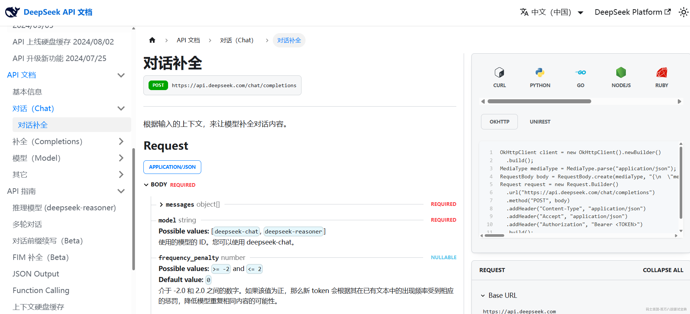

我也大致写了一个使用okhttp原生调用DeepSeek的案例

```plain
package com.ms.base;
import okhttp3.*;
import java.io.IOException;
import java.util.concurrent.TimeUnit;

//使用okhttp原生调用DeepSeek
public class DeepSeekApiExample {
    private static final String API_KEY = "sk-11111111111111111111"; // 替换为你的实际API密钥
    private static final String API_URL = "https://api.deepseek.com/chat/completions";

    public static void main(String[] args) {
        // 配置超时时间
        OkHttpClient client = new OkHttpClient.Builder()
                .connectTimeout(30, TimeUnit.SECONDS)
                .readTimeout(60, TimeUnit.SECONDS) // 关键：调大读取超时
                .writeTimeout(30, TimeUnit.SECONDS)
                .build();

        // 构建JSON请求体
        String jsonBody = "{\n" +
                "  \"model\": \"deepseek-chat\",\n" +
                "  \"messages\": [\n" +
                "    {\"role\": \"system\", \"content\": \"你是一位专业的Java开发，用简洁明了的方式回答问题\"},\n" +
                "    {\"role\": \"user\", \"content\": \"解释一下什么是springAI!\"}\n" +
                "  ],\n" +
                "  \"stream\": false\n" +
                "}";

        RequestBody body = RequestBody.create(jsonBody, MediaType.parse("application/json"));

        // 构建请求
        Request request = new Request.Builder()
                .url(API_URL)
                .addHeader("Content-Type", "application/json")
                .addHeader("Authorization", "Bearer " + API_KEY)
                .post(body)
                .build();

        // 发送请求并处理响应
        try (Response response = client.newCall(request).execute()) {
            if (!response.isSuccessful()) {
                throw new IOException("Unexpected code " + response);
            }

            // 打印响应体
            System.out.println(response.body().string());
        } catch (IOException e) {
            e.printStackTrace();
        }
    }
}

```

返回结果

```plain
{"id":"d08cff9d-0065-4f96-98b7-fa7ecb4ef338","object":"chat.completion","created":1747876684,"model":"deepseek-chat","choices":[{"index":0,"message":{"role":"assistant","content":"**Spring AI 简介**  \nSpring AI 是 Spring 官方推出的集成人工智能（AI）能力的框架，旨在简化 Java 应用中调用 AI 模型（如 OpenAI、Hugging Face 等）的流程。它提供统一 API，支持对话、文生图、嵌入模型等功能。\n\n---\n\n**核心特点**  \n1. **标准化接口**  \n   - 用 `ChatClient`、`EmbeddingClient` 等抽象接口调用不同 AI 服务（如 OpenAI、Azure AI）。  \n   - 示例代码：  \n     ```java\n     ChatClient client = new OpenAiChatClient(apiKey);  \n     String response = client.call(\"Hello AI!\"); // 调用对话模型\n     ```\n\n2. **开箱即用功能**  \n   - 支持：文本生成、多模态（如图片生成）、向量计算（RAG 应用）。  \n   - 内置提示词（Prompt）模板管理，优化 AI 交互。\n\n3. **与 Spring 生态集成**  \n   - 通过 `spring-ai-bom` 管理依赖，兼容 Spring Boot 自动配置。\n\n---\n\n**典型应用场景**  \n- 快速接入 ChatGPT 生成动态内容  \n- 构建基于向量数据库的智能搜索  \n- 开发 AI 增强的企业应用（如自动报表生成）\n\n---\n\n**优势**  \n- **降低复杂度**：隐藏不同 AI 供应商的 API 差异。  \n- **模块化设计**：可单独使用对话、嵌入等组件。  \n\n> 当前为早期项目（2023 年启动），适合探索性项目或快速原型开发。生产环境需评估稳定性。"},"logprobs":null,"finish_reason":"stop"}],"usage":{"prompt_tokens":20,"completion_tokens":342,"total_tokens":362,"prompt_tokens_details":{"cached_tokens":0},"prompt_cache_hit_tokens":0,"prompt_cache_miss_tokens":20},"system_fingerprint":"fp_8802369eaa_prod0425fp8"}
```

而如果使用spring ai的方式，代码就比较简单，也符合我们的日常编码习惯。

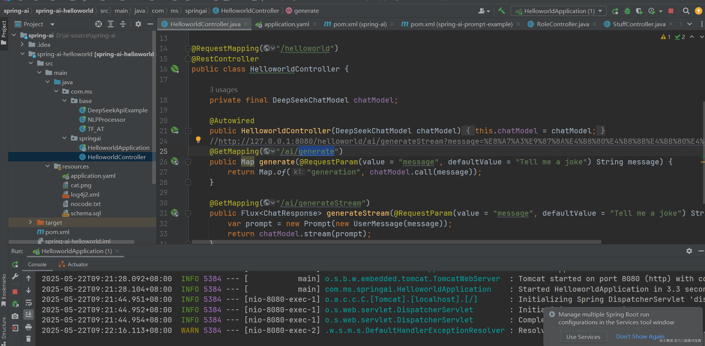

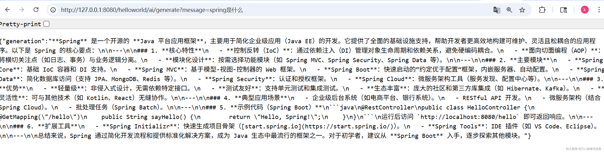

## Spring AI的优势

### 1. 简化API调用流程

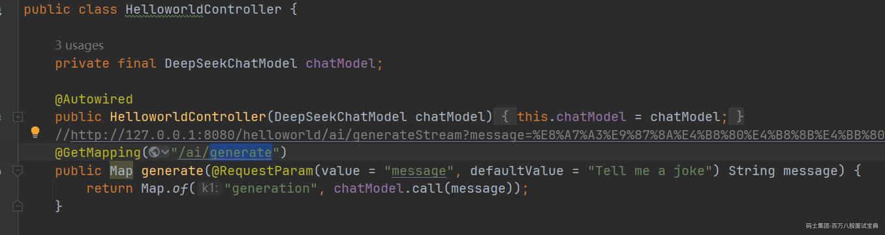

### 2. 统一的多模型抽象

简单的讲就是可以集成多种大模型，比如openAI、智普AI、DeepSeek，都可以集成。

### 3. 声明式配置管理

替代硬编码配置：

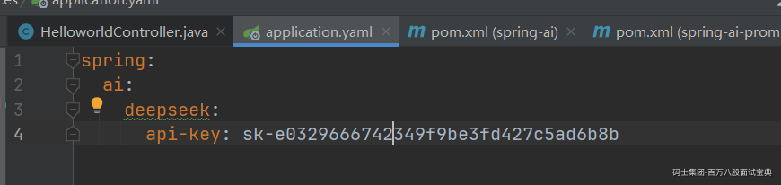

### 4. 流式处理支持

原生实现流式响应需要复杂处理，而SpringAI很简单，如下图：

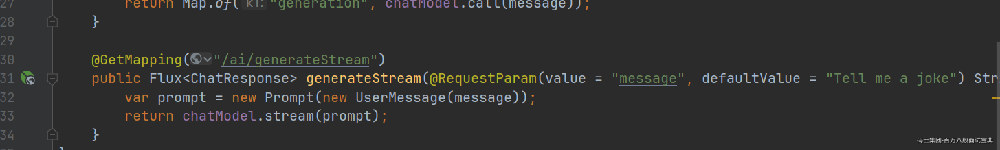

### 5.其他

增强的错误处理、与Spring生态深度集成，这些后面会循序渐进的讲。

# SpringAI的官网介绍和学习

官网地址 ：https://docs.spring.io/spring-ai/reference/getting-started.html

github地址：https://github.com/spring-projects/spring-ai

## 版本历史

1、早期版本(1.0.0-M3及之前)：2024年10月8日发布的1.0.0-M3版本

2、1.0.0-M5版本(2024年12月27日发布)

3、1.0.0-M7版本(2025年4月24日发布)

4、1.0.0-M8版本(2025年5月1日发布)

5、1.0.0-RC1版本(2025年5月13日发布)

6、即将发布的1.0.0-GA版本(计划2025年5月20日)

以上版本各个版本的变动都不小，比较受影响的就是很多类，包名，maven配置都发生变化。

已经学习基本上就按照1.0.0的版本来学习和使用即可，其他的版本都可以忽略掉。

## 中间版本的坑

1、Maven的artifactId或groupId变化，导致无法正确下载依赖

2、包名和类名的变动会导致编译错误

所以针对以前研究过Spring AI 不同版本代码的同学，就一句话，全部使用1.0.0的正式版，其他的都丢弃。

正式版文档：<https://docs.spring.io/spring-ai/reference/getting-started.html>

github：

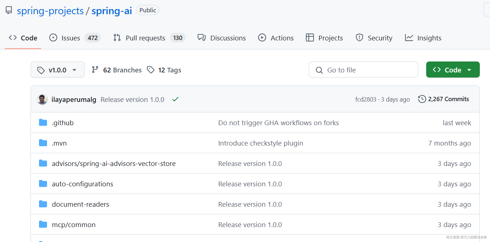

# SpringAI的基本使用

## 核心概念

### 模型（Model）

AI 模型是旨在处理和生成信息的算法，通常模仿人类的认知功能。通过从大型数据集中学习模式和见解，这些模型可以做出预测、文本、图像或其他输出，从而增强各个行业的各种应用。

AI 模型有很多种，每种都适用于特定的用例。并且不同的模型的输入和输出的格式都不同。

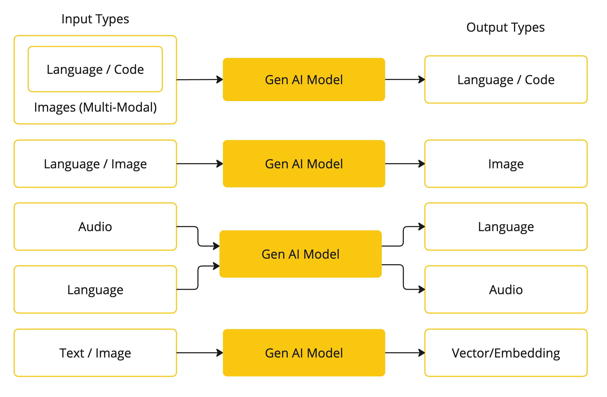

语言模型（文本输入 → 文本输出）：ChatGPT、DeepSeek、

**图像生成模型（文本输入 → 图像输出）：****OpenAI****、智谱AI**

**音频模型（文本输入 → 音频输出）：....**

**嵌入模型（文本输入 → 数字向量输出）：Gemini 2.0**

Spring AI 目前支持以语言、图像和音频形式处理输入和输出的模型，也提供了对 Embedding 的支持以支持开发更高级的应用场景。

<https://docs.spring.io/spring-ai/reference/api/index.html>

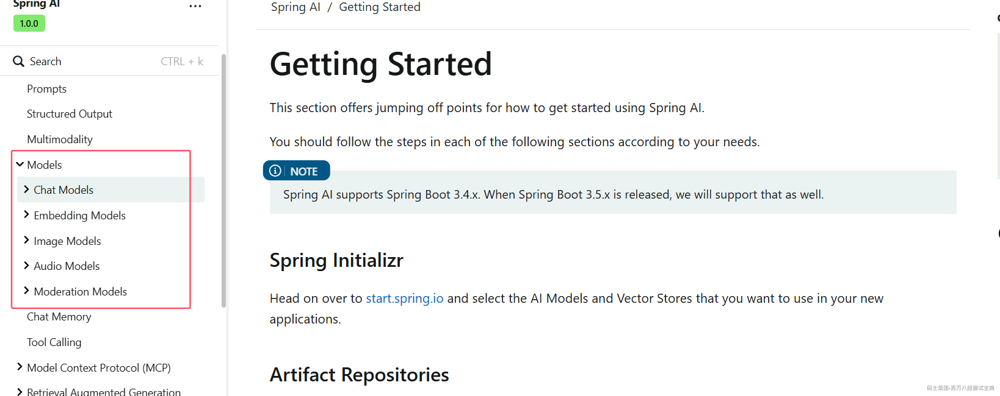

各种模型可以参考：[聊天模型比较 ：： Spring AI Reference](https://docs.spring.io/spring-ai/reference/api/chat/comparison.html)

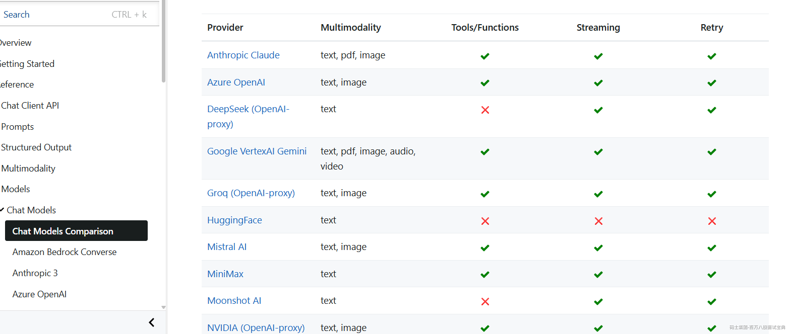

### 嵌入（Embedding）

嵌入（Embedding）是文本、图像或视频的数值表示，能够捕捉输入之间的关系，Embedding 通过将文本、图像和视频转换为称为向量（Vector）的浮点数数组来工作。这些向量旨在捕捉文本、图像和视频的含义，Embedding 数组的长度称为向量的维度。

通过计算两个文本片段的向量表示之间的数值距离，应用程序可以确定用于生成嵌入向量的对象之间的相似性。

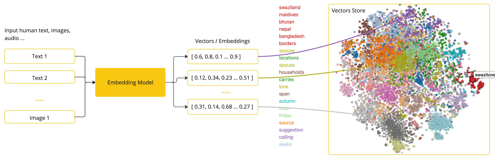

作为一名探索人工智能的 Java 开发者，理解这些向量表示背后的复杂数学理论或具体实现并不是必需的。对它们在人工智能系统中的作用和功能有基本的了解就足够了，尤其是在将人工智能功能集成到您的应用程序中时。

Embedding 在实际应用中，特别是在检索增强生成（RAG）模式中，具有重要意义。它们使数据能够在语义空间中表示为点，这类似于欧几里得几何的二维空间，但在更高的维度中。这意味着，就像欧几里得几何中平面上的点可以根据其坐标的远近关系而接近或远离一样，在语义空间中，点的接近程度反映了意义的相似性。关于相似主题的句子在这个多维空间中的位置较近，就像图表上彼此靠近的点。这种接近性有助于文本分类、语义搜索，甚至产品推荐等任务，因为它允许人工智能根据这些点在扩展的语义空间中的“位置”来辨别和分组相关概念。

您可以将这个语义空间视为一个向量。

推荐大家可以看看这个（包括token是什么）：<https://www.mashibing.com/study?courseNo=2813&sectionNo=114399&systemId=1&courseVersionId=3763>

### Token

#### **什么是Token？**

在自然语言处理（NLP）中，**Token（词元）** 是文本处理的最小单位，类似于编程语言中的 **变量名、关键字或操作符** 。NLP模型（如GPT、BERT）并不直接处理原始文本，而是先将其拆分成Token，再转换为数字（Token ID）进行计算。

#### **Token的拆分方式**

- **英文** ：可以按 **单词** （`"hello"`）、 **子词** （`"unhappiness" → ["un", "happiness"]`）或**字符**拆分。

- **中文** ：通常按 **字** （`"你好" → ["你", "好"]`）或 **词** （`"人工智能" → ["人工", "智能"]`）拆分。

- **特殊符号** ：标点、空格等也会被Token化。

#### **Token与模型输入的关系**

- **Token序列长度（Context Window）** ：模型能处理的Token数量上限（如GPT-4支持128K tokens）。  
  举例子：（`"人工智能" → ["人工", "智能"]`）拆分：如果按词分，"人工智能"只占2 Tokens，如果按字分，占4 Tokens。

- **Token ID** ：每个Token对应一个数字（如 `"你"=253, "好"=187`），模型用这些数字进行计算。

token 是 AI 模型工作原理的基石。输入时，模型将单词转换为 token。输出时，它们将 token 转换回单词。

在英语中，一个 token 大约对应一个单词的 75%。作为参考，莎士比亚的全集总共约 90 万个单词，翻译过来大约有 120 万个 token。

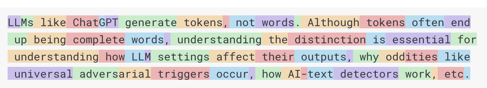

也许更重要的是 “token = 金钱”。在托管 AI 模型的背景下，您的费用由使用的 token 数量决定。输入和输出都会影响总 token 数量。

此外，模型还受到 token 限制，这会限制单个 API 调用中处理的文本量。此阈值通常称为“上下文窗口”。模型不会处理超出此限制的任何文本。

例如，ChatGPT3 的 token 限制为 4K，而 GPT4 则提供不同的选项，例如 8K、16K 和 32K。Anthropic 的 Claude AI 模型的 token 限制为 100K，而 Meta 的最新研究则产生了 1M token 限制模型。

比如DeepSeek支持128K tokens上下文窗口（适合处理书籍、长文档）。

### 检索增强生成（RAG）

#### **RAG的工作流程**

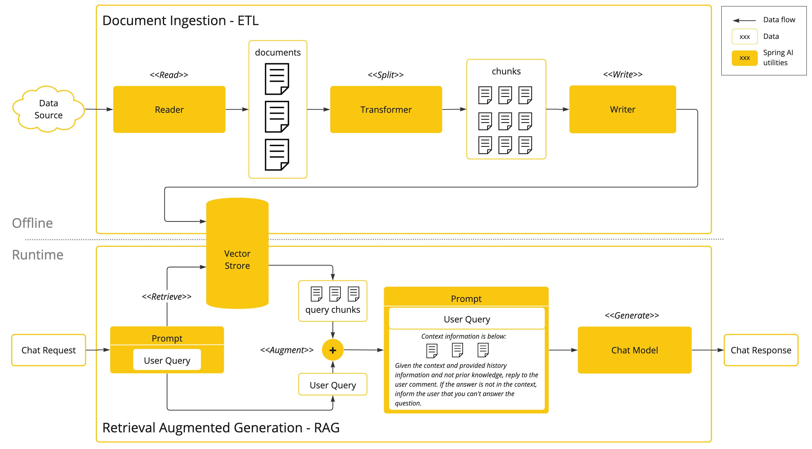

用一个实现了RAG的法律助手的流程来分析一下RAG的流程：

**1. 数据预处理（ETL管道）**

- **提取（Extract）**  
  从法律文本中提取结构化内容，例如：

- 《中华人民共和国刑法》第264条（盗窃罪条款）

- 最高人民法院《关于常见犯罪的量刑指导意见》中关于盗窃罪的规定

- 公开判决书案例（如“李某盗窃电瓶车案，金额2800元，判处有期徒刑6个月”）

- 法律学者（如罗老师）对盗窃罪构成要件的解释

- **转换（Transform）**

- **拆分文档** ：

- 按法律条文拆分（如将《刑法》第264条与司法解释分开存储）

- 按案例关键信息拆分（如“案件事实”“判决结果”“法律依据”）

- 保留上下文（例如拆分罗老师对“数额较大”的解释时，需包含地域差异说明）

- **生成向量表示** ：  
  使用法律专业嵌入模型（如 `Legal-BERT`）或通用模型，将文本转换为向量。  
  *示例：*

- 《刑法》第264条 → 向量A

- “盗窃公私财物价值3000元属‘数额较大’” → 向量B

- “张某盗窃2500元电瓶车获刑5个月”案例 → 向量C

- **加载（Load）**  
  将向量与对应文本存入法律专用向量数据库（如整合刑法、案例库的私有化部署数据库）。

---

**2. 用户查询处理**

- **用户提问**  
  “张三偷了一辆电瓶车，价值3000元，会怎么判？”

- **查询向量化**  
  使用相同模型将问题转换为向量Q。

- **相似度检索**  
  检索最相关的3个片段：

1. 《刑法》第264条：“盗窃公私财物，数额较大的，处三年以下有期徒刑、拘役或者管制……”

2. 某省量刑标准：“盗窃财物价值3000元属于‘数额较大’，基准刑为6个月至1年有期徒刑。”

3. 罗老师解析：“司法实践中需结合行为人主观恶性、退赃退赔等情节综合量刑。”

---

**3. 生成回答**

- **上下文注入**  
  将检索内容整合为提示（Prompt）：

```plain
根据以下法律依据和案例，回答张三的刑事责任：  
1. 《刑法》第264条：……  
2. 某省标准：3000元属“数额较大”，基准刑6个月至1年。  
3. 罗老师观点：退赃可减轻处罚。  
问题：张三偷电瓶车（3000元）会怎么判？  
```

- **AI生成回答**

> “张三的行为已构成盗窃罪。根据《刑法》第264条，盗窃数额较大的财物，处三年以下有期徒刑、拘役或管制。  
> **具体分析** ：
>
> 1. **金额认定** ：3000元符合‘数额较大’标准（参考某省量刑标准）。
>
> 2. **基准刑** ：通常为6个月至1年有期徒刑。
>
> 3. **从轻情节** ：若张三主动退赃、认罪认罚，可能减少刑期（如缓刑或5-6个月有期徒刑）。
>
> 4. **地域差异** ：需结合当地具体司法实践判断。”

### 函数调用（Function Calling）

大型语言模型 (LLM) 在训练后即被冻结，导致知识陈旧，并且无法访问或修改外部数据。

[Function Calling](https://docs.spring.io/spring-ai/reference/api/functions.html)机制解决了这些缺点，它允许您注册自己的函数，以将大型语言模型连接到外部系统的 API。这些系统可以为 LLM 提供实时数据并代表它们执行数据处理操作。

Spring AI 大大简化了您需要编写的代码以支持函数调用。它为您处理函数调用对话。您可以将函数作为提供，`@Bean`然后在提示选项中提供该函数的 bean 名称以激活该函数。此外，您可以在单个提示中定义和引用多个函数。

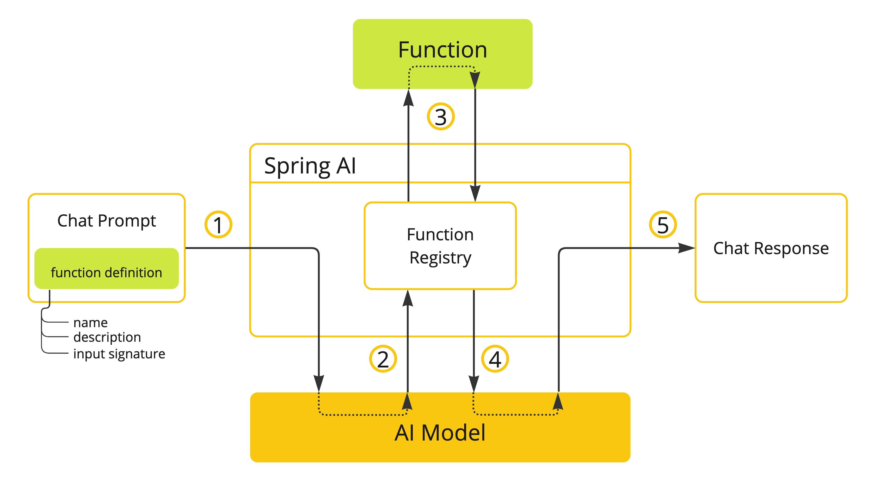

- （1）执行聊天请求并发送函数定义信息。后者提供 `name`（`description`例如，解释模型何时应调用该函数）和 `input parameters`（例如，函数的输入参数模式）。

- （2）当模型决定调用该函数时，它将使用输入参数调用该函数，并将输出返回给模型。

- （3）Spring AI 为您处理此对话。它将函数调用分派给适当的函数，并将结果返回给模型。

- （4）模型可以执行多个函数调用来检索所需的所有信息。

- （5）一旦获取了所有需要的信息，模型就会生成响应。

## 快速开始使用

### 快速体验示例

#### 1、maven依赖和配置：

参考官网<https://docs.spring.io/spring-ai/reference/getting-started.html>

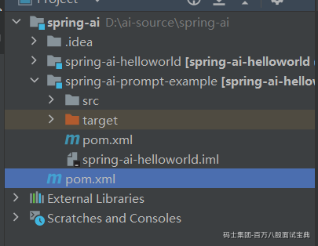

几个要求：  
1、JDK最少要JDK17及以上

2、Springboot至少3.4.0及以上

3、必须严格按照spring-ai官网文档的依赖配置

### Chat Client

`ChatClient` 提供了与 AI 模型通信的 Fluent API，它支持同步和反应式（Reactive）编程模型。与 `ChatModel`、`Message`、`ChatMemory` 等原子 API 相比，使用 `ChatClient` 可以将与 LLM 及其他组件交互的复杂性隐藏在背后，因为基于 LLM 的应用程序通常要多个组件协同工作（例如，提示词模板、聊天记忆、LLM Model、输出解析器、RAG 组件：嵌入模型和存储），并且通常涉及多个交互，因此协调它们会让编码变得繁琐。当然使用 `ChatModel` 等原子 API 可以为应用程序带来更多的灵活性，成本就是您需要编写大量样板代码。

ChatClient 类似于应用程序开发中的服务层，它为应用程序直接提供 `AI 服务`，开发者可以使用 ChatClient Fluent API 快速完成一整套 AI 交互流程的组装。

包括一些基础功能，如：

- 定制和组装模型的输入（Prompt）

- 格式化解析模型的输出（Structured Output）

- 调整模型交互参数（ChatOptions）

还支持更多高级功能：

- 聊天记忆（Chat Memory）

- 工具/函数调用（Function Calling）

- RAG

spring-ai-helloworld子工程案例

使用 `ChatClient.Builder` 对象创建 `ChatClient` 实例，您可以自动注入由Spring Boot 自动配置创建的默认 `ChatClient.Builder` 实例，您也可以通过编程方式自行创建一个 `ChatClient.Builder` 实例并用它来得到 `ChatClient` 实例。

使用的 Spring Boot 自动装配默认生成的 `ChatClient.Builder` 的 bean，把它注入到您自己的类中。这里是根据用户提问并从模型得到文本回答的简单例子：

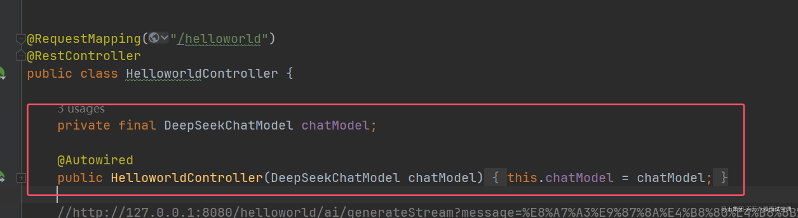

# SpringAI的架构设计/源码
