# 数据准备

本课程以实际项目作为教学案例《飞滴出行网约车项目》

课程地址：<https://www.mashibing.com/course/1537>

然后对应的数据库中核心表生成。

车辆信息大约300万、司机信息大约400万、乘客信息大约1000万，同时大约生成2000万左右订单数据。

# 1、慢查询

## 什么是慢查询

慢查询日志，顾名思义，就是查询花费大量时间的日志，是指mysql记录所有执行超过long\_query\_time参数设定的时间阈值的SQL语句的日志。该日志能为SQL语句的优化带来很好的帮助。

默认情况下，慢查询日志是关闭的(站性能的角度)，要使用慢查询日志功能，首先要开启慢查询日志功能。如何开启

### 慢查询配置

#### 慢查询开启

```plain
show VARIABLES like 'slow_query_log';
```

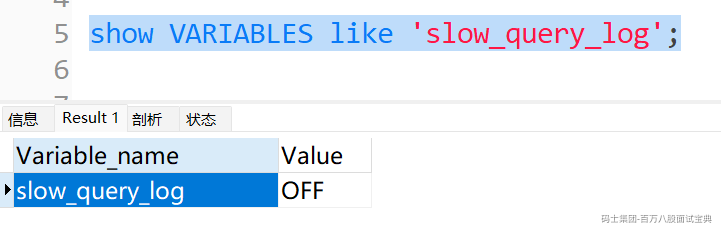

默认是关闭的。

```plain
set GLOBAL slow_query_log=1;
```

开启1，关闭0

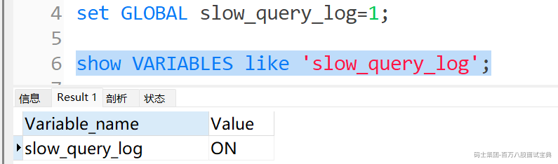

#### 慢查询阈值

但是多慢算慢？MySQL中可以设定一个阈值，将运行时间超过该值的所有SQL语句都记录到慢查询日志中。long\_query\_time参数就是这个阈值。默认值为10，代表10秒。

```plain
show VARIABLES like '%long_query_time%';
```

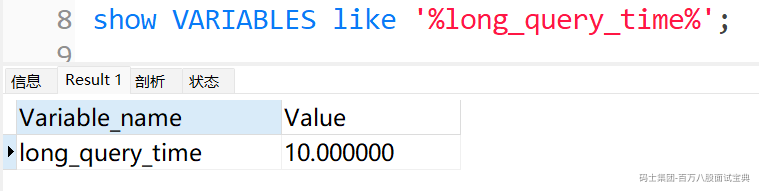

当然也可以设置

```plain
set global long_query_time=5;  --全局 
SET SESSION long_query_time=5;  --本会话内
```

默认10秒，这里为了演示方便设置为5

**权限问题：修改全局变量需要** `SUPER` **权限（MySQL 8.0.26+ 可用** `SYSTEM_VARIABLES_ADMIN` **替代）。**

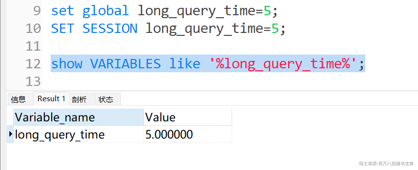

#### 慢查询其他参数

l slow\_query\_log 启动停止慢查询日志

l slow\_query\_log\_file 指定慢查询日志得存储路径及文件（默认和数据文件放一起）

l long\_query\_time 指定记录慢查询日志SQL执行时间得伐值（单位：秒，默认10秒）

l log\_queries\_not\_using\_indexes 是否记录未使用索引的SQL

l log\_output 日志存放的地方可以是[TABLE][FILE][FILE,TABLE]

## 慢查询实战

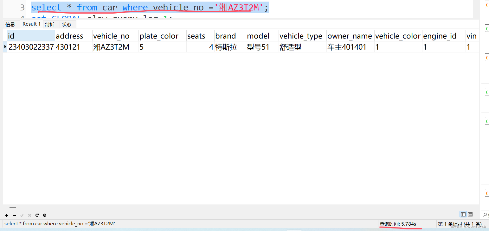

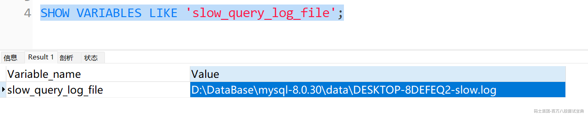

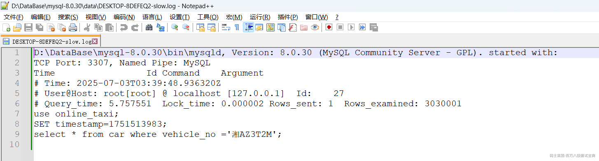

# 2、Explain执行计划

同样查询一条记录(出来的数据是一样)，我们通过两种SQL，查询出来，第一条很快，第二条却触发的慢SQL的阈值。

```plain
select * from car where id =101413123403022337;

select * from car where vehicle_no ='湘AZ3T2M';
```

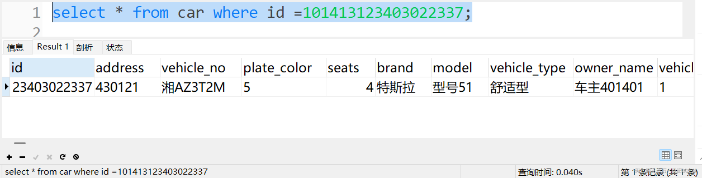

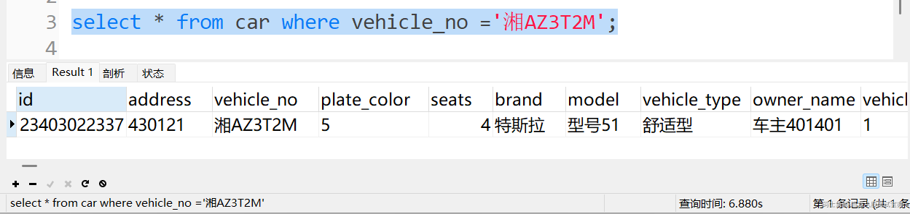

那么在写SQL的时候，有没有一种我们可以分析的方式和工具，有的，这个就是执行计划

## 什么是执行计划

通过使用EXPLAIN关键字可以模拟优化器执行SQL查询语句，从而知道MySQL是如何处理你的SQL语句的。

分析查询语句或是表结构的性能瓶颈，总的来说通过EXPLAIN我们可以：

- 表的读取顺序

- 数据读取操作的操作类型

- 哪些索引可以使用

- 哪些索引被实际使用

- 表之间的引用

- 每张表有多少行被优化器查询

## 执行计划的语法

执行计划的语法其实非常简单： 在SQL查询的前面加上EXPLAIN关键字就行。比如：EXPLAIN select \* from table1

```plain
EXPLAIN select * from car where vehicle_no ='湘AZ3T2M';
```

重点的就是EXPLAIN后面你要分析的SQL语句

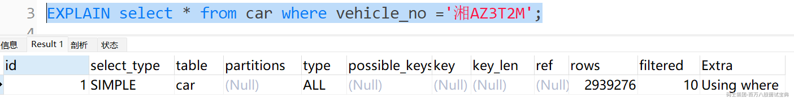

除了以SELECT开头的查询语句，其余的DELETE、INSERT、REPLACE以及UPOATE语句前边都可以加上EXPLAIN，用来查看这些语句的执行计划，不过我们这里对SELECT语句更感兴趣，所以后边只会以SELECT语句为例来描述EXPLAIN语句的用法。

## 执行计划简介

### 查询类型

**id** \*\*： **在一个大的查询语句中每个SELECT**关键字都对应一个唯一的id\*\*

**select\_type** **： SELECT\*\*\*\*关键字对应的那个查询的类型**

**type** **：针对单表的访问方法**

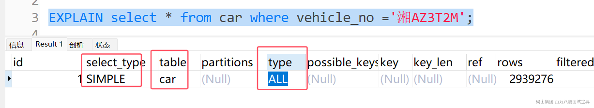

这里是all就是全表扫描，将遍历全表以找到匹配的行

**全表扫描：** MySQL 从表的起始位置开始读取所有数据行（比如按照聚簇索引/主键索引的物理顺序读取）

**触发全表扫描的条件：**

- 查询没有使用任何合适的索引

- 使用了索引但优化器认为全表扫描成本更低

- 查询需要访问表中大部分数据（通常超过约20%-30%）

我们把SQL一换，type就变了。

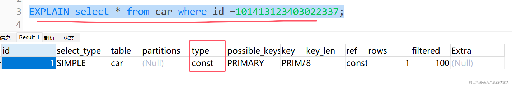

### 执行计划中的type

执行计划结果中出现的type列就表明了这个访问方法/访问类型是个什么东西，是较为重要的一个指标，结果值从最好到最坏依次是：

出现比较多的是system>const>eq\_ref>ref>range>index>ALL

一般来说，得保证查询至少达到range级别，最好能达到ref。

#### system

当表中只有一条记录并且该表使用的存储引擎的统计数据是精确的，比如MyISAM、Memory，那么对该表的访问方法就是system。

#### const

就是当我们根据主键或者唯一二级索引列与常数进行等值匹配时，对单表的访问方法就是const。

#### eq\_ref

在连接查询时，如果被驱动表是通过主键或者唯一二级索引列等值匹配的方式进行访问的〈如果该主键或者唯一二级索引是联合索引的话，所有的索引列都必须进行等值比较)，则对该被驱动表的访问方法就是eq\_ref。

#### ref

当通过普通的二级索引列与常量进行等值匹配时来查询某个表，那么对该表的访问方法就可能是ref。

#### range

如果使用索引获取某些范围区间的记录，那么就可能使用到range访问方法，一般就是在你的where语句中出现了between、&#x3c;、>、in等的查询。

这种范围扫描索引扫描比全表扫描要好，因为它只需要开始于索引的某一点，而结束语另一点，不用扫描全部索引。

#### index

当我们可以使用索引覆盖，但需要扫描全部的索引记录时，该表的访问方法就是index。

#### all

最熟悉的全表扫描，将遍历全表以找到匹配的行

### 执行计划中的possible\_keys与key

在EXPLAIN 语句输出的执行计划中,possible\_keys列表示在某个查询语句中，对某个表执行单表查询时可能用到的索引有哪些，key列表示实际用到的索引有哪些，如果为NULL，则没有使用索引。比方说下边这个查询。

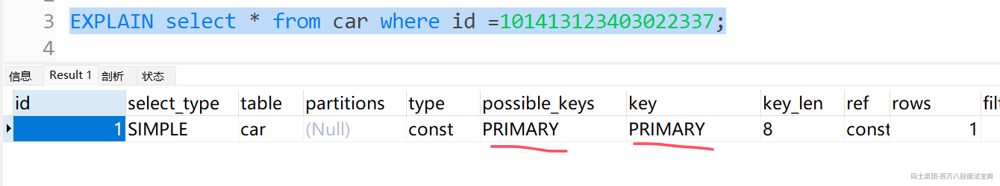

### 执行计划中的key\_len

- 表示 MySQL 使用的索引键的最大长度（单位：字节）

- 用于判断联合索引中哪些列被用于查询

- 计算时考虑：

- 列的数据类型长度

- 是否允许 NULL 值（NULL 占用 1 字节）

- 字符集（不同字符集字符占用字节数不同）

演示案例：

```plain
-- 创建演示表
CREATE TABLE `user_info` (
  `id` int NOT NULL AUTO_INCREMENT,
  `username` varchar(50) NOT NULL,
  `age` int NOT NULL,
  `city` varchar(50) DEFAULT NULL,
  `gender` char(1) DEFAULT NULL,
  PRIMARY KEY (`id`),
  KEY `idx_username_age_city` (`username`, `age`, `city`)
) ENGINE=InnoDB DEFAULT CHARSET=utf8mb4;

-- 插入示例数据
INSERT INTO `user_info` (`username`, `age`, `city`, `gender`) VALUES
('zhangsan', 25, 'Beijing', 'M'),
('lisi', 30, 'Shanghai', 'F'),
('wangwu', 28, 'Guangzhou', 'M'),
('zhaoliu', 35, 'Shenzhen', 'F'),
('qianqi', 22, 'Beijing', 'M');
-- 使用索引所有列
EXPLAIN SELECT * FROM user_info WHERE username = 'zhangsan' AND age = 25 AND city = 'Beijing';
-- 使用索引前两列
EXPLAIN SELECT * FROM user_info WHERE username = 'zhangsan' AND age = 25;
-- 仅使用索引第一列
EXPLAIN SELECT * FROM user_info WHERE username = 'zhangsan';
```

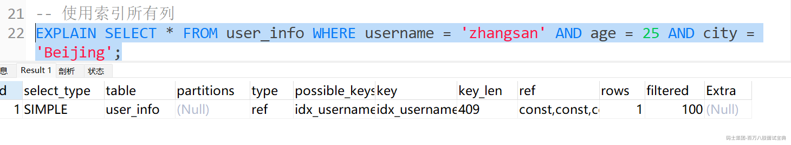

**key\_len 计算** ：（utf8mb4：每个字符最多 **4 字节**）

- username: varchar(50) utf8mb4→ 50\*4 + 2(长度标识) = 202 字节

- age: int → 4 字节

- city: varchar(50) utf8mb4→ 50\*4 + 2 = 202 字节

- 总计：202 + 4 + 203 = 409 字节

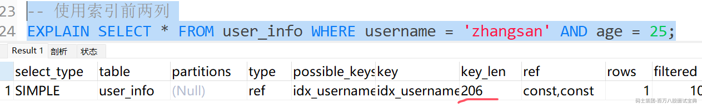

**key\_len 计算** ：

- username: 202 字节

- age: 4 字节

- 总计：206 字节

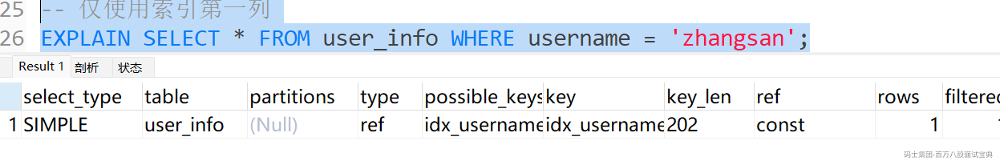

**key\_len 计算** ：

- username: 202 字节

### 执行计划中的rows与filtered

1、使用全表扫描的方式对某个表执行查询时，执行计划的rows列就代表预计需要扫描的行数

2、如果使用索引来执行查询时，执行计划的rows列就代表预计扫描的索引记录行数。

3、filtered代表有多少条记录满足搜索条件。

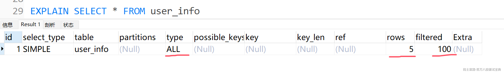

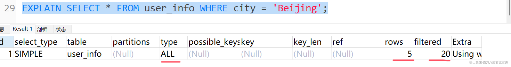

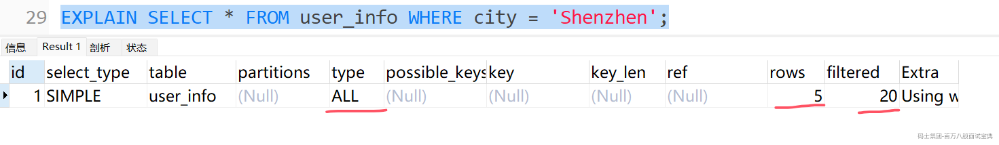

通过前面的可以分析出来，看出一个问题了。

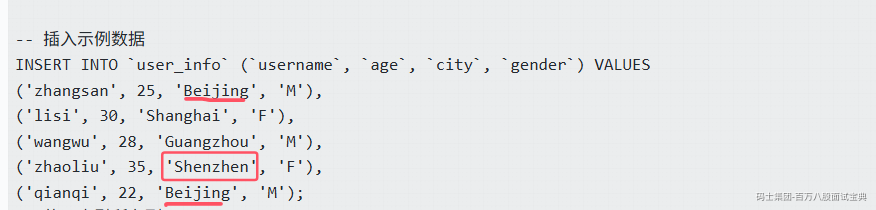

这个filtered不对啊，5条数据中1条也是20（20%）2条也是20（20%）。

这个不用担心，因为执行计划中的很多指标不是实际值，而是估算值，所以有误差正常，这些问题只能去深入了解执行计划才能去理解，在这里这个问题可以放过去。

### 执行计划中的Extra

顾名思义，Extra列是用来说明一些额外信息的，我们可以通过这些额外信息来更准确的理解MySQL到底将如何执行给定的查询语句。

**常用的有两种：**

\*\*1、索引下推技术：\*\*索引下推（Index Condition Pushdown, ICP），MySQL 5.6 引入的一项优化技术，用于提高查询性能。它的核心思想是将部分过滤条件下推到存储引擎层（如 InnoDB），从而减少不必要的数据传输和服务器层的计算。

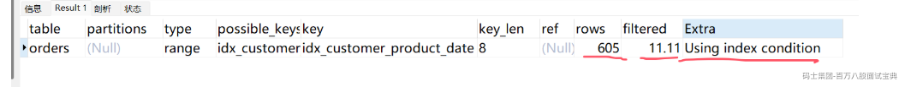

**2、Skip Scan** ：这是MySQL 8.0引入的一种优化技术，允许在某些情况下即使查询条件不满足最左前缀匹配原则，也能使用索引。

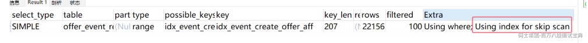

# 3、MySQL的查询成本

## 什么是成本

MySQL执行一个查询可以有不同的执行方案，它会选择其中成本最低，或者说代价最低的那种方案去真正的执行查询。不过我们之前对成本的描述是非常模糊的，其实在MySQL中一条查询语句的执行成本是由下边这两个方面组成的：

**I/O成本**

我们的表经常使用的MyISAM、InnoDB存储引擎都是将数据和索引都存储到磁盘上的，当我们想查询表中的记录时，需要先把数据或者索引加载到内存中然后再操作。这个从磁盘到内存这个加载的过程损耗的时间称之为I/O成本。

**CPU成本**

读取以及检测记录是否满足对应的搜索条件、对结果集进行排序等这些操作损耗的时间称之为CPU成本。

对于InnoDB存储引擎来说，页是磁盘和内存之间交互的基本单位。

**MySQL规定读取一个页面花费的成本默认是1.0（I/O成本）**

**读取以及检测一条记录是否符合搜索条件的成本默认是0.2（CPU成本）**

1.0、0.2这些数字称之为成本常数，这两个成本常数我们最常用到，当然还有其他的成本常数。

**注意，不管读取记录时需不需要检测是否满足搜索条件，哪怕是空数据，其成本都算是0.2。**

## Explain与查询成本

### EXPLAIN输出成本

前面我们已经对MySQL查询优化器如何计算成本有了比较深刻的了解。但是EXPLAIN语句输出中缺少了一个衡量执行计划好坏的重要属性—— **成本。**

不过MySQL已经为我们提供了一种查看某个执行计划花费的成本的方式：

在EXPLAIN单词和真正的查询语句中间加上FORMAT=JSON。

1、执行计划分析：`EXPLAIN` 命令来实现的

```plain
EXPLAIN SELECT * FROM customers WHERE name = 'Customer_72294';
```

2、执行成本分析：`EXPLAIN FORMAT=JSON`

```plain
EXPLAIN FORMAT=JSON SELECT * FROM customers WHERE name = 'Customer_72294';
```

# 4、单表索引调优

## 1、数据准备

创建三张表：客户表、产品表、订单表

```plain
CREATE TABLE `customers`  (
  `customer_id` int(11) NOT NULL AUTO_INCREMENT COMMENT '用户ID',
  `name` varchar(100) CHARACTER SET utf8 COLLATE utf8_general_ci NOT NULL COMMENT '姓名',
  `email` varchar(100) CHARACTER SET utf8 COLLATE utf8_general_ci NOT NULL COMMENT '邮箱',
  PRIMARY KEY (`customer_id`) USING BTREE
) ENGINE = InnoDB AUTO_INCREMENT = 16384 CHARACTER SET = utf8 COLLATE = utf8_general_ci ROW_FORMAT = Dynamic;
CREATE TABLE `products`  (
  `product_id` int(11) NOT NULL AUTO_INCREMENT COMMENT '产品ID',
  `name` varchar(100) CHARACTER SET utf8 COLLATE utf8_general_ci NOT NULL COMMENT '产品名称',
  `price` decimal(10, 2) NOT NULL COMMENT '价格',
  PRIMARY KEY (`product_id`) USING BTREE
) ENGINE = InnoDB AUTO_INCREMENT = 8192 CHARACTER SET = utf8 COLLATE = utf8_general_ci ROW_FORMAT = Dynamic;
CREATE TABLE `orders`  (
  `order_id` int(11) NOT NULL AUTO_INCREMENT COMMENT '订单ID',
  `customer_id` int(11) NOT NULL COMMENT '客户ID',
  `product_id` int(11) NOT NULL COMMENT '产品ID',
  `order_date` date NOT NULL COMMENT '下单日期',
  `status` int(11) NOT NULL COMMENT '订单状态',
  PRIMARY KEY (`order_id`) USING BTREE
) ENGINE = InnoDB AUTO_INCREMENT = 393211 CHARACTER SET = utf8 COLLATE = utf8_general_ci ROW_FORMAT = Dynamic;
```

然后生成大量数据（满足正式生产的条件）：客户表1万条、产品表5000条、订单表500多万的数据。

```plain
-- 检查客户表数据量
SELECT COUNT(*) AS customer_count FROM customers;

-- 检查产品表数据量
SELECT COUNT(*) AS product_count FROM products;

-- 检查订单表数据量
SELECT COUNT(*) AS order_count FROM orders;
```

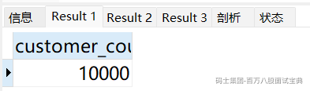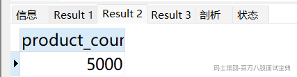

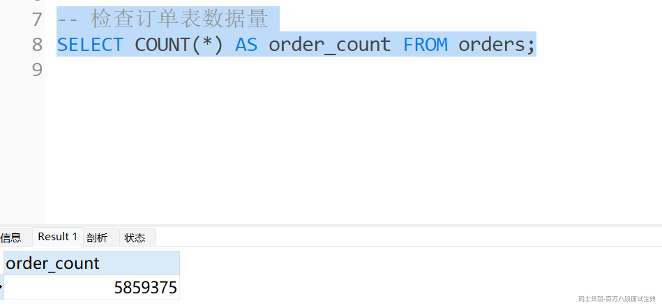

## 2、优化前分析

### 分析工具

1、执行计划分析：`EXPLAIN` 命令来实现的

```plain
EXPLAIN SELECT * FROM customers WHERE name = 'Customer_72294';
```

2、执行成本分析：`EXPLAIN FORMAT=JSON`

```plain
EXPLAIN FORMAT=JSON SELECT * FROM customers WHERE name = 'Customer_72294';
```

## 3、优化思路

### 查询需求

1、查询某个时间范围内的所有订单

2、查询某个客户的所有订单

3、查询某个客户在某个时间范围内的订单

4、查询某个产品在某个时间范围内的订单

5、分页查询

## 4、索引优化

#### 1、单列索引

SQL:

```plain
SELECT * FROM customers WHERE name = 'Customer_72294';
```

优化前的执行计划：全表扫描。

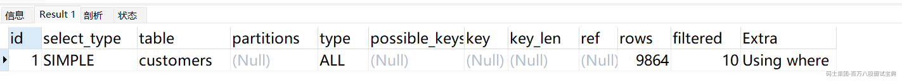

优化前的成本

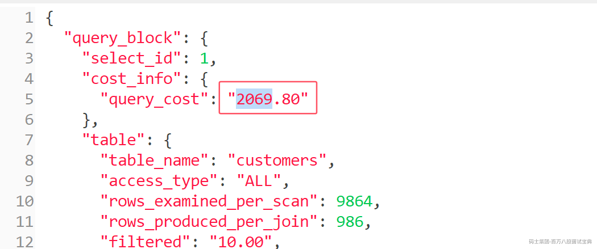

```plain
加索引：CREATE INDEX idx_username ON customers(name);
```

优化后的执行计划

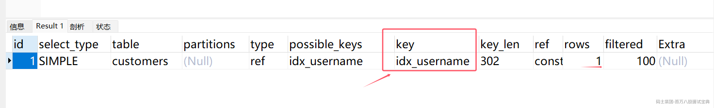

再看执行成本：

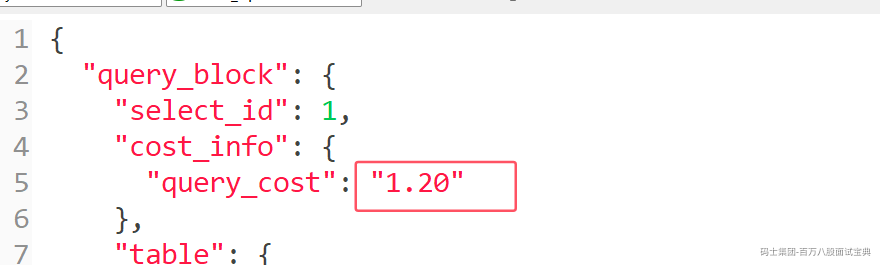

#### 2、复合索引

查询SQL

```plain

SELECT * FROM orders WHERE customer_id = '17' and order_date ='2025-01-22';

SELECT * FROM orders WHERE customer_id = '17' and order_date BETWEEN  '2025-01-22' and '2025-03-22' ;

```

执行计划分析：全表扫描， 成本分析，成本高

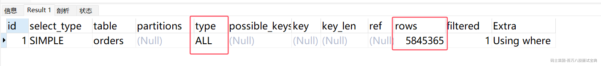

看成本：

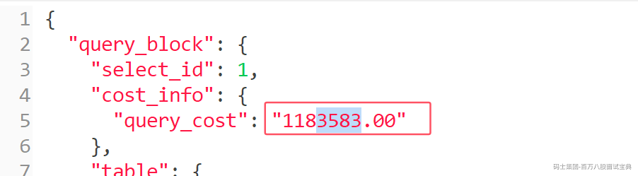

加索引优化

```plain
CREATE INDEX idx_orders_cust_date ON orders(customer_id,order_date);
```

加索引优化：

同时需要注意联合索引的最左匹配原则（SQL中最左优先等值匹配，如果是范围之类的，最好放最右）

执行计划分析：用到了联合索引，效率较高

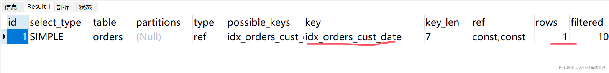

成本分析：

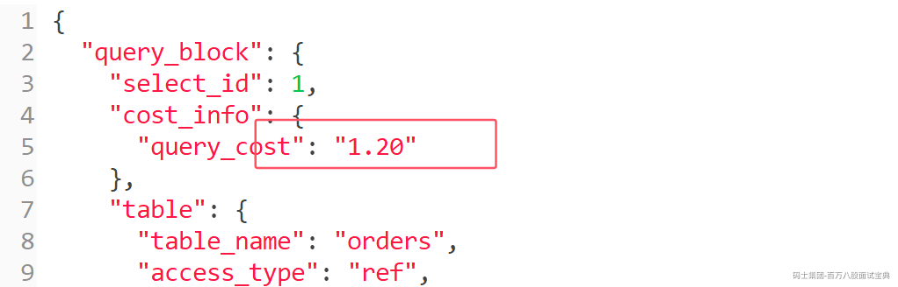

#### 3、覆盖索引

SQL语句：

```plain
SELECT status, order_date FROM orders WHERE customer_id = 123
```

这里的话（因为之前已经有一个联合索引，不过这个联合索引覆盖不了status），索引执行计划分析，会使用上述的联合索引（复合索引）

执行计划：

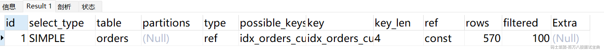

成本是：

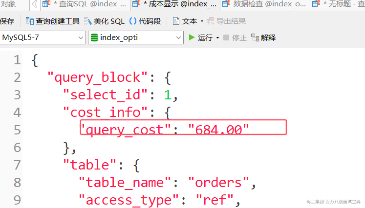

```plain
CREATE INDEX idx_orders_customer_status_date ON orders(customer_id, status, order_date);
```

执行计划：注意key的变化，还有Extra

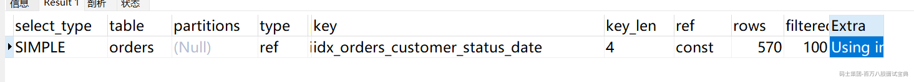

再看成本：

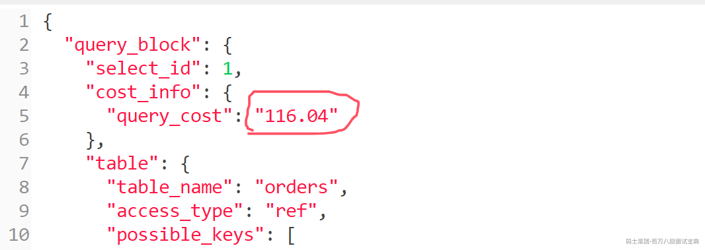

#### 4、前缀索引

创建表SQL:

```plain
CREATE TABLE logs (
id INT AUTO_INCREMENT PRIMARY KEY,
message TEXT NOT NULL,
created_at TIMESTAMP DEFAULT CURRENT_TIMESTAMP
);
```

经常使用的SQL查询：

```plain
SELECT * FROM logs WHERE message like   'Error: %';
```

执行计划分析：全表扫描

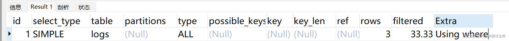

创建前缀索引：

```plain
CREATE index index_prefix_message  ON logs(message(20));
```

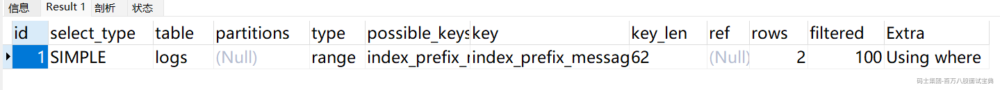

#### 5、索引下推

索引下推（Index Condition Pushdown, ICP），MySQL 5.6 引入的一项优化技术，用于提高查询性能。它的核心思想是将部分过滤条件下推到存储引擎层（如 InnoDB），从而减少不必要的数据传输和服务器层的计算。

怎么理解呢，用一个sql案例来理解：

还是之前的Order表，我们只保留一个索引：

```plain
CREATE INDEX idx_customer_product_date ON orders (customer_id, product_id,order_date);
```

这个SQL语句的执行：

```plain
EXPLAIN 
SELECT * FROM orders 
WHERE customer_id = 1 AND product_id > 6
 and order_date BETWEEN  '2025-01-22' and '2025-03-22' ; 
```

**如果没有启用索引下推（ICP）技术：**

1、存储引擎会使用索引 `idx_customer_product_date`  查找 `customer_id = 1 AND product_id > 6` 的所有行。

2、将这些行返回给服务器层。（**服务器层**主要使用内存来存储解析后的 SQL 语句、执行计划和连接信息）

3、服务器层再过滤 `order_date BETWEEN '2025-01-22' and '2025-03-22'` 的行

**启用索引下推（ICP）技术：**

1、存储引擎会使用索引 `idx_customer_product_date`  查找 `customer_id = 1 AND product_id > 6` 的所有行。

2、在存储引擎层直接过滤 `order_date BETWEEN '2025-01-22' and '2025-03-22'` 的行。（InnoDB 的 Buffer Pool）

3、只返回符合条件的行给服务器层

当然MySQL5.7之后，索引下推都是默认开启，也禁止不了。

我们来分析一下执行计划：

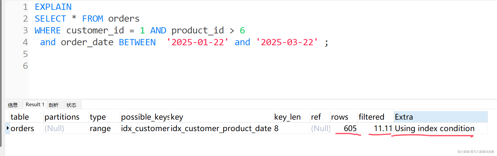

分析索引下推技术在执行计划和成本中的体现

#### 6、**数据量临界点对执行计划的影响**

关键技术：也就是常见的，最终索引用不用，不单纯是计划，同时要考核成本。

这里是**范围查询何时从索引扫描转为全表扫描**。或者反过来说都可以。

案例SQL(不解释业务，只解释技术)

创建表SQL:

```plain
CREATE TABLE `offer_event_report` (
  `id` bigint(20) NOT NULL AUTO_INCREMENT COMMENT '主键ID',
  `event_name` varchar(50) NOT NULL COMMENT '事件名称',
  `create_time` datetime NOT NULL COMMENT '创建时间',
  `offer_id` int(11) NOT NULL COMMENT '报价ID',
  `aff_id` int(11) NOT NULL COMMENT '关联ID',
  `cost` decimal(15,2) NOT NULL DEFAULT '0.00' COMMENT '成本',
  `revenue` decimal(15,2) NOT NULL DEFAULT '0.00' COMMENT '收入',
  PRIMARY KEY (`id`),
  KEY `idx_event_create_offer_aff` (`event_name`,`create_time`,`offer_id`,`aff_id`),
  KEY `idx_create_aff` (`create_time`,`aff_id`)
) ENGINE=InnoDB DEFAULT CHARSET=utf8mb4 COMMENT='报价事件报告表';
```

创建存储过程：

```plain
CREATE PROCEDURE insert_test_data()
BEGIN
  DECLARE i INT DEFAULT 1;
  DECLARE start_date DATETIME DEFAULT '2025-01-01 00:00:00';
  DECLARE end_date DATETIME DEFAULT '2025-04-24 23:59:59';
  DECLARE temp_date DATETIME;  -- 修改变量名，避免与函数冲突
  
  WHILE i <= 200000 DO
    -- 随机生成日期(2025年1到4月内)
    SET temp_date = DATE_ADD(start_date, INTERVAL FLOOR(RAND() * DATEDIFF(end_date, start_date)) DAY);
    SET temp_date = DATE_ADD(temp_date, INTERVAL FLOOR(RAND() * 24) HOUR);
    SET temp_date = DATE_ADD(temp_date, INTERVAL FLOOR(RAND() * 60) MINUTE);
    SET temp_date = DATE_ADD(temp_date, INTERVAL FLOOR(RAND() * 60) SECOND);
  
    -- 插入数据
    INSERT INTO offer_event_report (
      event_name, 
      create_time, 
      offer_id, 
      aff_id, 
      cost, 
      revenue
    ) VALUES (
      CONCAT('event_', FLOOR(RAND() * 10)),  -- 10种事件类型
      temp_date,
      FLOOR(RAND() * 1000),                 -- 1000种offer
      IF(RAND() < 0.2, 129, FLOOR(RAND() * 200)),  -- 20%概率是aff_id=129，其他随机
      ROUND(RAND() * 1000, 2),               -- 成本0-1000随机
      ROUND(RAND() * 2000, 2)                -- 收入0-2000随机
    );
  
    SET i = i + 1;
    -- 每1000条提交一次
    IF i % 1000 = 0 THEN
      COMMIT;
    END IF;
  END WHILE;
  COMMIT;
END //
```

执行存储过程，插入20万数据

```plain
CALL insert_test_data();
```

分析的SQL：

```plain
SELECT 
    SUM(cost) AS cost,
    SUM(revenue) AS revenue
FROM offer_event_report
WHERE 
    create_time BETWEEN '2025-03-10 00:00:00' AND '2025-03-31 23:59:59'
    AND aff_id = 129;
```

执行计划分析（发现走全表扫描）：

```plain
EXPLAIN
SELECT 
    SUM(cost) AS cost,
    SUM(revenue) AS revenue
FROM offer_event_report
WHERE 
    create_time BETWEEN '2025-03-10 00:00:00' AND '2025-03-31 23:59:59'
    AND aff_id = 129;

```

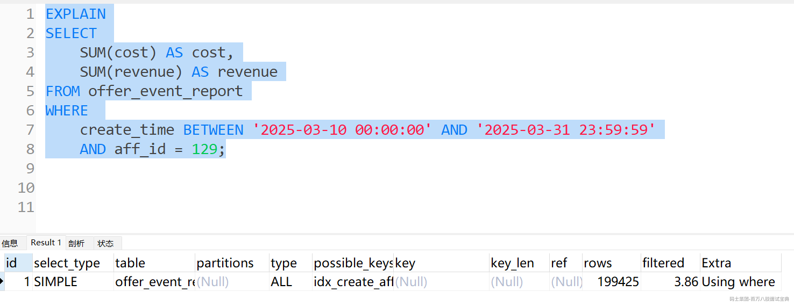

缩小查询范围，再执行计划分析（发现走索引）

```plain
EXPLAIN
SELECT 
    SUM(cost) AS cost,
    SUM(revenue) AS revenue
FROM offer_event_report
WHERE 
    create_time BETWEEN '2025-03-30 00:00:00' AND '2025-03-31 23:59:59'
    AND aff_id = 129;
```

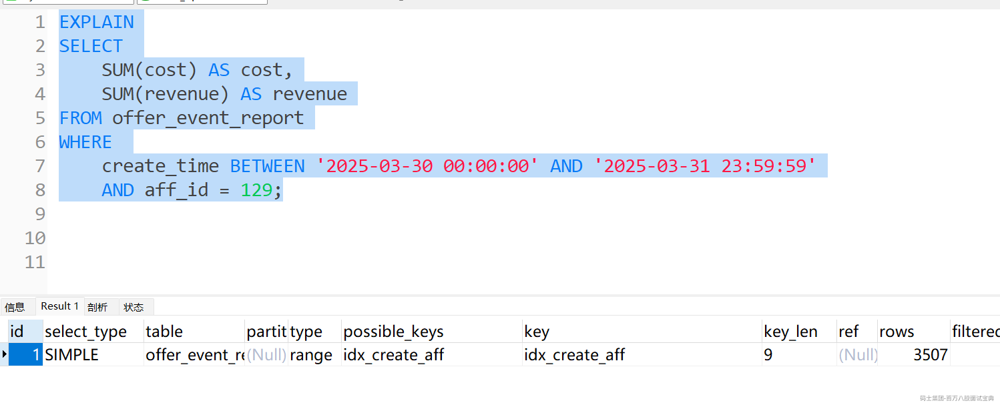

以上现象解释：

1. **优化器成本计算** ：MySQL 优化器会根据统计信息估算不同执行计划的成本

2. **索引选择性** ：当范围数据占比超过表总数据的约20-30%时，优化器可能认为全表扫描更高效

3. **索引覆盖度** ：您的查询只选择 `offer_id`，如果该列被索引完全覆盖，更可能使用索引

4. **统计信息准确性** ：`ANALYZE TABLE` 更新统计信息会影响优化器决策

#### 7、最左匹配原则不是真理(Skip Scan)

还是上面的表数据案例，不过这里一定要是MySQL8 ，不能是MySQL5.7

SQL

```plain
select offer_id
from offer_event_report where
create_time between '2025-03-10 00:00:00' and '2025-03-31 23:59:59';
```

按照联合索引的**最左匹配原则**，这里应该使用不到联合索引（使用复合索引时，查询条件必须从索引的最左列开始，否则索引可能无法被充分利用）

如图：

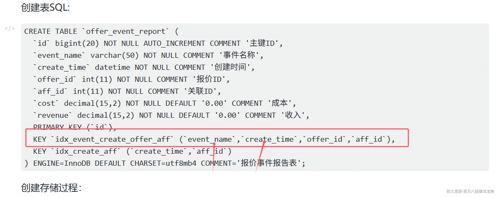

SQL执行计划分析

```plain
EXPLAIN
select offer_id
from offer_event_report where
create_time between '2025-03-10 00:00:00' and '2025-03-31 23:59:59';
```

发现使用到了联合索引：

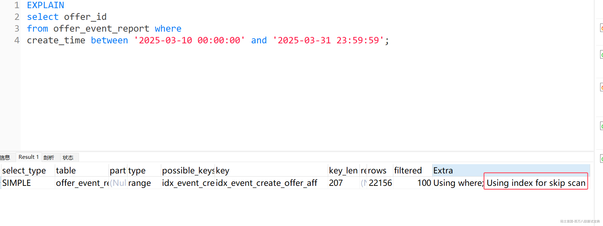

这个是**Skip Scan** ：这是MySQL 8.0引入的一种优化技术，允许在某些情况下即使查询条件不满足最左前缀匹配原则，也能使用索引。

当复合索引的第一列有少量不同的值(低基数)时，MySQL可以：

- 先枚举第一列的不同值

- 然后对每个值使用索引的剩余部分进行范围扫描

**Skip Scan适用条件**

- 复合索引的第一列基数较低(不同值较少)

- 查询条件包含了索引中第一列之后的列

- 优化器认为Skip Scan比全表扫描更高效

`Using index for skip scan`表示查询没有完全遵循最左匹配原则，MySQL找到了一种折衷方法来部分使用索引。
