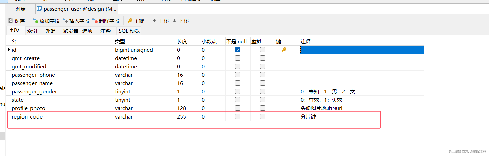
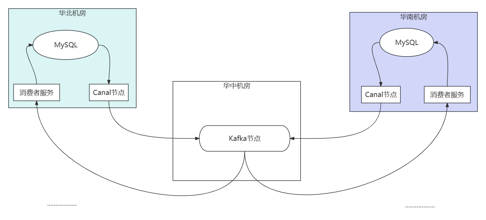
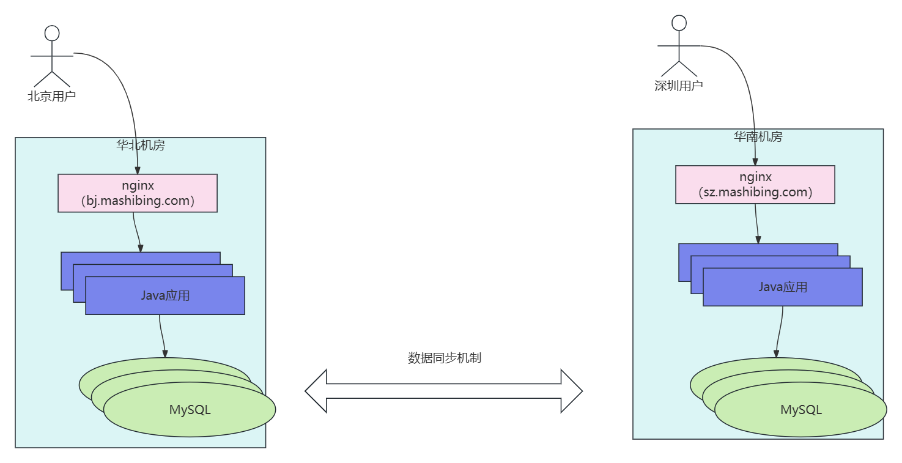
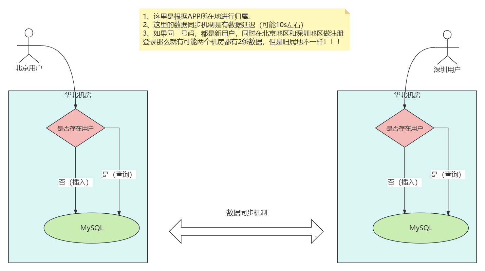
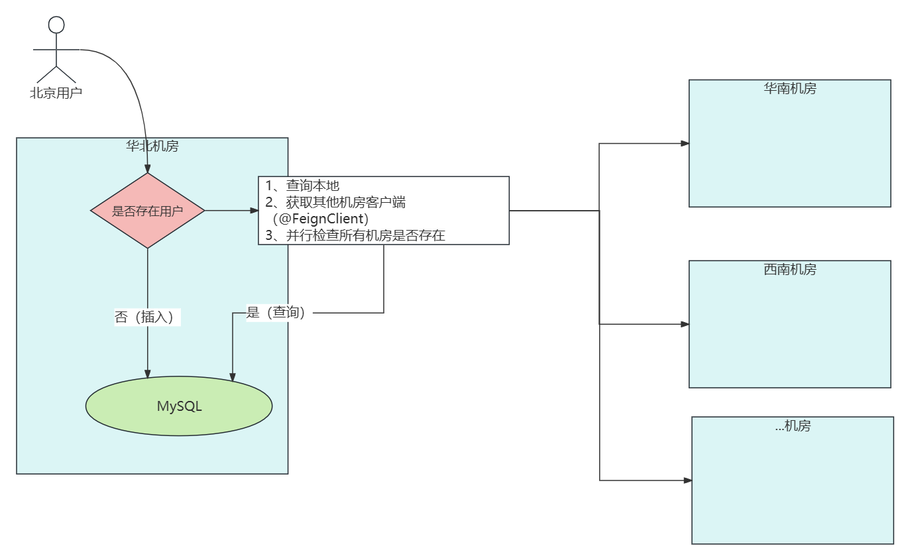

# 1、高并发架构设计的前置知识

该课程学习的技术要求：

javase，spring，springboot，springcloudalibaba，mysql，mybatis，redis，飞滴出行网约车，MQ

# 2、三高架构之用户系统设计与实现

本课程主要是基于飞滴出行网约车这个项目案例，然后在此基础上针对三高（高并发、高可用、高扩展性）做了的改造，里面涉及到的代码改造点也有可能会存在问题（不用去纠结存在的问题），多多反馈老师，我们后续课程修复即可。

## 2.1、用户数据存储架构--设计

飞滴出行网约车项目，假设这个项目达到了上亿的用户，那么用户系统的数据库就有以下的设计方式。

- 单库

- 多个库单机房集群

- 多个库多机房非集群（推荐）

- 多个库多机房彼此无关

## 飞滴出行网约车项目实践

**推荐采用多个库多机房非集群！！**

**地理位置分片** ：按照用户所在地区进行数据分片，每个机房负责特定地理区域的用户数据

### 数据存储具体合理实现：

中心机房（3-5个）：每个覆盖多个省份。

然后核心设计就是每一个中心机房都有独立的数据库（比如一台主mysql，2台从mysql），然后都需要保存全量数据（至少是全量的用户数据：乘客，司机），然后利用Canal来做数据库之间的数据同步。

- **MySQL主实例** ：产生原始Binlog

- **Canal集群** ：实时解析和转发Binlog

- **Kafka消息队列** ：跨机房数据传输通道

- **数据校验服务** ：定期比对数据一致性

这种方式通过Binlog+Kafka的成熟组合实现跨机房同步，配合完善的监控和校验机制，可保证数据最终一致性在5秒内达成，满足网约车业务对数据实时性的要求。

## 飞滴出行网约车项目实践--改造

### 1、MySQL分库分表方案

基于这个项目达到了上亿的用户，然后每个机房都保存了全量数据，所以这里必须要进行分库分表的处理。

#### 水平分库分表策略

**按地区分片** ：

- 例如：user\_db\_{region\_id}.user\_table\_{hash(user\_id)%N}

- 优点：符合业务场景，同地区查询效率高（一般建立）

- 缺点：可能存在热点地区数据倾斜

**按用户ID哈希分片** ：

- 优点：数据分布均匀

- 缺点：跨地区查询效率低

**具体建议**

- 一级分片：按地区(如华北、华东等)分库

- 二级分片：在库内按用户ID哈希分表(如16/32/64张表)

- 使用中间件(如ShardingSphere、MyCat)或自研路由层管理分片

### 2、 用户数据MySQL分库分表存储架构--代码

以《飞滴出行网约车项目-进阶版》

<https://www.mashibing.com/subject/1?courseNo=2420&courseVersionId=3297&activeNav=1>

这个里面的代码为基础改造：

1、乘客表 中加入分片键。



2、代码改造点：

service-passenger-user工程下

1、maven引入shardingsphere

```plain
  <!--分库分表shardingsphere-->
        <dependency>
            <groupId>org.apache.shardingsphere</groupId>

            <artifactId>sharding-jdbc-spring-boot-starter</artifactId>

            <version>4.0.1</version>

        </dependency>

```

2、对应的代码修改：

```plain
package com.mashibing.servicepassengeruser.service;

import org.apache.shardingsphere.api.sharding.standard.PreciseShardingAlgorithm;
import org.apache.shardingsphere.api.sharding.standard.PreciseShardingValue;

import java.util.Collection;

public class RegionPreciseShardingAlgorithm implements PreciseShardingAlgorithm<String> {
    @Override
    public String doSharding(Collection<String> availableTargetNames,
                             PreciseShardingValue<String> shardingValue) {
        // 根据region_code选择数据源
        String regionCode = shardingValue.getValue();
        return availableTargetNames.stream()
                .filter(name -> name.equals(regionCode))
                .findFirst()
                .orElseThrow(() -> new IllegalArgumentException("无效分片键"));
    }
}
```

配置文件：application.yml

```plain
  shardingsphere:
    datasource:
      names: bj,sh
      bj:
        type: com.zaxxer.hikari.HikariDataSource
        jdbc-url: jdbc:mysql://bj-db:3306/user_db
        username: root
        password: password
      sh:
        type: com.zaxxer.hikari.HikariDataSource
        jdbc-url: jdbc:mysql://sh-db:3306/user_db
        username: root
        password: password

    sharding:
      tables:
        passenger_user:
          actual-data-nodes: bj.passenger_user_$->{0..15},sh.passenger_user_$->{0..15}
          database-strategy:
            standard:
              sharding-column: region_code
              precise-algorithm-class-name: com.mashibing.servicepassengeruser.service.RegionPreciseShardingAlgorithm
          table-strategy:
            inline:
              sharding-column: passenger_phone
              algorithm-expression: passenger_user_$->{passenger_phone.hashCode() % 16}
```

UserService

```plain
public ResponseResult loginOrRegister(String passengerPhone){
        System.out.println("user service被调用，手机号：" + passengerPhone);

        // 1. 获取地区码（根据手机号前几位或IP判断）,这里可以先这么写，比较好的方式是前端送入用户所在地区，然后这里获取
        String regionCode = getRegionCodeByPhone(passengerPhone);

        // 2. 构建查询条件（包含分片键）
        Map<String, Object> map = new HashMap<>();
        map.put("passenger_phone", passengerPhone);
        map.put("region_code", regionCode); // 必须包含分片键

        List<PassengerUser> passengerUsers = passengerUserMapper.selectByMap(map);

        if (passengerUsers.isEmpty()) {
            PassengerUser passengerUser = new PassengerUser();
            passengerUser.setPassengerName("张三");
            passengerUser.setPassengerGender((byte) 0);
            passengerUser.setPassengerPhone(passengerPhone);
            passengerUser.setState((byte) 0);
            passengerUser.setRegionCode(regionCode); // 设置分片键

            LocalDateTime now = LocalDateTime.now();
            passengerUser.setGmtCreate(now);
            passengerUser.setGmtModified(now);

            passengerUserMapper.insert(passengerUser);
        }

        return ResponseResult.success();
    }

    /**
     * 根据手机号查询用户信息
     * @param passengerPhone
     * @return
     */
    public ResponseResult getUserByPhone(String passengerPhone) {
        // 1. 获取地区码（与注册时逻辑一致）
        String regionCode = getRegionCodeByPhone(passengerPhone);

        // 2. 构建查询条件（必须包含分片键）
        Map<String, Object> map = new HashMap<>();
        map.put("passenger_phone", passengerPhone);
        map.put("region_code", regionCode); // 必须包含分片键

        List<PassengerUser> passengerUsers = passengerUserMapper.selectByMap(map);

        if (passengerUsers.isEmpty()) {
            return ResponseResult.fail(
                    CommonStatusEnum.USER_NOT_EXISTS.getCode(),
                    CommonStatusEnum.USER_NOT_EXISTS.getValue()
            );
        } else {
            PassengerUser passengerUser = passengerUsers.get(0);
            return ResponseResult.success(passengerUser);
        }
    }

    // 根据手机号获取地区码的示例方法
    private String getRegionCodeByPhone(String phone) {
        // 实际项目中可根据手机号前几位或IP地址判断地区
        String prefix = phone.substring(0, 3);
        // 示例：北京010，上海021
        if (prefix.equals("010")) {
            return "bj";
        } else if (prefix.equals("021")) {
            return "sh";
        }
        return "bj"; // 默认返回北京
    }
```

### 3、多机房数据同步--实现

- **MySQL主实例** ：产生原始Binlog

- **Canal集群** ：实时解析和转发Binlog

- **Kafka消息队列** ：跨机房数据传输通道

- **数据校验服务** ：定期比对数据一致性

这种方式通过Binlog+Kafka的成熟组合实现跨机房同步，配合完善的监控和校验机制，可保证数据最终一致性在5秒内达成，满足网约车业务对数据实时性的要求。



具体代码就不去手写实现了。

因为Canal就是一个工具，

<https://www.mashibing.com/subject/1?courseNo=513&courseVersionId=1380&activeNav=1>

具体的Kafka消费者的话，我们对应课程里面也有。

### 4、多机房数据实现---数据分流DNS

具体DNS的原理：《分布式解决方案与实战/ DNS与IP解析全流程》

<https://www.mashibing.com/study?courseNo=2414&sectionNo=99490&systemId=1&courseVersionId=3291>

具体实现思路也很简单。无论是浏览器访问，还是APP访问，可以在前端做代码处理，也就是后端要访问的服务器的域名是可以根据用户的地理位置来变化的。

比如 bj.mashibing.com ，sz.mashibing.com两个子域名就可以代表两个机房的域名入口。

然后通过DNS解析到具体的IP，就会分别到华北机房，华南机房。

然后就可以实现多机房的数据分流DNS，这些改造也很简单，只需要在访问后端的的接口地址根据用户所在地区取最近的即可。



### 5、多机房数据实现---同一用户多地同时注册问题！



做了分库分表的处理：会导致有两条数据，归属地不同，数据同步的话容易出问题。

没有做分库分表的处理：会导致有两条一样的数据，数据同步直接出问题。

#### 处理方案

在这里处理方式很简单，如果本地检查不到用户，则需要检查所有的机房，做一次其他机房的用户存在校验。

大致思路如下：



这里不推荐使用分布锁来处理：  
原因很简单，你这把锁要上到哪里？因为是多机房数据中心，不可能每个机房都上锁，非常影响性能，如果是用一个统一数据中心，地理位置导致的延迟等问题依然会存在。

另外还有一点，就是如果采用分库分表的结构，数据的异步同步不会直接导致同步数据的问题，而只是会发生多条数据的问题，这种情况在同步数据的时候做一些额外处理即可，并不会影响整体，对性能也影响不大。

## 社交类系统--好友关系

### 1、如何设计表

- 用户表(User)：存储用户的基本信息，包括用户ID、昵称、头像、性别、年龄等；

- 好友关系表（Friendship Table）：存储好友关系，包括好友关系的ID、用户ID和好友ID。

- 关注关系表（Following Table）：存储用户的关注关系，包括关注关系的ID、用户ID和关注对象ID。

- 粉丝关系表（Follower Table）：存储用户的粉丝关系，包括粉丝关系的ID、用户ID和粉丝ID。

- 好友表(Friend)：存储好友关系的基本信息，包括好友关系ID、好友A的用户ID、好友B的用户ID、好友关系状态等；

- 好友分组表(Group)：存储好友分组的基本信息，包括分组ID、分组名称、所属用户ID等；

- 好友关系和分组的中间表(GroupFriend)：存储好友和分组之间的关系，包括中间表ID、好友ID、分组ID等。

### 2、常用SQL

用户基础查询

```plain
-- 查询用户基本信息
SELECT * FROM user WHERE id = ?;

-- 通过手机号查询用户
SELECT * FROM user WHERE phone = ?;

-- 按条件搜索用户
SELECT * FROM user 
WHERE nickname LIKE ? 
AND gender = ? 
AND age BETWEEN ? AND ?
ORDER BY create_time DESC
LIMIT ? OFFSET ?;
```

关注/粉丝关系查询

```plain
-- 查询用户关注的人列表
SELECT u.id, u.nickname, u.avatar 
FROM following f 
JOIN user u ON f.following_id = u.id 
WHERE f.user_id = ? 
ORDER BY f.create_time DESC;

-- 查询用户的粉丝列表
SELECT u.id, u.nickname, u.avatar 
FROM follower f 
JOIN user u ON f.follower_id = u.id 
WHERE f.user_id = ? 
ORDER BY f.create_time DESC;

-- 检查A是否关注了B
SELECT COUNT(*) FROM following 
WHERE user_id = ? AND following_id = ?;

-- 查询互相关注的用户(好友)
SELECT u.id, u.nickname, u.avatar 
FROM following f1
JOIN following f2 ON f1.user_id = f2.following_id AND f1.following_id = f2.user_id
JOIN user u ON f1.following_id = u.id
WHERE f1.user_id = ?;
```

好友关系查询

```plain
-- 查询用户的好友列表
SELECT u.id, u.nickname, u.avatar, f.remark, f.create_time 
FROM friend f 
JOIN user u ON f.friend_id = u.id 
WHERE f.user_id = ? AND f.status = 1 
ORDER BY f.update_time DESC;

-- 查询待确认的好友请求
SELECT u.id, u.nickname, u.avatar, f.create_time 
FROM friend f 
JOIN user u ON f.user_id = u.id 
WHERE f.friend_id = ? AND f.status = 0;

-- 查询好友关系状态
SELECT status FROM friend 
WHERE (user_id = ? AND friend_id = ?) 
OR (user_id = ? AND friend_id = ?);

-- 统计好友数量
SELECT COUNT(*) FROM friend 
WHERE (user_id = ? OR friend_id = ?) AND status = 1;
```

好友分组查询

```plain
-- 查询用户的所有分组
SELECT * FROM friend_group 
WHERE user_id = ? 
ORDER BY create_time;

-- 查询分组中的好友
SELECT u.id, u.nickname, u.avatar, f.remark 
FROM friend_group_relation r
JOIN friend f ON r.friend_id = f.id
JOIN user u ON (f.user_id = u.id OR f.friend_id = u.id) AND u.id != ?
WHERE r.group_id = ? AND f.status = 1;

-- 统计每个分组的好友数量
SELECT g.id, g.name, COUNT(r.friend_id) as friend_count 
FROM friend_group g 
LEFT JOIN friend_group_relation r ON g.id = r.group_id 
WHERE g.user_id = ? 
GROUP BY g.id;
```

社交关系操作SQL

```plain
-- 添加关注
INSERT INTO following (user_id, following_id) VALUES (?, ?);

-- 取消关注
DELETE FROM following WHERE user_id = ? AND following_id = ?;

-- 发送好友请求
INSERT INTO friend (user_id, friend_id, status) VALUES (?, ?, 0);

-- 接受好友请求
UPDATE friend SET status = 1, update_time = NOW() 
WHERE user_id = ? AND friend_id = ?;

-- 拒绝好友请求
UPDATE friend SET status = 2, update_time = NOW() 
WHERE user_id = ? AND friend_id = ?;

-- 删除好友
DELETE FROM friend 
WHERE (user_id = ? AND friend_id = ?) 
OR (user_id = ? AND friend_id = ?);

-- 创建分组
INSERT INTO friend_group (user_id, name) VALUES (?, ?);

-- 将好友添加到分组
INSERT INTO friend_group_relation (group_id, friend_id) VALUES (?, ?);
```

综合社交信息查询

```plain
-- 查询用户社交概况(关注数、粉丝数、好友数)
SELECT 
  (SELECT COUNT(*) FROM following WHERE user_id = ?) AS following_count,
  (SELECT COUNT(*) FROM follower WHERE user_id = ?) AS follower_count,
  (SELECT COUNT(*) FROM friend WHERE (user_id = ? OR friend_id = ?) AND status = 1) AS friend_count;

-- 查询可能认识的人(好友的好友)
SELECT DISTINCT u.id, u.nickname, u.avatar 
FROM friend f1
JOIN friend f2 ON (f1.friend_id = f2.user_id OR f1.friend_id = f2.friend_id) 
JOIN user u ON (u.id = f2.user_id OR u.id = f2.friend_id) AND u.id != ?
WHERE (f1.user_id = ? OR f1.friend_id = ?) 
AND u.id NOT IN (
  SELECT friend_id FROM friend WHERE user_id = ? AND status = 1
  UNION
  SELECT user_id FROM friend WHERE friend_id = ? AND status = 1
)
LIMIT ?;
```

注意这种统计一般情况下可能不会使用sql来计算了。

很多统计的
