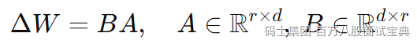
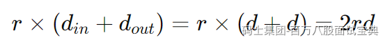

#### 一、LoRA 原理概要

LoRA（Low‑Rank Adaptation）通过低秩分解的方式，将预训练模型中的某个权重矩阵 W0的微调更新 ΔW分解为两个较小矩阵 A 和 B 的乘积：

训练阶段仅微调 A 和 B，保持原始 W0 冻结（Frozen）。推理时将 ΔW 加回 W0，合并后无额外延迟或模型结构变动。

B

#### 二、参数量计算方法

针对某一层（如注意力层的 query 或 value 投影）：

- 假设输入维度和输出维度均为 d，共使用 r 作为秩值，
- 那么该层可训练的参数为：  
  

若微调多层（如 Transformer 的 32 层，每层包括 q\_proj 和 v\_proj）：

总可训练参数数≈ 2r d × L

例如：对于 d=4096 r=8, L=32：参数量≈2×8×4096×32=2.1M  
相较于 70 B 参数模型，LoRA 参数仅占约 0.03%。

S

#### 三、秩 r 的选择经验

- 通常根据任务复杂度、显存限制决定：

- **r=4–8**：适用于对话生成、文本风格调整等轻量任务；
- **r=16–32**：适用于复杂语法、跨模态任务，如代码生成、医疗诊断；

- 同时常将缩放系数 α设置为 2r或 r，以保证梯度稳定性与效果平衡。

M

#### 四、对比全参数微调

- 以 7 B 模型为例，全参数微调需要训练数十亿参数，显存数十 GB；
- LoRA 只需训练数百万参数，显存开销大幅下降；
- 尤其 optimizer 状态、梯度存储量显著减少，使训练更快、更节省显存。

### **总结**

- LoRA 利用 **低秩矩阵分解** 实现微调，**冻结原模型，仅微调小矩阵**；
- **参数量计算公式**：2×r×d×L；
- **秩 r** 需针对任务复杂度与显存约束进行经验选择；
- LoRA 在**参数效率、显存占用和训练速度**上，比较全参数微调具显著优势。
