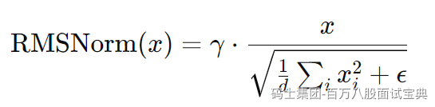
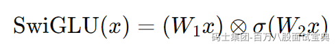

在 LLaMA 架构中，相比于标准 Transformer，Meta 引入了两个关键性优化：**RMSNorm** 和 **SwiGLU 激活函数**，以显著改善训练效率与模型性能。

M

### 1. RMSNorm 的原理与优势

**工作机制**：RMSNorm（Root Mean Square Normalization）仅基于输入向量的均方根值进行归一化：

它舍弃了 LayerNorm 中对均值的中心化处理，只保留缩放归一化属性。([turn0search5]、[turn0academia20])

- **区别与优势比较**：

|  |  |  |  |
| --- | --- | --- | --- |
| **方法** | **归一化方式** | **计算成本** | **数值稳定性** |
| LayerNorm | 中心化 + 缩放 | 较高 | 高 |
| RMSNorm | 仅缩放（无中心化） | 计算简化，快约 7%–64% | 在深层训练中表现稳定，可防梯度衰减 |

- **工程意义**：RMSNorm 大幅减少计算开销，同时通过 “pre‑normalization”（即在子层输入层进行归一化）稳定梯度流，使得更深层模型训练更加稳定、收敛更快。

S

### 2. SwiGLU 激活函数的机理与改进

**定义形式**：

SwiGLU（Swish-Gated Linear Unit）结合了 Swish 激活函数与门控结构：

通常简写为：`left × sigmoid(right)`，其中 `sigmoid` 引入门控机制。

- **与 GLU、GELU 等的区别**：

- **参数效率提升**：相较于标准 GLU、GELU 结构，SwiGLU 只需 2/3 隐藏维度即可实现同等门控效果，参数量更少。
- **非线性表达能力更强**：Swish 提供平滑非单调性质，使得模型在学习更复杂函数时更加高效；Reddit 社区指出 SwiGLU 可以模拟多项式形式，比如平方运算，从而提升表达能力。

- **实际表现**：在 LLaMA 模型中采用 SwiGLU 后，相比 GELU 或 ReLU，训练速度更快、收敛更稳，语言建模性能提升。

B

## 对比

- **训练稳定性提升**：RMSNorm + pre-norm 设计避免梯度消失或爆炸，使训练收敛更稳定。
- **参数与计算高效**：SwiGLU 减少参数规模，同时通过门控机制增强表现力，提高每次迭代效率。
- **性能对比简表**：

|  |  |  |  |
| --- | --- | --- | --- |
| **模块** | **传统选择** | **LLaMA 改进** | **作用/效果** |
| LayerNorm | LayerNorm | RMSNorm | 计算量更少，训练更稳定 |
| 激活函数 | GELU / ReLU | SwiGLU | 参数量更少，表达能力增强，训练快 |

## 示例面试回答

“在 LLaMA 架构中，Meta 主要做了两项关键改进：**RMSNorm** 与 **SwiGLU**。  
`x * sigmoid(x)` 结构，且参数量只需传统 GLU 的约 2/3，但表达能力更强，训练更快。  
实践中，采用这两项改进后，LLaMA 在标准 benchmark 上超越 GPT-3，且训练成本更低、性能更稳定。”
