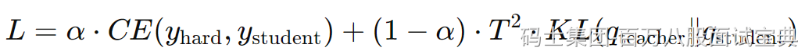

知识蒸馏是一种经典的模型压缩技术，通过将大模型（教师模型）的行为知识迁移给小模型（学生模型），使得学生模型能以更少的计算资源实现接近教师模型的性能目标。它允许我们在性能与资源之间取得平衡，是 AI 工程中提升效率的重要手段。

核心原理如下：首先教师模型输出的是一个概率分布（soft labels），学生模型不仅学习真实标签（hard labels），同时通过 KL 散度模仿教师的输出分布。通过设置温度 T，软标签更平滑，有助于学生捕捉类别间的相似性。通常损失形式为：

这种组合训练方式能让学生模型学习到教师模型未显式编码的隐性知识。

M

## 适用场景与价值

知识蒸馏尤其适用于以下几类场景：

- **边缘设备部署或 TinyML**：当计算资源／内存受限（如 IoT 设备、手机、无人机）时，使用蒸馏模型可显著降低系统负载，同时保证响应速度与精度。
- **领域知识迁移**：例如在特定垂直领域（如金融、医疗、法律）中，通过将领域强教师模型的知识迁移给学生模型，可以在有限数据下实现高性能。知识蒸馏是一种有效的数据效率提升技术。
- **分布式或联邦学习**：在设备资源异构或隐私敏感场景中，教师–学生架构支持在边缘设备与中心服务器间协同蒸馏，实现模型轻量部署与协作训练。
- **模型压缩与推理加速**：在大模型即服务场景（MaaS）中，将大型模型蒸馏成小模型可降低推理延迟和成本，同时保留大模型性能的绝大部分。

S

## 常见蒸馏方式与差异

知识蒸馏可分为以下类型：

- **离线蒸馏（Offline KD）**：教师模型先训练完毕，学生模型仅通过模拟教师输出学习知识；
- **在线蒸馏 / 联合蒸馏**：学生与教师同时训练，或多个模型互为教师；
- **自蒸馏（Self‑distillation）**：同一模型在不同阶段互相迁移；
- **响应式蒸馏（Response-based）**：以输出概率学习为主；
- **特征蒸馏（Feature-based）**：学生模仿教师中间层表示；
- **关系蒸馏（Relation-based）**：保留样本间的结构或相似性关系。

B

## 示例项目场景

在智能家居摄像头的异物识别系统中，通过教师模型（如视觉大模型）的 soft labels 训练出一个仅需少 MB 内存的学生模型进行本地部署。学生模型通过联合软标签与硬标签训练，温度设置为 T≈5。结果显示系统漏报率降至低于3%，误报率低于5%，模型体积缩小约 200 倍，显著降低边缘设备负载及能耗。

在金融合规问答场景中，以大模型生成政策解读并蒸馏为领域小模型部署在企业端。通过动态温度调整（如复杂政策设 T≈10、简单场景设 T≈2）与关键词权重增强，学生模型响应时间缩短90%以上，准确率达 95%。这些设计方式与目标函数结构充分发挥了软标签与领域逻辑的组合优势。
