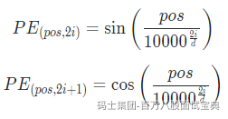

**绝对位置编码（Absolute Positional Encoding）** 是一种为序列中的每个元素分配一个固定位置信息的技术，通常用于 Transformer 模型或其他需要处理序列数据的深度学习模型中。它的目的是为模型提供序列中元素的绝对位置信息，从而弥补模型本身无法理解序列顺序的缺陷。

###### **为什么需要绝对位置编码？**

Transformer 模型的核心是自注意力机制（Self-Attention），它可以捕捉序列中元素之间的全局依赖关系，但它本身是 **排列不变（Permutation Invariant）** 的。也就是说，如果输入序列的顺序被打乱，Transformer 的输出不会改变。因此，模型无法区分序列中元素的顺序，例如句子中单词的位置。

绝对位置编码通过为每个元素分配一个固定的位置信息，让模型能够理解序列的顺序。

###### **绝对位置编码的实现**

绝对位置编码通常是一个与输入序列维度相同的向量，直接加到输入嵌入（Input Embedding）上。以下是常见的实现方式：

**正弦和余弦函数编码（Sinusoidal Positional Encoding）**

这是 Transformer 模型（如 BERT、GPT）中使用的经典方法。位置编码通过正弦和余弦函数生成，公式如下：



其中：  
• *p**o**s* 是元素在序列中的绝对位置（从 0 开始）。  
• *i* 是维度索引（从 0 到 *d*/2−1）。  
• *d* 是嵌入维度。

这种编码的特点是：  
• 能够捕捉绝对位置信息。  
• 对于较长的序列，位置编码的值会逐渐衰减，符合实际语言中远距离依赖逐渐减弱的特点。

**可学习的位置编码（Learned Positional Encoding）**

绝对位置编码也可以作为可学习的参数，通过训练得到。这种方法在某些任务中表现更好，但需要更多的计算资源和训练数据。

###### **绝对位置编码的作用**

1. **引入绝对位置信息**：让模型能够区分序列中元素的绝对位置。
2. **捕捉相对位置**：正弦和余弦编码能够通过数学关系捕捉元素之间的相对位置关系。
3. **泛化到长序列**：正弦和余弦编码具有良好的泛化能力，即使序列长度超过训练时的最大长度，也能生成合理的编码。

###### **绝对位置编码在 Transformer 中的应用**

在 Transformer 模型中，绝对位置编码通常直接加到输入嵌入上：

*X*=Input Embedding+Positional Encoding

这样，模型在计算自注意力时，既能捕捉语义信息，也能捕捉位置信息。

###### **示例代码**

以下是一个简单的正弦和余弦绝对位置编码的 Python 实现：

```python
import numpy as np

def positional_encoding(max_seq_len, d_model):
    position = np.arange(max_seq_len)[:, np.newaxis]
    div_term = np.exp(np.arange(0, d_model, 2) * -(np.log(10000.0) / d_model))
  
    pe = np.zeros((max_seq_len, d_model))
    pe[:, 0::2] = np.sin(position * div_term)
    pe[:, 1::2] = np.cos(position * div_term)
  
    return pe

# 示例：生成一个长度为 10，维度为 8 的绝对位置编码
pe = positional_encoding(10, 8)
print(pe)
```

###### **绝对位置编码 vs. 相对位置编码**

• **绝对位置编码**：为每个元素分配一个固定的位置信息，强调元素的绝对位置。  
• **相对位置编码**：为元素之间的相对距离分配信息，强调元素之间的相对关系。

相对位置编码通常用于某些任务（如机器翻译），而绝对位置编码是 Transformer 模型中的默认选择。

###### **总结**

绝对位置编码是 Transformer 模型中的关键组件，用于为模型提供序列的绝对位置信息。正弦和余弦编码是最常用的方法，因为它能够捕捉绝对位置关系并具有良好的泛化能力。通过绝对位置编码，Transformer 模型能够更好地处理序列数据，如自然语言文本。
