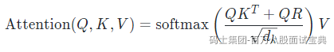

相对位置编码（Relative Position Encoding）是一种在自然语言处理（NLP）中用于捕捉序列中元素之间相对位置关系的技术。它通常用于Transformer模型等基于自注意力机制（Self-Attention）的架构中，以增强模型对序列中元素位置信息的理解。

###### 背景

在标准的Transformer模型中，位置信息是通过绝对位置编码（Absolute Position Encoding）引入的，即在输入序列的每个元素上添加一个表示其绝对位置的向量。然而，绝对位置编码可能无法很好地捕捉元素之间的相对位置关系，而这种关系在许多任务中（如机器翻译、文本生成等）是非常重要的。

###### 相对位置编码的核心思想

相对位置编码的核心思想是直接建模序列中元素之间的相对位置关系，而不是仅仅依赖绝对位置。具体来说，它通过引入一个相对位置矩阵来表示序列中每对元素之间的相对距离，并将这些信息融入到注意力机制中。

###### 实现方式

相对位置编码的实现方式有多种，以下是其中一种常见的实现方法：

1. **相对位置矩阵**：  
   • 定义一个相对位置矩阵 *R*，其中 *R**i*,*j* 表示序列中第 *i* 个元素和第 *j* 个元素之间的相对位置。例如，*R**i*,*j*=*j*−*i*。  
   • 这个矩阵可以用来表示元素之间的相对距离。

**融入注意力机制**：  
• 在计算注意力分数时，除了标准的查询（Query）和键（Key）的点积外，还引入相对位置信息。例如，可以将相对位置矩阵 *R* 与查询和键的表示相结合，生成一个考虑了相对位置的注意力分数。  
• 具体公式可能如下：

其中 *Q* 是查询矩阵，*K* 是键矩阵，*V* 是值矩阵，*d**k* 是键的维度，*R* 是相对位置矩阵。

###### 优点

• **更好的位置信息捕捉**：相对位置编码能够更直接地捕捉序列中元素之间的相对位置关系，这对于理解长距离依赖和局部结构非常重要。  
• **更强的泛化能力**：由于相对位置编码不依赖于具体的绝对位置，因此在处理不同长度的序列时具有更好的泛化能力。

###### 应用

相对位置编码已经被广泛应用于各种NLP任务中，如机器翻译、文本生成、语言模型等。它尤其在处理长序列任务时表现出色，因为长序列中的绝对位置信息可能不如相对位置信息重要。

###### 总结

相对位置编码是一种在Transformer等模型中引入相对位置信息的技术，通过直接建模序列中元素之间的相对位置关系，增强了模型对序列结构的理解能力。它是对绝对位置编码的一种有效补充，在许多NLP任务中都表现出优异的性能。
